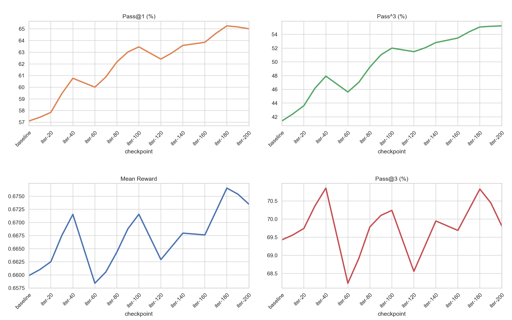
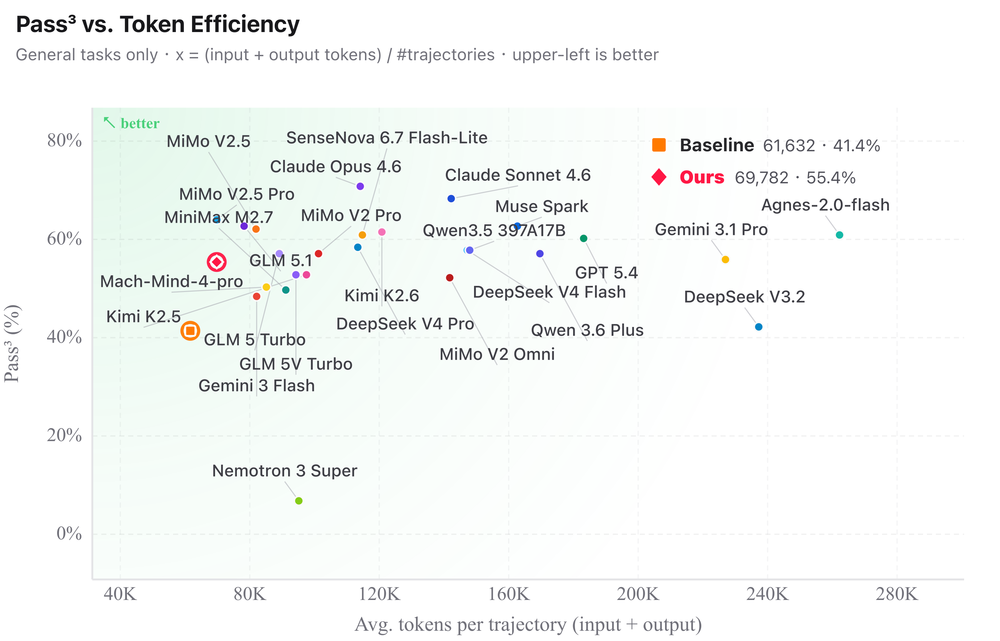
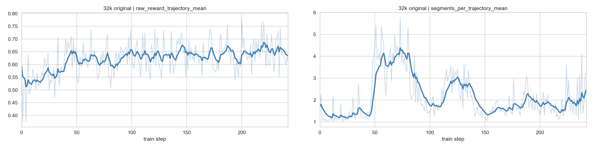
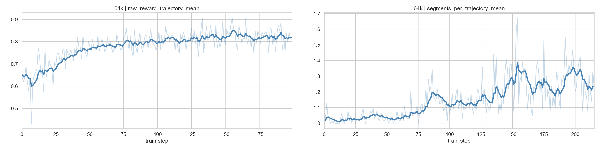

# Blackbox Dressage Claw 实验（使用 OpenClaw）

本实验验证了 **Dressage 具备有效训练 claw 类型 agent 任务的能力**，并能通过黑盒 RL 显著提升模型性能。我们在 [Dressage Claw](https://huggingface.co/datasets/huang3eng/Dressage-Claw) 数据集上训练 [Qwen3.6-35B-A3B](https://huggingface.co/Qwen/Qwen3.6-35B-A3B)，以 [OpenClaw](https://openclaw.ai/) 作为 agent。从结果看，这套流水线能处理多样化、多服务的 agent 环境，并带来实质性提升。

## 结果概览

最终用 64k 上下文训练出的模型，在未见过的 ClawEval 任务上取得了明确提升。在 [ClawEval](https://claw-eval.github.io) **general** split 上，最终 checkpoint（iter 200）的 mean score 持平微升（**0.660** → **0.670**），Pass@3 与 baseline 基本持平（**69.4** → **68.8**）；而 Pass@1 与 Pass^3 具有显著提升，其中Pass@1 从 **57.1** 上升至 **64.8**（峰值 **66.7**，iter 180），Pass^3 从 **41.4** 大幅提升至 **55.4**（峰值 **56.7**，iter 180）。每个任务运行 3 次独立试验。



在公开 ClawEval **general** split 榜单上，训练后 checkpoint 的 Pass^3 为 **55.4**，介于 Gemini 3.1 Pro 与 GPT 5.4（**60.2**）之间，相较于 baseline（**41.4**）提升 14 个百分点；每条轨迹平均 token 消耗约 **68K**，与 baseline（约 62K）基本持平。



## 下载并转换数据

Dressage Claw 数据集包含 **441 个 agent 任务**，覆盖通信（邮件、消息）、金融（费用报告、银行对账单）、运维（库存、采购、事件管理）、生产力（日历、待办、笔记、文档）等真实世界领域。每个任务包含一条自然语言指令，配合 mock 服务环境、可选的 MCP 工具和 rubric-based grader。

数据集已在 Hugging Face 上开源，地址为 **[`huang3eng/Dressage-Claw`](https://huggingface.co/datasets/huang3eng/Dressage-Claw)**。

每个任务位于 `tasks/<task_id>/` 目录下，结构如下：

```text
tasks/<task_id>/
├── task.json              # 任务元数据、grader 配置、文件映射
├── task/
│   ├── prompt.md          # 任务指令（prompt 文本）
│   ├── workspace/         # 工作区文件
│   ├── scripts/           # setup.sh、start_services.sh、stop_services.sh
│   ├── tools/             # MCP 工具规格 JSON 文件
│   ├── services/          # Mock 服务配置
│   └── runtime/           # 辅助脚本（MCP、trace、judge 补丁）
└── grader/
    └── run.sh             # Grader 入口（输出 overall_score JSON）
```

转换器跟踪以下每任务特性：

| 特性 | 描述 |
| :------ | :---------- |
| `has_services` | 任务在 agent 运行前启动 mock 服务（邮件、日历、CRM 等） |
| `has_llm_judge` | 任务含 LLM-judge rubric |
| `has_tools` | 任务声明 agent 可以调用的 MCP 工具 |
| `has_system_prompt` | 任务提供自定义 system prompt 前缀 |
| `needs_patch` | 任务 grader/脚本依赖 `patch` 命令（自动安装） |

数据准备脚本为：

```text
examples/data/dressage_claw/prepare_dressage_claw_data.py
```

`prepare_dressage_claw_data.py` 支持读取本地 Parquet 或从 Hugging Face 下载 Parquet，并转为 Dressage 所需的 JSONL 格式。

- 从 Hugging Face 下载（默认方式）：

```bash
python3 examples/data/dressage_claw/prepare_dressage_claw_data.py \
  --output /path/to/restored_dressage_claw
```

- 读取本地 Parquet 文件：

```bash
python3 examples/data/dressage_claw/prepare_dressage_claw_data.py \
  --parquet /path/to/parquet/Dressage-Claw.parquet
```

- 转换已经存在的本地数据集目录：

```bash
python3 examples/data/dressage_claw/prepare_dressage_claw_data.py \
  --dataset-dir /path/to/restored_dressage_claw \
  --output /path/to/jsonl_output
```

转换为 JSONL 时会添加以下字段：

| 字段 | 用途 |
| :---- | :------ |
| `prompt` | 来自 `prompt.md` 的任务指令文本，发送给 OpenClaw |
| `reward_fn` | 设为 `claw_grader`，选择 `dressage.recipes.dressage_claw.reward` |
| `metadata.blackbox_type` | 设为 `openclaw`，使 BlackboxServer 启动 OpenClaw 后端 |
| `metadata.sandbox_image` | E2B 模板名称，默认为 `e2b-dressage-claw-blackbox` |
| `metadata.instance_id`、`task_id` | 用于日志记录和结果分析的可追溯字段 |
| `metadata.before_agent_files` | `task/` 下的所有文件，在 agent 运行前写入任务声明的目标路径（workspace、scripts、tools、services、runtime） |
| `metadata.after_agent_files` | `grader/` 下的 grader 文件，只在 agent 完成后写入任务声明的目标路径 |
| `metadata.system_prompt_file` | 任务的 system prompt 前缀文件在沙箱内的路径（如已声明） |
| `metadata.blackbox_execute_cmds.before_agent` | agent 运行前命令：验证文件注入、映射 workspace 到目标路径、运行 setup、启动服务、注册 MCP 工具 |
| `metadata.blackbox_execute_cmds.after_agent` | agent 运行后命令：注入 grader 文件、修补 LLM judge 配置、生成 trace、停止服务、运行 grader |

调试时可以随机采样：

```bash
# 随机采样 64 个任务
python3 examples/data/dressage_claw/prepare_dressage_claw_data.py \
  --output examples/data/dressage_claw_sample \
  --limit 64
```

## 准备沙箱

我们的实验在内部沙箱系统上运行。为了方便公开复现，本节提供基于公开 Python 镜像的 E2B 参考路径。模板构建器会在 E2B 构建阶段安装 OpenClaw 2026.6.6、BlackboxServer 和任务运行时依赖。

在 Dressage 黑盒训练中，每个沙箱需要同时运行 BlackboxServer 和 OpenClaw。OpenClaw 安装到模板中后从镜像 PATH 解析；BlackboxServer 则装在模板构建器创建的隔离 venv（`/opt/dressage-bbs-venv`）中，从该 venv 启动。任务启动的 mock 服务和 grader 是普通的 Python 脚本，使用沙箱默认的 `python3` 执行；将 BlackboxServer 放在独立 venv 中，避免其依赖与任务侧依赖冲突。

直接使用公开基础镜像构建 E2B 模板：

```bash
E2B_API_KEY=e2b_... \
BUILD_FROM_PUBLIC_IMAGE=1 \
TASK_IMAGE='python:3.11-slim-bookworm' \
TEMPLATE_NAME='e2b-dressage-claw-blackbox' \
python3 examples/data/dressage_claw/build_e2b_blackbox_template.py
```

模板构建器：

1. 从 `python:3.11-slim-bookworm` 开始，并安装 OpenClaw 2026.6.6 和任务侧 Python 依赖。
2. 安装系统依赖（bash、curl、ca-certificates、patch）。
3. 在 `/opt/dressage-bbs-venv` 创建隔离 venv 用于 BlackboxServer，确保任务镜像的 Python 环境不受影响。
4. 将 `blackbox_server` 安装到该 venv 中。
5. 设置启动命令以在端口 `31000` 上启动 BlackboxServer：

   ```bash
   cd /workspace_sandbox
   BBS_HOST=0.0.0.0 BBS_PORT=31000 \
   BBS_RUNTIME_ROOT=/workspace_sandbox/blackbox_server_runtime \
   /opt/dressage-bbs-venv/bin/python -m blackbox_server.main
   ```

启动配置（`BBS_HOST`、`BBS_PORT`、`BBS_RUNTIME_ROOT`）已随模板固化，不要依赖每个沙箱的 `e2b_envs` 来配置服务器启动。

训练前，先对模板做一次冒烟测试：

运行下面的代码前请先设置 `E2B_API_KEY`。

```python
import asyncio
from e2b import AsyncSandbox

async def main():
    sandbox = await AsyncSandbox.create(template="e2b-dressage-claw-blackbox")
    try:
        print(await sandbox.get_host(31000))
        result = await sandbox.commands.run("curl -sf http://127.0.0.1:31000/health")
        print(result.stdout)
    finally:
        await sandbox.kill()

asyncio.run(main())
```

## Reward 设计

Dressage Claw 的 reward 完全来自 grader 文件。Dressage 不预设任何通用 rubric：所有 reward 均由任务自带的 grader 在沙箱内产生，训练端的 reward 函数（`dressage.recipes.dressage_claw.reward.claw_grader`）只做一个轻量的保守解析，读出 grader 输出的 `overall_score`。核心设计取舍包括 grader 隔离、可信的工具调用证据、故障感知评分和连续的 `overall_score`。

### 分阶段 grader 注入与原始工具调用 trace

任务文件（`before_agent_files`）与 grader 文件（`after_agent_files`）是两批独立的文件，且 grader 文件只在会话结束后才写入。评分 spec 并非中性元数据，它包含了期望的 key value、必须工具列表和 judge rubric，实质上就是标准答案。与其事后检测 agent 是否读过 grader，设计直接消除了这种可能：agent 运行期间，沙箱中根本不存在 grader 代码、rubric 和评分数据，从构造上（而非监控上）封堵了黑盒 RL 中最直接的 reward hacking 通道。

Grader 依据的证据同样难以被操纵。Grader 从不询问 agent 做了什么；工具调用证据在 MCP dispatcher 内部记录，每次 `tools/call` 在转发给 mock 服务 HTTP 后端时，把完整的请求、响应、状态和延迟一并写入 `dispatches.jsonl` trace。因此这份 trace 防篡改（反映真实发生的 HTTP 调用，而非 agent 自述），也与 agent 实现无关（换成其他 agent 证据链依然完整），且比单独的 transcript 更丰富：工具响应也进入确定性匹配语料，agent 检索到但未复述的 key value 也算命中。

### 分数构成与连续 reward

`overall_score` 由三部分构成。**确定性部分**（权重 0.5）检查 transcript 和工具轨迹上的 key-value 覆盖以及必须工具的覆盖率，既快速、可复现、零成本，又为 reward 提供零方差的下限。**LLM judge 部分**（权重 0.5）衡量子串匹配无法覆盖的语义维度，如答案质量、推理正确性与干扰项排除；一次合并的 judge 调用基于压缩证据包评估所有 rubric criteria，在训练规模下将 judge 成本与延迟降低数倍（judge 由 **gpt-5.4** API 提供服务）。对禁止工具调用的**安全门**被设计为权重 0 的 `zero_task` 门，而不是带权重的分数项：若给正权重，既会稀释其他标准的占比，也会让 agent 把安全违规当作可承受的小额扣分；而作为门，违规即整个任务归零，干净运行不受影响。安全是硬约束，不可权衡。分数构成也处理了评估故障：judge 调用失败时，对应的 criteria 标为 `skipped` 而非 `failed`，聚合时做保守归一化，确保基础设施故障既不惩罚好轨迹，也不虚高分数。

最终的 `overall_score` 是 `[0, 1]` 上的连续值。多步任务即使只完成一部分也能拿到部分分数，不会像二值信号那样让组内 reward 坍缩成全 0 或全 1 而丢失梯度信号；这样 GRPO 组内仍保有 reward 方差，能继续贡献学习信号。

## 实验过程

### 初始 32k 运行

我们最初的运行使用 32k 上下文窗口。训练中 reward 在前约 50 步内从约 0.55 快速上升到 0.65 附近，随后就进入了平台期：之后的约 200 步基本在 0.60–0.67 之间震荡，几乎没有进一步抬升，全程原始值在约 0.38–0.78 之间剧烈波动，收敛过快、涨幅有限、抖动严重。ClawEval 评测也印证了这一点：分数从 baseline 的 **0.583** 一路下滑，iter 20 还有 **0.577**，iter 140 跌到 **0.495**，iter 240 仅剩 **0.441**，比 baseline 低了约 0.14。训练 reward 虽然涨了一些，却没换来泛化，反而越训越差。

segment 曲线给出了解释：32k 窗口下轨迹的平均 segment 数长期在 2 以上（全程均值约 2.1，约 42% 的训练步 ≥ 2），第 50–90 步之间甚至持续在 4–5 的高位，峰值接近 6。segment 是衡量轨迹切分的代理指标，其中就包括 OpenClaw compact 产生的切分点，在 32k 窗口下 compact 被频繁触发。

Segment 增多会从三个方面损害训练。其一，compact 是被动行为：它只在轨迹已经变长后由运行时触发，agent 并不主动选择明确的 compact 动作，RL 难以对它做信用分配（credit assignment）。其二，多段轨迹在训练中共享同一个轨迹级 reward，该 reward 会广播到每个 segment，而每个 segment 只携带自身截断后的上下文；segment 越多，单个 segment 与最终结果的关联就越弱，信用分配的噪声也越大。其三，compact 摘要是有损的：压缩后 agent 往往无法恢复足够的任务状态，后续 segment 建立在失真的状态之上，既拉低了长轨迹的成功率，也使模型倾向于收敛到依靠短轨迹即可拿到部分分数的浅层行为模式，这样训练 reward 小幅上升，但这种策略无法泛化，ClawEval 分数也因此持续下降。



我们考虑了两条降低 segment 的路线。第一条是在同样 32k 窗口下让轨迹更短；第二条是扩大上下文窗口，让较长轨迹不再频繁被切分。

### 让轨迹更短

我们首先尝试了“缩短轨迹”的路线：在训练 reward 上加入 segment 惩罚项。这个惩罚刻意设计得比较温和，只在超过 1 个 segment 后生效，因此单 segment 轨迹不受影响，而反复 compact 的轨迹会被逐步压低：

```text
adjusted_reward = overall_score - 0.05 * max(0, segment_count - 1)
adjusted_reward = clip(adjusted_reward, 0.0, 1.0)
```

这个设计的目标不是惩罚合理的工具使用，而是引导策略避开冗长探索、填满上下文继而触发 compact 的模式。实验中，平均 segment 数确实下降，从失败 32k 运行中的约 **2.1** 降到约 **1.9**；评测集 reward 也有小幅恢复，ClawEval mean score 从失败 32k checkpoint 的 **0.441** 回升到约 **0.49-0.50**。但整体效果依然不佳，仍明显低于 baseline 的 **0.583**。模型学会了更早停止、压缩推理过程，而许多任务本身需要充分的信息收集和多步工具交互；轨迹变短往往意味着任务完成不充分，而不是真正变好。因此这部分 reward 提升比较有限，未能带来显著的 ClawEval 改善。这也让 reward 函数超出 Dressage Claw 期望的轻量设计：训练侧不再只是解析 grader 输出的 `overall_score`，而是额外注入了行为偏好。我们据此判断，segment 数量更多是可用上下文不足的症状，而不是仅靠正则化就能解决的行为问题，于是转向第二条路线。

### 让可用上下文更长

轨迹分析显示，OpenClaw 默认注入全量约 33 个内置工具，tool schema 占 system prompt 约 70% 的 token（约 13.5k）；而在采样的轨迹中，这些内置工具绝大多数从未被调用，近三分之二的 system prompt 预算就这样浪费在了从不被调用的工具声明上。最终配置结合了两个围绕上下文的措施。

第一，**精简工具集**。注册 agent 时使用 minimal tools profile，仅保留四个原生工具，并通过 allow-list 放行任务声明的 MCP 工具：

```python
_MINIMAL_TOOLS_PROFILE = "minimal"
_OPENCLAW_ALSO_ALLOW_TOOLS = [
    "claw-tools__*",  # MCP 工具通配
    "exec", "read", "write", "edit",
]
```

精简后保留的 exec/read/write/edit 四个原生工具合计仅约 1,300 token，加上 MCP 工具，tool schema 从约 13.5k 降至约 1.7k token。由于被移除的工具本就不在轨迹中出现，这一削减不损失任何能力，而是把释放出的上下文预算让给了任务本身的工具响应、多步推理与最终回答，在同样的窗口内装下更多有效轨迹内容，从而推迟 compact 的触发；同时也缩小了动作空间，agent 不用再把探索精力分散到三十多个从不调用的内置工具上。

第二，**扩大训练上下文**，从 32k 扩大到 64k。上下文窗口由每 GPU 的 token 预算与 context parallel 大小相乘得到（`CONTEXT_WINDOW = MAX_TOKENS_PER_GPU × CP_SIZE`）：32k 单机运行为 8192 × CP=4；扩展时保持每 GPU 8192 token 不变，将 CP_SIZE 提升至 8，即 8192 × 8 = 64k。

两项措施叠加后，训练动态显著改善。平均 segment 数大幅下降：训练初期接近 1，后期随轨迹变长缓慢升至约 1.2–1.3，峰值仅 1.67，全程再未触及 2，compact 从常态变为少数长轨迹的偶发事件。与此同时，reward 从约 **0.65** 起步，已明显高于 32k 运行的起点，表明精简工具集本身就改善了任务表现；经历初期探索波动后稳定上升，约 100 步后达到 **0.80** 左右，偶有峰值触及 0.90，训练后期方差减小，最终收敛至约 **0.82**。segment 保持低位与 reward 稳定上升同时出现，与 32k 运行中两者同时恶化形成鲜明对比。



### 最终 64k 训练设置

最终在 4 个节点（32 GPUs）上以同步 colocate 模式训练 Qwen3.6-35B-A3B，使用 GRPO 和 TP=2 / CP=8 / EP=8 并行策略。rollout 使用 64k 上下文窗口、单次响应 16k token 预算和 8k compact 预留；每个 rollout 步采样 8 个 prompt × 每组 8 条轨迹，agent 每个会话最多 100 步。沙箱从预构建的 `e2b-dressage-claw-blackbox` 模板创建，沙箱失败不重试。完整参数列表见运行脚本（`examples/scripts/run_dressage_claw_qwen3.6_35b_a3b_sync_4_node.sh`）。

使用上文准备好的转换后 JSONL 和沙箱模板启动最终运行：

```bash
MODEL_ROOT=/path/to/models \
PROMPT_DATA=/path/to/restored_dressage_claw/dressage_claw_e2b.jsonl \
DRESSAGE_E2B_API_KEY=e2b_... \
bash examples/scripts/run_dressage_claw_qwen3.6_35b_a3b_sync_4_node.sh
```

rollout 期间，Dressage Claw dispatch（`dressage.recipes.dressage_claw.dispatch.generate`）在标准黑盒 dispatch 之上添加了若干 Dressage Claw 特定的行为：

- **注册前文件注入**：在 `register_agent` 之前将 `before_agent_files` 写入沙箱，确保注册时引用的沙箱路径（如 `system_prompt_file`）在 OpenClaw 启动时存在。
- **System prompt 注入**：当任务提供 `system_prompt_file` 时，通过 `register_agent` 调用传递给 OpenClaw。
- **提前结束会话**：agent 调用后，在 `after_agent` 命令运行前结束会话并将完整对话历史（`agent_messages.json`）写入沙箱，确保 grader 可以访问完整的 agent 对话。
- **多源回退**：`agent_messages.json` 优先从 Proxy 轨迹数据构建（包含完整对话和最终答案），回退到 BBS `conversation_history`，最终回退到仅 prompt 的载荷。
- **Agent 后评分**：会话结束后才注入 grader 文件，随后由 `run_grader` 基于采集到的 transcript 和工具 trace 评分，并输出包含 `overall_score` 的 JSON 对象。训练侧 reward 函数从 `run_grader` 命令记录中读取该分数；grader 输出缺失、格式错误或被截断时均按 `0.0` 处理。
