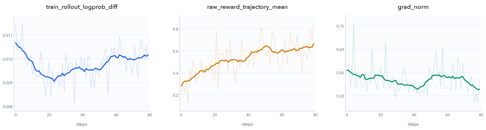

# Blackbox SWE-Gym Experiment with Claude Code

This experiment demonstrates that **Dressage can effectively train agents on SWE-style agentic tasks through blackbox RL and substantially improve a model's software engineering capabilities**. We use Qwen3.5-4B as the base model, train it on the SWE-Gym dataset, and use Claude Code as the coding agent. The results show that this pipeline can reliably support a multi-service execution environment composed of model services, agent services, and isolated sandboxes, while delivering clear gains across different repositories and task environments.

## Training Curves



The figure above shows three key metrics over the first 80 training steps. The light lines are raw measurements, while the dark lines are 13-step centered moving averages. The smoothed `raw_reward_trajectory_mean` increases from approximately 0.27 at the beginning of training to **above 0.6** toward the end and largely converges, indicating an overall improvement in the model's SWE-Gym task success rate and good training stability. `train_rollout_logprob_diff` remains within a narrow range of approximately 0.009–0.011 and does not increase continuously during training. Although `grad_norm` contains a few short-lived spikes, it remains within a controlled range overall and its smoothed value falls back to approximately 0.3 near the end, with no sign of sustained gradient explosion.

## SWE-bench Verified: 37.8% Accuracy

The SWE-Gym-trained model also transfers its gains to the substantially more challenging **SWE-bench Verified** benchmark:

| Model and agent | Accuracy |
| --- | ---: |
| Qwen3.5-4B + Claude Code baseline | 32.6% |
| **Dressage-trained Qwen3.5-4B + Claude Code** | **37.8%** |
| **Absolute improvement** | **+5.2 percentage points** |

For this evaluation, we increased the context budget to 256K tokens and the maximum number of interaction steps to 160, giving the agent more room to analyze each issue and implement a complete code change. The **5.2-point absolute gain on SWE-bench Verified** shows that training on SWE-Gym improves software-engineering performance beyond the training benchmark itself.

## Download and Convert SWE-Gym Data

This experiment uses the `NovaSky-AI/SkyRL-v0-293-data` dataset hosted on Hugging Face. The current conversion script supports the `train` and `validation` splits, which contain 293 and 23 tasks, respectively. Each task provides the repository to repair, the problem statement, the base commit, the test patch, and the official `FAIL_TO_PASS` and `PASS_TO_PASS` test cases. The model sees only the problem statement and the task repository; it is never given the gold patch.

Data conversion depends on the official SWE-Gym harness. To keep the generated evaluation scripts aligned with the reference experiment, we pin `SWE-Bench-Package` to the following commit:

```text
16dd480cce9b27bf111a362d280881c6def5d2a7
```

First install the data-reading dependencies and the pinned harness:

```bash
python3 -m pip install pyarrow huggingface_hub
python3 -m pip install \
  'swegym @ git+https://github.com/SWE-Gym/SWE-Bench-Package.git@16dd480cce9b27bf111a362d280881c6def5d2a7'
```

The data only needs to be converted once. If you plan to use E2B templates, first follow the next section to download the source Parquet, enumerate and build the task templates, and create `data/e2b-template-map.json`. You can then use a single command to perform the SWE-Gym format conversion, generate the official evaluation configuration, map E2B images, and configure the Claude Code backend:

```bash
python3 examples/data/swegym/prepare_swegym_data.py \
  data/swegym-train-claude-code-e2b.jsonl \
  --input data/swegym-source/train.parquet \
  --split train \
  --provider e2b \
  --sandbox-image-map data/e2b-template-map.json \
  --blackbox-type claude_code \
  --max-turns 80 \
  --permission-mode acceptEdits
```

The converter first validates the complete row count for the selected split, then calls the pinned harness's `make_test_spec()` for each task to generate a repository-specific evaluation script. Add `--limit 1` when debugging, or use `--split validation` for the validation set.

A custom provider that can directly launch Docker task images uses the same conversion script. No image map is required in this case: the original task image is written directly to `metadata.sandbox_image`. A paired `--binary-url` and `--runtime-url` can be used to inject the Claude Code/Blackbox Server (BBS) bootstrap that runs whenever a sandbox is created:

```bash
python3 examples/data/swegym/prepare_swegym_data.py \
  data/swegym-train-claude-code-custom.jsonl \
  --download \
  --download-dir data/swegym-source \
  --split train \
  --provider custom \
  --blackbox-type claude_code \
  --binary-url https://artifact-host.example/claude-2.1.207-linux-x64 \
  --runtime-url https://artifact-host.example/claude-code-runtime-python-3.10.20-bbs-<version>.tar.gz \
  --max-turns 80 \
  --permission-mode acceptEdits
```

The generated Dressage JSONL contains the following main fields:

| Field | Purpose |
| --- | --- |
| `prompt` | The user message constructed from `problem_statement`, with additional integrity rules that prohibit modifying tests, pytest configuration, or the evaluation harness, and prohibit retrieving an existing fix from a remote repository or mirror. |
| `metadata.agent_mode` | Fixed to `blackbox`. |
| `metadata.blackbox_type` | Fixed to `claude_code`, causing Blackbox Server to register the Claude Code backend. |
| `metadata.instance_id` | The SWE-Gym instance ID, used for image selection, logging, and result tracking. |
| `metadata.repo` / `repo_name` | The repository to repair and its short name. |
| `metadata.base_commit` | The task's declared base commit, used both when cleaning the repository before the agent starts and during fresh-sandbox evaluation. |
| `metadata.workdir` | The repository working directory inside the sandbox, `/testbed` by default. |
| `metadata.backend_options.working_directory` | Sets Claude Code's process cwd to the task repository (`/testbed` by default); without this public-BBS option, Claude Code uses its isolated runtime workspace instead. |
| `metadata.dataset` / `dataset_split` | The dataset name and split. |
| `metadata.sandbox_image` | The SWE-Bench/SWE-Gym task image for the custom path, or the corresponding template name written through `--sandbox-image-map` for E2B. |
| `metadata.sandbox_cmd` | Unset for the prebuilt E2B path; for the custom path, it may contain commands that download Claude Code, unpack the portable runtime, and start BBS. |
| `metadata.FAIL_TO_PASS` | Tests that fail before the repair and must pass afterward. |
| `metadata.PASS_TO_PASS` | Tests that pass before the repair and must not regress. |
| `metadata.reward_fn` | Fixed to `swegym_harness_marker`; reads the binary resolved reward from the official evaluation output. |
| `metadata.blackbox_execute_cmds.before_agent` | The mandatory Git sanitization command. |
| `metadata.blackbox_execute_cmds.after_agent` | The official evaluation command executed in a fresh evaluation sandbox. |

The before-agent Git sanitizer first verifies that `/testbed` is a Git worktree and that `base_commit` exists. It then performs a hard reset, removes untracked files, and switches to a detached HEAD. It also removes every remote, named ref, and reflog before pruning unreachable objects, preventing future commits, branches, tags, or stashes baked into the image from leaking the answer. The sanitizer uses `git clean -ffd` rather than `git clean -ffdx`, so ignored dependencies and build caches included in the image are preserved.

The after-agent command does not require the `swegym` package to be installed in the sandbox. The converter compresses the official evaluation script, the pinned `log_parsers.py`, and the expected test lists directly into the JSONL; at runtime, they are unpacked and executed inside the sandbox. To support older task images that still use Python 3.7 or 3.8, the converter postpones annotation evaluation and inlines the `TestStatus` definition into the parser. Evaluation emits a standardized `DRESSAGE_SWEGYM_REWARD_JSON=` marker containing the resolved status, pass counts for both test groups, the evaluation return code, and the failure reason.

Under normal conditions, the final training JSONL contains 293 lines:

```bash
wc -l data/swegym-train-claude-code-e2b.jsonl
```

## Prepare Sandbox

The open-source recipe supports two sandbox paths: use E2B templates, or implement a custom `SandboxProvider` on your own infrastructure. Both implementations must launch the task image specified by `metadata.sandbox_image` for each sample and provide Claude Code and Blackbox Server inside that environment.

Claude Code and Blackbox Server generally require newer Node.js or Python versions than those available in the task image, but they must not alter the task image's original Python environment. The blackbox runtime should run from an isolated directory with an explicit interpreter. Task commands such as `python`, `pip`, and pytest, together with the project's dependencies, must continue to resolve to the versions bundled with the Docker image. Do not inject Blackbox Server dependencies into the global `PYTHONPATH`.

### E2B Template

Dressage includes an `E2BSandboxProvider`. It passes `metadata.sandbox_image` to `AsyncSandbox.create()` as the template name and accesses Blackbox Server through port 31000 exposed by E2B. Each E2B template must therefore use the original task image as its base, preinstall Claude Code and Blackbox Server, and start Blackbox Server in the snapshot.

SWE-Gym tasks use multiple task images, so you must build a corresponding E2B template for every unique Docker image. E2B currently supports only Debian and Debian-derived base images; incompatible task images must use a custom provider instead.

Preparing the E2B templates involves three steps:

1. Collect every task image in the dataset and build one template for each unique image.
2. Record a JSON mapping from each raw Docker image to its E2B template name.
3. Pass that mapping through `--sandbox-image-map` during data conversion.

Download the original Parquet file and collect all unique task images without first generating an intermediate Dressage JSONL:

```bash
python3 examples/data/swegym/prepare_swegym_e2b.py list-images \
  --download \
  --download-dir data/swegym-source \
  --split train \
  --output data/swegym-images.txt
```

Every template must contain Claude Code and Blackbox Server. Build a wheel from
the public implementation in this repository, then run the repository script
to produce the Claude Code binary and an isolated BBS runtime:

```bash
python3 -m pip install build uv
python3 -m build --wheel --outdir dist blackbox_server/

export CLAUDE_CODE_BBS_VERSION=1.1.0
export CLAUDE_CODE_BBS_WHEEL_URL="$PWD/dist/dressage_blackbox_server-1.1.0-py3-none-any.whl"
export CLAUDE_CODE_ARTIFACT_DIR=/shared/path/claude-code-artifacts

bash dressage/recipes/swegym/prepare_claude_code_sandbox_artifacts.sh
```

By default, the script produces the Claude Code 2.1.207 Linux x86-64 binary and a runtime archive containing portable Python 3.10.20, BBS, and its dependencies:

```text
/shared/path/claude-code-artifacts/
├── claude-2.1.207-linux-x64
└── claude-code-runtime-python-3.10.20-bbs-<version>.tar.gz
```

When building a template, the repository builder installs Claude Code at `/usr/local/bin/claude`, unpacks the BBS runtime into `/opt/cc-runtime`, and starts Blackbox Server with the portable Python interpreter. Set `E2B_API_KEY=e2b_...`, select one image from `data/swegym-images.txt`, assign a unique template name, and run:

```bash
export E2B_API_KEY=e2b_...
export TASK_IMAGE=xingyaoww/sweb.eval.x86_64.example:latest
export TEMPLATE_NAME=e2b-swegym-example

python3 examples/data/swegym/prepare_swegym_e2b.py build
```

The builder can use a task image from a public registry directly; private registries require the credentials expected by the E2B SDK. It starts BBS at the end of the template build, waits for `/health` to succeed, and then creates the snapshot. Sandboxes created from that template resume with the snapshotted BBS process already running. The default 4 CPUs and 8192 MiB are examples; override them with `--cpu-count` and `--memory-mb` according to the test workload of each repository. See the [E2B Template documentation](https://e2b.dev/docs/template/defining-template) and [Start & ready commands](https://e2b.dev/docs/template/start-ready-command) for the template definition, build, and start/ready command semantics.

After every template has been built, write the mapping to `data/e2b-template-map.json` in the form `{docker_image: template_name}`. Then run the single `prepare_swegym_data.py` conversion described in the previous section. The converter applies the image mapping, preserves the original image in `metadata.docker_image`, and writes the final Claude Code training data directly. Do not pass artifact URLs for the E2B path: the BBS process already running in the template must be the only service process. Select E2B when starting training:

```bash
export DRESSAGE_SANDBOX_PROVIDER=e2b
export DRESSAGE_E2B_API_KEY=e2b_...
export DRESSAGE_E2B_BLACKBOX_PORT=31000
export DRESSAGE_PROXY_URL=https://proxy.example.com
export PROMPT_DATA=data/swegym-train-claude-code-e2b.jsonl
```

`DRESSAGE_PROXY_URL` must be an HTTP(S) endpoint reachable from E2B. Expose the
Dressage proxy through your cluster ingress or a secure tunnel rather than
relying on the node-private address inferred from `hostname -I`.

Before building the full set of templates or starting training, smoke-test one template:

```bash
python3 examples/data/swegym/prepare_swegym_e2b.py smoke \
  --template-name e2b-swegym-example
```

### Custom `SandboxProvider`

If you already have a self-hosted container platform or Kubernetes cluster that can launch a Docker image per sample, you can implement Dressage's `SandboxProvider` instead of building an E2B template for every task image.

The custom path relies on `metadata.sandbox_cmd`. The `prepare_swegym_data.py --provider custom` command from the previous section writes the original task image to `metadata.sandbox_image`. When `--binary-url` and `--runtime-url` are also provided, the converter generates a `sandbox_cmd` that installs Claude Code in the new sandbox, unpacks the isolated BBS runtime, and starts Blackbox Server. The custom provider's `create()` method must read and execute this field rather than ignoring it.

`create()` must perform the following operations:

1. Read the task image from `spec.env_args["sandbox_image"]` and launch a fresh sandbox from that image.
2. Preserve `/testbed`, the Python environment, and the test dependencies bundled with the image.
3. Execute `spec.env_args["sandbox_cmd"]` as the container bootstrap and ensure that every artifact URL referenced by it is reachable from inside the sandbox.
4. Because `sandbox_cmd` ultimately starts Blackbox Server as a foreground process, do not wait for the command to exit naturally. Wait for `/health` to succeed, then expose port 31000.
5. Return a `SandboxLease` containing `endpoints["blackbox"]`, and release any allocated resources if creation fails.

The provider must also implement `terminate()` and `get_public_url()`. To support the full command and file capabilities of `SandboxProvider`, it should additionally implement `run_command()`, `read_file()`, and `write_file()`. These methods are responsible only for sandbox lifecycle and low-level capabilities. They must not implement Claude Code sessions, agent turns, or `register_agent`; those remain the responsibility of Blackbox Server and `BlackboxAgentPaddock`.

The current public factory does not register a provider named `custom`. To connect one, use `DRESSAGE_PADDOCK_CLASS` to inject a custom paddock that constructs `BlackboxAgentPaddock(provider=<your provider>)`. This reuses Dressage's existing agent registration, invocation, execute hooks, and cleanup flow.

SWE-Gym uses fresh-sandbox evaluation. After the model finishes, Dressage extracts a patch relative to `base_commit` from the source sandbox, creates a clean evaluation sandbox from the same task image, applies only the model-generated patch, and runs the official evaluation. A custom provider must therefore return a fresh environment on every `create()` call and apply the same `sandbox_cmd` to both the source sandbox and the evaluation sandbox.

Before full training, verify on at least one sample that `/usr/local/bin/claude --version` succeeds, Blackbox Server is reachable on port 31000, Claude Code can produce a patch in `/testbed`, and the fresh evaluation sandbox emits a `DRESSAGE_SWEGYM_REWARD_JSON=` marker.

## Anti-Cheating Measures for SWE Tasks

Agents may exploit information left in the task environment instead of following the intended software repair process. One common cause is a task image that does not fully remove Git history, remotes, or other information that could reveal an existing solution. To ensure that reward reflects genuine code-repair ability as closely as possible, this experiment uses the following safeguards:

1. Sanitize Git information in the before-agent command. Before the agent starts, reset the repository to the task's declared `base_commit`, switch to a detached HEAD, and remove remotes, extra refs, reflogs, and unreachable objects. This prevents the agent from finding fixes in future commits, branches, tags, or stashes.
2. Detect attempts to retrieve answers from remote repositories. After each rollout, Dressage scans the complete tool-call trajectory for access to the current task repository through `git clone/fetch/pull`, `curl`, `wget`, the GitHub CLI, or web tools. Related forks can be added through `DRESSAGE_SWEGYM_BLOCKED_REPOS` or `DRESSAGE_SWEGYM_BLOCKED_REPOS_FILE`. A match forces the trajectory reward to 0 even if the official harness passes.
3. Protect tests and evaluation logic. The prompt explicitly prohibits modifications to tests, pytest configuration, and the evaluation harness. At runtime, Dressage scans file-writing tools and shell commands for writes to paths such as `tests`, `testing`, `r2e_tests`, `conftest.py`, `pytest.ini`, `tox.ini`, `setup.cfg`, and `pyproject.toml`; the final patch is also checked before fresh-sandbox evaluation. A violation detected at either layer forces the reward to 0.

## Experiment Setup

The complete experiment configuration is available in `examples/scripts/run_dressage_swegym_qwen3.5_4b_claude_code_sync_4_node.sh`. We use Qwen3.5-4B as the base model. Because SWE-Gym tasks are relatively moderate in complexity among SWE benchmarks, we use a 64K-token context window, retain at most 16K response tokens per rollout, and limit Claude Code to 80 interaction steps. Training is synchronous.

Task reward is determined entirely by the official SWE-Gym harness running in a fresh sandbox. A trajectory receives a reward of 1 only when every target test in both `FAIL_TO_PASS` and `PASS_TO_PASS` passes; all other outcomes receive 0, with no partial credit based on the fraction of passing tests. An empty patch, patch-application failure, evaluation failure, or missing reward marker also receives 0. The anti-cheating checks described above likewise set a violating trajectory's reward to 0 rather than applying an additional negative reward.

For each prompt, the default configuration samples 16 trajectories and mean-centers the binary rewards within the group for GRPO, giving successful samples a positive advantage relative to unsuccessful samples for the same problem. Training also enables Slime's default vanilla token-level TIS with importance weights clipped to `[0, 2]`, together with low-variance KL loss at a coefficient of `0.001` to limit rapid policy drift from the initial model. These mechanisms correct and regularize training without changing the raw binary task reward. The experiment applies no additional penalty for response length, tool-call count, or interaction steps, and does not enable custom MIS/RS.
