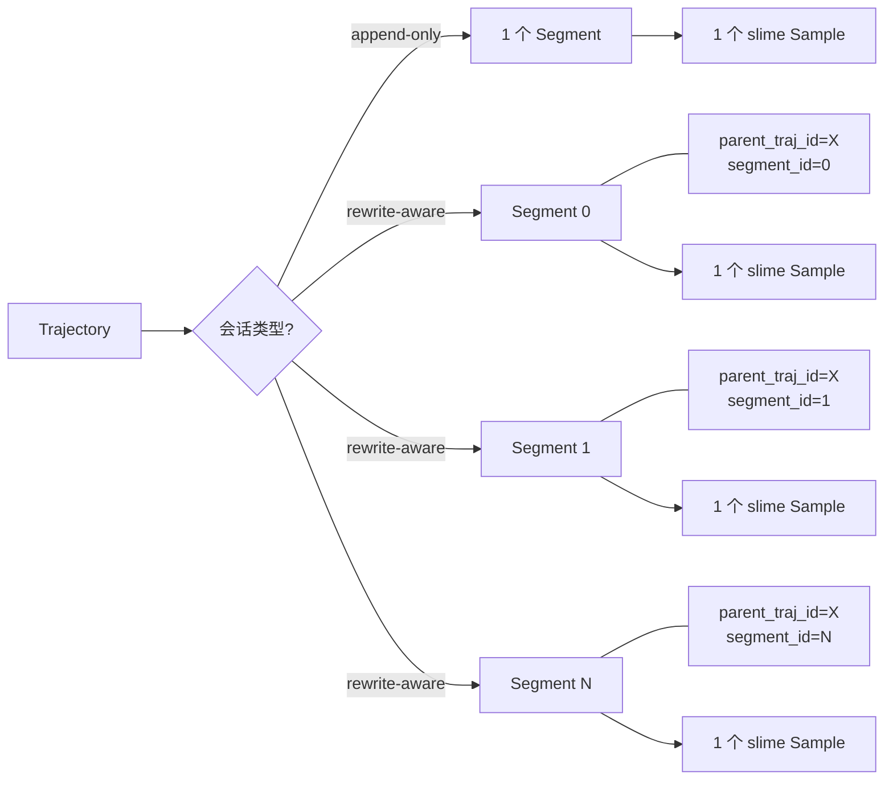
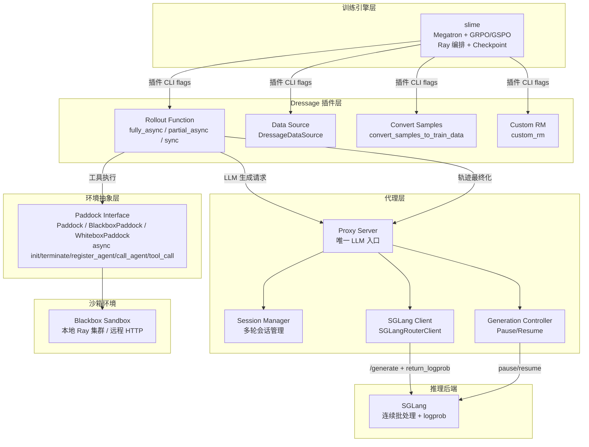
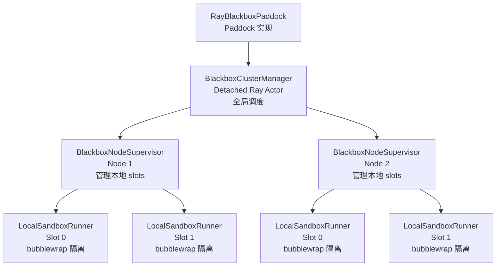
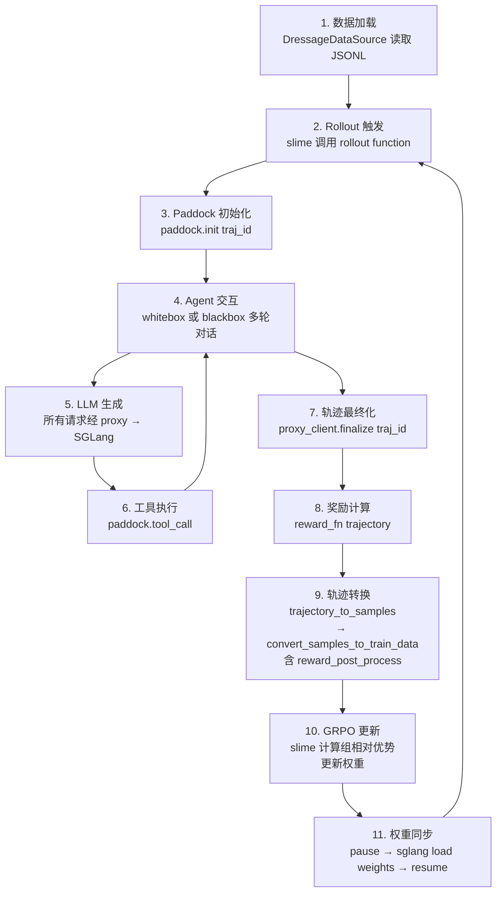
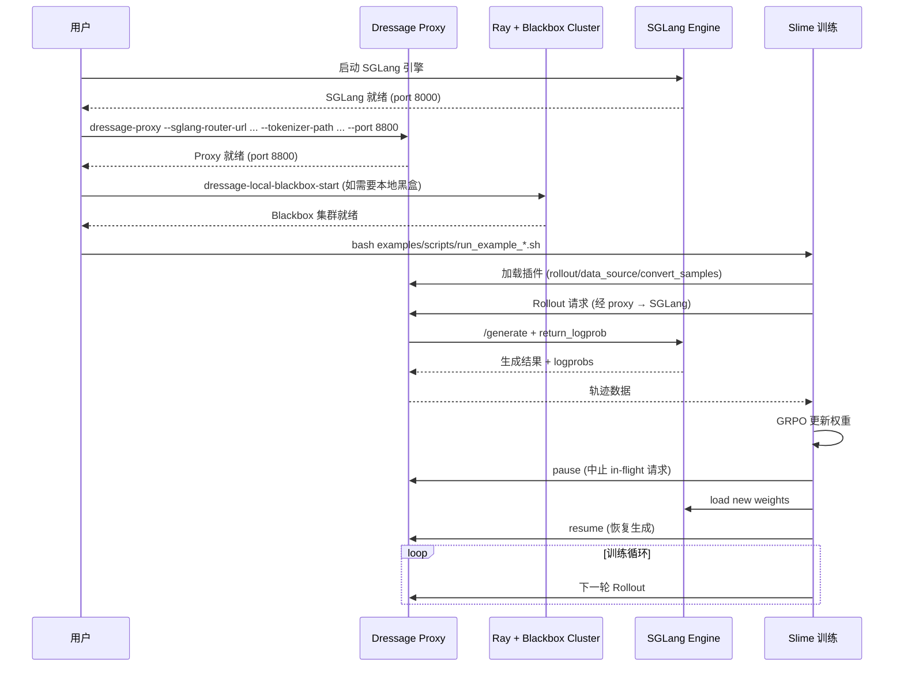

# Agentic RL 训练完全指南

> **本文档目的**：系统性地讲解 Agentic RL（智能体强化学习）的原理、Dressage 框架的架构设计，以及从概念到实践的完整知识链路。
>
> **适用读者**：希望深入理解 Agentic RL 训练机制的研究者和工程师。无论你是刚接触强化学习的新手，还是已有 RLHF 经验想要了解 Agentic 差异的实践者，都能从本文档中获得完整的知识体系。
>
> **阅读建议**：第一至三章建立概念基础，第四章是核心的训练流程详解，第五章提供实践操作指南，第六章帮助避坑。建议按顺序阅读，也可根据需要跳转特定章节。

---

## 目录

- [一、什么是 Agentic RL](#一什么是-agentic-rl)
  - [1.1 从传统 RL 到 RLHF 到 Agentic RL](#11-从传统-rl-到-rlhf-到-agentic-rl)
  - [1.2 Agentic RL 的核心思想](#12-agentic-rl-的核心思想)
  - [1.3 为什么需要 Agentic RL](#13-为什么需要-agentic-rl)
- [二、核心概念详解](#二核心概念详解)
  - [2.1 GRPO（Group Relative Policy Optimization）](#21-grpogroup-relative-policy-optimization)
  - [2.2 GSPO](#22-gspo)
  - [2.3 Rollout（轨迹采样）](#23-rollout轨迹采样)
  - [2.4 Trajectory（轨迹）与 TrajectorySegment（轨迹段）](#24-trajectory轨迹与-trajectorysegment轨迹段)
  - [2.5 traj_id（轨迹 ID）](#25-traj_id轨迹-id)
  - [2.6 Whitebox 与 Blackbox 两种 Agent 模式](#26-whitebox-与-blackbox-两种-agent-模式)
  - [2.7 Reward Function（奖励函数）](#27-reward-function奖励函数)
  - [2.8 loss_mask（损失掩码）](#28-loss_mask损失掩码)
  - [2.9 Paddock（沙箱环境抽象）](#29-paddock沙箱环境抽象)
  - [2.10 SGLang](#210-sglang)
  - [2.11 slime](#211-slime)
- [三、系统架构](#三系统架构)
  - [3.1 整体架构概览](#31-整体架构概览)
  - [3.2 Proxy：唯一 LLM 入口](#32-proxy唯一-llm-入口)
  - [3.3 Paddock：环境抽象层](#33-paddock环境抽象层)
  - [3.4 奖励系统架构](#34-奖励系统架构)
  - [3.5 插件化集成架构](#35-插件化集成架构)
- [四、训练原理与流程](#四训练原理与流程)
  - [4.1 训练全链路（端到端流程）](#41-训练全链路端到端流程)
  - [4.2 三种 Rollout 模式详解](#42-三种-rollout-模式详解)
  - [4.3 Trajectory → Sample 转换](#43-trajectory--sample-转换)
  - [4.4 奖励计算与后处理](#44-奖励计算与后处理)
  - [4.5 权重更新与 Pause/Resume](#45-权重更新与-pauseresume)
  - [4.6 轨迹构建模式](#46-轨迹构建模式)
- [五、实践指南](#五实践指南)
  - [5.1 环境准备](#51-环境准备)
  - [5.2 启动流程](#52-启动流程)
  - [5.3 核心环境变量](#53-核心环境变量)
  - [5.4 示例脚本说明](#54-示例脚本说明)
  - [5.5 开发自定义奖励函数](#55-开发自定义奖励函数)
  - [5.6 开发自定义 Paddock](#56-开发自定义-paddock)
- [六、常见陷阱与注意事项](#六常见陷阱与注意事项)
- [七、总结](#七总结)

---

## 一、什么是 Agentic RL

### 1.1 从传统 RL 到 RLHF 到 Agentic RL

**结论：三者的发展轨迹是"动作空间"不断扩展的过程——从生成单个 token，到生成一段文本，再到执行一个完整的 agent 轨迹。**

**传统强化学习（RL）**：智能体（Agent）通过与环境交互、试错来学习最优策略。经典场景如游戏 AI（AlphaGo）、机器人控制等。在传统 RL 中，智能体在每个时间步选择一个动作，环境返回奖励和新状态，智能体据此更新策略。

**RLHF（Reinforcement Learning from Human Feedback）**：将 RL 技术引入大语言模型训练的里程碑。核心流程是：
1. 用人类偏好数据训练一个奖励模型（Reward Model）
2. 用 RL（通常是 PPO）优化 LLM，使其生成更符合人类偏好的回答

RLHF 的动作空间是"生成一段文本"——模型一次性生成完整回答，奖励模型给出评分，RL 算法据此优化。

**Agentic RL**：将"智能体"引入 RL 训练循环。模型不再只是生成文本，而是能够：
- 调用工具（搜索、代码执行、API 请求）
- 与环境交互（沙箱、文件系统、浏览器）
- 进行多轮推理（思考 → 行动 → 观察结果 → 继续思考）
- 基于这些完整交互的最终结果计算奖励并优化策略

三者的核心区别如下表：

| 维度 | 传统 RL | RLHF | Agentic RL |
|---|---|---|---|
| 动作空间 | 离散/连续动作 | 生成一段文本 | 执行完整 agent 轨迹 |
| 奖励来源 | 环境即时反馈 | 人类偏好模型 | 任务完成结果 |
| 交互轮次 | 单步或有限步 | 单轮生成 | 多轮对话 + 工具调用 |
| 训练目标 | 最大化累积奖励 | 符合人类偏好 | 完成复杂任务 |
| 典型场景 | 游戏、机器人 | 对话助手 | 编程、搜索、推理 |

### 1.2 Agentic RL 的核心思想

**结论：Agentic RL 的训练目标是让模型学会在多轮交互中做出最优决策序列，而非优化单次生成质量。**

Agentic RL 的核心思想可以归纳为三个要点：

**训练目标**：从"生成好文本"升级为"完成好任务"。模型需要学会规划多步行动、选择合适的工具、在失败后调整策略。最终的评价标准是任务是否完成（如答案是否正确、代码是否通过测试），而非中间步骤的人类标注。

**奖励来源**：基于 agent 完成任务的最终结果。这意味着奖励信号是稀疏的——只有整个交互结束后才能获得奖励，模型需要通过策略梯度将这个终点奖励"分配"回每一步决策上。

**关键挑战**：
- **轨迹长**：一次 rollout 可能包含多轮对话和多次工具调用，token 序列远长于单轮生成
- **延迟高**：工具执行（如代码运行、网络搜索）引入不可预测的等待时间
- **需要沙箱环境**：工具执行需要安全隔离的执行环境
- **训练与推理耦合**：推理引擎（SGLang）需要在权重更新前后正确同步

### 1.3 为什么需要 Agentic RL

**结论：传统 SFT/RLHF 只能优化单轮生成质量，而真实场景需要模型具备多步推理、工具调用和环境交互能力。Agentic RL 让模型学会"如何使用工具"和"如何规划多步行动"。**

传统训练范式存在根本局限：

1. **SFT（监督微调）**：需要大量高质量的"输入-输出"对。但 agent 的最优行为序列难以预先标注——同一个任务可能有多种正确的解决路径。

2. **RLHF**：优化的是"单轮回答的人类偏好"。但真实任务中，模型需要先搜索信息、再推理、再执行——单轮偏好无法覆盖这种多步交互。

3. **Agentic RL 的价值**：通过让模型在实际任务环境中试错（rollout），自动发现有效的工具使用策略和多步规划方案。奖励来自任务结果（如代码是否通过测试），无需人工标注中间步骤。

典型应用场景：
- **编程任务**：模型生成代码 → 在沙箱中运行测试 → 根据测试结果获得奖励
- **搜索推理**：模型调用搜索工具 → 基于搜索结果继续推理 → 最终答案是否正确
- **工具编排**：模型选择并组合多个 API → 完成复杂工作流 → 任务是否成功

---

## 二、核心概念详解

### 2.1 GRPO（Group Relative Policy Optimization）

**结论：GRPO 是一种 on-policy RL 算法，是 PPO 的变体。它通过对同一个 prompt 采样一组回复并用组内相对优势替代绝对价值函数，省去了训练独立 critic 模型的需求。**

GRPO 的核心创新在于优势函数的计算方式：

- **PPO** 需要训练一个独立的 value model（critic）来估计每个状态的价值，然后计算优势 = 实际回报 - 估计价值。这增加了训练成本和复杂度。
- **GRPO** 对同一个 prompt 采样 N 个回复（一个 group），用组内奖励的均值作为基线：advantage_i = reward_i - mean(rewards)。不需要独立的 value model。

GRPO 优势计算公式：

\[
A_i = r_i - \frac{1}{N}\sum_{j=1}^{N} r_j
\]

其中 \(r_i\) 是第 i 个回复的奖励，N 是组内采样数。

在 Dressage 中，GRPO 通过 slime 框架实现。slime 支持 `--advantage-estimator grpo` 标志来启用 GRPO 算法。Dressage 的 [reward_post_process](../dressage/training/reward_post_process.py) 负责执行组内归一化计算。

### 2.2 GSPO

**结论：GSPO 是 GRPO 的稳定变体，slime 框架原生支持。**

GSPO（Group Sequence Policy Optimization）在 GRPO 的基础上改进了训练稳定性。与 GRPO 的主要关系：

- 两者都属于"组相对优势"方法，不需要独立的 critic 模型
- GSPO 在序列级别进行策略优化，对长轨迹的训练更稳定
- 在 slime 中通过 `--advantage-estimator gspo` 启用
- Dressage 的 [reward_post_process](../dressage/training/reward_post_process.py) 同时支持 `grpo` 和 `gspo` 两种优势估计器

### 2.3 Rollout（轨迹采样）

**结论：Rollout 是模型在当前策略下与环境交互、生成训练数据的过程。在 Agentic RL 中，一次 rollout 等于一次完整的 agent 交互，产出 Trajectory（轨迹）。**

Rollout 是 RL 训练循环中的采样阶段。具体到 Agentic RL：

- **传统 RLHF rollout**：给定 prompt → 模型生成一段文本 → 结束。产出是 prompt + response。
- **Agentic RL rollout**：给定 prompt → 模型生成回复（可能包含工具调用）→ 执行工具 → 将工具结果加入上下文 → 模型继续生成 → ... 循环直到任务完成或达到限制。产出是完整的 Trajectory。

Dressage 提供了三种 rollout 入口，详见 [第四章 4.2 节](#42-三种-rollout-模式详解)。

### 2.4 Trajectory（轨迹）与 TrajectorySegment（轨迹段）

**结论：Trajectory 是一次 agent 交互的完整对话记录，TrajectorySegment 是训练数据单元。一个 Trajectory 可对应 1 个或多个 Segment，取决于会话是否发生历史重写。**

**Trajectory**：语义/对话视图，包含一次 agent 交互的所有 turns（user/assistant/tool）。它是传递给奖励函数的对象，奖励函数基于此判断任务是否完成。

**TrajectorySegment**：训练数据单元。每个 Segment 对应一个 slime `Sample`，包含 tokens、loss_mask、logprobs 等训练所需的张量数据。

两者的对应关系取决于会话类型：

- **单段（append-only 会话）**：1 个 Trajectory = 1 个 Segment。这是最常见的情况——对话按顺序追加，没有历史重写。
- **多段（rewrite-aware 会话）**：1 个 Trajectory = N 个 Segment。当 agent 重写对话历史（如上下文压缩、消息裁剪）时，轨迹在重写边界处切分为多个段。

多段场景下，框架通过 `metadata["parent_traj_id"]` 和 `metadata["segment_index"]` 关联同一 Trajectory 的所有 Segment。[reward_post_process](../dressage/training/reward_post_process.py) 会对同一 parent 的所有 segment 归一化后广播相同 advantage。



### 2.5 traj_id（轨迹 ID）

**结论：traj_id 是全系统唯一主键，串联 1 个 Paddock 环境实例 + 1 个 Proxy SessionManager 会话 + 1 个最终化的 Trajectory。它支持三种传递方式，使任意框架的黑盒 agent 都能无代码修改地接入轨迹捕获。**

traj_id 是 Dressage 架构的核心设计——它是一个贯穿全系统的标识符，确保一次 agent 交互的所有组件（环境、会话、轨迹）保持一致关联：

- **1 个 Paddock 环境实例**：`paddock.init(traj_id, ...)` 创建绑定到该 traj_id 的沙箱环境
- **1 个 Proxy SessionManager 会话**：所有 LLM 生成请求在该 traj_id 下记录 turns
- **1 个最终化的 Trajectory**：`/session/finalize` 生成绑定到该 traj_id 的训练数据

**设计意图**：黑盒 agent（使用任意框架如 LangChain、OpenAI SDK）无需修改代码即可接入轨迹捕获。只需设置环境变量指向 proxy，并在请求中携带 traj_id。

**三种传递方式**（任一即可）：
1. 请求体 body 中包含 `traj_id` 字段
2. HTTP header `x-traj-id: <traj_id>`
3. `extra_body.traj_id` 字段（OpenAI SDK 风格）

**重要约束**：永远不要发明平行的 session id。所有组件都应路由到现有的 traj_id 下。

### 2.6 Whitebox 与 Blackbox 两种 Agent 模式

**结论：Whitebox 模式在进程内运行 agent 循环，Dressage 完全控制交互过程；Blackbox 模式委托给外部不透明 agent，仅需其 LLM 调用经过 proxy。两种模式可在同一 batch 内混合。**

两种模式的核心差异：

| 维度 | Whitebox（默认） | Blackbox |
|---|---|---|
| Agent 循环位置 | 进程内（Dressage 控制） | 外部不透明 agent |
| 交互控制 | Dressage 逐步驱动 | 外部 agent 自主运行 |
| 工具执行 | `paddock.tool_call(traj_id, ...)` | 外部 agent 内部处理 |
| LLM 调用 | proxy `/v1/chat/completions` | 外部 agent → proxy（需配置） |
| 适用场景 | 需要精细控制交互流程 | 接入已有 agent 框架 |
| 分发方式 | `sample.metadata["agent_mode"] = "whitebox"` | `sample.metadata["agent_mode"] = "blackbox"` |

**Whitebox 流程**：
1. POST 到 proxy `/v1/chat/completions` 获取模型回复
2. 如果回复包含 tool_calls，通过 `paddock.tool_call(traj_id, tool_id, tool_args)` 执行
3. 将工具结果追加到对话上下文
4. 循环直到无 tool_calls 或达到 `max_turns`/`max_tokens` 限制

**Blackbox 流程**：
1. 调用 `paddock.register_agent(state, *, instance_id, session_id, ...)` 注册 agent
2. 外部 agent 自主运行（可能多轮、使用自己的工具）
3. 外部 agent 必须将其 LLM 调用路由到 proxy（携带 traj_id），这样 turns 才能被 SessionManager 记录
4. agent 返回最终响应

两种模式完成后都会调用 `proxy_client.finalize(traj_id)` + `read_trajectory(traj_id)`。

### 2.7 Reward Function（奖励函数）

**结论：奖励函数通过 `@register_reward("name")` 装饰器注册，按样本的 `metadata["reward_fn"]` 字段选择。共享依赖通过 `set_reward_context` 注入，外部模块通过环境变量热加载。**

Dressage 的奖励系统采用"每样本指定奖励函数"的设计——同一 batch 中不同样本可以使用不同的奖励函数。

**注册机制**：在 [registry.py](../dressage/reward/registry.py) 中通过装饰器注册：

```python
@register_reward("exact_match")
def exact_match(sample, *, args=None, **_):
    label = _label(sample)
    if not label:
        return 0.0
    return 1.0 if _response(sample).strip() == label else 0.0
```

**内置奖励函数**（定义在 [helpers.py](../dressage/reward/helpers.py)）：

| 函数名 | 行为 |
|---|---|
| `exact_match` | 响应与标签完全匹配返回 1.0 |
| `contains_label` | 响应中包含标签返回 1.0 |
| `constant` | 返回 `metadata["constant_reward"]`，用于测试 |
| `metadata_score` | 返回 `metadata["reward"]` 或 `metadata["score"]` |
| `default` | 默认行为，等价于 `contains_label` |

**外部模块热加载**：通过 `DRESSAGE_REWARD_MODULES` 环境变量（逗号分隔的模块路径），在 rollout 初始化时自动 import，使其中注册的奖励函数生效。

**上下文注入**：共享依赖（paddock、proxy_client）在启动时通过 `set_reward_context(paddock=paddock, proxy_client=proxy_client)` 注入，奖励函数内通过 `get_reward_context()` 读取。

### 2.8 loss_mask（损失掩码）

**结论：loss_mask 长度始终等于 response_length（仅响应部分，不含 prompt），控制哪些 token 参与策略梯度计算。当 `remove_sample = True` 时 loss_mask 全零，reward 参与组归一化但不贡献策略梯度。**

loss_mask 是 RL 训练中的关键概念：

- **长度约束**：`len(loss_mask) == response_length`。这是 slime 的硬性约束——loss_mask 只覆盖响应部分，不包含 prompt。[PromptAssistantMaskBuilder](../dressage/proxy/last_step/prompt_assistant_mask.py) 在 prompt_assistant_mask.py 中强制执行此约束。
- **多轮训练**：在多轮对话中，loss_mask 确保每个 assistant turn 都参与训练（loss_mask 中对应位置为 1），而 user/tool 消息不参与（为 0）。
- **remove_sample 机制**：当轨迹由外部（非训练）模型生成时，设置 `remove_sample = True`。[convert_samples](../dressage/rollout/convert_samples.py) 会将 loss_mask 全部置零。此时 reward 仍参与 GRPO 组归一化（影响其他样本的 advantage 计算），但不贡献策略梯度。**不要将这样的 sample 过滤掉**。

### 2.9 Paddock（沙箱环境抽象）

**结论：Paddock 是 Dressage 的环境抽象层，从"单一类 5 个同步方法"重构为 3 个异步类——`Paddock`（基类，定义 `init`/`terminate` 生命周期）、`BlackboxPaddock`（黑盒 agent 能力）、`WhiteboxPaddock`（白盒工具调用能力）。所有方法均为 `async def`，通过 `DRESSAGE_PADDOCK_MODE` 环境变量选择模式（默认 `blackbox`）。**

Paddock 接口定义在 [interface.py](../dressage/paddock/interface.py) 中，采用分类接口设计，将黑盒和白盒能力拆分到不同子类：

**基类 `Paddock`**（环境生命周期）：

| 方法 | 签名 | 用途 |
|---|---|---|
| `init` | `async (traj_id, env_type=None, env_args=None, **kwargs) -> Any` | 初始化绑定到 traj_id 的环境实例 |
| `terminate` | `async (traj_id, env_args=None, **kwargs) -> dict` | 销毁环境并回收资源 |

**`BlackboxPaddock(Paddock)`**（黑盒 agent 能力）：

| 方法 | 签名 | 用途 |
|---|---|---|
| `register_agent` | `async (state, *, instance_id, session_id, router_url, blackbox_type, backend_options, router_api_path) -> dict` | 在沙箱服务内注册 agent 进程 |
| `call_agent` | `async (state, *, session_id, messages, metadata) -> dict` | 委托给黑盒 agent 执行并返回响应 |
| `execute_cmd` | `async (state, *, session_id, cmd, timeout) -> dict` | 在黑盒会话中执行 shell 命令 |
| `pause` | `async (traj_id=None, *, reason, timeout_seconds) -> dict` | 暂停 rollout 生成，使模型侧进入静默状态 |
| `resume` | `async (traj_id=None, *, version, reason) -> dict` | 权重更新后恢复 rollout 生成 |

**`WhiteboxPaddock(Paddock)`**（白盒工具调用能力）：

| 方法 | 签名 | 用途 |
|---|---|---|
| `tool_call` | `async (traj_id, tool_id, tool_args) -> (response, metadata)` | 执行单个工具调用 |

> **注意**：`prepare_reward` 方法已移除。奖励函数现在直接通过 `sample` 对象的 metadata 获取所需信息，或通过 `get_reward_context()` 访问 `proxy_client` 读取轨迹详情。

**模式选择**：通过 `DRESSAGE_PADDOCK_MODE` 环境变量选择（默认 `blackbox`）。`whitebox` 模式选择 `WhiteboxPaddock` 实现，`blackbox` 模式选择 `BlackboxPaddock` 实现。

**内置实现**：

1. **`BlackboxSandboxPaddock`**（远程）：HTTP 客户端，连接远程沙箱路由服务。适用于 `*_remote.sh` 脚本。
2. **`RayBlackboxPaddock`**（本地）：基于 Ray actor 的本地沙箱集群，使用 bubblewrap 隔离。架构为三层：
   - `BlackboxClusterManager`（detached Ray actor，全局管理）
   - `BlackboxNodeSupervisor`（每节点一个，管理本地 slots）
   - `LocalSandboxRunner`（每 slot 一个，bubblewrap/direct 模式隔离）

**异步设计**：所有 Paddock 方法均为 `async def`，直接在 asyncio 事件循环中调用，无需 `asyncio.to_thread` 包装。多个并发 `traj_id` 的调用通过 asyncio 协程并发执行。

### 2.10 SGLang

**结论：SGLang 是高性能 LLM 推理引擎，在 Dressage 中作为唯一推理后端，由 proxy 统一调用。它支持 `return_logprob=True` 返回 token 级 logprob 用于训练，Router 模式支持多 GPU 负载均衡。**

SGLang 的关键特性：

- **连续批处理**：动态合并多个推理请求，提高 GPU 利用率
- **路由亲和**：Router 模式下支持多 GPU 服务器的负载均衡
- **logprob 捕获**：`/generate` 端点支持 `return_logprob=True`，返回每个生成 token 的对数概率
- **权重热加载**：支持在不重启服务的情况下加载新权重

在 Dressage 中，SGLang 的调用被封装在 [SGLangRouterClient](../dressage/proxy/sglang_client.py) 中，且**只在 proxy 内部使用**。任何在 `dressage/proxy/` 外部调用 SGLangRouterClient 的行为都会绕过训练所需的 bookkeeping。

### 2.11 slime

**结论：slime（THUDM/slime）是 Dressage 的底层训练引擎子模块，拥有 Megatron 分布式训练、GRPO/GSPO 算法、SGLang 推理、Ray 编排和 checkpointing。Dressage 仅通过 slime 的插件 CLI flags 集成，绝不修改 slime 内部。**

slime 提供的核心能力：
- **Megatron 分布式训练**：支持 TP（张量并行）、PP（流水线并行）、CP（上下文并行）、EP（专家并行）、DP（数据并行）
- **RL 算法**：GRPO、GSPO、Reinforce++ baseline
- **SGLang 集成**：原生 `/generate` 端点和 token 级 logprob 捕获
- **Ray 编排**：训练和 rollout worker 的调度管理
- **Checkpoint 管理**：HF ↔ Megatron `torch_dist` 转换

Dressage 的集成原则：所有定制都通过 slime 的扩展点实现（custom rollout function、custom data source、custom convert_samples 等），**绝不 fork 或 patch slime 内部代码**。

`slime/` 在代码仓库中是空的 git submodule 占位符。运行真实训练前需要执行 `git submodule update --init`。测试中通过 `try: from slime... except ImportError:` 的 fallback 机制容忍 slime 缺失。

---

## 三、系统架构

### 3.1 整体架构概览

**结论：Dressage 采用分层架构——slime 作为训练引擎底层，Dressage 通过插件层注入 agent 交互能力，Proxy 作为唯一 LLM 入口，Paddock 作为环境抽象层，SGLang 作为推理后端。**



各层职责说明：

| 层 | 职责 | 关键约束 |
|---|---|---|
| slime（训练引擎） | 分布式训练、GRPO/GSPO 优化、checkpoint | 不可修改内部，仅通过插件集成 |
| Dressage 插件层 | agent 交互编排、数据转换、奖励计算 | 通过 CLI flags 注册 |
| Proxy（代理层） | LLM 请求路由、logprob 捕获、轨迹构建 | 唯一 LLM 入口，proxy 外不可调用 SGLang |
| Paddock（环境层） | 工具执行、agent 委托、环境管理 | 全部 async，分类接口设计 |
| SGLang（推理后端） | 高性能推理、logprob 返回 | 仅由 proxy 调用 |

### 3.2 Proxy：唯一 LLM 入口

**结论：Proxy 是 Dressage 中唯一允许调用 SGLang 的组件。它负责 logprob 捕获、chat template 应用、工具调用解析、轨迹构建和权重更新时的 pause/resume。任何绕过 proxy 的 LLM 调用都会丢失训练所需的 bookkeeping。**

Proxy 之所以是唯一入口，是因为训练依赖以下只有 proxy 才能完成的工作：

1. **调用 SGLang `/generate` 并捕获 logprob**：通过 [SGLangRouterClient](../dressage/proxy/sglang_client.py) 调用 SGLang，设置 `return_logprob=True`，获取每个 token 的对数概率——这是策略梯度计算的必需数据。

2. **应用 chat template 计算 input_token_count**：proxy 使用 HuggingFace tokenizer 应用模型的 chat template，准确计算输入 token 数量——这决定了 prompt 和 response 的边界。

3. **解析 Hermes 风格工具调用**：将模型输出中的 `<tool_call>{...}</tool_call>` 块解析为结构化 `tool_calls`——这使框架能够识别并执行工具调用。

4. **`/session/finalize` 构建轨迹**：将多轮会话中的所有 turns 整合为 `Trajectory`/`TrajectorySegment`，生成训练数据。

5. **权重更新时 pause/resume**：通过 [GenerationController](../dressage/proxy/generation_controller.py) 在安全边界中止 in-flight 请求，等待权重加载完成后恢复。

**Proxy 核心组件**：

| 组件 | 文件 | 职责 |
|---|---|---|
| FastAPI 服务 | [server.py](../dressage/proxy/server.py) | 提供 `/v1/chat/completions`、`/session/finalize` 等端点 |
| 会话管理器 | [session_manager.py](../dressage/proxy/session_manager.py) | 管理多轮会话，构建 `PromptAssistantMaskBuilder` |
| 生成控制器 | [generation_controller.py](../dressage/proxy/generation_controller.py) | Pause/resume 控制，中止 in-flight 请求 |
| SGLang 客户端 | [sglang_client.py](../dressage/proxy/sglang_client.py) | 封装 SGLang API 调用 |
| 轨迹存储 | [trajectory_store.py](../dressage/proxy/trajectory_store.py) | 轨迹内存存储 |
| 推理解析器 | [reasoning_parser.py](../dressage/proxy/reasoning_parser.py) | 解析模型推理内容（如 `<think>` 标签） |
| 工具调用解析器 | [tool_call_parser.py](../dressage/proxy/tool_call_parser.py) | 解析 Hermes 风格工具调用 |
| 工具调用 ID | [tool_call_ids.py](../dressage/proxy/tool_call_ids.py) | 工具调用 ID 生成与规范化 |

### 3.3 Paddock：环境抽象层

**结论：Paddock 通过抽象接口将 rollout 逻辑与环境细节解耦。本地实现使用 Ray actor 三层架构（ClusterManager → NodeSupervisor → SandboxRunner），远程实现使用 HTTP 客户端。**

**接口设计理念**：Paddock 的目标是让 rollout 逻辑不关心环境是本地 Docker、远程 VM 还是云函数。只需实现 `BlackboxPaddock` 或 `WhiteboxPaddock` 抽象接口，通过 `DRESSAGE_PADDOCK_MODE` 环境变量选择模式（`blackbox` 或 `whitebox`）即可。

**本地沙箱架构（RayBlackboxPaddock）**：



- **BlackboxClusterManager**：detached Ray actor，全局管理所有节点的 slot 分配。通过 `dressage-local-blackbox-start` 启动。
- **BlackboxNodeSupervisor**：每节点一个，管理本地的 slot 池，负责 slot 的分配和回收。
- **LocalSandboxRunner**：每 slot 一个，执行实际的工具命令和 agent 调用。默认使用 `bwrap`/bubblewrap 沙箱隔离，`direct` 模式用于调试。

**远程沙箱架构（BlackboxSandboxPaddock）**：HTTP 客户端，通过 REST API 与远程沙箱路由服务通信。适用于沙箱环境部署在独立集群的场景。

| 维度 | RayBlackboxPaddock（本地） | BlackboxSandboxPaddock（远程） |
|---|---|---|
| 通信方式 | Ray actor 调用 | HTTP REST API |
| 隔离方式 | bubblewrap 沙箱 | 远程服务自行隔离 |
| 部署位置 | 同一 Ray 集群 | 独立服务集群 |
| 启动方式 | `dressage-local-blackbox-start` | 远程服务独立部署 |
| 适用场景 | 本地开发/测试 | 生产环境分布式部署 |
| 默认脚本 | `*_local.sh` | `*_remote.sh` |

### 3.4 奖励系统架构

**结论：奖励系统由注册机制（`@register_reward`）、上下文注入（`set_reward_context`/`get_reward_context`）和后处理（`reward_post_process`）三部分组成。后处理按父轨迹归一化，多段时广播相同 advantage。**

**注册机制**：奖励函数通过 [registry.py](../dressage/reward/registry.py) 中的 `@register_reward("name")` 装饰器注册到全局注册表。按样本选择通过 `sample.metadata["reward_fn"]` 字段查找。

**上下文注入**：奖励函数可能需要访问 paddock（如执行测试代码）或 proxy_client（如读取轨迹详情）。这些共享依赖在 rollout 启动时通过 `set_reward_context(paddock=paddock, proxy_client=proxy_client)` 注入，函数内通过 `get_reward_context()` 读取。

**后处理流程**（[reward_post_process.py](../dressage/training/reward_post_process.py)）：

1. 提取原始奖励 `raw_rewards = [s.reward for s in samples]`
2. 按 `group_index` 分组（GRPO 组）
3. 组内归一化：`normalized_i = reward_i - mean(group_rewards)`
4. 可选标准差归一化（`grpo_std_normalization`）
5. 对于多段轨迹：按 `parent_traj_id` 分组，将代表 segment 的 advantage 广播到所有 sibling segment

**slime 的 quirk**：当 `--custom-convert-samples-to-train-data-path` 设置时，slime 会短路 `_convert_samples_to_train_data`，不再调用 `_post_process_rewards`。因此 Dressage 的 [convert_samples_to_train_data](../dressage/rollout/convert_samples.py) 在内部第一步就调用 `reward_post_process`。**不要重新注册 `--custom-reward-post-process-path`**——否则会导致重复处理或跳过归一化。

### 3.5 插件化集成架构

**结论：slime 通过 `importlib.import_module` + `getattr` 加载插件。Dressage 的所有定制都通过 slime 的 CLI flags 注册，不修改 slime 内部代码。**

slime 的插件加载机制：取 flag 值的最后一个点分段作为属性名，前面部分作为模块路径，执行 `getattr(importlib.import_module(module_path), attr)`。

**插件映射表**：

| Slime flag | Dressage symbol | 用途 |
|---|---|---|
| `--rollout-function-path` | `dressage.rollout.fully_async_rollout.generate_rollout_fully_async` | 完全异步 rollout（或 `sync_rollout`/`partial_async_rollout` 变体） |
| `--custom-generate-function-path` | `dressage.rollout.generate.blackbox_dispatch.generate` | 黑盒 agent 生成钩子（仅黑盒运行） |
| `--custom-rm-path` | `dressage.rollout.custom_rm.custom_rm` | 自定义奖励模型 |
| `--data-source-path` | `dressage.rollout.data_source.DressageDataSource` | 数据源（JSONL 读取） |
| `--custom-convert-samples-to-train-data-path` | `dressage.rollout.convert_samples.convert_samples_to_train_data` | 样本转训练数据（含 reward_post_process） |

**重要**：`--custom-reward-post-process-path` **故意不注册**。原因见 [3.4 节](#34-奖励系统架构)的 slime quirk 说明。

`total_lengths` 由 Megatron actor 从 `tokens` 派生——`convert_samples_to_train_data` 不输出此字段。


---

## 四、训练原理与流程

### 4.1 训练全链路（端到端流程）

**结论：一次完整的训练迭代包含 11 个步骤，从 JSONL 数据加载开始，经过 agent 交互、轨迹最终化、奖励计算、样本转换，最终到 GRPO 权重更新和 SGLang 权重同步。**



各步骤详解：

**步骤 1：数据加载**
[DressageDataSource](../dressage/rollout/data_source.py) 从 JSONL 文件读取 prompt 数据。采用"文本优先"设计——纯字符串 prompt 无需 chat template 即可工作。每条数据可包含 `prompt`、`label`、`agent_mode`、`env_type`、`reward_fn` 等字段。

**步骤 2：Rollout 触发**
slime 调用注册的 rollout function（如 `generate_rollout_fully_async`）。rollout function 从数据缓冲区获取 prompt 组，为每个 prompt 分配 `traj_id`。

**步骤 3：Paddock 初始化**
调用 `paddock.init(traj_id, env_type, env_args)` 创建绑定到该 `traj_id` 的沙箱环境实例。环境类型和参数从样本的 metadata 中提取。

**步骤 4：Agent 交互**
根据 `sample.metadata["agent_mode"]` 分发：
- **whitebox**：Dressage 在进程内驱动 agent 循环——生成 → 解析工具调用 → 执行 → 循环
- **blackbox**：调用 `paddock.register_agent(state, ...)` 注册 agent，再通过 `paddock.call_agent(state, *, session_id, messages)` 委托执行

**步骤 5：LLM 生成**
所有 LLM 生成请求经过 proxy `/v1/chat/completions`。proxy 内部调用 SGLang `/generate`（`return_logprob=True`），应用 chat template，解析工具调用，记录 turns 到 SessionManager。

**步骤 6：工具执行**
whitebox 模式下，proxy 返回的 tool_calls 通过 `paddock.tool_call(traj_id, tool_id, tool_args)` 执行。工具结果追加到对话上下文，继续下一轮生成。

**步骤 7：轨迹最终化**
调用 `proxy_client.finalize(traj_id)` 触发 proxy 的 `/session/finalize`。proxy 将 SessionManager 中该 `traj_id` 下的所有 turns 整合为 `Trajectory`/`TrajectorySegment`，生成 tokens、loss_mask、logprobs 等训练数据。

**步骤 8：奖励计算**
根据 `sample.metadata["reward_fn"]` 查找奖励函数，调用 `reward_fn(sample)` 计算标量奖励。奖励函数可通过 `get_reward_context()` 访问 paddock 和 proxy_client。

**步骤 9：轨迹转换**
[convert_samples_to_train_data](../dressage/rollout/convert_samples.py) 将 Samples 转换为训练 batch dict：
1. 调用 `reward_post_process` 执行 GRPO 组归一化
2. 构建 loss_masks（含 `remove_sample` 处理）
3. 输出 tokens、response_lengths、rewards、loss_masks 等字段

**步骤 10：GRPO 更新**
slime 使用转换后的训练数据计算组相对优势并执行策略梯度更新。同一 prompt 的多个采样组成一个 group，组内归一化后计算 advantage。

**步骤 11：权重同步**
[train_async_with_rollout_pause](../dressage/training/train_async_with_rollout_pause.py) 包装权重更新过程：
1. 调用 proxy pause → 中止 in-flight SGLang 请求
2. `actor_model.update_weights()` → Megatron 更新权重
3. SGLang 加载新权重
4. 调用 proxy resume → 恢复生成

### 4.2 三种 Rollout 模式详解

**结论：Dressage 提供三种 rollout 入口——fully_async（完全异步，独立 GPU 池）、partial_async（部分异步，N 步流水线）、sync（同步，共置 GPU）。三种模式复用相同的重试和失败处理逻辑。**

| 维度 | fully_async | partial_async | sync |
|---|---|---|---|
| GPU 拓扑 | 独立 rollout/train GPU 池 | 异步 + N 步预采样 | 共置（rollout 和 train 共享 GPU） |
| 执行方式 | 后台 worker 持续采样 | rollout 与训练交替 + N 步预采样 | 每个 rollout_id 运行到完成 |
| GPU 利用率 | 最大化 | 平衡 | 稳定 |
| SGLang 卸载 | 不需要 | 不需要 | 训练前可卸载 |
| 适用场景 | 黑盒运行默认选择 | 平衡吞吐与资源 | 35B-A3B 共享 8×H100 |
| slime CLI | `generate_rollout_fully_async` | `generate_rollout_partial_async` | `generate_rollout_sync` |

#### 4.2.1 Fully Async Rollout（完全异步）

**适用场景**：rollout 和训练使用独立 GPU 池（disaggregated 架构），是黑盒运行的默认选择。

**工作原理**：一个全局后台 worker（`AsyncRolloutWorker`）持续从数据缓冲区拉取 prompt 组并生成。每次 rollout 调用只从已完成队列中取出足够数量的组用于训练。

**关键机制**（[fully_async_rollout.py](../dressage/rollout/fully_async_rollout.py)）：
- 后台 worker 在独立线程中运行 `asyncio` 事件循环
- 通过 `output_queue`（有界队列）传递已完成的组
- 高水位线（`high_watermark`）控制后台 worker 的采样节奏，避免队列溢出
- 组级重试：失败组在 `DRESSAGE_ROLLOUT_MAX_RETRIES`（默认 2）次数内重试
- 空批次保护：如果所有组都无可训练 token，拒绝训练（除非 `DRESSAGE_ALLOW_EMPTY_TRAIN_BATCH=1`）

**slime CLI**：
```bash
--rollout-function-path dressage.rollout.fully_async_rollout.generate_rollout_fully_async
```

#### 4.2.2 Partial Async Rollout（部分异步）

**适用场景**：异步架构 + N 步 partial rollout 流水线。

**工作原理**：rollout 与训练交替进行，支持 N 步预采样。当前训练步骤进行时，后台已经在为下一步 rollout 做准备。在共置与非共置之间取得平衡。

**关键特性**：
- 支持 token 级别的 partial rollout 检测（通过 `full_versions` 数组判断同一轨迹内是否跨权重版本）
- `train_async_with_rollout_pause` 中对 hidden background blackbox/proxy work 进行 pause 处理

**slime CLI**：
```bash
--rollout-function-path dressage.rollout.partial_async_rollout.generate_rollout_partial_async
```

#### 4.2.3 Sync Rollout（同步）

**适用场景**：GPU 共置（如 35B-A3B 模型共享 8×H100），rollout 和训练交替使用同一组 GPU。

**工作原理**：每个 `rollout_id` 运行到完成后再进入训练。这样 SGLang 引擎可以在训练前卸载，释放 GPU 显存给 Megatron 训练使用。

**关键机制**（[sync_rollout.py](../dressage/rollout/sync_rollout.py)）：
- 复用 `fully_async_rollout` 的重试、空批次、失败摘要等辅助函数
- 同步提交所有组，等待全部完成后返回
- 失败组在 `DRESSAGE_ROLLOUT_MAX_RETRIES` 次数内重试

**slime CLI**：
```bash
--rollout-function-path dressage.rollout.sync_rollout.generate_rollout_sync
```

#### 4.2.4 Staleness 追踪与 Partial Rollout

**结论：异步 rollout 中，轨迹可能跨越多个权重版本。Staleness 追踪器通过 `dressage_staleness_keep_versions` 参数控制保留多少个版本的轨迹，过旧的组会被丢弃以保证训练新鲜度。**

**问题背景**：在 fully_async 和 partial_async 模式下，rollout worker 持续在后台采样。当权重更新后，仍在使用旧权重生成的轨迹会变得"过时"（stale）。如果将这些过时轨迹用于训练，会导致策略更新方向偏差。

**Staleness 追踪机制**（[staleness.py](../dressage/rollout/staleness.py)）：
- `StalenessTracker`：记录所有观察到的权重版本，维护版本列表
- `StalenessGroupFilter`：在组提交训练前检查其版本，丢弃超出 `keep_versions` 窗口的旧组
- 通过 sample metadata 中的 `dressage_end_token_version` 字段判断轨迹的权重版本
- `StalenessConfig(keep_versions=N)`：保留最近 N 个版本的轨迹，更早的版本被丢弃
- 输出 `staleness/dropped_groups`、`staleness/version_gap_*` 等监控指标

**Partial Rollout 检测**：partial_async 模式支持 token 级别的 partial rollout 检测——通过 `full_versions` 数组判断同一轨迹内是否跨越权重版本边界。跨版本的轨迹段会被正确标记，确保训练数据的版本一致性。

### 4.3 Trajectory → Sample 转换

**结论：Trajectory 是语义/对话视图，TrajectorySegment 是训练数据单元。`trajectory_to_samples` 负责转换，单段轨迹输出 1 个 Sample，多段轨迹输出 N 个 Sample 并标记 parent_traj_id 和 segment_id。**

转换过程的关键逻辑：

1. **Trajectory → Segments**：在 `/session/finalize` 时，SessionManager 根据会话类型将 turns 切分为 segments：
   - append-only 会话：所有 turns 合并为 1 个 segment
   - rewrite-aware 会话：在重写边界处切分，生成 N 个 segments

2. **Segment → Sample**：每个 segment 转换为一个 slime `Sample`，包含：
   - `tokens`：完整 token 序列（prompt + response）
   - `response_length`：响应部分长度
   - `loss_mask`：长度等于 `response_length`，标记可训练 token
   - `rollout_log_probs`：每个响应 token 的 logprob
   - `reward`：奖励值
   - `metadata`：包含 `parent_traj_id`、`segment_id`（多段时）等

3. **metadata 字段**：
   - `parent_traj_id`：多段轨迹中标识同一父轨迹
   - `segment_id`：段在父轨迹中的序号
   - `session_id`：会话 ID（等于 traj_id）
   - `instance_id`：实例 ID（GRPO 组标识）

4. **loss_mask 构建**：[PromptAssistantMaskBuilder](../dressage/proxy/last_step/prompt_assistant_mask.py) 确保多轮对话中每个 assistant turn 的 token 都参与训练，同时满足 `len(loss_mask) == response_length` 的约束。

### 4.4 奖励计算与后处理

**结论：奖励在 finalize 之后立即计算。`reward_post_process` 执行 GRPO 组归一化——单段直接归一化，多段按 parent_traj_id 分组归一化后广播相同 advantage 到所有 sibling segment。**

**奖励计算时机**：在 `proxy_client.finalize(traj_id)` 之后、`convert_samples_to_train_data` 之前。奖励函数接收 Sample（训练数据单元），通过 `sample.metadata` 访问轨迹信息，返回标量奖励。

**reward_post_process 逻辑**（[reward_post_process.py](../dressage/training/reward_post_process.py)）：

```
输入：samples 列表，每个 sample 有 reward 和 group_index

1. 提取 raw_rewards = [s.reward for s in samples]

2. 按 group_index 分组（GRPO 组）

3. 组内归一化：
   对于每个组：
     mean = mean(组内 rewards)
     normalized_i = reward_i - mean
     (可选) 如果 grpo_std_normalization:
       std = std(normalized)
       normalized_i = normalized_i / std

4. 多段处理：
   按 parent_traj_id 分组
   对于每个 parent 组：
     取代表 segment 的归一化 reward
     广播到所有 sibling segments

5. 返回 (raw_rewards, processed_rewards)
```

**GRPO 组归一化**：同一 prompt 的多个采样（`n_samples_per_prompt`）组成一个 group。组内归一化使得优势信号反映"相对好坏"而非绝对值，无需独立的 value model。

### 4.5 权重更新与 Pause/Resume

**结论：权重更新时 SGLang 可能仍有 in-flight 请求。GenerationController 在安全边界 pause（中止 in-flight 请求）→ sglang load weights → resume。`train_async_with_rollout_pause.py` 包装此过程，通过 `DRESSAGE_PROXY_PAUSE_AROUND_WEIGHT_UPDATE` 控制开关。**

**问题背景**：在异步训练中，rollout worker 持续向 SGLang 发送生成请求。当训练完成需要更新权重时，SGLang 可能正在处理这些 in-flight 请求。如果直接加载新权重，会导致：
- in-flight 请求使用新权重生成，但其 logprob 是旧权重的——训练数据不一致
- 部分请求可能因权重切换而失败

**解决方案**：[train_async_with_rollout_pause](../dressage/training/train_async_with_rollout_pause.py) 中的 `_safe_update_weights` 函数：

1. **Pause**：调用 proxy 的 pause 接口 → GenerationController 中止所有 in-flight SGLang 请求（保留已生成的部分输出）→ 等待模型侧 quiesced
2. **Update**：`actor_model.update_weights()` → Megatron 更新 actor 权重
3. **SGLang load weights**：SGLang 从更新后的 checkpoint 加载权重
4. **Resume**：调用 proxy 的 resume 接口 → 恢复生成

**关键配置**：
- `DRESSAGE_PROXY_PAUSE_AROUND_WEIGHT_UPDATE=1`（默认开启）：控制是否启用 pause/resume
- `DRESSAGE_PROXY_PAUSE_TIMEOUT_SEC=300`：pause 超时时间
- `DRESSAGE_PROXY_PAUSE_REQUIRED=1`（默认）：pause 失败是否视为致命错误

### 4.6 轨迹构建模式

**结论：Dressage 支持三种轨迹构建模式——last_step（仅保留最后一轮响应）、concat（拼接所有轮次响应）、TITO（Token-In-Token-Out，concat 变体，配合 tito_tokenizer 和 prompt_assistant_mask）。**

**last_step 模式**：
- 只保留最后一轮 assistant 响应的 tokens 和 logprobs
- 适用于：只关心最终答案的场景
- 实现位于 [dressage/proxy/last_step/](../dressage/proxy/last_step/) 目录

**concat 模式**：
- 将所有轮次的 assistant 响应拼接为连续序列
- 每轮的 prompt 部分在 loss_mask 中标记为 0（不训练）
- 适用于：需要训练所有轮次决策的场景
- SessionManager 中的 `concat_token_ids`、`concat_response_logprobs`、`concat_response_mask` 字段支持此模式

**TITO（Token-In-Token-Out）模式**：
- concat 的特殊变体
- 配合 [tito_tokenizer](../dressage/proxy/tito/tito_tokenizer.py) 和 [prompt_assistant_mask](../dressage/proxy/last_step/prompt_assistant_mask.py) 使用
- 通过 `template_utils` 处理模板消息
- 适用于：需要精确控制 token 级别训练信号的复杂多轮场景

**配置模块与自动推导**：轨迹构建模式的参数通过 [config.py](../dressage/config/config.py) 集中管理。`trajectory_build_defaults()` 函数根据 `trajectory_build_mode` 自动推导模型相关配置：
- `DEFAULT_TRAJECTORY_BUILD_MODEL = "qwen3_5"`：默认轨迹构建模型（目前唯一支持的值）
- 自动推导 `mask_type`（`"qwen3_5"`）、`tool_call_type`（`"qwen3_5"`）、`reasoning_type`（`"qwen3"`）
- concat 模式下自动设置 `tito_model = "qwen3_5"`，其他模式为 `None`
- config.py 还集中管理环境变量读取逻辑：`paddock_mode()`、`sandbox_provider()`、`sglang_router_url()`、`proxy_url()` 等

---

## 五、实践指南

### 5.1 环境准备

**结论：通过 `pip install -e ".[test]"` 安装开发环境，使用 `git submodule update --init` 初始化 slime 子模块。测试无需 slime 或真实 SGLang。**

**安装步骤**：

```bash
# 1. 克隆仓库（含子模块）
git clone <repo-url> Dressage
cd Dressage

# 2. 初始化 slime 子模块（真实训练需要）
git submodule update --init

# 3. 安装开发环境（注册 dressage-proxy + blackbox cluster CLIs）
pip install -e ".[test]"
```

**系统要求**：
- Python 3.10+
- 真实训练需要 NVIDIA GPU + CUDA 环境
- 黑盒沙箱需要 bubblewrap（Linux）或使用 `direct` 调试模式
- 测试无需 slime 或真实 SGLang（使用 MockTokenizer + DummyPaddock fallback）

**验证安装**：

```bash
# 运行测试套件（无需 slime/SGLang）
pytest

# 验证 CLI 注册
dressage-proxy --help
dressage-local-blackbox-start --help
```

### 5.2 启动流程

**结论：启动顺序为 proxy → 本地 blackbox 集群（如需要）→ 训练脚本。proxy 必须在训练前启动。**



**手动启动各组件**：

```bash
# 1. 启动 SGLang（通常由 slime 脚本管理）
# 参考 slime 文档配置 SGLang server

# 2. 启动 proxy（必须在训练前启动）
dressage-proxy --sglang-router-url http://localhost:8000 \
               --tokenizer-path /path/to/tokenizer \
               --port 8800

# 3. 启动本地 blackbox 集群（如使用本地黑盒模式）
dressage-local-blackbox-start
# 检查状态
dressage-local-blackbox-status
# 停止
dressage-local-blackbox-stop

# 4. 启动训练（完整脚本会自动处理 proxy 和集群启动）
bash examples/scripts/run_example_qwen3.5_4b_async_local.sh
```

### 5.3 核心环境变量

**结论：Dressage 通过环境变量进行运行时配置。以下是最常用的环境变量及其作用。**

| 环境变量 | 默认值 | 作用 |
|---|---|---|
| `DRESSAGE_PROXY_URL` | `http://localhost:8800` | rollout 访问 proxy 的本地地址 |
| `DRESSAGE_PROXY_PUBLIC_URL` | （沙箱必填） | 沙箱可达的 proxy URL，不可为 loopback |
| `DRESSAGE_PADDOCK_MODE` | `blackbox` | Paddock 模式选择：`blackbox` 或 `whitebox` |
| `DRESSAGE_SANDBOX_PROVIDER` | `local_bwrap` | 沙箱提供者：`local_bwrap`（本地 bubblewrap）或远程 |
| `SGLANG_ROUTER_URL` | 自动推导 | SGLang Router 地址（或 `SGLANG_ROUTER_HOST`+`SGLANG_ROUTER_PORT`） |
| `DRESSAGE_REWARD_MODULES` | （空） | 逗号分隔的外部奖励模块路径 |
| `DRESSAGE_BLACKBOX_AUTO_START` | `1`（脚本中） | 是否自动启动本地 Ray blackbox 集群 |
| `DRESSAGE_BLACKBOX_RUNNER_MODE` | `bwrap` | 沙箱隔离模式：`bwrap`/`bubblewrap` 或 `direct`（调试） |
| `DRESSAGE_BLACKBOX_TOTAL_SERVERS` | 自动推导 | 本地 blackbox 总 slot 数 |
| `DRESSAGE_BLACKBOX_HEAD_SLOTS` | 自动推导 | Head 节点 slot 数 |
| `DRESSAGE_BLACKBOX_WORKER_SLOTS` | 自动推导 | Worker 节点 slot 数 |
| `DRESSAGE_LOCAL_BWRAP_RAY_NAMESPACE` | `dressage` | Ray namespace（detached cluster manager） |
| `DRESSAGE_TRAJECTORY_PAYLOAD_LOG_DIR` | （空） | 轨迹数据转储目录（启动时清空） |
| `DRESSAGE_TRAJECTORY_ERROR_LOG_DIR` | （空） | 轨迹错误转储目录 |
| `DRESSAGE_PROXY_PAUSE_AROUND_WEIGHT_UPDATE` | `1` | 是否在权重更新时 pause/resume |
| `DRESSAGE_ROLLOUT_MAX_RETRIES` | `2` | 组级重试次数 |
| `DRESSAGE_ALLOW_EMPTY_TRAIN_BATCH` | `0` | `0` 时拒绝无可训练 token 的 batch |
| `DRESSAGE_PROXY_PAUSE_TIMEOUT_SEC` | `300` | pause 超时秒数 |
| `DRESSAGE_PROXY_PAUSE_REQUIRED` | `1` | pause 失败是否视为致命错误 |
| `DRESSAGE_PADDOCK_TERMINATE_TIMEOUT_SEC` | `30` | Paddock terminate 超时 |

完整的 `DRESSAGE_BLACKBOX_*` 环境变量（slot UID/GID、内存上限、bwrap 标志、归档策略等）详见 [local-blackbox-sandbox.md](../docs/local-blackbox-sandbox.md)。

### 5.4 示例脚本说明

**结论：`examples/scripts/` 下的脚本按 rollout 模式和沙箱位置分类，覆盖所有典型部署组合。**

| 脚本 | Rollout 模式 | 沙箱位置 | 适用场景 |
|---|---|---|---|
| `run_example_qwen3.5_4b_async_local.sh` | fully_async | 本地 Ray 集群 | 本地开发/测试，4B 模型 |
| `run_example_qwen3.5_4b_async_remote.sh` | fully_async | 远程沙箱 | 生产环境，远程沙箱集群 |
| `run_example_qwen3.5_4b_partial_rollout_async_local.sh` | partial_async | 本地 Ray 集群 | N 步预采样流水线 |
| `run_example_qwen3.5_4b_partial_rollout_async_remote.sh` | partial_async | 远程沙箱 | N 步预采样 + 远程沙箱 |
| `run_example_qwen3.5_35b_a3b_sync_local.sh` | sync | 本地 Ray 集群 | 35B-A3B 共置 8×H100 |
| `run_example_qwen3.5_35b_a3b_sync_remote.sh` | sync | 远程沙箱 | 35B-A3B 共置 + 远程沙箱 |

脚本自动完成的工作：
1. 检测并启动 SGLang 引擎
2. 启动 Dressage proxy
3. 当 `DRESSAGE_BLACKBOX_AUTO_START=1` 时自动启动本地 blackbox 集群
4. 设置所有必需的环境变量
5. 调用 slime 训练入口（`train_async_with_rollout_pause` 或 slime 的 `train.py`）

### 5.5 开发自定义奖励函数

**结论：通过 `@register_reward("name")` 注册奖励函数，通过 `DRESSAGE_REWARD_MODULES` 热加载外部模块，通过 `get_reward_context()` 访问共享依赖。**

**完整示例**：

```python
# my_rewards.py — 自定义奖励函数模块

from dressage.reward.registry import register_reward, get_reward_context


@register_reward("code_pass_rate")
def code_pass_rate(sample, *, args=None, **_):
    """根据代码测试通过率计算奖励。

    通过 sample.metadata 中的预计算分数计算奖励。
    如需在沙箱中执行测试，可通过 get_reward_context() 获取
    proxy_client 读取轨迹详情。
    """
    metadata = getattr(sample, "metadata", {})
    # 方式 1：使用 metadata 中的预计算分数
    if "test_pass_rate" in metadata:
        return float(metadata["test_pass_rate"])

    # 方式 2：通过 proxy_client 读取轨迹详情
    context = get_reward_context()
    proxy_client = context.get("proxy_client")
    if proxy_client is not None:
        traj_id = getattr(sample, "session_id", None)
        if traj_id:
            trajectory = proxy_client.read_trajectory(traj_id)
            # 分析轨迹中的代码和测试结果
            # ...
            pass

    return 0.0


@register_reward("math_step_score")
def math_step_score(sample, *, args=None, **_):
    """数学题步骤评分：最终答案正确给 1.0，部分正确给 0.5。"""
    import re

    response = str(getattr(sample, "response", ""))
    label = str(getattr(sample, "label", ""))

    if not label:
        return 0.0

    # 提取 \\boxed{} 中的答案
    match = re.search(r"\\boxed\{([^}]+)\}", response)
    if not match:
        return 0.0

    answer = match.group(1).strip()
    if answer == label.strip():
        return 1.0

    # 部分正确：答案包含标签或标签包含答案
    if label.strip() in answer or answer in label.strip():
        return 0.5

    return 0.0
```

**使用方式**：

```bash
# 设置环境变量热加载奖励模块
export DRESSAGE_REWARD_MODULES=my_rewards

# 在 JSONL 数据中指定每条样本使用的奖励函数
echo '{"prompt": "Write a sort function", "label": "test_sort.py", "reward_fn": "code_pass_rate"}' >> data.jsonl
echo '{"prompt": "Prove sqrt(2) is irrational", "label": "\\sqrt{2}", "reward_fn": "math_step_score"}' >> data.jsonl
```

**注意事项**：
- 奖励函数签名必须为 `fn(sample, *, args=None, **_) -> float`
- 返回值必须是 `float` 类型
- 函数应该是确定性的（相同输入返回相同输出）
- 如果需要异步操作，返回 awaitable 即可（`call_reward_fn` 会自动 await）

### 5.6 开发自定义 Paddock

**结论：继承 `WhiteboxPaddock` 或 `BlackboxPaddock`，实现对应的 `async` 方法。通过 `DRESSAGE_PADDOCK_MODE` 环境变量选择模式。**

**示例 1：自定义 WhiteboxPaddock**（白盒工具调用场景）：

```python
# my_whitebox_paddock.py — 自定义白盒 Paddock 实现

from typing import Any

from dressage.paddock.interface import WhiteboxPaddock


class MyDockerWhiteboxPaddock(WhiteboxPaddock):
    """基于 Docker 的白盒沙箱环境实现。

    所有方法均为 async，在 asyncio 事件循环中并发执行。
    """

    def __init__(self):
        self._environments: dict[str, dict] = {}

    async def init(
        self,
        traj_id: str,
        env_type: str | None = None,
        env_args: dict[str, Any] | None = None,
        **kwargs: Any,
    ) -> Any:
        """初始化绑定到 traj_id 的 Docker 容器。"""
        env_args = env_args or {}
        image = env_args.get("image", "python:3.10-slim")
        container_id = f"container-{traj_id}"
        self._environments[traj_id] = {
            "container_id": container_id,
            "image": image,
        }

    async def terminate(
        self,
        traj_id: str,
        env_args: dict[str, Any] | None = None,
        **kwargs: Any,
    ) -> dict[str, Any]:
        """销毁容器并回收资源。"""
        env = self._environments.pop(traj_id, None)
        if env is None:
            return {"status": "not_found"}
        # 停止并删除 Docker 容器
        # await asyncio.to_thread(subprocess.run, ["docker", "rm", "-f", env["container_id"]])
        return {"status": "terminated", "container_id": env["container_id"]}

    async def tool_call(
        self, traj_id: str, tool_id: str, tool_args: dict[str, Any]
    ) -> tuple[str, dict[str, Any]]:
        """在容器中执行工具调用。"""
        env = self._environments.get(traj_id)
        if env is None:
            raise ValueError(f"No environment for traj_id={traj_id}")

        if tool_id == "run_python":
            code = tool_args.get("code", "")
            result = f"executed: {code[:50]}"
            return result, {"exit_code": 0}
        elif tool_id == "run_bash":
            cmd = tool_args.get("command", "")
            return f"output of: {cmd}", {"exit_code": 0}
        else:
            return f"unknown tool: {tool_id}", {"exit_code": 1}
```

**示例 2：自定义 BlackboxPaddock**（黑盒 agent 委托场景）：

```python
# my_blackbox_paddock.py — 自定义黑盒 Paddock 实现

from typing import Any

from dressage.paddock.interface import BlackboxPaddock


class MyBlackboxPaddock(BlackboxPaddock):
    """自定义黑盒 Paddock，委托给外部 agent 框架。"""

    def __init__(self):
        self._sessions: dict[str, dict] = {}

    async def init(
        self,
        traj_id: str,
        env_type: str | None = None,
        env_args: dict[str, Any] | None = None,
        **kwargs: Any,
    ) -> Any:
        """初始化黑盒环境。"""
        self._sessions[traj_id] = {"env_args": env_args or {}}

    async def terminate(
        self,
        traj_id: str,
        env_args: dict[str, Any] | None = None,
        **kwargs: Any,
    ) -> dict[str, Any]:
        """清理环境。"""
        self._sessions.pop(traj_id, None)
        return {"status": "terminated"}

    async def register_agent(
        self,
        state: Any,
        *,
        instance_id: str,
        session_id: str,
        router_url: str | None = None,
        blackbox_type: str = "opencode",
        backend_options: Any = None,
        router_api_path: str = "/v1",
    ) -> dict[str, Any]:
        """注册外部 agent 进程。"""
        self._sessions[session_id] = {
            "instance_id": instance_id,
            "blackbox_type": blackbox_type,
        }
        return {"status": "registered", "session_id": session_id}

    async def call_agent(
        self,
        state: Any,
        *,
        session_id: str,
        messages: list[dict[str, Any]],
        metadata: dict[str, Any] | None = None,
    ) -> dict[str, Any]:
        """委托给黑盒 agent 执行。"""
        # 外部 agent 必须将其 LLM 调用路由到 proxy（携带 traj_id）
        return {"response": "agent completed", "status": "ok"}

    async def execute_cmd(
        self,
        state: Any,
        *,
        session_id: str,
        cmd: str,
        timeout: float | None = None,
    ) -> dict[str, Any]:
        """在黑盒会话中执行 shell 命令。"""
        return {"stdout": "command output", "exit_code": 0}

    async def pause(
        self,
        traj_id: str | None = None,
        *,
        reason: str = "weight_update",
        timeout_seconds: float | None = None,
    ) -> dict[str, Any]:
        """暂停 rollout 生成。"""
        return {"status": "paused", "reason": reason}

    async def resume(
        self,
        traj_id: str | None = None,
        *,
        version: str | None = None,
        reason: str = "weight_update",
    ) -> dict[str, Any]:
        """恢复 rollout 生成。"""
        return {"status": "resumed", "version": version}
```

**使用方式**：

```bash
# 选择 paddock 模式（whitebox 或 blackbox）
export DRESSAGE_PADDOCK_MODE=whitebox
# 或
export DRESSAGE_PADDOCK_MODE=blackbox
```

**关键要求**：
1. **继承正确的基类**：白盒场景继承 `WhiteboxPaddock`，黑盒场景继承 `BlackboxPaddock`
2. **所有方法为 `async def`**：直接在 asyncio 事件循环中调用，无需 `asyncio.to_thread` 包装
3. **资源清理**：`terminate` 必须可靠地回收资源，即使 agent 执行失败
4. **模式匹配**：`WhiteboxPaddock` 只需实现 `init`/`terminate`/`tool_call`；`BlackboxPaddock` 还需实现 `register_agent`/`call_agent`/`execute_cmd`/`pause`/`resume`

---

## 六、常见陷阱与注意事项

**结论：以下是 Dressage 开发中最容易踩的五个陷阱，每一个都可能导致训练静默失败或数据不一致。**

### 6.1 不要注册 `--custom-reward-post-process-path`

**陷阱**：slime 有一个 quirk——当 `--custom-convert-samples-to-train-data-path` 设置时，slime 会短路 `_convert_samples_to_train_data`，不再调用 `_post_process_rewards`。Dressage 的 `convert_samples_to_train_data` 因此在内部第一步调用 `reward_post_process`。

**错误做法**：同时注册 `--custom-reward-post-process-path`，会导致：
- 重复处理：reward_post_process 被调用两次
- 或跳过归一化：slime 短路后不调用注册的 post-process，但 Dressage 内部已经处理

**正确做法**：只注册 `--custom-convert-samples-to-train-data-path`，不注册 `--custom-reward-post-process-path`。

### 6.2 不要在 proxy 外调用 SGLangRouterClient

**陷阱**：直接使用 [SGLangRouterClient](../dressage/proxy/sglang_client.py) 调用 SGLang 会绕过 proxy 的所有 bookkeeping——logprob 捕获、chat template 应用、会话管理、轨迹构建。

**后果**：
- 生成的 token 没有 logprob → 无法计算策略梯度
- turns 不被 SessionManager 记录 → 轨迹不完整
- `input_token_count` 不被计算 → prompt/response 边界错误

**正确做法**：所有 LLM 生成请求都通过 proxy `/v1/chat/completions` 端点。黑盒 agent 通过设置 `OPENAI_BASE_URL` 环境变量指向 proxy 即可。

### 6.3 Paddock async 方法的并发安全

**陷阱**：Paddock 方法均为 `async def`，在 asyncio 事件循环中并发执行。多个并发 `traj_id` 的 `init`、`tool_call`、`terminate` 等调用可能交错执行。

**后果**：如果 Paddock 实现内部有共享可变状态（如环境字典）且未做并发保护，会导致竞态条件——环境覆盖、资源泄漏等。

**正确做法**：所有涉及共享状态的读写操作应使用 `asyncio.Lock` 保护。避免在 async 方法中使用阻塞 I/O（如同步 `subprocess.run`），应使用 `asyncio.to_thread` 或异步库。

### 6.4 `remove_sample = True` 的正确用法

**陷阱**：当轨迹由外部（非训练）模型生成时，直接将 sample 从 batch 中过滤掉。

**后果**：GRPO 组内样本数减少，归一化结果偏差。更严重的是，如果整个组都被过滤，会导致空 batch。

**正确做法**：设置 `remove_sample = True`。[convert_samples](../dressage/rollout/convert_samples.py) 会将 loss_mask 全部置零——reward 仍参与 GRPO 组归一化（影响其他样本的 advantage 计算），但不贡献策略梯度。**不要过滤掉这样的 sample**。

### 6.5 `DRESSAGE_PROXY_PUBLIC_URL` 必须沙箱可达

**陷阱**：`DRESSAGE_PROXY_PUBLIC_URL` 设置为 `http://127.0.0.1:8800` 或 `http://localhost:8800`。

**后果**：沙箱中的 agent 无法访问 proxy——loopback 地址指向沙箱自身而非宿主机。agent 的 LLM 调用失败，rollout 报错。

**正确做法**：`DRESSAGE_PROXY_PUBLIC_URL` 必须设置为沙箱容器可达的地址（如宿主机的内网 IP）。示例脚本在检测到 loopback 时会 hard-fail 并报错。

```bash
# 正确示例
export DRESSAGE_PROXY_PUBLIC_URL=http://192.168.1.100:8800

# 错误示例（会导致沙箱无法访问）
export DRESSAGE_PROXY_PUBLIC_URL=http://127.0.0.1:8800
export DRESSAGE_PROXY_PUBLIC_URL=http://localhost:8800
```

---

## 七、总结

### Agentic RL 的核心价值

Agentic RL 将强化学习的动作空间从"生成文本"扩展到"执行完整的 agent 轨迹"。这使得模型能够学会：
- **工具使用**：何时调用工具、调用哪个工具、如何使用工具结果
- **多步规划**：将复杂任务分解为可执行的步骤序列
- **环境交互**：在真实环境中试错并从结果中学习

与传统 SFT/RLHF 相比，Agentic RL 的奖励来自任务结果而非人工标注，能够自动发现有效的交互策略——这是人工标注无法覆盖的。

### Dressage 的设计哲学

Dressage 的设计遵循三个核心原则：

1. **不侵入底层框架**：通过插件 CLI flags 集成 slime，绝不 fork 或 patch。这保证了与 slime 上游更新的兼容性。

2. **单一数据流主键**：`traj_id` 贯穿全系统，串联环境、会话和轨迹。不发明平行 ID，确保数据一致性。

3. **唯一 LLM 入口**：proxy 是唯一调用 SGLang 的组件，集中管理 logprob 捕获、会话记录和轨迹构建。这避免了 bookkeeping 的分散和遗漏。

### 适用场景与扩展方向

**适用场景**：
- 需要 agent 多轮交互 + 工具调用的 RL 训练
- 混合 agent 模式（whitebox + blackbox 在同一 batch）
- 多种奖励函数共存（每样本指定）
- 分布式训练（Megatron 并行 + Ray 编排）

**扩展方向**：
- **自定义 Paddock**：接入新的执行环境（如 Kubernetes Pod、AWS Lambda）
- **自定义奖励函数**：实现领域特定的评分逻辑（如代码质量、论文相关性）
- **新 rollout 模式**：针对特定硬件拓扑优化采样策略
- **轨迹构建模式**：支持新的多轮交互范式（如辩论、协作）
