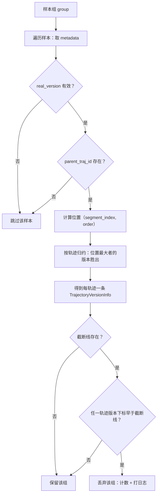
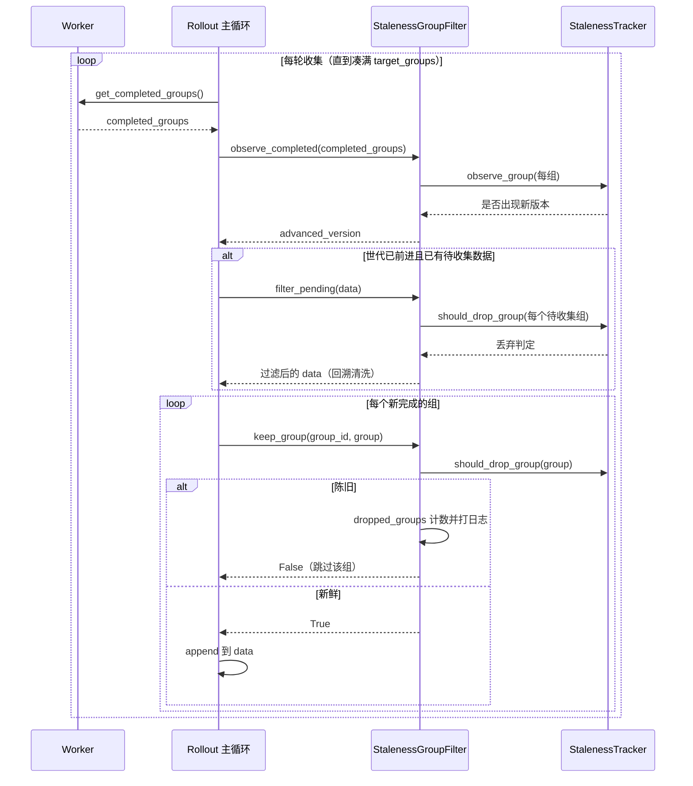

# 异步 Rollout 陈旧度过滤（Staleness）设计说明

## 一句话结论

`staleness.py` 是异步 RL 训练中的**"新鲜度守门员"**：它按模型权重版本（世代）追踪 rollout 样本，把比"最新 N 代"更旧的样本组从训练数据中剔除，从而把异步训练的 off-policy 程度约束在可控范围内。

对应源码：[staleness.py](../dressage/rollout/staleness.py)。

---

## 1. 背景与要解决的问题

### 1.1 什么是"陈旧（staleness）"

先给定义：**陈旧度**指"一个训练样本是用多旧的模型权重生成的"。

- **同步训练**：严格按 `更新权重 → 采样 → 学习` 顺序执行，学习用的样本永远来自当前权重，不存在陈旧问题。
- **异步训练**（`fully_async` / `partial_async`）：采样（rollout）与学习（train）并行推进。当训练侧已经把权重更新到第 K 代时，采样侧可能还在用第 K-3、K-5 代的权重继续产出样本。这些样本一旦进入训练，就是"过旧的 off-policy 数据"。

### 1.2 为什么必须治理

off-policy 程度过高会让策略梯度估计偏差过大，训练容易震荡甚至发散。业界常见做法是设定一个"新鲜度窗口"，只允许最近若干代权重产出的样本参与学习。`staleness.py` 就是这个窗口机制在 Dressage 中的实现。

### 1.3 版本从哪里来

样本的权重版本记录在其 `metadata["dressage_end_token_version"]` 字段里，表示"这条轨迹**结束时**所用的权重版本"。该字段由 Proxy 侧在生成过程中写入（版本来源可参见 [server.py](../dressage/proxy/server.py) 中的 `_real_token_version` 与响应版本记录逻辑）。`staleness.py` 只消费这个字段，不负责生产它。

---

## 2. 核心概念与术语

| 术语 | 白话解释 |
| --- | --- |
| **版本 / 世代（version）** | 一个模型权重快照的标签，值是不透明字符串（如 `"alpha"`、`"v3"`），不保证是递增数字。 |
| **轨迹（trajectory）** | 一次完整的 agent 交互过程，用 `metadata["parent_traj_id"]` 唯一标识。 |
| **段（segment）** | 一条轨迹可能被切成多段（multi-segment rollout），用 `metadata["segment_index"]` 标记先后顺序。 |
| **组（group）** | 同一个 prompt 的一批样本（例如 `n_samples_per_prompt` 条），是训练与丢弃的最小单位。 |
| **保留代数（keep_versions）** | 新鲜度窗口大小：只保留"最新 N 代"产出的组。 |
| **截断线（cutoff）** | 窗口的下界。版本历史里下标小于截断线的都算陈旧。 |

---

## 3. 设计目标与原则

1. **只做过滤，不做生产**：版本由 Proxy 写入 metadata，本模块只读取、判定、剔除，职责单一。
2. **版本标签不透明**：不假设版本是可比较的数字，而是**按"首次出现顺序"维护一个历史列表**，用列表下标衡量新鲜度。这样即使版本号跳号或乱序（如 `"alpha"` 之后是 `"aardvark"`），也能正确判断先后（见 [test_staleness.py](../tests/test_staleness.py) 中 `test_tracker_drops_by_observed_version_order_not_label_sort`）。
3. **保守丢弃**：一个组内只要有**任意一条**轨迹陈旧，整组丢弃，避免半新半旧的组混入训练。
4. **默认关闭**：不配置或配置为 0 时功能完全旁路，全部放行，保证零侵入。
5. **不可变值对象 + 集中状态**：配置与值对象用 `frozen=True` 数据类，唯一可变状态集中在 `StalenessTracker` / `StalenessGroupFilter`，便于推理并发安全性。

---

## 4. 数据模型

模块用四个数据类描述"配置"与"值对象"，全部位于 [staleness.py](../dressage/rollout/staleness.py)：

- **`StalenessConfig`**（第 11-17 行，`frozen`）：只有一个字段 `keep_versions: int | None`；`enabled` 属性在 `keep_versions is not None` 时为真。
- **`TrajectoryVersionInfo`**（第 20-23 行，`frozen`）：`(key, version)` 二元组，表示"某条轨迹最终用的版本"。
- **`PendingGroup`**（第 26-29 行，`frozen`）：`(group_id, samples)`，代表一个待收集进 batch 的候选组。
- **`StalenessTracker`** / **`StalenessGroupFilter`**（可变）：见第 7 节。

### 配置入口 `config_from_args`

位于第 32-41 行。它从训练参数 `args.dressage_staleness_keep_versions` 生成配置，规则：

- 缺省 / `None` → 返回空配置（`enabled=False`）。
- `0` → 同样视为关闭（`enabled=False`）。
- 正整数 `N` → `StalenessConfig(keep_versions=N)`。
- 负数 → 直接抛 `ValueError`。

（对应测试 `test_config_from_args_defaults_disabled_and_rejects_negative`。）

---

## 5. 版本提取：从样本到"轨迹版本"

这一层负责把杂乱的样本 metadata 收敛成"每条轨迹一个版本"，是判定的前置步骤。

### 5.1 `real_version`（第 44-50 行）

把无意义的占位版本归一化为 `None`。视为"无版本"的取值集合为 `_NON_REAL_VERSIONS = {"", "-1", "unknown", "none"}`（大小写不敏感、去除首尾空格）。其余字符串原样返回，即**版本被当作不透明标签**处理。

### 5.2 `trajectory_key`（第 53-56 行）

取 `metadata["parent_traj_id"]` 作为轨迹标识；缺失则返回空串 `""`。空 key 的样本在后续会被跳过（无法归属到某条轨迹）。

### 5.3 `trajectory_version_infos`（第 65-84 行）——核心归约

对一个组内的样本做归约，产出"每条轨迹一条 `TrajectoryVersionInfo`"。关键规则：

1. **只认有效版本**：`real_version` 为 `None` 的样本跳过。
2. **只认有 key 的样本**：`parent_traj_id` 为空的样本跳过。
3. **取"最后一段"的版本**：同一条轨迹里，按 `(segment_index, 到达顺序)` 组成的位置排序，选**位置最大**者的版本。也就是说，一条被切成多段的轨迹，**以它最后一段结束时的权重版本为准**（对应 `test_trajectory_version_uses_last_segment_end_version`）。
4. **平局用到达顺序打破**：若 `segment_index` 相同，则后到达的样本胜出（对应 `test_same_segment_index_uses_later_sample_order`）。

这一步用 `_segment_index`（第 59-62 行）把 `segment_index` 与遍历序号打包成可比较的 `(int, int)` 元组来实现稳定排序。

---

## 6. 判定算法：版本历史与截断线

判定逻辑集中在 `StalenessTracker`（第 87-132 行）。

### 6.1 版本历史 `versions`

一个**按首次出现顺序**追加的列表，例如 `["old", "middle", "new"]`。下标越大越新。这是"用出现顺序而非标签排序衡量新鲜度"原则的落地。

### 6.2 关键属性

- `current_version_index`（第 92-94 行）：最新版本的下标，即 `len(versions) - 1`；空历史返回 `None`。
- `cutoff_version_index`（第 96-100 行）：**截断线** = `max(0, len(versions) - keep_versions)`。功能关闭或历史为空时返回 `None`。
- `current_version_label` / `cutoff_version_label`：上述两个下标对应的版本字符串，主要用于日志。

### 6.3 观察与丢弃

- `observe_group`（第 111-119 行）：遍历组内各轨迹版本，遇到历史里没有的新版本就 `append`。若历史长度发生变化，返回 `True`（表示"世代前进了"）。功能关闭时直接返回 `False`。
- `should_drop_group`（第 121-129 行）：只要组内**任意**一条轨迹的版本下标 `< cutoff`，即判定该组陈旧、应丢弃。截断线为 `None` 时永不丢弃。

### 6.4 一个完整例子

```text
versions      = [v0, v1, v2, v3, v4]   # 左旧右新
keep_versions = 3
cutoff_index  = max(0, 5 - 3) = 2      # 下标 < 2（即 v0、v1）判定陈旧

到来的组：某轨迹最后一段版本 = v1 → index(v1)=1 < 2 → 整组丢弃
到来的组：所有轨迹版本 ≥ v2         → 保留
```

### 6.5 边界处理小结

- **无版本 / 无 key 的样本**：既不推进版本历史，也不触发丢弃（`test_missing_versions_do_not_advance_or_drop`、`test_missing_parent_traj_id_does_not_advance_or_drop`）。
- **半新半旧的组**：只要有一条陈旧就整组丢（`test_mixed_group_drops_when_any_versioned_trajectory_is_stale`）。

---

### 6.6 判定流程图

把"一个组从进来到被判定"的完整路径串起来（对应第 5、6 节的函数链）：



---

## 7. 组件职责

### 7.1 `StalenessTracker`（状态：版本历史）

纯粹的"版本记账 + 判定"内核，不关心 rollout 流程、不打日志。持有 `config` 与 `versions`，对外提供第 6 节的属性与方法。

### 7.2 `StalenessGroupFilter`（状态：丢弃计数）

面向 rollout 主循环的"外观（facade）"，包装一个 tracker，并额外持有 `rollout_name`（用于日志区分 `partial` / `fully`）与 `dropped_groups` 计数。核心方法（第 135-215 行）：

- `observe_group` / `observe_completed`：把新完成的组喂给 tracker 推进版本历史；`observe_completed` 会遍历 `completed_groups` 中每个 `completed.result`，任一推进了版本就返回 `True`。
- `keep_group`（第 152-158 行）：单组判定入口。功能关闭或不该丢 → 返回 `True`（保留）；该丢 → 计数 +1、打日志、返回 `False`。
- `filter_pending`（第 160-171 行）：对一批 `PendingGroup` 批量过滤，返回仍需保留的组。功能关闭时原样返回。
- `metrics_for_groups`（第 173-200 行）：产出监控指标（见第 9 节）。
- `_drop_group`（第 202-215 行）：统一的丢弃日志，包含截断线/当前世代的下标与标签、累计丢弃数。

---

## 8. 与 Rollout 主循环的集成

两种异步模式的用法一致，均在收集训练 batch 的主循环里驱动本模块。

### 8.1 Partial Async

见 [partial_async_rollout.py](../dressage/rollout/partial_async_rollout.py)：

1. Worker 初始化时创建 `StalenessTracker(config_from_args(args))`（第 232 行）。
2. 收集循环里构造 `StalenessGroupFilter`（第 422-425 行）。
3. 每轮：
   - `observe_completed(completed_groups)` 推进版本历史（第 439 行）。
   - 若世代前进且已有待收集数据，则 `filter_pending(data, logger)` **回溯清洗已排队但已变陈旧的组**（第 440-444 行）——这是关键点：新版本到来会让之前“合格”的组变旧。
   - 对每个新完成的成功组调用 `keep_group(...)`，通过才 append 进 `data`（第 498-502 行）。

### 8.2 Fully Async

见 [fully_async_rollout.py](../dressage/rollout/fully_async_rollout.py)：结构相同（`observe_completed` 在第 446 行、`filter_pending` 在第 449 行附近），同样"新版本到来 → 回溯清洗待收集队列"。

---

### 8.3 主循环交互时序图

以 partial async 为例，主循环与过滤组件的交互顺序（fully async 结构相同）：



关键点：**版本前进（advanced_version）是先于单组判定发生的**——先让 tracker 看到最新世代、把截断线推前，再回头清洗已排队但因此变旧的组，最后才判定本轮新完成的组。

---

## 9. 监控指标

`metrics_for_groups`（[staleness.py](../dressage/rollout/staleness.py) 第 173-200 行）在功能开启时产出以下指标（功能关闭返回空字典）：

| 指标 | 含义 |
| --- | --- |
| `staleness/dropped_groups` | 累计丢弃的组数。 |
| `staleness/current_version_index` | 当前最新世代下标。 |
| `staleness/cutoff_version_index` | 当前截断线下标（存在时）。 |
| `staleness/version_gap_min` / `_max` / `_mean` | 各轨迹"版本差距"（`current_index - 该轨迹版本 index`）的最小/最大/均值。 |

**版本差距按轨迹加权**：一个组内每条有效轨迹都单独计入 gap 列表，因此长轨迹（多段）与短轨迹在均值里权重不同（对应 `test_metrics_are_trajectory_weighted_by_version_index_gap`）。gap 越大代表越 off-policy，可用于观测异步训练的滞后程度。

---

## 10. 配置与开关

- **参数**：`dressage_staleness_keep_versions`（整数，`>= 0`）。
- **语义**：
  - 不设 / `0` → 关闭陈旧过滤。
  - `N > 0` → 只保留最新 N 代产出的组。
- **入口**：`config_from_args`（第 32-41 行）。

---

## 11. 与 Proxy 层"陈旧拒绝"的关系（易混淆点）

Dressage 里有**两处**和 staleness 相关、但层次不同的机制，注意区分：

1. **本模块（组级、训练前过滤）**：在 rollout 收集阶段，按版本历史下标丢弃"整体过旧"的组。粒度是"组"，触发在训练侧收集 batch 时。
2. **Proxy 层（轨迹级、生成中拒绝）**：[server.py](../dressage/proxy/server.py) 中的 `_raise_if_partial_version_span_exceeded`（第 127-170 行），当一条 partial rollout 轨迹**跨越的版本数**超过 `max_partial_rollout_preempts + 1` 时，直接以 `partial_rollout_staleness_exceeded` 错误拒绝继续该轨迹。粒度是"单条轨迹"，触发在生成过程中。

二者互补：Proxy 层防止"单条轨迹被抢占太多次、横跨太多版本"；本模块防止"整组样本相对当前权重太旧"。`fully_async_rollout.py` / `partial_async_rollout.py` 里还会识别 `partial_rollout_staleness_exceeded` 标记并统计 `staleness/partial_rollout_rejected_groups` 等指标（见 `_group_has_staleness_failure`）。

---

## 12. 涉及文件

- [staleness.py](../dressage/rollout/staleness.py) —— 本模块实现。
- [partial_async_rollout.py](../dressage/rollout/partial_async_rollout.py) —— partial 模式集成。
- [fully_async_rollout.py](../dressage/rollout/fully_async_rollout.py) —— fully 模式集成。
- [server.py](../dressage/proxy/server.py) —— 版本写入与 Proxy 层陈旧拒绝。
- [test_staleness.py](../tests/test_staleness.py) —— 行为基准测试。
