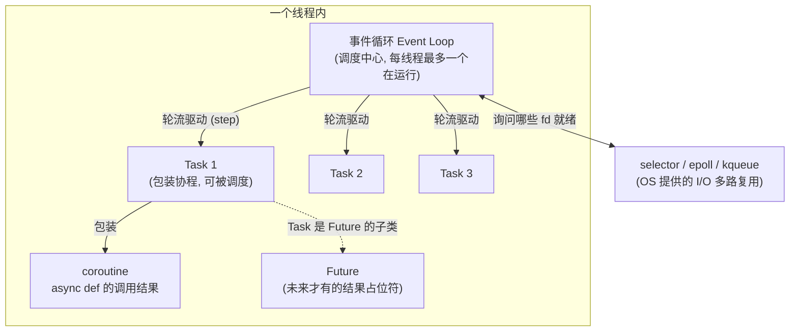
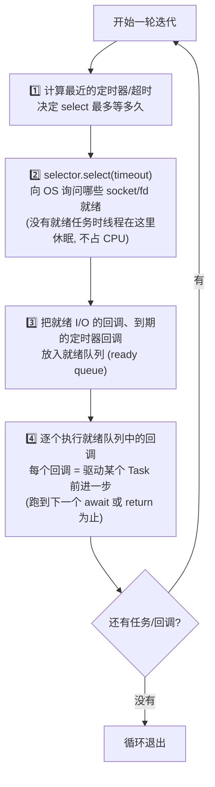
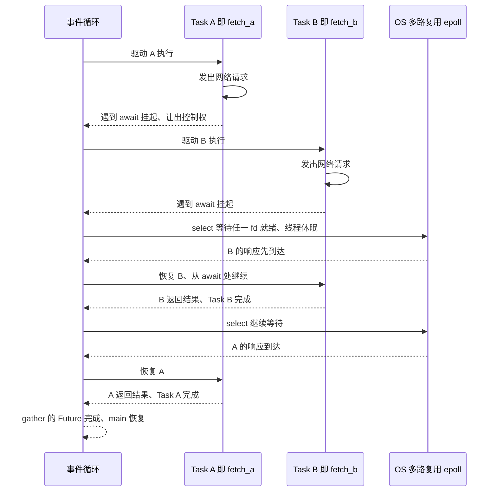
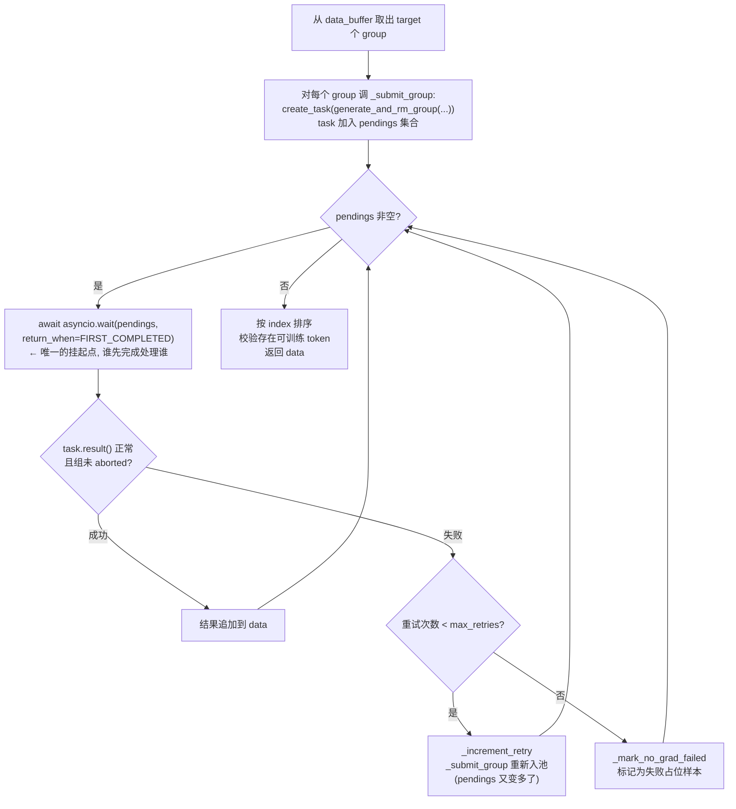
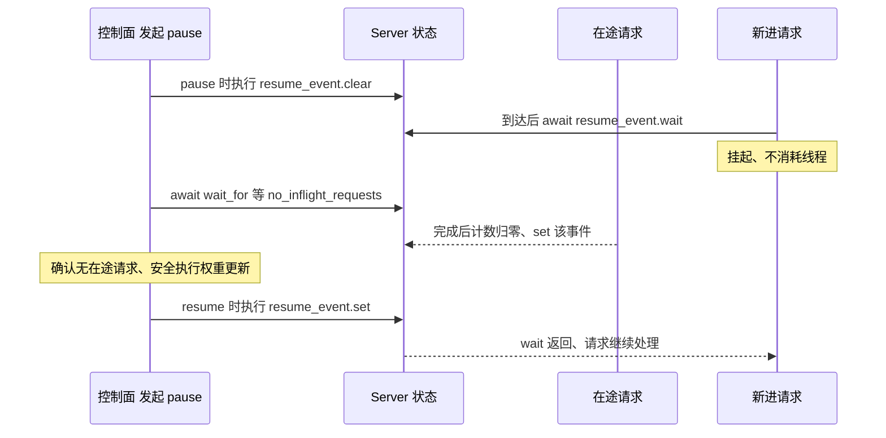

# asyncio 详解：原理、用法与 Dressage 中的实践

> **一句话结论**：asyncio 是 Python 的"单线程协作式并发"框架——用一个事件循环（Event Loop）在**一个线程**里调度成百上千个协程（coroutine），协程在遇到 `await` 时主动让出控制权，从而让 I/O 等待（网络请求、子进程、锁等待）不阻塞其他工作。Dressage 中所有 rollout 并发、沙箱管理、HTTP 服务的并发能力都建立在它之上。

本文分为四部分：

1. [核心概念与原理](#1-核心概念与原理)：事件循环、协程、Task、Future 是什么，怎么协作
2. [常用 API 与示例](#2-常用-api-与示例)：每个 API 先讲输入输出，再讲行为
3. [同步原语与进阶模式](#3-同步原语与进阶模式)：Lock / Event / Queue / 子进程 / 线程桥接
4. [Dressage 中的实战模式解析](#4-dressage-中的实战模式解析)：项目真实代码的逐段解读

---

## 1. 核心概念与原理

### 1.1 为什么需要 asyncio？

传统同步代码里，一次网络请求会让整个线程停下来干等：

```python
import requests

def fetch_all(urls):
    results = []
    for url in urls:          # 串行：100 个请求 = 100 次等待叠加
        results.append(requests.get(url))
    return results
```

三种并发方案对比：

| 方案 | 并发单位 | 切换方式 | 适用场景 | 代价 |
|------|----------|----------|----------|------|
| 多进程 | 进程 | OS 抢占式 | CPU 密集 | 内存开销大、通信贵 |
| 多线程 | 线程 | OS 抢占式 | 阻塞 I/O | GIL 限制、锁竞争、每线程 ~8MB 栈 |
| **asyncio** | **协程** | **协作式（`await` 主动让出）** | **高并发 I/O** | 一处阻塞全部卡死；生态需 async 版库 |

Dressage 的典型负载正是 asyncio 的主场：同时向 sglang 推理引擎发起几十上百个 rollout 请求、每个请求要等模型生成几秒到几分钟——等待期间 CPU 完全空闲，用协程可以在单线程内把这些等待"叠"在一起。

### 1.2 三个核心对象



- **协程（coroutine）**：`async def` 函数被调用后返回的对象。它本身**不会执行**，只是"一段可以暂停/恢复的代码"的描述。必须被 `await` 或包成 Task 才会运行。
- **Task**：把协程注册到事件循环里的"执行单元"。`asyncio.create_task(coro)` 之后，事件循环就会开始驱动它，**不需要你 await 它才开始跑**。
- **Future**：底层的"结果占位符"，有 pending → done 两个状态。Task 是 Future 的子类。`await future` 的语义是"挂起当前协程，直到这个占位符被填上结果"。

一个最容易踩的坑，直接演示：

```python
import asyncio

async def work():
    print("working")

async def main():
    work()          # ❌ 什么都不发生！只创建了协程对象，会收到 RuntimeWarning
    await work()    # ✅ 串行执行：等 work 跑完才继续
    t = asyncio.create_task(work())  # ✅ 并发执行：立刻返回，work 在后台被调度
    await t         # 等它完成（也可以不等，但要保留引用防止被 GC）

asyncio.run(main())
```

### 1.3 事件循环一轮迭代在做什么

事件循环本质是一个死循环，每轮做三件事：



关键点：

- **步骤 4 里回调是不可抢占的**。一个协程从"上一个 `await`"跑到"下一个 `await`"之间是原子的——这就是为什么单线程 asyncio 里很多共享状态操作不需要锁；也是为什么**一段同步的 CPU 密集代码或阻塞调用（如 `time.sleep`、`requests.get`）会卡死整个循环**。
- `await` 的本质：当前协程把"我在等什么（一个 Future）"告诉事件循环，然后把控制权交回；等 Future 完成时，事件循环把这个协程重新放入就绪队列。

### 1.4 两个协程的完整调度时序

以 `asyncio.gather(fetch_a(), fetch_b())` 为例：



两个请求的等待时间**重叠**了——总耗时 ≈ max(a, b) 而不是 a + b。这就是 asyncio 并发的全部秘密：**不是同时执行代码，而是同时等待 I/O**。

---

## 2. 常用 API 与示例

### 2.1 `asyncio.run(coro)` — 同步世界的入口

- **输入**：一个协程对象
- **输出**：协程的返回值
- **行为**：新建一个事件循环 → 运行协程直到完成 → 清理并关闭循环

```python
import asyncio

async def main() -> str:
    await asyncio.sleep(1)
    return "done"

result = asyncio.run(main())   # 阻塞 1 秒, result == "done"
```

注意：**一个正在运行事件循环的线程里不能再调 `asyncio.run`**（会抛 `RuntimeError: cannot be called from a running event loop`）。

项目实例——[sync_rollout.py](file:///Users/whisper/Desktop/Dressage_dev/Dressage_inner/dressage/rollout/sync_rollout.py#L39-L40) 用它作为同步入口的兜底实现：

```python
def run(coro):  # slime.utils.async_utils.run 不可用时的降级
    return asyncio.run(coro)

def generate_rollout_sync(args, rollout_id, data_buffer, evaluation=False):
    # 同步函数内部通过 run() 进入异步世界, 跑完整个 rollout 再返回
    data = run(_run_sync_rollout(args, rollout_id, data_buffer))
```

### 2.2 `asyncio.create_task(coro)` — 让协程"后台并发"

- **输入**：协程对象（可选 `name=` 便于调试）
- **输出**：`asyncio.Task` 对象（立即返回，不等待）
- **行为**：把协程注册进当前事件循环，下轮迭代开始驱动它

```python
import asyncio, time

async def fetch(name: str, delay: float) -> str:
    await asyncio.sleep(delay)          # 模拟 I/O 等待
    return f"{name} ok"

async def main():
    t0 = time.perf_counter()
    task1 = asyncio.create_task(fetch("A", 2))   # 立刻开始跑
    task2 = asyncio.create_task(fetch("B", 3))   # 也立刻开始跑
    r1 = await task1                             # 等 A 完成
    r2 = await task2                             # A 完成时 B 已跑了 2 秒, 再等 1 秒
    print(r1, r2, f"{time.perf_counter() - t0:.1f}s")   # A ok B ok 3.0s (不是 5s)

asyncio.run(main())
```

⚠️ **务必保留 Task 的引用**。事件循环只持有 Task 的弱引用，"发射后不管"的 Task 可能被垃圾回收后悄悄消失。项目里 [prewarm/store.py](file:///Users/whisper/Desktop/Dressage_dev/Dressage_inner/dressage/rollout/prewarm/store.py#L85) 的做法是把 Task 存进 record 对象：

```python
task = asyncio.create_task(_initialize(), name=f"prewarm:{session_id}")
# task 被保存在 record 里, 后续 shutdown 时还能 await 它收尾
```

### 2.3 `asyncio.gather(*aws)` — 并发跑一批，按顺序收结果

- **输入**：多个协程/Task；关键参数 `return_exceptions`（默认 False）
- **输出**：一个 list，顺序与传入顺序一致（**不是完成顺序**）
- **行为**：并发执行所有任务，全部完成后返回

```python
async def main():
    results = await asyncio.gather(fetch("A", 2), fetch("B", 1), fetch("C", 3))
    print(results)   # ['A ok', 'B ok', 'C ok'] — 按传入顺序, 总耗时 3s
```

`return_exceptions` 决定错误处理策略：

```python
async def boom():
    raise ValueError("oops")

async def main():
    # 默认: 第一个异常直接向上抛, 其余任务继续在后台跑(不会被取消!)
    # await asyncio.gather(fetch("A", 1), boom())   # 抛 ValueError

    # return_exceptions=True: 异常被当作结果收集, 保证所有任务都结束
    results = await asyncio.gather(fetch("A", 1), boom(), return_exceptions=True)
    print(results)   # ['A ok', ValueError('oops')]
```

项目实例——[bwrap/supervisor.py](file:///Users/whisper/Desktop/Dressage_dev/Dressage_inner/dressage/sandbox/local/bwrap/supervisor.py#L229) 并发启动所有沙箱槽位；[bwrap/manager.py](file:///Users/whisper/Desktop/Dressage_dev/Dressage_inner/dressage/sandbox/local/bwrap/manager.py#L513) 在清理阶段用 `return_exceptions=True` 保证个别失败不打断整体收尾：

```python
await asyncio.gather(*(self._start_slot(slot) for slot in startable))  # 并发启动
await asyncio.gather(*tasks, return_exceptions=True)                   # 收尾时容忍失败
```

### 2.4 `asyncio.wait(tasks, return_when=...)` — 谁先完成先处理谁

- **输入**：Task 集合；`return_when` 可选 `FIRST_COMPLETED` / `FIRST_EXCEPTION` / `ALL_COMPLETED`
- **输出**：`(done, pending)` 两个集合
- **行为**：与 gather 的区别是它**按完成顺序交还控制权**，适合"流水线消费 + 动态补充任务"的场景

```python
async def main():
    pending = {asyncio.create_task(fetch(n, d)) for n, d in [("A", 3), ("B", 1), ("C", 2)]}
    while pending:
        done, pending = await asyncio.wait(pending, return_when=asyncio.FIRST_COMPLETED)
        for task in done:
            print("完成:", task.result())   # 输出顺序: B → C → A (按完成时间)
```

这正是 Dressage 同步 rollout 的骨架，详见 [第 4.1 节](#41-sync_rolloutpy提交等待重试循环)。

### 2.5 `asyncio.wait_for(aw, timeout)` — 给等待加上超时

- **输入**：一个 awaitable + 超时秒数
- **输出**：awaitable 的结果；超时则抛 `asyncio.TimeoutError` **并取消该任务**
- （Python 3.11+ 也可以用 `async with asyncio.timeout(10):` 块语法）

```python
async def main():
    try:
        result = await asyncio.wait_for(fetch("slow", 10), timeout=3)
    except asyncio.TimeoutError:
        print("3 秒没等到, 内部任务已被取消")
```

项目实例——[bwrap/runner.py](file:///Users/whisper/Desktop/Dressage_dev/Dressage_inner/dressage/sandbox/local/bwrap/runner.py#L369) 等待沙箱子进程退出、[harness/provider.py](file:///Users/whisper/Desktop/Dressage_dev/Dressage_inner/dressage/sandbox/remote/harness/provider.py#L132) 给远端 HTTP 调用限时：

```python
await asyncio.wait_for(proc.wait(), timeout=timeout)      # 等子进程退出, 超时就走 kill 流程
await asyncio.wait_for(post, timeout=remaining)           # 剩余预算内完成远端调用
```

### 2.6 任务取消：`task.cancel()`

取消是**协作式**的：`cancel()` 会在任务当前挂起的 `await` 点注入 `CancelledError`，任务可以捕获它做清理（但应重新抛出）。

```python
async def worker():
    try:
        await asyncio.sleep(3600)
    except asyncio.CancelledError:
        print("清理资源...")
        raise                      # 惯例: 清理后必须重新抛出

async def main():
    t = asyncio.create_task(worker())
    await asyncio.sleep(0.1)
    t.cancel()
    await asyncio.gather(t, return_exceptions=True)   # 等取消真正完成
```

---

## 3. 同步原语与进阶模式

> 单线程 asyncio 为什么还需要锁？——因为协程在 `await` 处会让出控制权。如果一段逻辑里有多次 `await`，中途别的协程可能插进来修改共享状态，形成"跨 await 的竞态"。锁保护的就是这种**跨挂起点的临界区**。

### 3.1 `asyncio.Lock` — 互斥锁

```python
lock = asyncio.Lock()

async def update_balance():
    async with lock:              # 同一时刻只有一个协程能进入
        balance = await read_db()     # ← 有 await, 不加锁则可能被穿插
        await write_db(balance + 1)
```

项目实例——[blackbox_server/store/session_store.py](file:///Users/whisper/Desktop/Dressage_dev/Dressage_inner/blackbox_server/store/session_store.py#L13-L14) 采用"**每个 session 一把锁 + 一把索引锁**"的两级设计：

```python
self._locks: dict[str, asyncio.Lock] = {}   # 每个 session 独立的锁, 互不阻塞
self._session_index_lock = asyncio.Lock()   # 保护 _locks 字典本身的增删
```

细粒度锁让不同 session 的请求完全并行，只有操作同一个 session 时才互斥。

### 3.2 `asyncio.Event` — 一次性/可重置的广播信号

- `event.wait()`：挂起，直到有人 `event.set()`（已 set 则立即返回）
- `event.set()`：唤醒**所有**等待者；`event.clear()`：重置

```python
started = asyncio.Event()

async def waiter(n):
    await started.wait()
    print(f"worker {n} 开跑")

async def main():
    tasks = [asyncio.create_task(waiter(i)) for i in range(3)]
    await asyncio.sleep(1)
    started.set()        # 三个 waiter 同时被唤醒
    await asyncio.gather(*tasks)
```

项目实例——[rollout_llm_proxy.py](file:///Users/whisper/Desktop/Dressage_dev/Dressage_inner/blackbox_server/proxy/rollout_llm_proxy.py#L37-L38) 用 Event 表达"排空完成"和"步数超限"两个状态；[core/server.py](file:///Users/whisper/Desktop/Dressage_dev/Dressage_inner/blackbox_server/core/server.py#L100) 用 `_no_inflight_requests` Event 实现"等所有在途请求归零再暂停"的优雅停机，详见 [第 4.2 节](#42-blackbox-server用-event--lock-实现暂停恢复)。

### 3.3 `asyncio.Semaphore` — 并发度限流

```python
sem = asyncio.Semaphore(10)          # 最多 10 个协程同时进入

async def limited_fetch(url):
    async with sem:                  # 第 11 个会在这里排队
        return await fetch(url)

async def main():
    await asyncio.gather(*(limited_fetch(u) for u in urls))   # 总量 1000, 并发恒为 10
```

典型用途：保护下游服务（推理引擎、数据库）不被瞬时打爆。

### 3.4 `asyncio.Queue` — 生产者/消费者解耦

```python
async def producer(q: asyncio.Queue):
    for i in range(20):
        await q.put(i)               # 队列满时会挂起 (背压)
    await q.put(None)                # 结束哨兵

async def consumer(q: asyncio.Queue):
    while (item := await q.get()) is not None:
        await process(item)

async def main():
    q = asyncio.Queue(maxsize=5)     # maxsize 提供天然背压
    await asyncio.gather(producer(q), consumer(q))
```

### 3.5 异步子进程 — `asyncio.create_subprocess_exec`

- **输入**：命令与参数、stdout/stderr 管道配置
- **输出**：`Process` 对象，`proc.wait()` / `proc.communicate()` 都是协程
- 相比 `subprocess.run`，等待子进程期间**不阻塞事件循环**

```python
async def run_cmd(timeout: float):
    proc = await asyncio.create_subprocess_exec(
        "bash", "-c", "sleep 2 && echo hi",
        stdout=asyncio.subprocess.PIPE,
        stderr=asyncio.subprocess.PIPE,
    )
    try:
        stdout, stderr = await asyncio.wait_for(proc.communicate(), timeout=timeout)
    except asyncio.TimeoutError:
        proc.kill()                      # 超时先杀
        await proc.wait()                # 再等确认退出, 防止僵尸进程
        raise
    return stdout.decode()
```

这个"`wait_for` 超时 → `kill` → 再 `wait`"三段式正是 [bwrap/runner.py](file:///Users/whisper/Desktop/Dressage_dev/Dressage_inner/dressage/sandbox/local/bwrap/runner.py#L369-L384) 管理沙箱进程生命周期的写法。

### 3.6 和线程/阻塞代码打交道

事件循环最怕阻塞调用。三件套：

| API | 方向 | 用途 |
|-----|------|------|
| `asyncio.to_thread(func, *args)` | async → 同步 | 把阻塞函数丢进线程池，`await` 其结果，不卡循环 |
| `loop.run_in_executor(pool, func)` | async → 同步 | 同上的底层版本，可指定自定义线程/进程池 |
| `asyncio.run_coroutine_threadsafe(coro, loop)` | 其他线程 → async | 从别的线程向事件循环安全地提交协程 |

```python
import time

def blocking_io():                    # 假设是没有 async 版本的库函数
    time.sleep(2)
    return "data"

async def main():
    # ❌ blocking_io() 直接调用会卡死整个事件循环 2 秒
    # ✅ 丢进线程池, 事件循环期间可以继续调度其他协程
    result = await asyncio.to_thread(blocking_io)
```

判断准则：**任何不带 `await` 的耗时操作（`time.sleep`、`requests`、重型 numpy 计算、同步文件 I/O）都应该考虑丢进线程/进程池**。

---

## 4. Dressage 中的实战模式解析

### 4.1 `sync_rollout.py`：提交—等待—重试循环

[_run_sync_rollout](file:///Users/whisper/Desktop/Dressage_dev/Dressage_inner/dressage/rollout/sync_rollout.py#L70-L149) 是项目里最典型的 asyncio 并发模式，值得逐段拆解。

- **输入**：`args`（配置）、`rollout_id`、`data_buffer`（数据源）
- **输出**：`list[list[Sample]]` — 每组样本，按原始 index 排序
- **并发结构**：一次性提交全部 group → `FIRST_COMPLETED` 逐个收割 → 失败组重试注入回任务池



对应代码骨架：

```python
pendings: set[asyncio.Task] = set()
task_to_group: dict[asyncio.Task, list[Any]] = {}

for group in groups:                          # ① 全量提交, N 个任务并发跑
    await _submit_group(args, group, state, pendings, task_to_group)

while pendings:                               # ② 完成一个处理一个
    done, pendings = await asyncio.wait(pendings, return_when=asyncio.FIRST_COMPLETED)
    for task in done:
        group_for_task = task_to_group.pop(task)
        try:
            result_group = task.result()      # 异常在这里重新浮出
        except BaseException as exc:
            error = exc
        ...
        if failed and _retry_count(group_for_task) < max_retries:
            await _submit_group(...)          # ③ 失败重试: 新任务注入回 pendings
```

设计要点：

1. **为什么用 `wait` 而不是 `gather`**？因为需要在循环中**动态补充任务**（失败重试）。`gather` 的任务集合在调用时就固定了；`wait` 返回 `(done, pending)` 后可以把新任务加进 pending 继续等。
2. **`task_to_group` 字典**：`asyncio.wait` 返回的 done 集合是无序的，需要一个 Task→输入 的映射才能知道"完成的这个任务对应哪组数据"——这是 `wait` 模式的标配辅助结构。
3. **`task.result()` 的异常语义**：任务内部抛的异常会存储在 Task 上，调用 `.result()` 时重新抛出。不调 `.result()` 的话异常会在 Task 被 GC 时以 "Task exception was never retrieved" 警告的形式泄漏。

### 4.2 blackbox server：用 Event + Lock 实现暂停/恢复

[core/server.py](file:///Users/whisper/Desktop/Dressage_dev/Dressage_inner/blackbox_server/core/server.py#L94-L104) 维护了一组配合使用的原语：

```python
self._init_lock = asyncio.Lock()               # 保护一次性初始化
self._request_counter_lock = asyncio.Lock()    # 保护在途请求计数
self._no_inflight_requests = asyncio.Event()   # 在途请求 == 0 时 set
self._pause_lock = asyncio.Lock()              # 保护暂停状态切换
self._resume_event = asyncio.Event()           # set = 恢复放行, clear = 暂停
```

暂停/恢复（训练权重更新时冻结推理流量）的协作时序：



[rollout_llm_proxy.py](file:///Users/whisper/Desktop/Dressage_dev/Dressage_inner/blackbox_server/proxy/rollout_llm_proxy.py#L319-L341) 里还有一个进阶技巧——**同时等多个 Event，谁先到听谁的**：

```python
event_task = asyncio.create_task(event.wait())          # 等业务事件
resume_task = asyncio.create_task(resume_event.wait())  # 或者等恢复信号
# 配合 asyncio.wait(..., return_when=FIRST_COMPLETED) 实现"任一条件满足即返回"
```

因为 `Event.wait()` 本身只能等一个事件，把多个 `wait()` 包成 Task 再交给 `asyncio.wait(FIRST_COMPLETED)`，就得到了"或"语义。用完记得取消落选的 Task，避免泄漏。

### 4.3 bwrap supervisor：批量启动 + 细粒度锁 + 后台健康检查

[bwrap/supervisor.py](file:///Users/whisper/Desktop/Dressage_dev/Dressage_inner/dressage/sandbox/local/bwrap/supervisor.py#L195-L231) 组合了前面讲的多个模式：

```python
self._lock = asyncio.Lock()                              # 全局状态锁
self._slot_locks: dict[int, asyncio.Lock] = {            # 每槽位一把锁 (细粒度)
    slot.config.slot_id: asyncio.Lock() for slot in self._slots
}
...
await asyncio.gather(*(self._start_slot(slot) for slot in startable))  # 并发启动全部槽位
self._health_task = asyncio.create_task(self._health_loop())          # 常驻后台巡检任务
```

- 每个沙箱槽位独立加锁：槽位 3 在重启时不影响槽位 5 接活；
- `_health_loop` 是典型的**常驻后台任务**：`create_task` 启动后自循环（内部通常是 `while True: ...; await asyncio.sleep(interval)`），关闭时通过 `cancel()` + `gather(return_exceptions=True)` 收尾。

### 4.4 同步/异步边界：`run(coro)` 桥接

Dressage 的调用链是"同步训练框架 → 异步 rollout 内核"：


边界规则总结：

- **同步 → 异步**：入口用 `asyncio.run()`（或框架封装的 `run()`，它可能处理"已有循环"的复用逻辑）；
- **异步 → 同步阻塞代码**：`await asyncio.to_thread(...)`，绝不直接调用；
- **其他线程 → 事件循环**：`asyncio.run_coroutine_threadsafe(coro, loop)`。

---

## 5. 常见陷阱速查表

| 陷阱 | 症状 | 正确做法 |
|------|------|----------|
| 调用协程忘了 await | 代码"没执行"，`RuntimeWarning: coroutine was never awaited` | `await coro()` 或 `create_task(coro())` |
| 在协程里用 `time.sleep` / `requests` | 整个事件循环卡死，所有并发瞬间失效 | `await asyncio.sleep()` / async 客户端（httpx、aiohttp）/ `to_thread` |
| `create_task` 后不保留引用 | 任务随机消失（被 GC） | 存入集合/对象属性；结束时统一 `gather` |
| Task 异常从不读取 | 退出时打印 `Task exception was never retrieved` | 总是 `await task` 或调用 `task.result()`；批量收尾用 `gather(..., return_exceptions=True)` |
| 跨 `await` 修改共享状态不加锁 | 偶发的状态错乱，难以复现 | 临界区含多个 `await` 时用 `asyncio.Lock` |
| `gather` 默认模式下一个异常不取消其他任务 | 报错后其余任务仍在后台跑，资源泄漏 | 需要"一损俱损"用 `TaskGroup`（3.11+）；需要"全部跑完"用 `return_exceptions=True` |
| 捕获 `CancelledError` 后吞掉 | 任务取消不掉，优雅关闭挂死 | 清理后 `raise` 重新抛出 |
| 在已运行的循环里调 `asyncio.run` | `RuntimeError: cannot be called from a running event loop` | 直接 `await`；跨线程用 `run_coroutine_threadsafe` |
| 子进程超时后只 kill 不 wait | 僵尸进程堆积 | `kill()` 之后必须 `await proc.wait()` |

---

## 6. 延伸阅读

- 官方文档：[asyncio — Asynchronous I/O](https://docs.python.org/3/library/asyncio.html)
- Python 3.11+ 的 [`asyncio.TaskGroup`](https://docs.python.org/3/library/asyncio-task.html#task-groups)：结构化并发，任一子任务失败自动取消兄弟任务，是 `gather` 的现代替代品
- 项目内可对照阅读的文件（按难度递增）：
  1. [dressage/rollout/sync_rollout.py](file:///Users/whisper/Desktop/Dressage_dev/Dressage_inner/dressage/rollout/sync_rollout.py) — wait/FIRST_COMPLETED + 重试
  2. [blackbox_server/store/session_store.py](file:///Users/whisper/Desktop/Dressage_dev/Dressage_inner/blackbox_server/store/session_store.py) — 细粒度锁
  3. [blackbox_server/core/server.py](file:///Users/whisper/Desktop/Dressage_dev/Dressage_inner/blackbox_server/core/server.py) — Event 驱动的暂停/恢复
  4. [dressage/sandbox/local/bwrap/supervisor.py](file:///Users/whisper/Desktop/Dressage_dev/Dressage_inner/dressage/sandbox/local/bwrap/supervisor.py) — 综合：gather、后台任务、子进程、锁
