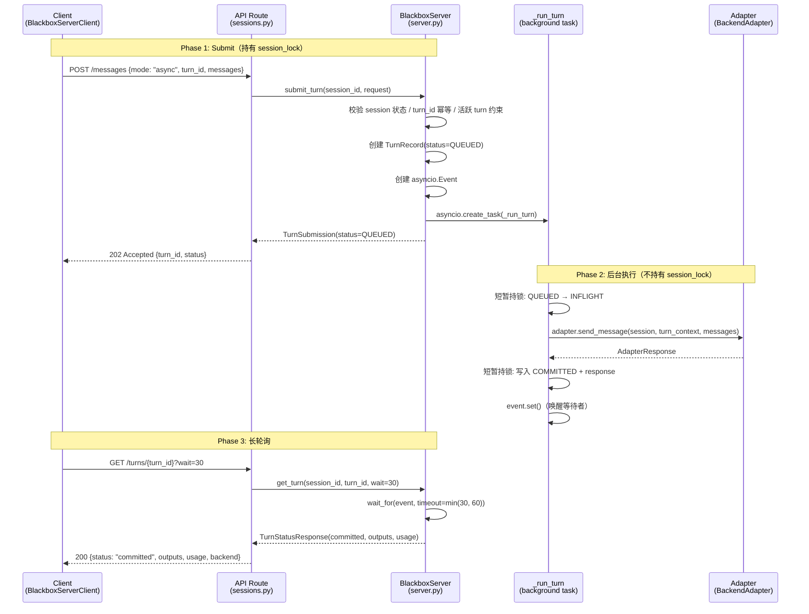
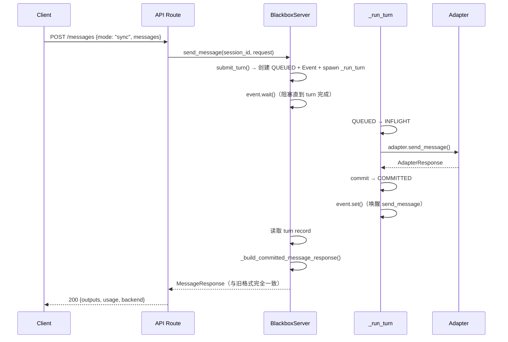
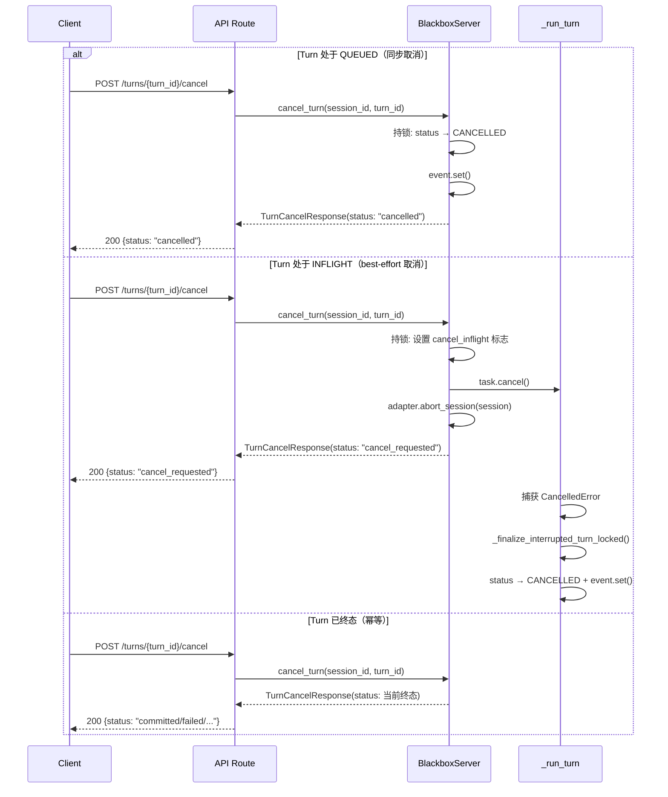
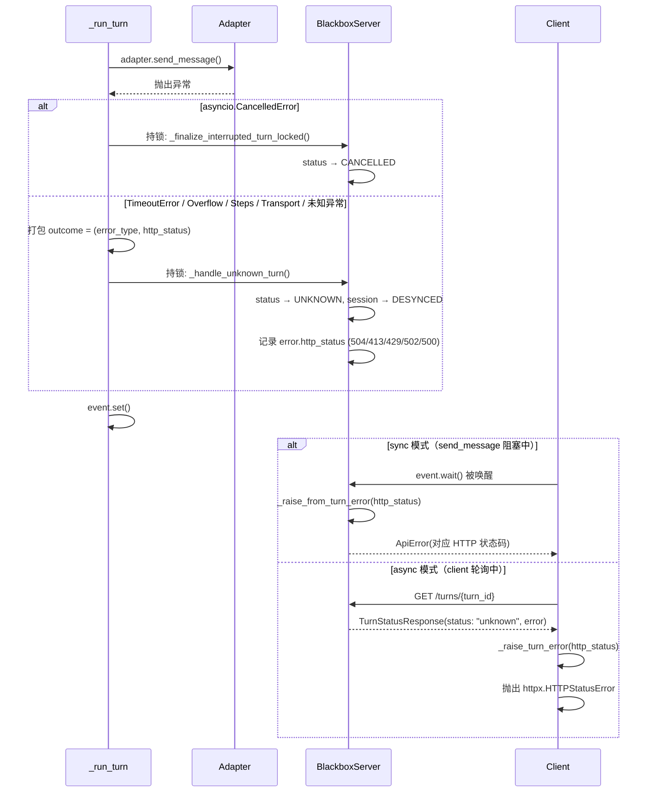
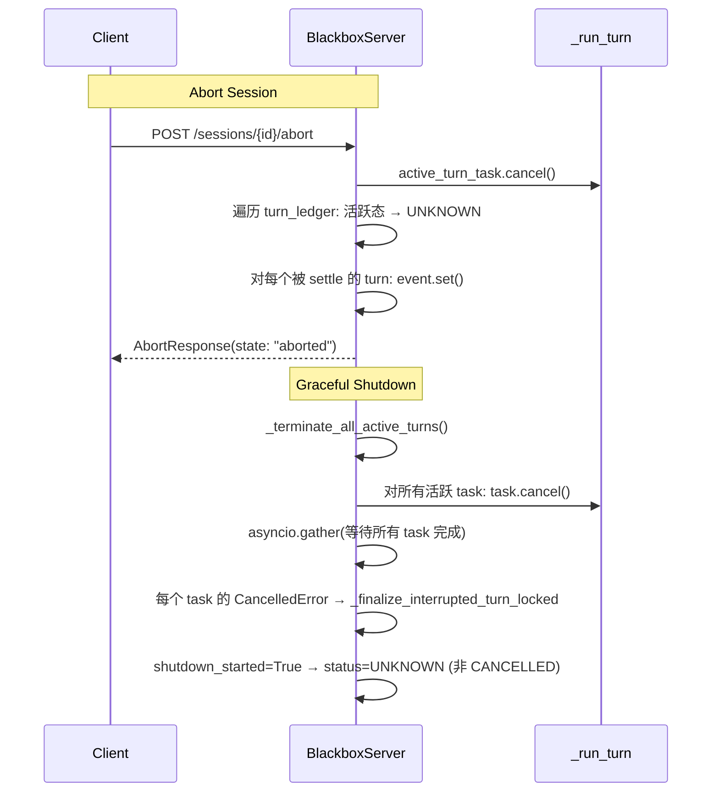
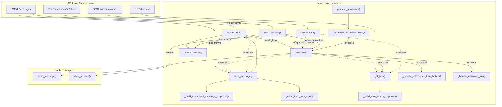
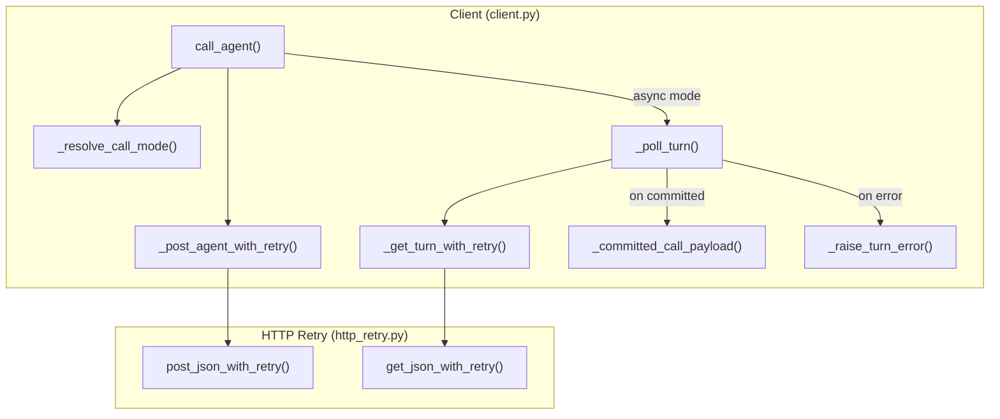
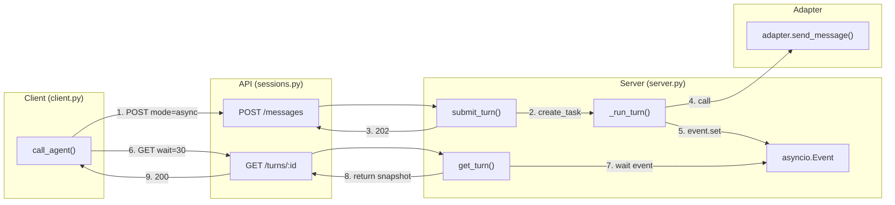

# BlackboxServer 异步 Turn 模型设计文档

> 对应 commit: `77f7f6046657afa97d9b83f7835bf7bba66f51b3`
> 关联 issue: #14

## 1. 背景与目标

### 1.1 旧模型的问题

旧 `POST /v1/sessions/{id}/messages` 采用**请求绑定同步**模型：HTTP 请求持有 `session_lock`，阻塞等待后端 agent 返回。agent turn 可能持续数分钟，期间存在以下问题：

- HTTP 连接被占死，无法释放
- 无法取消正在执行的 turn
- 网络中断即丢失全部进度
- 超时后 turn 卡在 INFLIGHT，session 进入 DESYNCED

### 1.2 新模型的目标

将同步调用拆分为 **submit + long-poll** 两阶段：

- `POST /messages?mode=async` → 立即返回 202，后台异步执行
- `GET /turns/{turn_id}?wait=N` → 长轮询获取结果
- `POST /turns/{turn_id}/cancel` → 取消正在执行的 turn
- `mode=sync` 保持完全向后兼容

## 2. Turn 状态机

### 2.1 状态定义

代码位置：[`models.py` L35-L41](../blackbox_server/core/models.py#L35-L41)

```
旧状态机:  inflight → {committed | unknown}

新状态机:  queued → inflight → {committed | failed | cancelled | unknown}
```

| 状态 | 含义 | 是否终态 |
|------|------|----------|
| `queued` | 已接收，未开始执行 | 否（活跃态） |
| `inflight` | 后端调用进行中 | 否（活跃态） |
| `committed` | 成功完成 | 是 |
| `failed` | 确定性失败 | 是 |
| `cancelled` | 被取消 | 是 |
| `unknown` | 结果未知（超时/进程错误），session → DESYNCED | 是 |

活跃态与终态的分类定义在 [`server.py` L87-L96](../blackbox_server/core/server.py#L87-L96)：

```python
_ACTIVE_TURN_STATUSES = frozenset({TurnStatus.QUEUED, TurnStatus.INFLIGHT})
_TERMINAL_TURN_STATUSES = frozenset({TurnStatus.COMMITTED, TurnStatus.FAILED, TurnStatus.CANCELLED, TurnStatus.UNKNOWN})
_MAX_TURN_WAIT_SECONDS = 60.0
```

### 2.2 状态流转规则

- `submit_turn` 创建记录时状态为 `queued`
- `_run_turn` 后台任务启动后将 `queued → inflight`
- 后端调用成功 → `committed`
- 后端调用异常（超时/溢出/步数超限/通信失败/未预期错误）→ `unknown`，session → `desynced`
- 取消 queued turn → 直接 `cancelled`
- 取消 inflight turn → `task.cancel()` 触发 `CancelledError` → `cancelled`
- abort session → 所有活跃态 turn → `unknown`
- graceful shutdown → 所有活跃态 turn → `unknown`

## 3. 时序图

### 3.1 异步模式完整流程（mode=async）



> 如果 turn 在 `wait` 窗口内未完成，服务端返回当前快照（`queued`/`inflight`），客户端继续轮询。服务端**不返回 504**。

### 3.2 同步模式（mode=sync，向后兼容 facade）



> `send_message` 是 `submit_turn` + `event.wait()` + 响应重建的组合。失败时通过 `_raise_from_turn_error()` 从 turn record 的 `error.http_status` 还原原始 HTTP 错误码（504/413/429/502/500），保证 sync 模式行为与旧实现完全一致。

### 3.3 取消流程



### 3.4 异常处理流程



> 关键设计：所有异常的 `http_status` 被保存在 turn record 的 `error` 字典中，使 sync facade 和 polling client 都能还原完全一致的 HTTP 错误码。

### 3.5 Abort / Shutdown 联动



## 4. 调用关系图

### 4.1 服务端内部调用关系



> 实线 `-->` 表示直接方法调用；虚线 `-.->` 表示通过 `asyncio.Event` 的异步唤醒（非直接调用）。

### 4.2 客户端调用关系



### 4.3 完整数据流



## 5. 关键设计决策

### 5.1 锁纪律：只在准入和提交时短暂持锁

`session_lock` 的持有窗口被严格控制：

| 阶段 | 持锁 | 耗时 |
|------|------|------|
| `submit_turn` 准入 | 是 | 毫秒级（校验 + 创建记录 + spawn task） |
| `_run_turn` 状态流转 queued→inflight | 是 | 毫秒级 |
| `adapter.send_message` 后端调用 | **否** | 可能数分钟 |
| `_run_turn` 提交结果 | 是 | 毫秒级 |
| `get_turn` 读取快照 | 是 | 毫秒级 |

代码位置：
- `submit_turn` 持锁范围：[`server.py` L447-L531](../blackbox_server/core/server.py#L447-L531)
- `_run_turn` 持锁范围：[`server.py` L590-L595](../blackbox_server/core/server.py#L590-L595)（流转）和 [`server.py` L674-L702](../blackbox_server/core/server.py#L674-L702)（提交）
- 后端调用在锁外：[`server.py` L606-L609](../blackbox_server/core/server.py#L606-L609)

### 5.2 向后兼容：sync facade 重建旧错误语义

`send_message`（[`server.py` L533-L574](../blackbox_server/core/server.py#L533-L574)）复用 `submit_turn` + `event.wait()`，然后从 turn record 重建旧格式响应：

- 成功：`_build_committed_message_response()`（[`server.py` L1004-L1027](../blackbox_server/core/server.py#L1004-L1027)）返回 `MessageResponse`
- 失败：`_raise_from_turn_error()`（[`server.py` L1029-L1039](../blackbox_server/core/server.py#L1029-L1039)）从 `error["http_status"]` 还原 `ApiError`

这保证了 `mode=sync` 的 HTTP 状态码和响应体与旧实现完全一致。

### 5.3 幂等性升级：replay 代替 409

旧模型中 INFLIGHT turn 的重试直接返回 409。新模型（[`server.py` L481-L491](../blackbox_server/core/server.py#L481-L491)）：

```python
# Same turn_id + same fingerprint → idempotent replay
return TurnSubmission(
    turn_id=effective_turn_id,
    status=existing.status,      # committed / queued / inflight
    idempotent_replay=True,
    instance_id=self._response_instance_id(),
)
```

- `committed` → replay 缓存结果
- `queued` / `inflight` → 重新附着到同一执行，不启动第二次 agent 调用
- 不同 fingerprint → 仍然 409

客户端（[`client.py` L111-L112](../dressage/paddock/blackbox/client.py#L111-L112)）生成稳定 `turn_id`，跨重试复用，使 submit POST 本身也幂等。

### 5.4 Event 驱动的等待者唤醒

每个 turn 对应一个 `asyncio.Event`（[`server.py` L521](../blackbox_server/core/server.py#L521)），在以下场景被 `set()`：

| 触发者 | 代码位置 | 唤醒的等待者 |
|--------|----------|-------------|
| `_run_turn` finally 块 | [`server.py` L704-L706](../blackbox_server/core/server.py#L704-L706) | `send_message` + `get_turn` |
| `cancel_turn` (queued) | [`server.py` L786-L788](../blackbox_server/core/server.py#L786-L788) | `send_message` + `get_turn` |
| `abort_session` | [`server.py` L969-L971](../blackbox_server/core/server.py#L969-L971) | `send_message` + `get_turn` |

### 5.5 异常全捕获：turn 不卡 INFLIGHT

`_run_turn` 的异常处理（[`server.py` L604-L672](../blackbox_server/core/server.py#L604-L672)）覆盖所有路径：

| 异常类型 | outcome | http_status | session 状态 |
|----------|---------|-------------|-------------|
| `asyncio.CancelledError` | `_finalize_interrupted_turn_locked` | 499 | CANCELLED |
| `asyncio.TimeoutError` | unknown | 504 | DESYNCED |
| `BackendContextOverflowError` | unknown | 413 | DESYNCED |
| `BackendMaxStepsExceededError` | unknown | 429 | DESYNCED |
| `BackendTransportError` / `Protocol` / `Process` | unknown | 502 | DESYNCED |
| `Exception`（未预期） | unknown | 500 | DESYNCED |

### 5.6 单活跃 turn 约束

每个 session 最多一个活跃 turn（[`server.py` L493-L506](../blackbox_server/core/server.py#L493-L506)）：

- `submit_turn` 检查 `_active_turn_id(session)`，有活跃 turn 时返回 409
- `execute_cmd` 也检查活跃 turn（[`server.py` L856-L863](../blackbox_server/core/server.py#L856-L863)），有活跃 turn 时返回 409

## 6. 环境变量与配置

### 6.1 服务端

| 环境变量 | 说明 |
|----------|------|
| `BBS_BACKEND_TIMEOUT` | 后端调用超时（秒），是 turn 执行的最终兜底 |

### 6.2 客户端

代码位置：[`client.py` L29-L37](../dressage/paddock/blackbox/client.py#L29-L37)

| 环境变量 | 默认值 | 说明 |
|----------|--------|------|
| `DRESSAGE_BLACKBOX_AGENT_CALL_MODE` | `async` | 调用模式：`async`（submit + poll）或 `sync`（请求绑定） |
| `DRESSAGE_BLACKBOX_AGENT_POLL_WAIT_SEC` | `30` | 单次长轮询 wait 秒数（服务端 clamp 到 60） |
| `DRESSAGE_BLACKBOX_AGENT_POLL_TOTAL_TIMEOUT_SEC` | `0` | 客户端总轮询预算（0 = 无限，由服务端 `backend_timeout` 兜底） |

### 6.3 新增 HTTP API

| 方法 | 路径 | 说明 |
|------|------|------|
| `POST` | `/v1/sessions/{id}/messages` | `mode=async` → 202 + TurnSubmitResponse；`mode=sync` → 200 + MessageResponse |
| `GET` | `/v1/sessions/{id}/turns/{turn_id}` | 长轮询，`?wait=<seconds>`（clamp 60s），返回 TurnStatusResponse |
| `POST` | `/v1/sessions/{id}/turns/{turn_id}/cancel` | 取消 turn，返回 TurnCancelResponse |

## 7. 涉及文件清单

| 文件 | 变更行数 | 职责 |
|------|----------|------|
| [`blackbox_server/core/server.py`](../blackbox_server/core/server.py) | +591/-151 | 核心重构：submit_turn / _run_turn / send_message / get_turn / cancel_turn |
| [`blackbox_server/core/models.py`](../blackbox_server/core/models.py) | +49/-3 | TurnStatus 扩展 6 态 + 3 个新响应模型 + mode 字段 |
| [`blackbox_server/api/sessions.py`](../blackbox_server/api/sessions.py) | +59/-5 | 新增 GET /turns + POST /cancel 路由，messages 路由分支 |
| [`dressage/paddock/blackbox/client.py`](../dressage/paddock/blackbox/client.py) | +194/-15 | call_agent 默认 async + _poll_turn 轮询循环 |
| [`dressage/paddock/blackbox/common/http_retry.py`](../dressage/paddock/blackbox/common/http_retry.py) | +82 | 新增 get_json_with_retry |
| [`dressage/paddock/interface.py`](../dressage/paddock/interface.py) | +1 | call_agent 签名新增 turn_id 参数 |
| [`dressage/paddock/blackbox/paddock.py`](../dressage/paddock/blackbox/paddock.py) | +2 | call_agent 透传 turn_id |
| [`tests/blackbox_server/test_async_turns.py`](../tests/blackbox_server/test_async_turns.py) | +560 | 新建：async submit/poll/cancel 全流程测试 |
| [`tests/blackbox_server/test_server.py`](../tests/blackbox_server/test_server.py) | +59 | UnexpectedErrorAdapter：验证未预期异常不卡 INFLIGHT |
| [`tests/test_new_paddock_layers.py`](../tests/test_new_paddock_layers.py) | +35/-5 | mock 从单次 200 改为 202 + 轮询 200 |
| [`docs/blackbox-server.md`](../docs/blackbox-server.md) | +77/-5 | API 表格 + 流程图 + curl 示例 |
| [`docs/paddock.md`](../docs/paddock.md) | +5/-1 | call_agent 说明 + 环境变量表 |
