# Dressage 核心架构学习文档

> 本文以 `dressage/` Python 包为核心，系统梳理 Dressage 的设计目标、模块边界、运行时拓扑、关键数据模型、端到端调用链、训练语义和扩展方式。  
> `slime`、SGLang、BlackboxServer、Harbor、Ray、E2B 等仅作为外部系统或运行时边界介绍。

## 目录

1. [先建立整体认知](#1-先建立整体认知)
2. [系统上下文与职责边界](#2-系统上下文与职责边界)
3. [核心包分层与依赖关系](#3-核心包分层与依赖关系)
4. [关键标识符与领域对象](#4-关键标识符与领域对象)
5. [Proxy：推理与轨迹采集核心](#5-proxy推理与轨迹采集核心)
6. [Paddock：Agent 交互语义层](#6-paddockagent-交互语义层)
7. [Sandbox：执行位置与隔离层](#7-sandbox执行位置与隔离层)
8. [Rollout：连接 Agent 与 slime](#8-rollout连接-agent-与-slime)
9. [轨迹到训练数据的转换](#9-轨迹到训练数据的转换)
10. [同步、全异步与部分异步调度](#10-同步全异步与部分异步调度)
11. [权重版本、暂停恢复与 Staleness](#11-权重版本暂停恢复与-staleness)
12. [Reward 与 Advantage 语义](#12-reward-与-advantage-语义)
13. [MOPD 多教师训练](#13-mopd-多教师训练)
14. [Harbor 集成架构](#14-harbor-集成架构)
15. [Recipes 与任务扩展](#15-recipes-与任务扩展)
16. [配置系统与运行入口](#16-配置系统与运行入口)
17. [部署拓扑](#17-部署拓扑)
18. [可靠性与可观测性](#18-可靠性与可观测性)
19. [扩展点与二次开发路线](#19-扩展点与二次开发路线)
20. [架构约束与维护风险](#20-架构约束与维护风险)
21. [推荐源码阅读顺序](#21-推荐源码阅读顺序)
22. [端到端案例推演](#22-端到端案例推演)
23. [架构不变量](#23-架构不变量)

---

## 1. 先建立整体认知

### 1.1 Dressage 是什么

Dressage 不是一个从零实现的 RL 训练框架，而是建立在 slime 之上的 **Agentic RL 适配与编排层**。

它解决的核心问题是：

> 如何把一个会调用真实工具、会修改文件、会执行命令、可能运行几十轮甚至发生上下文压缩的 Agent，转换成 token 对齐、奖励正确、可以直接交给分布式 RL 训练的数据。

Dressage 主要承担四类职责：

1. 统一白盒 Python Agent 与黑盒 Agent Harness。
2. 统一本地 bubblewrap 与远程 E2B 沙箱。
3. 代理每一次模型推理，并记录 token 级训练证据。
4. 把长轨迹和多段轨迹转换为 slime/Megatron 可以训练的样本。

### 1.2 最小心智模型

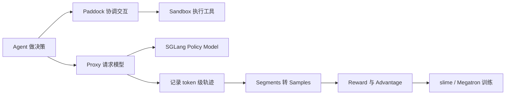

可以用一句话概括每一层：

| 层 | 回答的问题 |
|---|---|
| Agent / Recipe | Agent 应该做什么？ |
| Paddock | 这类 Agent 应该怎样交互？ |
| Sandbox | Agent 和工具在哪里执行？ |
| Proxy | 模型请求怎样路由，并怎样留下训练证据？ |
| Rollout | 一批 Agent 任务怎样调度和收集？ |
| Reward / Training | 轨迹怎样变成正确的 RL 梯度？ |
| slime | 分布式 rollout 和训练怎样运行？ |

### 1.3 Dressage 不负责什么

| 能力 | 主要所有者 |
|---|---|
| Megatron 模型训练、优化器、DP/TP/CP | slime / Megatron |
| Policy Model 高吞吐推理 | SGLang |
| OpenCode、OpenClaw、Claude Code、Codex 的进程适配 | BlackboxServer |
| 远程云沙箱基础设施 | E2B |
| 数据集、Trial、Verifier 的通用评测编排 | Harbor |

---

## 2. 系统上下文与职责边界

### 2.1 全局系统上下文图

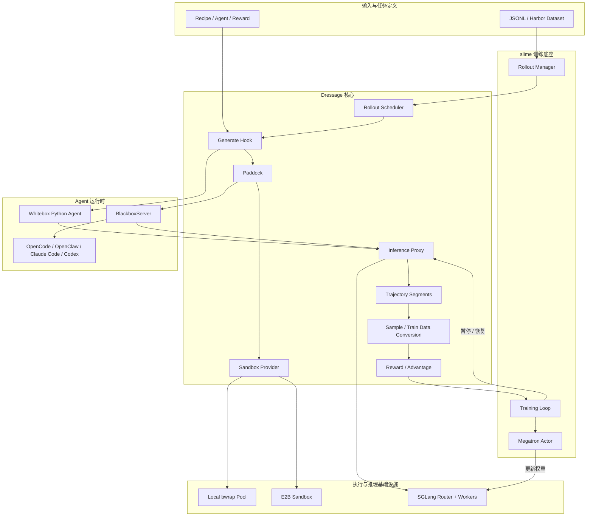

### 2.2 三条正交轴

Dressage 的一个关键设计是把三个维度拆开：

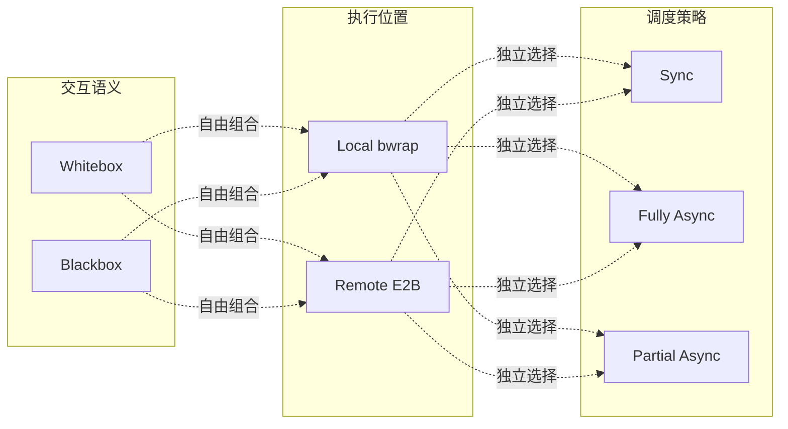

因此：

- Whitebox/Blackbox 决定“谁控制 Agent 循环”；
- Local/E2B 决定“Agent 和工具在哪里运行”；
- Sync/Async 决定“多个 rollout 怎样并发并交付训练”。

---

## 3. 核心包分层与依赖关系

### 3.1 包结构总图

```text
dressage/
├── config/          # 环境变量和共享配置
├── proxy/           # 推理代理、token 记录、session/lineage/segment
├── paddock/         # Agent 交互语义
├── sandbox/         # 沙箱协议和 provider
├── rollout/         # slime rollout hooks 与样本构造
├── reward/          # reward registry 与 RM hook
├── training/        # advantage、train_data、暂停训练、MOPD
├── recipes/         # 具体任务、Agent、工具与奖励
└── integrations/
    └── harbor/      # Harbor 插件、Gateway、Environment、Artifacts
```

### 3.2 模块依赖总图

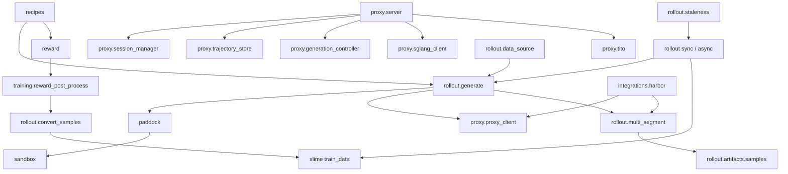

### 3.3 分层规则

正常依赖方向应当是：

```text
recipes / integrations
        ↓
rollout orchestration
        ↓
paddock       proxy client
   ↓               ↓
sandbox       proxy service
        ↓
external runtime
```

训练后处理则是另一条管道：

```text
proxy segment
   ↓
rollout artifacts / multi_segment
   ↓
reward_post_process
   ↓
convert_samples
   ↓
slime train_data
```

### 3.4 Config 包模块图

[`config/config.py`](../dressage/config/config.py) 很小，但它定义了多个子系统共享的默认运行语义。

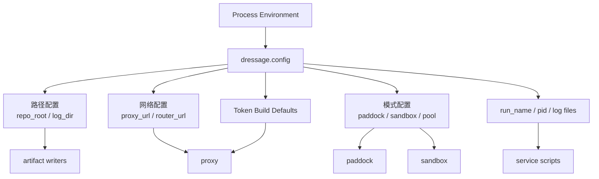

配置函数刻意保持无状态：调用者在运行时读取环境变量，而不是依赖一个庞大的全局配置对象。这样容易嵌入 slime CLI，但也意味着环境变量名称本身就是稳定 API。

### 3.5 Proxy 包源码地图

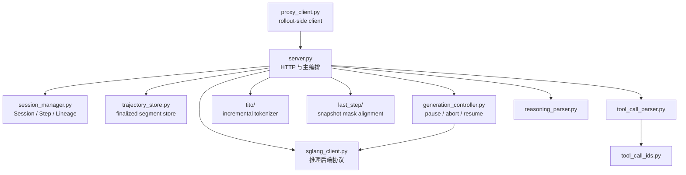

理解 Proxy 时不要只阅读 `server.py` 的接口定义。真正的状态分别位于：

- `SessionManager`：仍在生成的对话状态；
- `GenerationController`：正在运行或被暂停的推理状态；
- `TrajectoryStore`：已经 finalize、等待 rollout 读取的轨迹状态。

### 3.6 Paddock 包源码地图

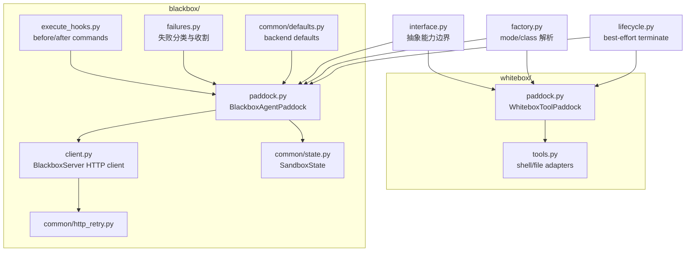

Blackbox 子包的职责并不止“发 HTTP 请求”：

- `defaults.py` 把模型上下文、compact threshold、最大步数等转换为 backend options；
- `execute_hooks.py` 执行 task 级的准备和收尾命令；
- `failures.py` 区分可收割 early stop、预期中止和真正失败；
- `http_retry.py` 统一处理退避、`Retry-After` 和可重试状态码。

### 3.7 Sandbox 包源码地图

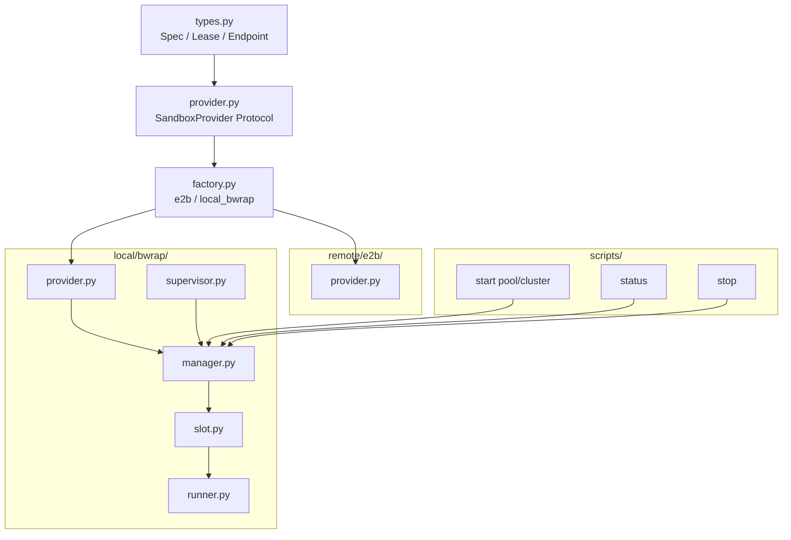

这里存在两个不同层级的生命周期：

1. Provider lease 生命周期：为一条 trajectory 分配和归还资源；
2. Pool/cluster 生命周期：启动或关闭整个本地沙箱基础设施。

不要在一次 rollout 结束时关闭 pool，也不要把 trajectory lease 当成永久沙箱。

### 3.8 Rollout 包源码地图

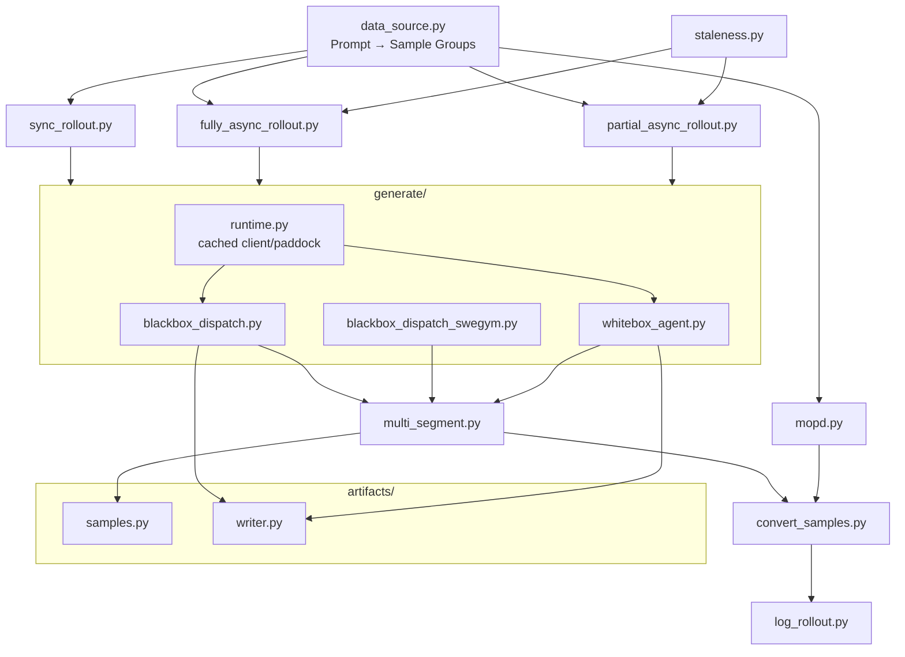

Rollout 包可以继续分成四层：

| 子层 | 模块 |
|---|---|
| 输入层 | `data_source.py` |
| 调度层 | `sync_rollout.py`、`fully_async_rollout.py`、`partial_async_rollout.py` |
| 单轨迹生成层 | `generate/` |
| 训练交付层 | `multi_segment.py`、`artifacts/`、`convert_samples.py` |

### 3.9 Reward 与 Training 包源码地图

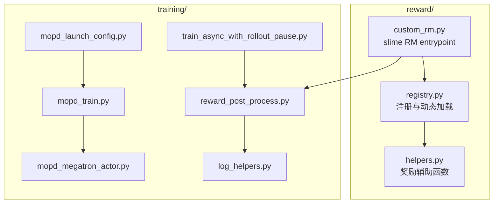

`reward/` 回答“任务得了多少分”，`training/` 回答“这个分数怎样影响所有训练样本”。二者不要混为一层：

- Reward 可以是任务特定的；
- Advantage、广播和 loss scaling 必须是框架级的一致语义。

### 3.10 Recipes 包源码地图

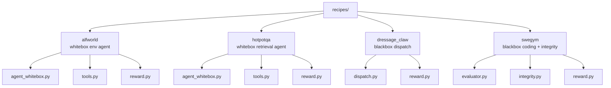

这些 Recipe 同时也是四种扩展示例：

- ALFWorld：环境状态型白盒 Agent；
- HotpotQA：检索工具型白盒 Agent；
- Dressage Claw：自定义黑盒 dispatch；
- SWE-Gym：需要执行后验证、隔离 evaluator 和防作弊检查的代码任务。

### 3.11 Harbor 集成包源码地图

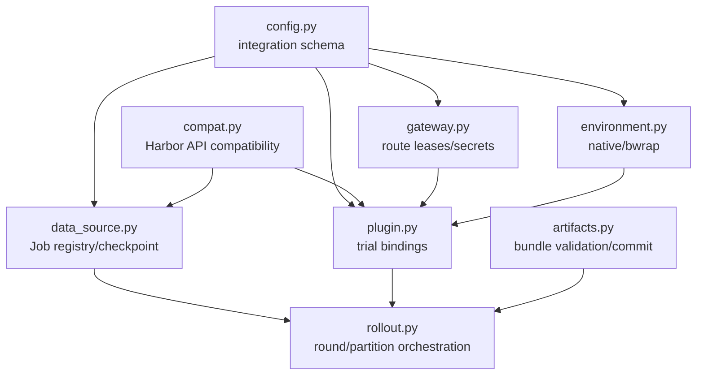

Harbor 集成之所以代码量较大，是因为它不仅做请求路由，还要维护：

- Job、Task、Trial、Attempt 之间的稳定映射；
- route token 和 secret slot 生命周期；
- 不同 Agent 协议；
- trial 重试；
- verifier reward；
- 轨迹 artifact 的完整性和原子提交；
- 数据源 checkpoint 与 resume。

---

## 4. 关键标识符与领域对象

### 4.1 标识符层级

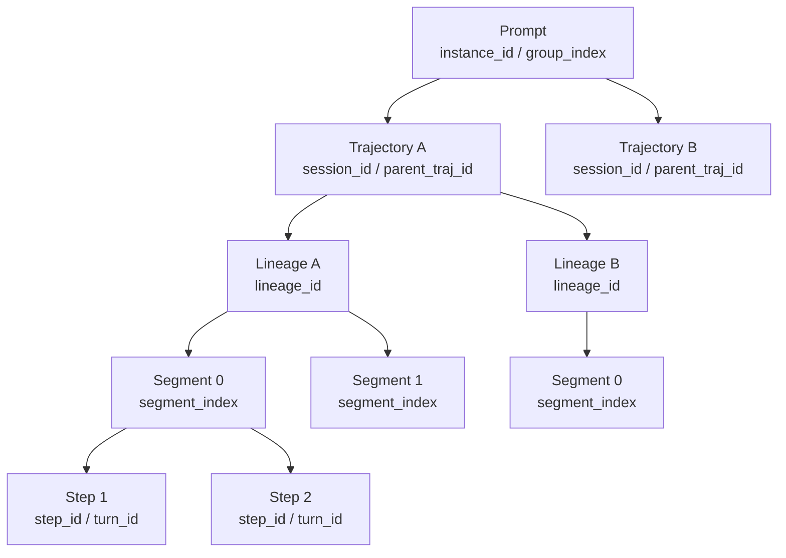

### 4.2 标识符语义

| 标识符 | 粒度 | 主要用途 |
|---|---|---|
| `instance_id` | 一个逻辑 Prompt | prompt-equal 聚合、跨样本归属 |
| `group_index` | slime 的采样组 | GRPO 同 Prompt 多条轨迹归一化 |
| `session_id` | 一次 Agent rollout | Proxy session、Agent session |
| `trajectory_id` | 一条轨迹 | 通常与 `session_id` 等价 |
| `parent_traj_id` | 一组 sibling segments | reward 广播、日志聚合 |
| `rollout_id` | slime 调度单位 | 保证同轨迹 segments 进入同一训练 step |
| `turn_id` | 一次 Agent 对话调用 | 幂等、重试、请求跟踪 |
| `step_id` | 一次模型生成 | Proxy 内部前缀树节点 |
| `lineage_id` | 一条上下文继承分支 | 多 Agent/分叉轨迹重建 |
| `segment_index` | 一条轨迹内的片段序号 | 排序、anchor 选择 |
| token version | 单 token | staleness 和跨版本 mask |
| routed experts | 单 token | MoE Routing Replay |

### 4.3 核心领域对象关系

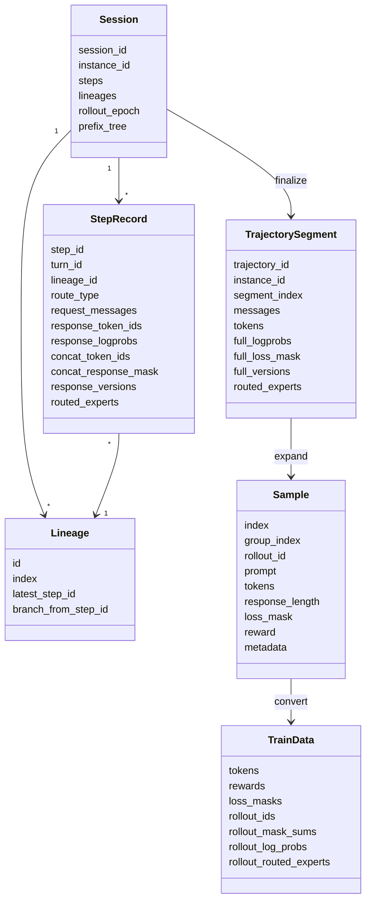

---

## 5. Proxy：推理与轨迹采集核心

核心文件：

- [`proxy/server.py`](../dressage/proxy/server.py)
- [`proxy/session_manager.py`](../dressage/proxy/session_manager.py)
- [`proxy/trajectory_store.py`](../dressage/proxy/trajectory_store.py)
- [`proxy/sglang_client.py`](../dressage/proxy/sglang_client.py)
- [`proxy/generation_controller.py`](../dressage/proxy/generation_controller.py)
- [`proxy/proxy_client.py`](../dressage/proxy/proxy_client.py)

### 5.1 Proxy 内部架构

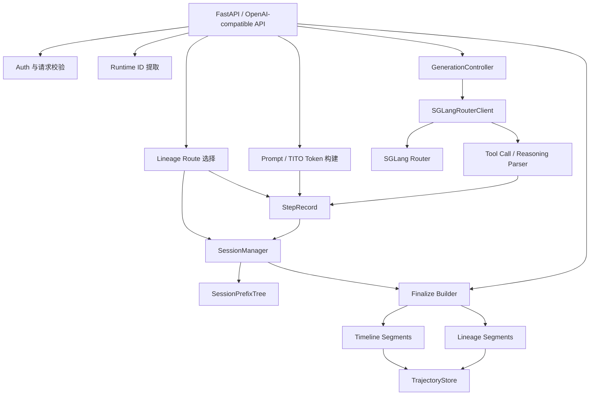

### 5.2 一次 Chat Completion 的完整时序

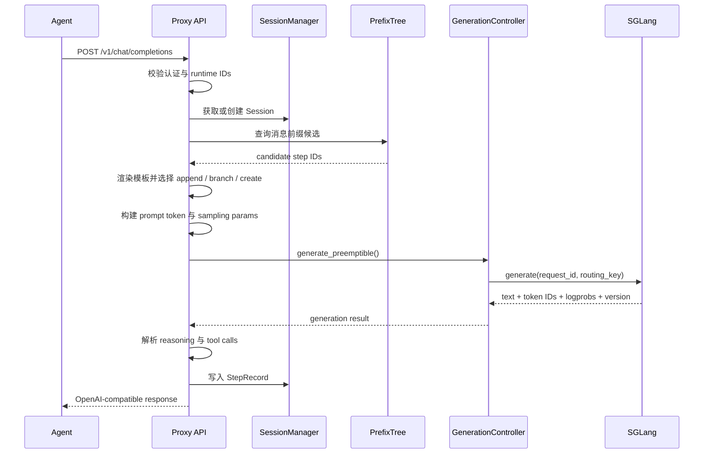

### 5.3 Session 路由与 Lineage

Proxy 不假定一次 session 永远是线性对话。当前请求会被判定为：

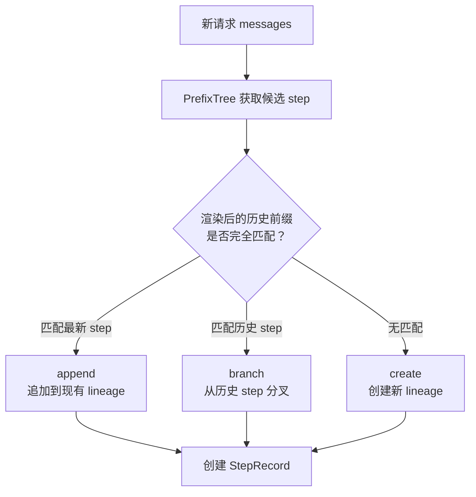

这种模型支持：

- Agent 历史压缩；
- 上下文分支；
- 主 Agent 与子 Agent 的上下文继承；
- 相同 session 中的多条 lineage；
- lineage-aware TITO。

### 5.4 StepRecord 记录什么

每一次 assistant generation 都会记录：

```text
请求证据
├── request_messages
├── normalized_request_messages
├── tools
└── prompt_token_ids

输出证据
├── response_token_ids
├── response_logprobs
├── raw_response_text
├── finish_reason
└── tool/reasoning parsing result

训练证据
├── concat_token_ids
├── concat_response_logprobs
├── concat_response_mask
├── token versions
└── routed experts

拓扑证据
├── step_id
├── lineage_id
├── route_type
├── route_base_step_id
└── segment boundary reasons
```

### 5.5 TITO 与 Snapshot

#### TITO 增量 token 化

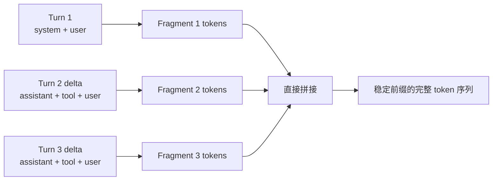

TITO 的关键约束是 **append-only**。已有历史内容不能静默改变，否则 prefix token 与 rollout logprob 将不再对齐。

#### Snapshot 模式

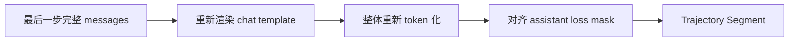

| 对比项 | TITO | Snapshot |
|---|---|---|
| token 来源 | 每轮 append delta | 最后一步完整快照 |
| 前缀稳定性 | 强 | 依赖 tokenizer 行为 |
| 长多轮轨迹 | 推荐 | 风险较高 |
| 模型适配成本 | 需要固定模板适配 | 较通用 |
| lineage 支持 | 原生 | 以快照为中心 |

### 5.6 Segment 边界判定

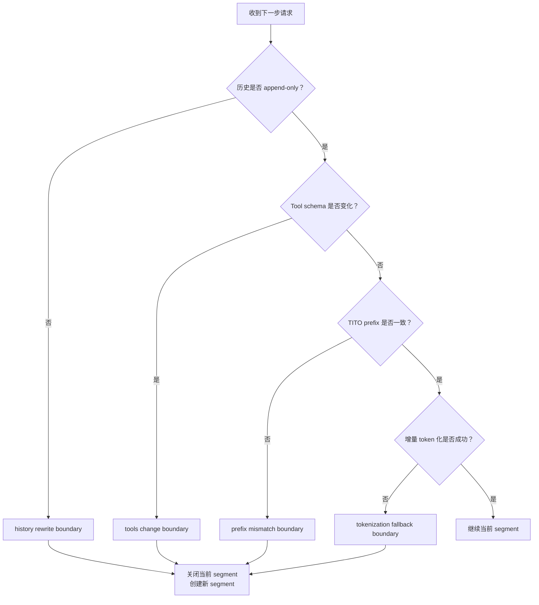

### 5.7 Finalize 时序

```mermaid
sequenceDiagram
    participant R as Rollout Hook
    participant API as Proxy API
    participant SM as SessionManager
    participant FB as Finalize Builder
    participant TS as TrajectoryStore

    R->>API: POST /session/finalize
    API->>SM: 获取 Session 与所有 Steps
    API->>FB: 构建 timeline segments
    API->>FB: 构建 lineage segments
    FB->>FB: 拼接 tokens/logprobs/masks/versions
    FB->>FB: 校验长度、版本和 segment 元数据
    FB->>TS: 原子写入 finalized segments
    API-->>R: finalize result
    R->>API: POST /trajectory/read, drain=true
    API->>TS: 按 trajectory_id 读取并删除
    TS-->>R: segment payload
```

### 5.8 GenerationController 状态机

```mermaid
stateDiagram-v2
    [*] --> Running
    Running --> Generating: chat request
    Generating --> Running: generation complete
    Generating --> Pausing: pause signal
    Running --> Pausing: pause signal
    Pausing --> Paused: active requests aborted and quiesced
    Paused --> Running: resume with version
    Running --> ShuttingDown: shutdown
    Paused --> ShuttingDown: shutdown
    ShuttingDown --> [*]
```

Proxy 主要接口：

| 接口 | 用途 |
|---|---|
| `POST /v1/chat/completions` | Agent 推理并记录 Step |
| `POST /session/finalize` | 关闭 session 并构建 segments |
| `POST /trajectory/read` | 按 session/trajectory 读取 segments |
| `GET /trajectory/stats` | 轨迹存储统计 |
| `POST /v1/rollout/pause` | 暂停并中止活跃生成 |
| `POST /v1/rollout/resume` | 恢复生成并同步版本 |
| `GET /v1/rollout/pause_state` | 查询暂停状态 |
| `GET /health` | 健康、session、store 和配置状态 |

---

## 6. Paddock：Agent 交互语义层

核心文件：

- [`paddock/interface.py`](../dressage/paddock/interface.py)
- [`paddock/factory.py`](../dressage/paddock/factory.py)
- [`paddock/blackbox/paddock.py`](../dressage/paddock/blackbox/paddock.py)
- [`paddock/whitebox/paddock.py`](../dressage/paddock/whitebox/paddock.py)

### 6.1 Paddock 类图

```mermaid
classDiagram
    class Paddock {
        <<abstract>>
        init(traj_id, env_type, env_args)
        terminate(traj_id)
    }

    class BlackboxPaddock {
        <<abstract>>
        register_agent()
        call_agent()
        execute_cmd()
        pause()
        resume()
    }

    class WhiteboxPaddock {
        <<abstract>>
        tool_call()
    }

    class BlackboxAgentPaddock {
        leases
        states
        provider
        BlackboxServerClient
    }

    class WhiteboxToolPaddock {
        leases
        provider
        WhiteboxToolAdapter
    }

    class SandboxProvider {
        <<protocol>>
        create()
        terminate()
        run_command()
        read_file()
        write_file()
    }

    Paddock <|-- BlackboxPaddock
    Paddock <|-- WhiteboxPaddock
    BlackboxPaddock <|-- BlackboxAgentPaddock
    WhiteboxPaddock <|-- WhiteboxToolPaddock
    BlackboxAgentPaddock --> SandboxProvider
    WhiteboxToolPaddock --> SandboxProvider
```

### 6.2 Paddock 与 Sandbox 的边界

```text
Paddock 负责
├── Agent 注册与调用
├── Agent 生命周期
├── Tool 语义
├── Pause / Resume 协调
└── 按 trajectory 管理 lease

Sandbox Provider 负责
├── 创建与销毁隔离环境
├── 服务端口和公开 URL
├── 命令执行
├── 文件读写
└── Provider 特有认证信息
```

Sandbox 层故意不包含 `register_agent` 或 `call_agent`，从而不把 Agent 协议泄漏到基础设施层。

### 6.3 Blackbox Paddock 初始化流程

```mermaid
sequenceDiagram
    participant G as Generate Hook
    participant P as BlackboxAgentPaddock
    participant SP as SandboxProvider
    participant B as BlackboxServer

    G->>P: init(trajectory_id, env_args)
    P->>SP: create(SandboxSpec)
    SP-->>P: SandboxLease
    alt lease 已包含 blackbox endpoint
        P->>P: 使用 lease.endpoint("blackbox")
    else 未包含 endpoint
        P->>SP: get_public_url(port)
        SP-->>P: SandboxEndpoint
    end
    P->>B: GET /health
    B-->>P: healthy
    P-->>G: SandboxState
```

### 6.4 Whitebox 工具调用

```mermaid
sequenceDiagram
    participant A as Whitebox Agent
    participant P as WhiteboxToolPaddock
    participant T as WhiteboxToolAdapter
    participant S as SandboxProvider

    A->>P: tool_call(traj_id, tool_id, args)
    P->>P: resolve SandboxLease
    P->>T: tool_call(lease, tool_id, args)
    alt shell.exec
        T->>S: run_command()
    else file.read
        T->>S: read_file()
    else file.write
        T->>S: write_file()
    end
    S-->>T: result
    T-->>A: text + metadata
```

---

## 7. Sandbox：执行位置与隔离层

核心文件：

- [`sandbox/types.py`](../dressage/sandbox/types.py)
- [`sandbox/provider.py`](../dressage/sandbox/provider.py)
- [`sandbox/factory.py`](../dressage/sandbox/factory.py)
- [`sandbox/local/bwrap/`](../dressage/sandbox/local/bwrap)
- [`sandbox/remote/e2b/provider.py`](../dressage/sandbox/remote/e2b/provider.py)

### 7.1 Provider 中立数据模型

```mermaid
classDiagram
    class SandboxSpec {
        trajectory_id
        env_type
        env_args
        services
        timeout_sec
        metadata
        env
    }

    class SandboxServiceSpec {
        name
        port
        health_path
    }

    class SandboxLease {
        trajectory_id
        provider
        sandbox_id
        endpoints
        capabilities
        metadata
        raw
    }

    class SandboxEndpoint {
        url
        headers
    }

    class CommandResult {
        cmd
        stdout
        stderr
        returncode
        timed_out
    }

    SandboxSpec "1" --> "*" SandboxServiceSpec
    SandboxLease "1" --> "*" SandboxEndpoint
```

### 7.2 Local bwrap 子系统总图

```mermaid
flowchart TB
    PROVIDER["LocalBwrapSandboxProvider"] --> RAY["Ray Named Actors"]
    RAY --> MANAGER["BwrapManager"]
    RAY --> SUP["BwrapSupervisor"]

    MANAGER --> ASSIGN["Trajectory → Slot Assignment"]
    MANAGER --> S0["BwrapSlot 0"]
    MANAGER --> S1["BwrapSlot 1"]
    MANAGER --> SN["BwrapSlot N"]

    SUP -->|"周期健康检查"| S0
    SUP -->|"周期健康检查"| S1
    SUP -->|"周期健康检查"| SN

    subgraph Slot["每个 Slot"]
        NS["bwrap namespace"]
        ROOT["独立 root/work/home/tmp"]
        RUN["BwrapRunner"]
        BBS["可选 BlackboxServer"]
        NS --> ROOT
        RUN --> NS
        RUN --> BBS
    end

    S0 --> Slot
```

### 7.3 Local bwrap Slot 生命周期

```mermaid
stateDiagram-v2
    [*] --> Provisioning
    Provisioning --> Available: namespace/server ready
    Available --> Leased: provider.create
    Leased --> Resetting: provider.terminate
    Resetting --> Available: clean and healthy
    Leased --> Failed: process or health failure
    Failed --> Restarting: supervisor repair
    Restarting --> Available: recovered
    Restarting --> Failed: repair failed
    Available --> Stopped: pool shutdown
    Failed --> Stopped: pool shutdown
    Stopped --> [*]
```

### 7.4 两种 Pool Mode

| 模式 | Slot 内容 | 对应 Paddock |
|---|---|---|
| `blackbox` | bwrap + BlackboxServer + Agent 运行时 | `BlackboxAgentPaddock` |
| `command_only` | bwrap + 命令/文件能力 | `WhiteboxToolPaddock` |

### 7.5 E2B Provider 流程

```mermaid
sequenceDiagram
    participant P as Paddock
    participant E as E2BSandboxProvider
    participant API as E2B API
    participant S as Remote Sandbox

    P->>E: create(SandboxSpec)
    E->>API: create sandbox/template
    API-->>E: sandbox ID
    E->>S: 注入环境变量与启动服务
    E->>API: 获取 public URL
    E-->>P: SandboxLease + Endpoint
    P->>S: Agent/Tool interaction
    P->>E: terminate(lease)
    E->>API: kill sandbox
```

---

## 8. Rollout：连接 Agent 与 slime

核心目录：[`rollout/`](../dressage/rollout)

### 8.1 slime Hook 总图

```mermaid
flowchart LR
    SL["slime Training Loop"]

    SL --> DS["Data Source Hook"]
    SL --> RF["Rollout Function Hook"]
    RF --> GF["Generate Function Hook"]
    GF --> RM["Reward Model Hook"]
    RM --> PP["Reward Post Process"]
    PP --> CV["Convert Samples Hook"]
    CV --> LOG["Rollout Log Hook"]

    DS -.-> D1["DressageDataSource"]
    RF -.-> D2["sync / fully async / partial async"]
    GF -.-> D3["blackbox_dispatch / WhiteboxAgent"]
    RM -.-> D4["custom_rm"]
    PP -.-> D5["reward_post_process"]
    CV -.-> D6["convert_samples_to_train_data"]
    LOG -.-> D7["log_rollout_data"]
```

所有 Hook 都通过 dotted import path 注入，不需要 fork 或 monkey-patch slime。

### 8.2 DataSource 数据流

```mermaid
flowchart LR
    J["JSONL Row"] --> P["prompt"]
    J --> L["label"]
    J --> M["metadata"]
    J --> G["generate_function_path"]

    P --> S["slime Sample"]
    L --> S
    M --> S
    G --> S

    S --> GR["复制为 n_samples_per_prompt"]
    GR --> GROUP["Sample Group"]
```

`DressageDataSource` 支持：

- 普通字符串 Prompt；
- 消息列表 Prompt；
- 任意 metadata 透传；
- 每个样本选择不同 generate hook；
- MOPD 多数据集加权轮询；
- buffer、shuffle、resume。

### 8.3 Blackbox Generate 完整时序

```mermaid
sequenceDiagram
    participant S as slime
    participant G as blackbox_dispatch
    participant P as BlackboxPaddock
    participant B as BlackboxServer
    participant X as Dressage Proxy
    participant M as SGLang

    S->>G: generate(args, sample)
    G->>G: 建立 session_id / instance_id
    G->>P: init(session_id)
    P-->>G: SandboxState
    G->>P: register_agent()
    G->>P: before_agent commands
    G->>P: call_agent(messages)

    loop Agent 多轮工具循环
        B->>X: chat/completions
        X->>M: generate
        M-->>X: tokens + logprobs + version
        X-->>B: assistant response
        B->>B: shell/file/tool execution
    end

    P-->>G: final agent response
    G->>P: after_agent commands
    G->>X: finalize_session()
    G->>X: read_trajectory(drain=true)
    X-->>G: segments
    G->>G: expand_segments_to_samples()
    G-->>S: Sample or list[Sample]
    G->>P: terminate()
```

### 8.4 Whitebox Generate 完整时序

```mermaid
sequenceDiagram
    participant S as slime
    participant G as make_generate wrapper
    participant A as WhiteboxAgent
    participant P as WhiteboxPaddock
    participant X as Dressage Proxy
    participant M as SGLang

    S->>G: generate(args, sample)
    G->>A: 创建 Agent 实例
    G->>A: setup(sample)
    opt PaddockWhiteboxAgent
        A->>P: init(session_id)
    end

    loop Agent 自定义 rollout
        A->>X: self.chat(messages)
        X->>M: generate
        M-->>X: tokens + logprobs
        X-->>A: completion
        opt 需要沙箱工具
            A->>P: tool_call()
            P-->>A: tool result
        end
    end

    A->>X: finalize_session()
    A->>X: read_trajectory()
    A->>A: expand_segments_to_samples()
    A-->>G: Sample list
    G->>A: teardown()
    opt PaddockWhiteboxAgent
        A->>P: terminate()
    end
    G-->>S: Sample list
```

### 8.5 失败路径

```mermaid
flowchart TD
    E["Generate 抛出异常"] --> H{"是否为可收割的<br/>Agent early stop？"}
    H -->|是| HV["尝试 finalize 并收割已有轨迹"]
    H -->|否| LOG["写错误日志与失败元数据"]
    HV --> OK{"是否得到有效 segments？"}
    OK -->|是| SAMPLE["生成可训练 Samples"]
    OK -->|否| ABORT["mark_aborted_no_grad"]
    LOG --> ABORT
    ABORT --> FLAGS["remove_sample=True<br/>status=ABORTED<br/>清理 session_id"]
    FLAGS --> RETRY["Async scheduler 可重试原始 group"]
```

---

## 9. 轨迹到训练数据的转换

核心文件：

- [`rollout/multi_segment.py`](../dressage/rollout/multi_segment.py)
- [`rollout/artifacts/samples.py`](../dressage/rollout/artifacts/samples.py)
- [`rollout/convert_samples.py`](../dressage/rollout/convert_samples.py)
- [`training/reward_post_process.py`](../dressage/training/reward_post_process.py)

### 9.1 数据管道总图

```mermaid
flowchart LR
    ST["StepRecord[]"] --> FS["Proxy Finalize"]
    FS --> SEG["TrajectorySegment[]"]
    SEG --> EXP["expand_segments_to_samples"]
    EXP --> SMP["Sample[]"]
    SMP --> RM["custom_rm"]
    RM --> ADV["reward_post_process"]
    ADV --> CONV["convert_samples_to_train_data"]
    CONV --> TD["slime train_data"]
    TD --> MG["Megatron Actor"]
```

### 9.2 Segment 到 Sample 字段映射

| Segment 字段 | Sample 字段 |
|---|---|
| `tokens` | `sample.tokens` |
| `full_loss_mask` | `sample.loss_mask` |
| `full_logprobs` | `sample.rollout_log_probs` |
| `full_versions` | `sample.metadata["full_versions"]` |
| `routed_experts` | `sample.rollout_routed_experts` |
| assistant message | `sample.response` |
| `finish_reason` | `sample.status` / metadata |
| `segment_index` | `metadata["segment_index"]` |
| `trajectory_id` | `metadata["parent_traj_id"]` |

### 9.3 Multi-Segment 展开

```mermaid
flowchart TB
    TRAJ["一个 Agent Trajectory"]
    TRAJ --> S0["Segment 0<br/>analysis + first edits"]
    TRAJ --> S1["Segment 1<br/>tests + debugging"]
    TRAJ --> S2["Segment 2<br/>final fix"]

    S0 --> P0["Sample 0<br/>reward = 0"]
    S1 --> P1["Sample 1<br/>reward = 0"]
    S2 --> P2["Sample 2 / Anchor<br/>reward = None → reward_fn"]

    P0 --> SHARED["共享 rollout_id<br/>共享 parent_traj_id<br/>共享 instance_id"]
    P1 --> SHARED
    P2 --> SHARED
```

展开过程：

1. 按 `segment_index` 排序；
2. 检查重复 index；
3. 每个 segment 深拷贝一份模板 Sample；
4. 写入 tokens、mask、logprobs、version 和 response；
5. 所有 siblings 设置相同 `rollout_id`；
6. 最后一个 segment 作为 anchor；
7. 非 anchor 的 `reward` 预设为 `0.0`。

### 9.4 为什么所有 Segment 必须共享 rollout_id

```mermaid
flowchart LR
    P0["Trajectory A / Segment 0"] --> RID["rollout_id = 42"]
    P1["Trajectory A / Segment 1"] --> RID
    P2["Trajectory A / Segment 2"] --> RID
    RID --> DP["slime build_dp_schedule"]
    DP --> STEP["同一个 Training Step"]
```

如果 sibling segments 被拆到不同训练 step：

- anchor reward 无法和前序 segment 同步；
- prompt-equal denominator 不完整；
- trajectory 级梯度语义被破坏；
- 版本和日志指标难以正确聚合。

### 9.5 Train Data 结构

```text
train_data
├── tokens
├── response_lengths
├── rewards
├── raw_reward
├── loss_masks
├── rollout_ids
├── rollout_mask_sums
├── rollout_log_probs
├── rollout_routed_experts
├── sample_indices
├── truncated
├── metadata
└── prompt              # MOPD 中复用为 teacher_id 路由
```

---

## 10. 同步、全异步与部分异步调度

### 10.1 三种模式总览

```mermaid
flowchart TB
    subgraph Sync["Sync"]
        S1["取完整 rollout batch"] --> S2["等待全部完成"] --> S3["训练"]
    end

    subgraph Full["Fully Async"]
        F1["后台持续取 group"] --> F2["并发生成"]
        F2 --> F3["Completed Queue"]
        F3 --> F4["收集完整目标 batch"]
        F4 --> F5["训练"]
        F2 -->|"持续运行"| F2
    end

    subgraph Partial["Partial Async"]
        P1["后台持续取 group"] --> P2["并发生成"]
        P2 --> P3["完成足够 group 后提前返回"]
        P3 --> P4["训练"]
        P2 --> P5["剩余 group 继续运行"]
        P5 --> P6["进入后续训练 step"]
    end
```

### 10.2 时间线对比

```mermaid
sequenceDiagram
    participant R1 as Group 1
    participant R2 as Group 2
    participant R3 as Group 3
    participant T as Trainer

    rect rgba(128,128,128,0.08)
        Note over R1,T: Sync：等待最慢组
        R1->>T: complete
        R2->>T: complete
        R3->>T: complete
        T->>T: train step
    end

    rect rgba(128,128,128,0.08)
        Note over R1,T: Async：完成组持续进入缓冲区
        R1->>T: complete → buffer
        R2->>T: complete → buffer
        T->>T: target ready → train
        R3->>T: complete → next batch
    end
```

### 10.3 Fully Async Worker 内部结构

```mermaid
flowchart LR
    DB["Data Buffer"] --> LOOP["Background Thread<br/>asyncio event loop"]
    LOOP --> T1["Task: Group 1"]
    LOOP --> T2["Task: Group 2"]
    LOOP --> TN["Task: Group N"]

    T1 --> CQ["CompletedGroup Queue"]
    T2 --> CQ
    TN --> CQ

    CQ --> FILTER["Failure Retry + Staleness Filter"]
    FILTER --> READY["Trainable Groups"]
    FILTER -->|"retry"| DB
```

`CompletedGroup` 同时保留：

- `group_id`；
- 原始 group；
- 成功结果；
- 异常对象。

这使失败 group 可以重新放回 DataSource buffer，而不是重新构造任务。

### 10.4 Partial Async 的跨 Step 队列

```mermaid
flowchart TB
    W["Persistent PartialAsyncRolloutWorker"]
    W --> A["Active Tasks"]
    A --> Q["Completed Queue"]

    CALL1["Rollout Call N"] --> TAKE1["取 target_groups"]
    Q --> TAKE1
    TAKE1 --> TRAIN1["Train Step N"]

    LEFT["多取出的 completed groups"] --> Q
    A -->|"未完成任务继续"| A

    CALL2["Rollout Call N+1"] --> TAKE2["继续从同一 Queue 取"]
    Q --> TAKE2
    TAKE2 --> TRAIN2["Train Step N+1"]
```

---

## 11. 权重版本、暂停恢复与 Staleness

### 11.1 Token 级版本记录

```mermaid
flowchart LR
    G1["Tokens 0-99<br/>weight v10"] --> SEG["Trajectory Segment"]
    G2["Tokens 100-159<br/>weight v11"] --> SEG
    SEG --> V["full_versions"]
    V --> POLICY{"训练策略"}
    POLICY --> ALL["训练全部允许版本"]
    POLICY --> LAST["只保留最后版本 token mask"]
    POLICY --> DROP["轨迹过旧则丢弃"]
```

### 11.2 权重更新暂停时序

```mermaid
sequenceDiagram
    participant W as Async Rollout Worker
    participant P as Dressage Proxy
    participant S as SGLang
    participant T as Trainer

    W->>P: active chat generation
    P->>S: generate request
    T->>P: pause(reason=weight_update)
    P->>S: abort active request
    S-->>P: partial tokens / aborted
    P->>P: 保存已有 token 并等待 quiesced
    P-->>T: paused, quiesced=true
    T->>S: update model weights
    S-->>T: version vNext ready
    T->>P: resume(version=vNext)
    P-->>W: generation allowed
    W->>P: next/continued request
```

### 11.3 Staleness 过滤

```mermaid
flowchart TD
    G["Completed Group"] --> OBS["提取每条 trajectory 的 end token version"]
    OBS --> TRACK["StalenessTracker 维护版本出现顺序"]
    TRACK --> CUT["计算 cutoff version index"]
    CUT --> OLD{"Group 是否包含<br/>早于 cutoff 的 trajectory？"}
    OLD -->|是| DROP["丢弃 group<br/>记录 metrics"]
    OLD -->|否| KEEP["进入训练 batch"]
```

Staleness 以 **trajectory 的结束版本** 为判断单位，而不是只看 Sample 当前字段。对于多 segment 轨迹，会选择最高 `segment_index` 的版本信息。

---

## 12. Reward 与 Advantage 语义

核心文件：

- [`reward/registry.py`](../dressage/reward/registry.py)
- [`reward/custom_rm.py`](../dressage/reward/custom_rm.py)
- [`training/reward_post_process.py`](../dressage/training/reward_post_process.py)

### 12.1 Reward Registry

```mermaid
flowchart LR
    ENV["DRESSAGE_REWARD_MODULES"] --> LOAD["load_reward_modules"]
    MOD["Recipe reward modules"] --> LOAD
    LOAD --> REG["Reward Registry"]
    META["sample.metadata.reward_fn"] --> LOOK["get_reward_fn"]
    REG --> LOOK
    LOOK --> CALL["call_reward_fn(sample)"]
    CALL --> R["terminal reward"]
```

奖励函数约定：

```python
@register_reward("task_reward")
def task_reward(sample, *, args=None):
    return 1.0
```

支持同步和异步奖励函数。

### 12.2 GRPO 与 Multi-Segment Advantage

```mermaid
flowchart TB
    subgraph Prompt["同一个 Prompt / group_index"]
        T1["Trajectory A<br/>anchor reward = 1"]
        T2["Trajectory B<br/>anchor reward = 0"]
        T3["Trajectory C<br/>anchor reward = 0.5"]
    end

    T1 --> N["按 Prompt 做 GRPO 中心化"]
    T2 --> N
    T3 --> N

    N --> A1["Trajectory A advantage"]
    N --> A2["Trajectory B advantage"]
    N --> A3["Trajectory C advantage"]

    A1 --> B1["广播到 A 的全部 segments"]
    A2 --> B2["广播到 B 的全部 segments"]
    A3 --> B3["广播到 C 的全部 segments"]
```

### 12.3 Raw Reward 与 Processed Reward 的区别

对于三段轨迹：

```text
raw_rewards     = [0, 0, terminal_reward]
processed_reward = [advantage, advantage, advantage]
```

`raw_rewards` 不广播的原因：

- trajectory 级指标可通过 segment 求和恢复终局 reward；
- 避免多 segment 轨迹在日志中被重复计数；
- 保持原始 verifier/reward 证据稀疏且可解释。

### 12.4 Prompt-Equal 梯度归一化

```mermaid
flowchart TB
    P1["Prompt A<br/>3 trajectories / 6 segments"]
    P2["Prompt B<br/>3 trajectories / 3 segments"]

    P1 --> M1["计算 Prompt A 所有有效 mask token 总数 M_A"]
    P2 --> M2["计算 Prompt B 所有有效 mask token 总数 M_B"]

    M1 --> D1["每个 A sample denominator<br/>M_A × N_P / GBS"]
    M2 --> D2["每个 B sample denominator<br/>M_B × N_P / GBS"]

    D1 --> EQ["每个 Prompt 保持相同聚合语义"]
    D2 --> EQ
```

这避免“轨迹因为上下文压缩多切了几段，就获得更多梯度权重”。

---

## 13. MOPD 多教师训练

核心文件：

- [`rollout/mopd.py`](../dressage/rollout/mopd.py)
- [`training/mopd_megatron_actor.py`](../dressage/training/mopd_megatron_actor.py)
- [`training/mopd_train.py`](../dressage/training/mopd_train.py)

### 13.1 路由架构

```mermaid
flowchart TB
    CFG["MOPD Config"]
    CFG --> DA["Dataset A<br/>teacher_id=A"]
    CFG --> DB["Dataset B<br/>teacher_id=B"]

    DA --> SA["Samples A"]
    DB --> SB["Samples B"]

    SA --> CV["convert_samples_to_train_data"]
    SB --> CV
    CV --> ROUTE["train_data.prompt 复用为 teacher_id"]

    ROUTE --> ACTOR["MOPDMegatronTrainRayActor"]
    ACTOR --> TA["Teacher A subset"]
    ACTOR --> TB["Teacher B subset"]
```

### 13.2 Teacher 轮换时序

```mermaid
sequenceDiagram
    participant CPU as Pinned CPU Backups
    participant GPU as Shared GPU Model Buffers
    participant A as MOPD Actor
    participant OPT as Student Optimizer

    Note over CPU,GPU: 初始化时加载 Student 与多个 Teacher 备份
    A->>CPU: 读取 Teacher A backup
    CPU->>GPU: restore Teacher A
    A->>GPU: 计算 Teacher A subset logprobs
    A->>CPU: 读取 Teacher B backup
    CPU->>GPU: restore Teacher B
    A->>GPU: 计算 Teacher B subset logprobs
    A->>CPU: 读取 Student backup
    CPU->>GPU: restore Student
    A->>GPU: 计算 Student logprobs 与 OPD loss
    GPU->>OPT: backward + update
```

设计特点：

- Teacher 不作为独立服务运行；
- 多 Teacher 复用同一组 GPU model buffers；
- GPU 模型显存不随 Teacher 数线性增长；
- CPU pinned memory 随 Teacher 数增长；
- 所有 Teacher 和 Student 必须共享架构、tokenizer、词表和 token IDs。

---

## 14. Harbor 集成架构

核心目录：[`integrations/harbor/`](../dressage/integrations/harbor)

### 14.1 Harbor 路径总图

```mermaid
flowchart LR
    JOB["Harbor Job / Dataset"] --> PLUGIN["DressageHarborPlugin"]
    PLUGIN --> ENV["Harbor Environment"]
    PLUGIN --> AGENT["Harbor Agent"]
    PLUGIN --> GW["Dressage Gateway"]

    AGENT -->|"认证模型请求"| GW
    GW --> PX["Dressage Proxy"]
    PX --> SG["SGLang"]

    ENV --> VER["Harbor Verifier"]
    VER --> REWARD["Verifier Reward"]
    PX --> TRAJ["Token-level Trajectory"]

    REWARD --> BUNDLE["HarborTrajectoryBundle"]
    TRAJ --> BUNDLE
    BUNDLE --> SAMPLE["Trainable Samples"]
    SAMPLE --> SLIME["slime Training"]
```

### 14.2 Harbor 模块子图

```mermaid
flowchart TB
    CFG["config.py<br/>Pydantic integration schema"]
    COMP["compat.py<br/>Harbor version contracts"]
    DS["data_source.py<br/>Job → prompt groups"]
    PL["plugin.py<br/>Trial lifecycle"]
    GW["gateway.py<br/>auth/routing/rewrite"]
    ENV["environment.py<br/>native/bwrap execution"]
    ART["artifacts.py<br/>trajectory/failure commit"]
    RO["rollout.py<br/>batch orchestration"]

    CFG --> PL
    CFG --> GW
    CFG --> ENV
    COMP --> PL
    DS --> RO
    PL --> RO
    GW --> RO
    ENV --> PL
    ART --> RO
```

### 14.3 Gateway 安全路由

```mermaid
sequenceDiagram
    participant P as Harbor Plugin
    participant G as GatewayRuntime
    participant A as Harbor Agent
    participant X as Dressage Proxy

    P->>G: acquire route lease
    G-->>P: route token + advertised URL
    P->>A: 注入模型 URL 与临时凭据
    A->>G: model request + route token
    G->>G: 校验 secret slot / attempt state
    G->>G: 重写 session/instance/turn headers
    G->>X: 转发到内部 Proxy
    X-->>G: model response
    G-->>A: protocol-compatible response
    P->>G: close attempt / revoke route
```

Gateway 是网络安全边界。远程 Agent 只应访问 Gateway，不应直接访问：

- Dressage Proxy；
- SGLang Router；
- SGLang Worker；
- 训练节点内部服务。

### 14.4 Harbor Trial 产物提交

```mermaid
flowchart TD
    END["Trial 结束"] --> FIN["Finalize Proxy Session"]
    FIN --> READ["Read Trajectory"]
    READ --> VAL["validate_attempt"]
    VAL --> COMPLETE{"Reward、Segments、元数据<br/>是否完整？"}
    COMPLETE -->|是| COMMIT["原子提交 HarborTrajectoryBundle"]
    COMPLETE -->|否| FAIL["生成 AttemptFailure"]
    FAIL --> LOG["提交失败证据与 checkpoint"]
```

---

## 15. Recipes 与任务扩展

目录：[`recipes/`](../dressage/recipes)

```text
recipes/
├── alfworld/
│   ├── agent_whitebox.py
│   ├── tools.py
│   └── reward.py
├── hotpotqa/
│   ├── agent_whitebox.py
│   ├── tools.py
│   └── reward.py
├── dressage_claw/
│   ├── dispatch.py
│   └── reward.py
└── swegym/
    ├── evaluator.py
    ├── integrity.py
    └── reward.py
```

### 15.1 Recipe 组成

```mermaid
flowchart TB
    REC["一个 Recipe"]
    REC --> DATA["数据准备"]
    REC --> AG["Agent / Dispatch"]
    REC --> TOOLS["工具定义"]
    REC --> RW["Reward / Evaluator"]
    REC --> META["Sample metadata contract"]
    REC --> RUN["启动脚本与环境配置"]

    DATA --> PIPE["端到端训练管道"]
    AG --> PIPE
    TOOLS --> PIPE
    RW --> PIPE
    META --> PIPE
    RUN --> PIPE
```

### 15.2 新任务的最小闭环

```mermaid
flowchart LR
    D["准备 JSONL Prompt"] --> M["定义 metadata"]
    M --> A{"Agent 类型？"}
    A -->|Whitebox| W["实现 WhiteboxAgent"]
    A -->|Blackbox| B["选择/实现 Blackbox adapter"]
    W --> R["注册 Reward"]
    B --> R
    R --> S["配置 slime Hooks"]
    S --> T["小规模同步 Smoke Test"]
    T --> AS["切换 Async / 分布式训练"]
```

---

## 16. 配置系统与运行入口

### 16.1 配置来源优先级

Dressage 的配置来自三个层面：

```mermaid
flowchart TB
    CLI["slime / Dressage CLI 参数"]
    ENV["DRESSAGE_* 环境变量"]
    META["Sample metadata"]
    DEF["config.py / module defaults"]

    CLI --> RESOLVE["运行时配置解析"]
    ENV --> RESOLVE
    META --> RESOLVE
    DEF --> RESOLVE
```

一般语义：

- CLI：全局训练和模型参数；
- 环境变量：进程级部署和 provider 选择；
- Sample metadata：单任务、单轨迹差异；
- module defaults：安全默认值和兼容逻辑。

### 16.2 关键环境变量分组

| 分组 | 示例 |
|---|---|
| Proxy | `DRESSAGE_PROXY_URL`、Proxy port、token build mode |
| Paddock | `DRESSAGE_PADDOCK_MODE`、`DRESSAGE_PADDOCK_CLASS` |
| Sandbox | `DRESSAGE_SANDBOX_PROVIDER` |
| Local bwrap | pool mode、manager name、slot 配置 |
| Blackbox | Agent type、port、max steps、compact threshold |
| Async | max active groups、queue size、retry count |
| Partial rollout | target groups/samples、worker stop timeout |
| Staleness | keep versions |
| Reward | `DRESSAGE_REWARD_MODULES` |
| MOPD | `DRESSAGE_MOPD_TEACHER_CONFIG` |
| Harbor | integration config、job config |

### 16.3 主要命令入口

```text
dressage-proxy

dressage-local-bwrap-start
dressage-local-bwrap-status
dressage-local-bwrap-stop

dressage-local-blackbox-start
dressage-local-blackbox-status
dressage-local-blackbox-stop
```

训练入口通常仍然是 slime 的训练脚本，只是通过参数选择 Dressage Hook。

---

## 17. 部署拓扑

### 17.1 训练时进程交互全景图

下图以一次 blackbox async 训练为例，聚焦**进程间的通信协议、命令和数据流向**。每条边标注了实际的调用方式（Shell 命令 / Ray remote / HTTP API / NCCL），箭头方向即数据流向。

```mermaid
flowchart TB
    subgraph ShellLayer["① Shell 驱动层"]
        SH["Shell 脚本"]
    end

    subgraph ProxyLayer["② Dressage Proxy（独立进程 :8800）"]
        PX["FastAPI Server"]
        TSTORE["TrajectoryStore<br/>（进程内存）"]
        PX --- TSTORE
    end

    subgraph RayLayer["③ Ray 集群 + Ray Job"]
        RAYHEAD["Ray Head / GCS"]

        DRIVER["Driver<br/>train_async_with_rollout_pause.py"]

        subgraph Rollout["Rollout 域"]
            RM["RolloutManager<br/>Ray Actor"]
            ROUTER["SGLang Router<br/>:30000"]
            SGENG["SGLang Engine ×N<br/>各占 1 GPU"]
            ASYNCW["AsyncRolloutWorker ×M"]
            PADDOCK["BlackboxAgentPaddock"]
        end

        subgraph Train["Training 域"]
            ACTOR["Megatron Actor ×actor_gpus"]
            CRITIC["Critic Actor ×N（可选）"]
        end
    end

    subgraph SandboxLayer["④ 沙箱层"]
        BMGR["BwrapManager<br/>Ray Named Actor"]

        subgraph SBX["沙箱容器 ×rollout并发"]
            BBS["BlackboxServer :8080"]
            RLP["RolloutLLMProxy"]
            AGENT["Agent 进程"]
        end
    end

    %% ===== 启动阶段：Shell 命令 =====
    SH -->|"python3 -m dressage.proxy.server<br/>--port 8800 ..."| PX
    SH -->|"curl /health 轮询"| PX
    SH -->|"ray start --head<br/>--num-gpus 8"| RAYHEAD
    SH -->|"python -m dressage.sandbox.scripts.start_local_bwrap"| BMGR
    SH -->|"ray job submit --runtime-env-json ...<br/>-- python3 train_async.py ..."| DRIVER

    %% ===== 控制流：Ray remote 调用 =====
    DRIVER -->|"rollout_manager.generate.remote(rollout_id)<br/>→ rollout_data_ref"| RM
    DRIVER -->|"actor_model.async_train.remote(rollout_id, ref)<br/>→ ObjectRef"| ACTOR
    DRIVER -->|"critic_model.async_train.remote(...)<br/>→ ObjectRef"| CRITIC
    DRIVER -->|"_safe_update_weights()<br/>→ actor_model.update_weights()"| ACTOR

    %% ===== Rollout 调度 =====
    RM -->|"子进程启动"| ROUTER
    RM -->|"Ray Actor 创建"| SGENG
    RM -->|"generate(args, sample) 函数调用"| ASYNCW
    ASYNCW -->|"blackbox_dispatch.generate()<br/>Paddock 方法调用"| PADDOCK

    %% ===== 沙箱租赁与 Agent 注册 =====
    PADDOCK -->|"provider.create(SandboxSpec)<br/>→ SandboxLease"| BMGR
    BMGR -->|"分配 bwrap slot"| SBX
    PADDOCK -->|"POST /health"| BBS
    PADDOCK -->|"POST /sessions<br/>{backend, proxy_url, ...}<br/>→ session_id"| BBS
    PADDOCK -->|"POST /sessions/{id}/turns<br/>{messages, turn_id}"| BBS

    %% ===== Agent 推理流（核心数据流）=====
    BBS -->|"启动 Agent 子进程"| AGENT
    AGENT -->|"POST /v1/chat/completions<br/>{messages, tools, ...}"| RLP
    RLP -->|"POST /v1/chat/completions<br/>注入 session/instance/turn headers"| PX
    PX -->|"POST /generate<br/>{input_ids, sampling_params,<br/>return_logprob, rid}"| ROUTER
    ROUTER -->|"HTTP 负载均衡"| SGENG
    SGENG -->|"token IDs + logprobs + version"| ROUTER
    ROUTER -->|"SGLangResponse"| PX
    PX -->|"解析 tool_calls / reasoning<br/>写入 StepRecord"| TSTORE
    PX -->|"OpenAI 格式 response"| RLP
    RLP -->|"response"| AGENT
    AGENT -->|"工具执行（shell/file/...）"| SBX

    %% ===== 白盒模式直接调 Proxy =====
    ASYNCW -.->|"whitebox: self.chat()<br/>POST /v1/chat/completions"| PX

    %% ===== 轨迹回流（训练数据流）=====
    PADDOCK -->|"POST /session/finalize"| PX
    PX -->|"POST /trajectory/read?drain=true<br/>→ segments[]"| TSTORE
    TSTORE -->|"TrajectorySegment[]"| PADDOCK
    PADDOCK -->|"expand_segments → Samples"| ASYNCW
    ASYNCW -->|"RolloutBatch (ObjectRef)"| RM
    RM -->|"rollout_data_ref"| DRIVER

    %% ===== 权重更新流 =====
    DRIVER -->|"ProxyClient.pause_rollout()<br/>POST /v1/rollout/pause"| PX
    PX -->|"abort 活跃 SGLang 请求<br/>等待 quiesced"| SGENG
    PX -->|"paused=true"| DRIVER
    DRIVER -->|"update_weights()"| ACTOR
    ACTOR -->|"NCCL / Gloo distributed<br/>推送新权重到 Engine"| SGENG
    DRIVER -->|"ProxyClient.resume_rollout()<br/>POST /v1/rollout/resume<br/>{version: vNext}"| PX
    PX -->|"恢复生成 + 版本同步"| SGENG

    %% ===== 健康检查 =====
    BMGR -.->|"周期 GET /health"| SBX
```

**交互协议与数据流向逐条说明**

| 阶段 | 源 → 目标 | 协议 / 命令 | 传递的数据 |
|---|---|---|---|
| **启动** | Shell → Proxy | Shell `python3 -m dressage.proxy.server` | 进程拉起，传递 `--port`、`--tokenizer-path` 等参数 |
| 启动 | Shell → Proxy | HTTP `GET /health` | 轮询健康状态，60s 超时 |
| 启动 | Shell → Ray | Shell `ray start --head` | 拉起 GCS + Dashboard，声明 GPU 资源 |
| 启动 | Shell → BwrapManager | Shell `python -m dressage.sandbox.scripts.start_local_bwrap` | 预创建 bwrap slot 池 |
| 启动 | Shell → Driver | Shell `ray job submit` | 传递完整 CLI 参数 + runtime_env 环境变量 |
| **控制** | Driver → RolloutManager | Ray `.remote()` | `generate(rollout_id)` → 返回 `ObjectRef` |
| 控制 | Driver → Megatron Actor | Ray `.remote()` | `async_train(rollout_id, rollout_data_ref)` |
| 控制 | Driver → Proxy | HTTP `POST /v1/rollout/pause` | `{reason: "weight_update"}` |
| 控制 | Driver → Proxy | HTTP `POST /v1/rollout/resume` | `{reason, version: "vNext"}` |
| **调度** | RolloutManager → SGLang Router | 子进程 `_start_router()` | 启动 Router HTTP 服务 |
| 调度 | RolloutManager → SGLang Engine | Ray Actor 创建 | 每个 Engine 占 1+ GPU，加载模型权重 |
| 调度 | AsyncWorker → Paddock | Python 函数调用 | `paddock.init()`, `register_agent()`, `call_agent()` |
| **沙箱** | Paddock → BwrapManager | Ray `.remote()` | `provider.create(SandboxSpec)` → `SandboxLease` |
| 沙箱 | Paddock → BlackboxServer | HTTP `POST /sessions` | `{backend, proxy_url, model_config}` → `session_id` |
| 沙箱 | Paddock → BlackboxServer | HTTP `POST /sessions/{id}/turns` | `{messages, turn_id}` → 异步轮询 turn 结果 |
| **推理** | Agent → RolloutLLMProxy | HTTP `POST /v1/chat/completions` | OpenAI 格式请求 |
| 推理 | RolloutLLMProxy → Dressage Proxy | HTTP `POST /v1/chat/completions` | 注入 `X-Dressage-Session-Id` 等 header 后转发 |
| 推理 | Proxy → SGLang Router | HTTP `POST /generate` | `{input_ids, sampling_params, return_logprob, rid}` |
| 推理 | SGLang Router → SGLang Engine | HTTP 内部路由 | 按 `consistent_hashing` 策略选择 Engine |
| 推理 | SGLang Engine → Router → Proxy | HTTP Response | `token_ids[], logprobs[], versions[], text` |
| 推理 | Proxy → RolloutLLMProxy → Agent | HTTP Response | OpenAI 格式 `choices[0].message` + `tool_calls` |
| **轨迹** | Paddock → Proxy | HTTP `POST /session/finalize` | 关闭 session，触发 segment 构建 |
| 轨迹 | Paddock → Proxy | HTTP `POST /trajectory/read?drain=true` | 按 `trajectory_id` 读取并清空 `TrajectoryStore` |
| 轨迹 | Proxy → Paddock → AsyncWorker | HTTP Response → Python 对象 | `TrajectorySegment[]`（含 tokens/mask/logprobs/versions）|
| 轨迹 | AsyncWorker → RolloutManager → Driver | Ray `ObjectRef` | `RolloutBatch`（tokens, loss_masks, rewards, ...）|
| **权重** | Megatron Actor → SGLang Engine | NCCL / Gloo | 分布式 tensor 传输，热加载新权重 |
| 权重 | Driver → Proxy | HTTP pause/resume | 确保更新期间无活跃生成，更新后同步版本号 |

**四条核心数据流路径**

```mermaid
flowchart LR
    subgraph ControlFlow["控制流：谁驱动谁"]
        direction LR
        CL1["Driver"] -->|"Ray remote"| CL2["RolloutManager"]
        CL2 -->|"函数调用"| CL3["AsyncWorker"]
        CL3 -->|"Python 调用"| CL4["Paddock"]
        CL4 -->|"HTTP"| CL5["BlackboxServer"]
        CL5 -->|"子进程"| CL6["Agent"]
    end

    subgraph InferenceFlow["推理流：LLM 调用链"]
        direction LR
        IL1["Agent"] -->|"POST /v1/chat/completions"| IL2["BBS LLMProxy"]
        IL2 -->|"HTTP 转发 + header 注入"| IL3["Dressage Proxy"]
        IL3 -->|"POST /generate"| IL4["SGLang Router"]
        IL4 -->|"HTTP 路由"| IL5["SGLang Engine"]
        IL5 -->|"tokens + logprobs + version"| IL4
        IL4 --> IL3
        IL3 -->|"StepRecord 写入"| IL3
        IL3 --> IL2 --> IL1
    end

    subgraph DataFlow["训练数据流：轨迹到梯度"]
        direction LR
        DL1["Proxy TrajectoryStore"] -->|"POST /trajectory/read"| DL2["Segments"]
        DL2 -->|"expand_segments"| DL3["Samples[]"]
        DL3 -->|"reward + advantage"| DL4["train_data"]
        DL4 -->|"ObjectRef"| DL5["Megatron Actor"]
        DL5 -->|"backward + optimizer"| DL6["梯度更新"]
    end

    subgraph WeightFlow["权重控制流：安全更新"]
        direction LR
        WL1["Driver"] -->|"POST /pause"| WL2["Proxy"]
        WL2 -->|"abort 活跃请求"| WL3["SGLang"]
        WL2 -->|"quiesced=true"| WL1
        WL1 -->|"update_weights()"| WL4["Megatron → SGLang"]
        WL4 -->|"NCCL 推送"| WL3
        WL1 -->|"POST /resume {version}"| WL2
        WL2 -->|"恢复生成"| WL3
    end

    ControlFlow -.->|"Agent 启动后"| InferenceFlow
    InferenceFlow -.->|"finalize 后"| DataFlow
    DataFlow -.->|"train 完成后"| WeightFlow
    WeightFlow -.->|"resume 后"| InferenceFlow
```

> **核心设计要点**：所有 LLM 调用——无论来自 Ray 内部的白盒 Agent 还是沙箱内的黑盒 Agent——都必须经过 Dressage Proxy 的 `POST /v1/chat/completions`，Proxy 再向 SGLang Router 发 `POST /generate`。这条链路确保每一次生成都被记录为 `StepRecord`（含 token IDs、logprobs、loss mask、版本号），最终经 `finalize → read trajectory` 回流为可训练的 `TrajectorySegment`。权重更新时 Driver 先 pause Proxy 中止活跃生成，再通过 NCCL 推送新权重到 SGLang Engine，最后 resume 并同步版本号，构成安全闭环。

### 17.2 Local bwrap 黑盒训练拓扑

```mermaid
flowchart TB
    subgraph TrainNode["训练集群"]
        DRIVER["slime Training Driver"]
        ACTOR["Megatron Train Actors"]
        ROUTER["SGLang Router"]
        WORKERS["SGLang Workers"]
        PROXY["Dressage Proxy"]
        ROLLOUT["Ray Rollout Workers"]

        subgraph BwrapPool["Local bwrap Ray Pool"]
            MANAGER["BwrapManager"]
            SUP["Supervisor"]
            SLOT1["Slot 1<br/>BlackboxServer + Agent"]
            SLOT2["Slot 2<br/>BlackboxServer + Agent"]
            SLOTN["Slot N<br/>BlackboxServer + Agent"]
        end
    end

    DRIVER --> ROLLOUT
    DRIVER --> ACTOR
    ROLLOUT --> MANAGER
    MANAGER --> SLOT1
    MANAGER --> SLOT2
    MANAGER --> SLOTN
    SUP --> SLOT1
    SUP --> SLOT2
    SUP --> SLOTN
    SLOT1 --> PROXY
    SLOT2 --> PROXY
    SLOTN --> PROXY
    PROXY --> ROUTER
    ROUTER --> WORKERS
    ACTOR -->|"weight update"| WORKERS
```

### 17.2 E2B 黑盒训练拓扑

```mermaid
flowchart LR
    subgraph Internal["训练侧内部网络"]
        DRIVER["slime Driver"]
        RW["Rollout Workers"]
        PX["Dressage Proxy / Public Route"]
        SG["SGLang"]
        TR["Megatron Training"]
    end

    subgraph Cloud["E2B Cloud"]
        E1["Sandbox 1<br/>BlackboxServer + Agent"]
        E2["Sandbox 2<br/>BlackboxServer + Agent"]
        EN["Sandbox N<br/>BlackboxServer + Agent"]
    end

    DRIVER --> RW
    RW --> E1
    RW --> E2
    RW --> EN
    E1 --> PX
    E2 --> PX
    EN --> PX
    PX --> SG
    PX --> RW
    RW --> TR
    TR --> SG
```

### 17.3 Whitebox command-only 拓扑

```mermaid
flowchart LR
    W["Whitebox Python Agent"] --> PX["Dressage Proxy"]
    PX --> SG["SGLang"]
    W --> P["WhiteboxToolPaddock"]
    P --> SP["SandboxProvider"]
    SP --> SLOT["command_only Sandbox"]
    SLOT --> CMD["shell / file tools"]
```

### 17.4 控制流与数据流

```mermaid
flowchart TB
    CONTROL["控制流<br/>slime → scheduler → generate → paddock → sandbox"]
    INFER["推理流<br/>Agent → Proxy → SGLang"]
    DATA["训练数据流<br/>Proxy → segments → samples → train_data → Megatron"]
    WEIGHT["权重控制流<br/>Megatron → SGLang update → Proxy pause/resume"]

    CONTROL --> INFER
    INFER --> DATA
    DATA --> WEIGHT
    WEIGHT --> INFER
```

---

## 18. 可靠性与可观测性

### 18.1 失败保护层

```mermaid
flowchart TB
    HTTP["HTTP 请求"] --> RETRY["有限重试 + backoff"]
    RETRY --> AGENT["Agent 执行"]
    AGENT --> EARLY["Early-stop harvesting"]
    EARLY --> FINAL["Finalize / Drain"]
    FINAL --> ATOMIC["原子轨迹写入"]
    ATOMIC --> SAMPLE["Sample 校验"]
    SAMPLE --> TRAIN["No-trainable-token 防护"]
    TRAIN --> STALE["Staleness 过滤"]
```

主要保护机制：

- HTTP 重试、超时和错误脱敏；
- Agent early stop 后尽量收割已有轨迹；
- finalize batch 在写入 store 前完整校验；
- segment token/mask/logprob 长度一致性检查；
- 空轨迹和无训练 token batch 拒绝训练；
- 失败样本使用 `remove_sample=True` 归零梯度；
- session 清理后才能安全重试；
- Sandbox lease 始终 best-effort terminate；
- bwrap supervisor 自动检测和修复 slot；
- Harbor artifact 原子提交和 checkpoint。

### 18.2 日志与 Artifact

```mermaid
flowchart LR
    PX["Proxy Payload"] --> PW["Session Payload Writer"]
    SMP["Segment Samples"] --> SW["Sample Artifact Writer"]
    ERR["Rollout Exception"] --> EW["Error Writer"]

    PW --> DIR["Trajectory Log Directory"]
    SW --> DIR
    EW --> EDIR["Error Log Directory"]
```

Artifact 的主要价值不是替代内存 TrajectoryStore，而是：

- 训练后审计；
- 失败复现；
- session/segment 对齐排查；
- token version 与 mask 检查；
- Harbor trial 完整性验证。

### 18.3 关键 Metrics

| 分类 | 典型指标 |
|---|---|
| Segment | segments per trajectory、segment count |
| Reward | raw reward、trajectory mean reward |
| Staleness | current version、cutoff、version gap、dropped groups |
| Partial async | target/returned/retried/failed groups |
| Queue | completed queue size、active groups |
| MOPD | per-teacher reward、reverse KL |
| Sandbox | available/busy/failed slots、supervisor health |

### 18.4 测试体系与架构契约

仓库测试并不是简单按源码目录一一对应，而是围绕跨模块契约组织。理解测试分组也能帮助理解架构边界。

```mermaid
flowchart TB
    subgraph Unit["局部单元契约"]
        CFG["config"]
        REWARD["reward registry"]
        PARSER["parser / TITO"]
        CMD["command normalization"]
    end

    subgraph Component["组件契约"]
        PROXY["Proxy session/finalize"]
        BBS["Blackbox adapters"]
        SB["Sandbox provider/runner"]
        ASYNC["Async worker"]
    end

    subgraph Semantic["训练语义契约"]
        MULTI["multi-segment"]
        ADV["reward broadcast"]
        CV["sample conversion"]
        STALE["staleness"]
        MOPD["MOPD routing"]
    end

    subgraph Integration["集成契约"]
        HARBOR["Harbor environment/execution/artifacts"]
        E2E["paid/environment-dependent E2E"]
    end

    Unit --> Component
    Component --> Semantic
    Semantic --> Integration
```

重点测试组：

| 测试方向 | 代表性测试 |
|---|---|
| 多段训练 | `test_multi_segment.py`、`test_convert_samples_multi_segment.py` |
| Reward 传播 | `test_reward_post_process_multi_segment.py`、`test_reward_registry.py` |
| 调度 | `test_fully_async_rollout.py`、`test_partial_async_rollout.py` |
| 版本安全 | `test_staleness.py`、`test_partial_async_rollout.py` |
| Proxy | `test_proxy.py`、`test_proxy_client.py`、`blackbox_server/test_server.py` |
| 沙箱 | `test_sandbox_provider_layer.py`、`test_sandbox_runner.py` |
| 本地池 | `test_ray_blackbox_scheduler.py`、`test_blackbox_node_supervisor.py` |
| Agent adapters | `tests/blackbox_server/test_*_adapter.py` |
| Harbor | `tests/integrations/harbor/` |
| MOPD | `test_mopd.py`、`test_mopd_metrics.py` |

修改跨模块字段时，测试重点不应只是“函数返回值正确”，还应检查：

- ID 是否仍被完整传播；
- segment sibling 是否仍位于同一训练语义单位；
- 失败样本是否真正为零梯度；
- retry 是否获得新的 session；
- token、mask、logprob、version 长度是否始终一致；
- artifact commit 失败时是否保持可恢复状态。

---

## 19. 扩展点与二次开发路线

### 19.1 扩展决策图

```mermaid
flowchart TD
    START["你要扩展什么？"]
    START --> AG{"新的 Agent 行为？"}
    START --> ENV{"新的执行环境？"}
    START --> RW{"新的奖励？"}
    START --> TASK{"新的任务/数据集？"}
    START --> SCH{"新的调度？"}
    START --> MODEL{"新的模型 token 规则？"}

    AG -->|Python 控制循环| WA["继承 WhiteboxAgent"]
    AG -->|外部 Harness| BA["BlackboxServer 新 Adapter"]

    ENV --> SP["实现 SandboxProvider<br/>接入 factory"]
    RW --> REG["@register_reward"]
    TASK --> REC["新增 Recipe + JSONL metadata"]
    SCH --> HOOK["实现 slime rollout hook"]
    MODEL --> TITO["新增 tokenizer/template/parser"]
```

### 19.2 新 Whitebox Agent

最小实现：

```python
from dressage.rollout.generate.whitebox_agent import WhiteboxAgent, make_generate


class MyAgent(WhiteboxAgent):
    name = "my_agent"

    async def rollout(self, sample, sampling_params):
        response = await self.chat(
            {
                "model": "policy-model",
                "messages": [
                    {"role": "user", "content": str(sample.prompt)},
                ],
                **sampling_params,
            }
        )
        return response["choices"][0]["message"].get("content") or ""


generate = make_generate(MyAgent)
```

如果需要 shell/file 沙箱能力，则继承 `PaddockWhiteboxAgent`。

### 19.3 新 Sandbox Provider

必须实现：

```text
create(SandboxSpec) -> SandboxLease
terminate(SandboxLease)
get_public_url()
run_command()
read_file()
write_file()
```

建议保持 Provider 层只包含基础设施能力，不加入具体 Agent 协议。

### 19.4 新模型的 TITO 适配

```mermaid
flowchart LR
    CT["固定 Chat Template"] --> RT["确定增量渲染边界"]
    RT --> TOK["实现 TITO Tokenizer"]
    TOK --> MASK["定义 assistant / reasoning / tool mask"]
    MASK --> PARSE["Tool Call / Reasoning Parser"]
    PARSE --> TEST["前缀一致性与多轮测试"]
```

必须重点验证：

- 单轮与多轮 token 一致性；
- tool call 与 tool response 边界；
- reasoning token mask；
- history rewrite 后 segment boundary；
- TITO 失败时的安全回退。

---

## 20. 架构约束与维护风险

### 20.1 当前约束

1. **TrajectoryStore 主要是进程内存存储**  
   Proxy 重启前应完成 finalize、read 和 artifact 归档。

2. **Proxy Server 职责较集中**  
   `proxy/server.py` 同时承担 HTTP、路由、token 构建和 finalize，修改时要特别关注跨模式回归。

3. **TITO 具有模型模板依赖**  
   当前主要围绕 Qwen3.5/Qwen3.6，新模型不能只替换 tokenizer path。

4. **Sample Converter 与 slime 上游存在同步成本**  
   `convert_samples.py` 是对 slime 原转换逻辑的近似复制，上游升级时需要逐项 diff。

5. **部分运行时对象是进程级 Singleton**  
   ProxyClient、Paddock、Async Worker 的缓存边界是 Python 进程，不是整个集群。

6. **环境变量构成隐式部署 API**  
   启动脚本和环境配置事实上也是架构的一部分，需要版本化管理。

7. **本地 bwrap 依赖 Linux 和权限条件**  
   macOS/Windows 不能直接复现该执行后端。

8. **多段训练依赖多个字段的联合契约**  
   `instance_id`、`parent_traj_id`、`segment_index`、`rollout_id` 任一缺失都可能改变训练语义。

### 20.2 修改高风险区域

```mermaid
flowchart TB
    PS["proxy/server.py"] --> R1["可能影响所有 Agent 推理和轨迹"]
    SM["session_manager.py"] --> R2["可能影响 lineage 与 segment"]
    MS["multi_segment.py"] --> R3["可能影响 reward anchor 和训练分组"]
    CV["convert_samples.py"] --> R4["可能直接改变 loss scaling"]
    AS["async rollout"] --> R5["可能造成任务丢失、重复或死等"]
    SB["sandbox manager/supervisor"] --> R6["可能造成资源泄漏或 slot 污染"]
```

对于这些区域，优先增加契约测试，再修改实现。

---

## 21. 推荐源码阅读顺序

### 第一阶段：理解主链路

```mermaid
flowchart LR
    A["README 架构概览"] --> B["rollout/generate/blackbox_dispatch.py"]
    B --> C["paddock/interface.py"]
    C --> D["sandbox/types.py"]
    D --> E["proxy/proxy_client.py"]
    E --> F["rollout/multi_segment.py"]
    F --> G["training/reward_post_process.py"]
    G --> H["rollout/convert_samples.py"]
```

目标：先看清一次 rollout 怎样变成训练数据。

### 第二阶段：深入 Proxy

```mermaid
flowchart LR
    A["proxy/server.py API"] --> B["session_manager.py"]
    B --> C["StepRecord / Lineage / PrefixTree"]
    C --> D["tito/tito_tokenizer.py"]
    D --> E["generation_controller.py"]
    E --> F["trajectory_store.py"]
```

目标：理解 token 证据、分叉、切段和暂停恢复。

### 第三阶段：理解并发与基础设施

```mermaid
flowchart LR
    A["sync_rollout.py"] --> B["fully_async_rollout.py"]
    B --> C["partial_async_rollout.py"]
    C --> D["staleness.py"]
    D --> E["sandbox/local/bwrap/provider.py"]
    E --> F["manager.py / supervisor.py"]
```

目标：理解生产调度、失败重试和资源池。

### 第四阶段：专项能力

```text
Harbor 方向：
config.py → gateway.py → plugin.py → artifacts.py → rollout.py

MOPD 方向：
rollout/mopd.py → convert_samples.py → mopd_megatron_actor.py → mopd_train.py

任务方向：
recipes/<task>/agent 或 dispatch → tools → reward
```

---

## 22. 端到端案例推演

这一节不再按模块讲解，而是从真实使用场景出发，追踪数据和控制权在模块之间怎样移动。

### 22.1 案例一：HotpotQA 白盒 Agent

假设一条 Prompt 要求回答一个多跳问题，Agent 可以调用检索工具。

```mermaid
sequenceDiagram
    participant DS as DressageDataSource
    participant SL as slime
    participant A as HotpotQA WhiteboxAgent
    participant X as Proxy
    participant SG as SGLang
    participant T as Retrieval Tools
    participant R as Reward

    DS->>SL: Sample(prompt, label, metadata)
    SL->>A: generate(sample)
    A->>X: chat(system + question + tools)
    X->>SG: generate
    SG-->>X: tool call tokens
    X-->>A: search(query)
    A->>T: execute search
    T-->>A: documents
    A->>X: chat(history + tool result)
    X->>SG: generate
    SG-->>X: final answer tokens
    X-->>A: final answer
    A->>X: finalize + read
    X-->>A: trajectory segments
    A-->>SL: Samples
    SL->>R: score against label
    R-->>SL: terminal reward
```

这条路径中：

- Agent 循环完全由 Python 控制；
- 检索工具可以是普通 Python 函数，不一定需要 Sandbox；
- 每一次 `self.chat()` 都经过 Proxy；
- Reward 只关心最终回答或任务指标，不参与工具循环。

### 22.2 案例二：SWE-Gym + Claude Code 黑盒 Agent

```mermaid
sequenceDiagram
    participant DS as Dataset
    participant G as Blackbox Dispatch
    participant P as Blackbox Paddock
    participant E as E2B Sandbox
    participant B as BlackboxServer
    participant C as Claude Code
    participant X as Proxy
    participant V as Fresh Evaluator

    DS->>G: repo task Sample
    G->>P: init(sandbox image/template)
    P->>E: create sandbox
    E-->>P: lease + endpoint
    G->>B: register claude_code
    G->>B: before_agent setup commands
    G->>B: call_agent(task)
    B->>C: start agent turn

    loop inspect/edit/test
        C->>X: model request
        X-->>C: assistant tokens
        C->>E: shell/file operations
    end

    B-->>G: agent completed
    G->>B: after_agent commands
    G->>X: finalize/read
    G->>V: evaluate in clean/fresh context
    V-->>G: verifier reward + integrity result
    G-->>DS: trainable Samples
    G->>P: terminate sandbox
```

该场景比普通黑盒任务多出两项架构要求：

1. **完整性检查**：不能让 Agent 通过修改测试、grader 或环境状态伪造成功；
2. **新鲜评估环境**：训练 reward 应来自可信 evaluator，而不是 Agent 自己运行测试时的输出文本。

### 22.3 案例三：上下文压缩导致多段轨迹

```mermaid
sequenceDiagram
    participant A as Agent
    participant X as Proxy
    participant SM as SessionManager
    participant F as Finalizer
    participant MS as MultiSegment

    A->>X: Turn 1 full history
    X->>SM: append Step 1
    A->>X: Turn 2 extended history
    X->>SM: append Step 2
    A->>A: compact old history
    A->>X: Turn 3 compacted history
    X->>SM: prefix mismatch / branch
    SM->>SM: mark boundary before Step 3
    A->>X: Turn 4 extended compacted history
    X->>SM: append Step 4
    A->>X: finalize
    X->>F: Steps 1..4
    F-->>X: Segment 0 + Segment 1
    X-->>MS: two segments
    MS-->>A: Sample 0 + Anchor Sample 1
```

最终训练语义：

```text
Segment 0：保留压缩前的分析、工具调用和代码修改 token
Segment 1：保留压缩后的继续推理和最终答案 token
Reward：只计算一次，再把 advantage 广播到两个 Segment
Gradient：两个 Segment 合起来仍代表一条 trajectory
```

### 22.4 案例四：Partial Async 中途更新权重

```mermaid
sequenceDiagram
    participant W1 as Rollout Group A
    participant W2 as Rollout Group B
    participant Q as Completed Queue
    participant T as Trainer
    participant P as Proxy
    participant S as SGLang

    W1->>P: generating with v10
    W2->>P: generating with v10
    W1-->>Q: completes
    Q-->>T: enough groups for train step
    T->>P: pause
    P->>S: abort active Group B request
    P-->>T: quiesced
    T->>S: update to v11
    T->>P: resume(v11)
    W2->>P: continue with v11
    W2-->>Q: trajectory contains token versions v10/v11
    Q->>Q: staleness and version policy check
```

这里 `GenerationController` 解决“更新瞬间仍有 token 生成”的竞态，token version 则解决“同一轨迹跨版本后怎样训练”的问题。

### 22.5 案例五：失败、重试与新 Session

```mermaid
flowchart TD
    G1["Group 第一次生成"] --> SID1["session_id = bbs-001"]
    SID1 --> FAIL["Sandbox/Agent 失败"]
    FAIL --> DEAD["Sample 标记 remove_sample<br/>保存 last_failed_session_id"]
    DEAD --> CLEAR["清理 sample.session_id"]
    CLEAR --> BUF["原始 group 放回 Data Buffer"]
    BUF --> G2["第二次生成"]
    G2 --> SID2["分配新 session_id = bbs-002"]
    SID2 --> OK["成功 finalize"]
```

必须使用新 session 的原因：

- Proxy 已经可能记住旧 session 的部分 Step；
- BlackboxServer 可能缓存旧 session 注册状态；
- 同一个 turn ID 重试可能触发幂等返回；
- 将两次尝试写入同一 trajectory 会污染训练和审计。

---

## 23. 架构不变量

下面这些不是实现细节，而是修改代码时必须维持的系统级不变量。

### 23.1 推理证据不变量

```text
Agent 的每一次 Policy Model 请求都必须经过 Dressage Proxy。
```

否则该轮生成缺少 token IDs、rollout logprobs、loss mask、版本或 expert 路由，整条轨迹将不再是可验证的 on-policy/off-policy 训练证据。

### 23.2 Token 数组对齐不变量

对任意 finalized segment：

```text
len(tokens)
  == len(full_logprobs)
  == len(full_loss_mask)
  == len(full_versions)       # 启用版本记录时
```

```mermaid
flowchart LR
    TOK["tokens[i]"] --- LP["logprob[i]"]
    LP --- MASK["loss_mask[i]"]
    MASK --- VER["version[i]"]
    VER --- EXP["routed_expert[i]"]
```

所有数组都描述同一个 token 位置，任何静默截断或错位都可能让训练仍能运行但语义错误。

### 23.3 Append-Only 与安全切段不变量

已有上下文发生改变时，系统不能继续假装仍处于同一个 TITO segment：

```text
prefix 不一致
→ 必须切段或失败
→ 不能复用旧 prefix 的 logprob 对齐
```

### 23.4 Multi-Segment 归属不变量

同一 trajectory 的所有有效 segments 必须：

```text
共享 parent_traj_id
共享 rollout_id
共享 instance_id
具有唯一且有序的 segment_index
```

### 23.5 Reward Anchor 不变量

```text
每条 trajectory 只有一个 terminal reward anchor；
anchor 是最高 segment_index 的有效 segment；
processed advantage 广播，raw reward 不广播。
```

### 23.6 失败零梯度不变量

失败或被丢弃的 Sample 必须满足：

```text
remove_sample = True
loss_mask 在转换时归零
不会参与 GRPO 组均值
不会污染 prompt token denominator
```

### 23.7 Lease 生命周期不变量

```mermaid
stateDiagram-v2
    [*] --> Created: paddock.init
    Created --> Used: agent/tool calls
    Used --> Terminated: success
    Created --> Terminated: setup failure
    Used --> Terminated: rollout failure
    Terminated --> [*]
```

无论成功、异常还是取消，都必须执行 best-effort termination，防止：

- E2B 持续计费；
- bwrap slot 永久占用；
- 下一个任务继承污染文件；
- BlackboxServer 保留旧 Agent 进程。

### 23.8 权重更新静默期不变量

在要求严格部分异步语义时：

```text
Proxy quiesced
→ 才能更新 SGLang 权重
→ 新版本 ready
→ 才能 resume generation
```

不能只发出 pause 请求就立即更新，必须确认活跃请求已中止或完成。

### 23.9 Artifact 原子性不变量

一组 finalize segments 或 Harbor trajectory bundle 应当：

```text
全部校验成功后一起可见，
或者失败后保持之前状态，
不能只提交一半。
```

### 23.10 外部框架边界不变量

Dressage 优先使用 slime 的公开扩展点：

```text
Generate Hook
Rollout Hook
Reward Hook
Post Process Hook
Convert Hook
DataSource Hook
Actor Class Injection
```

如果必须复制上游逻辑，应明确标记同步来源并通过兼容测试检测上游漂移。

---

## 总结

Dressage 的核心并不是某一个 Agent 或某一种 RL 算法，而是一组严格协作的架构契约：

```mermaid
flowchart LR
    ANY["任意 Agent"] --> PAD["统一 Paddock"]
    PAD --> SB["任意 Sandbox"]
    ANY --> PX["统一 Proxy"]
    PX --> TOKEN["可信 token 级轨迹"]
    TOKEN --> SEG["多段 Sample"]
    SEG --> ADV["正确 Reward / Advantage"]
    ADV --> SLIME["slime 分布式训练"]
```

最值得记住的设计思想有五个：

1. Agent 语义和执行位置相互独立。
2. 所有模型请求必须经过 Proxy，训练证据才完整。
3. 长轨迹必须在 token 层保持前缀一致，TITO 为此服务。
4. 一条轨迹即使切成多段，也只能作为一个 RL 语义单位参与奖励和梯度聚合。
5. Dressage 尽量通过 slime 的公开 Hook 接入，而不是维护训练框架 Fork。
