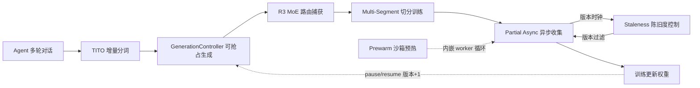

# Dressage 面试材料总览

> Dressage 是一个面向 Agent RL（强化学习）的训练框架，解决黑盒 Agent（如 Claude Code、OpenClaw）多轮对话场景下"训练-推理一致性"和"异步训练吞吐与新鲜度"两大核心难题。作为 contributor，你需要理解这 7 个技术点如何构成一条贯通的数据链。本文档是 7 个面试材料的总览，先建立系统视角，再按数据链顺序深入各要点。

---

## 端到端总览图

**数据链主线**：Agent 多轮对话 → TITO 增量分词 → GenerationController 可抢占生成 → R3 路由捕获 → Multi-Segment 切分 → Partial Async 异步收集 ↔ Staleness 陈旧度控制 → 训练更新权重 → 反馈回 GenerationController（pause/resume 触发版本时钟前进）。

**辅助支线**：Prewarm 沙箱预热内嵌于 async worker 循环，提前预创建云沙箱消除冷启动延迟。

---

## 7 个技术点一句话定位

| # | 技术点 | 一句话定位 | 详细文档 |
|---|--------|------------|----------|
| 1 | **TITO** | 增量分词技术——多轮 Agent 对话中每轮只对新增 delta 做 tokenize 并拼接到上一轮前缀上，消除 BPE 前缀漂移，保证训练-推理 token 序列在任意轮数下完全一致。 | [01-tito-incremental-tokenizer.md](01-tito-incremental-tokenizer.md) |
| 2 | **R3** | 消除 MoE 模型训练-推理路由不一致——推理时捕获每个 token 的 expert 路由决策，训练前向传播时 replay 而非重新计算（`scores.gather` 替代 `torch.topk`），logprob 差异降低约 60%，额外开销接近零。 | [02-r3-moe-routing-replay.md](02-r3-moe-routing-replay.md) |
| 3 | **GenerationController** | 让 SGLang 推理生成可在任意 token 边界被中断（abort 信号而非杀死），保留 partial output，权重更新后续跑——对 Agent 透明，将推理 GPU 利用率从"等待"变为"续跑"。 | [03-generation-controller-preemptible.md](03-generation-controller-preemptible.md) |
| 4 | **Partial Async Rollout** | 解决"采样量远大于单步训练量"的吞吐矛盾——后台 Worker 完全异步生产 rollout groups，前台凑够一步训练量就同步返回，剩余成品回填队列供下一步消费。 | [04-partial-async-rollout.md](04-partial-async-rollout.md) |
| 5 | **Staleness Control** | 异步训练的数据质量守门员——追踪权重版本世代，自动丢弃基于过期权重生成的 rollout groups，保证训练数据版本一致性，与 Partial Async 共生于同一收集循环。 | [05-staleness-control.md](05-staleness-control.md) |
| 6 | **Multi-Segment Training** | 训练侧核心机制——当 Agent 长对话因历史重写导致 token 断裂后，把多段扩展为独立 Sample 并共享 `rollout_id` 保证同一训练步，让中间决策的梯度信号不丢失。 | [06-multi-segment-training.md](06-multi-segment-training.md) |
| 7 | **Prewarm Scheduler** | 推理/沙箱侧核心机制——通过提前 N 个 group 预创建 E2B 云沙箱（含健康检查），消除秒级冷启动延迟对异步 rollout 吞吐的拖累。 | [07-prewarm-scheduler.md](07-prewarm-scheduler.md) |

---

## 数据链串联说明

这 7 个技术点不是孤立的优化，而是围绕两大核心难题构成的两条贯通链条：

### 链条一：训练-推理一致性（01 → 02 → 03）

Agent RL 的根本挑战是：推理时（SGLang）按轮生成 token，训练时（Megatron）需要把这些 token 拼成连续序列计算 loss。如果两阶段的 token 序列、路由决策、生成过程不一致，梯度信号就会失真。

- **TITO（01）** 保证 **token 序列一致性**——增量分词消除 BPE 前缀漂移，训练时的 token 序列与推理时逐 token 一致。
- **GenerationController（03）** 保证 **生成过程一致性**——权重更新时在 token 边界中断而非取消，保留 partial output 续跑，生成过程可中断但 token 不丢失。
- **R3（02）** 保证 **路由决策一致性**——MoE 模型训练时 replay 推理时的 expert 路由（`scores.gather` 替代 `torch.topk`），消除 85% 的路由不一致噪声。

三者形成"token → 生成 → 路由"的完整一致性链条，横跨推理引擎、Proxy、数据层、训练框架四个层级。

### 链条二：异步训练吞吐与新鲜度（04 ↔ 05 → 06）

异步训练解耦了 rollout 生成与权重更新，但带来 off-policy 偏差——后台用旧权重采样的数据，被消费时权重已更新。

- **Partial Async Rollout（04）** 解决 **吞吐**——后台完全异步生产，前台凑够就返回，剩余回填队列，训练 GPU 不空等。
- **Staleness Control（05）** 解决 **新鲜度**——追踪权重版本世代，自动丢弃过期组，与 Partial Async 共生于同一收集循环。版本时钟由 GenerationController 的 `pause → resume` 触发 `_rollout_epoch += 1` 驱动。
- **Multi-Segment Training（06）** 解决 **训练完整性**——历史重写导致 token 断裂时，多段以独立 Sample 并行训练但共享 `rollout_id` 同步更新，中间决策的梯度信号不丢失。与 Staleness 正交共存（segment 内可跨版本，staleness 按轨迹取最后一段版本判定）。

### 辅助优化：Prewarm（07）

**Prewarm Scheduler（07）** 内嵌于 async worker 循环，提前预创建 E2B 云沙箱消除秒级冷启动延迟，是异步吞吐提升的基础设施保障。

### 两条链条的交汇点

两条链条在 **GenerationController** 处交汇：它既是"一致性链条"的生成控制枢纽（token 边界中断/续跑），又是"吞吐链条"的版本时钟来源（resume 触发 epoch +1 驱动 staleness 追踪）。`pause → resume` 这一个操作同时服务于"训练-推理一致性"（中断时保留 partial token）和"异步新鲜度"（epoch 前进驱动 staleness 过滤）——这是 Dressage 设计中最精巧的交汇点。

---

## 面试讲述建议

1. **先看总览建立系统视角**：理解 7 个技术点构成的两条链条和交汇点，不要把任何技术当孤立优化点讲。
2. **按数据链顺序深入**：01 → 02 → 03（一致性链条）→ 04 ↔ 05 → 06（吞吐链条）→ 07（基础设施）。每个技术点先看"一句话定位"，再看"问题背景"理解动机，然后看"核心实现"和"面试金句"准备追问。
3. **重点准备交汇点追问**：面试官最可能追问"这些技术如何协作"——GenerationController 的 `pause/resume` 同时服务一致性和新鲜度，Staleness 与 Multi-Segment 的正交关系，TITO 失败时触发 Multi-Segment 边界等跨技术点的接口设计。
