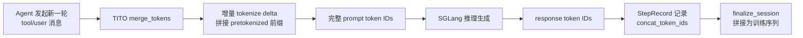

# TITO — Token-In-Token-Out 增量分词器

> **一句话结论**：TITO 是一种增量分词技术——多轮 Agent 对话中，每轮只对新增 delta（tool 响应 + 新 user 消息）做 tokenize 并拼接到上一轮已确认的 token 前缀上，消除全量重分词导致的 BPE 前缀漂移，保证训练-推理 token 序列在任意轮数下完全一致。它位于 Dressage Proxy 层，是"Agent 多轮对话 → 单条连续训练序列"这条数据链的起点。

---

## 一、一句话定位

TITO 解决的核心问题是**"多轮 Agent 对话如何在训练时被还原成一条与推理时逐 token 一致的连续序列"**。在 Agent RL 中，SGLang 按轮生成（每轮 = 一个 step），训练时需要把这些 step 的 token 拼成一条连续序列来计算 loss。如果每轮都对完整对话历史重新 tokenize，BPE 贪心合并会导致前缀 token 发生变化，进而使训练时的 logprob 与推理时不一致。TITO 的存在就是为了在 proxy 层增量构建这条序列——**只编码 delta，拼接前缀，前缀永远不变**。

---

## 二、问题背景与动机

### 传统做法的痛点

传统方法每轮对完整对话历史重新 tokenize：

```
Turn 1: full_tokenize("你好")            → [101, 202, 303]
Turn 2: full_tokenize("你好 hi 再见")      → [101, 202, 999, 404, 505]
                                            ↑↑ 前缀可能变了！
```

BPE 分词是贪心合并：相同的文本片段在不同上下文中会被合并成不同的 token。例如 `"hi"` 单独编码可能是 `[123]`，但跟在 `"你好"` 后面编码时，`"你好hi"` 的边界部分可能被合并成一个新 token，导致 `"你好"` 段的 token 序列从 `[101, 202, 303]` 变成 `[101, 202, 999]`——**前缀漂移了**。

### 不这么做会怎样

前缀漂移在 Agent RL 中有两个致命后果：

1. **训练-推理 token 序列不一致**：SGLang 推理时按轮生成，每轮的 token 是确定的；但训练侧如果全量重分词，前缀 token 会变化，导致训练时计算的 logprob 对应的不是推理时实际生成的 token，梯度信号失真。
2. **loss_mask 错位**：训练时用 mask 标记哪些 token 是 assistant 生成的（参与 loss 计算）。前缀漂移会让 mask 与实际 token 位置错位，模型训练了错误的 token。

随着对话轮数增加，漂移会累积——第 10 轮的全量分词结果可能与第 1 轮的前缀差好几个 token。**Agent 对话动辄几十轮**，这个误差不可忽视。

---

## 三、整体设计框架与思路

### 数据流定位

TITO 位于 Dressage Proxy 层，在 Agent ↔ SGLang 推理引擎之间。每次 Agent 发起一轮对话（user/tool 消息 → assistant 回复），TITO 负责把这轮的非 assistant 消息增量 tokenize 并拼接到历史前缀上：



### 核心思路：只编码 delta + 拼接

```
Turn 1: encode("你好")       → fragment₁ = [101, 202, 303]
Turn 2: encode("hi 再见")    → fragment₂ = [999, 404, 505]   ← 只编码 delta
        stitch(fragment₁ + fragment₂) → [101, 202, 303, 999, 404, 505]
                                       ✅ 前缀 [101, 202, 303] 完全不变
```

前缀 token 序列在任意轮数下**精确不变**——因为从不重新分词，只是追加。

### 为什么不能直接对增量消息单独 tokenize

这是 TITO 最关键的设计难点。Chat template 渲染是**整体的**——`apply_chat_template` 会将所有消息渲染成一段连续文本，包含角色标记（`<|im_start|>system`、`<|im_end|>`）、换行符等模板结构。如果单独 tokenize 一条 user 消息，会缺少模板前缀（如 `<|im_start|>user\n`）和后缀（`<|im_end|>\n`），渲染结果不正确。

TITO 的解法是**差分渲染**：渲染两遍（带追加消息和不带追加消息），取文本差再 tokenize，就得到了模板上下文中的正确增量 token。

---

## 四、核心实现详解

### 代码定位总览

| 组件 | 文件路径 | 关键行号 |
|------|----------|----------|
| TITO Tokenizer 基类 | [Qwen35TITOTokenizer](file:///Users/whisper/Desktop/Dressage/dressage/proxy/tito/tito_tokenizer.py#L36-L213) | L36-213 |
| Qwen3.6 子类 | [Qwen36TITOTokenizer](file:///Users/whisper/Desktop/Dressage/dressage/proxy/tito/tito_tokenizer.py#L216-L271) | L216-271 |
| Dummy 消息常量 | [tito_tokenizer.py](file:///Users/whisper/Desktop/Dressage/dressage/proxy/tito/tito_tokenizer.py#L13-L33) | L13-33 |
| 差分渲染核心 | [_tokenize_rendered_suffix](file:///Users/whisper/Desktop/Dressage/dressage/proxy/tito/tito_tokenizer.py#L112-L135) | L112-135 |
| 增量 tokenize 入口 | [tokenize_additional_non_assistant](file:///Users/whisper/Desktop/Dressage/dressage/proxy/tito/tito_tokenizer.py#L159-L190) | L159-190 |
| 拼接 + 边界处理 | [merge_tokens](file:///Users/whisper/Desktop/Dressage/dressage/proxy/tito/tito_tokenizer.py#L192-L213) | L192-213 |
| Append-only 校验 | [assert_messages_append_only_with_allowed_roles](file:///Users/whisper/Desktop/Dressage/dressage/proxy/tito/template_utils.py#L79-L103) | L79-103 |
| 模板渲染封装 | [apply_chat_template](file:///Users/whisper/Desktop/Dressage/dressage/proxy/tito/template_utils.py#L106-L130) | L106-130 |
| Server 集成 | [_build_prompt_tokens](file:///Users/whisper/Desktop/Dressage/dressage/proxy/server.py#L1149-L1216) | L1149-1216 |
| routed_experts_parts 组装 | [server.py](file:///Users/whisper/Desktop/Dressage/dressage/proxy/server.py#L1105-L1121) | L1105-1121 |
| 测试 | [test_tito.py](file:///Users/whisper/Desktop/Dressage/tests/test_tito.py) | 全文件 252 行 |

### `merge_tokens` — 拼接入口

- **代码定位**：[tito_tokenizer.py L192-213](file:///Users/whisper/Desktop/Dressage/dressage/proxy/tito/tito_tokenizer.py#L192-L213)
- **输入参数**：
  - `old_messages: list[dict]` — 上一轮结束时的消息快照
  - `new_messages: list[dict]` — 当前轮的完整消息列表
  - `pretokenized_token_ids: list[int]` — 之前所有 step 已经拼接好的 token IDs 前缀
  - `tools: list[dict] | None` — 工具定义列表
- **输出**：`list[int]` — 前缀 + 增量 token IDs 拼接后的完整序列
- **核心逻辑**：
  1. 调用 `tokenize_additional_non_assistant` 获取增量 token IDs
  2. 复制前缀 `prefix = list(pretokenized_token_ids)`
  3. **边界 token 处理**：如果前缀最后一个 token 是 `<|im_end|>`（assistant 回复结束标记），自动在后面补一个 `\n` 换行符
  4. 返回 `prefix + incremental`

```python
def merge_tokens(self, *, old_messages, new_messages, pretokenized_token_ids, tools=None):
    incremental = self.tokenize_additional_non_assistant(old_messages, new_messages, tools)
    prefix = list(pretokenized_token_ids)
    if (self._im_end_id is not None and self._newline_id is not None
            and prefix and prefix[-1] == self._im_end_id):
        prefix.append(self._newline_id)   # ← 关键：补换行符
    return prefix + incremental
```

### `tokenize_additional_non_assistant` — 增量 tokenize 入口

- **代码定位**：[tito_tokenizer.py L159-190](file:///Users/whisper/Desktop/Dressage/dressage/proxy/tito/tito_tokenizer.py#L159-L190)
- **输入参数**：`old_messages`、`new_messages`、`tools`
- **输出**：`list[int]` — 仅增量部分的 token IDs（不含前缀）
- **核心逻辑**：
  1. `assert_messages_append_only_with_allowed_roles()` 验证 old_messages 是 new_messages 的前缀，且新增消息只有 `tool` 和 `user` 角色
  2. 提取增量 `appended_messages = new_messages[len(old_messages):]`
  3. 用 `_split_appended_segments` 将增量分组：连续的 tool 消息为一组，单独 user 消息为一组
  4. 对每组分别调用 `_tokenize_tool_segment` 或 `_tokenize_user_segment`
  5. **末尾追加 generation prompt**：调用 `_tokenize_rendered_suffix(new_messages, [], add_generation_prompt=True)`，获取"让 assistant 开始生成"的提示 token（如 `<|im_start|>assistant\n`）

```python
def tokenize_additional_non_assistant(self, old_messages, new_messages, tools=None):
    assert_messages_append_only_with_allowed_roles(old_messages, new_messages, self.allowed_append_roles)
    appended_messages = new_messages[len(old_messages):]
    incremental = []
    for segment in self._split_appended_segments(appended_messages):
        if segment[0].get("role") == "tool":
            incremental.extend(self._tokenize_tool_segment(segment, tools))
        elif segment[0].get("role") == "user":
            incremental.extend(self._tokenize_user_segment(segment[0], tools))
    # 末尾追加 generation prompt，让 SGLang 生成的 response token 可以无缝拼接
    incremental.extend(
        self._tokenize_rendered_suffix(new_messages, [], tools=tools, add_generation_prompt=True)
    )
    return incremental
```

### `_tokenize_rendered_suffix` — 差分渲染核心

- **代码定位**：[tito_tokenizer.py L112-135](file:///Users/whisper/Desktop/Dressage/dressage/proxy/tito/tito_tokenizer.py#L112-L135)
- **输入参数**：`base_messages`（基准消息列表）、`appended_messages`（追加消息）、`tools`、`add_generation_prompt`
- **输出**：`list[int]` — 仅渲染后增量文本的 token IDs
- **核心逻辑**：
  1. 用 chat template 渲染 `base_messages` 得到 `rendered_without`
  2. 用 chat template 渲染 `base_messages + appended_messages` 得到 `rendered_with`
  3. 验证 `rendered_with.startswith(rendered_without)`——如果不成立，说明追加消息改变了模板渲染的前缀结构（前缀漂移），抛出异常
  4. 截取差异部分 `rendered_with[len(rendered_without):]` 并 tokenize

```python
def _tokenize_rendered_suffix(self, base_messages, appended_messages, *, tools=None, add_generation_prompt=False):
    rendered_without = self._render_messages(base_messages, add_generation_prompt=False, tools=tools)
    rendered_with = self._render_messages(base_messages + appended_messages, add_generation_prompt=add_generation_prompt, tools=tools)
    if not rendered_with.startswith(rendered_without):
        raise ValueError(f"rendered suffix diff failed for {[m.get('role') for m in appended_messages]}")
    return self._encode_text(rendered_with[len(rendered_without):])  # 只 tokenize 差异部分
```

### Dummy 消息设计

- **代码定位**：[tito_tokenizer.py L13-33](file:///Users/whisper/Desktop/Dressage/dressage/proxy/tito/tito_tokenizer.py#L13-L33)、[_tokenize_tool_segment L137-146](file:///Users/whisper/Desktop/Dressage/dressage/proxy/tito/tito_tokenizer.py#L137-L146)、[_tokenize_user_segment L148-157](file:///Users/whisper/Desktop/Dressage/dressage/proxy/tito/tito_tokenizer.py#L148-L157)

差分渲染需要一个"基准消息列表"作为 base。对不同的增量段，基准消息是不同的 dummy 组合：

| 段类型 | 基准消息（base_messages） | 原因 |
|--------|--------------------------|------|
| user 段 | `[_DUMMY_SYSTEM]` | user 消息渲染只需 system 前缀 |
| tool 段（Qwen3.5） | `[_DUMMY_SYSTEM, _build_dummy_assistant(tool_responses)]` | Qwen 模板渲染 tool 响应时，需要先有一个 assistant 消息包含对应的 tool_calls |
| tool 段（Qwen3.6） | `[_DUMMY_SYSTEM, _DUMMY_USER, _build_dummy_assistant(tool_responses)]` | Qwen3.6 原生模板 guard 要求消息序列必须包含至少一个 user 消息 |

`_build_dummy_assistant` 从 tool 响应中提取 `tool_call_id` 和 `name`，构造一个假的 assistant 消息，其 `tool_calls` 包含真实的 tool_call_id。这样模板才能正确渲染 tool 响应段。dummy 部分的 token 会被差分逻辑自然过滤掉（因为 `rendered_with` 和 `rendered_without` 都包含相同的 dummy 前缀，差分后只剩追加部分）。

### Server 层集成

- **代码定位**：[_build_prompt_tokens L1149-1216](file:///Users/whisper/Desktop/Dressage/dressage/proxy/server.py#L1149-L1216)

Server 在每次 Agent 请求时调用 `_build_prompt_tokens`：
1. 如果 TITO 模式且无 segment 边界 → 调用 `tito_tokenizer.merge_tokens(old_messages, new_messages, prefix_tokens)`
2. TITO 失败（template 渲染异常）→ 捕获异常，降级为 `_full_prompt_token_ids` 全量 tokenize，标记 `tito_incremental_tokenization_failed=True`，触发 segment 边界
3. 成功 → 返回 `merged_tokens`，标记 `used_tito_for_prompt=True`

---

## 五、独特的小设计细节（面试金句）

### 金句 1：`<|im_end|>` 后自动补 `\n`——少一个 token 就全错了

> **全量 tokenize 时模板会在 `<|im_end|>` 后自动生成换行符，但增量拼接时前缀末尾的 `<|im_end|>` 后面没有换行，直接拼增量会导致 token 序列与全量渲染结果差一个 token。**

[merge_tokens L206-212](file:///Users/whisper/Desktop/Dressage/dressage/proxy/tito/tito_tokenizer.py#L206-L212) 中检测前缀最后一个 token 是否为 `<|im_end|>`，如果是则补一个 `\n` 的 token ID。这是最容易在面试中被追问的细节——如果不补这个换行符，整个序列从这一步开始就与全量渲染结果错位一个 token，后续所有 token 的 logprob 都会错位。测试 [test_merge_inserts_newline_after_im_end](file:///Users/whisper/Desktop/Dressage/tests/test_tito.py#L181-L192) 专门验证：前缀 `[1]`（模拟 `<|im_end|>`）后拼接结果首两个 token 必须是 `[1, ord("\n")]`。

### 金句 2：每步增量末尾都包含 generation prompt——让 SGLang 的 response 可以无缝拼接

> **`tokenize_additional_non_assistant` 的最后一步是追加 `add_generation_prompt=True` 的差分渲染，获取"让 assistant 开始生成"的提示 token（如 `<|im_start|>assistant\n`）。**

[第 182-189 行](file:///Users/whisper/Desktop/Dressage/dressage/proxy/tito/tito_tokenizer.py#L182-L189) 在所有 user/tool 段增量之后，额外渲染一遍 `_tokenize_rendered_suffix(new_messages, [], add_generation_prompt=True)`。这样 SGLang 生成的 response token 可以直接拼到增量末尾，不需要再补任何模板 token。测试 [test_user_segment_incremental](file:///Users/whisper/Desktop/Dressage/tests/test_tito.py#L113-L126) 验证增量结果以 `<assistant>` 结尾。

### 金句 3：Dummy 消息"欺骗" chat template——渲染两遍取差，dummy 自然消失

> **Dummy 消息设计是为了"欺骗" chat template——tool 响应的渲染需要一个包含对应 tool_calls 的 assistant 消息作为前置，我们构造假的 assistant 消息让模板正常渲染，但渲染结果中 dummy 部分的 token 会被差分逻辑自然过滤掉。**

[_build_dummy_assistant L17-33](file:///Users/whisper/Desktop/Dressage/dressage/proxy/tito/tito_tokenizer.py#L17-L33) 从 tool 响应中提取 `tool_call_id` 和 `name`，构造匹配的 tool_calls。因为 `rendered_without`（只有 dummy）和 `rendered_with`（dummy + 追加消息）都包含相同的 dummy 前缀，差分 `rendered_with[len(rendered_without):]` 后 dummy 部分 100% 被减掉。这是一个巧妙的"用确定性消除不确定性"的设计——chat template 渲染是确定性的，相同输入必然产生相同输出。

### 金句 4：Qwen3.6 的 `_DUMMY_USER`——一个 guard 的代价

> **Qwen3.6 原生模板有 guard 要求消息序列必须包含至少一个 user 消息，否则直接拒绝渲染。Qwen3.6 子类额外在基准消息中插入 `_DUMMY_USER` 来绕过这个 guard。**

[Qwen36TITOTokenizer](file:///Users/whisper/Desktop/Dressage/dressage/proxy/tito/tito_tokenizer.py#L216-L271) 重写了 `_tokenize_tool_segment`（L224-233）和 `_tokenize_user_segment`（L235-244），在 dummy 序列中加入 `_DUMMY_USER`。这体现了"模型模板隔离"的设计——不同模型 template 差异通过独立 tokenizer 子类处理，基类逻辑完全复用。测试 [test_fixed_template_loads_without_user_query_guard](file:///Users/whisper/Desktop/Dressage/tests/test_tito.py#L107-L110) 验证 Qwen3.5 的固定模板不含 `"No user query found in messages"` guard 文本。

### 金句 5：Append-only 契约是 TITO 的根本前提

> **如果 Agent 重写历史（如 compaction/summarization），前缀就断了，TITO 会检测到渲染前缀不匹配（`startswith` 校验失败），标记 segment boundary 触发 Multi-Segment 训练。**

[assert_messages_append_only_with_allowed_roles L79-103](file:///Users/whisper/Desktop/Dressage/dressage/proxy/tito/template_utils.py#L79-L103) 验证 old_messages 是 new_messages 的前缀（逐条比对），且新增消息只允许 `tool`/`user` 角色。任何 `system` 角色的追加都会被拒绝——测试 [test_system_append_rejected](file:///Users/whisper/Desktop/Dressage/tests/test_tito.py#L164-L178) 验证追加 system 消息时抛出 `ValueError("role='system'")`。这个契约不是约束而是**检测器**：违反时不是悄悄出错，而是明确触发 segment 边界，让 Multi-Segment 训练机制接管。

### 金句 6：Fallback 机制——失败不丢数据

> **TITO 失败时标记 `tito_incremental_tokenization_failed=True`，降级为全量 tokenize，数据不丢失，但触发 segment boundary。**

[_build_prompt_tokens L1192-1205](file:///Users/whisper/Desktop/Dressage/dressage/proxy/server.py#L1192-L1205) 用 try/except 包裹 `merge_tokens` 调用，异常时降级全量 tokenize。这是"安全降级"设计——宁可损失增量优势（触发 segment 边界、失去 TITO 一致性保证），也不能让一条轨迹的数据丢失。

---

## 六、达到的效果

### 复杂度与性能

| 指标 | 全量重分词 | TITO 增量分词 | 说明 |
|------|------------|---------------|------|
| 数据构建复杂度 | O(N²) | O(N) | N=对话轮数；全量每轮重新 tokenize 全部历史（Σk=1..N k=N(N+1)/2），增量每轮只 encode delta（N×O(1)） |
| 20 轮对话开销 | 基准 100% | 约 5-10% | 由 1−N/N²=1−1/20=95% 推出，开销降低约 95% |
| 前缀 token 一致性 | BPE 漂移概率随轮数累积 | 100% 精确不变 | 增量拼接从不重分词，前缀物理追加，不可能漂移 |

> **可解释性**：复杂度推导是严格的——全量重分词第 k 轮需处理前 k-1 轮的所有消息（O(k)），N 轮总计 O(N²)；TITO 每轮只 encode 新增 delta（O(1)），N 轮总计 O(N)。20 轮时开销降低比例 = 1 − N/N² = 1 − 1/20 ≈ 95%。

### 一致性保证

TITO 保证了**训练-推理 token 序列在任意轮数下完全一致**——因为前缀从不重新分词，只是追加。测试 [test_merge_tokens_preserves_thinking_for_appended_tool_and_user](file:///Users/whisper/Desktop/Dressage/tests/test_tito.py#L206-L251) 做了最强验证：先渲染一遍完整消息（`full_rendered`），再用 TITO 增量拼接（`merged`），断言 `decode(merged) == full_rendered`——**增量拼接结果与全量渲染结果逐字符相同**，包括 reasoning_content（思考链）的保留。

### 测试佐证

| 测试名 | 验证行为 | 文件位置 |
|--------|----------|----------|
| `test_user_segment_incremental` | user 消息增量正确渲染为 `<user>again<assistant>` | [test_tito.py L113](file:///Users/whisper/Desktop/Dressage/tests/test_tito.py#L113) |
| `test_tool_segment_incremental` | tool 响应增量包含 `<tool>` 标记和 `tool_call_id`，以 `<assistant>` 结尾 | [test_tito.py L129](file:///Users/whisper/Desktop/Dressage/tests/test_tito.py#L129) |
| `test_system_append_rejected` | append-only 契约——system 角色追加被拒绝 | [test_tito.py L164](file:///Users/whisper/Desktop/Dressage/tests/test_tito.py#L164) |
| `test_merge_inserts_newline_after_im_end` | `<|im_end|>` 后自动补换行符 | [test_tito.py L181](file:///Users/whisper/Desktop/Dressage/tests/test_tito.py#L181) |
| `test_merge_empty_prefix` | 空前缀时正确处理首步（首步退化为全量渲染） | [test_tito.py L195](file:///Users/whisper/Desktop/Dressage/tests/test_tito.py#L195) |
| `test_merge_tokens_preserves_thinking_for_appended_tool_and_user` | 增量拼接 == 全量渲染，思考链正确保留 | [test_tito.py L206](file:///Users/whisper/Desktop/Dressage/tests/test_tito.py#L206) |

这些测试覆盖了关键边界条件：空前缀（首步）、`<|im_end|>` 边界、append-only 契约违反、思考链保留、tool 段与 user 段混合追加。**在任何边界条件下 TITO 都不退化**——要么正确拼接，要么明确报错触发 segment 边界。

---

## 七、面试 Q&A

### Q1: 为什么不能直接对增量消息单独 tokenize？

**A**: 因为 chat template 渲染是整体的。`apply_chat_template` 会将所有消息渲染成一段连续文本，包含角色标记（`<|im_start|>user`、`<|im_end|>`）、换行符等模板结构。如果单独 tokenize 一条 user 消息 `"again"`，得到的是 `"again"` 这几个字的 token，缺少模板前缀 `<|im_start|>user\n` 和后缀 `<|im_end|>\n`。TITO 用差分渲染解决这个问题：渲染两遍（`base` 和 `base + appended`），取文本差再 tokenize，得到的增量天然包含正确的模板标记。

### Q2: BPE 分词的贪心合并为什么会导致前缀漂移？能举例吗？

**A**: BPE 的核心是贪心合并——从左到右扫描，尽可能把相邻 token 合并成更大的 token。同样的文本片段在不同上下文中，因为左侧邻居不同，合并边界会不同。比如 `"hi"` 单独编码可能是 `[123]`，但 `"你好hi"` 一起编码时，BPE 可能把 `"好"` 和 `"h"` 的边界部分合并成一个新 token `[999]`，于是 `"你好"` 段从 `[101, 202, 303]` 变成 `[101, 202, 999]`——前缀漂移了。轮数越多漂移累积越严重，Agent 对话动辄几十轮，误差不可忽视。

### Q3: dummy 消息差分渲染如何保证前缀一致？

**A**: 核心依赖 chat template 渲染的**确定性**——相同的消息列表和模板必然产生相同的文本。差分渲染渲染两遍：`rendered_without = render(base)` 和 `rendered_with = render(base + appended)`。因为 base 是 `rendered_with` 的精确前缀（确定性保证），`rendered_with.startswith(rendered_without)` 必然成立。dummy 消息（`_DUMMY_SYSTEM`、`_build_dummy_assistant`）只是为了满足模板对消息序列结构的要求（如 tool 响应需要前置 assistant 带 tool_calls），它们在 `rendered_without` 和 `rendered_with` 中完全相同，差分后自然消失。代码还用 `startswith` 校验做主动检测——如果渲染前缀不匹配直接抛异常，不会静默出错。

### Q4: 历史重写时如何处理？（Agent 做了 compaction/summarization 重写了历史）

**A**: TITO 的根本前提是 append-only 契约——`assert_messages_append_only_with_allowed_roles` 会逐条验证 old_messages 是 new_messages 的前缀。如果 Agent 重写了历史（compaction 把前 10 轮压缩成一条 summary），old_messages 不再是 new_messages 的前缀，校验失败。此时 TITO 不悄悄出错，而是触发 **segment boundary**：之前的轨迹作为一个 segment 结束，从压缩后的 summary 开始一个新 segment。这由 Dressage 的 Multi-Segment 训练机制接管——每个 segment 内部 TITO 保证一致性，segment 之间通过 Multi-Segment loss 机制处理。这样既保证了段内一致性，又不丢失被压缩的轨迹数据。

### Q5: 增量"相对什么"增量？assistant 回复的 token 怎么处理？

**A**: 增量相对于上一步的 `pretokenized_token_ids`——这是之前所有 step 已经拼接好的 token 序列。**assistant 回复的 token 不需要重新 tokenize**——直接复用 SGLang 已生成的 response token IDs（它们就是推理时实际产生的 token，天然一致）。TITO 只对**非 assistant 消息**（user/tool）做增量 tokenize，因为只有这些消息需要通过 chat template 渲染才能得到正确的 token 序列。`tokenize_additional_non_assistant` 这个方法名就体现了这一点。

### Q6: 如果 chat template 渲染出了 bug 怎么办？会污染训练数据吗？

**A**: 不会。TITO 设计了 fallback 机制——[_build_prompt_tokens](file:///Users/whisper/Desktop/Dressage/dressage/proxy/server.py#L1192-L1205) 用 try/except 包裹 `merge_tokens` 调用。任何异常（template 渲染错误、startswith 校验失败等）都会被捕获，降级为全量 tokenize（`_full_prompt_token_ids`），并标记 `tito_incremental_tokenization_failed=True`。这个标记会触发 segment boundary，让 Multi-Segment 机制处理。数据不会丢失，只是失去了 TITO 的增量优势。这是"安全降级"设计——宁可退化也不能污染数据。

### Q7: 为什么 Qwen3.5 和 Qwen3.6 要用不同的 tokenizer 子类？

**A**: 因为两个模型的 chat template 有差异。Qwen3.5 用 Dressage 内置的固定 jinja 模板（去掉了 `"No user query found in messages"` guard），所以 dummy 序列不需要 `_DUMMY_USER`。Qwen3.6 保留原生模板 guard，要求消息序列必须包含至少一个 user 消息，否则拒绝渲染。所以 [Qwen36TITOTokenizer](file:///Users/whisper/Desktop/Dressage/dressage/proxy/tito/tito_tokenizer.py#L216-L271) 重写了 `_tokenize_tool_segment` 和 `_tokenize_user_segment`，在 dummy 序列中加入 `_DUMMY_USER` 绕过 guard。基类 `Qwen35TITOTokenizer` 的差分渲染逻辑完全复用，子类只覆盖基准消息的构造方式——体现了"模型模板隔离"的设计原则。

---

## 八、与其他技术点的协作关系

TITO 是 Dressage 数据链的起点，与 GenerationController 和 R3 形成一条完整的"训练-推理一致性"链条：

```
Agent 对话轮次
    ↓
[TITO] 增量分词 → 拼接为连续 token 序列（消除前缀漂移）
    ↓
[GenerationController] 可抢占生成 → 权重更新时中断+续跑（消除 GPU 空闲）
    ↓                    ↓
    ↓              [R3] chunk 级路由捕获（消除路由不一致）
    ↓                    ↓
    ↓              routed_experts_chunks / routed_experts_parts
    ↓                    ↓
finalize_session → segment record（tokens + logprobs + routed_experts）
```

**关键接口**：
- **TITO → GenerationController**：TITO 模式下 `logprob_start_len = -1`（不请求 SGLang prompt logprobs），因为 prompt token 是增量拼接的，其 logprob 不需要从 SGLang 获取。这是两者交互的关键接口。
- **TITO → R3**：TITO 的多 step segment 用 `routed_experts_parts` 格式存储 R3 数据——[server.py L1105-1121](file:///Users/whisper/Desktop/Dressage/dressage/proxy/server.py#L1105-L1121) 为每个 step 组装一个 part，携带 `prefix_token_count`（segment 内累积偏移），R3 提取时逐 step 解码切片拼接。
- **TITO → Multi-Segment Training**：append-only 契约违反 → segment boundary，由 Multi-Segment 接管。

面试时可概括为："这三个技术不是孤立的优化点，而是一条贯通的数据链——TITO 保证 token 序列一致性，GenerationController 保证生成过程的可中断性，R3 保证路由决策的一致性。三者共同解决了 Agent RL 中'训练-推理一致性'这个核心难题。"
