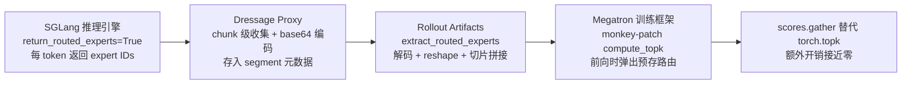

# R3 — MoE Routing Replay（路由回放）

> **一句话结论**：R3 消除 MoE 模型训练-推理路由不一致——rollout 推理时捕获每个 token 的 expert 路由决策（base64 int32 编码），训练前向传播时 replay 这些决策而非重新计算（用 `scores.gather` 替代 `torch.topk`），将训练-推理 logprob 绝对差异降低约 60%，额外开销接近零。它横跨推理引擎、Proxy、数据层、训练框架四个层级。

---

## 一、一句话定位

R3 解决的是 **"MoE 模型在推理和训练阶段的路由决策不一致"** 问题。在 Agent RL 中，rollout 阶段用 SGLang 推理生成 token 并采样，训练阶段用 Megatron 重新前向计算这些 token 的 logprob。如果两个阶段的 MoE 路由决策不同，logprob 计算就会引入系统性噪声。R3 的存在就是为了在训练时直接"回放"推理时的路由决策，而不是重新计算——**让训练阶段的每个 token 走与推理时完全相同的 expert 路径**。

---

## 二、问题背景与动机

### 传统做法的痛点

MoE（Mixture of Experts）模型中，每个 token 由 router 计算分数并选 top-k 个 expert 处理。推理和训练分属不同阶段、不同框架、不同精度：

| 维度 | 推理（SGLang） | 训练（Megatron） |
|------|----------------|-------------------|
| 精度 | FP8 / BF16 | BF16 |
| kernel 实现 | 推理优化 kernel | 训练 kernel |
| 浮点运算 | 非结合性 | 非结合性 |

这三者共同导致：**同一个 token 在推理和训练两个阶段走不同的 expert 路径**。这不是 bug，而是浮点运算的固有特性。

### 实测数据（Qwen3.5-35B-A3B, 40 层 MoE, 256 experts, top-8）

| 指标 | 均值 | 含义 |
|------|------|------|
| `element_mismatch_rate` | 45.25% | 约 45% 的 (token, layer, slot) expert 选择不同 |
| `token_mismatch_rate` | 85.16% | 约 85% 的 token 至少在某层存在路由差异 |
| `set_token_mismatch_rate` | 59.64% | 忽略 top-k 排列仍约 60% token 选不同 expert 集合 |

### 不这么做会怎样

路由不一致导致训练 logprob 与推理实际生成不匹配——**RL 梯度信号失真**。85% 的 token 路由不同意味着绝大多数训练样本的 logprob 都有系统性噪声，严重时训练甚至无法收敛。这是一个在 MoE + RL 场景下普遍存在但容易被忽视的问题。

---

## 三、整体设计框架与思路

### 四层数据流架构

R3 横跨四个层级，每个层级各司其职：



| 层级 | 职责 | 关键文件 |
|------|------|----------|
| 推理引擎（SGLang） | 生成时捕获每个 token 的路由决策 | [sglang_client.py](file:///Users/whisper/Desktop/Dressage/dressage/proxy/sglang_client.py#L176-L214) |
| 代理层（Dressage Proxy） | chunk 级收集、base64 编码、组装存储格式 | [generation_controller.py](file:///Users/whisper/Desktop/Dressage/dressage/proxy/generation_controller.py#L335-L361) |
| 数据层（Rollout Artifacts） | 解码、reshape、按 prefix 偏移精确切片拼接 | [samples.py](file:///Users/whisper/Desktop/Dressage/dressage/rollout/artifacts/samples.py#L378-L456) |
| 训练框架（slime/Megatron） | monkey-patch `compute_topk`，前向/反向时 replay 路由 | [routing_replay.py](file:///Users/whisper/Desktop/Dressage/slime/slime/utils/routing_replay.py)、[actor.py](file:///Users/whisper/Desktop/Dressage/slime/slime/backends/megatron_utils/actor.py#L297-L344) |

### 三种存储格式

不同生成场景产生不同的路由数据格式，R3 按优先级尝试三种：

| 格式 | 字段 | 适用场景 |
|------|------|----------|
| 直接格式 | `routed_experts` | 单次连续生成（无抢占，单 chunk） |
| 分块格式 | `routed_experts_chunks` | Partial Rollout 多 chunk（一条轨迹横跨多次权重更新） |
| 多步格式 | `routed_experts_parts` | TITO 多 step segment（每个 step 一个 part） |

### 核心思路：重放而非重算

R3 的思路非常直接：既然路由不一致是噪声源，那就**不要在训练时重新计算路由，而是直接用推理时的路由决策**。这在已有前向传播中用 `scores.gather(1, precomputed_indices)` 替代 `torch.topk(scores)`——gather 比 topk 更轻，额外开销接近零。R3 不增加额外的计算 pass，而是替换路由决策的来源。

---

## 四、核心实现详解

### 代码定位总览

| 组件 | 文件路径 | 关键行号 |
|------|----------|----------|
| 路由重放核心 | [routing_replay.py](file:///Users/whisper/Desktop/Dressage/slime/slime/utils/routing_replay.py) | 全文件 93 行 |
| RoutingReplay 类 | [RoutingReplay](file:///Users/whisper/Desktop/Dressage/slime/slime/utils/routing_replay.py#L13-L54) | L13-54 |
| compute_topk 替换 | [get_routing_replay_compute_topk](file:///Users/whisper/Desktop/Dressage/slime/slime/utils/routing_replay.py#L57-L82) | L57-82 |
| 路由提取 | [extract_routed_experts](file:///Users/whisper/Desktop/Dressage/dressage/rollout/artifacts/samples.py#L378-L456) | L378-456 |
| 训练注入 | [fill_routing_replay](file:///Users/whisper/Desktop/Dressage/slime/slime/backends/megatron_utils/actor.py#L297-L344) | L297-344 |
| 训练状态机 | [train_actor](file:///Users/whisper/Desktop/Dressage/slime/slime/backends/megatron_utils/actor.py#L414-L523) | L414-523 |
| CP 适配 | [prepare_routed_experts_for_routing_replay](file:///Users/whisper/Desktop/Dressage/slime/slime/backends/megatron_utils/cp_utils.py#L362-L393) | L362-393 |
| SGLang 路由捕获 | [generate](file:///Users/whisper/Desktop/Dressage/dressage/proxy/sglang_client.py#L176-L214) | L176-214 |
| 路由提取响应解析 | [_coerce_response](file:///Users/whisper/Desktop/Dressage/dressage/proxy/sglang_client.py#L654-L671) | L654-671 |
| chunk 级收集 | [generation_controller.py](file:///Users/whisper/Desktop/Dressage/dressage/proxy/generation_controller.py#L335-L361) | L335-361 |
| 单/多 chunk 格式选择 | [generation_controller.py](file:///Users/whisper/Desktop/Dressage/dressage/proxy/generation_controller.py#L425-L432) | L425-432 |
| 测试（chunk 拼接） | [test_blackbox_dispatch.py](file:///Users/whisper/Desktop/Dressage/tests/test_blackbox_dispatch.py#L603-L679) | L603-679 |
| 测试（零输出抢占） | [test_resume_readiness_simple.py](file:///Users/whisper/Desktop/Dressage/tests/test_resume_readiness_simple.py#L197-L277) | L197-277 |

### `RoutingReplay` 类 — per-layer 路由状态容器

- **代码定位**：[routing_replay.py L13-54](file:///Users/whisper/Desktop/Dressage/slime/slime/utils/routing_replay.py#L13-L54)
- **输入/输出**：无直接参数，作为 per-layer 状态容器
- **核心数据结构**：
  - `forward_index: int` — 前向传播弹出索引
  - `backward_index: int` — 反向传播弹出索引
  - `top_indices_list: list[Tensor]` — 预存路由索引列表（CPU pinned memory）
  - `all_routing_replays: list` — 全局类变量，按层顺序排列所有实例
- **关键方法**：

| 方法 | 输入 | 输出 | 逻辑 |
|------|------|------|------|
| `record(top_indices)` L22-26 | GPU 上的路由索引 Tensor | 无 | 将路由索引 offload 到 CPU pinned memory，避免占用 GPU 显存 |
| `pop_forward()` L28-31 | 无 | GPU Tensor | 按 `forward_index` 弹出，拷回 GPU |
| `pop_backward()` L33-36 | 无 | GPU Tensor | 按 `backward_index` 弹出，拷回 GPU |
| `clear_all_forward()` L51-54 | 无 | 无 | 前向传播结束后重置所有层的 `forward_index`，为反向传播做准备 |

```python
def record(self, top_indices):
    buf = torch.empty_like(top_indices, device="cpu", pin_memory=True)  # CPU 锁页内存
    buf.copy_(top_indices)
    self.top_indices_list.append(buf)

def pop_forward(self):
    top_indices = self.top_indices_list[self.forward_index]
    self.forward_index += 1
    return top_indices.to(torch.cuda.current_device())  # 拷回 GPU
```

### `get_routing_replay_compute_topk` — compute_topk 替换函数

- **代码定位**：[routing_replay.py L57-82](file:///Users/whisper/Desktop/Dressage/slime/slime/utils/routing_replay.py#L57-L82)
- **输入参数**：`old_compute_topk`（原始 Megatron 的 top-k 计算函数）
- **输出**：替换后的 `compute_topk` 函数
- **核心逻辑**：根据 `ROUTING_REPLAY_STAGE` 环境变量切换四种行为：

| Stage | 行为 | 触发时机 |
|-------|------|----------|
| `fallthrough` | 调用原始 `old_compute_topk` | ref/teacher 模型前向传播（不使用 rollout 路由） |
| `record` | 调用原始 topk + `ROUTING_REPLAY.record(top_indices)` | 非 R3 模式下的 logprob 计算（记录"不用 R3 时的路由"用于对比） |
| `replay_forward` | `ROUTING_REPLAY.pop_forward()` + `scores.gather(1, top_indices)` | 训练前向传播（使用 rollout 路由） |
| `replay_backward` | `ROUTING_REPLAY.pop_backward()` + `scores.gather(1, top_indices)` | 训练反向传播 |

**关键区别**：原始 `compute_topk` 执行 `torch.topk(scores, k=topk)`——从 scores 中选 top-k；R3 replay 跳过选择过程，直接用预存的 `top_indices` 通过 `scores.gather(1, top_indices)` 取出对应位置的分数。gather 比 topk 更轻，额外开销接近零。

```python
def compute_topk(scores, topk, num_groups=None, group_topk=None):
    if os.environ.get("ENABLE_ROUTING_REPLAY", "0") == "1":
        routing_replay_stage = os.environ["ROUTING_REPLAY_STAGE"]
        if routing_replay_stage == "fallthrough":
            return old_compute_topk(scores, topk, ...)        # ref/teacher 不用 rollout 路由
        if routing_replay_stage == "record":
            probs, top_indices = old_compute_topk(scores, topk, ...)
            ROUTING_REPLAY.record(top_indices)                # 记录路由用于对比
        elif routing_replay_stage == "replay_forward":
            top_indices = ROUTING_REPLAY.pop_forward()        # 弹出预存路由
            probs = scores.gather(1, top_indices)            # ← 关键：gather 替代 topk
        elif routing_replay_stage == "replay_backward":
            top_indices = ROUTING_REPLAY.pop_backward()
            probs = scores.gather(1, top_indices)
        return probs, top_indices
```

### `extract_routed_experts` — 路由提取与拼接

- **代码定位**：[samples.py L378-456](file:///Users/whisper/Desktop/Dressage/dressage/rollout/artifacts/samples.py#L378-L456)
- **输入参数**：`segment: dict`（轨迹段元数据）、`args`（需 `num_layers`、`moe_router_topk`）、`expected_token_count: int`
- **输出**：numpy 数组 `(num_tokens-1, num_layers, moe_router_topk)` 或 `None`
- **核心逻辑**——按优先级尝试三种格式：
  1. `routed_experts_chunks`（Partial Rollout 多 chunk）→ `combine_chunks`
  2. `routed_experts`（单次连续生成）→ 直接 `decode`
  3. `routed_experts_parts`（TITO 多步 segment）→ 逐 step 解码 + 切片 + 拼接

**切片逻辑** `slice_generated`（L399-408）：
- 首个 chunk：取 `[:prefix_count + output_count - 1]`——减 1 是因为路由是 token→next token 的映射，最后一个 output token 的路由用于"下一个"token 的生成，而最后一个 token 没有后续生成，所以减去
- 后续 chunk：从 `prefix_count - 1` 开始取 `output_count` 个——从边界路由开始取，保证与前一个 chunk 的路由序列连续无间断

```python
def slice_generated(full_array, prefix_count, output_count, is_first):
    if is_first:
        return full_array[:prefix_count + output_count - 1]   # 首块去掉末尾 stale 路由
    start = prefix_count - 1                                    # 后续块从边界路由开始
    return full_array[start:start + output_count]
```

### `fill_routing_replay` — 训练侧路由注入

- **代码定位**：[actor.py L297-344](file:///Users/whisper/Desktop/Dressage/slime/slime/backends/megatron_utils/actor.py#L297-L344)
- **输入参数**：`data_iterator`（训练数据迭代器）、`num_microbatches`（微批次列表）、`rollout_data`
- **输出**：无（将路由数据注入到各层 `RoutingReplay` 实例）
- **核心逻辑**：
  1. 遍历所有 microbatch，从数据迭代器取出 `rollout_routed_experts` 和 `tokens`
  2. 调用 `prepare_routed_experts_for_routing_replay` 进行 CP 适配（padding + chunk 对齐）
  3. 按 VP stage → layer 顺序遍历，跳过 dense 层（`moe_layer_freq` 判断）
  4. 对每个 MoE 层，取出 `rollout_routed_experts[:, layer_id]`，调用对应 `RoutingReplay` 实例的 `record()`
  5. 注入完成后从 `rollout_data` 中删除 `rollout_routed_experts`，避免后续重复处理

### 训练侧状态机（`train_actor`）

- **代码定位**：[actor.py L414-523](file:///Users/whisper/Desktop/Dressage/slime/slime/backends/megatron_utils/actor.py#L414-L523)

完整状态转换流程：

```
fill_routing_replay → record 所有层路由                         (L421)
→ ref/teacher 模型前向: fallthrough（不使用 rollout 路由）        (L427/L440)
→ actor logprob 前向: replay_forward（弹出路由）                 (L468)
                     / record（非 R3 模式记录对比路由）           (L470)
→ clear_all_forward（重置前向索引，为反向传播做准备）             (L479)
→ actor train 反向: replay_backward（弹出路由）                  (L506)
→ clear_all（全部清理，释放 CPU pinned memory）                  (L523)
```

ref/teacher 模型用 `fallthrough` 是因为它们计算的是参考 logprob，不需要也不应该使用 rollout 路由——只有 actor 模型才需要与 rollout 推理时的路由一致。

---

## 五、独特的小设计细节（面试金句）

### 金句 1：85% 的 token 路由不一致——这不是 bug，是浮点运算的固有特性

> **MoE 模型训练-推理路由不一致是普遍且严重的——85% 的 token 在至少某一层走了不同的 expert 路径。这不是 bug，而是浮点运算的固有特性：精度差异（FP8 vs BF16）、kernel 实现差异、浮点非结合性共同导致同一输入产生不同 top-k 选择。**

面试时可以先抛出这个实测数据（85% mismatch），让对方理解问题的严重性。然后解释根因——不是代码 bug，而是浮点运算在不同精度和实现下的固有差异。这让 R3 的存在有充分的动机。

### 金句 2：gather 替代 topk——额外开销接近零

> **R3 的思路非常直接：既然路由不一致是噪声源，那就不要在训练时重新计算路由，而是直接用推理时的路由决策。这在已有前向传播中用 `scores.gather(1, precomputed_indices)` 替代 `torch.topk(scores)`，gather 比 topk 更轻，额外开销接近零。**

[routing_replay.py L71/L77](file:///Users/whisper/Desktop/Dressage/slime/slime/utils/routing_replay.py#L66-L77) 中，`scores.gather(1, top_indices)` 直接按索引取值，跳过了 topk 的排序选择过程。R3 不增加额外的计算 pass，而是**替换已有前向传播中路由决策的来源**——这是"零成本消除噪声"的设计。

### 金句 3：CPU pinned memory offload——不抢 GPU 显存

> **路由索引存在 CPU 锁页内存（pinned memory）中，只在需要时拷回 GPU，不占用宝贵的 GPU 显存。前向和反向传播各自维护独立的弹出索引，确保两遍遍历顺序一致。**

[record L22-26](file:///Users/whisper/Desktop/Dressage/slime/slime/utils/routing_replay.py#L22-L26) 用 `torch.empty_like(top_indices, device="cpu", pin_memory=True)` 创建 CPU 锁页内存。pinned memory 的好处是可以通过 DMA 直接传输到 GPU，不需要经过普通内存的中转。路由索引在训练前一次性注入，前向/反向各弹一次，存 CPU 避免争抢显存——GPU 显存在训练时是极度稀缺的资源。

### 金句 4：切片的 -1 逻辑——路由是 token→next token 的映射

> **SGLang 返回的 routed_experts 包含所有 token 的路由，但最后一个 output token 的路由用于"下一个"token 的生成——而最后一个 token 没有后续生成，所以首个 chunk 切片时减 1。**

[slice_generated L399-408](file:///Users/whisper/Desktop/Dressage/dressage/rollout/artifacts/samples.py#L399-L408) 中，首个 chunk 取 `[:prefix_count + output_count - 1]`，后续 chunk 从 `prefix_count - 1` 开始取。这个 -1 是因为 MoE 路由的语义：处理 token i 时 router 计算的路由，用于生成 token i+1。所以最后一个 output token 的路由是"stale"的（它对应的下一个 token 从未生成）。后续 chunk 从 `prefix_count - 1` 开始取，是因为前一个 chunk 末尾被减去的那个路由，正好是后续 chunk 第一个 output token 的前驱路由——这样保证路由序列连续无间断、无重复。

### 金句 5：零输出抢占保护——stale prefix routes 必须跳过

> **当 SGLang 被抢占时可能返回 0 个 output token 但携带了 prefix 的路由数据，如果不跳过会导致训练数据错误。代码用 `chunk.output_ids or not preempted` 条件跳过这种情况。**

[generation_controller.py L353](file:///Users/whisper/Desktop/Dressage/dressage/proxy/generation_controller.py#L353) 中，只有当 `routed_experts is not None and (chunk.output_ids or not preempted)` 时才收集路由数据。零输出抢占时，SGLang 返回的 routed_experts 是"stale prefix routes"——这些路由对应的是 prefix token，不是新生成的 token，混入训练数据会导致路由错位。测试 [test_generation_controller_skips_zero_output_preempt_routed_experts](file:///Users/whisper/Desktop/Dressage/tests/test_resume_readiness_simple.py#L197-L277) 验证：第一次调用返回 0 个 output + `"stale-prefix-routes"` 被跳过，第二次调用返回 1 个 output + `"fresh-routes"` 被保留，最终 `routed_experts_chunks` 只含 fresh routes。

### 金句 6：双侧必须同时开启——fail-fast 防止静默降级

> **如果训练侧 `use_rollout_routing_replay=True` 但 segment 中没有路由数据，`write_sample_from_segment` 会直接报错——这是 fail-fast 设计，防止静默降级。**

[samples.py L367-371](file:///Users/whisper/Desktop/Dressage/dressage/rollout/artifacts/samples.py#L367-L371) 中，当 `use_rollout_routing_replay` 开启但 `routed_experts is None` 时，直接 `raise ValueError`。这防止了"训练侧以为在 replay 路由，实际没有路由数据，静默用了重新计算的路由"这种隐蔽错误——宁可训练失败也不要悄悄引入噪声。

### 金句 7：CP 适配——padding 和 chunk 对齐

> **Context Parallel 场景下，路由数据需要按 CP 切片重新对齐——`prepare_routed_experts_for_routing_replay` 处理 padding 和 chunk 对齐，这是分布式训练的必要适配。**

[cp_utils.py L362-393](file:///Users/whisper/Desktop/Dressage/slime/slime/backends/megatron_utils/cp_utils.py#L362-L393) 中，`prepare_routed_experts_for_routing_replay` 先对每个 microbatch 的路由数据做 padding（对齐 `data_pad_size_multiplier`），然后在 `allgather_cp` 模式下将所有 microbatch 拼接后按 CP rank 切片，否则逐 microbatch 切片后拼接。这保证了 Context Parallel 训练时每个 rank 拿到的路由数据与其负责的 token 范围精确对齐。

---

## 六、达到的效果

### 可量化指标

| 指标 | 开启 R3 前 | 开启 R3 后 | 改善 |
|------|-----------|-----------|------|
| 训练-推理 logprob 绝对差异 | 0.0195 | 0.0077 | 降低 60.5% |
| 差异标准差（全程稳定性） | — | 约 1% | 高度稳定 |
| shape/record_count mismatch | — | 0（28 步） | 零异常 |
| 路由不一致 token 占比 | 85.16% | 0% | 完全消除（replay 推理路由） |
| 生产环境额外吞吐开销 | — | <1% | gather 替代 topk，简单索引操作 |
| 路由数据存储开销 | — | 1280 字节/token | 40 层×8 expert×int32，base64 后约 1.7KB |
| GPU 显存占用 | — | 0 | CPU pinned memory offload，不抢显存 |

> **实测环境**：Qwen3.5-35B-A3B（40 层 MoE, 256 experts, top-8），dapo-math-17k 数据集，8×GPU（EP=8, TP=2, CP=4），28 步训练。logprob 降幅从 step 0 的 59.6% 逐步上升到 step 27 的 61.3%，标准差约 1%，效果极其稳定。
>
> **存储开销可解释性**：每 token 每层存 top-8 expert ID（int32 = 4 字节），40 层共 40×8×4 = 1280 字节/token。base64 编码膨胀约 33% 后约 1.7KB/token。一条 1000 token 的轨迹约 1.7MB，相对模型权重可忽略。
>
> **吞吐开销可解释性**：R3 用 `scores.gather(1, precomputed_indices)` 替代 `torch.topk(scores)`——gather 是按索引取值（O(N×K)），topk 含排序选择（O(N×K×log K)），gather 更轻。调试用的 `r3_fallthrough` 对比前向传播（108.1s/step）可关闭，生产环境额外开销接近零。

### 测试佐证

| 测试名 | 验证行为 | 文件位置 |
|--------|----------|----------|
| `test_extract_routed_experts_combines_partial_last_step_chunks` | 多 chunk 拼接：首 chunk `[10,11,12,13]` 取 `[:3+2-1]`=`[:4]`=`[10,11,12,13]`；次 chunk 从 `5-1=4` 取 2 个=`[24,25]`；结果=`[10,11,12,13,24,25]`（6 个，对应 7 token - 1） | [test_blackbox_dispatch.py L603](file:///Users/whisper/Desktop/Dressage/tests/test_blackbox_dispatch.py#L603) |
| `test_extract_routed_experts_combines_partial_tito_parts` | TITO 多步 segment 拼接：两个 part 逐 step 解码切片后拼接为 `[1,2,3,13,14,15]`，shape `(6,1,1)` | [test_blackbox_dispatch.py L632](file:///Users/whisper/Desktop/Dressage/tests/test_blackbox_dispatch.py#L632) |
| `test_generation_controller_skips_zero_output_preempt_routed_experts` | 零输出抢占时 stale prefix routes 被跳过，只保留有实际输出的 fresh routes | [test_resume_readiness_simple.py L197](file:///Users/whisper/Desktop/Dressage/tests/test_resume_readiness_simple.py#L197) |

这些测试覆盖了 R3 的关键边界条件：多 chunk 拼接（跨权重版本）、TITO 多步拼接（跨 step）、零输出抢占（路由数据跳过）。**在任何边界条件下路由提取都不退化**——要么正确拼接，要么明确报错（fail-fast）。

---

## 七、面试 Q&A

### Q1: 为什么推理和训练的路由会不一致？

**A**: 三个原因叠加：**精度差异**（推理用 FP8/BF16，训练用 BF16，FP8 的量化误差会让 router 分数的微小差异被放大到改变 top-k 选择）、**kernel 实现差异**（推理引擎和训练框架的 MoE router kernel 实现不同，浮点运算顺序不同）、**浮点非结合性**（浮点加法不满足结合律，`(a+b)+c ≠ a+(b+c)`，不同 kernel 的归约顺序会产生不同结果）。这三者共同导致同一输入在两个阶段产生不同的 top-k expert 选择。实测 Qwen3.5-35B-A3B 上 85% 的 token 至少在某层存在路由差异。

### Q2: 为什么切片时首 chunk 要 -1？

**A**: 因为 MoE 路由的语义是"token→next token"的映射——处理 token i 时 router 计算的路由，用于生成 token i+1。所以最后一个 output token 的路由是"stale"的：它对应的下一个 token 从未生成。首个 chunk 取 `[:prefix_count + output_count - 1]` 减去这个 stale 路由。后续 chunk 从 `prefix_count - 1` 开始取，是因为前一个 chunk 末尾被减去的那个路由，正好是后续 chunk 第一个 output token 的前驱路由——从 `prefix_count - 1` 开始取能接上，保证路由序列连续无间断、无重复。

### Q3: replay 会不会引入新的不一致？（训练时权重已经更新了，路由还有效吗？）

**A**: 不会引入新的不一致。R3 replay 的不是路由分数，而是**路由索引**（top_indices，即选了哪几个 expert）。训练前向传播时，模型仍然会计算 router scores，但 R3 用 `scores.gather(1, precomputed_indices)` 替代 `torch.topk(scores)`——即不重新选 top-k，而是直接用预存的索引从当前 scores 中取出对应位置的分数。权重更新会影响 scores 的数值，但路由的**选择**（走哪些 expert）是固定的，与推理时一致。这正是 R3 的目的：消除路由选择的不一致，而非消除分数数值的差异。

### Q4: 数据量和存储开销如何？

**A**: expert ID 是 int32 整数数组，经 base64 编码后通过 HTTP 传输和存储。SGLang 返回的形状为 `(num_output_tokens, num_layers, moe_router_topk)`。以 Qwen3.5-35B-A3B（40 层 MoE, top-8）为例，每 token 约 `40 × 8 × 4 = 1280` 字节（base64 编码后约 1.7KB）。对于一条 1000 token 的轨迹，路由数据约 1.7MB，相对于模型权重和 KV cache 开销可忽略。存储在 CPU pinned memory 中，不占用 GPU 显存。

### Q5: 为什么 ref/teacher 模型用 fallthrough 而不是 replay？

**A**: ref 模型和 teacher 模型计算的是**参考 logprob**——它们的作用是提供 KL 散度的参考基准，不需要也不应该与 rollout 推理时的路由一致。如果 ref 模型也 replay rollout 路由，那它计算的就不是"ref 模型自己的路由下的 logprob"了，KL 散度就失去了意义。只有 actor 模型才需要与 rollout 推理时的路由一致——因为 actor 要计算的是"在 rollout 推理时的路由下，当前权重的 logprob"。所以 [train_actor](file:///Users/whisper/Desktop/Dressage/slime/slime/backends/megatron_utils/actor.py#L414-L523) 中 ref/teacher 设 `fallthrough`（L427/L440），actor 设 `replay_forward`（L468）。

### Q6: chunk 级 prefix 偏移如何处理轨迹横跨多个权重版本？

**A**: Partial Rollout 允许一条轨迹横跨多次权重更新（v1→v2→v3），每次抢占后续跑产生一个新 chunk。每个 chunk 独立携带自己的路由数据和 `prefix_token_count`（该 chunk 在完整序列中的起始位置）。[extract_routed_experts](file:///Users/whisper/Desktop/Dressage/dressage/rollout/artifacts/samples.py#L378-L456) 提取时，按每个 chunk 的 `prefix_token_count` 精确切片——即使轨迹横跨三个版本也能正确恢复每个 token 在其生成时刻的路由。因为路由是推理时捕获的，它天然记录的是"这个 token 生成时的路由决策"，与权重版本无关。

### Q7: 如果 SGLang 版本不支持 `return_routed_experts` 怎么办？

**A**: [generate](file:///Users/whisper/Desktop/Dressage/dressage/proxy/sglang_client.py#L194-L195) 中 `return_routed_experts` 是可选参数，由 `self._return_routed_experts` 控制。如果 SGLang 不支持，`_coerce_response` 中 [L654-671](file:///Users/whisper/Desktop/Dressage/dressage/proxy/sglang_client.py#L654-L671) 取到的 `routed_experts_raw` 为 `None`。此时如果训练侧 `use_rollout_routing_replay=True` 但 segment 无路由数据，[samples.py L367-371](file:///Users/whisper/Desktop/Dressage/dressage/rollout/artifacts/samples.py#L367-L371) 会 fail-fast 报错。所以 R3 需要双侧配置同时开启：Proxy 侧 `--use-rollout-routing-replay`（让 SGLang 返回路由）+ 训练侧 `--use-rollout-routing-replay`（让 Megatron replay 路由）。

---

## 八、与其他技术点的协作关系

R3 是 Dressage 数据链中"路由一致性"的环节，与 TITO 和 GenerationController 紧密协作：

```
Agent 对话轮次
    ↓
[TITO] 增量分词 → 拼接为连续 token 序列（消除前缀漂移）
    ↓
[GenerationController] 可抢占生成 → 权重更新时中断+续跑
    ↓                    ↓
    ↓              [R3] chunk 级路由捕获（消除路由不一致）
    ↓                    ↓
    ↓              routed_experts_chunks / routed_experts_parts
    ↓                    ↓
finalize_session → segment record（tokens + logprobs + routed_experts）
    ↓
extract_routed_experts → sample.rollout_routed_experts
    ↓
fill_routing_replay → 训练前向/反向传播 replay 路由
```

**关键接口**：
- **R3 ↔ GenerationController**：R3 的 chunk 级收集直接复用于 [generate_preemptible](file:///Users/whisper/Desktop/Dressage/dressage/proxy/generation_controller.py#L335-L361) 中——每次 SGLang 返回一个 chunk（可能因抢占而部分生成），其 routed_experts 被收集到 `routed_experts_chunks` 列表，携带 `prefix_token_count` 和 `output_token_count`。
- **R3 ↔ TITO**：TITO 的多 step segment 用 `routed_experts_parts` 格式存储 R3 数据——[server.py L1105-1121](file:///Users/whisper/Desktop/Dressage/dressage/proxy/server.py#L1105-L1121) 为每个 step 组装一个 part，携带 `prefix_token_count`（segment 内累积偏移）和 `concat_token_count`，R3 提取时逐 step 解码切片拼接。
- **R3 ↔ Partial Rollout**：多 chunk 拼接逻辑直接复用 Partial Rollout 的 chunk 机制——每个 chunk 是一次 SGLang 生成（可能被抢占中断），携带独立的路由数据和偏移信息。

面试时可概括为："这三个技术不是孤立的优化点，而是一条贯通的数据链——TITO 保证 token 序列一致性，GenerationController 保证生成过程的可中断性，R3 保证路由决策的一致性。三者共同解决了 Agent RL 中'训练-推理一致性'这个核心难题。"
