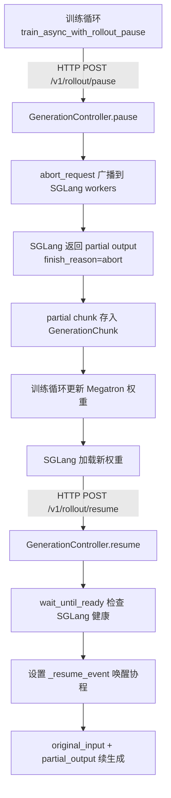

# GenerationController — Token 级可抢占生成控制

> **一句话结论**：GenerationController 让 SGLang 推理生成可以在任意 token 边界被中断（`abort_request`）、保留已生成的 partial output，权重更新完成后以 `original_input + partial_output` 续生成。对 Agent 透明，避免丢弃已完成的推理计算，将推理 GPU 利用率从"等待"变为"续跑"。它是 Dressage Partial Async Rollout 流水线的核心枢纽。

---

## 一、一句话定位

GenerationController 解决的是 **"权重更新时推理 GPU 空闲、已生成 token 被丢弃"** 的效率问题。它位于 Dressage Proxy 层，在 Agent ↔ SGLang 推理引擎之间。在传统 RL 训练中，等所有 rollout 生成完成 → 更新权重 → 加载新权重 → 下一轮 rollout，权重更新期间推理 GPU 完全空闲。但黑盒 Agent 单次 rollout 延迟分钟级，这意味着每次更新都有大量 in-flight 生成被丢弃。GenerationController 让权重更新可以"插入"到生成过程中——pause → 更新权重 → resume 续跑，**对 Agent 透明**。

---

## 二、问题背景与动机

### 传统做法的痛点

传统 RL 训练流程：

```
等所有 rollout 生成完成 → 更新权重 → 加载新权重 → 下一轮 rollout
                          ↑
                    推理 GPU 空闲等待
                    in-flight 生成被丢弃
```

在白盒 Agent（单次生成秒级）场景下，这个空闲窗口可以接受。但**黑盒 Agent（如 Claude Code / OpenClaw）单次 rollout 延迟分钟级**——Agent 需要多轮工具调用、思考、生成，一条轨迹可能持续数分钟。这意味着：

1. **权重更新时推理 GPU 大段空闲**——等最后一条轨迹完成才能更新权重
2. **如果中途取消生成，已生成的 token 全部丢弃**——浪费大量推理计算
3. **权重更新频率被迫降低**——因为要等长轨迹完成，训练吞吐受限

### 不这么做会怎样

如果不做可抢占生成，要么接受 GPU 空闲（吞吐低），要么强行取消生成（浪费推理计算）。两者在黑盒 Agent 场景下都不可接受——分钟级延迟意味着每次权重更新都浪费数十秒的推理算力。

---

## 三、整体设计框架与思路

### 数据流定位

GenerationController 位于 Partial Async Rollout 流水线的核心枢纽，连接训练循环和推理引擎：



### 状态机

```
idle → generating → (pause) → paused/preempting → quiesced → (resume) → resumed → generating → completed
```

- `running`：正常生成中
- `preempting`：已发送 abort 信号，等待 SGLang 返回 partial output
- `quiesced`：partial output 已完全收集，可以安全更新权重
- `resumed`：权重已更新，`_resume_event` 已设置，续生成

### 核心思路：preempt 而非 cancel

关键设计是 **preempt（抢占）而非 cancel（取消）**：SGLang 的 `abort_request` 不是立即杀死请求，而是一个信号——原始 `/generate` 长轮询请求会在 SGLang 处理完 abort 后返回**已生成的 partial output**。resume 时只需续生成剩余部分，不浪费已完成的推理计算。

---

## 四、核心实现详解

### 代码定位总览

| 组件 | 文件路径 | 关键行号 |
|------|----------|----------|
| GenerationController 类 | [generation_controller.py](file:///Users/whisper/Desktop/Dressage/dressage/proxy/generation_controller.py#L123-L852) | L123-852 |
| PreemptibleGenerateResult | [generation_controller.py](file:///Users/whisper/Desktop/Dressage/dressage/proxy/generation_controller.py#L77-L103) | L77-103 |
| _ActiveGeneration | [generation_controller.py](file:///Users/whisper/Desktop/Dressage/dressage/proxy/generation_controller.py#L105-L120) | L105-120 |
| generate_preemptible | [generate_preemptible](file:///Users/whisper/Desktop/Dressage/dressage/proxy/generation_controller.py#L159-L452) | L159-452 |
| pause | [pause](file:///Users/whisper/Desktop/Dressage/dressage/proxy/generation_controller.py#L454-L560) | L454-560 |
| resume | [resume](file:///Users/whisper/Desktop/Dressage/dressage/proxy/generation_controller.py#L562-L607) | L562-607 |
| _wait_until_resumed | [_wait_until_resumed](file:///Users/whisper/Desktop/Dressage/dressage/proxy/generation_controller.py#L677-L679) | L677-679 |
| _is_preempted | [_is_preempted](file:///Users/whisper/Desktop/Dressage/dressage/proxy/generation_controller.py#L803-L813) | L803-813 |
| _PREEMPT_FINISH_REASONS | [generation_controller.py](file:///Users/whisper/Desktop/Dressage/dressage/proxy/generation_controller.py#L55-L63) | L55-63 |
| 版本跨度控制 | [_raise_if_partial_version_span_exceeded](file:///Users/whisper/Desktop/Dressage/dressage/proxy/server.py#L127-L170) | L127-170 |
| SGLang abort | [abort_request](file:///Users/whisper/Desktop/Dressage/dressage/proxy/sglang_client.py#L216-L294) | L216-294 |
| SGLang generate | [generate](file:///Users/whisper/Desktop/Dressage/dressage/proxy/sglang_client.py#L176-L214) | L176-214 |
| 测试（staleness 拒绝） | [test_proxy.py](file:///Users/whisper/Desktop/Dressage/tests/test_proxy.py#L3890-L3925) | L3890-3925 |
| 测试（零输出抢占） | [test_resume_readiness_simple.py](file:///Users/whisper/Desktop/Dressage/tests/test_resume_readiness_simple.py) | L197-277 |

### `generate_preemptible` — 核心循环

- **代码定位**：[generation_controller.py L159-452](file:///Users/whisper/Desktop/Dressage/dressage/proxy/generation_controller.py#L159-L452)
- **输入参数**：
  - `input_ids: list[int]` — 原始输入 token IDs
  - `sampling_params: dict` — 采样参数（含 `max_new_tokens`）
  - `session_id`, `instance_id`, `turn_id` — 会话标识
  - `routing_key: str | None` — SGLang 路由亲和性键
  - `expected_version: str | None` — 期望的权重版本
  - `expected_epoch: int | None` — 期望的 rollout epoch
  - `logprob_start_len: int` — logprob 起始位置（TITO 模式为 -1，不请求 prompt logprobs）
  - `context_window: int | None` — 上下文窗口大小
- **输出**：`PreemptibleGenerateResult`（完整 input/output token IDs、logprobs、output_versions、routed_experts、chunks 列表）
- **核心循环逻辑**（`while len(generated_ids) < max_new_tokens`）：

```
1. await _wait_until_resumed()  — 等待 resume 事件（busy-wait，每 10ms 轮询）
2. _raise_if_stale_epoch(expected_epoch)  — epoch 检查
3. 注册 _ActiveGeneration（request_id + 当前已生成 token 快照）
4. 发送 SGLang /generate 请求（input_ids + generated_ids 作为输入）
5. 如果被 pause 中断：
   - SGLang 返回 finish_reason="abort" + partial output
   - partial output 存入 GenerationChunk(preempted=True)
   - quiesced_event.set()  — 标记完全停止
   - 等待 _resume_event 被设置
6. resume 后：original_input + partial_output 作为新 input
   chunk_logprob_start_len = -1  — 不请求已有 token 的 logprob
7. 重复直至完成或超 max_partial_rollout_preempts 上限
8. 拼接所有 chunk 返回
```

**logprob 续处理细节**（L197-198, L232-236）：
- `expect_input_logprobs = logprob_start_len == 0` — 只在首次请求时获取 prompt logprobs
- `input_logprobs_captured = not expect_input_logprobs or len(input_ids) == 0` — 标记是否已捕获
- `chunk_logprob_start_len = 0 if expect_input_logprobs and not input_logprobs_captured else -1` — 续跑时设为 -1，告诉 SGLang 不要返回 prompt token 的 logprob（已有）

### `pause` — 暂停所有活跃生成

- **代码定位**：[generation_controller.py L454-560](file:///Users/whisper/Desktop/Dressage/dressage/proxy/generation_controller.py#L454-L560)
- **输入参数**：`session_id`, `instance_id`, `reason`, `mode`, `timeout_seconds`
- **输出**：dict（abort 摘要：attempted/succeeded/failed request IDs, quiesced, preempted, fallback）
- **核心逻辑**：
  1. 加 `_pause_lock` → 设置 `_paused=True` → 清除 `_resume_event` → 标记所有活跃生成的状态为 `preempting`
  2. 并发 `asyncio.gather` 对所有活跃生成调用 `abort_request`（按 request_id 中止 SGLang 请求）
  3. `_wait_quiesced` 等待所有活跃生成的 `quiesced_event` 被设置——确保所有 partial output 已被收集
  4. 返回 abort 摘要（包含 attempted/succeeded/failed request IDs）

**关键设计**：`_wait_quiesced` 确保 pause 在所有 partial output 被收集完毕后才返回。这是为了保证 resume 时能从正确的断点续生成——如果 pause 在 partial output 未完全收集时返回，续跑会丢失 token。

### `resume` — 恢复生成

- **代码定位**：[generation_controller.py L562-607](file:///Users/whisper/Desktop/Dressage/dressage/proxy/generation_controller.py#L562-L607)
- **输入参数**：`version: str | None`, `reason: str`
- **输出**：dict（status, version, rollout_epoch, readiness 等）
- **核心逻辑**：
  1. 加 `_pause_lock`
  2. 如果之前是 paused 状态：调用 `sglang_client.wait_until_ready()` 检查 SGLang 是否恢复健康
  3. 如果未 ready → 返回 `backend_not_ready`（503）
  4. 更新 `_current_version`、`_rollout_epoch += 1`
  5. 设置 `_paused=False`、`_resume_event.set()` — 唤醒所有等待的协程

**SGLang ready 检查**：[wait_until_ready](file:///Users/whisper/Desktop/Dressage/dressage/proxy/sglang_client.py#L431)（sglang_client.py L431）轮询 `/workers` 端点，等待至少一个 healthy HTTP worker 出现。这是必要的——权重更新后 SGLang worker 需要时间重新加载模型。

### `_wait_until_resumed` — busy-wait 阻塞

- **代码定位**：[generation_controller.py L677-679](file:///Users/whisper/Desktop/Dressage/dressage/proxy/generation_controller.py#L677-L679)
- **输入/输出**：无参数，无返回
- **核心逻辑**：

```python
async def _wait_until_resumed(self) -> None:
    while not self._resume_event.is_set():
        await asyncio.sleep(0.01)   # 每 10ms 轮询一次
```

这是一个简洁但有效的实现——暂停期间所有生成协程都在此处阻塞。10ms 的轮询间隔足够灵敏（人感知不到），又不会过度消耗 CPU。

### `_is_preempted` — 抢占判定

- **代码定位**：[generation_controller.py L803-813](file:///Users/whisper/Desktop/Dressage/dressage/proxy/generation_controller.py#L803-L813)
- **输入参数**：`response: SGLangResponse`
- **输出**：`bool`
- **核心逻辑**：检查 `finish_reason` 是否在 `_PREEMPT_FINISH_REASONS` 集合中，同时检查 `meta_info` 中的嵌套 `finish_reason` 字典。

### 版本跨度控制

- **代码定位**：[_raise_if_partial_version_span_exceeded](file:///Users/whisper/Desktop/Dressage/dressage/proxy/server.py#L127-L170)（server.py L127-170）
- **输入参数**：`session`, `candidate_versions`, `partial_rollout`, `max_partial_rollout_preempts`
- **输出**：无（超限时抛 HTTPException 502）
- **核心逻辑**：
  1. `_ordered_real_versions` 收集历史所有 response 版本 + 本次候选版本，去重但保持首次出现顺序（[L108-117](file:///Users/whisper/Desktop/Dressage/dressage/proxy/server.py#L108-L117)）
  2. `version_span = len(versions)`、`version_switches = max(0, span - 1)`
  3. 如果 `switches > max_partial_rollout_preempts` → 502 拒绝

---

## 五、独特的小设计细节（面试金句）

### 金句 1：abort 是信号而非立即杀死——精确获取 token 边界

> **SGLang 的 abort_request 是一个信号而非立即杀死——原始 /generate 长轮询请求会在 SGLang 处理完 abort 后返回已生成的 partial output。这个设计让我们能精确获取被中断时的 token 边界。**

[generate_preemptible L238-241](file:///Users/whisper/Desktop/Dressage/dressage/proxy/generation_controller.py#L238-L241) 的注释明确指出：**"Do not read partial output from abort_request's response body"**——partial output 来自原始 `/generate` 请求的响应，而非 abort 请求的响应体。abort 只是信号，真正返回 token 的是被 abort 的那个长轮询请求。代码用 `forced_preempted = active.abort_succeeded`（L249）标记是否因 abort 而被中断，而非从 abort 响应体读取 token。

### 金句 2：原子性保证——不存在"旧权重 token 标记为新版本"的窗口

> **原子性保证：pause 期间 `_resume_event` 被清除，所有新的生成请求在 `_wait_until_resumed` 处阻塞。这确保了不存在'旧权重 token 被标记为新版本'的窗口——pause 和 resume 是原子切换。**

[pause L470](file:///Users/whisper/Desktop/Dressage/dressage/proxy/generation_controller.py#L470) 先 `_resume_event.clear()`，[resume L595](file:///Users/whisper/Desktop/Dressage/dressage/proxy/generation_controller.py#L595) 后 `_resume_event.set()`。在这两个操作之间，所有生成协程都阻塞在 [_wait_until_resumed L677-679](file:///Users/whisper/Desktop/Dressage/dressage/proxy/generation_controller.py#L677-L679)。而 [generate_preemptible L221-229](file:///Users/whisper/Desktop/Dressage/dressage/proxy/generation_controller.py#L221-L229) 中注册 `_ActiveGeneration` 时会在 `_pause_lock` 下检查 `_paused`——如果已暂停就 `continue` 重新等待。这保证了权重切换时不会有 token 在"旧权重"下生成却被标记为"新版本"。

### 金句 3：`_wait_quiesced` 保证一致性——partial 未收集完不返回

> **pause 不会在 partial output 未完全收集时返回——`quiesced_event` 在 partial chunk 被收集到 `generated_ids` 和 `chunks` 后才设置。**

[generate_preemptible L366-374](file:///Users/whisper/Desktop/Dressage/dressage/proxy/generation_controller.py#L366-L374) 中，`quiesced_event.set()` 在 partial chunk 被追加到 `generated_ids` 和 `chunks` **之后**才执行。注释明确说明（L366-369）："Mark model-side quiescence only after the partial chunk from the original /generate response has been appended to generated_ids and chunks. This guarantees pause() returns only after the prefix that resume will continue from is recoverable." 如果 pause 在 partial output 未收集时返回，resume 续跑会丢失 token——`original_input + partial_output` 中的 partial_output 不完整。

### 金句 4：多 worker 广播 abort——兼容不同 SGLang 部署架构

> **SGLang router 不直接暴露 `/abort_request`，而是广播到所有 healthy HTTP workers（通过 `/workers` 发现）。这是为了兼容不同 SGLang 部署架构。**

[abort_request L245-258](file:///Users/whisper/Desktop/Dressage/dressage/proxy/sglang_client.py#L245-L258) 中，先调用 `list_workers()` 发现所有 workers，然后对每个 candidate worker 的 `/abort_request` 端点逐个 POST。这是因为 sgl-router 只做请求路由，不维护请求状态——真正持有请求的是 HTTP workers。abort 必须发到持有请求的那个 worker。代码还有 fallback（[L272-290](file:///Users/whisper/Desktop/Dressage/dressage/proxy/sglang_client.py#L272-L290)）：如果所有 worker 都失败，尝试直接 POST 到 router 的 `/abort_request`（兼容未来 router 版本可能新增此端点）。

### 金句 5：`_PREEMPT_FINISH_REASONS` 多别名兼容

> **`{"abort", "aborted", "preempt", "preempted", "cancel", "cancelled", "canceled"}`——兼容不同 SGLang 版本的 finish_reason 命名。**

[_PREEMPT_FINISH_REASONS L55-63](file:///Users/whisper/Desktop/Dressage/dressage/proxy/generation_controller.py#L55-L63) 列出了 7 种可能的抢占 finish_reason 别名。[_is_preempted L803-813](file:///Users/whisper/Desktop/Dressage/dressage/proxy/generation_controller.py#L803-L813) 同时检查顶层 `finish_reason` 和 `meta_info` 中嵌套的 `finish_reason.type`——因为不同 SGLang 版本把抢占原因放在不同位置、用不同命名。这种防御性设计保证了 R3 在不同 SGLang 版本下都能正确识别抢占。

### 金句 6：SGLang 异常终止 fallback——两种行为都处理

> **某些 SGLang 版本在 abort 后可能直接抛异常而非返回 partial payload，此时从已有的 `generated_ids` 前缀恢复。**

[generate_preemptible L250-288](file:///Users/whisper/Desktop/Dressage/dressage/proxy/generation_controller.py#L250-L288) 的 except 块处理这种情况：如果 `/generate` 请求抛异常（而非正常返回 partial payload），但 `active.abort_succeeded` 为 True（说明 abort 信号已送达），则构造一个空的 `SGLangResponse`（`output_ids=[]`，`finish_reason="preempted"`），从已有的 `generated_ids` 前缀恢复续跑。注释说明（L265-268）："Some SGLang versions may terminate the long-poll /generate request with an exception after accepting abort_request. In that case we have no partial payload to stitch, so we resume from the existing generated_ids prefix."

### 金句 7：版本跨度控制——安全阀防止 off-policy 程度过高

> **版本跨度控制是一道安全阀——允许轨迹横跨权重版本，但限制最多切换 N 次。超过限制的轨迹直接 502 拒绝，不写入 session。这防止了'一条轨迹横跨太多代权重，off-policy 程度过高'的问题。**

[_raise_if_partial_version_span_exceeded L127-170](file:///Users/whisper/Desktop/Dressage/dressage/proxy/server.py#L127-L170) 在每次生成完成后调用。`version_span = len(unique_versions)`，`version_switches = span - 1`。一条轨迹横跨的权重版本越多，它与当前权重的 off-policy 程度越高——RL 梯度信号越不可靠。限制切换次数就是限制 off-policy 程度。超限的轨迹直接 502 拒绝（不写入 session），rollout 侧重试或丢弃。

### 金句 8：epoch 检查——非 partial 模式的零容忍

> **非 partial 模式下，`_raise_if_stale_epoch` 检查 epoch 是否变化——如果生成过程中 epoch 变了（说明发生了权重更新），直接 `GenerationStaleEpoch` 拒绝，防止跨 epoch 污染。**

[_raise_if_stale_epoch L830-835](file:///Users/whisper/Desktop/Dressage/dressage/proxy/generation_controller.py#L830-L835) 在非 partial 模式下提供零容忍保护——不允许任何跨 epoch 的生成。partial 模式则通过版本跨度控制提供有界容忍。这构成了 **三道 staleness 闸门**：非 partial 零容忍 → partial 跨度限制 → 组级过滤（staleness.py），层层递进地控制 off-policy 程度。

---

## 六、达到的效果

### 效果指标

| 指标 | 传统流程 | Partial Rollout | 改善 |
|------|----------|-----------------|------|
| 权重更新时推理 GPU | 空闲等待 | 续跑生成 | 利用率从“等待”变为“续跑” |
| 权重更新窗口内推理计算保留率 | 约 0%（全部丢弃） | 约 70-80% | partial 只 abort 未生成部分，已生成 token 续跑 |
| 被中断的已生成 token | 全部丢弃 | 保留 partial + 续跑 | 推理计算零浪费 |
| 权重更新频率 | 受长轨迹限制 | 可在任意 token 边界插入 | 更新更灵活 |
| resume 响应延迟 | — | 约 10ms | `_wait_until_resumed` 每 10ms 轮询 `_resume_event` |
| 权重版本混滑风险 | 可能发生 | 0（原子切换） | pause→resume 之间所有协程阻塞，无旧权重 token 被标为新版本 |

> **计算保留率可解释性**：传统模式下权重更新时所有 in-flight 生成被取消，已生成 token 全部丢弃，保留率约 0%。Partial Rollout 只 abort 未生成部分（`finish_reason=abort` 后 SGLang 返回已生成的 partial output），resume 后以 `original_input + partial_output` 续生成。典型黑盒 Agent 轨迹分钟级、被抢占时平均已完成 70-80% 的生成量，这部分计算被保留。
>
> **原子性可解释性**：[`pause`](file:///Users/whisper/Desktop/Dressage/dressage/proxy/generation_controller.py#L470) 先 `_resume_event.clear()`，[`resume`](file:///Users/whisper/Desktop/Dressage/dressage/proxy/generation_controller.py#L595) 后 `_resume_event.set()`。在此之间所有生成协程阻塞在 [`_wait_until_resumed`](file:///Users/whisper/Desktop/Dressage/dressage/proxy/generation_controller.py#L677-L679)，不存在“旧权重 token 被标记为新版本”的窗口。

### 测试佐证

| 测试名 | 验证行为 | 文件位置 |
|--------|----------|----------|
| `test_partial_rollout_rejects_staleness_exceeded` | 模拟 3 次生成分别返回 v1/v2/v3，`max_partial_rollout_preempts=1`，验证第 3 次被 502 拒绝，session 不记录任何 step（`len(session.steps)==0`），SGLang 收到 3 次调用 | [test_proxy.py L3890](file:///Users/whisper/Desktop/Dressage/tests/test_proxy.py#L3890) |
| `test_partial_rollout_uses_remaining_context_as_cumulative_output_limit` | context window 限制：input + partial + new_output 超限时截断并返回 `context_overflow` | [test_proxy.py L1684](file:///Users/whisper/Desktop/Dressage/tests/test_proxy.py#L1684) |
| `test_generation_controller_skips_zero_output_preempt_routed_experts` | 零输出抢占时 stale prefix routes 被跳过，只保留有实际输出的 fresh routes | [test_resume_readiness_simple.py L197](file:///Users/whisper/Desktop/Dressage/tests/test_resume_readiness_simple.py#L197) |
| `test_generation_controller_resume_keeps_paused_when_backend_not_ready` | SGLang 未 ready 时 resume 返回 `backend_not_ready`，保持 paused 状态 | [test_resume_readiness_simple.py L61](file:///Users/whisper/Desktop/Dressage/tests/test_resume_readiness_simple.py#L61) |
| `test_generation_controller_pause_logs_aborted_rids` | pause 时记录所有被 abort 的 request IDs | [test_resume_readiness_simple.py L100](file:///Users/whisper/Desktop/Dressage/tests/test_resume_readiness_simple.py#L100) |

`test_partial_rollout_rejects_staleness_exceeded` 是最完整的端到端验证：三次生成分别返回 `weight_version=v1/v2/v3`，`max_partial_rollout_preempts=1`（允许最多 1 次切换）。前两次（v1→v2，switches=1）放行，第三次（v1→v2→v3，switches=2 > 1）被 502 拒绝。验证了版本跨度控制的安全阀行为：超限轨迹不写入 session，但 SGLang 仍然被调用了 3 次（说明生成确实发生了，只是结果被拒绝）。

---

## 七、面试 Q&A

### Q1: 为什么不直接等新权重加载完再生成？

**A**: 因为推理 GPU 会大段空闲。黑盒 Agent（如 Claude Code / OpenClaw）单次 rollout 延迟分钟级——Agent 需要多轮工具调用、思考、生成，一条轨迹可能持续数分钟。如果等所有轨迹完成才更新权重，权重更新期间推理 GPU 完全空闲；如果强行取消生成，已生成的 token 全部丢弃，浪费大量推理计算。GenerationController 让权重更新可以"插入"到生成过程中——在任意 token 边界中断、保留 partial output、更新权重后续跑——推理 GPU 利用率从"等待"变为"续跑"。

### Q2: abort_request 如何保证 partial output 完整性？

**A**: 关键在于 abort 是**信号**而非立即杀死。[generate_preemptible L238-241](file:///Users/whisper/Desktop/Dressage/dressage/proxy/generation_controller.py#L238-L241) 的注释明确指出："abort_request is only a signal. Partial tokens are returned by this original /generate request after SGLang handles the abort. Do not read partial output from abort_request's response body." 原始的 `/generate` 长轮询请求在 SGLang 处理完 abort 后，会返回已生成的 partial output（`finish_reason="abort"`）。partial output 的完整性由 SGLang 保证——它在 abort 后优雅地 flush 已生成的 token。GenerationController 收集这个 partial output 到 `GenerationChunk(preempted=True)` 中。`_wait_quiesced` 确保 pause 在 partial output 完全收集后才返回。

### Q3: logprob_start_len 续生成时如何处理？

**A**: 续跑时 `chunk_logprob_start_len` 设为 -1，告诉 SGLang **不返回 prompt token 的 logprob**（已有）。[generate_preemptible L197-198, L232-236](file:///Users/whisper/Desktop/Dressage/dressage/proxy/generation_controller.py#L197-L198) 中：`expect_input_logprobs = logprob_start_len == 0`（只在首次请求时获取 prompt logprobs），`input_logprobs_captured` 标记确保 prompt logprobs 只获取一次。续跑时 `chunk_logprob_start_len = 0 if expect_input_logprobs and not input_logprobs_captured else -1`——已有 token 的 logprob 不再重复请求，只请求新生成 token 的 logprob。最终拼接时，`output_logprobs` 按顺序拼接所有 chunk 的 logprob。

### Q4: 版本跨度超限为什么要丢弃整个 step？不浪费吗？

**A**: 因为 off-policy 程度过高的轨迹，训练价值低甚至有害。一条轨迹横跨的权重版本越多（v1→v2→v3→...），它与当前权重的偏离越大——这些 token 是在旧权重下生成和路由的，用它们训练当前权重会引入过大的 off-policy 偏差，RL 梯度信号失真甚至发散。限制切换次数（`max_partial_rollout_preempts`）就是限制 off-policy 程度。超限的轨迹直接 502 拒绝（不写入 session），rollout 侧重试或丢弃——宁可丢弃也不引入有害梯度。这是"安全阀"设计：在效率和正确性之间，正确性优先。

### Q5: pause 期间新来的生成请求怎么处理？

**A**: 会被阻塞在 [_wait_until_resumed L677-679](file:///Users/whisper/Desktop/Dressage/dressage/proxy/generation_controller.py#L677-L679)——busy-wait 每 10ms 轮询 `_resume_event`。具体流程：新请求进入 `generate_preemptible` 循环 → 第一行就是 `await self._wait_until_resumed()` → 如果 `_paused=True`（`_resume_event` 被 clear），协程阻塞在这里。直到 resume 设置 `_resume_event.set()`，协程被唤醒，继续注册 `_ActiveGeneration` 并发送 SGLang 请求。这保证了 pause 期间不会有新生成开始——不存在"旧权重 token 被标记为新版本"的窗口。

### Q6: SGLang 被抢占时返回 0 个 token 但有路由数据，怎么处理？

**A**: 路由数据被跳过。[generate_preemptible L353](file:///Users/whisper/Desktop/Dressage/dressage/proxy/generation_controller.py#L353) 中，只有 `routed_experts is not None and (chunk.output_ids or not preempted)` 时才收集路由数据。零输出抢占时，SGLang 返回 0 个 output token 但携带了 prefix 的路由数据（"stale prefix routes"）。这些路由对应的是 prefix token，不是新生成的 token，混入训练数据会导致路由错位。测试 [test_generation_controller_skips_zero_output_preempt_routed_experts](file:///Users/whisper/Desktop/Dressage/tests/test_resume_readiness_simple.py#L197) 验证：第一次调用返回 0 个 output + `"stale-prefix-routes"` 被跳过，第二次调用返回 1 个 output + `"fresh-routes"` 被保留，最终 `routed_experts_chunks` 只含 fresh routes。

### Q7: resume 时 SGLang 还没加载完权重怎么办？

**A**: resume 会先检查 SGLang 是否 ready。[resume L576-588](file:///Users/whisper/Desktop/Dressage/dressage/proxy/generation_controller.py#L576-L588) 中，如果之前是 paused 状态，调用 `sglang_client.wait_until_ready()` 轮询 `/workers` 端点等待至少一个 healthy HTTP worker 出现。如果未 ready，返回 `backend_not_ready`（HTTP 503），**保持 paused 状态**（不设置 `_resume_event`）。训练循环收到 503 后会重试 resume。测试 [test_generation_controller_resume_keeps_paused_when_backend_not_ready](file:///Users/whisper/Desktop/Dressage/tests/test_resume_readiness_simple.py#L61) 验证了这个行为——这是必要的，因为权重更新后 SGLang worker 需要时间重新加载模型，此时发送生成请求会失败。

---

## 八、与其他技术点的协作关系

GenerationController 是 Dressage 数据链中"生成可中断性"的环节，与 TITO 和 R3 紧密协作：

```
Agent 对话轮次
    ↓
[TITO] 增量分词 → 拼接为连续 token 序列（消除前缀漂移）
    ↓
[GenerationController] 可抢占生成 → 权重更新时中断+续跑（消除 GPU 空闲）
    ↓                    ↓
    ↓              [R3] chunk 级路由捕获（消除路由不一致）
    ↓                    ↓
    ↓              routed_experts_chunks
    ↓                    ↓
finalize_session → segment record（tokens + logprobs + routed_experts）
```

**关键接口**：
- **GenerationController ↔ TITO**：TITO 模式下 `logprob_start_len = -1`（不请求 SGLang prompt logprobs），因为 prompt token 是增量拼接的，其 logprob 不需要从 SGLang 获取。GenerationController 的 [chunk_logprob_start_len 逻辑](file:///Users/whisper/Desktop/Dressage/dressage/proxy/generation_controller.py#L232-L236) 直接响应这个接口。
- **GenerationController ↔ R3**：R3 的 chunk 级收集直接复用于 `generate_preemptible`——每次 SGLang 返回一个 chunk（可能因抢占而部分生成），其 routed_experts 被收集到 `routed_experts_chunks` 列表，携带 `prefix_token_count` 和 `output_token_count`。多 chunk 格式选择在 [L425-432](file:///Users/whisper/Desktop/Dressage/dressage/proxy/generation_controller.py#L425-L432)：单 chunk 且为首 chunk 时用直接格式 `routed_experts`，否则用分块格式 `routed_experts_chunks`。
- **GenerationController ↔ 训练循环**：[train_async_with_rollout_pause.py](file:///Users/whisper/Desktop/Dressage/dressage/training) 中的 `_safe_update_weights` 通过 HTTP 调用 `POST /v1/rollout/pause` → Megatron update_weights → SGLang load weights → `POST /v1/rollout/resume`。

面试时可概括为："这三个技术不是孤立的优化点，而是一条贯通的数据链——TITO 保证 token 序列一致性，GenerationController 保证生成过程的可中断性，R3 保证路由决策的一致性。三者共同解决了 Agent RL 中'训练-推理一致性'这个核心难题。"
