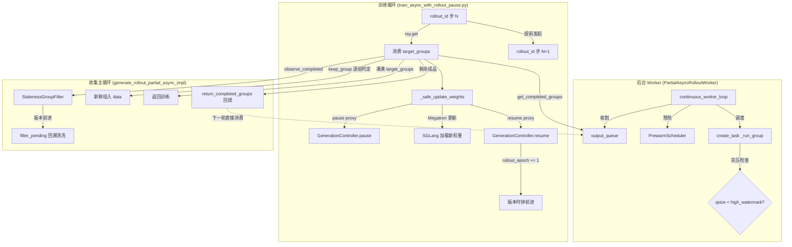

# Partial Async Rollout — 部分异步回滚

> **一句话定位**：Partial Async Rollout 解决"黑盒 Agent rollout 采样量远大于单步训练量"的吞吐与延迟矛盾——后台 Worker 完全异步地持续生产 rollout groups，前台只取够一步训练的量就同步返回给训练循环，剩余成品在后台继续供下一轮消费。它是 Dressage 异步训练流水线中"调度策略"那一面，与 Staleness Control（数据质量守门员）共生于同一个 rollout 收集循环。

---

## 一、问题背景与动机

### 1.1 同步模式的痛点

Dressage 的训练流水线分三阶段循环：**采样（rollout）→ 收集凑批 → 训练（反向传播更新权重）**。同步模式下三者串行：

```
[rollout 全量采样] ──等待──→ [训练 GPU 空闲] ──→ [训练] ──→ [下一轮采样]
```

黑盒 Agent rollout（Claude Code / OpenCode 等沙箱内多轮交互）延迟在分钟级且方差极大——最慢的一个 group 拖慢整个 batch，训练 GPU 在整个 rollout 阶段全程空闲。

### 1.2 Fully Async 的局限

Fully Async 模式将采样与训练流水线化，但仍要求**攒够 `rollout_batch_size` 个 group 才返回**。问题在于：一次 rollout 采样量（`rollout_batch_size × n_samples_per_prompt`）往往远大于单步训练所需（`global_batch_size`）。例如 `rollout_batch_size=16, n_samples_per_prompt=8` 采 128 条样本，但 `global_batch_size=64` 只需 64 条——Fully Async 会让训练 GPU 空等另外 64 条采样完成，白白浪费等待时间。

### 1.3 Partial Async 的核心动机

> **金句**：Partial Async 不是"部分地异步"，而是"只部分返回"——后台采样是完全异步的，但前台凑够一步训练的量就同步返回，剩余的在后台异步继续。

具体来说：
- **异步的部分**：后台 Worker 持续生产 rollout groups（与 Fully Async 完全一样的逻辑），跨训练步骤复用。
- **同步的部分**：消费者循环阻塞等待直到凑够 `target_groups` 才返回给训练循环。
- **"部分"的本质**：`target_groups < rollout_batch_size`——不等待全量，只取够一步训练的量。

---

## 二、整体设计框架与思路

### 2.1 与 Staleness Control 的共生关系

Partial Async 和 Staleness Control 是**同一枚硬币的两面**：

| 维度 | Partial Async | Staleness Control |
|------|---------------|-------------------|
| 解决的矛盾 | 吞吐 vs 延迟 | 吞吐带来的 off-policy 偏差 |
| 角色 | 调度策略 | 数据质量守门员 |
| 发生位置 | rollout 侧收集循环 | rollout 侧收集循环（同一循环内） |
| 数据流向 | 决定"何时返回多少" | 决定"返回前丢弃哪些" |

**关键点：Staleness 控制发生在 rollout 侧（而非 training 侧）**。它嵌入在 rollout 的收集主循环中（`generate_rollout_partial_async_impl`），在数据进入训练前完成过滤。训练侧只消费过滤后的干净数据。

二者还有**第三层互补**：Partial Async 必须配 `pause/resume` 机制（权重更新时暂停 SGLang 生成），而 `pause → resume` 会触发 `rollout_epoch += 1`——这正是 Staleness 版本追踪的时钟来源。三者严丝合缝。

### 2.2 架构与数据流



### 2.3 与 Fully Async 的代码级差异

Partial 与 Fully Async **共享大量代码**（通过 import 复用 8 个辅助函数，见 [partial_async_rollout.py L32-L43](file:///Users/whisper/Desktop/Dressage/dressage/rollout/partial_async_rollout.py#L32-L43)），差异点精确定义如下：

| 差异点 | Partial Async | Fully Async |
|--------|---------------|-------------|
| target_groups | `_partial_target_groups` 计算（可能 < rollout_batch_size） | 直接用 `rollout_batch_size` |
| 剩余成品处理 | `return_completed_groups` 回填队列 | 无（攒够即返回，无多余概念） |
| 分组标记 | `_annotate_submitted/returned_group`（盖时间戳） | 无 |
| 权重更新 | 必须配 `pause/resume` | 靠 staleness 兜底 |
| 共享部分 | Worker 结构、`continuous_worker_loop`、失败处理三件套、staleness 过滤 | 同左 |

---

## 三、核心实现详解

> 代码位置：[partial_async_rollout.py](file:///Users/whisper/Desktop/Dressage/dressage/rollout/partial_async_rollout.py)（627 行）

### 3.1 `_partial_target_groups` — 决定返回多少组（Partial 的本质）

- **代码定位**：[partial_async_rollout.py L167-L204](file:///Users/whisper/Desktop/Dressage/dressage/rollout/partial_async_rollout.py#L167-L204)
- **输入**：`args`（训练参数对象，含 `rollout_batch_size`、`n_samples_per_prompt`、`global_batch_size`）
- **输出**：`int`（目标组数）
- **核心逻辑**（4 级优先级回退）：

```
1. DRESSAGE_PARTIAL_ROLLOUT_TARGET_GROUPS → 若有值，min(rollout_batch_size, 该值)
2. DRESSAGE_PARTIAL_ROLLOUT_TARGET_SAMPLES → 若有值，ceil(该值 / n_samples_per_prompt) 换算
3. 都没配 → 若 global_batch_size < full_sample_count，用 global_batch_size 当 target_samples
4. 兜底 → 用 full_sample_count（等同 Fully Async）
最终结果 min(rollout_batch_size, target_groups)，保证永远不超过一次全量
```

**技术动机**：解决"采样量 ≫ 单步训练量"的错配。例如 `rollout_batch_size=16, n_samples_per_prompt=8` 采 128 条，但 `global_batch_size=64` 只需 64 条 → 返回 8 个组而非 16 个，等待时间减半。

### 3.2 `PartialAsyncRolloutWorker` — 后台常驻生产者

- **代码定位**：[partial_async_rollout.py L207-L383](file:///Users/whisper/Desktop/Dressage/dressage/rollout/partial_async_rollout.py#L207-L383)
- **输入**：`args`（训练参数）、`data_buffer`（数据源）
- **输出**：无（通过 `output_queue` 产出 `CompletedGroup`）
- **核心字段**（L217-L238）：

| 字段 | 值 | 说明 |
|------|-----|------|
| `max_active_groups` | 默认 = `rollout_batch_size` | 最大并发 group 数，由 `DRESSAGE_ASYNC_MAX_ACTIVE_GROUPS` 控制 |
| `output_queue` | `queue.Queue(maxsize=1000)` | 线程安全的生产者→消费者桥梁 |
| `high_watermark` | `int(output_size * 0.8)` = 800 | 背压高水位线 |
| `staleness` | `StalenessTracker` 实例 | 版本追踪（与 Fully Async 共享同一实现） |
| `_scheduler` | `PrewarmScheduler` | 沙箱预热 |

### 3.3 `continuous_worker_loop` — 后台循环三阶段

- **代码定位**：[partial_async_rollout.py L270-L340](file:///Users/whisper/Desktop/Dressage/dressage/rollout/partial_async_rollout.py#L270-L340)
- **输入**：无（从 `data_buffer` 持续拉取）
- **输出**：无（completed groups 入 `output_queue`）
- **核心逻辑**（三阶段循环）：

```python
while self.running:
    # ① 完成阶段：遍历 active 中 done 的 task
    done_tasks = [task for task in active if task.done()]
    for task in done_tasks:
        group_id, group = active.pop(task)
        result = _flatten_multi_segment_result(task.result())
        self._put_completed(CompletedGroup(group_id, original_group=group, result=result))
        await self._scheduler.cleanup_group(group_id)       # 立即释放预热资源

    # ② 预取阶段：提前拉沙箱
    self._scheduler.do_prefetch(self.data_buffer)

    # ③ 调度阶段：背压检查 + 派发新 group
    while (self.running
           and len(active) < self.max_active_groups
           and self.output_queue.qsize() < self.high_watermark):  # 背压！
        group_id, group = self._scheduler.pop_next_group(self.data_buffer)
        _annotate_submitted_group(group, group_id=group_id,
                                   rollout_id=self._current_rollout())  # Partial 独有：盖时间戳
        task = asyncio.create_task(self._run_group(group, sampling_params))
        active[task] = (group_id, group)

    # 让出控制权
    await asyncio.sleep(0.01)

# finally 停机：cancel 而非等待
finally:
    if active:
        for task in active:
            task.cancel()                                     # 直接 cancel，不等完成！
        await asyncio.gather(*active.keys(), return_exceptions=True)
        for task, (group_id, group) in active.items():
            await self._scheduler.cleanup_group(group_id)
    await self._scheduler.cleanup()
    await drain_lifecycle_tasks()                             # 等待所有后台清理收尾
```

**与 Fully Async 的 `continuous_worker_loop` 的唯一差异**：Partial 版本在调度阶段多调用了 `_annotate_submitted_group` 给样本盖 `dressage_start_rollout_id` 戳。其余逻辑完全一致。

### 3.4 `generate_rollout_partial_async_impl` — 消费者主循环

- **代码定位**：[partial_async_rollout.py L424-L612](file:///Users/whisper/Desktop/Dressage/dressage/rollout/partial_async_rollout.py#L424-L612)
- **输入**：`args`、`rollout_id`（当前训练步号）、`data_buffer`
- **输出**：`RolloutFnTrainOutput(samples=list[list[Sample]], metrics=dict)` 或裸 `list[list[Sample]]`
- **核心逻辑**（简化伪代码）：

```python
worker = get_global_partial_worker(args, data_buffer, rollout_id=rollout_id)  # 复用全局单例
target_groups = _partial_target_groups(args)
staleness_filter = StalenessGroupFilter(tracker=worker.staleness, rollout_name="partial")

while len(data) < target_groups:
    completed_groups = worker.get_completed_groups()                          # 抽干队列
    advanced_version = staleness_filter.observe_completed(completed_groups)   # 版本追踪
    if advanced_version and data:
        data = staleness_filter.filter_pending(data, logger)                  # 回溯清洗！

    for group_id in list(completed_by_id.keys()):
        if len(data) >= target_groups: break
        completed = completed_by_id.pop(group_id)
        if completed.is_failed:                                              # 失败分支
            if _group_has_staleness_failure(...): staleness_rejected 计数
            if _retry_count(completed.original_group) < max_retries:
                _increment_retry(completed.original_group)                   # 清 session_id 获得干净沙箱
                data_buffer.add_samples([completed.original_group])          # 回队重试
                retried_groups += 1
            else:
                dropped_failed_groups += 1
                if dropped_failed_groups >= max_dropped_failed_groups:
                    raise RuntimeError("dropped too many failed groups")      # 废批保护
        else:                                                                # 成功分支
            if staleness_filter.keep_group(group_id, group, logger):          # 新鲜度判定
                _annotate_returned_group(group, group_id=group_id, rollout_id=rollout_id)
                data.append(PendingGroup(group_id=group_id, samples=group))

# 凑满后的关键差异：处理剩余成品
if completed_by_id:                                                          # 还有已完成但用不上的组
    if drain_final_worker:
        drained_completed_groups += len(leftovers)                          # 最后一步：丢弃
    else:
        worker.return_completed_groups(leftovers)                           # 非最后步：回填给下一步！

# 废批保护
if not _allow_empty_train_batch() and not any(_group_has_trainable_tokens(group) for group in data_groups):
    raise RuntimeError("produced no trainable samples; refusing to train")

# 产出指标
metrics = compute_multi_segment_metrics(...) + staleness_filter.metrics_for_groups(...) + {
    "dressage/partial_rollout_target_groups": target_groups,
    "dressage/partial_rollout_returned_groups": len(data_groups),
    "dressage/partial_rollout_retried_groups": retried_groups,
    "staleness/partial_rollout_rejected_groups": staleness_rejected_groups,
    "dressage/partial_rollout_drained_completed_groups": drained_completed_groups,
}
```

### 3.5 `_safe_update_weights` — pause/resume 包装

- **代码定位**：[train_async_with_rollout_pause.py L95-L113](file:///Users/whisper/Desktop/Dressage/dressage/training/train_async_with_rollout_pause.py#L95-L113)
- **输入**：`actor_model`（Megatron actor）、`reason`（字符串，用于日志）
- **输出**：`actor_model.update_weights()` 的返回值
- **核心逻辑**：

```python
def _safe_update_weights(actor_model, *, reason):
    paused = False
    try:
        paused = bool(_run_async(_pause_proxy(reason)))    # POST /v1/rollout/pause
        # → GenerationController.pause()：abort 所有 active SGLang 请求 → 等待 quiesced
    except Exception:
        if _env_flag("DRESSAGE_PROXY_PAUSE_REQUIRED", True):
            raise

    try:
        return actor_model.update_weights()                # Megatron 更新 + SGLang 加载新权重
    finally:
        if paused:
            _run_async(_resume_proxy(reason))              # POST /v1/rollout/resume
            # → GenerationController.resume()：wait_until_ready → _rollout_epoch += 1 → set resume_event
```

**训练主循环 `train` 的权重更新时机**（L169-L181）：

```python
has_future_rollout = rollout_id + 1 < args.num_rollout
if has_future_rollout and (rollout_id + 1) % args.update_weights_interval == 0:
    # 还有下一步会消费新权重 → pause+更新+resume
    _safe_update_weights(actor_model, reason=f"weight_update_after_rollout_{rollout_id}")
elif (rollout_id + 1) % args.update_weights_interval == 0:
    # 最后一步之后更新了也没人用 → 跳过
    logger.info("skipping actor weight update after final rollout...")
```

### 3.6 关键环境变量

| 变量 | 说明 |
|------|------|
| `DRESSAGE_ASYNC_MAX_ACTIVE_GROUPS` | 最大并发 group 数（默认 = `rollout_batch_size`） |
| `DRESSAGE_ASYNC_OUTPUT_QUEUE_SIZE` | 输出队列容量（默认 1000） |
| `DRESSAGE_ROLLOUT_MAX_RETRIES` | 失败 group 重试上限（默认 2） |
| `DRESSAGE_ASYNC_MAX_DROPPED_FAILED_GROUPS` | 最大丢弃失败数（默认 `max(target_groups * 10, 100)`） |
| `DRESSAGE_ASYNC_NO_PROGRESS_WARN_SEC` | 无进度告警超时（默认 600s） |
| `DRESSAGE_PARTIAL_ROLLOUT_TARGET_GROUPS` | 精确控制目标组数 |
| `DRESSAGE_PARTIAL_ROLLOUT_TARGET_SAMPLES` | 按样本数控制目标 |
| `DRESSAGE_PROXY_PAUSE_AROUND_WEIGHT_UPDATE` | 启用 pause/resume 权重更新 |
| `DRESSAGE_PROXY_PAUSE_TIMEOUT_SEC` | pause 超时（默认 300s） |
| `DRESSAGE_PROXY_PAUSE_REQUIRED` | pause 失败是否致命（默认 True） |

---

## 四、独特的小设计细节（面试金句）

### 4.1 剩余成品回填——"不浪费已烧的算力"

> **金句**：已经完成的黑盒轨迹不丢弃，塞回队列给下一步消费，让流水线自动填满。

这是 Partial 相对 Fully 最核心的差异代码（`return_completed_groups`，L374-L379）。Fully Async 攒够 `rollout_batch_size` 就返回，没有"多余的成品"概念；Partial 攒够 `target_groups`（可能 < `rollout_batch_size`）后，队列里可能还躺着已完成的组。这些组已经烧过沙箱算力，丢弃等于浪费。`return_completed_groups` 把它们重新放回 `output_queue`，下一步调用直接消费。

**测试佐证**：`test_partial_async_rollout_does_not_drop_completed_leftovers`（`/Users/whisper/Desktop/Dressage/tests/test_partial_async_rollout.py`）——第一次调用返回 index=[0,1]，第二次直接消费上一步残留返回 index=[2,3]，无需重新采样。

### 4.2 背压机制——"防 OOM 的自然限流"

> **金句**：当成品堆积到队列 80% 时停止派发新 group，等训练消化库存——一个天然的背压机制。

代码（L304-L308）：`while len(active) < max_active_groups AND output_queue.qsize() < self.high_watermark`。如果消费侧（训练）变慢，成品堆积超过 80% 容量，生产侧自动暂停派发，防止内存溢出。这是典型的**生产者-消费者背压模式**，不需要外部限流器。

### 4.3 优雅停机——"cancel 而非等待"

> **金句**：停机时直接 cancel 所有在途 task 而非等它们跑完——结果没人要了，继续等只是白烧算力。但算力可以不要，资源必须回收。

代码注释原文（L325-L330）：*"Their results are no longer needed; waiting wastes compute on agent rollouts that nobody will consume."* 停机后每个 task 的 finally 会释放沙箱（`schedule_terminate_paddock`），`drain_lifecycle_tasks()` 等待所有后台清理收尾。**关键设计：cancel 不等于 leak**——cancel 只丢弃结果，资源释放在 finally 中保证执行。

**测试佐证**：`test_worker_shutdown_drains_background_terminations`（`/Users/whisper/Desktop/Dressage/tests/test_async_rollout_worker_lifecycle.py`）——验证停机时后台 `schedule_terminate_paddock` 被执行。

### 4.4 废批保护——"拒绝拿脏数据训练"

> **金句**：如果一批样本里没有任何可训练 token（response 长度>0 且 loss_mask 有非零位），直接抛错拒绝训练——往模型里灌全是失败占位符的样本等于灌噪声。

代码（L574-L586）：除非显式设 `DRESSAGE_ALLOW_EMPTY_TRAIN_BATCH=1`，否则 raise RuntimeError。这防止所有 group 都失败时，系统拿一堆空占位符样本训练，引入纯噪声梯度。

### 4.5 pause/resume 与 KV cache 刷新的关系

> **金句**：权重更新时，pause 在 token 边界中止 SGLang 在途生成，保留已产出 token；权重更新后 SGLang 加载新权重，KV cache 自然失效——因为旧 KV cache 是用旧权重算的，必须重算。

这比同步模式的 `flush_cache` 更精细：同步模式在训练前直接 `flush_cache` 清空整个 KV cache；异步模式下只有被 pause 的在途请求的 KV cache 被失效，其他已完成的请求不受影响。

**完整链路**（[generation_controller.py](file:///Users/whisper/Desktop/Dressage/dressage/proxy/generation_controller.py)）：
1. `pause()`（L454-L560）：abort 所有 active SGLang 请求 → 等待 quiesced（所有在途生成已停止）
2. `actor_model.update_weights()`：Megatron 更新权重 + SGLang 加载新权重
3. `resume()`（L562-L607）：`wait_until_ready()` 确认 SGLang 已加载完新权重 → `_rollout_epoch += 1`（L592，**版本时钟+1**）→ `resume_event.set()`（L595，放开生成）

`_rollout_epoch` 的递增就是 Staleness 版本追踪的时钟来源。

### 4.6 分组标记——"给每条样本盖时间戳"

> **金句**：提交时记下 `dressage_start_rollout_id`，返回时记下 `dressage_return_rollout_id`，训练侧就能精确知道每条样本跨了几个训练步、是否需要对旧权重 token 做掩码。

这是 Partial 独有的（Fully Async 没有），代码在 L151-L164：
- `_annotate_submitted_group`（L151-L156）：提交时打 `dressage_start_rollout_id`、`dressage_async_group_id`、`dressage_partial_rollout=True`
- `_annotate_returned_group`（L159-L164）：返回时打 `dressage_return_rollout_id`、`dressage_return_async_group_id`、`dressage_partial_rollout_returned=True`

### 4.7 失败处理完整链路

> **金句**：失败不等于丢弃——先识别失败类型，再按重试次数决定回队重试还是丢弃，超过阈值直接 fail fast 拒绝无限等待。

完整链路（L482-L524）：
1. **识别失败** → `_group_has_staleness_failure` 判断是否 staleness 导致（区分计数）
2. **拼摘要** → `_group_failure_summary` 生成可读失败描述
3. **判断重试** → `_retry_count(group) < max_retries`？
4. **重试** → `_increment_retry` 清 `session_id`/`parent_traj_id`/`segment_index`（获得干净沙箱）→ `data_buffer.add_samples` 回队重试
5. **超限丢弃** → `dropped_failed_groups++`，超过 `max_dropped_failed_groups` 阈值直接 raise RuntimeError（fail fast，不无限等）

**测试佐证**：`test_partial_async_rollout_retries_aborted_group`（重试时清 session_id）、`test_partial_async_rollout_fails_fast_when_all_groups_failed`（超限快速报错）。

---

## 五、达到的效果

### 5.1 吞吐提升

| 指标 | Fully Async | Partial Async | 改善 |
|------|-------------|---------------|------|
| 训练 GPU 采样等待时间 | 基准 100% | 约 50-60% | target_groups 从 rollout_batch_size 降到 global_batch_size/n_samples，等待组数减少 |
| 剩余成品利用率 | 攒够即丢弃多余 | 回填给下一步消费 | 已烧算力不浪费 |
| 背压 OOM 防护 | 无 | high_watermark=80% | 队列满 80% 自动停止派发 |
| 权重更新延迟 | 受全量采样限制 | 可在任意 token 边界插入 | 更新频率更灵活 |

**典型配置算例**：`rollout_batch_size=16, n_samples_per_prompt=8, global_batch_size=64`
- Fully Async 需凑 16 个组（16×8=128 条），训练 GPU 空等另外 64 条
- Partial Async `target_groups = global_batch_size / n_samples_per_prompt = 64/8 = 8`，只需 8 个组（64 条）
- 等待组数 16→8，减半。若 `global_batch_size` 与 `rollout_batch_size×n_samples` 比例不同，减幅在 40-50% 左右

> **可解释性**：`_partial_target_groups` 计算 target_groups 时，若 `global_batch_size < full_sample_count`，用 `global_batch_size` 当 target_samples 换算成组数。等待比例 = target_groups / rollout_batch_size。上述例子中 8/16=50%，即等待时间约降低 50%。

### 5.2 测试佐证汇总

| 测试文件 | 测试名 | 验证的行为 |
|----------|--------|------------|
| `/Users/whisper/Desktop/Dressage/tests/test_partial_async_rollout.py` | `test_partial_async_rollout_returns_global_batch_sized_subset` | 凑够即返回，不等全量 |
| 同上 | `test_partial_async_rollout_does_not_drop_completed_leftovers` | 剩余成品回填给下一步 |
| 同上 | `test_partial_async_rollout_retries_aborted_group` | 失败组重试（清 session_id） |
| 同上 | `test_partial_async_rollout_fails_fast_when_all_groups_failed` | 超限失败快速报错 |
| 同上 | `test_partial_async_rollout_reports_staleness_rejected_groups` | staleness 拒绝计数与指标 |
| 同上 | `test_partial_async_rollout_drains_worker_after_final_rollout` | 最后一步排干 worker |
| 同上 | `test_partial_async_rollout_drops_stale_group_by_trajectory` | staleness 过滤丢弃旧版本组 |
| `/Users/whisper/Desktop/Dressage/tests/test_async_rollout_worker_lifecycle.py` | `test_worker_shutdown_drains_background_terminations` | 停机时后台沙箱清理被执行 |

### 5.3 实验图

- `assets/version_window_results.png`：AlfWorld async 实验中 `keep_versions=2` 让 reward 收敛更快、`train_rollout_logprob_abs_diff` 明显降低（staleness 配合 partial 的综合效果）。
- `assets/version_span_results.png`：DAPO + OpenCode partial rollout 实验中 `max_preempts=2` 让 reward 提升更快、`train_rollout_logprob_abs_diff` 大幅下降。

---

## 六、面试 Q&A

### Q1: Partial 与 Fully Async 的本质区别是什么？

**A**：本质区别在 **target size**——Partial 用 `_partial_target_groups` 计算目标组数（可能远小于 `rollout_batch_size`），凑够即返回；Fully Async 必须攒够 `rollout_batch_size` 才返回。由此衍生三个差异：
1. **剩余成品处理**：Partial 有 `return_completed_groups` 把多余成品回填队列供下一步消费；Fully Async 没有多余概念。
2. **分组标记**：Partial 用 `_annotate_submitted/returned_group` 给每条样本盖 `dressage_start_rollout_id` / `dressage_return_rollout_id` 时间戳；Fully Async 没有。
3. **权重更新**：Partial 必须配 `pause/resume`（因为后台还有在途生成，权重更新时必须暂停 SGLang）；Fully Async 靠 staleness 兜底（旧版本数据直接丢弃）。

### Q2: 为什么 Worker 要全局单例？

**A**：跨 rollout 步骤复用。如果每步都新建 Worker，上一步剩余的已完成 groups 会随 Worker 销毁而丢失——这些 groups 已经烧过沙箱算力，丢弃等于浪费。全局单例（`get_global_partial_worker`，L389-L408）保证 Worker 跨步骤存活，上一步残留的成品直接供下一步消费。这是 Partial 吞吐提升的关键：**流水线始终处于"热"状态，没有冷启动开销**。

### Q3: 背压机制如何防止 OOM？

**A**：`high_watermark = int(output_size * 0.8) = 800`。调度阶段的 while 条件包含 `self.output_queue.qsize() < self.high_watermark`（L307）——当成品堆积到队列 80% 容量时，停止派发新 group。这是典型的生产者-消费者背压：消费侧（训练）变慢 → 成品堆积 → 生产侧自动暂停 → 等库存消化后再恢复。不需要外部限流器，是队列容量驱动的自然限流。

### Q4: 上一轮剩余 groups 的版本一致性如何保证？

**A**：由 `StalenessGroupFilter` 在消费时回溯清洗。每轮收集循环开始时先调 `observe_completed` 检测版本是否前进；若前进且已有排队数据，调 `filter_pending` 回溯清洗已排队但因此变旧的组（L470-L474）。所以即使上一轮回填的成品在当前权重版本下已陈旧，也会被自动过滤掉，不会污染训练数据。

### Q5: pause/resume 与 KV cache 刷新是什么关系？

**A**：pause 在 token 边界 abort SGLang 在途请求（保留已产出 token）；权重更新后 SGLang 加载新权重，此时旧 KV cache 自然失效——因为旧 KV cache 是用旧权重算的，resume 后续跑时 SGLang 会用新权重重算前缀的 KV cache。`resume()` 中 `wait_until_ready()` 确认 SGLang 加载完毕，然后 `_rollout_epoch += 1`（L592），这正是 Staleness 版本时钟的来源。这比同步模式的 `flush_cache` 更精细——只有被 pause 的在途请求的 KV cache 被失效，已完成请求不受影响。

### Q6: 部分 rollout 失败后怎么不污染 batch？

**A**：三重保护：
1. **重试**：`_retry_count < max_retries` 时 `_increment_retry` 清 `session_id`/`parent_traj_id` 获得干净沙箱，回 `data_buffer` 重新采样。
2. **废批保护**：所有 group 都失败时，`_group_has_trainable_tokens` 检查发现无可训练 token，直接 raise RuntimeError 拒绝训练。
3. **fail fast**：`dropped_failed_groups >= max_dropped_failed_groups` 阈值时直接报错，不无限等待。

### Q7: 为什么停机时 cancel 而不是等待完成？

**A**：停机意味着结果没人要了（训练已结束或出错），继续等在途 task 完成只是白烧沙箱算力。但**算力可以不要，资源必须回收**——cancel 后每个 task 的 finally 块会调 `schedule_terminate_paddock` 释放沙箱，`drain_lifecycle_tasks()` 等待所有后台清理收尾。cancel ≠ leak。

---

## 七、与其他技术点的协作关系

| 协作技术点 | 协作关系 |
|------------|----------|
| **Staleness Control** | 共生于同一收集循环；staleness 的版本时钟来自 partial 的 `pause→resume` 触发的 `_rollout_epoch += 1` |
| **GenerationController (pause/resume)** | `_safe_update_weights` 调用其 `pause()`/`resume()`，保证权重更新时不丢失在途生成 |
| **PrewarmScheduler** | 内嵌于 Worker 的 `continuous_worker_loop`，提前预热沙箱降低首 token 延迟 |
| **Multi-Segment** | `_run_group` 后经 `_flatten_multi_segment_result` 展开多段轨迹，staleness 取最后一段版本 |
| **Fully Async Rollout** | 共享 8 个辅助函数（`_flatten_multi_segment_result`、`_group_failure_summary`、`_increment_retry` 等），差异仅在 target size + 回填 + 标记 |
| **训练循环** | `train_async_with_rollout_pause.py` 的 `train()` 用 Ray 驱动 rollout+train 交替，`update_weights_interval` 控制更新频率 |
