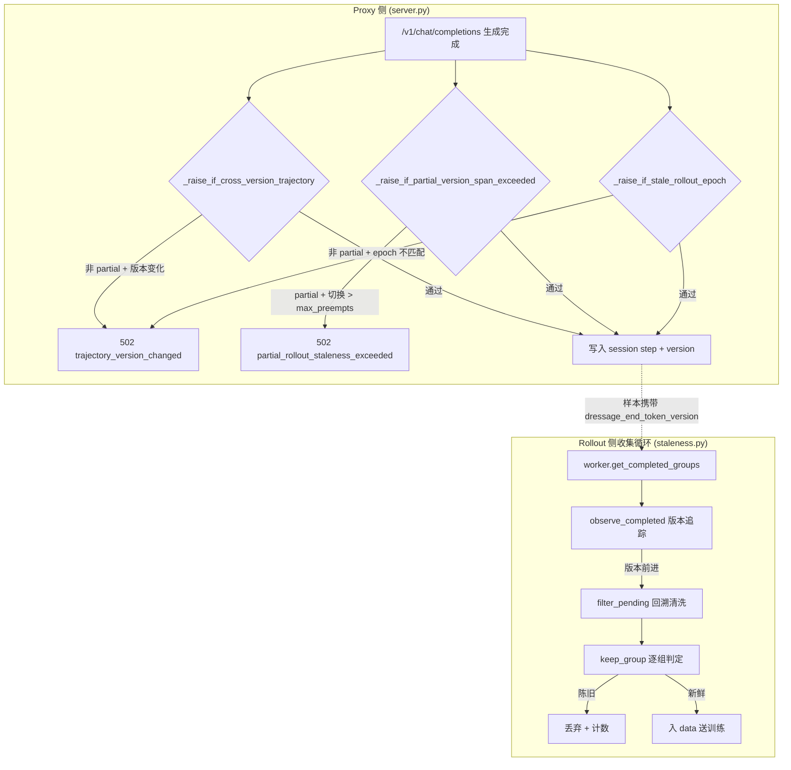

# Staleness Control — 陈旧度控制

> **一句话定位**：Staleness Control 解决异步训练中"后台持续用旧权重采样，等数据被消费时权重已更新"导致的 off-policy 偏差——它追踪权重版本世代，自动丢弃基于过期权重生成的 rollout groups，保证训练数据版本一致性。它是 Dressage 异步训练流水线中"数据质量守门员"那一面，与 Partial Async Rollout（调度策略）共生于同一个 rollout 收集循环。

---

## 一、问题背景与动机

### 1.1 异步解耦导致 off-policy

异步模式下 rollout 生成与权重更新在时间上解耦：

```
rollout group A (v1权重) ──完成──→ 入队
rollout group B (v1权重) ──完成──→ 入队
────── 权重更新 v1 → v2 ──────
rollout group C (v2权重) ──完成──→ 入队
```

训练时已用 v2 权重，但 A/B 基于 v1 生成 → **off-policy 偏差**。RL 对 on-policy 敏感性远强于 SGD——GRPO 优势归一化依赖"同 prompt 组内样本共享同一行为策略"的假设，混入旧权重样本会破坏这一假设。

### 1.2 更隐蔽的问题：已入队的数据在权重更新后变陈旧

不仅新采样的数据可能基于旧权重，**已入队排队中的数据在权重更新后也变陈旧**。如果不回头清洗，这些"刚合格转眼就过期"的组会混入训练。

### 1.3 传统做法的局限

| 方案 | 局限 |
|------|------|
| Sync 模式 | 无新鲜度问题，但训练 GPU 全程空闲 |
| Fully Async + 不做 staleness 控制 | off-policy 偏差累积，训练不稳定 |
| Async SGD 的"陈旧梯度降权" | 难以确定合理权重；且 GRPO 组结构不能被部分删除破坏 |

Dressage 选择**直接丢弃 + 可选重试**——因为 RL 的 on-policy 敏感性比 SGD 更强，且 GRPO 组结构不可破坏（见 4.6 节）。

---

## 二、整体设计框架与思路

### 2.1 与 Partial Async 的共生关系

Staleness Control 与 Partial Async Rollout 是**同一枚硬币的两面**：

| 维度 | Partial Async | Staleness Control |
|------|---------------|-------------------|
| 解决的矛盾 | 吞吐 vs 延迟 | 吞吐带来的 off-policy 偏差 |
| 角色 | 调度策略（何时返回多少） | 数据质量守门员（返回前丢弃哪些） |
| 发生位置 | rollout 侧收集循环 | **rollout 侧**收集循环（同一循环内） |

**关键点：Staleness 控制发生在 rollout 侧（而非 training 侧）**。它嵌入在 rollout 的收集主循环中（`generate_rollout_partial_async_impl` 和 `generate_rollout_async`），在数据进入训练前完成过滤。训练侧只消费过滤后的干净数据。

版本时钟的来源：Partial Async 的 `pause → resume` 会触发 `GenerationController.resume()` 中的 `_rollout_epoch += 1`，这正是 Staleness 版本追踪的时钟来源。二者通过版本时钟紧密耦合。

### 2.2 三道闸全景

Dressage 的 staleness 控制不是单一机制，而是**三道闸**层层把关：

| 闸口 | 位置 | 作用 | 配置 | 触发后果 |
|------|------|------|------|----------|
| **1. 非 partial 零跨版** | `server.py` L173-L245 | 非 partial 轨迹任何版本变化即拒 | 自动生效（partial 时关闭） | 502 `trajectory_version_changed` |
| **2. 轨迹级跨度限制** | `server.py` L127-L170 | 限制单轨迹版本切换次数 | `--max-partial-rollout-preempts` | 502 `partial_rollout_staleness_exceeded` |
| **3. 组级新鲜度过滤** | `staleness.py` L87-L215 | 训练前丢弃整体过旧的组 | `dressage_staleness_keep_versions` | 静默丢弃 |

**三道闸的分工**：
- 第 1 道防"非 partial 模式下，单条轨迹中途换了权重"——这种情况必须立即拒绝，因为非 partial 模式假设一条轨迹从头到尾用同一个权重。
- 第 2 道防"partial 模式下，单条轨迹被抢占太多次、横跨太多版本"——允许跨版本续跑，但限制切换次数。
- 第 3 道防"整组样本相对当前权重太旧"——在数据进入训练前兜底过滤。

三者独立配置、同时生效，形成从生成到训练的全链路新鲜度保障。

### 2.3 数据流



---

## 三、核心实现详解

> 代码位置：[staleness.py](file:///Users/whisper/Desktop/Dressage/dressage/rollout/staleness.py)（216 行）+ [server.py](file:///Users/whisper/Desktop/Dressage/dressage/proxy/server.py)（三道闸）

### 3.1 Staleness 的度量方式

**结论**：Staleness 的度量是**权重版本世代（generation）**，即版本在历史中"首次出现的顺序下标"，而非版本号的大小或 step 差。

**版本从哪里来**：每个训练样本的 `metadata["dressage_end_token_version"]` 字段，表示"这条轨迹**结束时**所用的权重版本"。该字段由 Proxy 侧在生成过程中写入（版本来源是 `GenerationController` 的 `_rollout_epoch`，每次 `pause → resume` 后 +1，通过 `output_versions` 传递到样本）。

**版本历史维护**（`StalenessTracker.versions`，L90）：一个按首次出现顺序追加的 list，如 `["v1", "v2", "v3"]`。下标越大越新。**不假设版本是可比较的数字**——即使版本号跳号或乱序（如 `"alpha"` 之后是 `"aardvark"`），也能正确判断先后。

### 3.2 `trajectory_version_infos` — 从样本到"轨迹版本"

- **代码定位**：[staleness.py L65-L84](file:///Users/whisper/Desktop/Dressage/dressage/rollout/staleness.py#L65-L84)
- **输入**：`group: list[Any]`（一个 prompt 组的样本列表）
- **输出**：`list[TrajectoryVersionInfo]`（每条轨迹一个 `(key, version)` 二元组）
- **核心逻辑**：

```python
def trajectory_version_infos(group):
    latest_by_key = {}
    for order, sample in enumerate(group):                          # 按到达顺序遍历
        version = real_version(metadata["dressage_end_token_version"])  # 占位值归 None
        if version is None: continue                                # 跳过无版本样本
        key = trajectory_key(sample) = metadata["parent_traj_id"]   # 轨迹标识
        if not key: continue                                        # 跳过无 key 样本
        position = (segment_index, order)                           # (段序号, 到达序号)
        if key not in latest_by_key or latest_by_key[key][0] <= position:
            latest_by_key[key] = (position, version)               # 取位置最大者的版本
    return [TrajectoryVersionInfo(key, version) for each key]
```

**关键设计**：一条被切成多段的轨迹，以它**最后一段结束时的权重版本**为准。因为一条轨迹的新鲜度应该由它**最新的那部分**代表，而不是最早的部分。

**测试佐证**：`test_trajectory_version_uses_last_segment_end_version`（`/Users/whisper/Desktop/Dressage/tests/test_staleness.py`）——segment_index=2 的版本 `"gamma"` 胜出，而非 segment_index=0 的 `"alpha"`。

### 3.3 `StalenessTracker` — 版本历史与截断线

- **代码定位**：[staleness.py L87-L132](file:///Users/whisper/Desktop/Dressage/dressage/rollout/staleness.py#L87-L132)
- **输入**：`StalenessConfig`（含 `keep_versions`）
- **关键属性**：

| 属性 | 计算 | 含义 |
|------|------|------|
| `current_version_index` | `len(versions) - 1` | 最新版本下标 |
| `cutoff_version_index` | `max(0, len(versions) - keep_versions)` | 截断线（下标 < 此线的版本为陈旧） |

**核心方法**：

**`observe_group`**（L111-L119）：
- 输入：`group`（样本列表）
- 输出：`bool`（是否发现新版本）
- 逻辑：遍历每条轨迹版本，若 `version not in versions` → append；返回版本数是否增加

**`should_drop_group`**（L121-L129）：
- 输入：`group`（样本列表）
- 输出：`bool`（是否应丢弃）
- 逻辑：`cutoff = cutoff_version_index`；若 cutoff 为 None 返回 False（功能关闭）；否则 `any(version_index(info.version) < cutoff)`——**组内任意一条轨迹陈旧即整组丢弃**

### 3.4 `StalenessGroupFilter` — 主循环 facade

- **代码定位**：[staleness.py L135-L215](file:///Users/whisper/Desktop/Dressage/dressage/rollout/staleness.py#L135-L215)
- 三个核心操作：

**1. `observe_completed`**（L144-L150）：
- 输入：`list[CompletedGroup]`
- 输出：`bool`（是否版本前进）
- 逻辑：遍历每个 completed.result，调 `tracker.observe_group`，任一推进返回 True

**2. `filter_pending`**（L160-L171）：
- 输入：`list[PendingGroup]`（已入队但未返回训练的候选组）
- 输出：`list[PendingGroup]`（过滤后仍保留的组）
- 逻辑：逐个 `keep_group` 判定，去掉变陈旧的

**3. `keep_group`**（L152-L158）：
- 输入：`group_id: int`、`group: list`、`logger`
- 输出：`bool`（True=保留，False=丢弃）
- 逻辑：`should_drop_group` 为 True → `_drop_group`（计数+打日志）→ False；否则 True

### 3.5 主循环中的交互时序（关键不变量）

在 `generate_rollout_partial_async_impl`（L467-L533）和 `generate_rollout_async` 中：

```python
while len(data) < target:
    1. completed_groups = worker.get_completed_groups()
    2. advanced = staleness_filter.observe_completed(completed_groups)    # 先观察
    3. if advanced and data:
           data = staleness_filter.filter_pending(data, logger)            # 再回溯清洗
    4. for each completed group:
           if staleness_filter.keep_group(group_id, group, logger):       # 最后单组判定
               data.append(...)
```

**关键不变量**：`observe → filter_pending → keep_group` 的严格顺序——先让 tracker 看到最新世代、推前截断线，再回溯清洗已排队但因此变旧的组，最后才判定本轮新完成的组。**如果不先推前截断线，新完成的组可能被错误保留**（因为截断线还没更新，旧版本尚未被判定为陈旧）。

### 3.6 轨迹级跨度限制（Proxy 侧第二道闸）

- **代码定位**：[server.py L127-L170](file:///Users/whisper/Desktop/Dressage/dressage/proxy/server.py#L127-L170)
- **输入**：`session`（会话对象）、`candidate_versions`（本次候选版本）、`partial_rollout`（是否部分回滚）、`max_partial_rollout_preempts`（最大抢占次数）
- **输出**：无（正常放行）或 raise `HTTPException(502)`
- **核心逻辑**：

```python
def _raise_if_partial_version_span_exceeded(*, session, candidate_versions,
                                              partial_rollout, max_partial_rollout_preempts):
    if not partial_rollout or max_partial_rollout_preempts is None:
        return                                              # 仅 partial 生效
    versions = _ordered_real_versions(                      # 去重保序
        [*_session_response_versions(session), *candidate_versions]
    )
    version_span = len(versions)
    version_switches = max(0, version_span - 1)             # 切换次数 = span - 1
    if version_switches <= max_partial_rollout_preempts:
        return                                              # 放行
    raise HTTPException(502, detail={
        "error": "partial_rollout_staleness_exceeded",
        "versions": versions, "version_span": ..., "version_switches": ...,
        "max_preempts": ..., "max_version_span": max_preempts + 1,
        "session_id": ..., "instance_id": ...
    })
```

**触发时机**：每次 `/v1/chat/completions` 生成完成、写 session step 之前。被拒绝的步骤不写入 session。

**测试佐证**：`test_partial_rollout_rejects_staleness_exceeded`——验证被拒绝后 `len(session.steps) == 0`。

### 3.7 非 partial 零跨版检查（第一道闸）

- **代码定位**：[server.py L173-L245](file:///Users/whisper/Desktop/Dressage/dressage/proxy/server.py#L173-L245)
- **输入**：`session`、`candidate_versions`、`partial_rollout`、`current_epoch`
- **输出**：无（正常放行）或 raise `HTTPException(502)`
- **核心逻辑**：

`_raise_if_cross_version_trajectory`（L173-L212）：若 `partial_rollout=True` 直接 return（partial 允许跨版本）；否则检查本次候选版本是否是 session 历史版本的新增——若有新增版本，说明非 partial 轨迹中途换了权重，直接拒绝。

`_raise_if_stale_rollout_epoch`（L215-L245）：若 `partial_rollout=True` 直接 return；否则检查 `session.rollout_epoch == current_epoch`——若不匹配，说明 session 跨了 epoch（权重更新边界），拒绝。

---

## 四、独特的小设计细节（面试金句）

### 4.1 回溯清洗——"不仅过滤新来的，还回头清洗已排队的"

> **金句**：版本前进时，不仅过滤新完成的组，还回头重新过滤已经排在队列里的组——因为版本刚推进，之前还合格的组现在可能超窗了。

这是 staleness 设计中最容易被忽略的细节。代码在 [partial_async_rollout.py L470-L474](file:///Users/whisper/Desktop/Dressage/dressage/rollout/partial_async_rollout.py#L470-L474)：

```python
if advanced_version and data:
    previous_count = len(data)
    data = staleness_filter.filter_pending(data, logger)      # 回溯清洗！
```

如果不做回溯清洗，已排队但变陈旧的组会混入训练，引入 off-policy 偏差。**这正是"先观察后过滤"顺序的意义**——先让 tracker 看到最新版本、推前截断线，再回头清洗。

**测试佐证**：`test_observe_completed_then_filter_pending_when_newer_version_arrives`（`/Users/whisper/Desktop/Dressage/tests/test_staleness.py`）——已有 `old` 版本的 pending group，收到 `new` 版本后，`filter_pending` 清洗掉 old group，`dropped_groups == 1`。

### 4.2 版本标签不透明——"不假设版本号可比较"

> **金句**：版本被当作不透明标签处理，按首次出现顺序而非字典序或数字大小衡量新鲜度——这样即使版本号跳号或乱序也能正确判断。

代码在 `StalenessTracker.versions`（L90）是一个 list，按 `append` 顺序维护。`version_index`（L131-L132）用 `list.index()` 查找。如果用数字比较，遇到 `"alpha"` 或 `"release-candidate"` 这种非数字标签就会出错。

**测试佐证**：`test_tracker_drops_by_observed_version_order_not_label_sort`（`/Users/whisper/Desktop/Dressage/tests/test_staleness.py`）——`"alpha"` 和 `"aardvark"` 按出现顺序而非字典序判断，`"alpha"` 先出现所以更旧。

### 4.3 按轨迹而非样本取版本——"多段轨迹取最后一段的版本"

> **金句**：一条被切成多段的轨迹，以它最后一段结束时的权重版本为准——因为轨迹的新鲜度应该由它最新的那部分代表。

代码在 `trajectory_version_infos`（L65-L84），按 `(segment_index, order)` 排序取位置最大者的版本。这保证了跨版本的长轨迹被公平对待——前段用旧权重不代表整条轨迹都旧。

### 4.4 保守丢弃——"组内任意一条轨迹陈旧，整组丢弃"

> **金句**：丢弃粒度是 GRPO group 而非单条样本——因为 GRPO 优势归一化依赖组内结构，只删部分轨迹会改变组统计量，引入另一种偏差。

代码在 `should_drop_group`（L121-L129）用 `any(...)` 判定——组内任意一条轨迹陈旧即整组丢弃。`docs/staleness.md` 明确说明："The drop granularity is the GRPO group, not an individual sample or segment."

### 4.5 阈值语义——`keep_versions` 的 trade-off

> **金句**：`keep_versions=1` 是严格 on-policy，只保留最新一代；`N>1` 容忍一定 off-policy 换取数据利用率。这是个吞吐 vs 新鲜度的可调旋钮。

- `keep_versions=0` 或不设 → 功能完全旁路，全部放行（零侵入）
- `keep_versions=1` → 只保留最新版本产出的组
- `keep_versions=N` → 保留最近 N 代

**实验效果**（`docs/staleness.md`）：AlfWorld 实验中 `keep_versions=2` 让 reward 收敛更快、`train_rollout_logprob_abs_diff` 明显降低。

### 4.6 超阈值丢弃+重试，不降权——与 async SGD 的对比

> **金句**：超阈值的 rollout 组直接丢弃，不做降权——因为降权会让 GRPO 组内统计量不一致。丢弃后若重试次数未满，以全新 session 重新生成。

这与 async SGD 的 staleness 处理不同：async SGD 常用"陈旧梯度降权（stale gradient scaling）"，Dressage 选择直接丢弃是因为 **RL 的 on-policy 敏感性比 SGD 更强**，且 **GRPO 组结构不能被部分删除破坏**。降权难以确定合理权重，而丢弃 + 重试能保证组结构完整。

### 4.7 默认关闭——零侵入设计

> **金句**：不配置或配置为 0 时功能完全旁路，全部放行——保证对不需要 staleness 控制的场景零侵入。

代码在 `config_from_args`（L32-L41）：`None` 或 `0` 返回 `StalenessConfig()`（`enabled=False`），所有方法检查 `config.enabled` 后直接返回。这意味着 staleness 是**可选的增量能力**，不影响已有训练流程。

### 4.8 监控指标——可观测的 off-policy 程度

> **金句**：`staleness/version_gap_mean` 指标量化了训练数据的平均落后版本数——gap 越大代表越 off-policy，可用于观测异步训练的滞后程度。

代码在 `metrics_for_groups`（L173-L200），产出 `dropped_groups`、`current_version_index`、`cutoff_version_index`、`version_gap_min/max/mean`。gap 按**轨迹加权**（每条有效轨迹单独计入 gap 列表），长轨迹与短轨迹在均值里权重不同。

---

## 五、达到的效果

### 5.1 可量化指标

| 指标 | Baseline（无 staleness 控制） | keep_versions=2 | 说明 |
|------|-------------------------------|------------------|------|
| reward 收敛速度 | 基准 | 更快收敛 | AlfWorld async 实验，见 `assets/version_window_results.png` |
| `train_rollout_logprob_abs_diff` | 基准 | 明显降低 | 衡量 on-policy 程度，值越低越 on-policy |
| `staleness/version_gap_mean` | 不可控 | 可量化观测 | gap=0 为严格 on-policy，gap=1 为落后一代 |

| 指标 | Baseline（无版本跨度限制） | max_preempts=2 | 说明 |
|------|-------------------------------|-----------------|------|
| reward 提升速度 | 基准 | 更快提升 | DAPO + OpenCode partial rollout 实验，见 `assets/version_span_results.png` |
| `train_rollout_logprob_abs_diff` | 基准 | 大幅下降 | 限制旧版本前缀的 off-policy 污染 |

`train_rollout_logprob_abs_diff` 是衡量 on-policy 程度的核心指标——它衡量训练时当前策略与 rollout 时行为策略的对数概率差异，值越小说明越 on-policy。

### 5.2 keep_versions trade-off 量化

| 配置 | 保留版本范围 | 数据利用率 | off-policy 程度 | 适用场景 |
|------|------------|-----------|----------------|----------|
| `keep_versions=0` | 全部放行 | 100% | 无限制 | 调试 / 验证 |
| `keep_versions=1` | 仅最新一代 | 约 50%（典型值） | 严格 on-policy（gap=0） | 新鲜度优先 |
| `keep_versions=2` | 最近 2 代 | 约 75%（典型值） | 轻微 off-policy（gap≤1） | 吞吐-新鲜度平衡（推荐） |
| `keep_versions=N` | 最近 N 代 | 约 min(1, N/V)×100% | gap≤N-1 | 大批量异步训练 |

> **数据利用率可解释性**：假设每次权重更新后有约一半的已完成 groups 基于上一代版本（异步采样与权重更新解耦的固有特征），`keep_versions=1` 会丢弃这些组，数据利用率约 50%；`keep_versions=2` 保留上代+当代，利用率约 75%。这是“吞吐 vs 新鲜度”的可调旋钮——AlfWorld 实验表明 `keep_versions=2` 是好的平衡点。
>
> **version_gap 可解释性**：`staleness/version_gap_mean` 按轨迹加权统计每条轨迹落后多少代版本。gap=0 表示全部数据来自最新权重（严格 on-policy），gap=1 表示平均落后一代。该指标可用于监控异步训练的 off-policy 程度，校准 `keep_versions` 和 `max_preempts` 参数。

### 5.3 测试佐证汇总

| 测试文件 | 测试名 | 验证的行为 |
|----------|--------|------------|
| `/Users/whisper/Desktop/Dressage/tests/test_staleness.py` | `test_config_from_args_defaults_disabled_and_rejects_negative` | 配置解析：None/0=关闭，负数抛错 |
| 同上 | `test_real_version_treats_versions_as_opaque_labels` | 版本标签不透明处理 |
| 同上 | `test_trajectory_version_uses_last_segment_end_version` | 多段轨迹取最后一段版本 |
| 同上 | `test_tracker_drops_by_observed_version_order_not_label_sort` | 按出现顺序而非字典序判定 |
| 同上 | `test_mixed_group_drops_when_any_versioned_trajectory_is_stale` | 组内任一陈旧即整组丢弃 |
| 同上 | `test_observe_completed_then_filter_pending_when_newer_version_arrives` | 回溯清洗：新版本到来后已排队旧组被清洗 |
| 同上 | `test_metrics_are_trajectory_weighted_by_version_index_gap` | 监控指标按轨迹加权 |
| `/Users/whisper/Desktop/Dressage/tests/test_partial_async_rollout.py` | `test_partial_async_rollout_reports_staleness_rejected_groups` | staleness 拒绝计数与指标 |
| 同上 | `test_partial_async_rollout_drops_stale_group_by_trajectory` | staleness 过滤丢弃旧版本组 |
| 同上 | `test_partial_async_rollout_returns_staleness_metrics` | staleness 指标输出 |
| `/Users/whisper/Desktop/Dressage/tests/test_fully_async_rollout.py` | `test_fully_async_rollout_ignores_full_versions_and_uses_end_version` | 用 end version 而非 full_versions 判定 |

---

## 六、面试 Q&A

### Q1: 为什么需要回溯清洗而不仅是入口过滤？

**A**：因为版本前进是**异步发生**的。一个组在入队时可能还是最新版本（合格），但几秒后权重更新、版本前进，它就变成了陈旧版本。如果只做入口过滤（只检查新来的组），已入队但因此变旧的组会混入训练。回溯清洗（`filter_pending`）在每次检测到版本前进后，回头重新过滤整个 `data` 列表，把刚变旧的组也清理掉。这是 staleness 设计中最容易被忽略但最关键的细节。

### Q2: keep_versions=1 和 N 的 trade-off 是什么？

**A**：
- `keep_versions=1`：严格 on-policy，只保留最新一代版本产出的组。新鲜度最高，但数据利用率最低——所有基于旧版本的组都被丢弃，可能浪费大量已烧算力的 rollout。
- `keep_versions=N`：容忍一定 off-policy 换取数据利用率。保留最近 N 代版本，更多数据可用于训练，但引入轻微 off-policy 偏差。

这是个**吞吐 vs 新鲜度的可调旋钮**。AlfWorld 实验表明 `keep_versions=2` 是一个好的平衡点——reward 收敛更快，`train_rollout_logprob_abs_diff` 明显降低。

### Q3: 与 async SGD 的 staleness 有何异同？

**A**：
- **相同点**：都面临异步导致的 off-policy/off-gradient 问题。
- **不同点**：
  1. **处理方式**：async SGD 常用"陈旧梯度降权（stale gradient scaling）"；Dressage 选择"直接丢弃 + 可选重试"。
  2. **原因**：RL 的 on-policy 敏感性比 SGD 更强——GRPO 优势归一化依赖"同 prompt 组内样本共享同一行为策略"的假设，降权难以确定合理权重；且 GRPO 组结构不能被部分删除破坏（只删部分轨迹会改变组统计量）。
  3. **粒度**：async SGD 按样本/梯度降权；Dressage 按 GRPO group 整组丢弃。

### Q4: 为什么用 end version 而非逐 token 版本判定？

**A**：**粗细粒度分离设计**——组级判定用粗粒度（轨迹最终版本），token 级 `full_versions` 只用于训练侧 loss mask。

- `dressage_end_token_version`：轨迹结束时所用权重版本，用于 staleness 组级过滤（够用且高效）。
- `full_versions`：逐 token 的版本列表，用于训练侧 `--mask-nonlast-version-tokens`（对跨版本边界的旧权重 token 做 loss mask，更精细）。

组级判定不需要逐 token 精度——一条轨迹的新鲜度由它最后一段的版本代表即可（`trajectory_version_infos` 取最后一段版本）。过早的精度只增加开销，不改善判定质量。

### Q5: 版本时钟从哪里来？如何传递到 staleness？

**A**：完整链路如下：
1. **产生**：`GenerationController._rollout_epoch`（`generation_controller.py` L146），初始为 0。
2. **前进**：每次 `resume()`（L562-L607）中 `self._rollout_epoch += 1`（L592）——即每次 `pause → resume`（权重更新）后版本 +1。
3. **传递**：SGLang 生成时携带当前 `_rollout_epoch` 作为版本，通过 `output_versions` 写入样本的 `dressage_end_token_version` 字段。
4. **消费**：`staleness.py` 只读 `dressage_end_token_version`，不负责生产。

所以 staleness 的版本时钟**完全由 Partial Async 的 `pause/resume` 机制驱动**——这也是二者共生关系的体现。

### Q6: 三道闸的分工和触发顺序是什么？

**A**：
- **第 1 道（非 partial 零跨版）**：在 `/v1/chat/completions` 请求进来时检查，针对非 partial 模式——一条轨迹中途换了权重立即拒绝。partial 模式下此闸关闭。
- **第 2 道（轨迹级跨度限制）**：在生成完成后、写 session 前检查，针对 partial 模式——允许跨版本续跑，但限制单轨迹版本切换次数（`max_preempts`）。超限返回 502，不写 session。
- **第 3 道（组级新鲜度过滤）**：在 rollout 收集循环中检查——整组样本相对当前权重太旧就静默丢弃（`keep_versions` 控制）。

触发顺序：生成请求进来 → 第 1/2 道闸检查 → 生成完成 → 写 session 前第 2 道闸检查 → 样本进入收集循环 → 第 3 道闸过滤。第 1/2 道在 Proxy 侧（生成时），第 3 道在 rollout 侧（收集时）。

### Q7: 为什么 staleness 发生在 rollout 侧而不是 training 侧？

**A**：因为 staleness 的本质是"rollout 数据相对当前权重的滞后"，最自然的位置就是在 rollout 数据进入训练前完成过滤。如果放在 training 侧，需要额外传递版本元数据、增加训练循环复杂度；而放在 rollout 侧收集循环中，过滤后的数据直接进入训练，训练侧无需感知 staleness 逻辑。这也使得 staleness 对训练代码**零侵入**——训练侧只消费干净数据。

---

## 七、与其他技术点的协作关系

Staleness Control 是异步训练流水线中"数据质量守门员"，与 Partial Async Rollout 共生于同一收集循环，版本时钟由 GenerationController 驱动，与 Multi-Segment 正交共存。

### 与 Partial Async Rollout 的共生关系

二者是**同一枚硬币的两面**——Partial Async 解决"吞吐 vs 延迟"矛盾（决定何时返回多少组），Staleness Control 解决"吞吐带来的 off-policy 偏差"（决定返回前丢弃哪些组）。两者嵌入在同一个 rollout 收集主循环（`generate_rollout_partial_async_impl`）中，共享同一个 `StalenessTracker` 实例。

**版本时钟链路**：Partial Async 的 `pause → resume` 触发 [GenerationController.resume()](file:///Users/whisper/Desktop/Dressage/dressage/proxy/generation_controller.py#L562-L607) 中 `_rollout_epoch += 1`（L592），这个 epoch 通过 `output_versions` 写入样本的 `dressage_end_token_version` 字段，Staleness 的 `StalenessTracker` 读取该字段追踪版本世代。没有 Partial Async 的 `pause/resume`，就没有版本时钟；没有 Staleness Control，版本时钟就只是个没人消费的计数器。二者严丝合缝。

### 与 GenerationController 的接口

`_rollout_epoch` 是两者之间的唯一接口，也是 Staleness 版本追踪的时钟来源：

1. **产生**：`GenerationController._rollout_epoch`（[generation_controller.py L146](file:///Users/whisper/Desktop/Dressage/dressage/proxy/generation_controller.py#L146)），初始为 0
2. **前进**：每次 `resume()`（[generation_controller.py L562-L607](file:///Users/whisper/Desktop/Dressage/dressage/proxy/generation_controller.py#L562-L607)）中 `self._rollout_epoch += 1`（L592）——即每次 `pause → resume`（权重更新）后版本 +1
3. **传递**：SGLang 生成时携带当前 `_rollout_epoch` 作为版本，通过 `output_versions` 写入样本 metadata
4. **消费**：[staleness.py](file:///Users/whisper/Desktop/Dressage/dressage/rollout/staleness.py) 只读 `dressage_end_token_version`，不负责生产

Staleness 是 GenerationController 版本时钟的**下游消费者**——它不自己生产版本，只是被动观测和过滤。

### 与 Multi-Segment 的正交关系

二者**正交共存**于同一条轨迹——Multi-Segment 解决"历史重写导致 token 断裂"（训练侧），Staleness Control 解决"权重更新导致 on-policy 性丧失"（推理侧），两者可共存于同一条轨迹。

**关键设计**：一条被切成多段的轨迹，Staleness 按**最后一段**结束时的权重版本判定新鲜度（[trajectory_version_infos](file:///Users/whisper/Desktop/Dressage/dressage/rollout/staleness.py#L65-L84) 按 `(segment_index, order)` 取位置最大者的版本）。这意味着 segment 内部可以跨版本（前段用 v1、后段用 v2），但整条轨迹的新鲜度由最新段代表。这与 segment 的切分逻辑完全正交——切分由 TITO append-only 契约违反触发，版本判定由 epoch 追踪驱动，两个维度互不干扰。

`staleness/version_span_mean` 指标正是为此设计——量化一条轨迹跨了多少个版本世代，用于校准 partial rollout 的 `max_preempts` 参数。

面试时可概括为："Staleness 不是孤立的数据过滤器——它是 Partial Async 的'质量守门员'，版本时钟来自 GenerationController 的 resume，按轨迹最后一段版本判定，与 Multi-Segment 的 segment 切分正交共存。三者共同解决了异步训练中'吞吐与新鲜度'的核心矛盾。"
