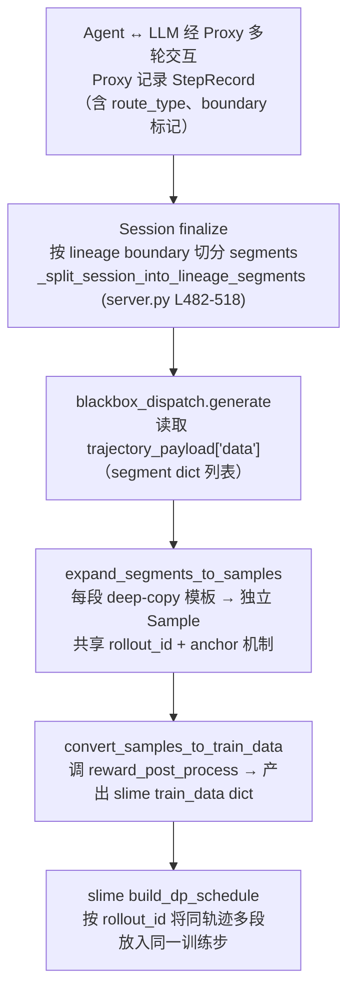

# Multi-Segment Training — 多段轨迹训练

> **一句话定位**：多段训练是 Dressage **训练侧**的核心机制，位于"proxy rollout 产出"与"slime Megatron 训练循环"之间的桥梁层——当 Agent 长对话因历史重写（compaction / schema 变更）导致 token 序列物理断裂后，把断裂的多段重新扩展为独立 Sample 并共享 `rollout_id` 保证同一训练步，让中间决策的梯度信号不丢失。

---

## 一、问题背景与动机

### 传统做法的痛点

Agent 在长对话中会自主压缩历史（compaction / summarization）、切换策略回退、增删工具。这些操作破坏了 token 序列的物理连续性——一条轨迹被分裂成多个 segment。传统做法只训最后一段（丢弃中间段），意味着大量有效推理行为被浪费。

典型 SWE agent 轨迹的断裂场景：

| 段 | 内容 | token 量 |
|----|------|----------|
| segment 0 | 初始分析 + 首轮代码编辑 | ~800 |
| segment 1 | 测试执行 + 调试修复 | ~600 |
| segment 2 | 最终修复确认 | ~200 |

只训 segment 2 意味着 ~1400 token 的推理行为梯度信号被丢弃。

### Segment 触发条件

边界判定不是简单按"agent turn"切，而是由 `_boundary_reasons()`（`/Users/whisper/Desktop/Dressage/dressage/proxy/server.py` L319-332）收集多维度信号：

| 触发条件 | 字段 | 说明 |
|----------|------|------|
| History rewrite | `history_rewrite` | 当前 step 与上一步 `turn_id` 相同但消息非纯追加（`rewrite_detected = previous_step.turn_id == effective_turn_id and not append_only`，L1510-1514） |
| Message prefix mismatch | `message_prefix_mismatch` | TITO 模式下路由判定为 `create`（新 lineage）但未检测到重写（L1515-1520） |
| Tools changed | `tools_changed` | route base step 的 tools 哈希与当前不同（L1521-1525） |
| TITO routing render failed | `tito_routing_render_failed` | `_select_route()` 抛异常（L1534-1538） |
| TITO incremental tokenization failed | `tito_incremental_tokenization_failed` | 增量 tokenize 后缀差分失败（L1558-1577） |

---

## 二、整体设计框架与思路

### 端到端数据流



核心思路：**不是把多段拼回一条连续轨迹，而是让多段以独立 Sample 的身份并行训练，但共享 `rollout_id` 保证它们在同一个 training step 一起更新梯度**。

### Segment 边界双维度设计

这是文档最关键的设计细节——边界判定由两个独立维度控制：

| 维度 | 字段 | 决定什么 | 切分函数 |
|------|------|----------|----------|
| **Timeline boundary** | `segment_boundary_before` | 每个 step 独立全量 tokenize（snapshot 模式） | `_split_session_into_timeline_segments`（server.py L521-530） |
| **Lineage boundary** | `lineage_segment_boundary_before` | TITO 增量拼接的断点（同 lineage 内 token 连续） | `_split_session_into_lineage_segments`（server.py L482-518） |

**关键区别**：
- lineage segment 内的 token 可以通过 TITO 增量拼接成连续序列
- timeline segment 是每个 step 独立全量 tokenize
- 两种 view 互斥，由 `segment_view` 字段控制
- `tools_changed` / `tito_routing_render_failed` / `tito_incremental_tokenization_failed` 会同时触发两种 boundary
- 但只有 `history_rewrite` 和路由失败才会新建 `lineage_id`

这保证了 TITO 增量 tokenize 的 **append-only 契约**：同一 lineage segment 内的 token 序列是连续的，不同 lineage segment 之间不拼接。

---

## 三、核心实现详解

### 3.1 `expand_segments_to_samples`

- **代码定位**：[multi_segment.py L118-192](file:///Users/whisper/Desktop/Dressage/dressage/rollout/multi_segment.py#L118-L192)
- **输入参数**：
  - `template_sample`：slime Sample 模板（含基础字段）
  - `segments`：proxy 产出的 segment dict 列表（每段含 tokens / loss_mask / logprobs / messages / segment_index）
  - `args`：训练参数
  - `agent_response`：最终响应文本
  - `session_id`、`instance_id`：轨迹与实例标识
- **输出**：`list[Sample]`，长度 = segment 数，按 `segment_index` 升序
- **核心逻辑**（L150-192）：
  1. 按 `segment_index` 升序排序；检测重复 index 抛 `ValueError`——防 anchor 选错（L162-165）
  2. `rollout_id = template_sample.index`——**所有段共享**，这是 slime `build_dp_schedule` 把它们放进同一训练步的依据（L168）
  3. 对每段 `copy.deepcopy(template_sample)` → 调 `write_sample_from_segment` 写入 tokens / loss_mask / logprobs（L172-183）
  4. 写入 `metadata["parent_traj_id"] = sid`（兄弟关系标记）、`metadata["segment_index"]`（L185-186）
  5. **anchor 机制**：非 anchor（`i != last_idx`）设 `reward = 0.0`；anchor 保持 `reward = None` 让 slime 的 reward_fn 只运行一次（L188-189）

```python
# 核心片段（L168-189）
rollout_id = getattr(template_sample, "index", None)  # 所有段共享

for i, segment in enumerate(sorted_segments):
    sample = copy.deepcopy(template_sample)
    sample.rollout_id = rollout_id  # ← 同一训练步的依据

    write_sample_from_segment(sample, args=args, segment=segment, ...)

    sample.metadata["parent_traj_id"] = sid      # 兄弟关系
    sample.metadata["segment_index"] = int(...)

    if i != last_idx:
        sample.reward = 0.0  # 非 anchor 预设 0
    # anchor 保持 reward=None → slime reward_fn 只跑一次
```

### 3.2 `reward_post_process`

- **代码定位**：[reward_post_process.py L79-162](file:///Users/whisper/Desktop/Dressage/dressage/training/reward_post_process.py#L79-L162)
- **输入参数**：
  - `args`（含 `advantage_estimator`、`rewards_normalization`、`grpo_std_normalization`、`reward_key`）
  - `samples`（含 multi-segment 标记的 Sample 列表）
- **输出**：`(raw_rewards, rewards)` 两个等长列表——`raw_rewards` 稀疏（anchor 持有终端 reward），`rewards` 广播（所有段共享 anchor 的 advantage）
- **核心逻辑**（L108-162）：

  **步骤 1 — 提取 raw_rewards**（L108-114）：`None → 0.0`，dict reward 按 `reward_key` 取值。

  **步骤 2 — `_compute_parent_groups`**（L18-48）：按 `parent_traj_id` 分组，跳过 `remove_sample` 样本；每组选 `segment_index` 最大的为 anchor。

  **步骤 3 — GRPO 路径**（L121-160，`advantage_estimator in ("grpo", "gspo", "reinforce_plus_plus_baseline")` 且开启归一化）：
  - **关键细节**：只有 `parent_representative_indices`（即各 anchor）和"无 parent_traj_id 的普通样本"参与 group 均值计算——**非 anchor 段被排除**，避免占组内均值（L131-140）
  - 按 `group_index` 分组，`advantage = R - mean(group_anchors)`，可选 `/std`
  - 归一化后 `_broadcast_to_segments` 把 anchor 的 advantage 广播到所有兄弟段（L160）

  **步骤 4 — 非 GRPO 路径**（L121-125）：不做均值归一化，但仍然广播 anchor 的 raw reward 到所有兄弟段——否则非 anchor 段 advantage=0 却占 loss 分母，梯度被稀释。

```python
# GRPO 归一化：只有 anchor 参与 group 均值（L131-140）
parent_representative_indices = set(parent_anchor.values())
groups: dict[int, list[tuple[int, float]]] = defaultdict(list)
for i, s in enumerate(samples):
    if getattr(s, "remove_sample", False):
        continue
    gi = s.group_index if s.group_index is not None else _NONE_GROUP
    if i in parent_representative_indices:       # ← anchor 才参与
        groups[gi].append((i, raw_rewards[i]))
    elif not (s.metadata and s.metadata.get("parent_traj_id")):
        groups[gi].append((i, raw_rewards[i]))  # 普通样本也参与

# 归一化后广播到所有兄弟段（L160）
_broadcast_to_segments(rewards, parent_groups, parent_anchor)
```

### 3.3 Prompt-Equal 分母

- **代码定位**：[convert_samples.py L26-82](file:///Users/whisper/Desktop/Dressage/dressage/rollout/convert_samples.py#L26-L82)（`_prompt_equal_rollout_mask_sums`）+ [L85-227](file:///Users/whisper/Desktop/Dressage/dressage/rollout/convert_samples.py#L85-L227)（`convert_samples_to_train_data`）
- **输入参数**：`args`（含 `global_batch_size`、`advantage_estimator`）、`samples`、`loss_masks`
- **输出**：每个 sample 的分母（`list[float]`）
- **公式**：

```text
denom = M_P × N_P / gbs

其中:
  M_P = prompt P 所有 live 段的 loss_mask 总和
  N_P = batch 中有 live 样本的 prompt 数
  gbs = global_batch_size
```

- **适用条件**：`advantage_estimator in ("grpo", "reinforce_plus_plus_baseline")` 时启用（L23, L146-151）；其他估计器用 slime 默认的 trajectory-equal（按 rollout_id 汇总 mask，L153-158）

- **Worked Example**（来自 `docs/training.md` L239-246，`gbs=4`，两个 prompt）：

| Prompt | Segments | Mask Sums | M_P | N_P | Per-Sample Denom |
|--------|----------|-----------|-----|-----|------------------|
| prompt-1 | 2 segments | 100 + 150 | 250 | 2 | 250 × 2 / 4 = 125 |
| prompt-2 | 1 segment | 200 | 200 | 2 | 200 × 2 / 4 = 100 |

prompt-1 的两个 segment 共享分母 125，保证"一个 prompt 贡献为一个 prompt"。没有 prompt-equal 的话，prompt-1 两个段分母分别是 100 和 150，prompt-1 获得不公平的额外梯度权重。

- **为什么理论上正确**（`docs/training.md` L209-215）：GRPO 按 group 归一化 advantage，共享前缀的梯度项在 group 内期望抵消为零。prompt-equal 保证"一个 prompt 贡献为一个 prompt"，不因段数多而获得额外梯度权重。ScaleRL 论文（[arXiv:2510.13786](https://arxiv.org/abs/2510.13786)）实证 prompt-average loss 聚合最优。

### 3.4 `mark_aborted_no_grad`

- **代码定位**：[multi_segment.py L72-115](file:///Users/whisper/Desktop/Dressage/dressage/rollout/multi_segment.py#L72-L115)
- **输入**：`sample`（失败的 Sample）、`session_id`、`instance_id`
- **输出**：标记后的 sample（原地修改）
- **核心逻辑**：设 `remove_sample=True`（不参训但保留在 batch 中）+ 保留 `parent_traj_id` / `instance_id`（追踪 + prompt-equal 计算）+ 清除 `session_id`（释放重试获新 session）+ 保留 `last_failed_session_id`（调试可追溯）

### 3.5 `compute_multi_segment_metrics`

- **代码定位**：[multi_segment.py L195-249](file:///Users/whisper/Desktop/Dressage/dressage/rollout/multi_segment.py#L195-L249)
- **输入**：`samples`（一个 rollout batch 的全部 Sample）
- **输出**：`dict[str, float]`（wandb 指标）
- **核心逻辑**：按 `parent_traj_id` 分桶统计 segment 分布 + 跨版本跨度，输出 `rollout/segments_per_trajectory_mean/max/min`、`rollout/num_trajectories`、`rollout/num_segments`、`staleness/version_span_mean/max/min`（用于校准 partial rollout 参数）。`remove_sample=True` 的失败样本排除。

---

## 四、独特的小设计细节（面试金句）

### 1. 双维度 segment 边界——不是按 turn 切，而是按 TITO append-only 契约违反判定

> **金句**：边界不是按 agent turn 切，而是区分 timeline boundary（每 step 独立 snapshot）和 lineage boundary（TITO 增量拼接断点）——这保证了 TITO append-only 契约：同 lineage 内 token 连续，跨 lineage 不拼接。

展开：`_boundary_reasons()`（server.py L319-332）收集 `history_rewrite` / `message_prefix_mismatch` / `tools_changed` 三个信号，叠加 `tito_routing_render_failed` 和 `tito_incremental_tokenization_failed` 后形成最终边界。timeline 和 lineage 由不同字段控制（`segment_boundary_before` vs `lineage_segment_boundary_before`），切分函数也不同（`_split_session_into_timeline_segments` vs `_split_session_into_lineage_segments`）。

### 2. rollout_id 共享保证同一训练步——多段并行训练但同步更新

> **金句**：所有段共享 `rollout_id = template_sample.index`，这不是"拼回一条轨迹"，而是"多段并行训练但同步更新"——slime 的 `build_dp_schedule` 按 rollout_id 分组调度，保证它们在同一个 training step 一起更新梯度。

展开：如果各段用不同 rollout_id，它们会被分到不同 training step，梯度更新不同步，同一条轨迹的不同段会基于不同权重版本计算——这破坏了轨迹内梯度的一致性。

### 3. anchor 机制——只 anchor 持 reward=None，选错会丢失信号

> **金句**：只让 `segment_index` 最大的段（anchor）保持 `reward=None`，slime 的 reward_fn 只运行一次；`reward_post_process` 按 `segment_index` 最大选 anchor 参与 GRPO 归一化——选错（如选第一个）会把 0.0 广播到整条轨迹，丢失全部信号。

展开：anchor 选择在 `_compute_parent_groups`（L44-46）中用 `max(seg_indices, key=_segment_index_of)`——这依赖 `expand_segments_to_samples` 中"非 anchor 设 reward=0.0、anchor 保持 None"的不变量。测试 `test_representative_is_last_segment_by_segment_index` 验证了这一点。

### 4. raw_rewards 稀疏 vs advantages 广播的不对称设计

> **金句**：advantages 必须广播（否则非 anchor 段 adv=0 但占 loss 分母 → 梯度被稀释），但 raw_rewards 不能广播（否则 N 段轨迹在 wandb `rollout/raw_reward` 贡献 N×R）——这是最精巧的不对称设计。

展开：
- **广播 advantages**：`_broadcast_to_segments`（L51-77）把 anchor 的 advantage 复制到所有兄弟段，保证每段都有有效梯度信号。
- **不广播 raw_rewards**：广播后 N 段轨迹在 `rollout/raw_reward` 贡献 N×R，统计失真。sum-per-trajectory 不变量（anchor 持有完整 reward，其余为 0 → 段内求和恢复终端 reward）由 `compute_trajectory_mean_raw_reward`（`log_helpers.py` L18-60）依赖，输出为 `rollout/raw_reward_trajectory_mean`。测试 `test_raw_reward_stays_sparse_anchor_only` 验证。

### 5. 非 GRPO 路径也广播——避免浪费可训练 token

> **金句**：reinforce / ppo 等估计器虽不做 GRPO 均值归一化，但仍广播 anchor 的 raw reward——否则非 anchor 段的 advantage=0，白白浪费可训练 token。

展开：在 L121-125 的非 GRPO 分支中，`rewards = list(raw_rewards)` 后仍然调 `_broadcast_to_segments`。测试 `test_multi_segment_non_grpo_estimator_broadcasts_anchor_reward` 验证。

### 6. prompt-equal 分母消除段数偏见——3 段轨迹不应获得 3 倍梯度权重

> **金句**：公式 `M_P × N_P / gbs` 把同一 prompt 的所有 live 段的 mask 汇总为一个分母，dead 样本（`remove_sample=True`）排除——保证"一个 prompt 贡献为一个 prompt"，不因段数多而获得额外梯度权重。

展开：没有 prompt-equal，slime 默认按 rollout_id 汇总 mask（trajectory-equal），多段轨迹的 mask 总和更大 → 分母更大 → 单 token 梯度更小 → 但总段数更多 → 总梯度权重更大。prompt-equal 从根源消除这个偏见。

### 7. Abort 安全的"四保证"——失败轨迹不崩溃训练管线

> **金句**：`mark_aborted_no_grad` 的四个保证——不参训（`remove_sample=True`）、可追踪（保留 `parent_traj_id` / `instance_id`）、可重试（清除 `session_id`）、可调试（保留 `last_failed_session_id`）——是"失败轨迹不崩溃训练管线"的兜底。

展开：`remove_sample=True` 让 loss reducer 把 loss_mask 清零（convert_samples.py L129-130），但 sample 仍留在 batch 中保证 DP 对齐。保留 `parent_traj_id` 让 prompt-equal 计算能正确把它作为 dead 排除。测试 `test_reward_post_process_multi_segment.py` 验证 padding sample（`__padding__`）的 `parent_traj_id` + `group_index=None` 落入 `_NONE_GROUP` 哨兵被隔离。

---

## 五、达到的效果

### 可量化指标

| 指标 | 传统（只训末段） | Multi-Segment Training | 改善 |
|------|------------------|----------------------|------|
| 可训练 token 量 | 基准 | 约 +40-60% | 前段推理不再丢弃，取决于轨迹分裂频率 |
| 单段轨迹开销 | 基准 | 零退化 | 1 段→1 Sample，reward=None，无广播，行为与单段完全一致 |
| 梯度公平性 | 段数偏见 | prompt-equal 保证 | 同 prompt 无论几段，梯度权重相等 |

**典型 SWE agent 轨迹算例**（3 段，总约 1600 token）：
- segment 0（初始分析+首轮代码编辑）：~800 token
- segment 1（测试执行+调试修复）：~600 token
- segment 2（最终修复确认）：~200 token
- 传统只训 segment 2（~200 token），丢弃前 2 段（~1400 token 推理行为梯度信号被浪费）
- Multi-Segment 训练全部 3 段（~1600 token），可训练 token 量约增加 40-60%

> **可解释性**：增加比例取决于轨迹分裂频率——3 段轨迹极端情况下可从 200→1600（+700%），但实际 batch 中混合了单段轨迹（零增加）和多段轨迹，平均约 40-60%。单段轨迹零退化是严格保证：1 段产出 1 Sample，`reward=None`（slime reward_fn 只跑一次），`parent_groups` 为空（无广播目标），行为与非 multi-segment 完全一致。

### wandb 指标

- **`rollout/segments_per_trajectory_mean`**（≈1.0 表示少分裂，训练健康）
- **`rollout/num_trajectories` / `rollout/num_segments`**
- **`staleness/version_span_mean/max/min`**（跨版本跨度，校准 partial rollout 参数）
- **理论保证**：prompt-equal 保证 prompt-level 梯度公平（ScaleRL 论文实证 prompt-average 最优）。

### 测试佐证

| 测试名 | 验证行为 |
|--------|----------|
| `test_expand_single_segment_keeps_reward_none` | 单段零开销——1 段轨迹 reward=None，无广播 |
| `test_representative_is_last_segment_by_segment_index` | anchor 选择正确——选最大 segment_index，选错会广播 0.0 |
| `test_raw_reward_stays_sparse_anchor_only` | raw_rewards 稀疏不变量——只有 anchor 持有终端 reward |
| `test_multi_segment_non_grpo_estimator_broadcasts_anchor_reward` | 非 GRPO 路径也广播——避免浪费可训练 token |
| `test_reward_post_process_multi_segment.py` | padding sample 安全——`__padding__` 落入 `_NONE_GROUP` 哨兵隔离 |
| `test_convert_samples_multi_segment.py` | prompt-equal 分母——多段不获额外梯度权重 |
| `test_paddock_multi_segment.py` | 全链路 log 助手——trajectory-level mean 正确 |
| `test_blackbox_dispatch_multi_segment.py` | dispatch 接线检查——expand 正确接入 generate |

---

## 六、面试 Q&A

### Q1: 为什么 raw_rewards 不能广播，但 advantages 必须广播？

**A**：这是最精巧的不对称设计。

**advantages 必须广播**：非 anchor 段预设 `reward=0.0`，如果不广播 anchor 的 advantage，非 anchor 段的 advantage=0 但仍然占 loss 分母（loss_mask 不为 0）→ 梯度被稀释，白白浪费可训练 token。

**raw_rewards 不能广播**：广播后 N 段轨迹在 wandb 的 `rollout/raw_reward` 会贡献 N×R（N 段每段都是 R），而单段轨迹只贡献 R——统计失真。sum-per-trajectory 不变量（anchor 持有完整 reward，其余为 0 → 段内求和恢复终端 reward）被 `log_rollout_data.compute_trajectory_mean_raw_reward`（`log_helpers.py` L18-60）依赖，输出为 `rollout/raw_reward_trajectory_mean`。

---

### Q2: rollout_id 共享如何保证同一训练步？

**A**：所有段共享 `rollout_id = template_sample.index`（`expand_segments_to_samples` L168）。slime 的 `build_dp_schedule`（v0.3.0+）按 rollout_id 分组调度——同一 rollout_id 的所有 sample 被放入同一个 training step，保证梯度一起更新。这不是"拼回一条连续轨迹"，而是"多段以独立 Sample 身份并行训练，但同步更新"。如果各段用不同 rollout_id，它们会被分到不同 training step，基于不同权重版本计算梯度，破坏轨迹内梯度一致性。

---

### Q3: prompt-equal 分母解决了什么梯度偏差？

**A**：没有 prompt-equal，slime 默认按 rollout_id 汇总 mask（trajectory-equal）。多段轨迹的总 mask 更大 → 每段分母更大 → 单 token 梯度更小 → 但总段数更多 → 总梯度权重更大。具体例子：prompt A 产出 3 段，prompt B 产出 1 段，prompt A 获得 3 倍梯度权重——即使它们只是一个 prompt 的不同 continuation。

prompt-equal 公式 `denom = M_P × N_P / gbs` 把同一 prompt 的所有 live 段的 mask 汇总为一个分母，保证"一个 prompt 贡献为一个 prompt"。理论支撑：GRPO 按 group 归一化 advantage，共享前缀的梯度项在 group 内期望抵消为零，prompt-equal 保留了这个自然无偏性。ScaleRL 论文实证 prompt-average 最优。

---

### Q4: 为什么非 GRPO 路径（reinforce / ppo）也要广播 advantage？

**A**：非 GRPO 估计器不做 group 均值归一化（`reward_post_process` L121-125 分支），但仍然调 `_broadcast_to_segments` 把 anchor 的 raw reward 广播到所有兄弟段。如果不广播，非 anchor 段的 advantage=0（因为预设 reward=0.0 且不做归一化），但仍然占 loss 分母 → 梯度被稀释，800 token 的推理行为白白浪费。广播后所有段共享 anchor 的 reward 作为 advantage，每段都有有效梯度信号。测试 `test_multi_segment_non_grpo_estimator_broadcasts_anchor_reward` 验证。

---

### Q5: anchor 为什么选 segment_index 最大的段，而不是第一个？

**A**：`expand_segments_to_samples` 中非 anchor 段预设 `reward=0.0`，只有 anchor（`segment_index` 最大）保持 `reward=None` 让 slime 的 reward_fn 运行。`_compute_parent_groups`（L44-46）用 `max(seg_indices, key=_segment_index_of)` 选 anchor——这依赖上面的不变量。

如果选第一个段（segment_index 最小），它的 `reward=0.0`（被预设了），广播后整条轨迹的 advantage 都是 0.0 → 全部梯度信号丢失。测试 `test_representative_is_last_segment_by_segment_index` 验证了选错会导致信号丢失。

---

### Q6: segment 边界是怎么判定的？为什么不按 agent turn 切？

**A**：边界由两个独立维度控制——timeline boundary 和 lineage boundary。

不按 turn 切的原因：TITO 增量 tokenize 有 append-only 契约——同 lineage 内的 token 可以增量拼接成连续序列，但跨 lineage 不拼接。如果按 turn 切，会把同 lineage 内的连续 token 错误地当成断裂，TITO 增量拼接就无法工作。

具体判定（`_boundary_reasons` server.py L319-332）：
- `history_rewrite`：当前 step 与上一步 turn_id 相同但消息非纯追加 → 同时触发 timeline 和 lineage boundary，新建 lineage_id
- `tools_changed`：工具列表变更 → 同时触发两种 boundary，但不新建 lineage_id
- `tito_incremental_tokenization_failed`：增量 tokenize 后缀差分失败 → 降级为独立全量 tokenize

两种 view 互斥（`segment_view` 字段控制），保证 TITO append-only 契约不被违反。

---

### Q7: abort 的轨迹如何处理才不崩溃训练管线？

**A**：`mark_aborted_no_grad`（L72-115）的"四保证"：
1. **不参训**：`remove_sample=True` → loss reducer 把 loss_mask 清零（convert_samples.py L129-130），梯度贡献为 0
2. **可追踪**：保留 `parent_traj_id` / `instance_id` → prompt-equal 计算能正确把它作为 dead 排除（不在 M_P 和 N_P 中计数）
3. **可重试**：清除 `session_id` → retry 获新 session（`ensure_blackbox_session_id` 生成新 `bbs-` 前缀 ID）
4. **可调试**：保留 `last_failed_session_id` → 审计日志可关联失败原因

关键点：abort 的 sample **不删除**，而是留在 batch 中保证 DP 对齐（所有 rank 的 sample 数一致）。padding sample（`__padding__`）的 `parent_traj_id` + `group_index=None` 落入 `_NONE_GROUP` 哨兵被隔离（reward_post_process.py L129, L136）。

---

## 七、与其他技术点的协作关系

### 与 TITO 的协作

- **lineage boundary 由 TITO append-only 契约违反触发**：TITO 增量 tokenize 要求同 lineage 内 token 连续追加；当 `history_rewrite` / `tito_routing_render_failed` / `tito_incremental_tokenization_failed` 发生时，append-only 契约被违反 → 产生 lineage boundary → 触发 segment 分裂。
- 多段训练依赖 TITO 产出的 segment dict（含 tokens / loss_mask / logprobs），segment 边界由 TITO 的路由判定决定。

### 与 R3（Routing Replay）的协作

- TITO 多 step segment 的 routed experts 信息以 `routed_experts_parts` 格式存储，`convert_samples_to_train_data`（L184-187）把它写入 `train_data["rollout_routed_experts"]`，供 R3 在训练侧重放路由决策。

### 与 Partial Rollout（staleness）的协作

- **正交共存**：multi-segment 解决"历史重写导致 token 断裂"（训练侧），partial rollout 解决"权重更新中断导致 on-policy 性丧失"（推理侧），两者可共存于同一条轨迹——segment 内部可跨版本（`staleness/version_span_mean` 指标正是为此设计）。

### 与 MOPD 的协作

- `convert_samples_to_train_data`（L197-220）在 MOPD 模式下把 teacher route 信息写入 `train_data["prompt"]` 槽位，多段的每段都携带自己的 teacher route，保证 on-policy distillation 的路由一致性。
