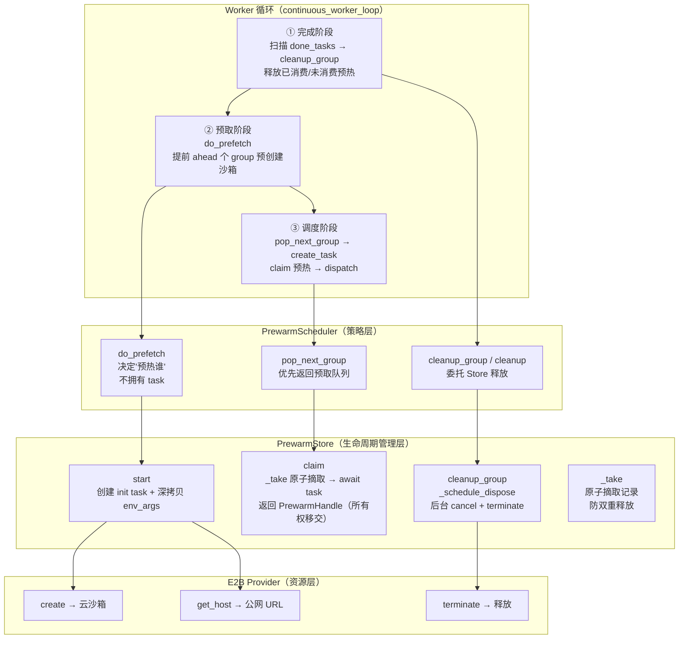

# Prewarm 调度器 — 沙箱预热

> **一句话定位**：预热调度器是 Dressage **推理 / 沙箱侧**的核心机制，位于异步 rollout worker 循环与 E2B 云沙箱之间的预创建层——通过提前 N 个 group 预创建 E2B 云沙箱（含健康检查），消除秒级冷启动延迟对异步 rollout 吞吐的拖累；通过 Scheduler + Store 两层架构与所有权交接模型管理预热资源的生命周期。

---

## 一、问题背景与动机

### 传统做法的痛点

E2B 云沙箱冷启动是秒级延迟：创建云容器 → 等待就绪 → 获取公网 URL → 健康检查。异步 rollout 中每次 dispatch 新 group 都同步等待这个冷启动，直接增加端到端 rollout 延迟。

冷启动全链路：
1. 创建 E2B 云沙箱（`AsyncSandbox.create(template=..., timeout=..., metadata=..., envs=...)`）
2. 获取公网 URL（`sandbox.get_host(port=31000)`）
3. 健康检查（`BlackboxServerClient.health(endpoint)` 等 blackbox 服务就绪）
4. 构造 SandboxState（封装 sandbox_url / sandbox_id / lease 信息）

### 为什么本地 bwrap 不需要预热

本地 bubblewrap 沙箱由 Ray 池管理，`acquire` 是本地操作（`FakeBwrapManager.acquire` 立即返回 lease），冷启动可忽略。`prewarm_enabled()`（`config.py` L11-15）在 `provider != "e2b"` 时直接返回 False。预热仅对 E2B 启用。

---

## 二、整体设计框架与思路

### 两层架构：Scheduler + Store



### 核心设计原则

1. **策略与机制分离**：Scheduler 只决定"预热谁"（策略），Store 拥有所有未消费的 init task（机制）。Worker 停机时 Scheduler 无需管理 task。
2. **所有权交接模型**：预热资源有明确的所有权生命周期——Store 拥有 → dispatch `claim` → 所有权转移给 dispatch → dispatch 全权负责 `terminate`。
3. **前瞻窗口而非固定池**：容量由 `ahead`（默认 8 个 group）控制，淘汰由 group 生命周期驱动（完成即释放），不是 LRU / TTL。

### Worker 循环三阶段

以 `fully_async_rollout.py` L332-393 为例（`partial_async_rollout.py` L270-340 结构相同）：

```
while running:
  ① 完成阶段：扫描 done_tasks → put_completed → cleanup_group(group_id)
  ② 预取阶段：do_prefetch(data_buffer)  # 提前 ahead 个 group 预创建沙箱
  ③ 调度阶段：while active < max_active: pop_next_group → create_task(_run_group)
  await asyncio.sleep(0.01)
finally:
  cancel active → cleanup_group each → cleanup() → drain_lifecycle_tasks()
```

---

## 三、核心实现详解

### 3.1 `do_prefetch`

- **代码定位**：[scheduler.py L50-88](file:///Users/whisper/Desktop/Dressage/dressage/rollout/prewarm/scheduler.py#L50-L88)
- **输入参数**：`data_buffer`（待采样队列，有 `get_samples(n)` 方法）
- **输出**：无（填充预取队列 + 启动预热 task，副作用）
- **核心逻辑**：
  1. 检查 `enabled`（仅 E2B provider 时 True，L52-53）
  2. **背压检查**：`pending_lifecycle_task_count() > 0` 时暂停预取——如果有未完成的沙箱销毁 task（远程 terminate RPC 慢），不再创建新预热，避免"正在销毁的付费沙箱堆积"的资源风暴（L54-62）
  3. while 预取队列 < `ahead`：`data_buffer.get_samples(1)` 取一个 group → 分配 group_id → 入队 → `_prefetch_and_prewarm` 启动预热（L63-88）
  4. 预热失败（paddock 不可用 / start 返回 None）不中断——group 仍在队列中，dispatch 时 fallback 冷启动（L75-81）

```python
# 背压机制（L54-62）
cleanup_backlog = pending_lifecycle_task_count()
if cleanup_backlog:
    # 不让慢速远程销毁积累无上限的付费沙箱
    return

# 预取循环（L63-88）
while len(self._prefetched_groups) < self.ahead:
    groups = data_buffer.get_samples(1)
    if not groups:
        break
    group = groups[0]
    group_id = self.allocate_group_id()
    self._prefetched_groups.append((group_id, group))
    try:
        started = self._prefetch_and_prewarm(group, group_id)
    except Exception:
        continue  # 预热失败不中断，dispatch 时 fallback
```

### 3.2 `start`

- **代码定位**：[store.py L66-101](file:///Users/whisper/Desktop/Dressage/dressage/rollout/prewarm/store.py#L66-L101)
- **输入参数**：`sample`（含 session_id）、`group_id`、`paddock`、`env_args`
- **输出**：`session_id`（成功）或 `None`（重复 session）
- **核心逻辑**：
  1. `ensure_blackbox_session_id(sample)`——生成 `bbs-` 前缀的 session_id（L75，`store.py` L22-31）
  2. 重复 session 拒绝（L76-77）
  3. **深拷贝 env_args**（`owned_env_args = copy.deepcopy(env_args)`，L80）——防调用方后续修改影响预热快照
  4. 创建 `asyncio.Task` 执行 `paddock.init(session_id, env_type, owned_env_args)`（L82-87）
  5. 存入 `_records`（session_id → record）+ `_group_sessions`（group_id → session_ids）（L88-95）

```python
# 深拷贝快照 + 异步 init（L80-95）
owned_env_args = copy.deepcopy(env_args)  # 防调用方修改

async def _initialize() -> Any:
    return await maybe_await(
        paddock.init(session_id, env_type, owned_env_args)
    )

task = asyncio.create_task(_initialize(), name=f"prewarm:{session_id}")
self._records[session_id] = _PrewarmRecord(
    session_id=session_id, group_id=group_id,
    paddock=paddock, env_args=owned_env_args, task=task,
)
self._group_sessions.setdefault(group_id, set()).add(session_id)
```

**预热到底预做了什么**——追踪 `start` → `paddock.init` → `provider.create` 的完整调用链：
1. **创建 E2B 云沙箱**（`provider.py` L95-109）：调用 `AsyncSandbox.create(template=..., timeout=..., metadata=..., envs=...)`，按预构建模板启动远程容器，注入 blackbox 服务环境变量（`BBS_HOST`、`BBS_PORT=31000`、`BBS_RUNTIME_ROOT` 等）
2. **获取公网 URL**（`provider.py` L153-159, L184-197）：调用 `sandbox.get_host(port=31000)`，构造公网端点
3. **健康检查**（`paddock.py` L115-116）：`BlackboxServerClient.health(endpoint)` 等 blackbox 服务就绪
4. **构造 SandboxState**（`paddock.py` L117-130）：封装 `sandbox_url`、`sandbox_id`、原始 lease 信息

**注意**：预热只做到 `paddock.init`（创建沙箱 + 获取 URL + 健康检查），**不包含** `register_agent`。`register_agent` 在 dispatch 的 `claim` 之后才执行（`blackbox_dispatch.py` L154-165），因为 Agent 注册需要 prompt-specific 的上下文（router_url、blackbox_type、backend_options），而沙箱创建只依赖 env_args。

### 3.3 `claim`（所有权交接核心）

- **代码定位**：[store.py L103-129](file:///Users/whisper/Desktop/Dressage/dressage/rollout/prewarm/store.py#L103-L129)
- **输入参数**：`session_id`
- **输出**：`PrewarmHandle`（成功）或 `None`（不存在 / init 失败）
- **核心逻辑**：
  1. `_take(session_id)`——**原子摘取**：从 `_records` pop 记录 + 从 `_group_sessions` discard（L174-183）。这一步是"所有权转移"的原子点——pop 后 Store 不再拥有该 task
  2. `await record.task`——等待 init 完成（可能已完成，也可能还在进行）
  3. init 失败（非 CancelledError）→ 返回 `None`，dispatch fallback 冷启动（L115-122）
  4. CancelledError → `_schedule_dispose(record)` 清理后 re-raise（L112-114）
  5. 成功 → 返回 `PrewarmHandle(session_id, group_id, paddock, state, env_args)`（L123-129），所有权正式移交给 dispatch

```python
# 所有权交接（L107-129）
record = self._take(session_id)  # ← 原子摘取，Store 不再拥有
if record is None:
    return None
try:
    state = await record.task  # 等待 init 完成
except asyncio.CancelledError:
    self._schedule_dispose(record)
    raise
except Exception:
    return None  # fallback 冷启动
return PrewarmHandle(
    session_id=record.session_id, group_id=record.group_id,
    paddock=record.paddock, state=state,
    env_args=copy.deepcopy(record.env_args),  # 再次深拷贝
)
```

### 3.4 `cleanup_group` / `_dispose`

- **代码定位**：[store.py L131-146](file:///Users/whisper/Desktop/Dressage/dressage/rollout/prewarm/store.py#L131-L146)（cleanup_group）+ [L159-172](file:///Users/whisper/Desktop/Dressage/dressage/rollout/prewarm/store.py#L159-L172)（_dispose）
- **输入参数**：`group_id`（cleanup_group）/ `_PrewarmRecord`（_dispose）
- **输出**：无（异步释放）
- **核心逻辑**：
  - `cleanup_group`：摘取该 group 所有未 claim 的记录 → `_schedule_cleanup_records` → 后台 cancel task + terminate paddock（L131-139）
  - `_dispose`：如果 init task 未完成则 cancel → `await gather(task, return_exceptions=True)` → `terminate_paddock_best_effort` 释放沙箱 → 注册到 lifecycle task tracker 保证停机时 drain（L159-172）

### 3.5 `_take`（原子摘取）

- **代码定位**：[store.py L174-183](file:///Users/whisper/Desktop/Dressage/dressage/rollout/prewarm/store.py#L174-L183)
- **输入**：`session_id`
- **输出**：`_PrewarmRecord | None`
- **核心逻辑**：从 `_records` pop 记录 + 从 `_group_sessions` discard session_id。如果该 group 的 session set 变空则 pop group_id。这一步是同步操作，是所有权转移的原子点。

```python
def _take(self, session_id: str) -> _PrewarmRecord | None:
    record = self._records.pop(session_id, None)  # ← Store 不再拥有
    if record is None:
        return None
    sessions = self._group_sessions.get(record.group_id)
    if sessions is not None:
        sessions.discard(session_id)  # ← group 级清理不会误删已 claim 的
        if not sessions:
            self._group_sessions.pop(record.group_id, None)
    return record
```

---

## 四、独特的小设计细节（面试金句）

### 1. Scheduler 不拥有 task——策略与机制分离

> **金句**：`PrewarmScheduler` 只决定"预热谁"（策略层），`PrewarmStore` 拥有所有未消费的 init task（生命周期管理层）——Worker 停机时 Scheduler 无需管理 task，`cleanup()` 只清空预取队列 + 委托 `cleanup_all()` 给 Store。

展开：这是经典的"策略与机制分离"设计。Scheduler 的 `cleanup()`（scheduler.py L143-146）只做两件事：`self._prefetched_groups.clear()` + `await cleanup_all()`。所有 init task 的 cancel 和沙箱 terminate 都由 Store 的 `_dispose` 处理。这让 Scheduler 的逻辑极其简单，不会因为 task 生命周期管理而引入 bug。

### 2. 所有权交接防双重释放——`_take` 原子摘取

> **金句**：`claim` 通过 `_take` 原子摘取记录——pop 后 Store 不再拥有该 task，dispatch 全权负责后续 `terminate`，避免了"Store 和 dispatch 都尝试 terminate 同一个沙箱"的双重释放。

展开：`_take`（store.py L174-183）同时从 `_records` pop 和 `_group_sessions` discard——这一步是同步的，是所有权转移的原子点。pop 后 Store 不再持有该 record，后续 `cleanup_group` 不会找到它，不会重复 terminate。如果不摘取，Store 和 dispatch 都可能调 `terminate` → E2B API 返回 `missing` 错误或更糟的竞态。

### 3. Fallback 冷启动保证正确性优先

> **金句**：预热失败（E2B 限流、init 异常）不影响正确性——dispatch 时 `claim` 返回 `None`，fallback 到同步 `paddock.init()` 冷启动，性能降级但不丢数据。

展开：`blackbox_dispatch.py` L134-153 的 fallback 路径：`handle is None` 时重新生成 session_id（`sample.session_id = None` → `ensure_blackbox_session_id`）→ 同步 `paddock.init()` 冷启动。正确性不受影响，只是慢。测试 `test_prefetch_failure_keeps_group_and_continues_lookahead` 验证预热失败后 group 仍在队列、dispatch 仍能进行。

### 4. 背压机制防资源风暴——pending_lifecycle_task_count

> **金句**：预取前检查 `pending_lifecycle_task_count()`——如果有未完成的沙箱销毁 task（远程 terminate RPC 慢），暂停预取，防止"新预热不断创建付费沙箱、旧沙箱销毁堆积"的资源风暴。

展开：`do_prefetch`（scheduler.py L54-62）在预取循环前检查 `pending_lifecycle_task_count()`。沙箱销毁是异步后台 task（`_schedule_dispose` → `track_lifecycle_task`），远程 E2B terminate RPC 可能慢。如果不背压，新预热不断创建付费沙箱，旧沙箱销毁堆积 → 账单爆炸。测试 `test_cleanup_backlog_pauses_new_prewarms_without_consuming_buffer` 验证。

### 5. group 级生命周期管理——非 LRU/TTL

> **金句**：预热池的淘汰不是 LRU 或 TTL，而是"前瞻窗口 + group 级完成即释放"——group 完成后 `cleanup_group` 释放该 group 所有未消费预热，容量由 `ahead` 控制前瞻窗口。

展开：传统连接池用固定池大小 + LRU/TTL 淘汰，但预热场景不同——每个 group 的预热在 dispatch claim 时所有权转移，未消费的在 group 结束时自动清理（`continuous_worker_loop` L356 `cleanup_group`）。`ahead=8` 是"前瞻 8 个 group"而非"固定 8 个沙箱池"。这种设计与 rollout 的 group 语义天然匹配。

### 6. lifecycle task 强引用防 GC

> **金句**：预热清理 task 通过 `track_lifecycle_task` 注册到全局 `_LIFECYCLE_TASKS` 字典（按 event loop 分组），用 `add_done_callback` 自动清理——保证后台清理 task 不会被 asyncio GC 回收，停机时 `drain_lifecycle_tasks` 等待所有清理完成。

展开：asyncio 的 task 如果没有强引用，会被 event loop GC 回收（task 静默消失，不执行完成逻辑）。`track_lifecycle_task`（lifecycle.py L149-154）把 task 加入 `_LIFECYCLE_TASKS[loop]` set，`add_done_callback(_discard_lifecycle_task)` 在完成时自动 discard。停机时 `drain_lifecycle_tasks`（L191-196）循环 `await gather(*tasks)` 等待所有清理完成——包括 drain 期间新产生的 task。

### 7. caller 取消不泄漏云沙箱——asyncio.shield

> **金句**：E2B create 被取消后，远程可能仍在创建沙箱——`paddock.init` 用 `asyncio.shield(create_task)` + `terminate_when_provider_create_finishes` 接管被取消的 create task，等它产出 lease 后再 terminate，这是"asyncio 取消语义下不泄漏云资源"的工程巧思。

展开：`terminate_when_provider_create_finishes`（lifecycle.py L115-146）用 `while True: try: lease = await asyncio.shield(create_task)` 循环——即使 caller 反复取消，只要 create task 未真正完成（`create_task.cancelled()` 为 False），就继续等待 lease 产出。产出后调 `terminate_provider_lease_best_effort` 释放。重复取消也能存活（测试 `test_paddock_create_cleanup_survives_repeated_caller_cancellation`、`test_e2b_create_cleanup_survives_repeated_cancellation`）。

### 8. env_args 深拷贝快照

> **金句**：`start` 时 `copy.deepcopy(env_args)`，防调用方后续修改影响预热快照；`claim` 返回的 `PrewarmHandle.env_args` 也再次深拷贝——预热快照与 dispatch 使用完全隔离。

展开：`start`（store.py L80）和 `claim`（L128）都做深拷贝。测试 `test_start_snapshots_env_args_and_rejects_duplicate_session` 验证调用方修改 `env_args["nested"]["value"]` 不影响已存储的快照。这在异步场景下至关重要——预热 init task 在后台执行，调用方可能在 init 完成前修改 env_args。

---

## 五、达到的效果

### 效果指标

| 指标 | 无预热 | 有预热 | 改善 |
|------|--------|--------|------|
| 每 group 沙箱冷启动等待 | 约 3-8 秒 | 近零等待（claim 时 init task 已完成） | E2B 冷启动完全隐藏在前 group 执行期间 |
| 端到端 rollout 延迟 | 基准 | 约降低 5-10% | 冷启动占比取决于 rollout 总延迟（典型 60-120s） |
| 前瞻窗口 | 0 | ahead=8 个 group | 提前 8 个 group 预创建沙箱，与当前 group 执行重叠 |
| 预热失败后 fallback | — | 冷启动同步等待 | 正确性不受影响，性能降级 |

> **冷启动可解释性**：E2B 冷启动全链路包括创建云容器（`AsyncSandbox.create`，约 3-5s）→ 获取公网 URL（`get_host`，<1s）→ 健康检查（`BlackboxServerClient.health`，约 1-3s），合计约 3-8 秒。预热将这个延迟藏在前一个 group 执行期间——`do_prefetch` 提前 `ahead=8` 个 group 启动 init task，dispatch 时 `claim` 只需 `await record.task`（若已完成则零等待）。
>
> **端到端延迟占比可解释性**：典型黑盒 Agent rollout 延迟 60-120 秒（分钟级），冷启动 3-8 秒约占 3-13%。预热后冷启动等待基本消除，端到端 rollout 延迟约降低 5-10%。短轨迹场景下冷启动占比更高，预热收益更大。

### 配置与容量

- **默认配置**：`DRESSAGE_SANDBOX_PREWARM_AHEAD=8`（预取 8 个 group），E2B provider 时 `DRESSAGE_SANDBOX_PREWARM` 默认开启（`config.py` L8, L17-19）
- **最大并行 agent 受益**：`max_active_groups × samples_per_group` 个 session 可同时活跃（`fully_async_rollout.py` L336-343 日志输出），预热让这些 session 的沙箱提前就绪
- **terminate 超时**：默认 30 秒（`DRESSAGE_PADDOCK_TERMINATE_TIMEOUT_SEC`，`lifecycle.py` L31），超时后 release 继续在后台执行（不阻塞）

### 测试佐证

| 测试名 | 验证行为 |
|--------|----------|
| `test_e2b_prewarm_claim_transfers_live_lease` | claim 后获得活沙箱（`sandbox_id` / `sandbox_url` 正确），terminate 后 `kill` 被调用 |
| `test_e2b_cleanup_returns_before_create_then_kills_sandbox` | cleanup 在 create 完成前返回（不阻塞），create 完成后后台 kill 沙箱——"清理不等待远程创建" |
| `test_e2b_terminate_is_idempotent_for_the_same_lease` | 重复 terminate 安全（第一次 `terminated=True`，第二次 `missing=True`） |
| `test_paddock_create_cleanup_survives_repeated_caller_cancellation` | caller 反复取消不泄漏沙箱——`asyncio.shield` + `terminate_when_provider_create_finishes` |
| `test_e2b_create_cleanup_survives_repeated_cancellation` | E2B create 被取消后远程仍创建沙箱，接管后正确 terminate |
| `test_prefetch_failure_keeps_group_and_continues_lookahead` | 预热失败后 group 仍在队列、dispatch 仍能进行——fallback 冷启动保证正确性 |
| `test_cleanup_backlog_pauses_new_prewarms_without_consuming_buffer` | 背压机制——pending 清理 task 时暂停预取，不消耗 buffer |
| `test_start_snapshots_env_args_and_rejects_duplicate_session` | env_args 深拷贝快照 + 重复 session 拒绝 |
| `test_local_bwrap_prewarm_claim_transfers_pool_slot` | 本地 bwrap 的预热走 pool acquire/release 路径（虽然实际不启用预热） |

---

## 六、面试 Q&A

### Q1: 预热与连接池模式的异同？

**A**：

**相似**：都是预创建资源消除冷启动——连接池预建 TCP 连接，预热预建 E2B 云沙箱。

**不同**（4 点）：
1. **淘汰策略**：连接池是固定池 + LRU/TTL；预热是"前瞻窗口 + group 级完成即释放"——group 完成后 `cleanup_group` 释放该 group 所有未消费预热
2. **所有权模型**：连接池是 borrow/return（用完还回去）；预热是 claim 后所有权永久转移给 dispatch，dispatch 全权负责 terminate（不归还）
3. **背压机制**：连接池无背压；预热检查 `pending_lifecycle_task_count` 暂停预取，防资源风暴
4. **资源类型**：连接池是本地 TCP；预热是远程云沙箱（terminate 是慢 RPC，需要 asyncio.shield + lifecycle task 管理）

---

### Q2: 预热失败如何 fallback？

**A**：预热失败（E2B 限流、init 异常、paddock 不可用）不影响正确性。`do_prefetch`（scheduler.py L75-81）捕获异常后 `continue`——group 仍在预取队列中。dispatch 时 `claim_prewarm(session_id)` 返回 `None`（store.py L115-122 的 init 失败路径），fallback 到 `blackbox_dispatch.py` L134-153 的同步冷启动路径：

1. 重新生成 session_id（`sample.session_id = None` → `ensure_blackbox_session_id`）
2. 同步 `paddock.init(session_id, env_type, env_args)` 冷启动
3. 正常执行后续 `register_agent`

正确性不变，只是性能降级（多了秒级冷启动等待）。测试 `test_prefetch_failure_keeps_group_and_continues_lookahead` 验证。

---

### Q3: 如何防止预热过多导致资源浪费？

**A**：三重防护：

1. **`ahead` 限制前瞻窗口**：默认 8 个 group，预取队列不会超过这个数量（`do_prefetch` 的 while 循环条件 `len(self._prefetched_groups) < self.ahead`）
2. **`pending_lifecycle_task_count` 背压暂停**：如果有未完成的沙箱销毁 task（远程 terminate RPC 慢），暂停预取——防止"正在销毁的付费沙箱堆积"的资源风暴（scheduler.py L54-62）
3. **group 完成即 `cleanup_group` 释放**：worker 循环的完成阶段（`fully_async_rollout.py` L356）调 `cleanup_group(group_id)`，释放该 group 所有未 claim 的预热——未消费的沙箱不会滞留

---

### Q4: 为什么本地 bwrap 不需要预热？

**A**：本地 bubblewrap 沙箱由 Ray 池管理，`acquire` 是本地操作（`FakeBwrapManager.acquire` 立即返回 lease），冷启动可忽略。`prewarm_enabled()`（config.py L11-15）在 `provider != "e2b"` 时直接返回 False：

```python
def prewarm_enabled() -> bool:
    provider = os.environ.get("DRESSAGE_SANDBOX_PROVIDER", "").strip().lower()
    if provider != "e2b":
        return False  # 本地 bwrap 不启用
    ...
```

预热的本质是消除远程云资源的冷启动延迟，本地操作没有这个延迟。

---

### Q5: 预热到底预做了什么？为什么不在预热阶段就注册 Agent？

**A**：预热执行 `paddock.init`，具体做四件事：
1. 创建 E2B 云沙箱（`AsyncSandbox.create`，按预构建模板启动容器 + 注入 blackbox 服务环境变量）
2. 获取公网 URL（`sandbox.get_host(port=31000)`）
3. 健康检查（`BlackboxServerClient.health(endpoint)` 等 blackbox 服务就绪）
4. 构造 SandboxState（封装 sandbox_url / sandbox_id / lease 信息）

**不在预热阶段注册 Agent 的原因**：`register_agent` 需要 prompt-specific 的上下文（router_url、blackbox_type、backend_options），而沙箱创建只依赖 env_args（环境变量级别的配置）。预热提前创建沙箱可以在 group 尚未被 dispatch 时就消除冷启动延迟，但 Agent 注册必须等 dispatch 拿到具体 prompt 后才能执行（`blackbox_dispatch.py` L154-165）。

---

### Q6: 所有权交接模型如何防止双重释放？

**A**：通过 `_take` 原子摘取实现。`claim`（store.py L107）调 `_take(session_id)`——这一步是同步操作，从 `_records` pop 记录 + 从 `_group_sessions` discard session_id。pop 后 Store 不再持有该 record：

- 后续 `cleanup_group` 在 `_group_sessions` 中找不到该 session_id → 不会重复 terminate
- dispatch 全权负责后续 `terminate`（`blackbox_dispatch.py` 的 finally 块调 `schedule_terminate_paddock`）

如果不摘取而是直接读取，Store 的 `cleanup_group` 和 dispatch 的 `terminate` 可能并发执行 → E2B API 返回 `missing` 错误或更糟的竞态。`_take` 保证了所有权的唯一性转移。

---

### Q7: caller 取消 E2B create 后，远程可能还在创建沙箱，如何不泄漏？

**A**：通过 `asyncio.shield` + `terminate_when_provider_create_finishes`（lifecycle.py L115-146）。

`paddock.init` 在 create 被取消后，不直接放弃 create task，而是用 `terminate_when_provider_create_finishes` 接管它：

```python
async def terminate_when_provider_create_finishes(provider, create_task, ...):
    while True:
        try:
            lease = await asyncio.shield(create_task)  # 等 lease 产出
            break
        except asyncio.CancelledError:
            if create_task.cancelled():
                return  # create 真正取消，无 lease 需清理
        except Exception:
            return  # create 失败，无 lease 需清理
    await terminate_provider_lease_best_effort(provider, lease, ...)  # 有了 lease 再 terminate
```

即使 caller 反复取消，只要 `create_task.cancelled()` 为 False，就继续 `asyncio.shield` 等待 lease 产出。产出后再 terminate。这保证了"asyncio 取消语义下不泄漏云资源"——因为 E2B 的 create RPC 被取消后，服务端可能仍在创建沙箱（lease 已经或即将产出），直接放弃会导致孤儿沙箱。测试 `test_paddock_create_cleanup_survives_repeated_caller_cancellation` 和 `test_e2b_create_cleanup_survives_repeated_cancellation` 验证。

---

## 七、与其他技术点的协作关系

### 与 Partial / Fully Async Worker 的协作

预热调度器内嵌在 `continuous_worker_loop` 中（`fully_async_rollout.py` L332-393 / `partial_async_rollout.py` L270-340），每轮循环调用三阶段：`cleanup_group` → `do_prefetch` → `pop_next_group`。停机时 `cleanup()` + `drain_lifecycle_tasks()` 等待所有后台清理完成。预热是异步 rollout 吞吐提升的核心组件——没有它，每次 dispatch 新 group 都同步等待秒级 E2B 冷启动。

### 与 Paddock 的协作

预热实际执行 paddock 的 `init`（创建沙箱 + 健康检查 + 构造 SandboxState），claim 后 dispatch 调 paddock 的 `register_agent`（注册 Agent 进程）。paddock 是预热与 E2B provider 之间的抽象层——本地 bwrap paddock 走 Ray 池 acquire/release，E2B paddock 走 `AsyncSandbox.create/terminate`。

### 与 E2B Provider 的协作

预热的具体资源对象是 E2B 云沙箱。`E2BSandboxProvider.create`（`provider.py` L53-169）执行 `AsyncSandbox.create` + `get_host`，`terminate` 执行 `sandbox.kill`。预热的背压机制和 lifecycle task 管理正是为了应对 E2B 远程 RPC 的慢速和不可靠性。

### 与 Lifecycle Task Tracker 的协作

预热清理 task 通过 `track_lifecycle_task`（`lifecycle.py` L149-154）注册到全局 `_LIFECYCLE_TASKS` 字典，保证后台 task 不被 asyncio GC 回收。`pending_lifecycle_task_count`（L157-163）供 Scheduler 背压检查。停机时 `drain_lifecycle_tasks`（L191-196）等待所有清理完成。
