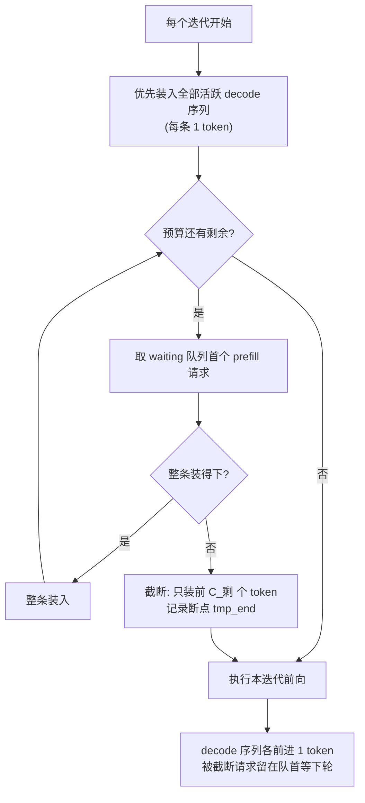

**TECHNICAL REFERENCE · 2026**

# Chunked Prefill 详解：从队头阻塞到 Stall-Free 调度

*Head-of-Line Blocking → Sarathi → Stall-Free Batching → Mixed Chunk → 与 PD 分离的组合*

**面向教学的完整推导 · 调度机制 · 代价分析 · 取值方法论**

**适用读者**

希望深入理解大模型推理调度中 chunked prefill（分块预填充）的研究人员与工程师。阅读本文只需要 Transformer 推理与 continuous batching 的基础常识。

版本基线：2026 年 9 月

姊妹篇：[PD 分离详解](./pd-disaggregation.md)（把 prefill/decode 拆到两组 GPU 的空间维度解法；本文是时间维度解法，两文互为正交坐标）。

---

## 执行摘要

> **一句话结论**　Chunked prefill 把一个长 prompt 的 prefill 切成多个 token 块、分多个迭代算完，每个迭代按固定的 **token 预算**与 decode 请求混编。它把"一个超长 prefill 独占 GPU 几百毫秒、全体 decode 集体卡顿"的队头阻塞，摊薄成"每迭代最多卡顿一个预算对应的时间"。代价是每个 chunk 都要付出一次完整前向的固定开销（权重重读、kernel 启动），块太小时 prefill 吞吐会掉。现代引擎（vLLM V1、SGLang、TRT-LLM）里它已是默认甚至不可关闭的行为；在 PD 分离架构中它的角色从"保护 decode 时延"迁移为"P 实例内部的排队公平、显存峰值与 KV 传输粒度控制"。

| 维度 | 不切（整段 prefill） | chunked prefill（预算 $C$） |
| --- | --- | --- |
| 单请求 prefill 时延 | 最短 | 拉长为约 $\lceil N/C \rceil$ 个迭代 |
| 同 batch decode 的卡顿 | 一次卡顿 $O(N)$ 时长 | 每次最多卡顿 $O(C)$ 时长 |
| prefill 吞吐 | 最高 | $C \gtrsim 4\text{k}$ 时近似无损，$C$ 太小显著下降 |
| 显存峰值（激活） | 随 $N$ 线性 | 封顶于 $C$ 对应水平 |
| 适用 | 离线批推、无在线 SLO | 在线服务、长短 prompt 混跑 |

### 阅读导航

| 章节 | 主题 | 教学问题 |
| --- | --- | --- |
| 01 | 问题的定量刻画 | 一个长 prefill 到底能让 decode 卡多久？ |
| 02 | Sarathi 谱系 | token 预算调度怎么工作？stall-free 的精确定义是什么？ |
| 03 | 混合批次 | prefill 块和 decode 为什么应该放进同一个迭代？ |
| 04 | 代价分析 | 切分到底亏在哪？为什么 $C \ge 4\text{k}$ 几乎不亏？ |
| 05 | 框架实现对照 | vLLM / SGLang / TRT-LLM 各自的开关形态 |
| 06 | 与 PD 分离的组合 | 拆家之后，chunked prefill 还剩哪些收益？ |
| 07 | 取值 SOP 与总结 | 给定业务，怎么把 $C$ 调到位？ |

---

## 1. 问题的定量刻画：队头阻塞有多疼

continuous batching 的调度器每个迭代组一个 batch 做一次前向。当 batch 里既有正在 decode 的序列、又插进一条长 prompt 的 prefill 时，这个迭代的时间被 prefill 主导。用一组具体数字（Llama-3-70B、8×H100、TP=8，推导过程见姊妹篇第 6 章）：

- 纯 decode 一步（$B = 128$、平均上下文 2K）：约 $10$ ms；
- 插入一条 $N = 8000$ 的整段 prefill（MFU 取 $45\%$）：

$$
T_{\text{prefill}} \approx \frac{2 P N}{G \cdot C \cdot \eta} = \frac{2 \times 70 \times 10^{9} \times 8000}{8 \times 989 \times 10^{12} \times 0.45} \approx 315 \quad \text{ms}
$$

这一个迭代，batch 里全部 128 条在线序列的输出都停了 $315$ ms——相当于约 $30$ 步 decode 被集体推迟。更糟的是 **P99 TPOT 由最坏一次插入决定**：只要流量里存在超长 prompt，无论你 decode 本身多快，尾部时延都被 prefill 锁死。这就是 head-of-line blocking（HOL）：一条长请求堵住了它身后（其实是同 batch 的）所有人。

两条朴素对策都不解决问题：

- **prompt 排队、等 decode 空隙再整段插入**：TTFT 爆炸，长 prompt 可能永远等不到空隙；
- **限制 prompt 长度**：产品形态不允许。

于是需要一个**时间维度**的解法：把大 prefill 拆小，让它分批占用迭代。

## 2. Sarathi 谱系：token 预算与 stall-free 调度

### 2.1 核心机制：把"请求数"预算改成"token 数"预算

传统调度器的迭代预算是请求数（max num seqs）；chunked prefill 的预算是 **token 数** $C$（vLLM 叫 `max_num_batched_tokens`，SGLang 叫 `chunked_prefill_size`）。每个迭代：

1. 先把所有活跃 decode 序列放进 batch（每条贡献 1 个 token）；
2. 用剩余预算装 prefill：新请求的 prompt 按序填入，**填不下的请求只装前 $C_{rem}$ 个 token**，记录断点，剩余部分后续迭代继续。

一条长度为 $N$ 的 prompt 被切成 $k = \lceil N / C \rceil$ 个 chunk，跨 $k$ 个迭代完成。由于每个 chunk 都是一次完整前向的一部分（带全部前缀的 KV），断点续算在数学上与整段 prefill 严格等价——注意力总计算量 $O(N^2)$ 不变，变的只是"什么时候算"。

### 2.2 Stall-free 的精确定义

Sarathi-Serve（OSDI 2024）的关键性质是 **stall-free**：任一 decode 序列的相邻两个 token 之间的间隔，上界为"一个装满预算的迭代时长"，即约

$$
T_{\text{stall}} \le \frac{2 P \cdot C}{G \cdot C_{peak} \cdot \eta} + T_{\text{decode}}
$$

也就是说卡顿上界只由预算 $C$ 决定，**与 prompt 有多长完全无关**——$N = 8\text{K}$ 还是 $N = 1\text{M}$，decode 侧感受到的每一次停顿都一样大。这把 P99 TPOT 从"取决于流量里最坏的 prompt"变成"取决于一个可调的常数"，是该机制的全部价值所在。

Sarathi-Serve 论文里有一个常被忽略的对照实验：只做"把整段 prefill 和 decode 混批"（不切块）只能拿到约一半的时延收益——**收益的大头来自切块本身**（把卡顿粒度做小），而不是混批。

### 2.3 谱系定位

| 工作 | 贡献 | 局限 |
| --- | --- | --- |
| Sarathi（2023） | 首提 chunked prefill + piggyback（把 decode 塞进 prefill batch） | 调度仍可能让 decode 等一个完整 chunk |
| **Sarathi-Serve**（OSDI 2024） | token 预算 + decode 优先 + stall-free 调度 | 切块引入固定开销，$C$ 需要调 |
| 后续各引擎 | 与 prefix cache、CUDA Graph、PD 传输等机制组合 | 见第 5、6 章 |

## 3. 混合批次：为什么要混编而不轮流

切块之后还有一个选择：prefill chunk 和 decode 是**轮流占迭代**（奇数迭代算 prefill、偶数迭代算 decode），还是**混编进同一迭代**？现代引擎全部选择混编，原因是算术强度的互补性：

- decode 部分带宽饱和、算力空闲；
- prefill chunk 部分算力饱和、带宽相对富余；
- 同一迭代里先算 prefill chunk 再算 decode（或在 kernel 层融合），两份资源被**同一次权重读取**服务——权重只从 HBM 搬一遍，compute-bound 的 prefill 和 bandwidth-bound 的 decode 各取所需。

这就是 piggyback 的本质：**把 decode 搭在 prefill 的权重读取便车上**。混编比轮流的吞吐优势在长 prompt 高并发下可达两位数百分点。

代价是 kernel 层面的复杂度：混合 batch 里不同序列的 q 长度不同（decode 为 1、prefill chunk 为几百到几千），需要支持 varlen 的 attention kernel（FlashAttention/FlashInfer 的 ragged 接口），以及调度器对两类请求的记账。

## 4. 代价分析：切分到底亏在哪

切块不是免费的，但代价的构成与常见直觉不同。逐项拆开：

**（1）注意力总量不变。** $O(N^2)$ 的前缀扫描在 flash-style tiling 下本来就分块进行，chunk 化只增加常数项，不增加量级。

**（2）每 chunk 一次完整前向的固定开销 × $k$。** 每个 chunk 都要重新读一遍全部权重：$k = \lceil N/C \rceil$ 次 vs 整段的 1 次。定量看这项其实很小——70B/BF16 在 TP=8 下每卡读 $17.5$ GB 权重、HBM 约 $3.35$ TB/s，读一遍约 $5$ ms；$N = 100\text{K}$、$C = 8\text{K}$ 时 $k = 13$，多出来的权重读约 $60$ ms，相对约 $4$ s 的总 prefill 时长可忽略。

**（3）真正的主因：GEMM 的 M 维塌缩。** chunk 小意味着每次前向的 token 数（GEMM 的 $M$ 维）小。GPU 的 GEMM 在 $M$ 达到几千之后才能吃满算力；$M$ 只有几百时 MFU 会从 $40\%+$ 掉到一半以下。经验规律：**$C \gtrsim 4\text{k}\sim8\text{k}$ token 时切块几乎无吞吐代价；$C \lt 1\text{k}$ 时 prefill 吞吐明显下降**。这条规律决定了 $C$ 的下界。

**（4）单请求时延被拉长。** 一条 $N$ 的 prompt 从"一次算完"变成"$\lceil N/C \rceil$ 个迭代且中间让位给 decode"，其自身 TTFT 变差。stall-free 保的是**其他请求**的时延，不是被切者本人的——这是切块机制的再分配本质：拿长 prompt 自己的 TTFT，换全体 decode 的 TPOT 平稳。

**（5）调度与记账复杂度。** 断点续算需要请求级的断点状态（已算到哪、对应哪些 KV 页），并与 KV page 对齐；与 prefix cache 组合时还要处理"chunk 边界落在缓存命中区中间"的情况。

---

## 5. 框架实现对照

| 框架 | 开关 | 预算参数 | 形态与备注 |
| --- | --- | --- | --- |
| vLLM V0 | `--enable-chunked-prefill` | `max_num_batched_tokens`，另有 `long_prefill_token_threshold` 限单请求单步 | 后期 V0 对长 prompt 默认开启 |
| **vLLM V1** | 无开关，**恒开不可关** | `max_num_batched_tokens` | decode 优先入批，prefill 自动切块；社区已确认无法禁用 |
| SGLang | `--chunked-prefill-size`（`-1` 关闭） | 同上参数本身即预算 | 另配 `max_prefill_tokens`；与 PD 的 KV 分片传输共用 chunk 边界 |
| TensorRT-LLM | `enable_chunked_prefill`（context chunking） | `max_num_tokens` | 新版默认开启；PD 下仅 context 侧有意义 |

三个值得记住的差异：

1. **vLLM 把旋钮消灭了**：V1 认为"预算内 decode 优先 + 自动切块"是严格占优策略，连关闭入口都拿掉了——这本身就是对 chunked prefill 价值的最大背书。
2. **SGLang 把旋钮和 PD 传输耦合**：`chunked_prefill_size` 同时决定调度粒度与 KV 流式传输的分片粒度（见第 6 章）。
3. **TRT-LLM 把它限定在 context 相位**：PD 部署里 decode 侧不存在 prefill，chunk 预算只在 context 服务器上有意义。

## 6. 与 PD 分离的组合：收益迁移

PD 分离把 prefill 和 decode 拆到两组 GPU 之后，chunked prefill 的**最大卖点被 PD 本身吃掉了**——decode 在另一批卡上运行，P 实例内部怎么切都干扰不到它。但 chunked prefill 并不因此失效，它在 P 实例内部换了四个新岗位：

**（1）P 实例内部的队头阻塞。** P 实例自己也在跑 continuous batching：多条 prefill 请求并发，一条 100K 的 prompt 不切的话会独占若干迭代，后面排队的短 prompt 的 TTFT 照样爆炸。prompt 长度方差越大，这条收益越明显。

**（2）KV 传输的流式粒度。** SGLang 的实现里，P 实例每算完一个 chunk 就把该段 KV 发往 D 实例（chunk 边界即传输边界），把"P 算完 → 传 KV → D 开算"的串行链压成流水线。chunk 越小，首段 KV 越早到达；但 chunk 过小会让 RDMA 消息碎片化、有效带宽下降——存在一个由网卡与传输引擎决定的最优区间。

**（3）激活显存峰值封顶。** 单迭代的 extend token 数被 $C$ 封顶，激活显存与 MoE all-to-all 缓冲按 $C$ 而不是按最大 prompt 长度分配。超长 prompt（100K+）场景下这不是性能问题而是能不能跑起来的问题。

**（4）中断响应粒度。** abort、权重更新暂停、抢占等控制路径在 chunk 边界生效；切得越细，控制指令的生效延迟越低。

判据也随之改变。聚合引擎里调 $C$ 是在"TPOT 平稳 vs prefill 吞吐"之间权衡；PD 的 P 实例里变成在"P 内排队公平 + 传输流式化 + 显存 vs prefill 吞吐"之间权衡。经验上：

| 情形 | $C$ 的方向 |
| --- | --- |
| P 实例算力饱和（forward 时间主导） | 调大，甚至 $\ge$ 最大 prompt 长度（≈不切），保吞吐 |
| prompt 长度方差大、P 内排队严重 | 中等（$8\text{k}\sim32\text{k}$），让短请求插队 |
| 显存/MoE 缓冲撑不住 | 被迫调小，由显存反推 |
| KV 传输是瓶颈（弱网） | 调大，减少小消息 |
| D 侧是系统瓶颈、P 侧有富余 | 切不切都行，取中等值吃（2）（4）的边际收益 |

离线批推与 RL rollout 场景还要再退一步：没有交互式 SLO，TPOT 抖动不值钱，唯一指标是 e2e 吞吐——此时 $C$ 的取值问题退化为"扫几个候选值实测 step 时长"，理论指导意义有限。

## 7. 取值 SOP 与总结

### 7.1 调参 SOP

1. **定下界**：显存反推。$C$ 必须小到激活峰值放得下；同时 $C \ge 4\text{k}\sim8\text{k}$ 保住 GEMM 效率（第 4 章经验规律）。两者冲突时以显存为准。
2. **定候选**：从 $C \in \{1\text{k}, 4\text{k}, 8\text{k}, 16\text{k}, 32\text{k}, \infty\}$ 中按业务 prompt 长度分布取 $3\sim4$ 个候选。
3. **实测扫描**：固定代表性流量，对每个候选画两条曲线——prefill 吞吐（或 e2e 吞吐）与 P99 TTFT/TPOT。曲线拐点即最优 $C$。
4. **PD 场景加一步**：观察 KV 传输速率随 $C$ 的变化，过小 $C$ 导致传输小消息化时要回调。

### 7.2 速查表

| 问题 | 一句话答案 |
| --- | --- |
| chunked prefill 解决什么 | 长 prefill 独占迭代导致的全体 decode 卡顿（HOL blocking） |
| 不解决什么 | prefill 总算力不足（那是容量问题）；P/D 资源画像冲突（那是 PD 的事） |
| 核心机制 | 每迭代固定 token 预算，decode 优先，prefill 切块续算 |
| stall-free 含义 | TPOT 上界只取决于 $C$，与 prompt 长度无关 |
| 主要代价 | 每 chunk 一次完整前向的固定开销；$C$ 太小 GEMM M 维塌缩掉吞吐 |
| 经验下界 | $C \gtrsim 4\text{k}\sim8\text{k}$ 吞吐近似无损 |
| 与 PD 的关系 | 正交叠加；PD 后角色迁移为 P 内排队/显存/传输粒度控制 |
| 怎么调 | 显存定下界 → 候选扫描 → 吞吐与时延曲线找拐点 |

### 7.3 总结

chunked prefill 是推理调度史上一次典型的"以再分配换平稳"：拿被切的长 prompt 自己的 TTFT，换全体 decode 请求的 TPOT 上界与 prompt 长度解耦。它的数学本质极朴素——注意力总量不变，只是改变了计算的时序分配——但工程上要求调度器、varlen kernel、KV 分页记账、prefix cache 一整条链的配合。在 PD 分离成为标配之后，它没有过时，而是从"时延保护工具"转岗为"P 实例内部的吞吐/显存/传输粒度旋钮"。判断它是否开、开多大，永远回到同一个方法：**固定流量扫参数，画吞吐与时延两条曲线，找拐点**。

---

**参考与延伸阅读**

- Sarathi-Serve: Taming Throughput-Latency Tradeoff in LLM Inference, OSDI 2024, arXiv:2403.02310
- Sarathi: Efficient LLM Inference by Piggybacking Decodes with Chunked Prefills, arXiv:2308.16369
- vLLM Optimization and Tuning 文档；SGLang 超参文档；TensorRT-LLM 性能调优指南
- 姊妹篇：[PD 分离详解](./pd-disaggregation.md)
