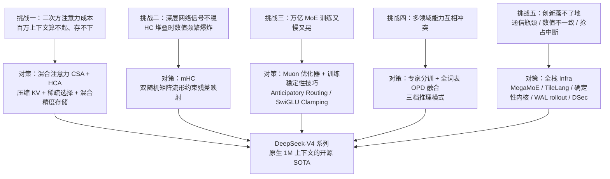
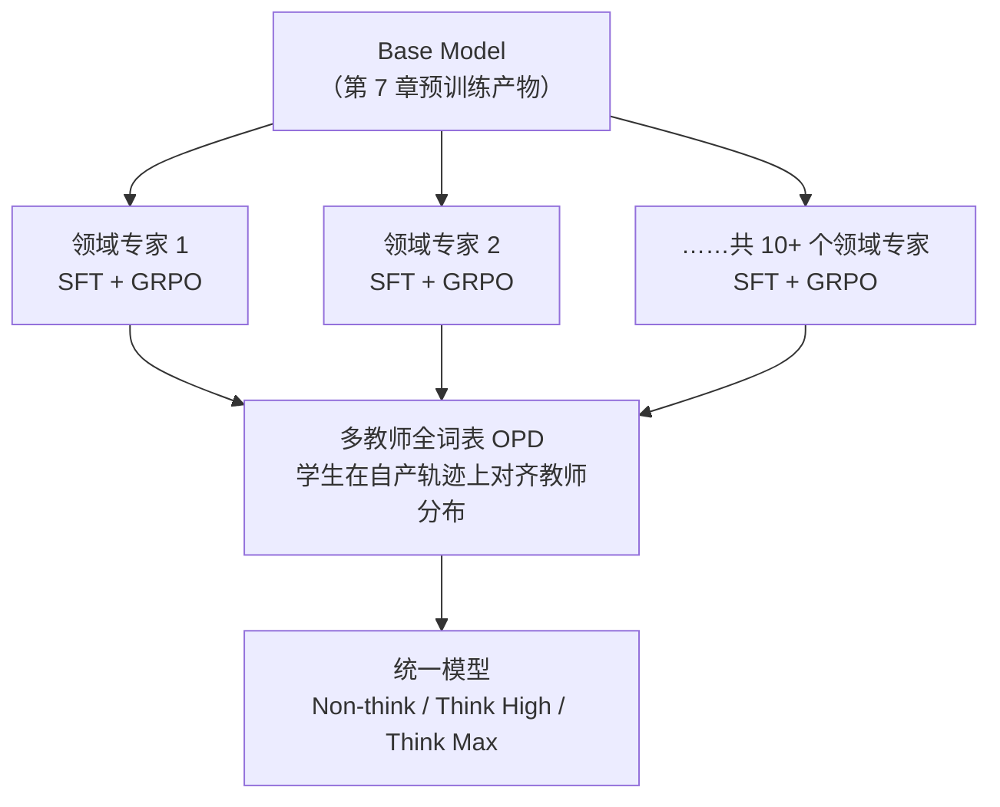

# DeepSeek-V4 技术报告 · 超详细拆解（面向初学者）

> 本文是对 **arXiv:2606.19348v1**《*DeepSeek-V4: Towards Highly Efficient Million-Token Context Intelligence*》（DeepSeek-AI，2026 年发布，preview 版）的逐节精读与拆解。
>
> 目标：让一个初学者也能看懂这份报告——不仅知道 DeepSeek **做了什么**，还知道**为什么这么做**（要解决什么问题）、**怎么做的**（具体机制与公式），以及**每个技术点所依赖的底层技术本身是什么**。
>
> 组织方式（参照同目录 [`kat-coder-v2.md`](kat-coder-v2.md) 的写法）：
> - **第 1 章是"前置知识速成"**：报告默认读者懂 MLA/DSA、MoE、MTP、Muon、GRPO、OPD、量化等技术，本章先用最通俗的方式把这些**底层技术本身**讲清楚，并全部标注为【背景】；
> - **第 2 章起逐节拆解报告原文**，每个技术点按 **"问题 → 直觉 → 机制 → 公式逐符号 → 微型例子 → 意义"** 的顺序展开；
> - 所有论文事实严格忠实于原文；原文没有明说、由我们补充的推断或类比，一律用"（解读）"标注。
>
> 资料来源与交叉验证：正文事实以 arXiv HTML 全文为准；原报告中以图片/表格形式呈现的**模型超参数表**（层数、专家数、压缩率等）参照原报告表格的中文转录（掘金/CSDN 深度解读，与 DeepSeek 官方公众号文章一致）核对补全，个别超出 arXiv 文本的细节（如 FP4→FP8 无损反量化原理、GRM 细节）以"（官方资料补充）"标注。

---

## 0. 三十秒速览（结论先行）

**DeepSeek-V4 是 DeepSeek-AI 的新一代 MoE 大模型系列，核心命题一句话：让百万 token 上下文从"技术上可行"变成"经济上标配"。** 它包含两个模型——旗舰 **DeepSeek-V4-Pro**（1.6T 总参数 / 49B 激活）与高性价比 **DeepSeek-V4-Flash**（284B 总参数 / 13B 激活），两者预训练后**原生支持 1M（一百万）token 上下文**。

| 维度 | 结论 |
|---|---|
| 模型规格 | V4-Pro：1.6T 总参 / 49B 激活，33T tokens 预训练；V4-Flash：284B 总参 / 13B 激活，32T tokens 预训练；词表 128K，MTP 深度 1 |
| 架构三大创新 | ① **混合注意力 CSA + HCA**：长上下文计算/存储效率的数量级飞跃；② **mHC 流形约束超连接**：把残差映射约束在双随机矩阵流形上，深层训练数值稳定；③ **Muon 优化器**：首次在万亿参数 MoE 上大规模应用，收敛更快更稳 |
| 后训练范式 | 各领域专家分训（SFT + GRPO）→ **全词表 On-Policy Distillation（OPD）** 融合成单一模型；V3.2 的"混合 RL"阶段被 OPD **完全替代** |
| 推理体系 | 三档推理模式 **Non-think / Think High / Think Max**；FP4 量化感知训练；工具调用场景下思考链跨轮次完整保留（Interleaved Thinking） |
| 效率数字 | 1M 上下文下 KV cache 仅为 BF16 GQA8 基线的 **约 2%**；对比 V3.2：V4-Pro 单 token 推理 FLOPs 降至 **27%**、KV cache 降至 **10%**（V4-Flash 更达 10% / 7%） |
| 成绩 | 开源模型新 SOTA；V4-Pro-Max 在标准推理基准上超过 GPT-5.2 / Gemini-3.0-Pro，略逊 GPT-5.4 / Gemini-3.1-Pro（自评差距约 3–6 个月）；形式化数学 Putnam-2025 **120/120 满分**；内部代码 Agent 评测超 Claude Sonnet 4.5、逼近 Opus 4.5 |
| 基建创新 | **MegaMoE** 融合内核（推理加速 1.50–1.73×，RL rollout 场景最高 1.96×，已开源进 DeepGEMM）；TileLang 内核 DSL；批次不变 + 确定性内核；DSec 沙箱平台（单集群数十万并发实例） |

整篇报告的逻辑链条：



---

## 1. 前置知识速成：把报告用到的底层技术本身讲清楚【背景】

> 这一章**不是论文内容**，而是为初学者补的背景课。报告正文大量直接使用这些概念而不加解释；把它们搞懂，后面每一节都会顺畅得多。已经熟悉的读者可以直接跳到第 2 章。

### 1.1 注意力为什么贵：$O(n^2)$ 计算与 KV cache

标准 Transformer 的自注意力要做的事：每个 token 都和它前面的**所有** token 算一次相关性打分。序列长度为 $n$ 时，打分矩阵是 $n \times n$ 的——**计算量随长度平方增长**。1 万 token 是 1 亿次打分，100 万 token 就是 1 万亿次，这就是"百万上下文算不起"的根源。

推理时还有一个**存储**问题。自回归生成是逐 token 进行的：每生成一个新 token，都要拿它的 Query 去和**之前所有 token 的 Key/Value** 做注意力。为了不重复计算，工程上把历史 token 的 K/V 向量缓存起来，这就是 **KV cache**。序列越长，KV cache 越大——对 1M token 的上下文，传统配置的 KV cache 可以占到几十上百 GB 显存，这就是"百万上下文存不下"的根源。

所以，超长上下文的效率之战在两条战线上同时打响：**降 FLOPs**（少算）和**降 KV cache**（少存）。DeepSeek-V4 的全部注意力创新都围绕这两点。

### 1.2 KV cache 压缩路线一（沿"头/维度"压）：MHA → MQA → GQA → MLA

- **MHA（Multi-Head Attention）**：经典形态，每个注意力头都有自己独立的 K、V。$n_h$ 个头就存 $n_h$ 份 KV。
- **MQA（Multi-Query Attention）**：所有查询头**共享同一份 K、V**。KV cache 直接除以头数，代价是表达力下降。
- **GQA（Grouped-Query Attention）**：折中——每 $g$ 个头共享一份 KV。报告 §2.3.4 拿 "BF16 GQA8、头维度 128" 当效率基线，即"8 个 KV 头"的常见配置。
- **MLA（Multi-head Latent Attention，DeepSeek-V2/V3 招牌）**：不直接存 K/V，而是存一个**低秩压缩的潜向量** $c_t$（维度远小于原始 KV），用时再上投影还原。KV cache 因此缩小一个数量级。

（这条演进路线的完整讲解见同目录笔记 [`mha-to-mqa-gqa-to-mla.md`](mha-to-mqa-gqa-to-mla.md)。）

注意这一路线的共同特点：**序列方向上条目数一个没少**（每个 token 仍对应一个条目），少的是每个条目的"体积"。DeepSeek-V4 的 CSA/HCA 走了另一条路——**直接沿序列方向把 $m$ 个条目合并成 1 个**（见 §4）。

### 1.3 KV cache 压缩路线二（沿"序列"选/压）：稀疏注意力与 DSA

**稀疏注意力**的想法：每个 query 其实只需要少数"重要"的历史 token，选 top-k 个来算注意力即可，其余丢弃。难点在于**怎么快速找到这 top-k 个**。

**DSA（DeepSeek Sparse Attention）**是 DeepSeek-V3.2 引入的方案，核心是 **Lightning Indexer（闪电索引器）**：
1. 给每个 token 算一个低维、低精度的"索引键"（indexer key）；
2. query 来时，用低秩生成的"索引查询"和所有索引键快速打分（计算量很小，还能用 FP4 进一步加速）；
3. 按分数选 top-k 个 token 进核心注意力，其余不参与。

V3.2 靠 "MLA + DSA" 把 128K 上下文做得比较高效。但注意：DSA 只是"选得少"，**每个候选条目仍是逐 token 的**——候选池本身还是 $n$ 条。DeepSeek-V4 的 CSA 在 DSA 之前先加了一步"压缩"，把候选池从 $n$ 条缩成 $n/m$ 条，二者效果是相乘的（见 §4.3）。

### 1.4 MoE 与 DeepSeekMoE

**MoE（Mixture-of-Experts，混合专家）**：把 FFN 换成 $N$ 个并行的"专家"小 FFN，每个 token 只被**路由**到其中 $k$ 个（$k \ll N$）。总参数可以做得极大（堆知识容量），但每 token 实际计算量只由激活的那几个专家决定（控制成本）。V4-Pro 总参 1.6T、激活仅 49B，靠的就是 MoE。

**DeepSeekMoE** 的两个特色：
- **细粒度路由专家**：把专家切得更小、数量更多（V4-Pro 有 384 个路由专家），组合更灵活；
- **共享专家**：1 个永远激活的专家，负责捕获通用知识，减少路由专家之间的冗余。

**负载均衡**：如果路由总是偏向少数专家，其他专家就浪费了，还会造成并行负载倾斜。V3 发明了**无辅助损失（auxiliary-loss-free）均衡策略**——给路由 logits 加可学习的偏置项动态调节，不用额外损失项，避免辅助损失干扰主任务。V4 在此基础上加了一个**轻量的序列级平衡损失**，防止单条序列内部出现极端倾斜（见 §2.2 创新清单第 4 条）。

### 1.5 MTP 多 token 预测

普通语言模型每步只预测**下一个** token。**MTP（Multi-Token Prediction）**在主模型旁挂若干轻量模块，让模型同时预测未来第 2、3、… 个 token。两个好处：
- **训练信号更密**：每个位置提供多个监督信号，数据利用率更高；
- **推理可投机解码**：MTP 模块的预测可以当"草稿"，主模型一次验证多个 token，加速解码。

V4 的 MTP 配置与 V3 **完全一致**（深度 1），训练时 MTP 损失权重从 0.3 退火到 0.1。

### 1.6 残差连接与 Hyper-Connections

**残差连接** $x_{l+1} = x_l + \mathcal{F}_l(x_l)$ 是深层网络能训练的关键：梯度可以沿"高速公路"直达浅层，不会消失。但它的信息流是**单车道**的——所有层共享同一条 $d$ 维通道。

**Hyper-Connections（HC，字节 2024 提出）**把残差流**拓宽**成 $n_{\text{hc}}$ 条车道：残差状态从 $\mathbb{R}^d$ 变成 $\mathbb{R}^{n_{\text{hc}} \times d}$，并引入三个可学习映射来决定"读入（哪几条车道混合进本层）、写出（本层输出写回哪些车道）、车道之间怎么互相变换"。车道数 $n_{\text{hc}}$ 远小于 $d$，所以开销很小，却给模型增加了一条新的"宽度"扩展轴。

问题：HC 的"车道间变换矩阵" $B_l$ 是**无约束**的。几十层连乘下来，$\prod_l B_l$ 的数值可能指数级膨胀或坍缩——这就是论文说的"堆叠多层时频繁出现数值不稳定"。mHC（§3）就是给 $B_l$ 加上数学约束来解决它。

### 1.7 Muon 优化器：把更新矩阵"正交化"

**AdamW** 是逐元素（element-wise）的优化器：给每个参数单独维护一阶/二阶动量，按 $\hat{m}/(\sqrt{\hat{v}}+\epsilon)$ 缩放更新。它看每个参数是孤立的标量。

**Muon（MomentUm Orthogonalized by Newton-Schulz）**换一个视角：把权重矩阵 $W \in \mathbb{R}^{n \times m}$ 的**更新**当作一个**矩阵**整体对待。它先照常累积动量得到更新矩阵 $O$，然后对 $O$ 做**近似正交化**——把 $O = U\Sigma V^T$ 变成 $UV^T$（即把所有奇异值都拉成 1）。

直觉（解读）：AdamW 的更新里，少数几个大奇异值方向主导了更新方向，其余方向被淹没；正交化后**所有方向的更新幅度被拉平**，相当于"每个方向都走同样大的步子"，参数空间的探索更均匀，收敛更快，也不容易沿单一方向冲出去（更稳）。实际中正交化不做 SVD（太贵），而是用 **Newton-Schulz 迭代**——只含矩阵乘法的多项式迭代来逼近 $UV^T$，对 GPU 友好（§5）。

Muon 由 Keller Jordan 提出并在小模型上验证，Kimi K2 首次用于大模型训练，而 **DeepSeek-V4 是首个在万亿参数级 MoE 上全面应用 Muon 的工作**（解读：这是它被写进架构创新的原因）。

### 1.8 RL 后训练与 GRPO

LLM 的 RL 后训练：模型（策略 $\pi_\theta$）对 prompt 生成回答，环境/奖励模型给分，用策略梯度更新模型——"高分的回答以后多生成"。

**GRPO（Group Relative Policy Optimization，DeepSeek 提出）**省掉了 PPO 里和主模型一样大的价值模型：同一题目采样 $G$ 条回答，用**组内统计**算优势

$$A_i = \frac{R_i - \mathrm{mean}(R_1, \dots, R_G)}{\mathrm{std}(R_1, \dots, R_G)}$$

即"比同组平均好多少"。V4 的专家模型 RL 阶段用的就是 GRPO，超参与 R1/V3.2 系列基本一致。更系统的 PPO/GRPO/GSPO/DAPO 背景可参见本仓库笔记 [`../llm-rl-algorithms-zh.md`](../llm-rl-algorithms-zh.md)。

### 1.9 知识蒸馏与 On-Policy Distillation（OPD）

**知识蒸馏**：让小模型（学生）模仿大模型（教师）。经典做法是让学生在自己的输出位置上拟合教师的**完整词表概率分布**（最小化两个分布的 KL 散度），而不只是模仿教师的最优 token——分布里"次优 token 也有 10% 概率"这类暗知识（dark knowledge）才是真传。

**On-Policy Distillation（在策略蒸馏）**：学生**自己生成**轨迹，然后让教师在这些轨迹上打分（给 logit 分布），学生朝着教师分布靠拢。相比离线蒸馏（学教师生成的固定文本），on-policy 保证学习数据来自学生当前的分布——教师教的都是"学生实际会走到的状态"，没有分布偏移。这一范式在 DeepSeek-V3.2 中已使用；本仓库 slime 代码里也实现了优势级 OPD（参见 [`../mopd-architecture.md`](../mopd-architecture.md) 与 [`../llm-rl-algorithms-zh.md`](../llm-rl-algorithms-zh.md) 的 OPD 章节）。V4 把它升级为**多教师 + 全词表 logit** 的版本（§8.4）。

### 1.10 低精度与量化：BF16 / FP8 / FP4、QAT

浮点格式用"指数位 E + 尾数位 M"表示。位数越少，显存占用和内存带宽越省、理论算力越高，但表示能力越粗糙：

| 格式 | 位宽 | 特点 |
|---|---|---|
| BF16 | 16 bit | 8 指数位，动态范围大，训练主力 |
| FP8（E4M3） | 8 bit | 4 指数 3 尾数，DeepSeek-V3 起用于训练/推理计算 |
| FP4（E2M1） | 4 bit | 2 指数 1 尾数，只有 16 个可表示值，必须配**块级缩放因子**（如 MXFP4 每 32 个值共享一个 scale） |

**量化感知训练（QAT）**：训练时就把"权重会被量化成低精度"这件事**模拟进前向**（量化-反量化后再算），让模型提前适应精度损失；梯度仍回传到高精度主权重（等价于 STE 直通估计）。V4 在后训练阶段引入 QAT，让模型适应 FP4（§8.5）。

### 1.11 推理侧四个概念：PagedAttention、SWA、Attention Sink、RoPE

- **PagedAttention**：vLLM 提出的 KV cache 管理——像操作系统分页一样把 KV cache 切成定长块按需分配，避免预留最大长度的浪费。V4 的混合注意力破坏了它的前提假设，需要重新设计（§6.5）。
- **SWA（Sliding Window Attention，滑动窗口注意力）**：每个 query 只看最近 $n_{\text{win}}$ 个 token。窗口之外的完全不看，换来线性的成本；局部依赖建模好，全局信息丢光。
- **Attention Sink（注意力汇点）**：实践中发现模型常把大量注意力分数堆在序列开头的少数 token 上（"汇点"）。显式给注意力分母加一个可学习的 sink logit，允许所有真实 token 的注意力总和**小于 1 甚至接近 0**——模型学会"这一头现在什么都不看"，比强行归一更健康。
- **RoPE（旋转位置编码）**：把 Q/K 向量按位置做旋转变换，使注意力打分天然携带**相对位置**信息。**Partial RoPE** 是只对向量的最后若干维（V4 为 64 维）做旋转，其余维度保持位置无关——给"内容匹配"留出不受位置干扰的子空间。

---

## 2. 总览：DeepSeek-V4 是什么、和 V3/V3.2 是什么关系

**结论**：V4 不是推倒重来，而是"V3 骨架 + 三处器官移植"——保留 DeepSeekMoE 与 MTP，把**残差连接**换成 mHC、把**注意力**换成 CSA/HCA 混合、把**优化器**换成 Muon。一句话概括设计哲学：**所有创新都服务于"百万上下文用得起"，且不牺牲短文本效率**。

### 2.1 两个模型的规格

| 参数 | 符号 | V4-Flash | V4-Pro |
|---|---|---|---|
| Transformer 层数 | $L$ | 43 | 61 |
| 隐藏维度 | $d$ | 4096 | 7168 |
| 总参数 | – | 284B | 1.6T |
| 激活参数 | – | 13B | 49B |
| 预训练 tokens | – | 32T | 33T |
| 路由专家数 / 共享专家 | – | 256 / 1 | 384 / 1 |
| 每专家中间维度 | – | 2048 | 3072 |
| 每 token 激活专家 | – | 6 | 6 |
| 查询头数 | $n_h$ | 64 | 128 |
| 头维度 | $c$ | 512 | 512 |
| CSA 压缩率 | $m$ | 4 | 4 |
| HCA 压缩率 | $m'$ | 128 | 128 |
| 稀疏注意力 top-k | $k$ | 512 | 1024 |
| 滑动窗口 | $n_{\text{win}}$ | 128 | 128 |
| mHC 扩展因子 | $n_{\text{hc}}$ | 4 | 4 |
| MTP 深度 / 词表 | – | 1 / 128K | 1 / 128K |

（上表为原报告模型配置表的中文转录，与官方资料一致；注意力排布：V4-Flash 前 2 层为纯 SWA、V4-Pro 前 2 层为 HCA，之后 CSA 与 HCA 交替堆叠；前 3 层 MoE 使用 Hash 路由。）

### 2.2 继承清单 vs 创新清单

**继承自 V3/V3.2（不改）**：
- DeepSeekMoE 框架（细粒度路由专家 + 共享专家）、无辅助损失负载均衡；
- MTP 模块与目标；
- 预训练数据预处理、tokenizer（128K 词表，仅加少量特殊 token）、FIM 策略；
- V3.2 发明的 DSA（作为 CSA 内部的稀疏选择器）、后训练整体管线骨架、推理/训练框架底座。

**V4 的改动**（本文后面逐章展开）：

| # | 创新 | 一句话价值 |
|---|---|---|
| 1 | 混合注意力 CSA + HCA | 1M 上下文 FLOPs 降至 V3.2 的 27%、KV cache 降至 10%（Pro） |
| 2 | mHC 流形约束超连接 | HC 深层堆叠不再炸，wall-time 开销仅 6.7% |
| 3 | Muon 优化器 + 混合 Newton-Schulz | 万亿 MoE 上收敛更快更稳 |
| 4 | MoE 细节升级 | 亲和度函数 Sigmoid→$\sqrt{\mathrm{Softplus(\cdot)}}$；无辅助损失均衡 + 轻量序列级平衡损失；取消路由目标节点数限制；前 3 层 Hash 路由 MoE |
| 5 | Anticipatory Routing + SwiGLU Clamping | 训练稳定性双保险 |
| 6 | 后训练 = 专家分训 + 全词表 OPD | 混合 RL 被完全替代；10+ 教师高效调度 |
| 7 | FP4 QAT（专家权重 + 索引器 QK） | 部署显存/带宽大降；top-k 选择器 2× 加速、召回 99.7% |
| 8 | MegaMoE / TileLang / 确定性内核 | 通信被计算完全隐藏；预训练/后训练/推理位级对齐 |
| 9 | 异构 KV cache 布局 + 磁盘缓存 | 混合注意力可分页、可落盘复用前缀 |
| 10 | 三档推理模式 + DSML 工具调用 + Interleaved Thinking | 推理预算可调；agentic 长任务思考链不丢 |
| 11 | DSec 沙箱平台 | 单集群数十万并发沙箱，支撑 agentic RL/评测 |
| 12 | 可抢占容错 rollout（token 级 WAL） | 抢占恢复无长度偏差，数学上正确 |

---

## 3. 架构创新一：mHC 流形约束超连接

**结论**：mHC = Hyper-Connections 的残差拓宽 + 把"车道间变换矩阵"约束到**双随机矩阵流形**（Birkhoff 多面体）。用一点点可学习参数和 20 次 Sinkhorn 迭代，换来深层堆叠的数学级稳定性保证，wall-time 开销仅为流水线阶段的 6.7%。

### 3.1 问题

标准 HC（§1.6）把残差流拓宽为 $n_{\text{hc}}$ 条车道后，每层引入一个车道间变换矩阵 $B_l \in \mathbb{R}^{n_{\text{hc}} \times n_{\text{hc}}}$。$B_l$ 没有任何约束，多层堆叠时 $\prod_l B_l$ 可能指数膨胀（信号爆炸）或坍缩（信号消失）。论文原话：堆叠多层时"训练频繁出现数值不稳定"，这直接堵死了 HC 的规模化。

### 3.2 直觉

把 $B_l$ 限制成**双随机矩阵**——每行和、每列和都为 1，且所有元素非负。这类矩阵有两个漂亮性质：

1. **谱范数 $\|B_l\|_2 \le 1$**：变换是非扩张的，信号经过它不会放大——单层的稳定性有了保证；
2. **对乘法封闭**：双随机矩阵乘双随机矩阵仍是双随机矩阵——所以**任意深**的堆叠 $\prod_l B_l$ 依然非扩张，深层的稳定性也有了保证。

（解读）可以把双随机矩阵想成"交通流的守恒调度"：$n_{\text{hc}}$ 条车道的信号总量不变，只是在车道之间重新分配——信息可以**改道**，但不能**无中生有**或**凭空消失**。这正好抓住了残差连接"信息高速公路"的本质。

### 3.3 机制与公式逐符号

**第一步：标准 HC 的更新式。** 设第 $l$ 层前的残差状态为 $X_l = [\mathbf{x}_{l,1}; \ldots; \mathbf{x}_{l,n_{\text{hc}}}]^T \in \mathbb{R}^{n_{\text{hc}} \times d}$（$n_{\text{hc}}$ 条车道、每条 $d$ 维），HC 引入三个线性映射：

$$X_{l+1} = B_l X_l + C_l\, \mathcal{F}_l(A_l X_l) \tag{1}$$

- $A_l \in \mathbb{R}^{1 \times n_{\text{hc}}}$：**输入映射**——把 $n_{\text{hc}}$ 条车道加权混合成一份 $d$ 维输入，喂给本层 $\mathcal{F}_l$（如 MoE 层）；注意层输入 $A_l X_l \in \mathbb{R}^d$ 仍是 $d$ 维，所以拓宽残差流**不影响层内设计**；
- $C_l \in \mathbb{R}^{n_{\text{hc}} \times 1}$：**输出映射**——把本层的 $d$ 维输出按权重写回各条车道；
- $B_l \in \mathbb{R}^{n_{\text{hc}} \times n_{\text{hc}}}$：**残差变换**——车道之间的信息调度，正是需要约束的对象。

**第二步：流形约束。** mHC 把 $B_l$ 约束到双随机矩阵流形（Birkhoff 多面体）：

$$\mathcal{M} := \{M \in \mathbb{R}^{n \times n} \mid M\mathbf{1}_n = \mathbf{1}_n,\ \mathbf{1}_n^T M = \mathbf{1}_n^T,\ M \ge 0\} \tag{2}$$

三个条件逐符号：$M\mathbf{1}_n = \mathbf{1}_n$（每行和为 1）；$\mathbf{1}_n^T M = \mathbf{1}_n^T$（每列和为 1）；$M \ge 0$（元素非负）。同时，输入/输出映射 $A_l, C_l$ 用 Sigmoid 约束为**非负有界**，避免正负信号相消（signal cancellation）。

**第三步：动态参数化。** 三个映射的参数不是静态学习的，而是**由输入动态生成**（动态分量）+ 静态偏置的组合。先把输入展平归一化：

$$\hat{X}_l = \mathrm{RMSNorm}(\mathrm{vec}(X_l)) \in \mathbb{R}^{1 \times n_{\text{hc}} d}$$

再生成无约束原始参数：

$$\tilde{A}_l = \alpha_l^{\mathrm{pre}} \cdot (\hat{X}_l W_l^{\mathrm{pre}}) + S_l^{\mathrm{pre}} \tag{3}$$
$$\tilde{B}_l = \alpha_l^{\mathrm{res}} \cdot \mathrm{Mat}(\hat{X}_l W_l^{\mathrm{res}}) + S_l^{\mathrm{res}} \tag{4}$$
$$\tilde{C}_l = \alpha_l^{\mathrm{post}} \cdot (\hat{X}_l W_l^{\mathrm{post}})^T + S_l^{\mathrm{post}} \tag{5}$$

逐符号：$W_l^{\mathrm{pre}}, W_l^{\mathrm{post}} \in \mathbb{R}^{n_{\text{hc}} d \times n_{\text{hc}}}$、$W_l^{\mathrm{res}} \in \mathbb{R}^{n_{\text{hc}} d \times n_{\text{hc}}^2}$ 是生成动态分量的可学习参数；$\mathrm{Mat}(\cdot)$ 把 $n_{\text{hc}}^2$ 维向量重塑成 $n_{\text{hc}} \times n_{\text{hc}}$ 矩阵；$S_l^{\cdot}$ 是可学习静态偏置；$\alpha_l^{\cdot}$ 是**初始化为小值**的可学习门控因子——训练初期动态分量几乎为零，网络行为接近静态 HC，随训练逐渐学会"因输入而异地调度车道"。

**第四步：施加约束。** 输入/输出映射过 Sigmoid：

$$A_l = \sigma(\tilde{A}_l), \qquad C_l = 2\sigma(\tilde{C}_l) \tag{6, 7}$$

残差映射用 **Sinkhorn-Knopp 算法**投影到 $\mathcal{M}$：先取指数保证正性 $M^{(0)} = \exp(\tilde{B}_l)$，然后交替做行归一化 $\mathcal{T}_r$ 和列归一化 $\mathcal{T}_c$：

$$M^{(t)} = \mathcal{T}_r(\mathcal{T}_c(M^{(t-1)})) \tag{8}$$

迭代 $t_{\max} = 20$ 次收敛，得 $B_l = M^{(t_{\max})}$。（解读）Sinkhorn 的妙处：整个投影过程只含 exp 和逐行/逐列除法，**完全可微、GPU 友好**，可以嵌在计算图里端到端反传。

### 3.4 微型例子

设 $n_{\text{hc}} = 4$（V4 实际配置）。某层动态生成的 $\tilde{B}_l$ 里第 1 行 logits 为 $[2, 1, 0, -1]$，$\exp$ 后约 $[7.39, 2.72, 1.00, 0.37]$，行归一化得 $[0.65, 0.24, 0.09, 0.03]$——即"车道 1 的输出信号 65% 自留、24% 来自车道 2、…"。列归一化再把各车道的"接收总量"也拉平。20 次交替后，4 条车道的流入/流出都守恒：无论堆多少层，残差流的信号总量都被严格管住。

### 3.5 开销与意义

- **开销**：mHC 主要增加激活显存和流水线通信。V4 通过融合内核 + 选择性重计算 + DualPipe 1F1B 调整（§6.4），把 mHC 的 wall-time 开销压到**流水线阶段的 6.7%**；更细的工程内容另有专门的 mHC 论文。
- **意义**：（解读）mHC 与 V4 的其他设计存在隐性配合——残差流是 $n_{\text{hc}} \times d$ 的"宽公路"，而 Muon 的混合 Newton-Schulz（§5）、RMSNorm 化的 Q/K（§4.5）共同保证这条公路上数值不炸。它代表的方法论是：**用经典数学结构（双随机流形）替代启发式补丁（grad clip、careful init）来根治稳定性**。这一思想后来被多个团队跟进（解读）。

---

## 4. 架构创新二（最核心）：混合注意力 CSA + HCA

**结论**：CSA 与 HCA 都**沿序列方向压缩 KV 条目**（这是和 MLA"压维度"路线的根本区别），区别在于压缩后的处理——**CSA 压得轻（4:1）再稀疏选 top-k，负责精细语义；HCA 压得狠（128:1）但做全量稠密注意力，用极低成本提供全局覆盖**。两者交替堆叠，外加 128 token 的滑动窗口补齐局部细节，1M 上下文下 KV cache 仅为 BF16 GQA8 基线的约 2%。

### 4.1 问题

- DSA（§1.3）只在逐 token 的候选池里做稀疏选择，**候选池本身的大小** $O(n)$ 没有变；索引器打分、top-k、缓存管理的成本仍随 $n$ 线性增长。1M token 下，这已经不够省。
- 纯 SWA 线性但丢全局；纯稠密注意力 $O(n^2)$ 算不起。
- （解读）更深层的矛盾是**精度-效率权衡**：稀疏选择可能漏掉"低频但关键"的全局信息（选错了就没了）；重度压缩保证全覆盖但条目粒度粗（细节被平均掉）。单一机制无法两头占。

### 4.2 总思路（直觉）

```
CSA 层（轻压缩 + 稀疏选择）：候选池缩 4 倍，再选 top-k —— 精细、可控、仍覆盖全局
HCA 层（重压缩 + 稠密）：候选池缩 128 倍，全看 —— 极便宜的"全局轮廓"
SWA 分支（不压缩）：最近 128 个 token 原样保留 —— 局部细节兜底
三种层混合堆叠 ⇒ 任何距离的信息都有至少一条通路可达
```

（解读）这是"粗细粒度互补"设计哲学在超长上下文上的系统化落地：HCA 保证"什么都隐约看得见"（不漏），CSA 保证"重要的看得清"（不准丢），SWA 保证"眼前的看得最真"（局部精细）。

### 4.3 CSA：压缩稀疏注意力

CSA 的四步流水线：**压缩 KV → Lightning Indexer 稀疏选择 → 共享 KV 的 MQA 核心注意力 → 分组输出投影**。

**（a）压缩 KV 条目：带"重叠视野"的加权合并。**

设输入隐状态序列 $H \in \mathbb{R}^{n \times d}$（$n$ 个 token，$d$ 维）。CSA 先算出**两系列** KV 条目和对应的压缩权重：

$$C^a = H \cdot W^{aKV}, \quad C^b = H \cdot W^{bKV} \tag{9}$$
$$Z^a = H \cdot W^{aZ}, \quad Z^b = H \cdot W^{bZ} \tag{10}$$

其中 $W^{aKV}, W^{bKV}, W^{aZ}, W^{bZ} \in \mathbb{R}^{d \times c}$ 是可学习参数，$c$ 是头维度（V4 为 512）。注意 $C^a/C^b$ 是"内容"，$Z^a/Z^b$ 是"该条目在合并时该占多大分量"的打分。

然后每 $m$ 个条目压缩成 1 个。第 $i$ 个压缩条目 $C^{\text{Comp}}_i$ 的计算：

$$[S^a_{mi:m(i+1)-1}; S^b_{m(i-1):mi-1}] = \mathrm{Softmax}_{\text{row}}\big([Z^a_{mi:m(i+1)-1} + B^a;\ Z^b_{m(i-1):mi-1} + B^b]\big) \tag{11}$$

$$C^{\text{Comp}}_i = \sum_{j=mi}^{m(i+1)-1} S^a_j \odot C^a_j + \sum_{j=m(i-1)}^{mi-1} S^b_j \odot C^b_j \tag{12}$$

逐符号与要点：
- $B^a, B^b \in \mathbb{R}^{m \times c}$ 是**可学习位置偏置**——让模型知道被合并的 token 在块内的相对位置；
- $\mathrm{Softmax}_{\text{row}}$ 对 $Z^a$ 的当前块和 $Z^b$ 的**前一个块**共 $2m$ 个元素一起归一化——所以两部分的权重和为 1，是标准的凸组合；
- $\odot$ 是 Hadamard 积（逐元素乘）；
- **重叠设计**：$C^{\text{Comp}}_i$ 的信息来自 $2m$ 个原始条目（当前块 + 前一个块），但相邻压缩块之间只重叠 $m$ 个——所以净效果仍是把序列长度压到 $\frac{1}{m}$。（解读）重叠的目的是消除"硬边界"：落在块边界附近的信息不会被粗暴切开，相邻压缩条目之间有过渡带；
- $i = 0$ 时前一块不存在，$Z^b$ 填 $-\infty$、$C^b$ 填 0（softmax 后权重自然为 0）。

**（b）Lightning Indexer：在压缩后的候选池里选 top-k。**

先用同样的压缩操作得到索引器键 $K^{\text{IComp}} \in \mathbb{R}^{\frac{n}{m} \times c^I}$（$c^I = 128$ 是索引器头维度）。对查询 token $t$，低秩生成索引器查询：

$$\mathbf{c}_t^Q = \mathbf{h}_t \cdot W^{DQ} \tag{13}$$
$$\mathbf{q}_t^I = [\mathbf{q}_{t,1}^I; \ldots; \mathbf{q}_{t,n_h^I}^I] = \mathbf{c}_t^Q \cdot W^{IUQ} \tag{14}$$

- $\mathbf{h}_t \in \mathbb{R}^d$ 是 query token 的输入隐状态；$\mathbf{c}_t^Q \in \mathbb{R}^{d_c}$ 是**查询压缩潜向量**（先下投影到 $d_c$ 维，Flash/Pro 分别为 1024/1536）；
- $W^{DQ} \in \mathbb{R}^{d \times d_c}$、$W^{IUQ} \in \mathbb{R}^{d_c \times c^I n_h^I}$ 是下/上投影矩阵；$n_h^I = 64$ 个索引器头。

token $t$ 与前驱压缩块 $s$（要求 $s < \lfloor t/m \rfloor$，保证因果性）的索引分数：

$$[w_{t,1}^I; \ldots; w_{t,n_h^I}^I] = \mathbf{w}_t^I = \mathbf{h}_t \cdot W^w \tag{15}$$
$$I_{t,s} = \sum_{h=1}^{n_h^I} w_{t,h}^I \cdot \mathrm{ReLU}\big(\mathbf{q}_{t,h}^I \cdot K^{\text{IComp}}_s\big) \tag{16}$$

- $W^w \in \mathbb{R}^{d \times n_h^I}$：给每个索引器头生成一个**动态权重**（输入相关），模型可以按当前 query 决定"听哪个头的意见"；
- $\mathrm{ReLU}$：负的相关性直接置零，只累积正向证据。

然后 top-k 选择：

$$\mathcal{C}^{\text{SprsComp}}_t = \{C^{\text{Comp}}_s \ \big|\ I_{t,s} \in \text{Top-k}(I_{t,:})\} \tag{17}$$

（解读）注意级联效果：原始 $n$ 个 token 先被压成 $n/m$ 个候选（m=4，候选池缩小 4 倍），再从中选 top-$k$（512/1024）个进核心注意力。1M token 时候选池 25 万条、实际参与核心注意力的仅约 1 千条——这就是"FLOPs 降至 V3.2 的 27%"的主要来源之一。

**（c）共享 KV 的 MQA 核心注意力。**

从**同一个**查询潜向量 $\mathbf{c}_t^Q$ 上投影出全部注意力查询：

$$\mathbf{q}_t = [\mathbf{q}_{t,1}; \ldots; \mathbf{q}_{t,n_h}] = \mathbf{c}_t^Q \cdot W^{UQ} \tag{18}$$

（$W^{UQ} \in \mathbb{R}^{d_c \times c n_h}$；与索引器查询共享 $\mathbf{c}_t^Q$，省一次下投影。）核心注意力以 MQA 方式进行——**每个压缩 KV 条目同时充当 Key 和 Value**：

$$\mathbf{o}_{t,i} = \mathrm{CoreAttn}\big(\text{query}{=}\mathbf{q}_{t,i},\ \text{key}{=}\mathcal{C}^{\text{SprsComp}}_t,\ \text{value}{=}\mathcal{C}^{\text{SprsComp}}_t\big) \tag{19}$$

$\mathbf{o}_{t,i} \in \mathbb{R}^c$ 是第 $i$ 个头在 token $t$ 的输出。（解读）"同一条目既当 K 又当 V"是 CSA/HCA 最大胆的简化：KV cache 里**每个条目只存一份** $c$ 维向量，不再需要 K、V 两份——这是 KV cache 体积再砍一半的直接原因，也是对 §1.2"沿头/维度压缩"路线的极简化。

**（d）分组输出投影。**

问题：V4 的 $c \cdot n_h$ 很大（Pro：$512 \times 128 = 65536$ 维），直接投影回 $d$ 维的矩阵是 $65536 \times 7168$——太贵。做法：把 $n_h$ 个头的输出分成 $g$ 组（Flash/Pro：8/16），每组 $\mathbf{o}^G_{t,i} \in \mathbb{R}^{c n_h / g}$ 先投到 $d_g = 1024$ 维中间量（$d_g < c n_h / g$），拼接后再投到最终的 $\hat{\mathbf{o}}_t \in \mathbb{R}^d$。（解读）本质是输出投影的低秩分解：两个较小矩阵的乘积替代一个大矩阵。

### 4.4 HCA：重度压缩注意力

HCA 与 CSA **同构但更极端**：压缩率 $m' = 128$（$\gg m = 4$），**不做稀疏选择**，对压缩后的全部条目做稠密注意力。

$$C = H \cdot W^{KV}, \qquad Z = H \cdot W^{Z} \tag{20, 21}$$

$$S_{m'i:m'(i+1)-1} = \mathrm{Softmax}_{\text{row}}\big(Z_{m'i:m'(i+1)-1} + B\big) \tag{22}$$
$$C^{\text{Comp}}_i = \sum_{j=m'i}^{m'(i+1)-1} S_j \odot C_j \tag{23}$$

与 CSA 的三点差异：
1. **只有一系列** KV 条目、不做重叠压缩（式 (22)-(23) 只有一项，没有 $C^b$ 分支）；
2. 压缩率是 CSA 的 32 倍——1M token 压完只剩约 8K 个条目，稠密注意力的成本约为 $n \times n/m'$，相当于序列被"缩短了 128 倍"；
3. 其余组件（查询低秩生成式 (24)-(25)、共享 KV MQA 式 (26)、分组输出投影）与 CSA 完全同构，复用同一套内核。

（解读）HCA 层的单条目"信息容量"是有限的（128 个 token 的内容压进一个 512 维向量），所以它不负责细节，负责**全局轮廓**——"这篇长文哪几段在讲什么"。精细检索交给 CSA 层的 top-k。

### 4.5 四个辅助设计（CSA 与 HCA 共用）

**① Q/K 归一化。** 核心注意力之前，对每个查询头和唯一的压缩 KV 头各做一次 RMSNorm，防止注意力 logits 爆炸。这个看似小的设计还产生了一个连锁收益：因为 logits 天然不会炸，Muon 优化器里**不再需要 QK-Clip 技巧**（§5）。

**② Partial RoPE + 输出反旋转（很巧的设计）。** 只对查询、KV 条目、注意力输出的**最后 64 维**施加 RoPE。但有个微妙问题：KV 条目同时当 Key 和 Value，核心注意力的输出 $\mathbf{o}_{t,i}$ 是 KV 条目的加权和——于是输出里会**携带被选中条目的绝对位置编码**（信息里混入了"它来自第几个位置"的绝对坐标）。对策：对每个 $\mathbf{o}_{t,i}$ 的最后 64 维再施加一次**位置为 $-i$** 的 RoPE（反向旋转），把绝对位置"转回去"。这样输出携带的是**相对位置**信息——每个 KV 条目对输出的贡献与它到 query 的距离相关，而不是与它的绝对坐标相关。

**③ 滑动窗口分支。** 因果性要求 query 只能看自己之前的压缩块，导致它**看不到自己所在块内的其他 token**；而语言建模中最近邻的 token 往往最相关。所以 CSA 和 HCA 都附加一个滑窗分支：每个 query 额外生成最近 $n_{\text{win}} = 128$ 个 token 的**未压缩** KV 条目，与压缩条目一起进核心注意力。

**④ Attention Sink。** 设可学习 sink logits $\{z'_1, \ldots, z'_{n_h}\}$，第 $h$ 个头的注意力分数：

$$s_{h,i,j} = \frac{\exp(z_{h,i,j})}{\sum_k \exp(z_{h,i,k}) + \exp(z'_h)} \tag{27}$$

分母里多出的 $\exp(z'_h)$ 让该头所有真实条目的分数总和可以小于 1 甚至接近 0——"这个头此刻可以选择什么都不看"。

### 4.6 效率分析：数字从哪来

报告 §2.3.4 给出的四重效率手段：
1. **KV 混合精度存储**：RoPE 维度（最后 64 维）用 BF16，其余维度用 FP8——比纯 BF16 存储**再省近一半**；
2. **索引器 FP4 计算**：Lightning Indexer 的打分在 FP4 下进行，超长上下文下加速明显（QAT 保证精度，§8.5）；
3. **更小的 top-k**：相对 V3.2 取了更小的 top-k，短/中文本上效率更高；
4. **压缩 + 混合注意力本身**：序列方向 4 倍/128 倍压缩 + 每条目只存一份（共享 KV）+ 稀疏选择。

汇总效果（报告 Figure 1 右半 + §2.3.4）：

| 对比对象 | 指标 | V4-Pro | V4-Flash |
|---|---|---|---|
| BF16 GQA8（头维度 128）基线 @1M | KV cache | 约为基线的 **2%** | 约为基线的 **2%** |
| DeepSeek-V3.2 @1M | 单 token 推理 FLOPs（等效 FP8） | 27% | 10% |
| DeepSeek-V3.2 @1M | KV cache 大小 | 10% | 7% |

### 4.7 注意力超参数速查

| 参数 | 符号 | V4-Flash | V4-Pro |
|---|---|---|---|
| CSA 压缩率 | $m$ | 4 | 4 |
| HCA 压缩率 | $m'$ | 128 | 128 |
| 索引器头数 / 头维度 | $n_h^I$ / $c^I$ | 64 / 128 | 64 / 128 |
| top-k | $k$ | 512 | 1024 |
| 查询头数 / 头维度 | $n_h$ / $c$ | 64 / 512 | 128 / 512 |
| 查询压缩维度 | $d_c$ | 1024 | 1536 |
| 输出投影组数 / 每组中间维度 | $g$ / $d_g$ | 8 / 1024 | 16 / 1024 |
| 滑动窗口 | $n_{\text{win}}$ | 128 | 128 |

（转录自原报告模型配置表。排布方式：Flash 前 2 层为纯 SWA、Pro 前 2 层为 HCA，之后 CSA/HCA 交替。）

### 4.8 微型例子：1M token 的一次查询

设 V4-Pro，query 位于第 100 万个 token：
- **CSA 层**：候选池 = $10^6 / 4 = 25$ 万个压缩条目 → 索引器 FP4 打分 → top-1024 个条目 + 滑窗 128 个未压缩条目进核心注意力。实际细算的条目数 ≈ 1152，是稠密注意力的 **约 0.1%**；
- **HCA 层**：候选池 = $10^6 / 128 \approx 7813$ 个压缩条目，全部参与稠密注意力 + 滑窗 128 个；
- KV cache：CSA 每条目 512 维、HCA 每条目 512 维，且各自只存一份（共享 KV），RoPE 维 BF16 + 其余 FP8。

### 4.9 意义

（解读）① 路线意义：V3 时代"MLA 压维度 + DSA 选条目"，V4 升级为"**压序列 + 选条目 + 粗细混合**"，把长上下文效率竞争从"百分之几十的优化"推进到"数量级重构"；② 工程意义：KV cache 降一个数量级直接改写推理经济学——同样的显存能并发更多 1M 请求，这是"百万上下文标配化"的实质；③ 生态意义：CSA/HCA 的候选池异构性倒逼了推理框架的 KV cache 重设计（§6.5），说明这个创新不是单点技巧而是全栈联动。

---

## 5. 架构创新三：Muon 优化器

**结论**：V4 把除 Embedding、预测头、RMSNorm 权重、mHC 静态偏置/门控之外的**几乎全部参数**交给 Muon；用"8 步激进 + 2 步精确"的**混合 Newton-Schulz** 做正交化；靠 Q/K RMSNorm 省掉了 QK-Clip；并设计了与 ZeRO 兼容的分桶策略。这是 Muon 首次在万亿参数 MoE 上大规模成功应用。

### 5.1 问题

- AdamW 逐元素缩放更新，对"矩阵整体结构"无感知；在超大 MoE 上收敛慢、且对超参敏感（§1.7 的直觉）。
- Muon 要在工业级训练里落地，有三个现实障碍：① Newton-Schulz 迭代的精度与开销；② Muon 需要**完整梯度矩阵**才能正交化，而 ZeRO 把参数切到不同 rank 上（element-wise 优化器无所谓，Muon 不行）；③ 大规模应用时注意力 logits 容易爆，Kimi K2 的解法是 QK-Clip（额外技巧、额外超参）。

### 5.2 机制：算法流程

报告 Algorithm 1（逐步解释）：

```
输入：学习率 η，动量 μ，权重衰减 λ，更新重缩放因子 γ
对每个训练步 t，对每个逻辑独立的权重矩阵 W ∈ R^{n×m}：
  1. 算梯度        G_t = ∇_W L_t(W_{t-1})
  2. 累积动量      M_t = μ M_{t-1} + G_t
  3. 正交化        O'_t = HybridNewtonSchulz(μ M_t + G_t)   ← Nesterov 技巧：用"超前一步"的动量
  4. 重缩放        O_t = O'_t · sqrt(max(n, m)) · γ          ← 把更新的 RMS 对齐 AdamW 量级，复用超参
  5. 衰减+更新     W_t = W_{t-1}·(1 − ηλ) − η O_t
```

逐符号：$\mu M_t + G_t$ 是 Nesterov 动量（先看一步再修正）；第 4 步的 $\sqrt{\max(n,m)} \cdot \gamma$ 让 Muon 更新的均方根尺度与 AdamW 相当——**V3 上调好的学习率等超参可以直接搬过来用**（V4 取 $\gamma = 0.18$）；第 5 步把权重衰减直接乘在权重上（decoupled weight decay，同 AdamW 风格）。

### 5.3 混合 Newton-Schulz：两段式系数

Newton-Schulz 迭代把矩阵 $M$ 近似正交化（SVD 视角：$M = U\Sigma V^T \to UV^T$，即把所有奇异值拉到 1）。先归一化 $M_0 = M / \|M\|_F$，每次迭代：

$$M_k = a M_{k-1} + b\,(M_{k-1} M_{k-1}^T)\,M_{k-1} + c\,(M_{k-1} M_{k-1}^T)^2 M_{k-1} \tag{28}$$

V4 共迭代 10 步，分两段：
- **前 8 步**：系数 $(a, b, c) = (3.4445,\ -4.7750,\ 2.0315)$——快速收敛，把奇异值迅速逼近 1；
- **后 2 步**：系数 $(a, b, c) = (2,\ -1.5,\ 0.5)$——精确稳定，把奇异值钉在 1。

（解读）为什么分两段：第一组系数收敛快但会把奇异值"冲过头"（围绕 1 振荡），第二组是经典的局部精确迭代，把最后一点误差收干净。激进 + 收尾的组合比单一系数更快也更准。整个迭代只含矩阵乘法，且实验证明 **BF16 矩阵乘下依然稳定**——所以工程上可用 BF16 跑 Newton-Schulz，开销可控（§6.4）。

### 5.4 与 ZeRO 的兼容设计

ZeRO 把参数分片存到不同 rank，而 Muon 需要完整矩阵做正交化。V4 的分桶策略：
- **Dense 参数**：限制 ZeRO 并行的最大尺寸，用**背包算法**把参数矩阵分配到各 rank，保证每 rank 负载大致均衡、且单个矩阵不被切开；桶按最大尺寸补齐（padding），每 rank 管理的矩阵不超过 5 个，padding 开销 < 10%。当 DP 组数超过 ZeRO 上限时，超出的组**冗余计算** Muon 更新（用计算换显存）。
- **MoE 参数**：专家数量极多，把**所有层所有专家的 down 投影**展平拼接、再依次是 up、gate，然后均匀切分到各 rank（不切单个矩阵）；MoE 侧不设 ZeRO 并行上限，padding 可忽略。
- 每个 rank 上**同形状的连续参数自动合并**，批量执行 Newton-Schulz，提高硬件利用率。

通信侧还有两个精度设计：MoE 梯度跨 DP 组同步时用**随机舍入量化到 BF16**（通信量减半）；为避免低精度累加误差，把传统的 tree/ring reduce-scatter 换成**两阶段**——先 all-to-all 交换本地梯度，再各 rank 本地 **FP32 求和**。

### 5.5 为什么不需要 QK-Clip

Kimi K2 用 Muon 时发现注意力 logits 会随训练膨胀，需要 QK-Clip 压制。V4 的注意力架构（§4.5 ①）**天然对 Q 和 KV 做 RMSNorm**，logits 从源头上不会爆，所以 Muon 里直接不使用 QK-Clip。（解读）这是"架构创新与优化器设计互相成就"的典型例子。

### 5.6 意义

（解读）Muon 的三重价值：收敛更快（同等 token 预算下 loss 更低）、更稳（正交化天然抑制极端更新方向）、超参可迁移（RMS 重缩放后直接复用 AdamW 体系的直觉）。V4 证明它在 1.6T MoE + 33T tokens 规模下成立，基本宣告了 AdamW 在大模型预训练领域一家独大时代的结束（解读）。

---

## 6. 通用基础设施：让架构创新真正落地

**结论**：V4 报告的第三章篇幅不亚于架构章，因为 CSA/HCA、mHC、Muon 每一个都对系统提出了新约束。这一章的回答是：**MegaMoE**（通信-计算单内核流水）、**TileLang**（内核开发 DSL）、**批次不变 + 确定性内核**（预训练/后训练/推理位级对齐）、以及针对 Muon/mHC/长上下文的训练框架改造与混合 KV cache 的推理框架改造。

### 6.1 细粒度专家并行：MegaMoE 融合内核

**问题**：MoE 用专家并行（EP）加速，但 EP 的 All-to-All 通信（Dispatch 把 token 发给对应专家所在卡、Combine 把结果收回来）对互连带宽/延迟要求极高。已有工作（如 Comet）只做"Dispatch 与 Linear-1 重叠、Linear-2 与 Combine 重叠"的粗粒度重叠。

**关键洞察**：一个 MoE 层可分解为 Dispatch（通信密集）→ Linear-1（计算密集）→ Linear-2（计算密集）→ Combine（通信密集）四阶段；profiling 显示**单层内通信总时间 < 计算总时间**。所以只要把通信和计算融进**同一条流水线内核**，通信就能被计算完全"藏起来"——计算仍是瓶颈，系统对带宽的需求因此下降。

**做法**：把专家切分成若干 **wave** 细粒度调度——稳态下"当前 wave 的计算、下一 wave 的数据取入、已完成 wave 的结果发送"三者并行。Dispatch 采用 **pull 模式**（每张卡主动从远端读激活），避免细粒度 push 的高通知延迟。

**效果**：通用推理负载 **1.50–1.73×** 加速；RL rollout、高速 agent serving 等延迟敏感场景最高 **1.96×**。已在 NVIDIA GPU 与华为昇腾 NPU 双平台验证，并以 **MegaMoE** 之名开源进 DeepGEMM。

**给硬件厂商的四条建议**（报告的开放讨论，很有信息量）：
1. **算通比**：通信能否被完全隐藏取决于 $C/B \le V_{\text{comp}}/V_{\text{comm}}$（峰值算力/带宽 ≤ 计算量/通信量）。对 V4-Pro：每 token-专家对需 $6hd$ FLOPs（SwiGLU 三个投影）但只通信 $3h$ 字节（FP8 Dispatch + BF16 Combine），化简得 $C/B \le 2d = 6144\ \mathrm{FLOPs/Byte}$——**每 GBps 带宽足以隐藏 6.1 TFLOP/s 的计算**。带宽过此阈值后不再是瓶颈，继续堆带宽收益递减；
2. **功耗预算**：极致融合让计算/显存/网络同时满载，功耗墙成为主要限制，硬件应留足功耗余量；
3. **通信原语**：跨卡信号延迟若更低，push 模式将可行，通信模式会更自然；
4. **激活函数**：建议用无 exp/除法的廉价逐元素激活替代 SwiGLU，避免 GEMM 流水线被激活计算 stall。

### 6.2 TileLang：高效内核开发 DSL

V4 的大量定制内核用 TileLang 开发，三个技术点：
- **Host Codegen**：把主机端逻辑（运行时检查、参数编组）从 Python 挪到生成的 C 级 host 代码（基于 TVM-FFI，零拷贝张量互操作）——每次调用的 CPU 侧校验开销从**几十~几百微秒降到 1 微秒以下**。对小而高频的内核，这直接决定利用率上限；
- **Z3 SMT 求解器辅助整数分析**：把内核里的张量索引算术翻译成 Z3 的 QF_NIA（无量词非线性整数算术）问题做形式化验证，支撑向量化、内存冒险检测、边界分析等优化；编译时间开销仅数秒；
- **数值正确性优先**：默认禁用 fast-math；影响精度的近似算子只能显式 opt-in（`T.__exp` 等）；提供 IEEE-754 合规 intrinsics；与 NVCC 对齐化简规则 + 布局标注，可与手写 CUDA 基线做到**位级一致**——且这些保守默认并不牺牲性能。

### 6.3 批次不变与确定性内核

**目标**：预训练、后训练、推理三条流水线**位级对齐**——同一 token 无论在 batch 中哪个位置，输出逐位相同（batch invariance）；同一输入重复跑，结果逐位相同（determinism）。这对调试、稳定性分析、以及 RL 中"rollout 与训练前向一致"至关重要。

**批次不变的两大难点与对策**：
- **注意力**：不能用 split-KV（把单序列切到多 SM 并行，累加顺序随 batch 变）。但不用 split-KV 会导致 wave-quantization（SM 利用率塌陷）。对策是**双内核策略**：内核一在单 SM 内算完整条序列（占满 wave 时高吞吐）；内核二用多 SM 处理最后未占满的波次（降延迟），并**精心设计累加顺序与内核一完全一致**，还用 thread-block cluster 的 distributed shared memory 做跨 SM 高速交换。最终批次不变解码的开销可忽略；
- **矩阵乘法**：cuBLAS 不保证批次不变 → 端到端换成 **DeepGEMM**；小 batch 常用的 split-k 也不保批次不变 → **放弃 split-k**，用其他优化把性能补到"打平甚至超过"标准 split-k。

**确定性的三个污染源与对策**（都在反向传播，根源都是 atomicAdd 的非确定累加顺序）：
- **注意力反向**：稀疏注意力的 KV 梯度原用 atomicAdd 累积 → 改为每个 SM 独立累积缓冲区 + 全局确定性求和；
- **MoE 反向**：多 rank 并发写同一接收缓冲区时写入位置协商不确定 → rank 内 token 顺序预处理 + 跨 rank 缓冲隔离；
- **mHC 矩阵乘**：输出维度只有 24，小 batch 被迫用 split-k → 各 split 部分**分开输出**，后续内核做确定性规约。

### 6.4 训练框架的四处改造

**① Muon 的高效实现**：见 §5.4（ZeRO 分桶 + BF16 梯度通信 + 两阶段规约）。

**② mHC 的低成本实现**：mHC 增加激活显存与流水线通信。对策：训练/推理全套融合内核；**选择性重计算**——重算大部分层间隐状态和所有归一化层输入，但不重算计算密集算子（显存与算力的平衡点）；调整 DualPipe 1F1B 重叠方案以容纳新增的流水线通信。最终 mHC wall-time 开销 = **1F1B 流水线阶段的 6.7%**。

**③ 长上下文的上下文并行（CP）**：传统 CP 把序列连续切到各 rank，但 CSA/HCA 的压缩带来两个新问题——(a) 训练样本是多序列 packing 的，每条序列独立按 $m$（或 $m'$）压缩、尾部不足 $m$ 的丢弃，各 rank 压缩后长度小于 $s/m$ 且**参差不齐**；(b) 压缩需要连续 $m$ 个 KV 条目，可能**横跨两个 CP rank 的边界**。V4 为此设计了专门的通信方案（解读：跨 rank 交换边界条目 + 变长压缩块调度）。

**④ 张量级激活检查点（扩展自动微分）**：传统激活检查点以整个模块为粒度（全存或全重算），粗细不均；手写前向/反向又丢失自动微分的便利。V4 用 **TorchFX** 追踪完整计算图，开发者只需在前向里**给单个张量打标注**，框架反向追溯出重算该张量所需的**最小子图**（重计算图），插入反向逻辑。两个工程细节：重算通过"直接释放显存 + 复用存储指针"实现，零拷贝；图追踪能看到底层存储指针，共享存储的张量（如 reshape 的输入输出）自动去重。

### 6.5 推理框架：异构 KV cache 的布局与落盘

**问题**：混合注意力破坏了 PagedAttention 的两个前提——(1) 各层缓存策略不再统一（SWA 层 vs CSA/HCA 层）；(2) 高性能注意力内核有对齐等布局约束。通用的混合 KV cache 管理方案（Jenga、Hymba 等）也不适用。

**对策一：两类缓存分开管。**
- **State Cache（状态缓存）**：SWA 的 KV 条目 + CSA/HCA 中"还不够一个压缩块"的未压缩尾部 token，只取决于当前位置、大小有界——把它们当作状态空间模型的"状态"处理：预分配**固定大小**的池子，按请求动态指派；
- **经典 KV cache**：CSA/HCA 的压缩条目按块分配，每块覆盖 $\mathrm{lcm}(m, m')$ 个原始 token——即每块恰好产出 $k_1 = \mathrm{lcm}(m,m')/m$ 个 CSA 压缩条目和 $k_2 = \mathrm{lcm}(m,m')/m'$ 个 HCA 压缩条目。用最小公倍数对齐，配合"每层可变 token/块"的稀疏内核协同设计（含 cache line 对齐 padding），不同压缩率的层就能共用同一套分页框架。

**对策二：磁盘 KV cache（共享前缀免重算）。** 命中已存前缀时直接读盘复用压缩条目（到最后一个完整压缩块为止；尾部不完整块的未压缩条目需重算）。麻烦在于 SWA 条目：不压缩、每层都有，体积约为压缩条目的 **8 倍**。三种策略按场景选型：
- **全量 SWA 缓存**：零计算冗余，但每次命中只读很少一部分，形成写密集型不均衡访问，对 SSD 不友好；
- **周期性检查点**：每 $p$ 个 token 存一次"最后 $n_{\text{win}}$ 个 token 的 SWA 状态"，命中后重算剩余尾巴——$p$ 是可调的存储-计算权衡旋钮；
- **零 SWA 缓存**：不存 SWA。利用"第 $l$ 层某 token 的 SWA 条目只依赖第 $l-1$ 层最近 $n_{\text{win}}$ 个 token 的条目"这一局部性，借助已缓存的 CSA/HCA 条目，**重算最后 $n_{\text{win}} \cdot L$ 个 token** 即可恢复 $L$ 层模型的全部 SWA 状态。

---

## 7. 预训练

**结论**：数据与管线大体继承 V3（32T/33T tokens、4K→16K→64K→1M 四阶段序列长度），真正的增量在两个**训练稳定性**技巧——Anticipatory Routing 与 SwiGLU Clamping，以及 Muon/mHC/混合注意力的全套训练适配（§6.4）。

### 7.1 数据构建

- 预处理基本沿用 V3：tokenizer 加少量上下文构建用特殊 token、词表仍 128K；保留 token-splitting 与 FIM；
- 借鉴近期工作做**跨来源文档 packing**，最小化样本截断；
- 与 V3 不同：预训练启用 **sample-level attention masking**（packing 后各样本互不可见，避免跨样本污染）（解读：这是 1M 长序列 packing 下的必要措施）；
- （官方资料补充）数据配比上强化数学/代码、长文档（科学论文、技术报告）与多语言长尾知识，过滤批量生成的模板内容；中期训练加入 agentic 数据。

### 7.2 训练配置

| 配置项 | V4-Flash | V4-Pro |
|---|---|---|
| 峰值 / 终止学习率 | $2.7{\times}10^{-4}$ / $2.7{\times}10^{-5}$ | $2.0{\times}10^{-4}$ / $2.0{\times}10^{-5}$ |
| 最大 batch size | 75.5M tokens | 94.4M tokens |
| 序列长度阶段 | 4K → 16K → 64K → 1M | 4K → 16K → 64K → 1M |
| AdamW 超参（用于 Embedding 等） | $\beta_1{=}0.9, \beta_2{=}0.95, \epsilon{=}10^{-20}$，wd 0.1 | 同左 |
| Muon 动量 / wd / 重缩放 $\gamma$ | 0.95 / 0.1 / 0.18 | 0.95 / 0.1 / 0.18 |
| 负载均衡偏置更新速率 / 序列平衡损失权重 | 0.001 / 0.0001 | 0.001 / 0.0001 |
| MTP 损失权重 | 0.3 → 0.1 | 0.3 → 0.1 |
| 稀疏注意力引入时机 | 64K 阶段引入 | 更长的 dense 阶段后引入 |

（转录自原报告训练配置表。官方资料补充：约 1T tokens 的稠密注意力预热后再引入稀疏注意力。）

### 7.3 训练稳定性技巧一：Anticipatory Routing（预期路由）

**问题**：万亿参数 MoE 的训练里，路由网络与主干网络**同步耦合更新**会形成恶性循环——主干一变，路由分布跟着变；路由一变，专家接收的数据分布又变，loss 容易突然 spike（解读：本质是 MoE 版的"移动靶问题"）。

**做法**：在训练步 $t$，用当前参数 $\theta_t$ 计算特征，但**路由索引用历史参数 $\theta_{t-\Delta t}$ 计算**——路由"慢半拍"，打破同步耦合。为避免同时加载两份参数的开销，系统在步 $t - \Delta t$ 时**提前取数并"预期性"地算好、缓存路由索引**。

**运行机制**（官方资料补充）：系统自动检测 loss spike，触发后短暂启用预期路由模式（并可回滚），恢复正常训练后自动退出；启用时额外开销约 20%，但因按需动态启用，全程摊薄后可忽略。

### 7.4 训练稳定性技巧二：SwiGLU Clamping

实践中发现对 SwiGLU 做钳位能有效消除离群值、显著稳定训练且**不损害性能**。两个模型全程使用：

$$\text{Linear:}\ \ \mathrm{clamp}(x, -10, 10), \qquad \text{Gate:}\ \ \min(\mathrm{SiLU}(x),\ 10)$$

即线性分支（Linear）钳到 $[-10, 10]$，门控分支（Gate）上限封 10。

### 7.5 Base 模型评测（Table 1 精选）

统一内部评测框架、同设置；差距 ≤0.3 视为同档。

| Benchmark | V3.2-Base | V4-Flash-Base | V4-Pro-Base |
|---|---|---|---|
| 架构/激活/总参 | MoE / 37B / 671B | MoE / 13B / 284B | MoE / 49B / 1.6T |
| MMLU (5-shot) | 87.8 | 88.7 | **90.1** |
| MMLU-Pro (5-shot) | 65.5 | 68.3 | **73.5** |
| Simple-QA verified | 28.3 | 30.1 | **55.2** |
| FACTS Parametric | 27.1 | 33.9 | **62.6** |
| C-Eval (5-shot) | 90.4 | 92.1 | **93.1** |
| HumanEval (0-shot) | 62.8 | 69.5 | **76.8** |
| MATH (4-shot) | 60.5 | 57.4 | **64.5** |
| BigCodeBench (3-shot) | **63.9** | 56.8 | 59.2 |
| LongBench-V2 (1-shot) | 40.2 | 44.7 | **51.5** |

两个要点：
- **V4-Flash-Base 以远小的参数（13B 激活 vs 37B）在多数基准上反超 V3.2-Base**——尤其世界知识与长上下文；这是"架构改进 + 数据质量 + 训练优化"综合收益的直接证据；
- **V4-Pro-Base 全面登顶**，知识密集型任务提升夸张（SimpleQA 55.2 vs 28.3、FACTS 62.6 vs 27.1）；少数例外是 BigCodeBench，V3.2-Base 仍领先（解读：V4 把能力重心放在了长上下文与知识/推理上，纯代码基准的 base 能力反而略回退，后训练后追回——见 §9）。

---

## 8. 后训练：专家分训 + 全词表 OPD 融合

**结论**：V4 后训练沿用 V3.2 的"先专精再统一"管线，但做了一个关键替换——**混合 RL 阶段被 On-Policy Distillation 完全取代**。配套创新：三档推理模式、生成式奖励模型、全词表 logit 蒸馏的工程化调度、FP4 QAT、可抢占 rollout、以及 DSec 沙箱平台。

### 8.1 管线总览



- **专家训练**：每个领域专家依次做领域 SFT 和领域 RL（GRPO 算法，超参与 R1/V3.2 系列基本一致）；为产出不同推理预算的模型，用**不同的长度惩罚与上下文窗口**做 RL，得到三档推理模式；
- **OPD 融合**：学生在**自己生成的轨迹**上对齐各教师的完整 logit 分布（§8.4），把 10+ 个专家的能力合并进单一模型。（解读）相对"所有领域混在一起做 RL"，分训+蒸馏避免了领域间梯度冲突与负迁移；相对权重合并，蒸馏在分布层面融合，能力保真度更高。

### 8.2 三档推理模式

| 模式 | 特点 | 典型场景 | 响应格式 | 评测上下文窗口 |
|---|---|---|---|---|
| Non-think | 快速直觉回答 | 日常任务、低风险决策 | `</think>` + 总结 | 8K |
| Think High | 有意识的逻辑分析 | 复杂问题、规划 | `<think>思考</think>` + 总结 | 128K |
| Think Max | 推理推到极致 | 探索模型能力边界 | 特殊系统提示 + `<think>思考</think>` + 总结 | 384K |

Think Max 会在系统提示开头注入一条"绝对全力推理"指令（要求彻底分解问题、对所有路径/边界/对抗场景做压力测试、显式写出完整思考过程与被否决的假设）。不同模式的评测温度均为 1.0。

### 8.3 生成式奖励模型（GRM）

（官方资料补充；arXiv 正文仅列出小节标题）不再使用传统的人工标注标量奖励模型，而是用**生成式奖励模型**——Actor 网络本身即充当评判者，评估能力与生成能力被同时优化，RL 直接作用于 GRM 自身。优势：模型的内部推理能力天然融入评估过程、对噪声更鲁棒，只需极少的多样化人工标注。

### 8.4 全词表 On-Policy Distillation（核心）

**问题**：OPD 的目标是对齐学生与教师的分布。给定 $N$ 个专家 $\{\pi_{E_1}, \ldots, \pi_{E_N}\}$：

$$\mathcal{L}_{\text{OPD}}(\theta) = \sum_{i=1}^{N} w_i \cdot D_{\text{KL}}\big(\pi_\theta \,\|\, \pi_{E_i}\big) \tag{29}$$

（反向 KL：从学生采样轨迹、让学生的分布去贴近教师；$w_i$ 为教师权重。）以往工作为省资源，把全词表 KL 简化成 **token 级 KL 估计**——把 $\texttt{sg}\big[\log \frac{\pi_{E_i}(y_t|x, y_{<t})}{\pi_\theta(y_t|x, y_{<t})}\big]$（sg = stop gradient）当作每个 token 的"优势"塞进策略损失。这样能复用 RL 框架，但**梯度方差大、训练不稳**。

**做法**：V4 采用**全词表 logit 蒸馏**——计算反向 KL 时保留教师在**整个词表**上的完整分布，梯度估计更稳、教师知识被忠实蒸馏。（解读）对比：token 级估计是"只看实际生成的那一个 token 的比值"，单样本噪声极大；全词表是"整个分布的加权平均"，解析地消掉了采样噪声。代价是工程昂贵——这就是下一小节要解决的问题。

**让全词表 OPD 可扩展的工程调度（§5.2.2，官方资料补充细节）**：
1. **教师权重 FP4 离线存储**，ZeRO 式分片、按需加载——10+ 个万亿/千亿级教师不同时占显存；
2. **只缓存教师最后一层隐状态**（而非全词表 logits——后者是"词表大小 × 序列长度"的天文数字），训练时经对应教师的预测头**即时重建 logits**；
3. **按教师索引排序训练样本**：保证一个 mini-batch 内每种教师的预测头只加载一次；
4. 用 **TileLang 专用内核**计算精确 KL 散度。

（解读）这四条合起来回答了"为什么别人不做全词表"：不是不想，是存储/调度成本不划算；V4 把成本结构改掉之后，更优的统计性质才变得可用。

### 8.5 FP4 量化感知训练（QAT）

**目标**：部署时用 FP4 加速推理、降显存与带宽，同时不让精度掉线。

**两个量化对象**：
1. **MoE 专家权重**——显存占用大头；训练时模拟"FP32 主权重 → FP4(MXFP4) 量化 → 反量化计算"的路径，梯度回传 FP32 主权重（等效 STE）。（官方资料补充）FP4(E2M1) → FP8(E4M3) 的反量化是**无损**的：FP8 多 2 个指数位，动态范围足以吸收 FP4 子块（1×32 tiles）的细粒度缩放因子——因此前向可直接复用现有 FP8 计算框架，无需为新格式重写内核；
2. **CSA 索引器的 QK 路径**——QK 激活全程以 FP4 缓存、加载、相乘，加速长上下文下的索引打分；同时把索引分数 $I_{:,:}$ 从 FP32 量化到 BF16，**top-k 选择器提速 2×，KV 条目召回率保持 99.7%**。

**RL 一致性**：RL 的推理/rollout 阶段没有反向传播，直接使用**原生 FP4 量化权重**（而非模拟量化）——采样行为与线上部署完全一致，同时获得真实的显存与速度收益。（解读）配合 §6.3 的确定性内核，V4 把"训练-推理数值鸿沟"这个 RL 老大难问题压到了最低；这一动机与本仓库 slime 的 TIS/OPSM 讨论同源（见 [`../llm-rl-algorithms-zh.md`](../llm-rl-algorithms-zh.md) §8.7）。

### 8.6 可抢占、容错的 Rollout 服务

**背景**：集群采用全局面抢占式调度（任何任务随时可能被高优任务抢走资源），且大集群硬件故障是常态。

**做法**：为每个生成请求维护 **token 粒度的写前日志（WAL）**——每生成一个 token 立即落盘；抢占时暂停引擎并保存未完成请求的 KV cache；恢复时靠 WAL + KV cache 继续解码。即便致命硬件错误，也可用 WAL 里持久化的 token 重跑 prefill 重建 KV cache。

**一个数学正确性论点**（很精彩，值得记住）：中断后**从头重新生成是错的**——短回答更可能在抢占中"幸存"（还没生成完的长回答更容易被打断），从头重采会让幸存者偏差引入**长度偏差**，模型会学成"倾向生成更短"。若推理栈批次不变且确定（§6.3），也可以用固定随机种子重放解决，但代价是重跑整个解码，远不如 token 级 WAL 划算。

### 8.7 百万上下文 RL/OPD 的数据工程

把 rollout 数据拆成**轻量元数据 + 重型逐 token 字段**：调度时只加载元数据做全局 shuffle 与 packing 布局计算；逐 token 字段经**共享内存 data loader** 加载（消除节点内冗余），按 mini-batch 粒度**即用即释放**；设备端 mini-batch 数量按负载动态决定，在吞吐与 I/O 重叠间权衡。这些设计支撑 1M 序列上的 RL 与 10+ 教师的 OPD 合并。

### 8.8 DSec：agentic AI 的沙箱基座

**DSec（DeepSeek Elastic Compute）**是生产级沙箱平台，三个 Rust 组件——API 网关（Apiserver）、宿主机代理（Edge）、集群监控（Watcher）——自定义 RPC 互联，架在 3FS 分布式文件系统之上水平扩展；**单集群管理数十万并发沙箱实例**。四个核心设计：

1. **四种执行基底、一套接口**：Function Call（预热容器池，无冷启动）→ Container（Docker 兼容，EROFS 按需加载）→ microVM（Firecracker，VM 级隔离，高密度安全场景）→ fullVM（QEMU，任意客户操作系统）。统一 Python SDK（libdsec），切换基底只需改参数；
2. **分层存储快速加载镜像**：容器用 3FS 支撑的只读 EROFS 层直接挂为 overlay lowerdir（元数据本地就绪、数据块按需从 3FS 拉取）；microVM 用 overlaybd（只读基层在 3FS 跨实例共享，写入进本地 COW 层）；快照可链式组合，毫秒级恢复；
3. **高密度优化**：消除虚拟化环境的重复 page cache + 安全内存超售；缓解容器运行时 spinlock 竞争，降低单沙箱 CPU 开销；
4. **轨迹日志与抢占安全恢复**：每个沙箱维护**全局有序轨迹日志**（每条命令及结果持久化）——训练被抢占后沙箱资源保留，恢复时**重放已完成命令的缓存结果**（避免非幂等操作重执行出错）、支持细粒度溯源与确定性回放。

（解读）DSec 与本仓库 Dressage 的 blackbox 沙箱编排（dispatch、session、provider 层）解决的是同一族问题：agentic RL 需要"环境像数据一样被调度"。可对照阅读 [`../blackbox-async-turn-design.md`](../blackbox-async-turn-design.md)。

### 8.9 产品化三件套：DSML 工具调用、Interleaved Thinking、Quick Instruction

- **DSML 工具调用 schema**：引入特殊 `|DSML|` token + XML 格式描述工具调用（`<|DSML|tool_calls>` 块、`<|DSML|invoke name=...>`、`<|DSML|parameter ...>`）。实验证明 XML 格式有效**减少转义失败**、降低工具调用错误率（解读：JSON 字符串里的引号/换行转义是工具调用的头号故障源，XML 天然规避）；
- **Interleaved Thinking（交错思考）**：V3.2 的策略是"跨工具轮次保留思考、遇新用户消息丢弃"。V4 借 1M 上下文把工具调用场景升级为**全对话保留完整推理历史（包括跨用户消息边界）**，长时程 agent 任务不再需要"从零重建解题状态"；普通对话场景维持原策略（保持上下文精简）。注意：用 user 消息模拟工具交互的框架（如 Terminus）不会触发该路径，官方仍建议这类架构用 non-think 模型；
- **Quick Instruction**：把"是否需要搜索 / 生成标题 / 生成搜索词 / 权威性分类 / 领域识别 / URL 是否读取"等辅助任务编码为特殊 token（`<|action|>`、`<|title|>`、`<|query|>`、`<|authority|>`、`<|domain|>`、`<|extracted_url|>`/`<|read_url|>`），**直接复用已算好的 KV cache** 并行产出，免去额外 prefill，显著降低 TTFT。

---

## 9. 评测

**结论**：开源新 SOTA；与最强闭源（GPT-5.4、Gemini-3.1-Pro、Claude Opus 4.6）整体差距约 3–6 个月；长上下文学术基准反超 Gemini-3.1-Pro；形式化数学 Putnam-2025 满分。

### 9.1 标准基准：V4-Pro-Max vs 前沿模型（Table 6 精选）

| Benchmark | Opus-4.6 Max | GPT-5.4 xHigh | Gemini-3.1-Pro | K2.6 | GLM-5.1 | **V4-Pro Max** |
|---|---|---|---|---|---|---|
| MMLU-Pro | 89.1 | 87.5 | **91.0** | 87.1 | 86.0 | 87.5 |
| SimpleQA-Verified | 46.2 | 45.3 | **75.6** | 36.9 | 38.1 | 57.9 |
| Chinese-SimpleQA | 76.4 | 76.8 | **85.9** | 75.9 | 75.0 | 84.4 |
| GPQA Diamond | 91.3 | 93.0 | **94.3** | 90.5 | 86.2 | 90.1 |
| HLE | 40.0 | 39.8 | **44.4** | 36.4 | 34.7 | 37.7 |
| LiveCodeBench | 88.8 | – | 91.7 | 89.6 | – | **93.5** |
| Codeforces Rating | – | 3168 | 3052 | – | – | **3206** |
| HMMT 2026 Feb | 96.2 | **97.7** | 94.7 | 92.7 | 89.4 | 95.2 |
| IMOAnswerBench | 75.3 | **91.4** | 81.0 | 86.0 | 83.8 | 89.8 |
| Apex Shortlist | 85.9 | 78.1 | 89.1 | 75.5 | 72.4 | **90.2** |
| MRCR 1M | **92.9** | – | 76.3 | – | – | 83.5 |
| CorpusQA 1M | **71.7** | – | 53.8 | – | – | 62.0 |
| Terminal Bench 2.0 | 65.4 | **75.1** | 68.5 | 66.7 | 63.5 | 67.9 |
| SWE-Verified | 80.8 | – | 80.6 | 80.2 | – | 80.6 |
| BrowseComp | 83.7 | 82.7 | **85.9** | 83.2 | 79.3 | 83.4 |
| MCPAtlas Public | **73.8** | 67.2 | 69.2 | 66.6 | 71.8 | 73.6 |
| Toolathlon | 47.2 | **54.6** | 48.8 | 50.0 | 40.7 | 51.8 |

读表要点：
- **知识**：SimpleQA 领先所有开源对手 20 个绝对百分点，但仍落后 Gemini-3.1-Pro；中文知识（Chinese-SimpleQA 84.4）已接近 Gemini（85.9）；
- **推理**：LiveCodeBench 93.5、Codeforces 3206 为全表最佳（解读：竞赛代码已达人类选手前列水平）；HMMT/IMOAnswerBench 略逊 GPT-5.4；
- **长上下文**：MRCR 1M（83.5）与 CorpusQA 1M（62.0）均**反超 Gemini-3.1-Pro**（76.3/53.8），但仍落后 Opus-4.6（92.9/71.7）；128K 内检索极稳，超出 128K 后可见衰减但 1M 处依然强势；
- **Agent**：与 K2.6、GLM-5.1 同档，略逊闭源前沿；MCPAtlas/Toolathlon 这类多工具泛化基准上表现突出（说明不是只对内部框架过拟合）。

### 9.2 三档模式与 Flash/Pro 对比（Table 7 精选）

| Benchmark | Flash Non-think | Flash High | Flash Max | Pro Non-think | Pro High | Pro Max |
|---|---|---|---|---|---|---|
| GPQA Diamond | 71.2 | 87.4 | 88.1 | 72.9 | 89.1 | 90.1 |
| HLE | 8.1 | 29.4 | 34.8 | 7.7 | 34.5 | 37.7 |
| LiveCodeBench | 55.2 | 88.4 | 91.6 | 56.8 | 89.8 | 93.5 |
| Codeforces | – | 2816 | 3052 | – | 2919 | 3206 |
| MRCR 1M | 37.5 | 76.9 | 78.7 | 44.7 | 83.3 | 83.5 |
| Terminal Bench 2.0 | 49.1 | 56.6 | 56.9 | 59.1 | 63.3 | 67.9 |
| SWE-Verified | 73.7 | 78.6 | 79.0 | 73.6 | 79.4 | 80.6 |

- **推理预算即性能**：Non-think → High → Max 在难题上阶梯式跃升（HLE：Pro 从 7.7 → 34.5 → 37.7）；Max 模式靠更长上下文窗口（384K）与更小长度惩罚训出；
- **Flash 的性价比定位**：知识任务受参数规模所限明显弱于 Pro，但给足 thinking budget 后推理接近 Pro（GPQA 88.1 vs 90.1）；复杂高难度 agentic 任务仍有差距；
- 在 HLE 上 V4-Pro 的 **token 效率**（单位性能所需推理 token）优于 V3.2（解读：架构改进不仅提分，还省思考成本）。

### 9.3 形式化数学（Figure 8）

- **Practical 档**：Putnam-200 Pass@8（Lean 4，开源 LeanExplore 检索，有界采样）——V4-Flash-Max 达 81/200 量级，数倍于对照系统（官方资料：Seed-1.5-Prover 与 Gemini-3-Pro 均约 26.5）；
- **Frontier 档**：Putnam-2025（自然语言求解 + 自验证过滤 + 形式化 agent 证明的混合管线，大计算量）——**DeepSeek-V4 取得 120/120 满分**。

### 9.4 真实世界任务（内部评测）

- **中文写作**（vs Gemini-3.1-Pro，成对盲评）：功能性写作胜率 **62.7% vs 34.1%**；创意写作指令遵循胜率 60.0%、写作质量胜率 77.5%。但在最难提示子集（高复杂度约束/多轮）上 Opus 4.5 仍以 52.0% vs 45.9% 领先；
- **搜索增强问答**：RAG 模式 V4-Pro 全面超 V3.2（单值搜索与规划类提升最大）；agentic search 稳定优于 RAG 且成本仅略高；
- **白领任务**：30 个高难中文专业任务（分析/生成/编辑，13 个行业）人工盲评，V4-Pro-Max 对 Opus-4.6-Max 取得约 63% 非败率，任务完成与内容质量维度占优；
- **代码 Agent（内部 R&D 基准）**：从 50+ 工程师收集约 200 个真实任务（PyTorch/CUDA/Rust/C++），严筛后 30 题。Pass 率：Haiku 4.5 13% / Sonnet 4.5 47% / **V4-Pro-Max 67%** / Opus 4.5 70% / Opus 4.5 Thinking 73% / Opus 4.6 Thinking 80%。对 85 名内部用户的调查：52% 认为 V4-Pro 可作主力编码模型、39% 倾向肯定、<9% 否定（吐槽集中在小问题失误、模糊指令理解、偶发过度思考）。

---

## 10. 结论、局限与技术谱系

### 10.1 核心结论

1. **百万上下文的经济学被改写**：CSA+HCA + 混合精度存储让 1M 上下文的 KV cache 降到 GQA8 基线的约 2%、FLOPs 降到 V3.2 的 27%（Pro）/10%（Flash）——1M 从"演示特性"变成"默认配置"；
2. **架构创新的复合效应**：mHC（稳定）× Muon（快且稳）× 混合注意力（省）× 确定性内核（可对齐）共同构成下一代训练-推理栈的底座；
3. **后训练范式转移**：混合 RL 让位于"专家分训 + 全词表 OPD"，多能力融合从"互相妥协"变为"分布级集成"；
4. **效率是全方位的**：从 Muon 的 BF16 Newton-Schulz、MegaMoE 的通信隐藏，到 FP4 QAT、磁盘 KV cache、Quick Instruction——每个环节都被重新审视。

### 10.2 论文自己承认/体现的局限

- **与前沿闭源仍有 3–6 个月差距**：知识类（SimpleQA 75.6 vs 57.9 落后 Gemini-3.1-Pro）、HLE（37.7 vs 44.4 落后 Opus-4.6）、最难 agentic 任务（Toolathlon、Terminal Bench 落后 GPT-5.4/Opus-4.6）；
- **128K 之后检索性能可见衰减**（MRCR 曲线），1M 处仍强但非无损；
- **Base 模型个别基准回退**：BigCodeBench 上 V3.2-Base 仍领先两个 V4 Base（§7.5）；
- **知识容量依赖参数规模**：Flash 与 Pro 在知识任务上差距明显——架构效率替代不了参数（解读：这也解释了为什么知识蒸馏/长文本预训练数据仍是后续重点）；
- **agentic 兼容性的边角**：用 user 消息模拟工具的框架享受不到 Interleaved Thinking 增强（§8.9）；
- （解读）**preview 版的未完成项**：报告为 preview 版本，正式版可能补齐更多消融与多模态/视频等扩展。

### 10.3 V3 → V3.2 → V4 演进链

```
DeepSeek-V3   : DeepSeekMoE + MLA + MTP + 无辅助损失均衡 + FP8 训练
DeepSeek-V3.2 : + DSA 稀疏注意力（Lightning Indexer）→ 128K 高效化
                + OPD 后训练范式 + Interleaved Thinking（初版）
DeepSeek-V4   : 注意力换为 CSA+HCA 混合（压序列×稀疏×粗细互补）→ 原生 1M
                残差换为 mHC；优化器换为 Muon
                后训练：混合 RL → 全词表多教师 OPD；FP4 QAT；三档推理模式
                Infra：MegaMoE / TileLang / 确定性内核 / DSec / WAL rollout
```

### 10.4 与本仓库（Dressage/slime）的关联（解读）

- **OPD**：V4 用全词表 logit OPD；slime 实现了优势级 OPD（`--use-opd` 等，见 [`../llm-rl-algorithms-zh.md`](../llm-rl-algorithms-zh.md) §9.4 与 [`../mopd-architecture.md`](../mopd-architecture.md)）。两者同源（反向 KL、on-policy），精度-成本权衡不同——V4 的工程调度（§8.4）正是为抹平全词表成本而生；
- **训练-推理一致性**：V4 用确定性内核 + 原生 FP4 rollout 对齐数值；slime 侧对应手段是 TIS/OPSM/R3 路由重放等（[`../llm-rl-algorithms-zh.md`](../llm-rl-algorithms-zh.md) §8.7-8.8）——同一问题的两种预算答案；
- **agentic RL 基座**：DSec 的四基底沙箱、轨迹重放，与 Dressage 的 blackbox 沙箱抽象（provider/session/dispatch）互为参照（[`../blackbox-async-turn-design.md`](../blackbox-async-turn-design.md)）；
- **可抢占 rollout 的长度偏差论点**（§8.6）对所有做 RL 数据生成的框架都成立，值得在设计中断恢复机制时引用。

---

## 11. 术语表

| 术语 | 全称/含义 |
|---|---|
| CSA | Compressed Sparse Attention，压缩稀疏注意力（压 4× + top-k 稀疏） |
| HCA | Heavily Compressed Attention，重度压缩注意力（压 128× + 稠密） |
| DSA | DeepSeek Sparse Attention，V3.2 的逐 token 稀疏注意力（V4 用作 CSA 内部选择器） |
| MLA | Multi-head Latent Attention，V2/V3 的低秩潜向量注意力 |
| MQA / GQA | Multi- / Grouped-Query Attention，KV 共享的注意力变体 |
| mHC | Manifold-Constrained Hyper-Connections，流形约束超连接 |
| HC | Hyper-Connections，拓宽残差流的连接方式 |
| 双随机矩阵 / Birkhoff 多面体 | 行和列和均为 1 且非负的矩阵集合；对乘法封闭、谱范数 ≤1 |
| Sinkhorn-Knopp | 交替行列归一化把正矩阵投影为双随机矩阵的可微迭代算法 |
| Muon | MomentUm Orthogonalized by Newton-Schulz，矩阵正交化优化器 |
| Newton-Schulz 迭代 | 只用矩阵乘逼近 $UV^T$ 的多项式迭代 |
| MTP | Multi-Token Prediction，多 token 预测 |
| MoE / DeepSeekMoE | 混合专家；细粒度路由专家 + 共享专家的 DeepSeek 变体 |
| 无辅助损失均衡 | 用可学习偏置调路由、不引入辅助损失项的负载均衡策略 |
| OPD | On-Policy Distillation，在策略蒸馏（学生自产轨迹、对齐教师分布） |
| GRM | Generative Reward Model，生成式奖励模型 |
| GRPO | Group Relative Policy Optimization，组内相对优势 RL 算法 |
| QAT | Quantization-Aware Training，量化感知训练 |
| MXFP4 | 块级缩放的 4bit 浮点格式（1×32 子块共享 scale） |
| STE | Straight-Through Estimator，量化回传的直通估计 |
| KV cache / PagedAttention | 推理 K/V 缓存；vLLM 的分页式缓存管理 |
| SWA | Sliding Window Attention，滑动窗口注意力 |
| Attention Sink | 注意力汇点；可学习 sink logit 允许注意力总和 <1 |
| RoPE / Partial RoPE | 旋转位置编码；只对部分维度施加的变体 |
| EP / Dispatch / Combine | 专家并行；MoE 中 token 的分发与回收通信 |
| MegaMoE | V4 开源的通信-计算融合 MoE 内核（DeepGEMM 组件） |
| TileLang | DeepSeek 的内核开发 DSL（Host Codegen + Z3 形式分析） |
| DeepGEMM | DeepSeek 的矩阵乘库（V4 中替代 cuBLAS 以保证批次不变） |
| ZeRO | 零冗余优化器（参数/梯度/优化器状态分片） |
| DualPipe / 1F1B | DeepSeek 的流水线并行重叠方案 |
| WAL | Write-Ahead Log，写前日志（此处为 token 粒度） |
| DSec | DeepSeek Elastic Compute，生产级沙箱平台 |
| 3FS / EROFS / overlaybd | DeepSeek 分布式文件系统；只读压缩文件系统；按需加载块设备格式 |
| DSML | V4 的 XML 式工具调用格式（`\|DSML\|` 特殊 token） |
| Interleaved Thinking | 工具调用轮次间保留思考链的机制（V4 扩展为跨用户轮次保留） |
| Quick Instruction | 复用 KV cache 并行执行辅助任务的特殊 token 机制 |
| TTFT | Time To First Token，首 token 延迟 |
| MRCR / CorpusQA | 百万 token 检索/语料问答长上下文基准 |
| HLE | Humanity's Last Exam，高难度知识推理基准 |
| Anticipatory Routing | 用历史参数算路由索引、打破路由-主干耦合的稳定性技巧 |

---

## 参考资料

- 论文：[DeepSeek-V4: Towards Highly Efficient Million-Token Context Intelligence](https://arxiv.org/abs/2606.19348)（HTML 全文：[arXiv HTML](https://arxiv.org/html/2606.19348v1)）
- 技术报告 PDF / 模型权重：[huggingface.co/deepseek-ai/DeepSeek-V4-Pro](https://huggingface.co/deepseek-ai/DeepSeek-V4-Pro)
- MegaMoE 内核开源：[DeepGEMM PR #304](https://github.com/deepseek-ai/DeepGEMM/pull/304)
- 中文深度解读（用于超参数表转录与交叉验证）：掘金《DeepSeek-V4 技术报告简要解读》、CSDN《DeepSeek-V4 技术报告深度解析》（2026-04）
- 本仓库相关笔记：[`../llm-rl-algorithms-zh.md`](../llm-rl-algorithms-zh.md)（GRPO/GSPO/OPD/TIS）、[`../mopd-architecture.md`](../mopd-architecture.md)、[`llm-quantization-algorithms-guide-2026.md`](llm-quantization-algorithms-guide-2026.md)（FP8/FP4 量化背景）、[`mha-to-mqa-gqa-to-mla.md`](mha-to-mqa-gqa-to-mla.md)（KV cache 压缩路线背景）、[`kat-coder-v2.md`](kat-coder-v2.md)（同风格的前作拆解）
