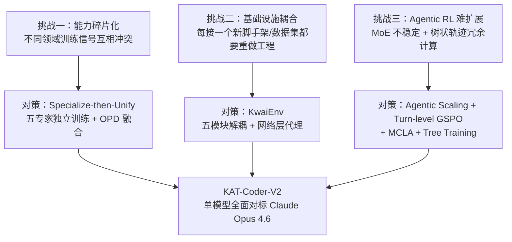

# KAT-Coder-V2 技术报告 · 超详细拆解（面向初学者）

> 本文是对 [`2603.27703v1.pdf`](2603.27703v1.pdf)（*KAT-Coder-V2 Technical Report*，KwaiKAT Team @ 快手，arXiv:2603.27703v1，2026-03-29，正文 22 页）的逐节精读与拆解。
>
> 目标：让一个初学者也能看懂这份报告——不仅知道"他们**做了什么**"，还知道"**为什么这么做**（要解决什么问题）"、"**怎么做的**（具体机制）"，以及**每个技术点所依赖的底层技术本身是什么**。
>
> 组织方式（参照同目录 [`kimi.md`](kimi.md) 的写法）：
> - **第 1 章是"前置知识速成"**：报告默认读者懂 RL、GRPO/GSPO、MoE、知识蒸馏、注意力掩码等技术，本章先用最通俗的方式把这些**底层技术本身**讲清楚，并全部标注为【背景】；
> - **第 2 章起逐节拆解报告原文**，每个技术点按 **"问题 → 背景 → 机制 → 公式逐符号 → 微型例子 → 意义"** 的顺序展开；
> - 所有论文事实严格忠实于原文；原文没有明说、由我们补充的推断或类比，一律用"（解读）"标注。

---

## 0. 三十秒速览（结论先行）

**KAT-Coder-V2 是快手 KwaiKAT 团队的智能体编程（Agentic Coding）模型**，在 KAT-Coder-V1 基础上继续做后训练（post-training）得到。它的核心方法论一句话概括：**Specialize-then-Unify（先专精，再统一）**。

| 维度 | 结论 |
|---|---|
| 做什么 | 把"智能体编程"拆成 5 个专家领域（SWE / WebCoding / Terminal / WebSearch / General），每个领域**独立**做 SFT + RL，最后用**在线策略蒸馏（OPD）**融合成**一个**可部署模型 |
| 基建 | 自研 **KwaiEnv**：解耦数据集、沙箱、脚手架、验证器，支撑**数万路并发沙箱** |
| RL 数据扩展 | **Agentic Scaling**：沿任务复杂度、意图对齐、脚手架泛化三个维度扩展，产出 10 万+ 高难度样本 |
| RL 算法创新 | **Turn-level GSPO**（回合级重要性比率，兼顾稳定性与信用分配）；**MCLA**（蒙特卡洛对数概率平均，稳住 MoE 的 RL 训练） |
| 训练系统创新 | **Tree Training** 消除树状轨迹的重复计算，端到端**加速最高 6.2×**；KRL 框架让单样本成本降低 2.8× |
| 成绩 | SWE-bench Verified **79.6%**（Claude Opus 4.6 为 80.8%）；PinchBench **88.7**（超过 GLM-5 的 86.4 与 MiniMax M2.7 的 87.1）；前端美学三场景**全部第一**；Terminal-Bench Hard 46.8、τ2-Bench 93.9 |

整篇报告的逻辑链条：



---

## 1. 前置知识速成：把报告用到的底层技术本身讲清楚【背景】

> 这一章**不是论文内容**，而是为初学者补的背景课。报告正文大量直接使用这些概念而不加解释；把它们搞懂，后面每一节都会顺畅得多。已经熟悉的读者可以直接跳到第 2 章。

### 1.1 大模型是怎么练出来的：预训练 → SFT → RL 三阶段

一个现代 LLM 的诞生通常分三步：

```
第一阶段：预训练（Pre-training）
  做法：在海量文本上玩"猜下一个 token"（next-token prediction）
  产物：基座模型（base model）——知识渊博，但不会"听指令、办事情"

第二阶段：监督微调 SFT（Supervised Fine-Tuning）
  做法：用人工/机器构造的"指令 → 标准回答"配对数据，让模型模仿
  产物：会对话、会按格式干活的模型——但上限是"模仿得像不像"

第三阶段：强化学习 RL（Reinforcement Learning）
  做法：不再给标准答案，只给"奖励"（做对了 +1，做错了 0），让模型自己探索
  产物：会推理、会自我纠错的模型——上限不再被"示范数据"锁死
```

**为什么 SFT 之后还要 RL？** 因为 SFT 是**模仿学习**：模型只能学到示范数据里有的行为，且"像不像"不等于"对不对"。而很多任务（下棋、数学、修 bug）有**明确的对错信号但没有标准过程**——修一个 bug 可以有几十种修法，只要测试全过就算对。这类任务天然适合 RL：让模型自己尝试，用结果反馈来调整行为。

**这份报告的全部工作都发生在"后训练（post-training）"阶段**——即 SFT 和 RL 这两步（在 KAT-Coder-V1 这个已有模型之上继续做），不涉及从零预训练。

### 1.2 强化学习最小知识包：策略、轨迹、奖励、优势、策略梯度

把 LLM 放进 RL 框架里，对应关系是：

| RL 概念 | 在 LLM 里的对应物 | 通俗解释 |
|---|---|---|
| 策略 $\pi_\theta$ | 模型本身（参数为 $\theta$） | "看到当前局面，下一步怎么走"的概率表 |
| 状态 $s$ | prompt + 已生成的所有内容 | 当前局面 |
| 动作 $a$ | 生成下一个 token（或一整个回合） | 走一步 |
| 轨迹 $\tau$ | 一次完整的生成/交互过程 | 一局棋的完整棋谱 |
| 奖励 $R$ | 环境给的分数（测试通过=1，否则=0） | 输赢结果 |
| 优势 $A$ | 奖励减去"平均水平" | "比预期好多少" |

**策略梯度（Policy Gradient）**是 RL 的核心公式，它的直觉只有一句话：**好的轨迹以后多走，差的轨迹以后少走**。写成公式：

$$
\nabla J(\theta) = \mathbb{E}_{a \sim \pi_\theta}\left[ R(a)\, \nabla \log \pi_\theta(a) \right]
$$

逐符号解释：
- $\log \pi_\theta(a)$：模型走出动作 $a$ 的对数概率；$\nabla \log \pi_\theta(a)$ 是"怎么调参数 $\theta$ 能让 $a$ 的概率变大"的方向；
- 乘以奖励 $R(a)$：奖励为正，就沿"让 $a$ 更可能"的方向更新；奖励为负，就反向更新（让 $a$ 更不可能）；
- $\mathbb{E}_{a \sim \pi_\theta}$：对所有可能轨迹取期望——实际上做不到，只能用**采样子平均**来近似，这就是"蒙特卡洛估计"（见 1.7，报告里的 MCLA 就和它直接相关）。

**on-policy 与 off-policy**：
- **on-policy（在线策略）**：用来学习的数据，是**当前这版模型**刚生成的。最新鲜、最准，但模型一更新旧数据就"过期"；
- **off-policy（离线策略）**：用**别的（旧的/别人的）策略**生成的数据来学习。省钱（数据可复用），但存在分布偏差。

这个区分是理解后文 OPD（§7）为什么强调 "on-policy" 的关键。

### 1.3 重要性采样与 PPO 裁剪：RL 更新的"安全带"

**问题**：RL 训练是循环往复的——生成数据 → 更新模型 → 再生成。但生成数据很耗时，工程上常见做法是：用"生成数据那一刻的模型"（记作旧策略 $\pi_{\theta_{old}}$）采一批数据，然后让当前模型 $\pi_\theta$ 在这批数据上**更新好几步**。问题是：模型一旦更新，这批数据就不是当前策略生成的了，期望就算不准了。

**重要性采样（Importance Sampling）**是数学上的纠偏手段：给每个样本乘一个**重要性比率**

$$
r(\theta) = \frac{\pi_\theta(a)}{\pi_{\theta_{old}}(a)}
$$

- $r = 1$：新旧策略对这个动作的看法没变；
- $r = 2$：新策略比旧策略更倾向这个动作 2 倍，那这个样本的"话语权"就翻倍。

**PPO 裁剪（clipping）**：比率纠偏有个风险——如果某一步更新让 $r$ 变得很大（比如 10），梯度会被极端放大，训练直接崩。PPO 的解法是把比率**裁剪**进 $[1-\epsilon, 1+\epsilon]$ 区间（比如 $[0.8, 1.2]$），并取保守的那个值：

$$
\mathcal{L}(\theta) = \mathbb{E}\left[ \min\left( r(\theta) A,\ \mathrm{clip}(r(\theta), 1-\epsilon, 1+\epsilon) A \right) \right]
$$

逐符号：$A$ 是优势；$\min$ 保证"好消息不许贪多、坏消息如实承受"——相当于给每步更新装上安全带，这就是 PPO 稳定的原因。**报告的公式 (7) 就是这个结构**，只是把比率从 token 级换成了回合级。

### 1.4 GRPO：用"组内对比"干掉价值模型

**背景**：经典 PPO 需要额外训练一个**价值模型（critic）**来估计"当前局面的平均得分"，用它把奖励折算成优势 $A$。但价值模型本身和主模型一样大，训练开销翻倍，还经常估不准。

**GRPO（Group Relative Policy Optimization，DeepSeekMath 提出）**的做法极其朴素：**同一个题目，让模型一次生成 $G$ 条回答**，用组内统计量代替价值模型：

$$
A_i = \frac{R_i - \mathrm{mean}(R_1, \dots, R_G)}{\mathrm{std}(R_1, \dots, R_G)}
$$

逐符号：$R_i$ 是第 $i$ 条回答的奖励；减去组均值（"比平均好多少"）、除以标准差（归一化尺度）。

**微型例子**：一道题采 4 条回答，奖励为 $[1, 1, 0, 0]$。均值 $=0.5$，标准差 $\approx 0.58$，则四条的优势约为 $[+0.87, +0.87, -0.87, -0.87]$——答对的被鼓励、答错的被压制，**不需要任何价值模型**。

**GRPO 的软肋（报告点名的）**：它的重要性比率是**逐 token** 的——每个 token 都算一个 $r_{i,t}$。在智能体场景，一条轨迹动辄几万个 token、几十个回合，几万个比率各自抖动，**方差极大**，长程训练容易不稳。这就是报告要改进它的动机（§6.2）。

### 1.5 GSPO：把重要性比率从 token 级提到序列级

**GSPO（Group Sequence-level Policy Optimization，Qwen 团队提出）**观察到：token 级比率在长序列上会累积噪声，干脆**整条轨迹只算一个比率**——把轨迹里所有 token 的概率比做（几何）聚合，得到一个序列级比率，然后整条轨迹共享同一个优势。

- **好处**：比率数量从"几万"变成"1"，裁剪也发生在序列级，训练明显更稳；
- **代价**：**信用分配（credit assignment）变粗**——整条轨迹共享一个比率和一个优势，模型分不清"到底是第 1 轮的功劳还是第 5 轮的功劳"。

**一句话对比**：GRPO 粒度太细（细到抖动），GSPO 粒度太粗（粗到分不清功过）。报告的 Turn-level GSPO 就是取两者中间的粒度——**回合**（§6.2 详解）。

### 1.6 MoE 混合专家模型：为什么强，为什么 RL 难训

**MoE（Mixture-of-Experts）结构**：把 Transformer 里每个"前馈网络（FFN）"换成一池子小 FFN（称为**专家**，可能有几百个），配一个**路由器（router）**。每来一个 token，路由器只挑 top-$k$ 个专家处理它（比如 896 个专家选 16 个）。

- **好处**：总参数量可以做得巨大（知识容量大），但每个 token 只激活一小撮专家（计算量可控）——"图书馆很大，每次只请几位馆员"。
- **代价**：路由是一个**离散选择**——"选谁不选谁"是硬切换，对输入的微小扰动敏感。

**为什么 MoE 做 RL 格外不稳？** 两个来源（这正是报告 §3.3.1 MCLA 一节的问题背景）：

1. **策略失配（policy mismatch）**：RL 的数据由**推理引擎**（如 SGLang）生成，梯度由**训练框架**（如 Megatron）计算。两套系统的数值精度、算子实现不同，同一个 token 在两边可能被路由到**不同的专家**——于是"生成时记下的概率"和"训练时算出的概率"对不上，重要性比率 $r$ 失真；
2. **logprob 本身的噪声（报告的新发现）**：MoE 的随机路由、容量丢弃（capacity dropping：专家满了就把 token 丢给次选）、数值误差，使得**同一输入前向跑两次，logprob 都可能不一样**——logprob 是个随机变量。而重要性权重是 $w = \exp(\text{logprob diff})$，**指数会把噪声放大**（见 §6.3 的数值例子）。

### 1.7 蒙特卡洛估计与"平均降噪"

**蒙特卡洛估计**：算不了精确期望，就采样 $K$ 次取平均来近似。大数定律保证：$K$ 越大，估计越准。

它有个教科书级的性质：**如果单次测量带零均值噪声 $\epsilon$（方差 $\sigma^2$），那么 $K$ 次独立测量取平均后，噪声方差降为 $\sigma^2 / K$**。代价也很直白：花 $K$ 倍的测量成本。

报告的 MCLA 就是把这一招用到 logprob 上：同一轨迹 prefill $K=8$ 次取平均，把 MoE 噪声的方差压下去（§6.3）。

### 1.8 知识蒸馏、暴露偏差与灾难性遗忘

这三个概念是理解报告 OPD（§7）的钥匙。

**知识蒸馏（Knowledge Distillation）**：让小/新模型（学生）模仿强模型（老师）的输出。
- **全 logits 蒸馏**：老师对词表里**每一个 token** 都有一个概率分布，让学生在整个分布上对齐（最小化 KL 散度）。信息最稠密，但每一步都要存/传一整张词表级的分布，**计算和存储极贵**；
- **logprob 蒸馏（序列级）**：只在学生**实际生成的那些 token** 上，比对老师和学生的概率。便宜得多，且监督落在"学生真正会走到的地方"。

**暴露偏差（Exposure Bias）**：离线模仿学习的经典病。训练时学生看的全是**老师的轨迹**（每一步都走在"正确答案"上）；可上线后学生走的是**自己的轨迹**——一旦某步走岔，就进入了训练时从未见过的状态，错误会像滚雪球一样累积。根治办法：让学生**在自己生成的轨迹上**接受老师监督——这就是 on-policy 蒸馏的动机。

**灾难性遗忘（Catastrophic Forgetting）**：神经网络学新任务时，梯度会把为旧任务调好的参数冲掉。把多个领域专家的能力压进一个模型时，最大风险就是"学会了 A 忘了 B"。直接把几个专家的权重做平均，通常会让各方能力互相踩踏、全面退化——所以报告 §3.4 首先排除了"权重平均"这条捷径。

### 1.9 智能体世界的行话：Agent Loop / Scaffold / Sandbox / Rollout / Verifier

**Agent Loop（智能体循环）**：让 LLM 干活的基本循环——

```
模型输出（决定调什么工具/写什么代码）
  → 外部程序执行这个调用（读文件/跑命令/搜网页）
  → 把执行结果塞回模型的上下文
  → 模型基于新信息再输出 → …循环，直到任务完成
```

**Scaffold（脚手架）**：包在模型外面、驱动这个循环的**外壳程序**。它决定：系统提示词怎么写、有哪些工具可用、上下文怎么裁剪、什么时候算"完成"。Claude Code、OpenCode、OpenClaw、Kilo Code、SWE-agent 都是脚手架。**同一个模型配不同脚手架，表现可以差很多**——所以"跨脚手架泛化"在报告里被单独当成一个训练维度。

- **黑盒脚手架**：不改其代码，只把它当完整程序用（通过 API 给它供模型）；
- **白盒脚手架**：能拿到并改造其内部逻辑（如 SWE-agent）。

**Sandbox（沙箱）**：一个隔离的执行环境（通常是 Docker 容器），里面预装好代码仓库、依赖和测试套件，让智能体随便折腾而不影响外界。RL 训练需要**同时跑几万个任务实例**，就需要几万个并发沙箱——这是报告 §2 的基建主题。

**Rollout / Trajectory（轨迹）**：模型在一个任务里从头到尾的完整交互记录（每一轮的输入、输出、工具调用、结果）。

**Turn（回合）**：轨迹里"模型说一次话 + 环境回一次应"的一来一回。一条 agentic 轨迹通常有几十上百个回合。

**Verifier（验证器）**：给轨迹打分的组件——跑测试看通过率、用规则比对答案、或用另一个 LLM 当裁判（LLM-as-Judge）。RL 的奖励信号就来自它。

### 1.10 向量嵌入与余弦相似度（Issue-PR 配对的技术基础）

**嵌入（embedding）**：把一段文本（一个 Issue、一个 PR）用一个神经网络压成一个高维向量（比如 1024 维），使得**语义相近的文本，向量也相近**。

**余弦相似度（cosine similarity）**：衡量两个向量"方向有多一致"：

$$
\cos(\mathbf{u}, \mathbf{v}) = \frac{\mathbf{u} \cdot \mathbf{v}}{\|\mathbf{u}\|\,\|\mathbf{v}\|} \in [-1, 1]
$$

- 接近 1：方向几乎一致 → 语义高度相关；
- 接近 0：互不相关；接近 -1：语义相反。

报告的公式 (1) 就是用它给"Issue 和 PR 的语义相关性"打分，超过阈值 $\tau$ 就配成一对（§5.1.1）。

### 1.11 注意力掩码、位置 ID、KV Cache、FlashAttention（Tree Training 的技术基础）

**因果注意力掩码（causal mask）**：生成式模型的铁律是"不许偷看未来"。实现上是一张三角形的 0/1 表格：第 $t$ 个 token 只允许 attend 到 $1 \dots t$。**Tree Training 把它推广成"树状掩码"**：每个 token 只允许 attend 到它自己那条"根到叶路径"上的祖先（§6.4.1）。

**位置 ID（position ids）**：模型本身不知道 token 的先后顺序，需要给每个 token 一个位置编号（RoPE 等位置编码依赖它）。把多条轨迹**拼成一条长序列**训练时，如果直接用拼接后的物理位置，语义就乱了——必须**手动恢复每个 token 在其原始轨迹里的逻辑位置**。这也是 Tree Training 的三组件之一。

**KV Cache**：推理时，每生成一个新 token 都要 attend 到全部历史 token；历史的 key/value 算过一次就**缓存**起来，避免每步重算。报告的 KRL 框架用 "Cache-Aware 调度" 把前缀相同的请求路由到同一台推理服务器，**最大化 KV Cache 命中率**（§6.4.2）。

**FlashAttention**：高性能注意力实现，把注意力分块计算并支持自定义掩码（报告用的是 FlashAttention V3 来承载树状掩码）。

### 1.12 拒绝采样与 Pass@K（WebSearch / Terminal 数据的基础技术）

**拒绝采样微调（Rejection Sampling Fine-Tuning, RFT）**：对同一道题让模型采很多条解答，**只留做对的（且过程干净的）**，拿这些"自学成才"的正确轨迹回去做 SFT。本质是"用自己的成功经验教自己"。

**Pass@K**：每道题独立采 $K$ 次，看成功率。报告用它给题目**测难度**：全对（太容易）和全错（学不到信号）的题都扔掉，只留中间难度的（§5.4，公式 4）。

---

## 2. 论文要解决什么问题？（对应原文 §1）

### 2.1 从"单轮写代码"到"智能体编程"

传统代码模型做的是**单轮代码生成**：给一个题目，输出一段代码，对错立刻可判。而 **Agentic Coding（智能体编程）** 要求模型在**真实开发环境**里自主完成多步骤软件工程任务：

- 与真实代码仓库交互、管理复杂的依赖图；
- 编排多轮工具调用（读文件、跑测试、改代码……）；
- 根据**执行反馈**（比如测试报错）调整自己的决策。

原文点出关键区别：这种交互式、长程（long-horizon）的工作流，要求模型的**多步行为与端到端工程结果对齐**，而不是只优化"单轮代码对不对"。

（解读：用 1.2 的 RL 语言说——单轮任务里"动作 = 最终答案"，奖励直接挂在动作上；而智能体任务里，奖励挂在几十步操作后的最终结果上，中间每一步该怎么学（信用分配问题），是全新的难题。这句话实际上为后文 §6.2 的 Turn-level 算法埋下了伏笔。）

### 2.2 三大根本挑战（全文的问题清单）

原文 §1 明确提出三个挑战，后文所有技术都是对着这三个挑战开的药。务必记住这张对应表：

**挑战一：能力碎片化（Capability Fragmentation）。**
不同编程场景需要的能力**不仅不同，甚至互相冲突**：
- SWE 任务要"基于测试验证的长链代码编辑"；
- WebCoding 要"在口语化稀疏输入下的美学判断"；
- Terminal 任务要"持续的环境状态追踪"。

用一条单一的训练管线（monolithic pipeline）想在所有领域同时达到最优，是不现实的。

（解读：这就是 1.8 里"多任务互相干扰/遗忘"在训练阶段的体现——把梯度方向相反的任务混在一个 loss 里，优化器只能取折中，每个领域都到不了自己的山顶。后文 §4 的"分专家训练"是直接回应。）

**挑战二：基础设施耦合（Infrastructure Coupling）。**
Agentic RL 训练需要：高吞吐的沙箱编排、异构 benchmark 支持、以及兼容快速发展的智能体脚手架生态（Claude Code、OpenClaw、OpenCode 等）。而现有系统把这些关注点**紧耦合**在一起——每接入一个新脚手架或新数据集，都是一次昂贵的工程劳动。（对应 §3 的 KwaiEnv。）

**挑战三：Agentic RL 的扩展（Scaling Agentic RL）。**
有效训练编程智能体需要同时沿多个维度扩展——任务复杂度、提示词多样性、脚手架泛化——同时还要应付两件麻烦事：
1. **MoE 模型 RL 训练不稳定**（1.6 已铺垫）；
2. 树状多轮轨迹带来的**计算冗余**（1.11 已铺垫掩码概念，§6.4 详解）。

（对应 §6 的 Agentic Scaling、Turn-level GSPO、MCLA、Tree Training。）

---

## 3. KwaiEnv：智能体编程的基础设施（对应原文 §2，回应挑战二）

### 3.1 为什么需要它？（原文 §2.1）

Agentic Coding（尤其 SWE 任务）的一次 rollout（让模型在环境里完整跑一遍任务，见 1.9）包含环境初始化、工具调用、状态管理、结果验证等复杂阶段，远超单轮推理。工程上有三个痛点：

1. **数据集异构**：不同 benchmark（SWE-bench、SWE-bench Pro 等）对沙箱镜像和评测逻辑的要求各不相同——有的要预装特定版本的依赖，有的打分脚本完全不一样；
2. **脚手架泛滥**：新脚手架不断涌现且接入协议差异大，没有统一抽象的话，每接一个都要重复造轮子；
3. **高吞吐需求**：RL 训练一次迭代要并发执行海量 rollout（batch_size × group_size 条轨迹，见 §6.4.2），对沙箱调度和轨迹收集的性能要求极高。

**设计目标（原文）**：通过模块化、可配置的架构，把**数据集、沙箱、脚手架、验证逻辑**四者解耦，让组件可以低成本灵活组合，支撑从模型评测到 RL 训练的完整流程。

### 3.2 系统总览与工作流程（原文 §2.2，图 2）

KwaiEnv 提供统一接口，支持"模型 × 脚手架 × 数据集"的可配置组合，形成闭环：**轨迹收集 → rollout 评测 → 轨迹交付给 RL 引擎训练**。

典型工作流：

```
用户配置文件（数据集 + 目标模型 + 脚手架）
   │
   ▼
KwaiEnv 拉起远程沙箱集群，把脚手架部署到数据集专属镜像上
   │
   ▼
脚手架里的 Agent 发出 LLM 请求 ──►【统一网络代理层】──► 目标 LLM
                                      │（旁路记录全部交互）
   ▼                                  ▼
Verifier 打分 ◄── 任务完成 ◄── 多轮交互（Turn 0 ... Turn N，含子智能体）
   │
   ▼
Trajectory Manager 把轨迹整理成 RL 引擎要的格式 → 送去训练
```

整个管线无人值守自动运行。同一条流水线同时支撑三件事：**数据合成（SFT 轨迹）、RL 训练、评测**——这意味着"训练用的环境"和"评测用的环境"是同一套，消除了 train/eval 环境不一致的隐患（解读：这也是原文 §2.4 说的"评测敏捷"的来源）。

### 3.3 五大核心模块（原文 §2.3）

| 模块 | 职责 | 关键设计（为什么这么做） |
|---|---|---|
| **Dataset** | 接入 SWE-bench、LiveCodeBench 等主流 benchmark + 内部私有训练/测试集 | 用**统一抽象接口**屏蔽不同 benchmark 在任务格式、镜像依赖、打分逻辑上的差异；新数据集只需实现接口定义的标准方法即可接入 |
| **Verifier** | 按任务类型采用**差异化验证策略** | 三类：①**确定性打分**（有明确答案的任务：比对 golden patch、跑测试用例、比对标准输出）；②**LLM-as-Judge**（开放式任务：LLM 评测 + Rubric 打分，维度和权重可配置）；③**SWE 评测**（调用官方打分模块，在沙箱内跑测试套件，返回 pass 率） |
| **Scaffold** | **黑盒**接入主流脚手架：Claude Code、Kilo Code、Cline、OpenClaw、OpenCode 等，并跨版本兼容 | 接入成本极低的核心原因：**KwaiEnv 在网络层代理模型请求**——任何通过 API 调 LLM 的 Coding Agent 都**无需改代码**，只要配置 API 端点和鉴权即可接入 |
| **Sandbox** | 大规模 RL 的底座：秒级触发海量远程沙箱实例 | 每个沙箱是隔离容器环境，挂载数据集专属镜像；KwaiEnv 管理全生命周期（创建、任务分配、监控、回收），对上层透明；支持**数万路并发沙箱** |
| **Trajectory Manager** | KwaiEnv 与 RL 引擎之间的桥梁：轨迹收集、格式化、输出 | 通过网络代理拦截所有 LLM 请求，记录完整元数据（输入输出内容、工具调用序列、token 用量、时间戳）；可对原始轨迹做组装、重排序、截断，以适配不同 RL 算法的输入规格 |

**重点解读 Scaffold 模块的"网络层代理"**——这是全局最巧的一个设计，一举解决三个问题：

1. **接入成本**：脚手架通过 HTTP API 调模型。KwaiEnv 只要把 API 端点指向自己的代理，就能坐在"脚手架"和"模型"中间。脚手架**完全无感知**，所以接入任何新脚手架只需改配置；
2. **轨迹记录**：所有请求/响应都流经代理，轨迹记录变成**旁路监听**，与脚手架内部实现无关；
3. **换模型不改脚手架**：评测"同一脚手架 × 不同模型"只需改代理的上游指向——这正是 §8.1"多脚手架 × 多模型"评测矩阵能低成本实现的原因。

### 3.4 解耦带来的四个好处（原文 §2.4）

KwaiEnv 遵循**关注点分离（Separation of Concerns）**原则，五模块通过标准化接口通信，可独立迭代：

- **数据可扩展**：加训练数据只需实现统一数据接口，不影响沙箱和脚手架；
- **脚手架可扩展**：新 Coding Agent 只需配置容器命令和 API 端点；
- **评测敏捷**：评测与训练共用同一套基建，保证高一致性、短迭代周期；
- **算法可适配**：格式化逻辑与 RL 算法解耦，新算法只需注册新的轨迹格式化规则。

---

## 4. 总方法论：Specialize-then-Unify（对应原文 §3.1，回应挑战一）

KAT-Coder-V2 在 KAT-Coder-V1 基础上做继续后训练，把智能体编程的能力谱拆成 **5 个正交专家领域**：

| 专家 | 场景 | 核心方法（原文 Table 1） |
|---|---|---|
| **SWE** | Issue 解决 | Issue-PR 配对（合并状态做监督）；AutoBuilder 可验证任务合成（F2P+P2P）；代码理解轨迹合成 |
| **WebCoding** | UI 生成 | 三视角标签体系；Prompt 改写（设计师→普通用户）；设计师评审团评测 |
| **Terminal** | 命令行推理 | 跨格式 SWE→Terminal 转换；多智能体合成；Docker 化验证 |
| **WebSearch** | 智能体搜索 | 从搜索轨迹构建知识图谱；Pass@8 过滤；拒绝采样微调 |
| **General** | 指令遵循 / QA / 代码-数学 | 组合约束训练；长对话样本；在线评测系统验证 |

整体管线分**三个阶段**，顺序不能颠倒，后一阶段建立在前一阶段之上：

```
KAT-Coder-V1（已有模型）
   │
   ▼ 阶段一：SFT（监督微调）
   │   每个领域：KwaiEnv 轨迹收集 + 领域专属数据合成管线
   │   ──► 产出 5 个独立的"专家模型"
   ▼ 阶段二：RL（强化学习）
   │   每个专家：在 KwaiEnv 沙箱里做环境反馈 RL
   │   ──► 5 个专家各自被推到自己领域的能力前沿
   ▼ 阶段三：OPD（在线策略蒸馏）
       5 个专家当老师，1 个学生模型在混合领域数据上边探索边被纠偏
   │   ──► 统一的 KAT-Coder-V2（单模型部署，各领域保持专家级）
   ▼
KAT-Coder-V2
```

**为什么"先分后合"而不是直接混着训？**（解读）
- "先分"针对挑战一：各领域训练信号互相冲突，混训互相拉扯；分开训，每个专家能在自己的领域打到最优，数据配方、奖励设计都可以领域定制；
- "后合"针对部署现实：线上不可能跑五个模型（运维成本、路由错误、体验割裂）；
- "合"为什么用 OPD 而不是权重平均/继续混训/纯 RL——这是 §7 的专门话题。

---

## 5. 第一阶段 · SFT：五个专家各自的数据管线（对应原文 §3.2）

SFT 阶段的核心工作量在**数据构造**。五个专家各有一套针对性管线，下面逐一拆解。每个专家都按"问题 → 机制 → 关键细节 → 意义"展开。

### 5.1 SWE 专家：自主 Issue 解决（原文 §3.2.1）

**目标**：从一条 issue 描述出发，自主完成端到端任务——代码库理解 → 故障定位 → 代码修复。

**先补背景：SWE 任务里的几个名词【背景】**
- **Issue**：GitHub 上的任务/缺陷报告（"这个函数在空输入时崩溃"）；
- **PR（Pull Request）**：一次代码变更提案，附讨论与审查记录；**merged（已合并）** 表示社区认可并合入主干；
- **diff**：变更前后的代码差异；
- **测试套件**：仓库自带的自动化测试。一个修复好不好，跑测试就知道——**这就是 SWE 任务能做 RL 的根本原因：奖励可自动验证**。

数据来自三条互补管线，分工明确：

| 管线 | 补什么能力 | 数据性质 | 产出 |
|---|---|---|---|
| Issue-PR | 大规模真实工程修复模式 | 静态配对数据 | 2M+ 高质量样本 |
| AutoBuilder | 带真实环境的**可验证交互任务** | 可执行四元组 | 30k 已验证样本 |
| Code Comprehension | 代码**理解**（区别于编辑） | 交互轨迹 | 真实仓库上的理解轨迹 |

#### 5.1.1 Issue-PR 管线（原文图 3）

**问题**：真实 SWE 能力必须来自真实工程数据，但 GitHub 上的原始数据噪声巨大，且很多 PR 并没有显式链接到它解决的 issue。

**机制（三步）**：

**第一步 · 建立双向 Issue-PR 映射。** 从数十万个 GitHub 开源仓库（覆盖 11 种主流编程语言）中，以**已合并 PR 为锚点**，用 1.10 的嵌入技术做语义关联分析。对每个已合并 PR $p$，计算它与候选 Issue $i$ 的相关性分数：

$$
s(i, p) = \cos(\mathbf{e}_i, \mathbf{e}_p) \tag{1}
$$

- $\mathbf{e}_i$：Issue 文本的嵌入向量；$\mathbf{e}_p$：PR 文本的嵌入向量；
- 只保留 $s(i,p) > \tau$（阈值）的配对，建立双向映射。

（解读：GitHub 上只有一部分 PR 会显式写 "fixes #123"；靠嵌入相似度能把"没写链接但语义相关"的暗配关系挖出来，数据规模才能上去。）

**第二步 · 重构完整工程链。** 提取合并前后的 diff，重构出"**问题发现 → 故障定位 → 代码修复**"的完整链条，并在其上构造两类互补训练任务：

- **检索任务**：训练模型做"Issue 语义空间 → 代码空间"的精确映射——给一个 issue 描述，在大型代码库里定位相关文件和函数。（解读：这对应真实修 bug 的第一步"找到要改哪"，是新手程序员最弱的能力之一。）
- **编辑任务**：要求模型产出完整修复，把"故障归因"和"变更提案"整合起来，形成端到端能力闭环。

另有**长上下文维度**的增强：利用 Issue-PR 数据天然的长程依赖特性（跨文件变更、多轮 review、关联 PR 迭代），把高相关的工程片段聚合成**长序列样本**，强化模型在大型代码库中跨域关联信息的能力。

**第三步 · 质量控制。** 关键洞察：**PR 的合并状态本身就是天然的正确性监督信号**——被合并 ≈ 修复被社区审查认可，零成本、大规模、高可信。在此基础上再过滤自动生成的产物（如格式化机器人的提交）和非必要的依赖变更，对重复修复模式做语义级去重，最终得到 **2M+ 高质量样本**。

#### 5.1.2 AutoBuilder 管线（原文图 4）

**问题（原文原话）**：静态代码数据**缺少环境交互信息**，不足以训练智能体场景所需的长程推理能力。Issue-PR 数据告诉模型"正确答案长什么样"，但模型没机会练习"在环境里试错、跑测试、根据报错调整"这个过程。

**机制**：从 8,000+ 开源仓库自动合成**可验证的 SWE 任务**，三阶段：

**Stage 1 · 环境搭建。** 挑选 CI 配置完善的活跃仓库，提取**包含单元测试变更**的 commit/PR 实例（解读：带测试变更的 commit 才能构成"修复前测试挂、修复后测试过"的可验证任务）。对每个实例用**多智能体协作**自动搭建隔离沙箱——三个专职 agent：

| Agent | 职责 |
|---|---|
| Dependency Resolution Agent | 依赖安装 |
| Environment Configuration Agent | 编译配置 |
| Build Verification Agent | 测试执行 |

它们基于仓库自己的 Dockerfile、依赖清单和 CI 脚本，**迭代式搭建并修复环境**，直到代码能编译、测试能跑。（解读：给老仓库复现环境是 SWE 数据合成里最脏最累的活——依赖版本冲突、系统库缺失、构建脚本过时……这里是"用 agent 干 agent 的活"，一种自举思路。）

**Stage 2 · 指令构造。** 以 commit diff + 关联 Issue + 周边代码上下文为输入，用 LLM 自动生成用户指令。**关键约束：指令只能描述需求意图，不能泄露实现细节**；多轮过滤与改写保证清晰度和开放性，逼近真实用户的提问方式。

（解读·为什么"防泄露"是硬约束：如果指令里写了"请修改 `utils/parser.py` 第 42 行的边界判断"，模型就学不到"定位故障"的能力，任务退化成照抄答案；而真实用户只会说"空数组就崩了，修一下"。）

**Stage 3 · 实例验证（F2P + P2P 双重标准）。** 设 $T_{fail}$ 为修复前失败的测试集、$T_{pass}$ 为修复前通过的测试集。一个修复后代码为 $\hat{c}$ 的实例被保留，**当且仅当**同时满足：

$$
\underbrace{\forall t \in T_{fail}:\ t(\hat{c}) = \text{Pass}}_{\text{Fail-to-Pass (F2P)}} \quad\wedge\quad \underbrace{\forall t \in T_{pass}:\ t(\hat{c}) = \text{Pass}}_{\text{Pass-to-Pass (P2P)}} \tag{2}
$$

- **F2P** 确认修复有效：所有原本失败的测试现在必须通过——保证这个任务"确实有一个坑被填上了"；
- **P2P** 排除回归缺陷：所有原本通过的测试必须保持通过——保证"填坑时没把别处弄塌"。

**微型例子【背景演示】**：某仓库测试套件有 100 个测试，修复前 95 过 5 挂（$T_{fail}$ 有 5 个，$T_{pass}$ 有 95 个）。候选实例的修复代码跑完后：5 个原本挂的全过（F2P ✓），95 个原本过的还全过（P2P ✓）→ 保留。若只满足 F2P 但弄挂了 2 个原本通过的测试 → 丢弃。（解读：双重条件保证奖励信号干净——RL 里模型的每个 +1 奖励都对应一次"真实且无副作用的修复"。）

**产出**：30k 已验证训练样本，覆盖 Python / Java / TypeScript / Go / Rust / C/C++，涵盖 bug 修复、特性开发、代码重构。每个样本是完整四元组：

| 分量 | 内容 |
|---|---|
| 环境 | 可复现 Docker 镜像 + 构建脚本 |
| 缺陷态代码 | 修复前（pre-fix）的仓库状态 |
| 指令 | 无泄露的自然语言任务描述 |
| 验证器 | 规则验证器 + 多维 GRM 打分（生成式奖励模型）/ LLM-as-Judge |

#### 5.1.3 Code Comprehension 管线（代码理解）

**问题**：Issue-PR 和 AutoBuilder 聚焦"改代码"，但智能体 SWE 同样要求**深度代码理解**——在大型代码库里导航、理解、推理。这是互补技能，需要单独造数据。

**机制（七阶段轨迹合成管线，要点）**：

1. **大规模仓库发现**：按 star 数分段搜索爬取高 star 仓库（分段是为了绕过 GitHub API 单次查询 1000 条结果的上限——一个务实的工程细节）；再用**六维质量过滤器**——命名模式、描述关键词、语言构成（主语言代码占比 ≥50%）、贡献者数（≥10）、PR/Issue 活跃度（各 ≥50）、存在源码或构建配置文件——只留真正适合做代码理解任务的仓库；
2. **版本锚定**：通过 DeepWiki 获取仓库的结构化项目文档，并**钉住 commit hash**，保证文档、问题与后续沙箱环境的版本一致（解读：代码库是活文档，不钉版本就会出现"问题问的是新代码、环境里装的是旧代码"的错位）；
3. **造环境**：按钉住的 commit 为每个仓库构建隔离 Docker 环境；
4. **问题合成**：用 LLM 合成代码理解问题，受控设计覆盖 **6 种题型 × 4 个难度等级**，中英双语均衡，每仓库约 8 个问题。六种题型：

| 题型 | 例子（解读） |
|---|---|
| 概览 overview | "这个项目的整体架构是什么？" |
| 代码定位 code locating | "处理 HTTP 超时的逻辑在哪个文件？" |
| 实现走读 implementation walkthrough | "讲讲用户登录的完整流程是怎么实现的" |
| 调用链追踪 call-chain tracing | "从 API 入口到数据库写入经过哪些函数？" |
| 增强规划 enhancement planning | "要加一个导出 CSV 功能，应该改哪些地方？" |
| 代码审查 code review | "这个模块有什么潜在问题？" |

5. **轨迹合成**：在每个容器里部署一个 Claude Code Agent，用它全套工具（读文件、grep 搜索、bash 执行）自主探索代码库来回答问题，单任务最多 **150 轮**交互；
6. **格式转换**：原始轨迹从 Anthropic 格式转成 OpenAI 兼容的训练格式。

（解读：这条管线本质是"用强 agent 在真环境里烧出来的理解轨迹教自家模型"。问题和环境都受控，轨迹天然就是智能体格式，正好补齐"编辑强、理解弱"的短板。）

### 5.2 WebCoding 专家：美学感知的 UI 生成（原文 §3.2.2）

**目标**：从自然语言生成商业级视觉质量的前端页面（HTML/CSS/JS），聚焦三类场景：落地页（Landing Page）、演示文稿（Slides）、数据可视化（Data Visualization）。

**核心挑战（原文）**：真实用户主要给**口语化、短输入**（例如"做一个酷炫街头风的"），而通用模型在这种**低信息密度输入**下会发生"**美学崩塌**（aesthetic collapse）"——退化成保守默认值：蓝白配色、单列网格。

这个专家的三个创新点，正好分别解决"**怎么表示美**、**怎么教出美**、**怎么评出美**"。

#### 5.2.1 三视角标签体系（Tri-Perspective Label System）——怎么表示美

**问题**："美"是一种整体感觉，直接让模型从一句话生成 HTML，"美"的决策全发生在黑盒里，无法训练、无法归因。

**机制**：为每个设计规格维护三个对齐的视图——**用户感知 → 设计原理 → 技术实现**。形式化地，定义结构化映射 $L: V_{user} \to V_{design} \to V_{impl}$，分解为 7 个层级：

| 层级 | 内容 | 举例（解读："酷炫街头风"的落地页） |
|---|---|---|
| L1 风格指引 | 用户能感受到的整体风格 | 街头、潮酷、大胆 |
| L2–L4 全局规范 | 视觉 / 动效 / 排版规范 | 深色底+高饱和撞色；入场动效带滑板式滑入；粗衬线大标题 |
| L5–L7 模块级规格 | 模块规格 / 技术实现 / 资产清单 | Hero 区全屏背景视频；按钮用 45° 斜切角；需要涂鸦风 SVG 图标 ×6 |

**怎么用**：口语化输入通常只覆盖 L1（一句"酷炫街头风"只是风格指引），模型**自回归地推断剩余层级**：

$$
\hat{L}_k = f_\theta(L_1, \hat{L}_2, \dots, \hat{L}_{k-1}), \quad k = 2, \dots, 7 \tag{3}
$$

即：给定用户的 L1 和自己已经推出来的 $\hat{L}_2 \dots \hat{L}_{k-1}$，逐层推出下一层，最后按完整方案生成代码。

**为什么这么做**：把生成从黑盒变成**可追溯的结构化推导**。（解读：本质是"思维链"在设计领域的版本——不让模型直接从一句话跳到 HTML，而是先显式补全一份完整设计方案。低信息输入被模型自己"脑补"成高信息方案，"美学崩塌"的病灶——信息不足时退回保守默认——就此被根除。）

#### 5.2.2 数据合成与 Prompt 改写——怎么教出美

**数据合成四阶段**：高质量设计截图收集 → 逆向工程出结构化 prompt（从截图反推"要做出这个页面该怎么描述"）→ 种子 HTML 生成 + 设计师筛选 → 用 Teacher Model 大规模衍生训练数据。

**Prompt Rewriting（提示词改写）**——解决什么：训练用的结构化 prompt 很详尽（设计师口吻、上千词），但真实用户输入很口语（几十词），两者存在**分布差距**。做法：给每个 HTML 构造**三个语义等价的 prompt 变体**：

| 变体 | 长度 | 口吻（解读） |
|---|---|---|
| 设计师标注版 | >1000 词 | "主色 #0A0A0A，强调色荧光绿，Hero 区采用不对称网格……" |
| 专业用户版 | 200–300 词 | "做一个潮牌落地页，深色系，要有动效和大字标题……" |
| 普通用户版 | ~50 词 | "做一个酷炫街头风的潮牌页面" |

**为什么**：同一目标页面配上三个粒度的入口描述，模型就学会了"无论输入多粗糙，输出质量不打折"。（解读：这三档粒度就是 §6.1 RL 阶段"意图对齐"维度在 SFT 里的预演——同一个思想在两处复用。）

#### 5.2.3 美学评测基准——怎么评出美

**问题（评测空白）**：前端生成有两个层次——**代码保真度**（HTML/CSS 能否正常渲染不报错）与**美学保真度**（渲染出的页面是否达到专业视觉水准）。代码保真是美学保真的**必要不充分条件**：渲染无错的页面，美学分数仍可能从很差到很好。而现有 benchmark（WebArena、Design2Code 等）主要测代码保真或与参考稿的**像素级相似度**——在**无参考（reference-free）的 Text-to-UI 设定**下（用户只给一句话，没有设计稿可比对），存在系统性评测空白。

**他们做了什么**：建立**首个系统性的 Text-to-UI 无参考美学评测基准**。测试 prompt 全部来自口语化普通用户输入，直接考察模型从低信息描述中推断完整美学决策的能力。

- **Landing Page**：拆成 **4 层 10 个独立维度**——
  - 结构层：布局（空间节奏、对齐一致性、视觉层级）、排版（字号层级、字重对比、行距）；
  - 视觉层：色彩（主/辅/强调色体系连贯性）、字体（字形选择与场景适配）、图像（风格一致性与主题相关性）、背景（分区差异与渐变质量）、元素（图标一致性、SVG 质量、logo 保真）；
  - 组件层：组件（按钮/卡片/表单风格一致性、主次视觉区分）；
  - 动态层：交互（hover/active/focus 反馈丰富度）、动画（入场序列设计、节奏与视觉吸引力）。
- **Slides**：精简为 **5 维**（布局、排版、色彩、图像、元素）。砍掉其余 5 维的原因（原文给了四条）：① 幻灯片字体惯例上用系统字体保证跨平台兼容；② 各页统一背景是标准做法；③ 幻灯片组件结构上比落地页简单；④ 翻页转场与交互是基线预期而非美学区分点。（解读：这四条理由体现的是"维度要有区分度才配留在评测里"的 benchmark 设计原则。）

**打分方式**：每维 0–5 分，锚点精确：0 = 完全缺失，1 = 渲染失败，5 = 无瑕疵执行且有显著设计亮点。所有评测由**校准过的专业 UI/UX 设计师评审团**在标准化条件下进行（Chrome、1920×1080 视口、包含滚动/悬停/点击的**完整交互审查**）——确保交互和动画这类动态维度被真正评到，而不是只看静态截图。

### 5.3 Terminal 专家：交互式命令行推理（原文 §3.2.3）

**目标**：真实终端环境里的复杂任务——系统配置、实验复现、DevOps 操作、通用软件工程。这类任务的特点是：**环境状态持续存在**（上一条命令 `cd` 或改了配置，会影响后面所有命令），要求广博的领域知识和自主决策。

**每个训练样本的构成**：任务指令 + 参考解法 + 自动化测试脚本 + 可复现 Docker 环境。

**数据来自四个互补来源**：

| 来源 | 规模/内容 | 补什么（解读） |
|---|---|---|
| 专家标注 | 领域专家手工编写 12 个技术领域（DevOps、数据科学、安全、计算生物等）的任务，用主流模型评测筛出**难度足够**的 | 质量与难度上限 |
| 多智能体合成 | 20+ 个并行 agent 实例自动产出可验证任务（描述 + Docker 环境 + 测试脚本） | 规模 |
| 跨格式改造 | 用 AutoBuilder 把 SWE 格式任务转成 Terminal 格式，**10 万+** 可验证任务、覆盖 10 种编程语言 | 复用 SWE 管线的副产品（一鱼两吃） |
| 开源整合 | CLI-Gym、TermiGen 等，覆盖 11 个任务类别的 420+ 种 CLI 工具 | 工具覆盖广度 |

### 5.4 WebSearch 专家：智能体搜索（原文 §3.2.4）

**目标**：训练模型主动调用搜索工具、做**多跳推理**来回答复杂问题。构造了 **10 万+** 训练样本。

**先补背景：什么是多跳问答【背景】** "A 的导师的母校在哪？"这类问题需要跳两步：先搜 A 的导师是谁，再搜这位导师的母校。单跳搜索或模型背诵都答不了，必须**串联多次检索**。

**第一步：从搜索轨迹构建知识图谱。** 一条搜索轨迹里顺序访问的网页，天然构成连贯的文档集。利用这种连贯性：抽取命名实体、按跨页共现关系连边，形成"桥接节点"；沿**可控深度**的路径采样多跳子图；让 LLM 通过**遮蔽关键实体**来生成 QA 对。

**微型例子【背景演示】**：轨迹依次访问了"某球员页面"和"某球队页面"，两页都提到同一教练实体——教练就是桥接节点，把两个页面连成一跳。遮蔽教练名字生成问题："曾执教过 X 球员和 Y 球队的教练是谁？"——保证问题**无法仅靠参数记忆（背下来的知识）回答**，必须真的去搜、真的做多跳。

**第二步：过滤与拒绝采样。** 两轮过滤：

1. 先删掉**不用工具就能答**的样本（没训练价值）；
2. 每个样本独立采样 $K=8$ 次，计算经验成功率（1.12 的 Pass@K 思想）：

$$
\hat{r} = \frac{1}{K}\sum_{j=1}^{K} \mathbb{1}[a_j = a^*] \tag{4}
$$

- $a_j$：第 $j$ 次采样的答案；$a^*$：标准答案；$\mathbb{1}[\cdot]$：指示函数（成立为 1，否则 0）；
- $\hat{r}$ 就是"8 次尝试里答对的比例"。**太简单的（$\hat{r}=1$，次次对）和太难的（$\hat{r}=0$，次次错）都丢掉**，只留中间带的样本。

**为什么留中间带（原文）**：这部分样本能给策略优化提供**最大的有效梯度信号**。（解读：用 1.2 的话说——必对的题优势 $A$ 恒为正且无区分度，没有改进空间；必错的题奖励恒为零，梯度里学不到任何"怎样才对"的信号；半会半不会的题才是 RL 的甜区。同一哲学在 §6.1 的 Agentic Scaling"能力前沿"筛选里再次出现。）

**拒绝采样微调（1.12）**：挑选同时满足三条的正例轨迹——最终答案正确、无失败的工具调用、无重复查询。（解读：后两条是在防"过程不干净"——答案蒙对但工具调用一路报错、或反复发同一个查询的轨迹，会教坏习惯。）

### 5.5 General 专家：指令遵循与代码-数学推理（原文 §3.2.5）

**作用（原文）**：在强化领域专家的同时，保住模型的**基础通用能力**，维持通用场景的核心竞争力。覆盖三个方向：

- **指令遵循**：格式、内容、组合式约束（如"用英文回答且不超过 100 词且包含三个要点"），带**细粒度的违例惩罚**；
- **通用 QA**：开放域知识、多轮对话，包含**话题切换和跨轮依赖**的长对话样本；
- **代码-数学推理**：竞赛级编程题 + 小学到高等难度的数学题集，通过**在线评测系统（online judge）**自动验证。

（解读：这个专家是"防退化保险"——四个领域专家都在往各自方向猛拉模型，如果没有 General 专家在融合阶段提供通用能力锚点，统一模型很可能"会修 bug 但不会好好说话"。）

---

## 6. 第二阶段 · RL：Agentic Scaling 与三个算法/系统创新（对应原文 §3.3，回应挑战三）

原文 §3.3 分两块：**Agentic RL**（数据范式 + 策略优化算法 + 稳定性技术）和 **Agentic Engineering**（训练框架与系统优化）。这是全文创新密度最高的一章。

### 6.1 Agentic Scaling：RL 数据的三个扩展维度（原文 §3.3.1）

**问题**：SFT 建立了基础的指令遵循和代码生成能力，但要提升复杂长程任务中的**探索与推理**能力，必须靠 RL（1.1）。而传统 RL 数据集多来自简单 QA 对或静态环境，**无法捕捉真实智能体场景的多变性和复杂性**。

**是什么**：基于内部 AutoBuilder 系统策展的基础任务池，沿**三个维度**系统性扩展训练数据，最终得到 **10 万+** 多样化、高难度样本。

**维度一：任务复杂度（Task Complexity）——把题出到"能力前沿"上。**

有效的策略优化要求训练任务**处在模型能力前沿附近**（与 §5.4 的 Pass@8 中间带同一哲学）。做法：用一个最先进的闭源模型同时充当 **Teacher 和 Judge**，在安全沙箱里生成并严格验证轨迹；**显式过滤掉容易解的任务**，只保留连前沿教师模型都需要"大量反思或迭代修正"才能解决的高难实例。

（解读：用最强模型都费劲的题来训自家模型，有两层妙处——① 题的难度有下限保证；② 教师模型验证过的轨迹同时充当了"这题确实可解、奖励不是坏的"的质量背书。）

**维度二：意图对齐（Intent Alignment）——弥合 Sim-to-Real Gap。**

要解决的问题是 **Sim-to-Real Gap（仿真到真实的差距）**：训练数据的 prompt 通常是结构良好、专家精心编写的；而终端用户给的往往是**不完整或含糊的指令**。在这个差距上训出来的模型，一遇到真实输入就"听不懂人话"。

做法：对任务描述做**语义增强**，保证每个真实代码 commit 映射到**多样化的一组 prompt**——用 LLM 把标准化任务规格改写成从"详尽专家指令"到"口语化、欠规范查询"的连续谱。这个"**一个 commit 对多个 prompt**"策略，强迫模型从带噪的真实输入中准确推断底层工程意图。（解读：与 §5.2.2 WebCoding 的三粒度 Prompt Rewriting 是同一思想在 RL 数据上的复用——可以观察到这份报告的设计语言非常统一。）

**维度三：脚手架泛化（Scaffold Generalization）——把脚手架当成自变量。**

为防止对单一智能体框架过拟合（1.9：同一模型在不同脚手架下表现可能差很多），把**脚手架本身当作数据合成中的自变量**：同一批任务，既用**黑盒脚手架**（Claude Code、OpenCode、Kilo Code 等——高度抽象的环境，强调最终任务结果）生成轨迹，也用**白盒变体**（SWE-agent）生成。让模型在**相同任务、不同脚手架**下训练，培养出与脚手架无关、可高度迁移的问题解决行为。

（解读：这在实验设计里叫"控制变量法"——任务不动、只换脚手架，模型学到的差异就纯粹是"如何适应不同外壳"，而不是"只会某一种外壳"。这直接解释了 §8.1 评测里"换脚手架不掉分"的结果是怎么来的。）

**统一五元组。** 最后，把 RL 数据格式泛化为统一的五元组表示：

$$
\mathcal{D}_{RL} = \langle E,\ T_{tools},\ S_{agent},\ I_{task},\ V_{verifier} \rangle \tag{5}
$$

| 分量 | 含义 | 对应 KwaiEnv 模块（解读） |
|---|---|---|
| $E$ | 执行环境 | Sandbox |
| $T_{tools}$ | 可用工具集 | Scaffold 的工具配置 |
| $S_{agent}$ | 具体脚手架与系统提示词 | Scaffold |
| $I_{task}$ | 任务指令 | Dataset |
| $V_{verifier}$ | 验证与奖励信号 | Verifier |

（解读：这个五元组不是数学装饰——它把 KwaiEnv 的解耦设计投影到了数据层面：每个分量都对应一个可插拔模块，"换环境/换工具/换脚手架/换奖励"全部变成配置问题。基建（§3）与数据范式（本节）在这里合流。）

### 6.2 Turn-level 策略优化：GRPO → GSPO → 回合级 GSPO 的演进（原文 §3.3.1）

这一节是"站在两个已有算法的肩膀上做折中"，前置知识见 1.3–1.5，演进关系如下：

**起点 1 · GRPO 的问题**：token 级重要性比率在 SWE 这类长程智能体场景引入**高方差**。一条 agentic 轨迹动辄几万 token，每个 token 一个比率，几万个随机数各自抖动，梯度方向被噪声淹没（1.4）。

**起点 2 · GSPO 的问题**：把比率聚合到**整条序列**级，稳定性好了，但**单一序列级比率 + 单一优势**让**时序信用分配**失效——多轮环境里无法区分到底是哪一轮（Turn 1 还是 Turn 5）导致了最终结果（1.5）。

**信用分配为什么重要？【背景·微型例子】** 假设一条 5 轮的修 bug 轨迹：Turn 1–2 定位错了文件，Turn 3 重新定位成功，Turn 4 修改，Turn 5 测试通过，最终奖励 +1。
- **GSPO 的做法**：整条轨迹一个优势 +1——Turn 1–2 的走弯路也被一并奖励了，"功"与"过"被平均掉；
- **理想做法**：Turn 3–5 记功、Turn 1–2 记过或至少不记功——这就需要**回合级**的粒度。

**KAT-Coder-V2 的折中：GSPO 的回合级（turn-level）改造。** 以**交互回合**为粒度，把完整生成序列 $y$ 切分成 $N$ 个离散回合。对包含 token 子集 $T_n$ 的第 $n$ 个回合，独立计算重要性比率：

$$
r_{turn}^{(n)}(\theta) = \prod_{i \in T_n} \frac{\pi_\theta(y_i \mid x, y_{\lt i})}{\pi_{\theta_{old}}(y_i \mid x, y_{\lt i})} \tag{6}
$$

逐符号解释：
- $\pi_\theta(y_i \mid x, y_{\lt i})$：当前模型在"输入 $x$ + 已生成前缀 $y_{\lt i}$"下生成 token $y_i$ 的概率；分母是旧模型的同一概率；
- $\prod_{i \in T_n}$：把第 $n$ 个回合**内所有 token** 的概率比连乘，得到**整个回合**的比率；
- 与 GRPO 的区别：GRPO 是每个 token 一个比率（共几万个）；这里是每个回合一个比率（共 $N$ 个，通常几十）；
- 与 GSPO 的区别：GSPO 是整条轨迹一个比率（1 个）；这里是 $N$ 个。

一组轨迹上的裁剪替代目标（对照 1.3 的 PPO 结构）：

$$
\mathcal{L}_{Turn}(\theta) = \mathbb{E}_{\tau \sim \pi_{\theta_{old}}}\left[ \frac{1}{N}\sum_{n=1}^{N} \min\left( r_{turn}^{(n)}(\theta) A_n,\ \mathrm{clip}\left( r_{turn}^{(n)}(\theta),\ 1-\epsilon,\ 1+\epsilon \right) A_n \right) \right] \tag{7}
$$

逐符号：$\tau$ 是一组（group）轨迹；$\frac{1}{N}\sum_n$ 对回合取平均；$A_n$ 是第 $n$ 个回合的**组级优势**；$\mathrm{clip}$ 和 $\min$ 就是 1.3 讲的 PPO 安全带——比率超出 $[1-\epsilon, 1+\epsilon]$ 的部分不许贪功。

**为什么这个折中是对的（原文论证 + 解读）**：
1. **与 MDP 对齐**：智能体的马尔可夫决策过程里，"动作"天然就是"一个回合"（一次决策 + 一次环境反馈），既不是一个 token 也不是一整条轨迹。回合级比率在**整块动作**层面评估概率偏移，和问题结构深度对齐；
2. **保留 GSPO 的方差缩减**：比率数量从几万降到几十，抖动被大幅压缩；
3. **保留细粒度信用分配**：每个回合有自己的比率和优势，Turn 3 的功劳不会被 Turn 1 分走；
4. **工程兼容性好**：回合边界可以**按脚手架专属标记动态定义**（不同脚手架的轮次分隔符不同），无缝兼容多脚手架数据，显著加速收敛并增强模型在长步调试中的自我纠错能力。

| | GRPO | GSPO | Turn-level GSPO（本文） |
|---|---|---|---|
| 比率粒度 | token 级（几万/条） | 序列级（1/条） | **回合级（几十/条）** |
| 长程方差 | 高 | 低 | 低（保留方差缩减） |
| 信用分配 | 细但被噪声淹没 | 粗（分不清哪轮的功劳） | **回合级精确归因** |
| 裁剪粒度 | 逐 token | 逐序列 | 逐回合 |

### 6.3 MCLA + IcePop：稳住 MoE 的 RL 训练（原文 §3.3.1）

**问题**：MoE 模型做 RL 训练出了名地不稳定（1.6）。此前社区主要归因于 rollout 与训练阶段的**策略失配**；本文**新识别出另一个关键因素**：轨迹对数概率期望估计的**高方差**，导致优化中梯度方向不稳定。

**机理推导（原文公式 8–10，逐步展开）**：

策略梯度依赖蒙特卡洛估计（1.2、1.7）：

$$
\nabla J(\theta) = \mathbb{E}_{a \sim \pi_{rollout}}\left[ R(a)\, \frac{\pi_{train}(a)}{\pi_{rollout}(a)}\, \nabla \log \pi_{train}(a) \right] \tag{8}
$$

- $a \sim \pi_{rollout}$：数据由 rollout 策略（推理引擎里的模型）生成；
- $\frac{\pi_{train}(a)}{\pi_{rollout}(a)}$：重要性权重（1.3），纠偏"数据是旧策略采的"这件事；
- 整个式子依赖**估计的**对数概率。

而 MoE 架构有内在随机性——随机专家路由、容量丢弃（capacity dropping）、数值误差——使得估计出的策略对数概率是**带噪的**：

$$
\log \pi(a) = \log \pi^*(a) + \epsilon \tag{9}
$$

- $\log \pi^*(a)$：真实值；$\epsilon$：噪声。

这个噪声使重要性权重产生高方差：

$$
w(a) = \exp\left( \log \pi_{rollout}(a) - \log \pi_{train}(a) \right) \tag{10}
$$

**为什么指数放大噪声【背景·数值例子】**：设两边 logprob 的真实差为 0，各带噪声 $\pm 0.5$：无噪声时 $w = e^0 = 1$；噪声下 $w = e^{0.5} \approx 1.65$ 或 $w = e^{-0.5} \approx 0.61$——权重上下摆动 65%，而这个摆动**直接乘进梯度**。更糟的是，如果噪声大到让某个 token 的专家路由翻转（rollout 走专家 A、train 走专家 B），logprob 差可能远不止 0.5，$w$ 会出现数量级的跳变。于是估计量的方差 $\mathrm{Var}\left[ R(a)\, w(a)\, \nabla \log \pi_{train}(a) \right]$ 过大，梯度方向不稳——训练表现为 loss 尖刺、发散。

**对策 · MCLA（Monte-Carlo Log-probability Averaging，蒙特卡洛对数概率平均）**：训练时对每条轨迹的前向传播做 $K$ 次**预填充（prefill）**，把对应的对数概率取平均：

$$
\overline{\log \pi}(a) = \frac{1}{K} \sum_{k=1}^{K} \log \pi^{(k)}(a), \quad K = 8 \tag{11}
$$

- $\log \pi^{(k)}(a)$：第 $k$ 次 prefill 算出的 logprob；$K=8$ 次取平均。

**为什么有效（1.7 的直接应用）**：每次 prefill 的噪声 $\epsilon_k$ 近似独立，平均后噪声方差降为约 $1/K = 1/8$，权重 $w$ 的摆动随之收敛。代价是 8 次 prefill 的额外计算——（解读）用确定可预算的算力换训练稳定性，在大规模 RL 里是划算的买卖；且 prefill 可以并行、能复用 KV，实际开销低于名义倍数。

**与 IcePop 联用**：IcePop 是已有技术，通过**裁剪差异过大的 token**来抑制 RL 训练中训练-推理不一致；二者联用还对齐了 rollout 与训练之间的**路由决策**。原文强调两者**严格互补**：

| 组件 | 治什么病 | 机制 |
|---|---|---|
| MCLA | 估计量**方差大**（同一路径上 logprob 抖） | 多次 prefill 取平均 |
| IcePop | 分布**不一致**（两边路径/数值系统性对不上） | 裁掉差异过大的 token |

经验上这种组合带来高度稳定的训练、更快的收敛和更优的最终性能。

### 6.4 KRL 框架与 Tree Training：把训练成本打下来（原文 §3.3.2）

**KRL（Kwai RL）** 是自研 RL 框架，两个核心系统创新：Tree Training（约 6× 加速）和高并发沙箱训练（单样本成本降 2.8×）。

#### 6.4.1 Tree Training：树状轨迹的去冗余训练（原文图 5）

**问题从哪来**：现代智能体脚手架——尤其是用了**子智能体、并发工具调用、上下文工程**的——产生的训练轨迹**本质上是树状的，而不是线性的**：

- 脚手架派生**并行子智能体**：主 agent 的某个节点分出多个子 agent 各跑一段；
- **多轮上下文窗口带选择性保留**：第 N 轮的输入不一定是第 1…N-1 轮的完整拼接，可能只保留摘要；
- **轮次之间丢弃中间推理 token**：上一轮的思考过程不进下一轮上下文。

这些情况下，**喂给后续每一轮的上下文，不再是前面各轮的直接拼接**——于是多条分支共享很深的前缀，形成一棵树：

```
轨迹1:  r … u ── v1 ── v2
轨迹2:  r … u ── v1 ── v3          （轨迹1/2/3 共享前缀 r…u…v1）
轨迹3:  r … u ── v1 ── v4
轨迹4:  r … u ── v5 ── v6          （轨迹4/5 共享前缀 r…u…v5）
轨迹5:  r … u ── v5 ── v7          （全部 5 条共享前缀 r…u）
```

**为什么这是个问题**：把树状轨迹天真地**线性化成多条独立序列**训练，共享前缀就会在每次前向/反向传播中被**重复计算**——上图里 `r…u` 被算 5 遍、`v1` 被算 3 遍、`v5` 被算 2 遍。训练成本随分支度成正比增长；脚手架越复杂（子智能体越多），开销越滚越大，成为根本性瓶颈。

**怎么做（一个核心变换 + 三个配套组件）**：采用 **Tree Training**（引自该团队的前作 [19]）——把整棵轨迹树序列化成一条**深度优先搜索（DFS）展平的序列**：

```
展平结果: [r … u | v1 | v2 | v3 | v4 | v5 | v6 | v7]
            ↑共享前缀只存 1 份   ↑每个分支节点也只存 1 份
```

然后靠三个轻量组件保证"展平成一条"在数学上**严格等价**于"按 5 条根到叶路径分别训练"：

| 组件 | 作用 | 为什么必须有它（解读） |
|---|---|---|
| **树状注意力掩码**（基于 FlashAttention V3） | 每个 token 只允许 attend 到**它自己那条根到叶路径**上的祖先 | 展平后 v3 在物理上紧邻 v2，但树上它们属于不同分支——没有掩码，v3 会"偷看"到 v2 的内容，语义错乱（1.11） |
| **逐 token 位置 ID** | 恢复每个 token 在其**原始路径中的逻辑位置**，而不是展平后的物理偏移 | v3 是"第 3 个位置"（r,u,v1 之后），但展平后它的物理位置可能在第 5 格——不纠正，位置编码全错 |
| **逐 token 损失权重（梯度缩放）** | 给共享前缀的 token 乘上"它被多少条路径使用"的权重 | 见下面的梯度等价解释 |

**梯度等价性（原文论证的直觉版）**："按 5 条路径分别训练"时，`r…u` 出现在全部 5 条路径里，它的梯度会被累加 5 次。展平后 `r…u` 只出现 1 次，但只要把它的损失权重设为 5，由**微分的线性性**（和的导数 = 导数的和），最终梯度**完全等价**。代价只是逐 token 损失张量上的一次逐元素标量乘法，可忽略不计——而省下的，是 4 次重复的前向+反向大计算。

**性质与效果**：实现与标准分布式并行策略（TP 张量并行、EP 专家并行、DP 数据并行、PP 流水并行）**正交**，无缝融入训练基建。在来自多种脚手架的真实 agentic RL rollout 上，取得**最高 6.2× 的端到端训练加速**。（解读：加速比取决于树的分支度——子智能体越多、共享前缀越深，省得越多；这也是"6.2×"标注为"最高"的原因。）

#### 6.4.2 高并发沙箱训练（原文图 6，九阶段循环）

为高效编排策略模型与多样执行脚手架之间的复杂交互，框架实现了高并发、异步的流水线。端到端训练循环九个阶段：

| # | 阶段 | 干什么 | 关键技术点（解读） |
|---|---|---|---|
| 1 | 实例采样 | 从数据集采样一个可执行任务的训练 batch | — |
| 2 | Agent 分配 | 借助 KwaiEnv 给每个样本指定脚手架类型，派发到远程沙箱集群 | §3 基建在此复用 |
| 3 | 沙箱初始化 | 由万擎（Wanqing，快手自研大规模容器云平台）动态供给 Docker 隔离环境；每个沙箱封装一条执行轨迹，向 SGLang 推理引擎发起交互 | 数万并发的底座 |
| 4 | 请求路由 | KRL 路由器在多台 SGLang 推理服务器间动态编排请求，严格负载均衡 | — |
| 5 | Rollout 生成 | SGLang 迭代生成轨迹，总量 batch_size × group_size；多轮场景下模型主动与沙箱交互，直到任务完成/达最大轮数/超时 | group_size 即 GRPO 一族的"同题多采样" $G$（1.4） |
| 6 | 奖励计算 | 按任务规则或验证器模型打分得到环境奖励，计算优势，做跨 rollout 的**轨迹打包（packing）** | 打包是把多条轨迹拼成定长序列以提高 GPU 利用率 |
| 7 | 引擎切换 | **实时上下文切换**：GPU 从承载 SGLang 推理服务切换到 Megatron 训练服务 | 同一批 GPU 分时复用：先推理后训练，省一倍的卡 |
| 8 | 参数优化 | 用打包轨迹做策略训练与参数更新；新权重无缝同步回 SGLang | 权重同步保证下一轮 rollout 用的是最新模型 |
| 9 | 迭代 | 立刻进入下一个 batch | — |

**另外两个降本设计**：
- **Cache-Aware 智能调度**：把前缀相近的请求调度到同一台推理服务器，最大化 **KV Cache 命中率**（1.11）——命中就不必重算历史，推理吞吐显著提高；
- **Dynamic Streaming**：细粒度流水线编排，让"生成（Rollout）"与"权重更新（Training）"两个阶段在海量沙箱实例间**无缝交错**，GPU 不空转。

最终效果：整体**单样本成本降低 2.8×**，为 Agentic Scaling 提供了用得起的基建底座。

---

## 7. 第三阶段 · OPD：把五个专家融合成一个模型（对应原文 §3.4）

**问题**：各领域专家训好之后，怎么合并成**一个**全能模型？原文先系统排除三条显而易见的路线（前置知识见 1.8）：

| 候选方案 | 为什么不行（原文） | 展开解释（解读） |
|---|---|---|
| 直接权重平均 | **灾难性遗忘** | 五个专家的参数是在各自领域里"拔河"调出来的，简单平均 = 把五股向不同方向拉的力取均值，每个领域的精细能力都被冲淡 |
| 标准 RL | 反馈太稀疏 | 环境只告诉"最终对不对"，无法指出**中间推理步骤**错在哪；五个领域都要重训 RL，成本也扛不住 |
| 离线 SFT（off-policy 模仿专家轨迹） | **暴露偏差** | 学生训练时看的全是专家走出的"完美路径"，上线后自己走岔一步就进入从未见过的状态，错误滚雪球（1.8） |

**采用的方案：On-Policy Distillation（OPD，在线策略蒸馏）**——结合 RL 的主动探索与知识蒸馏的稠密监督。机制拆解：

```
对混合领域 prompt 池里的每个任务：
  1. 学生模型（统一的 KAT-Coder-V2 雏形）自己生成完整轨迹   ← on-policy：走自己的分布
  2. 动态选出"这个任务上表现最好的专家"当教师              ← 教师选择
  3. 教师评估学生的这条轨迹，在每一步给出自己的 logprob     ← 稠密监督
  4. 环境给出最终任务奖励（测试过没过）                     ← 稀疏落地信号
  5. 联合优化：RL 损失（用 4）+ OPD 损失（用 3）
```

逐条解释设计动机：

1. **学生自己生成轨迹（on-policy）**：根治暴露偏差——监督落在学生**实际会走到**的状态上，走岔了老师会当场纠偏；
2. **动态选最强专家当教师**：每个任务都由"最懂这个领域的专家"带教，五个专家的知识各取所长；
3. **教师给逐步 logprob 而不是完整词表分布**：即 1.8 说的 logprob 蒸馏——**避免了全 logits 蒸馏的高昂计算**（词表十几万，每个生成步都要存/传一张完整分布），同时监督依然"逐步稠密"，能精确指出"第几步开始跑偏"，这是标准 RL 的稀疏奖励做不到的；原文称其为**无偏的优化目标**；
4. **环境奖励兜底**：保证学生不只"学得像老师"，还"真的把任务做对"——防止教师本身的错误被盲目复制。

**代价与缓解（原文坦诚说明）**：把多样的专精能力压进同一组权重，**不可避免地**会比独立专家有轻微性能退化（主因是容量约束和跨领域干扰）。但"RL + OPD"联合优化有效缓解了灾难性遗忘——让学生的主动推理同时对齐"最优专家的 logprob"和"环境成功"，把性能降幅压到最小，最终得到鲁棒而高能力的统一模型。

（解读·回看方法论闭环：SFT 造专家（§5）、RL 把专家推到能力前沿（§6）、OPD 把专家"压"回一个模型（§7）。"Specialize-then-Unify"的 Unify 这步选 OPD，正是因为它同时治两种病——**遗忘**（有稠密监督牵着）和**暴露偏差**（on-policy 生成）。这就是摘要里"lossless fusion without the exposure bias of offline imitation"的含义。）

---

## 8. 评测：四个维度（对应原文 §4）

全部评测基于 KwaiEnv 评测平台（§3 基建的第三个用途），覆盖四个核心维度。

### 8.1 多脚手架编程能力（原文 §4.1，Table 2）

**为什么单列这个维度**：真实开发者会按习惯、团队规范、业务需求选择不同脚手架；脚手架间在 prompt 构造、工具使用协议、上下文组织管理上差异显著，对基座模型的**跨脚手架泛化**要求很高（1.9）。评测全部使用各脚手架**原生的交互协议和系统提示配置**——即不迁就模型，完全模拟真实用户用法。

| Benchmark | 脚手架 | KAT-Coder-V2 | Claude Opus 4.6 |
|---|---|---|---|
| SWE-bench Verified | Claude Code | **79.6** | 80.8* |
| SWE-bench Verified | OpenCode | 74.8 | 75.0 |
| SWE-bench Verified | OpenClaw | 72.8 | 75.7 |
| SWE-bench Multilingual | Claude Code | 75.4 | 77.8* |
| SWE-bench Multilingual | OpenCode | **71.2** | 70.2 |
| SWE-rebench-V2（子集） | Claude Code | 43.3 | 43.7 |
| SWE-rebench-V2（子集） | OpenCode | **38.7** | 37.3 |

（* 数据来自 Anthropic 官网；其余在 KwaiEnv 上评测。）

**怎么读这张表（解读）**：① 纵向看——同一模型换三个脚手架，分数从 79.6 → 74.8 → 72.8 平缓变化而非断崖，这就是 §6.1"脚手架泛化"训练的直接兑现（模型兼容 10+ 主流脚手架）；② 横向看——与 Claude Opus 4.6 互有胜负，OpenCode/OpenClaw 上的差距小于 Claude Code 上的差距，说明对手的分数部分受益于"自家模型配自家脚手架"的亲合性。

### 8.2 智能体任务执行（原文 §4.2，Table 3）

在 OpenClaw 框架下测 PinchBench 和 Claw-Eval——压力场景包括定时触发、高并发请求处理、长链任务执行：

| Benchmark | 指标 | KAT-Coder-V2 | GLM-5 | MiniMax M2.7 | Claude Opus 4.6 | GPT-5.4 | Gemini 3.1 Pro |
|---|---|---|---|---|---|---|---|
| PinchBench | Best | **88.7** | 86.4 | 87.1 | 87.4 | 90.5 | 86.7 |
| PinchBench | Average | 81.9 | 80.3 | 81.8 | 82.3 | 81.6 | 75.9 |
| Claw-Eval | Pass^3 | 55.6 | 57.7 | 51.9 | 66.3 | 66.3 | 50.0 |
| Claw-Eval | Average | 73.4 | 73.0 | 70.7 | 79.3 | 80.6 | 74.2 |

（其他模型数据来自 pinchbench.com 与 claw-eval.github.io，2026-03-25 检索。Pass^3 指"连跑 3 次都通过"的一致性指标。）

**怎么读（解读）**：PinchBench Best 88.7 超过 GLM-5 和 MiniMax M2.7，仅次于 GPT-5.4；但 Claw-Eval 上与 Claude/GPT 差距明显——**原文结论部分坦承了这个差距**并列为未来工作，这是报告诚实的一面。

### 8.3 前端美学生成（原文 §4.3，Table 4）

用 §5.2.3 自建的**无参考美学基准**（三类场景，设计师团队盲评，标准化条件）：

| Benchmark | KAT-Coder-V2 | GLM-5 | Kimi K2.5 |
|---|---|---|---|
| Landing Page | **59.8** | 57.6 | 54.6 |
| Slides | **57.6** | 42.8 | 34.8 |
| Data Visualization | **67.6** | 42.4 | 46.0 |

三个场景全部领先，Slides 和数据可视化上优势尤其大（领先 15~25 分）。这是"三视角标签体系 + 三粒度 Prompt 改写"训练的直接验证。（解读：注意这个基准是出题方自建的，天然更贴合其训练分布——阅读时应把这个因素纳入考量；但"全部用口语化 prompt + 设计师盲评"的设计仍保证了横向比较的基本公平性。）

### 8.4 通用任务处理（原文 §4.4，Table 5）

| Benchmark | KAT-Coder-V2 | GLM-5 | MiniMax M2.7 | Claude Opus 4.6 | GPT-5.4 | Gemini 3.1 Pro |
|---|---|---|---|---|---|---|
| Terminal-Bench Hard | **46.8** | 43.2 | 39.4 | 46.2 | 57.6 | 53.8 |
| τ2-Bench Telecom | 93.9 | 98.2 | 84.8 | 92.1 | 91.5 | 95.6 |
| AA-LCR（长上下文推理） | 68.0 | 63.3 | 68.7 | 70.7 | 74.0 | 72.7 |
| IFBench（指令遵循） | 67.0 | 72.3 | 75.7 | 53.1 | 73.9 | 77.1 |

**怎么读（解读）**：Terminal-Bench Hard 超过 GLM-5/M2.7/Opus 4.6——Terminal 专家管线（§5.3）的兑现；τ2-Bench（客服式双控交互）、AA-LCR、IFBench 居中，符合"General 专家保底线能力"（§5.5）的定位——这个模型的长板在编程与智能体执行，而非通用对话。

---

## 9. 全文技术演进逻辑串讲（一张因果链）

把整篇报告压缩成一条"问题 → 对策 → 引出的新问题 → 再对策"的演进链：

1. **智能体编程兴起** → 单轮训练范式不够用，暴露三大挑战（§2）。
2. **挑战一（能力碎片化）** → 分五个专家各自 SFT（§5）：SWE 三条管线（真实配对 Issue-PR / 可验证 AutoBuilder / 理解轨迹）、WebCoding 三件套（七层标签 / 三粒度改写 / 美学基准）、Terminal 四来源、WebSearch 知识图谱+Pass@8、General 保底——但"分"引出新问题：上线不能跑五个模型 → 需要融合。
3. **融合怎么选？** 权重平均（遗忘）、纯 RL（监督稀疏）、离线 SFT（暴露偏差）都不可行 → **OPD**：on-policy 生成 + 最优专家 logprob 稠密监督 + 环境奖励落地（§7）。
4. **挑战二（基建耦合）** → **KwaiEnv** 五模块解耦 + 网络层代理黑盒接入脚手架（§3）——它同时是 SFT 数据工厂、RL 环境供给方、评测平台，一处建设三处复用。
5. **挑战三（RL 扩展难）** 拆成四个子问题（§6）：
   - **数据不够真/难/泛** → Agentic Scaling 三维度（复杂度/意图/脚手架）+ 统一五元组；
   - **算法粒度**：GRPO 方差大、GSPO 信用分配粗 → **Turn-level GSPO** 取回合级中间粒度；
   - **MoE 稳定性**：logprob 噪声被 exp 放大 → **MCLA** 平均降噪，**IcePop** 裁失配 token，一治方差一治分布；
   - **系统成本**：树状轨迹线性化导致前缀重复计算 → **Tree Training**（DFS 展平 + 树掩码 + 位置 ID + 损失权重，数学上严格等价，最高 6.2× 加速）；推理/训练切换低效 → KRL 九阶段流水线 + Cache-Aware 调度 + Dynamic Streaming（单样本成本 2.8×↓）。
6. **结果**（§8）：单模型 SWE-bench Verified 79.6%（逼近 Claude Opus 4.6 的 80.8%）、前端美学三场景第一、Terminal-Bench Hard 46.8，验证了"**领域专精训练 + 大规模系统化 agentic RL + 统一在线蒸馏**"这条路线的有效性。

**全篇设计语言的统一性（解读）**：读完会发现几个思想在不同位置反复出现——① "只在能力甜区训练"（WebSearch 的 Pass@8 中间带 = Agentic Scaling 的能力前沿筛选）；② "一条数据配多粒度 prompt"（WebCoding 三粒度改写 = RL 的意图对齐维度）；③ "基建即数据"（KwaiEnv 五模块 = RL 五元组）；④ "方差 vs 偏差分开治"（MCLA 与 IcePop 互补）。抓住这四条主线，就抓住了这份报告的方法论内核。

---

## 10. 局限与未来方向（原文 §5）

原文坦承：

- **Claw-Eval 等智能体执行基准上仍有差距**（对 Claude Opus 4.6 / GPT-5.4），计划通过进一步扩展 agentic RL 和更丰富的环境交互来缩小；
- **未来方向一**：把 Specialize-then-Unify 范式推广到**编程之外**的更广智能体领域；
- **未来方向二**：探索**更高效的专家融合策略**，进一步释放领域专精训练的潜力（解读：OPD 仍有"轻微性能退化"，融合环节还有油水可榨）。

---

## 11. 初学者术语表

| 术语 | 一句话解释 | 本文章节 |
|---|---|---|
| Agentic Coding（智能体编程） | 模型在真实开发环境里自主规划、执行、验证多步骤软件工程任务，而非一次性输出代码 | §2.1 |
| Post-training（后训练） | 预训练之后的一切训练（SFT/RL/蒸馏），本报告的全部工作都在这一阶段 | §1.1 |
| Scaffold（脚手架） | 包在模型外面的"智能体外壳"程序（如 Claude Code），负责组织 prompt、调工具、管上下文 | §1.9 |
| Sandbox（沙箱） | 隔离的执行环境（Docker 容器），预装仓库/依赖/测试，供智能体安全折腾 | §1.9 |
| Rollout / Trajectory | 模型在一个任务里从头到尾的完整交互记录 | §1.9 |
| Turn（回合） | 轨迹中"模型一次输出 + 环境一次反馈"的一来一回 | §1.9 |
| Verifier（验证器） | 给轨迹自动打分的组件（跑测试/规则比对/LLM 裁判），RL 奖励的来源 | §1.9 |
| SFT（监督微调） | 用"输入→标准答案"配对数据做模仿学习 | §1.1 |
| RL（强化学习） | 只给奖励不给标准答案，让模型自己探索并调整行为 | §1.2 |
| 策略梯度 | RL 核心更新规则：好轨迹概率调大、差的调小 | §1.2 |
| on-policy / off-policy | 学习数据是否来自当前这版模型；on-policy 新鲜但贵，off-policy 可复用但有偏差 | §1.2 |
| 重要性采样 / 比率 | 用旧策略数据估新策略期望时的纠偏系数：新旧概率之比 | §1.3 |
| PPO 裁剪 | 把重要性比率限制在 $[1-\epsilon, 1+\epsilon]$，防止单步更新过猛 | §1.3 |
| 优势（Advantage） | 奖励减去基线，"比平均水平好多少" | §1.2 |
| GRPO | 免价值模型的 RL 算法：同题采 G 条，组内奖励归一化当优势；比率逐 token | §1.4 |
| GSPO | GRPO 的序列级变体：整条轨迹一个比率，更稳但信用分配粗 | §1.5 |
| 信用分配（Credit Assignment） | 最终结果出来后，判断中间哪一步该记功/背锅 | §6.2 |
| MoE（混合专家） | FFN 换成专家池 + 路由器，每 token 只激活少数专家；参数大、计算省 | §1.6 |
| 容量丢弃（capacity dropping） | 专家超载时把多余 token 转给次选专家——MoE 噪声来源之一 | §1.6 |
| 蒙特卡洛估计 | 采样 K 次取平均近似期望；K 次平均使噪声方差降为 1/K | §1.7 |
| MCLA | 本文提出：同一轨迹 prefill K=8 次对 logprob 取平均，压 MoE 噪声方差 | §6.3 |
| IcePop | 已有技术：裁剪训练-推理差异过大的 token，抑制 RL 分布失配 | §6.3 |
| Tree Training | 树状轨迹 DFS 展平成一条序列训练，靠掩码/位置 ID/损失权重保持严格等价，消除共享前缀重复计算 | §6.4.1 |
| 知识蒸馏 | 学生模型模仿老师模型的输出 | §1.8 |
| 全 logits 蒸馏 vs logprob 蒸馏 | 对齐整个词表分布（贵）vs 只对齐实际生成 token 的概率（便宜） | §1.8 |
| OPD（在线策略蒸馏） | 学生自己生成轨迹，教师在学生轨迹上给逐步 logprob 监督 + 环境奖励兜底 | §7 |
| 暴露偏差（Exposure Bias） | 离线模仿的通病：训练全看专家轨迹，推理走岔就不会回来 | §1.8 |
| 灾难性遗忘 | 学新任务时把旧任务的参数冲掉；多专家合一的最大风险 | §1.8 |
| 嵌入（Embedding） | 把文本压成向量，语义相近则向量相近 | §1.10 |
| 余弦相似度 | 两向量方向一致性的度量，∈[-1,1]；报告用它配对 Issue-PR | §1.10 |
| F2P / P2P | Fail-to-Pass（原本挂的测试修复后要通过）/ Pass-to-Pass（原本过的不能改坏），SWE 任务的双重验证标准 | §5.1.2 |
| Pass@K | 每题采 K 次看成功率；报告用它测题难度，只留中间带 | §1.12 |
| 拒绝采样微调（RFT） | 采多条解答只留正确且过程干净的，回炉做 SFT | §1.12 |
| LLM-as-Judge / GRM | 用 LLM 当裁判打分 / 生成式奖励模型 | §3.3 |
| KV Cache | 推理时缓存历史 token 的键值，命中则免重算 | §1.11 |
| 因果/树状注意力掩码 | 控制"哪个 token 能看见哪个 token"的 0/1 表格；树状版按根到叶路径放行 | §1.11 |
| 位置 ID | 告诉模型 token 顺序的编号；拼接/展平序列时必须恢复逻辑位置 | §1.11 |
| FlashAttention | 高性能注意力实现（报告用 V3 承载树状掩码） | §1.11 |
| TP / EP / DP / PP | 张量/专家/数据/流水四种分布式并行策略 | §6.4.1 |
| SWE-bench Verified | 人工筛选的高质量 GitHub issue 修复基准 | §8.1 |
| τ2-Bench | 电信等领域的"工具-智能体-用户"双控交互基准 | §8.4 |
| AA-LCR / IFBench | 长上下文推理基准 / 可验证指令遵循基准 | §8.4 |
| Sim-to-Real Gap | 训练分布与真实使用分布的差距（如专家 prompt vs 口语 prompt） | §6.1 |

---

> 全文完。如需继续深挖某个点（例如 Tree Training 等价性的完整证明、Turn-level GSPO 与开源实现中 GRPO/GSPO 的代码级对照、OPD 的 KL 形式化），可在此基础上扩展。
