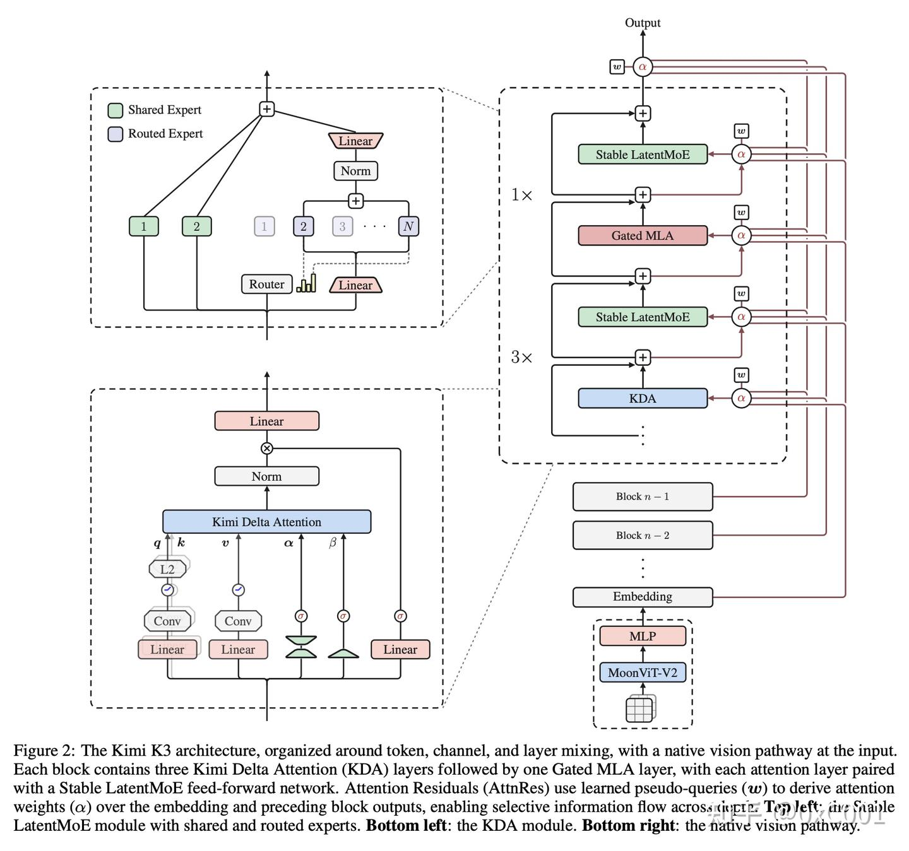

<!-- ===== source: README.md ===== -->

# Kimi K3 技术报告 · 系统化拆解（面向初学者）

> 本目录是对 [`../k3_tech_report.pdf`](../k3_tech_report.pdf)（*Kimi K3: Open Frontier Intelligence — Technical Report*，47 页）的**逐点精读与拆解**。
>
> 目标：让一个**人工智能初学者**也能读懂这份报告里汇报的**每一个技术细节**——不仅知道"他们做了什么"，还知道**"为什么要这么做"（设计目的）**、**"解决了什么问题"** 以及 **"意义在哪里"**。
>
> 每一个架构创新点都配有一份**可运行的、无优化的 PyTorch 小 demo**（放在各章的 `code/` 目录），把论文公式变成你能亲手跑起来、能看到输出的代码。

---

## 0. 这份报告在讲什么？（30 秒速览）

Kimi K3 是一个 **2.8 万亿（2.8T）总参数、1040 亿（104B）激活参数**的**混合专家（MoE）**大模型，**原生支持视觉**，**上下文窗口 100 万（1M）token**。它号称是"世界上第一个开放权重的 3T 级别模型"。

它的核心卖点可以浓缩成一句话：**沿着三个维度扩展"信息流动"**：

| 维度 | 机制 | 一句话解释 | 对应代码 |
|---|---|---|---|
| **序列方向**（token 之间） | Hybrid Attention = **KDA** + **Gated MLA** | 大部分层用便宜的线性注意力（KDA）做局部/近因混合，每 4 层插 1 层全局注意力（MLA）做全局检索 | [`kda.py`](01_architecture/code/kda.py), [`gated_mla.py`](01_architecture/code/gated_mla.py) |
| **深度方向**（层与层之间） | **Attention Residuals (AttnRes)** | 每一层不再只看"前一层的累加和"，而是用注意力去**挑选**读取所有前面层的输出 | [`attention_residuals.py`](01_architecture/code/attention_residuals.py) |
| **宽度方向**（通道/专家之间） | **Stable LatentMoE** | 把专家池扩到 896 个、每 token 激活 16 个，用归一化 + SiTU-GLU + Quantile Balancing 稳住训练 | [`latent_moe.py`](01_architecture/code/latent_moe.py) |

再加上**原生视觉编码器 MoonViT-V2**、**Per-Head Muon 优化器**、精修的数据与训练配方，最终相比上一代 Kimi K2 拿到了**约 2.5× 的整体"扩展效率"提升**。

---

## 1. 目录结构与阅读路线

```
analysis/
├── README.md                     ← 你在这里（总入口 / 导航 / 阅读路线）
├── 00_overview.md                ← 全局概览：三轴框架、关键数字、K2→K3 对比表
│
├── 01_architecture/              ← 【模型架构】最核心、代码最多的一章
│   ├── README.md                 ← 架构章导航
│   ├── 01_hybrid_attention_kda.md      §2.1.1 Kimi Delta Attention
│   ├── 02_gated_mla.md                 §2.1.2 Gated MLA + NoPE
│   ├── 03_attention_residuals.md       §2.2   Attention Residuals
│   ├── 04_stable_latentmoe.md          §2.3   Stable LatentMoE 总览
│   ├── 05_situ_glu_and_quantile_balancing.md  §2.3.2/2.3.3 SiTU-GLU + QB
│   ├── 06_native_vision_moonvit.md     §2.4   原生视觉 MoonViT-V2
│   ├── 07_per_head_muon.md             §2.5   Per-Head Muon
│   └── code/                     ← 8 个可运行 demo + run_all.py
│
├── 02_pretraining/               ← 【预训练】数据、Scaling Law、配方、长上下文
│   ├── README.md
│   ├── 01_pretraining_data.md          §3.1
│   ├── 02_scaling_law.md               §3.2
│   ├── 03_training_recipe.md           §3.3
│   └── 04_long_context_extension.md    §3.4
│
├── 03_posttraining/              ← 【后训练】SFT / RL / 蒸馏 / 量化 / RL 环境
│   ├── README.md
│   ├── 01_sft.md                       §4.1.1
│   ├── 02_reinforcement_learning.md    §4.1.2
│   ├── 03_mopd_distillation.md         §4.1.3
│   ├── 04_deployment_aware_qat.md      §4.1.4（MXFP4 QAT + EAGLE-3 草稿模型）
│   ├── 05_rl_environments.md           §4.2   RL 任务合成与智能体环境
│   └── code/                     ← MOPD 奖励 / MXFP4 量化 / LK 损失 demo
│
├── 04_infrastructure/            ← 【基础设施】KDA 系统、MoonEP、显存、RL、推理
│   ├── README.md
│   ├── 01_kda_systems_and_cp.md        §5.1
│   ├── 02_moonep_balanced_moe.md       §5.2.1
│   ├── 03_memory_efficient_training.md §5.2.2 / §5.2.3
│   ├── 04_agentic_rl_and_sandbox.md    §5.3
│   ├── 05_inference_serving.md         §5.4
│   └── code/                     ← KDA 上下文并行 / MoonEP 规划 demo
│
├── 05_evaluation_and_cases.md    ← 【评测与案例】主结果、成本效率、案例研究
│
└── 99_appendix/                  ← 【附录】数学推导 + 术语表
    ├── 01_situ_glu_math.md             附录 B
    ├── 02_quantile_balancing_derivation.md  附录 C
    ├── 03_histogram_quantile.md        附录 D
    ├── 04_moonep_proof.md              附录 E
    ├── 05_chat_template_xtml.md        附录 F
    └── glossary.md                     ← 术语表（不懂的词先来这里查）
```

### 推荐阅读路线

- **完全新手**：先读 [`00_overview.md`](00_overview.md) 建立全局观 → 再读 [`99_appendix/glossary.md`](99_appendix/glossary.md) 扫一眼术语 → 然后从 [`01_architecture/`](01_architecture/) 开始，一边读 md 一边跑对应的 `code/*.py`。
- **想理解架构创新**：直接进 [`01_architecture/`](01_architecture/)，每个 md 都是"问题 → 直觉 → 公式 → 代码 → 意义"五段式。
- **关心工程/系统**：读 [`04_infrastructure/`](04_infrastructure/)。
- **关心训练方法/RL**：读 [`03_posttraining/`](03_posttraining/)。

---

## 2. 如何运行代码 demo

所有 demo 都是**纯 CPU、无需 GPU、无需下载模型**的教学版实现，只依赖 PyTorch。

```bash
# 一次性安装（CPU 版 torch 即可）
pip install torch --index-url https://download.pytorch.org/whl/cpu

# 运行单个 demo（每个文件都能独立运行，带自检 assert）
cd 01_architecture/code
python kda.py                 # Kimi Delta Attention
python gated_mla.py           # Gated MLA
python attention_residuals.py # Attention Residuals
python situ_glu.py            # SiTU-GLU 激活
python latent_moe.py          # Stable LatentMoE
python quantile_balancing.py  # 负载均衡
python moonvit_v2.py          # 视觉编码器
python per_head_muon.py       # Per-Head Muon 优化器
python assemble_block.py      # 把以上拼成一个 K3 backbone

# 或者一键全跑
python run_all.py
```

每个 demo 都会打印形状、因果性、数值边界等**自检结果**，并在最后打印 `... sanity checks passed`。

---

## 3. 一份"忠于原文"的承诺与免责声明

- **忠于原文**：本拆解严格依据报告正文与附录，尽量不丢失信息；所有关键公式、超参（如 `g_min=-5`、`β1=4, β2=25`、`896/16` 专家、`93` 层 = `69 KDA + 24 MLA` 等）都来自原文。涉及推测/简化之处均已显式标注。
- **教学 ≠ 生产**：`code/` 里的实现是**为了讲清原理**的**无优化**版本（例如 KDA 用显式 Python 循环写递推，真实系统用的是 FlashKDA 分块核）。它们能跑、能验证性质，但**不是**高性能实现。
- **本报告设定于 2026 年**，其中出现的对比模型（Claude Fable 5、GPT-5.6 Sol、GLM-5.2 等）与基准分数均照原文转述，不代表现实世界已有的产品。

> 下一步：打开 [`00_overview.md`](00_overview.md) 开始全局概览，或直接跳到 [`01_architecture/README.md`](01_architecture/README.md)。


---

<!-- ===== source: 00_overview.md ===== -->

# 00 · 全局概览：Kimi K3 是什么，为什么这么设计

> 对应报告：Abstract、§1 Introduction、§2 开头、§3.2 Table 1。
>
> 读完本篇你会得到：(1) 一张"从上到下"的全局地图；(2) 所有关键数字；(3) 理解全篇的**核心叙事框架——"沿三个维度扩展信息流动"**。

---

## 1. 背景：大模型有"两条扩展轴"

报告开篇提出一个非常重要的框架。过去很多年，"扩展（scaling）"主要指**第一条轴**：

> **轴 1 · 预训练规模**：用更多算力、更大模型、更多数据，在**部署前**把模型练得更强。

近两年出现了**第二条轴**：

> **轴 2 · 测试时计算（test-time compute）**：让模型在**回答问题时**多想（推理链、思考预算）、多用工具、多轮交互。代表作有 OpenAI o 系列、Anthropic 的 extended-thinking、DeepSeek-R1、Kimi K1.5、以及把"串行推理"扩展成"并行多智能体协作"的 Kimi K2.5 Agent Swarm。

**报告指出的痛点**：开源社区在**轴 2** 上追得很快，但在**轴 1** 上进展缓慢——大多数开源模型还停留在 1T 参数级别附近。如果大家都在相似规模的底座上卷 RL/推理，开源模型之间会趋同，而与最强闭源系统的差距会拉大。

**Kimi K3 的选择**：**两条轴一起推到前沿**——把预训练底座扩到史无前例的 **3T 级别**，同时在 **1M 上下文**下扩展 RL、推理努力（reasoning effort）和长程交互。

---

## 2. 关键数字（报告 §2 Model Summary + Table 1）

| 项目 | 数值 |
|---|---|
| 架构 | Mixture-of-Experts (MoE) |
| **总参数** | **2.8T（2.78T）** |
| **激活参数**（每 token 实际参与计算） | **104B（104.2B）** |
| 层数 | **93**（其中 1 层 dense） |
| 注意力层构成 | **69 层 KDA + 24 层 Gated MLA** |
| 注意力隐藏维 | 7168 |
| 注意力头数 | 96 |
| **Latent MoE 维度** | 3584（= 0.5 × 隐藏维） |
| 每个专家的 MoE 隐藏维 | 3072 |
| **路由专家总数** | **896** |
| **每 token 选中专家数** | **16** |
| 共享专家数 | 2 |
| 词表大小 | 160K |
| **上下文长度** | **1,048,576（1M）** |
| 注意力机制 | KDA & Gated MLA |
| 激活函数 | **SiTU-GLU** |
| 视觉编码器 | **MoonViT-V2**（401M 参数，27 层，patch=14，12 头） |
| 量化 | **权重 MXFP4 / 激活 MXFP8**（量化感知训练 QAT） |
| 模态 | 文本、图像（原生多模态；训练时也含视频） |
| MTP 层 | 1 层（用于推测解码/EAGLE-3 草稿模型） |

**稀疏度**：896 / 16 = **56**（意思是每个 token 只用到了专家池的约 1/56）。

---

## 3. 核心框架：沿三个维度扩展"信息流动"

这是理解**整个架构章（§2）** 的钥匙。Kimi K3 把 Transformer 里"信息如何流动"拆成三个正交方向，各用一个专门机制去扩展：

```
                          ┌─────────────────────────────────────────┐
   一个 token 的表示 x ───►│  ① 序列方向：和别的 token 交换信息          │  Hybrid Attention
                          │     KDA（便宜/近因） + MLA（全局，每4层1次）│  §2.1
                          ├─────────────────────────────────────────┤
                          │  ② 深度方向：和别的“层”交换信息             │  Attention Residuals
                          │     用注意力挑选读取所有前面层的输出         │  §2.2
                          ├─────────────────────────────────────────┤
                          │  ③ 宽度方向：和别的“通道/专家”交换信息       │  Stable LatentMoE
                          │     896 专家选 16，稀疏地做通道混合          │  §2.3
                          └─────────────────────────────────────────┘
```

- **① 序列方向（token mixing）**：谁和谁"说话"。经典 Transformer 用 softmax 注意力，代价随序列长度平方增长。KDA 用固定大小的"记忆矩阵"把代价压成线性；MLA 保留全局能力但压缩了 KV 缓存。二者按 **3:1** 交替。
- **② 深度方向（layer mixing）**：底层的信息如何往上传。经典残差连接把所有历史压成"一个累加和"（像 RNN 的瓶颈）。AttnRes 让每层用注意力**主动挑选**读哪几层。
- **③ 宽度方向（channel mixing）**：一个 token 内部不同"特征通道"如何组合、以及交给哪个"专家"处理。LatentMoE 把专家扩到 896 个，同时用一个更窄的 latent 空间让"多激活专家"依然负担得起。

> **一句话记忆**：*token（横向）× 层（纵向）× 专家（内部）——三个方向都从"被动累加"升级成"主动、数据驱动的选择"。*

**视觉是"第 0 维输入"**：图像/视频先经 MoonViT-V2 编码，再由一个轻量投影器映射进同一个 token 流，和文本共享 backbone（§2.4）。

这些改动叠加精修的数据与训练配方，带来相对 Kimi K2 **约 2.5× 的整体扩展效率**提升（§3.2, Fig. 7）。

---

## 4. Kimi K2 → K3 架构对比（报告 Table 1）

这张表非常直观地展示了"K3 到底改了什么"：

| 维度 | Kimi K2 | Kimi K3 | 变化 |
|---|---|---|---|
| 架构 | MoE | MoE | – |
| 层数 | 61 | **93** | ↑52% |
| 总参数 | 1.04T | **2.78T** | ↑167% |
| 激活参数 | 32.6B | **104.2B** | ↑220% |
| 隐藏维 | 7,168 | 7,168 | = |
| Latent MoE 维度 | –（无） | **3584（0.5×）** | 新增 |
| 每专家 MoE 隐藏维 | 2,048 | 3,072 | ↑50% |
| 路由专家数 | 384 | **896** | ↑133% |
| 每 token 激活专家 | 8 | **16** | ↑100% |
| 共享专家 | 1 | 2 | ↑100% |
| 注意力头 | 64 | 96 | ↑50% |
| dense 层数 | 1 | 1 | = |
| 词表 | 160K | 160K | = |
| **训练上下文长度** | 128K | **1M** | **8×** |
| 注意力机制 | 纯 MLA | **Hybrid KDA–MLA** | 变了 |
| 激活函数 | SwiGLU | **SiTU-GLU** | 变了 |
| 注意力层构成 | 61 MLA | **69 KDA + 24 MLA** | 变了 |
| MTP 层 | 1 | 1 | = |
| 视觉编码器 | 无 | **MoonViT-V2（401M/27 层）** | 新增 |

**如何解读**：K3 相对 K2 主要是"变大 + 变稀疏 + 变混合 + 加视觉 + 加长"：
- **变大**：参数、层数、头数、专家规模全面增长；
- **变稀疏**：专家 384→896、激活 8→16，稀疏度更高（用 LatentMoE + QB 才 hold 得住）；
- **变混合**：注意力从纯 MLA 变成 KDA+MLA 混合；
- **加视觉**：从纯文本变成原生多模态；
- **加长**：训练上下文 128K→1M（8×）。

---

## 5. 整份报告的骨架（你接下来会逐章拆解）

| 报告章节 | 内容 | 本目录对应 |
|---|---|---|
| §1 Introduction | 两条扩展轴、贡献总结 | 本篇 |
| §2 Model Architecture | KDA、MLA、AttnRes、Stable LatentMoE、MoonViT、Per-Head Muon | [`01_architecture/`](01_architecture/) |
| §3 Pre-Training | 数据、Scaling Law、训练配方、长上下文扩展 | [`02_pretraining/`](02_pretraining/) |
| §4 Post-Training | SFT → RL → 多教师蒸馏、量化、RL 环境 | [`03_posttraining/`](03_posttraining/) |
| §5 Infrastructure | KDA 系统、MoonEP、显存优化、RL 基建、推理服务 | [`04_infrastructure/`](04_infrastructure/) |
| §6 Evaluations | 主结果、内部评测、第三方评测、成本效率 | [`05_evaluation_and_cases.md`](05_evaluation_and_cases.md) |
| §7 Case Studies | GPU kernel、编译器、芯片设计、科研、视频 | [`05_evaluation_and_cases.md`](05_evaluation_and_cases.md) |
| 附录 B–F | SiTU-GLU/QB/直方图/MoonEP 证明/Chat 模板 | [`99_appendix/`](99_appendix/) |

**性能定位（报告结论）**：Kimi K3 在长程编码、智能体、知识、推理、视觉任务上达到"前沿水平"；整体略逊于最强闭源模型（Claude Fable 5、GPT-5.6 Sol），但持续优于其评测套件中的其他开源与闭源模型；并且**成本效率**很突出（详见 [`05_evaluation_and_cases.md`](05_evaluation_and_cases.md)）。

> 下一步：进入 [`01_architecture/README.md`](01_architecture/README.md)，开始拆解模型架构——那里是本报告"创新密度"最高、也是配套代码最多的一章。


---

<!-- ===== source: 01_architecture/README.md ===== -->

# 01 · 模型架构（Model Architecture，报告 §2）

> 这是整份报告**创新最密集**的一章，也是本目录**配套代码最多**的一章。报告 §2 开头点明了本章的组织逻辑：**沿序列、深度、宽度三个维度扩展信息流动**（见 [`../00_overview.md`](../00_overview.md) 第 3 节）。

## 本章拆解顺序

| # | 文件 | 报告 | 讲什么 | 配套代码 |
|---|---|---|---|---|
| 1 | [`01_hybrid_attention_kda.md`](01_hybrid_attention_kda.md) | §2.1 / §2.1.1 | Hybrid Attention 总体 3:1 结构；**Kimi Delta Attention（KDA）**：delta 规则 + 通道遗忘门 + 下界衰减 + 全秩门 | [`code/kda.py`](code/kda.py) |
| 2 | [`02_gated_mla.md`](02_gated_mla.md) | §2.1.2 | **Gated MLA**：潜在 KV 压缩 + NoPE（无位置编码）+ 全秩输出门 | [`code/gated_mla.py`](code/gated_mla.py) |
| 3 | [`03_attention_residuals.md`](03_attention_residuals.md) | §2.2 | **Attention Residuals**：把"注意力"用到深度方向；Full 版与 Block 版 | [`code/attention_residuals.py`](code/attention_residuals.py) |
| 4 | [`04_stable_latentmoe.md`](04_stable_latentmoe.md) | §2.3 / §2.3.1 | **Stable LatentMoE** 总览 + Normalized LatentMoE（up 投影前的 RMSNorm） | [`code/latent_moe.py`](code/latent_moe.py) |
| 5 | [`05_situ_glu_and_quantile_balancing.md`](05_situ_glu_and_quantile_balancing.md) | §2.3.2 / §2.3.3 | **SiTU-GLU** 激活（软封顶）+ **Quantile Balancing** 负载均衡（含直方图估计） | [`code/situ_glu.py`](code/situ_glu.py), [`code/quantile_balancing.py`](code/quantile_balancing.py) |
| 6 | [`06_native_vision_moonvit.md`](06_native_vision_moonvit.md) | §2.4 | **原生多模态** + **MoonViT-V2**（从零训练、无 SigLIP、像素洗牌降采样） | [`code/moonvit_v2.py`](code/moonvit_v2.py) |
| 7 | [`07_per_head_muon.md`](07_per_head_muon.md) | §2.5 | **Per-Head Muon**：按头分块正交化 | [`code/per_head_muon.py`](code/per_head_muon.py) |
| — | 汇总 | Fig. 2 | 把以上拼成一个完整 K3 backbone | [`code/assemble_block.py`](code/assemble_block.py) |

## 一张图看懂整个 block（报告 Fig. 2 的文字复现）

报告 Figure 2 描述的架构是这样组织的：

```
                    输入（文本 token  +  视觉 token）
                                │
                          Embedding（也是 AttnRes 的源 b_0）
                                │
     ┌──────────────── 每个 “hybrid block” = 3×[KDA] + 1×[Gated MLA] ───────────────┐
     │                                                                              │
     │   [ KDA 层 ]──►[ Stable LatentMoE ]     （每个注意力层都配一个 LatentMoE FFN）   │
     │   [ KDA 层 ]──►[ Stable LatentMoE ]                                            │
     │   [ KDA 层 ]──►[ Stable LatentMoE ]                                            │
     │   [ Gated MLA 层 ]──►[ Stable LatentMoE ]                                       │
     │                                                                              │
     └──────────────────────────── 重复 23 次 ───────────────────────────────────────┘
                                │
                        [ 末尾额外 1 层 Gated MLA ]（保证最后一层是全局注意力）
                                │
                              Output

     贯穿全程的“纵向连线”：Attention Residuals —— 用可学习伪查询 w 产生权重 α，
     在 embedding 与各“块级输出”之间做深度注意力（图中的 α / w 标记）。
```

- **KDA : MLA = 3 : 1**，再加末尾 1 层 MLA ⇒ 23×(3+1) + 1 = **93 层 = 69 KDA + 24 MLA**（[`code/assemble_block.py`](code/assemble_block.py) 里验证了这个算术）。
- **每个注意力层都紧跟一个 Stable LatentMoE**（宽度方向的稀疏通道混合；全模型只有 1 层是 dense FFN）。
- **AttnRes 是"纵向骨架"**：它替代了普通残差连接，让每层能跨深度检索信息。

> ⚠️ **"block"一词在报告里有两个含义，切勿混淆**：
>
> | 叫法 | 大小 | 出现在 | 用途 |
> |---|---|---|---|
> | **hybrid block**（本页上图） | **4 层** = 3 KDA + 1 MLA | §2.1，重复 23 次 | 描述注意力混合比例 |
> | **AttnRes block** | **12 层**（= 3 个 hybrid block） | §2.2，共 8 块 | 描述深度注意力的聚合粒度 |
>
> 所以 [`03_attention_residuals.md`](03_attention_residuals.md) 里的"8 块 × 12 层"与上图的"重复 23 次"**并不矛盾**，它们是对同一堆 93 层的两种不同分组（Fig. 2 里标注的 `Block n-1` / `Block n-2` 指的是后者，即 AttnRes 的块）。又因 93 不能被 12 整除，末块不满，算上 embedding 共 9 个块级表示。

## 学习建议

每篇 md 都按 **"问题 → 直觉 → 公式（逐符号解释）→ 代码 → 设计意义"** 五段式组织。建议：

1. 先读 md 的"问题/直觉"，明白**为什么需要它**；
2. 打开对应的 `code/*.py`，`python xxx.py` 跑一遍，看自检输出；
3. 回到 md 的"公式"部分，对照代码逐行理解；
4. 最后读"设计意义"，把它放回全局。

> 开始：[`01_hybrid_attention_kda.md`](01_hybrid_attention_kda.md)


---

<!-- ===== source: 01_architecture/01_hybrid_attention_kda.md ===== -->

# 01 · Hybrid Attention 与 Kimi Delta Attention（KDA）

> 对应报告 §2.1 与 §2.1.1 · 配套代码 [`code/kda.py`](code/kda.py)（`python kda.py` 可跑）
>
> 本篇较长，因为 KDA 是 K3 里最"重"的一个机制。请配合代码一起读。

---

## 0. 先看全局：什么是 Hybrid Attention（§2.1）

注意力（attention）负责**序列方向**的信息交换——即"哪个 token 该关注哪个 token"。Kimi K3 不是只用一种注意力，而是**逐层混合两种**：

- **KDA（Kimi Delta Attention）**：一种**线性注意力 / 状态空间**式机制，代价随序列长度**线性**增长，擅长高效的长序列混合、对近因（recency）敏感。
- **Gated MLA**：一种**全局 softmax 注意力**（压缩了 KV 缓存），任意 token 可关注任意 token，做无限制的全局内容交互。

**混合比例 3 : 1**：每个 block 里 **3 层 KDA + 1 层 Gated MLA**，这个模式在整个 backbone 里重复；并且**在 backbone 末尾再额外放 1 层 Gated MLA**，确保**最后一层永远是全局注意力**。

> **为什么要混合？** 纯全局注意力太贵（1M 上下文下 KV 缓存和计算爆炸）；纯线性注意力又缺乏"精确全局检索"能力。3:1 混合 = **大部分用便宜的 KDA 扛长度，少量用 MLA 补全局**，两全其美。位置信息由 KDA 隐式提供，所以 MLA 层可以用 NoPE（下一篇讲）。

---

## 1. KDA 要解决的问题：softmax 注意力太贵

经典 softmax 注意力：为了让第 t 个 token 关注前面所有 token，需要**保存所有历史的 key/value**，并对它们做点积。序列越长，缓存越大、计算越多——这就是所谓 **O(T²) / O(T) KV 缓存**问题。

**线性注意力/状态空间模型的思路**：不要保存所有历史，而是把整个历史**压缩进一个固定大小的"记忆矩阵" `S`**（形状 `d_k × d_v`，和序列长度**无关**）。每来一个新 token：

1. 用它去**更新** `S`（写入新信息）；
2. 用它的 query 去 `S` 里**读出**答案。

这样内存是 **O(1)**（相对序列长度），计算是 **O(T)**。KDA 就是一种设计得特别好的"如何更新 `S`"的配方。

> 代码里 [`kda.py`](code/kda.py) 的自检 `[fixed state]` 就在证明这一点：无论 `T=16` 还是 `T=512`，递归状态 `S` 的形状恒为 `(B, h, d_k, d_v)`。

---

## 2. KDA 的核心：delta 规则 + 通道遗忘门

KDA 把两个经典想法组合起来：

### (a) Delta 规则（delta rule）—— 写入时先擦掉旧值

朴素线性注意力只会不断"累加"：`S ← S + k vᵀ`。问题是同一个"键"反复出现时，旧信息会堆积、互相干扰。**Delta 规则**借鉴了误差修正：写入新值 `v` 时，先看看当前记忆对这个键 `k` 的"预测值"是多少，只写入**预测误差**（delta）。这样记忆里对同一个键始终保持"最新"的值，而不是一堆旧值的叠加。

### (b) 通道遗忘门（channel-wise forget gate）—— 让记忆会"淡忘"

即使有 delta 规则，无关的旧信息也应该慢慢衰减。KDA 给记忆矩阵的**每一个 key 通道**配一个独立的**保留因子 `α`**（在 0~1 之间），每步把状态按通道缩放一下——`α` 越接近 1 保留越久，越接近 0 忘得越快。因为是**逐通道（channel-wise）**的，不同特征可以有不同的"记忆时长"。

### 递推公式（报告 Eq. 1）

对单个注意力头，设 query/key `qₜ, kₜ ∈ ℝ^{d_k}`，value `vₜ ∈ ℝ^{d_v}`，记忆 `Sₜ ∈ ℝ^{d_k×d_v}`：


$$
S_t = \big( I - \beta_t k_t k_t^\top \big)\,\mathrm{Diag}(\alpha_t)\, S_{t-1} + \beta_t k_t v_t^\top, \qquad \tilde o_t = S_t^\top q_t .
$$


逐符号解释：
- `αₜ ∈ (0,1)^{d_k}`：**通道级一步保留因子**（遗忘门）。`Diag(αₜ) S_{t-1}` = 把 `S` 的每一行按 `α` 缩放（先遗忘）。
- `βₜ ∈ (0,1)`：**delta 规则写入强度**（这个头一个标量）。
- `(I − βₜ kₜ kₜᵀ)`：delta 规则的"擦除"算子——先抹掉旧的、与 `kₜ` 相关的记忆，再写新的。
- `õₜ = Sₜᵀ qₜ`：用 query 从更新后的记忆里读出输出。

### 把它变直观：等价的 delta-rule 形式

上面的公式看着吓人，其实做一点代数就变得非常好懂（这也是 [`kda.py`](code/kda.py) 里实际实现的形式）。令 `S_decayed = Diag(αₜ) S_{t-1}`（先遗忘），则：

$$
S_t = S_{\text{decayed}} + \beta_t\, k_t\,(v_t - S_{\text{decayed}}^\top k_t)^\top
$$

翻译成大白话，每来一个新 token：
1. **遗忘**：`S_decayed = αₜ ⊙ S`（逐行按通道缩放）；
2. **预测**：`pred = S_decayedᵀ kₜ` —— 当前记忆对这个键会读出什么值；
3. **写误差**：`Sₜ = S_decayed + βₜ · kₜ ⊗ (vₜ − pred)` —— 只把"真实值 − 预测值"这个误差写进去；
4. **读出**：`õₜ = Sₜᵀ qₜ`。

> 对照 [`kda.py`](code/kda.py) 第 3 步的 Python 循环，每一行注释都对应上面 1~4 步。这个显式循环就是"无优化、易读"的 KDA。

---

## 3. 输入投影：q/k/v/β/α 是怎么算出来的（报告 Eq. 2）

> **报告 Figure 2 架构总览**（左下角为 KDA 模块，即本节所述的输入投影）：
>
> 
>
> 图中左下角 KDA 模块：从 Norm 出来的 $x_t$ 分四条分支——q/k（Linear→Conv→Swish→L2Norm）、v（Linear→Conv→Swish）、β（Linear→σ）、α（低秩 Linear→σ→exp，经 $z_t$ 中转）。注意图中右侧 AttnRes 的 $\alpha$（深度注意力权重）与 KDA 内部的 $\alpha$（通道遗忘门）是不同符号复用。

KDA 沿用 Kimi Linear 的参数化。给定隐藏状态 `xₜ`：

$$
\begin{aligned} q_t^h, k_t^h &= \mathrm{L2Norm}\big(\mathrm{Swish}(\mathrm{ShortConv}(W_{q/k}^h x_t))\big) \in \mathbb{R}^{d_k},\\ v_t^h &= \mathrm{Swish}\big(\mathrm{ShortConv}(W_v^h x_t)\big) \in \mathbb{R}^{d_v},\\ \beta_t^h &= \mathrm{Sigmoid}(W_\beta^h x_t) \in (0,1),\\ z_t^h &= W_\alpha^{\uparrow} W_\alpha^{\downarrow} x_t + b_\alpha^h \in \mathbb{R}^{d_k}\quad(\text{衰减 logit，低秩}). \end{aligned}
$$

- **ShortConv（短卷积）**：一个**逐通道、因果**的 1D 卷积（窗口很小，如 4）。它让每个 token 在进入递推前先"瞄一眼"左边几个邻居——必要性见下面 §3.5。因果 = 左侧 padding，绝不看未来。
- **Swish** `= x·sigmoid(x)`（即 `F.silu`），平滑激活。
- **L2Norm**：只对 q、k 做，把它们归一化到单位球面，控制数值范围。
- **βₜ**：sigmoid 保证在 (0,1)。
- **`zₜ`（衰减 logit）**：用**低秩**投影（先降维 `W↓` 再升维 `W↑`）+ 一个**每头偏置 `b_α`** 算出，参数省。它接下来会被映射成遗忘因子 `α`。

> 代码：[`kda.py`](code/kda.py) 的 `ShortConv` 类 + `forward` 第 1、2 步。低秩衰减用 `W_down_a`/`W_up_a` 实现。

---

## 3.5 为什么线性注意力需要 ShortConv？（必要性剖析）

报告只说"沿用 Kimi Linear 的参数化"，但 ShortConv 不是锦上添花，而是这一族模型（H3 → Mamba → GLA/RWKV → DeltaNet → KDA）的**标配组件**。它补的是线性注意力**先天缺失的"精确局部操作"能力**。

### (a) 先看线性注意力弱在哪

softmax attention 的检索是**逐位置、锐利的**：`softmax(q_t·k_j)` 可以把注意力几乎 100% 打到某一个特定位置上，所以"看一眼上一个 token"、"精确比对邻居"这类操作是免费的。

线性注意力把全部历史压进一个固定大小的状态 `S`，检索是 `o_t = Sᵀ q_t`——本质上是**对所有历史 value 的一次软加权混合**。它有两个结构性短板：

- **检索是"糊"的**：`S` 的秩最多 `d_k`，无法做位置精确的单点读取。想"精确取上一个 token 的信息"，状态做不到——它只能给你一个所有相似 key 的加权平均；
- **q/k/v 只由当前 token 决定**：`k_t = W_k x_t` 是单 token 的函数。递推更新里"写什么、擦什么"完全由**孤立的当前 token** 说了算，看不到局部语境。

### (b) ShortConv 干的事：进递推之前，先把"左边 3 个邻居"焊进特征里

窗口为 4 的因果 depthwise 卷积让 `q_t/k_t/v_t` 从"单 token 的函数"变成"**最近 4 个 token 的函数**"。这一下补掉好几件事：

1. **局部 n-gram 模式不再挤占递归状态**。语言里大量信息是局部的（词组、搭配、BPE 把一个词切成几片）。没有 conv，这些局部模式只能靠宝贵的固定大小状态 `S` 去记；有了 conv，**局部的事 conv 管，状态 `S` 专心存长程信息**——conv = 高保真短程通道，递归 = 有损长程通道，各干各的。
2. **让归纳头（induction head）在单层内可实现**。in-context 学习的核心机制是"…A B … A → 预测 B"，实现它需要 key 里编码**前一个 token** 的信息（用"上次 A 后面跟了什么"去匹配）。softmax attention 可以靠两层精确复合出来；线性注意力的糊检索很难做这种复合。ShortConv 直接让 `k_t` 天然携带 `x_{t-1}, x_{t-2}...` 的特征，**一层就能形成归纳头式的匹配**。这也是 RWKV 的 token-shift、H3/Mamba 的 conv1d、DeltaNet 全都带这个组件的共同原因——在 MQAR 这类联想召回基准上，去掉 conv 的消融普遍显著掉点。
3. **对 KDA 的 delta 规则尤其重要：擦除决策需要语境**。`M_t = (I − β_t k_t k_tᵀ)Diag(α_t)` 里，`k_t` 决定**擦掉状态里的哪个方向**。如果 `k_t` 只看当前 token，"擦什么"的决策就是断章取义的；conv 之后，擦除方向由局部语境共同决定，delta 规则"先擦再写"的定点更新才准。

### (c) 代价上"划算到没有理由不加"

- **计算**：depthwise、窗口 4，FLOPs 相对投影矩阵可忽略不计；
- **推理状态**：decode 时每通道只需缓存 `kernel_size − 1 = 3` 个历史输入，相对 `S (d_k×d_v)` 九牛一毛。推理章也提到，K3 的融合 decode kernel 把**短卷积**和 KDA 递归、门控放在同一个 kernel 里跑（[`../04_infrastructure/05_inference_serving.md`](../04_infrastructure/05_inference_serving.md) §2）；
- **对 CP/KCP 也无害**：conv 窗口只有 4，跨段边界只需传 3 个 token 的输入（或直接少量 halo 重算），不影响"固定大小通信"的结论（[`../04_infrastructure/01_kda_systems_and_cp.md`](../04_infrastructure/01_kda_systems_and_cp.md)）。

> **一句话总结**：线性注意力用一个固定大小、只能糊读的状态换掉了 KV cache，代价是**丢了 softmax attention 免费自带的精确局部比对能力**；ShortConv 用几乎为零的成本把这块短板从旁路补回来——局部模式走卷积、长程记忆走递归。所以它不是可选项，而是这一族模型的标配。

---

## 4. 分块并行形式（chunkwise，报告 Eq. 3–4）—— 为了在 GPU 上快

逐 token 的递推**在数学上正确、但在 GPU 上慢**（GPU 喜欢大块并行，不喜欢一步一步的串行）。所以真实实现用**分块（chunkwise）**形式：**块内并行、块间串行**。

把序列切成大小为 `C` 的块。定义**通道级累积衰减** `γ`（块内从位置 i 到 j 的 `α` 连乘）。则块 `t` 的输出可以并行算出（报告 Eq. 4）：

$$
O_{[t]} = \underbrace{(\Gamma^{1\to C}_{[t]} \odot Q_{[t]})\,S_{[t]}}_{\text{块间（继承前面）}} + \underbrace{A_{[t]}\,\tilde V_{[t]}}_{\text{块内（当前块内部）}}
$$

- 第一项：把进入本块的状态 `S_{[t]}` 传播过来（跨块信息）；
- 第二项：本块内部 token 之间的相互作用，`A_{[t]} = Tril[(Q⊙Γ)(K/Γ)ᵀ]` 是一个**下三角因果掩码**矩阵。

> 教学代码没有实现分块（用的是最直观的逐 token 循环），但理解"块内并行、块间串行"对读懂基础设施章（[`../04_infrastructure/01_kda_systems_and_cp.md`](../04_infrastructure/01_kda_systems_and_cp.md) 里的 FlashKDA）很关键。

---

## 5. ⭐ K3 的关键创新：下界衰减（Lower-bounded decay，报告 Eq. 5）

这是 K3 相对上一代 Kimi Linear 在 KDA 上**最重要的改动**，直接为"更快的 GPU kernel"服务。

### 问题：倒数缩放会溢出

Eq. 4 里那个 `K/Γ`（键除以累积衰减）会出事：`Γ` 是一堆 (0,1) 之间的数连乘，会**非常小**；那么 `1/Γ` 就会**非常大**，在有限精度（如 BF16）下**溢出**。

Kimi Linear 的旧做法用一个**无下界**的映射（negative-Softplus）：`g = −e^A · Softplus(z) ∈ (−∞, 0)`。衰减 log 可以趋向 `−∞`，于是不得不把块再切成 16-token 的小 tile、在对角 tile 上做昂贵的"逐位置对"计算，成为块内主要瓶颈。

### K3 的解法：用缩放 sigmoid 给 log 衰减一个下界

$$
g_t^h = g_{\min}\,\mathrm{Sigmoid}(e^{A_h} z_t^h) \in (g_{\min},\,0)^{d_k}, \qquad \alpha_t^h = \exp(g_t^h) \in (e^{g_{\min}},\,1)^{d_k}.
$$

- `A_h`：**可学习的每头 log 尺度**，初始化为 0。
- **`g_min = −5`（固定）**：这是关键常数。它保证每个保留因子 `α > e^{−5} ≈ 6.7×10⁻³`，绝不会衰减到 0。
- 于是 16-token tile 上的累积 log 衰减落在 `(−80, 0)`，对应的倒数缩放 `< e^{80}`，**稳稳落在 BF16 动态范围内**。

**收益（报告原话）**：这个有限范围让**对角和非对角 tile 都能用稠密的 Tensor Core 矩阵乘**，**彻底消除了昂贵的"逐位置对"对角路径**。也就是说，一个看似很小的数学改动（换一个映射函数），换来了**显著的 kernel 加速**。

> 代码：[`kda.py`](code/kda.py) 第 2 步 `g = g_min * sigmoid(exp(A) * z); alpha = exp(g)`。注意是 **`exp(A)`**——`A_h` 是**对数尺度**且初始化为 0，因此初始时 `exp(A_h)=1`、衰减 logit `z` 原样通过；若误写成 `A * z`，初始时 logit 恒为 0，`α` 会退化成常数 `e^{-2.5} ≈ 0.082`，通道遗忘门彻底失效。自检 `[bounded decay]` 验证 `α ∈ (0.02, 0.37) > e^{-5} = 0.0067`（下界成立），`[data-dependent decay]` 验证 `std(α) > 0`（`α` 确实随 token/通道变化）。

---

## 6. 全秩输出门（Full-rank gate，报告 Eq. 6）

最后，KDA 对递归输出先做**头级 RMSNorm**，再做**数据依赖的全秩输出门控**：

$$
y_t = W_o\big[\mathrm{Sigmoid}(W_g x_t) \odot \mathrm{RMSNorm}(\tilde o_t)\big].
$$

- `Sigmoid(W_g xₜ)`：一个由**当前 token 决定**的门（0~1），逐通道地决定"从记忆读出的哪些通道要保留"。
- **全秩（full-rank）**：Kimi Linear 里这个门是低秩的，K3 改成了**输入依赖的全秩投影**，表达力更强（MLA 层也用了同款全秩门，见下一篇）。

> 代码：[`kda.py`](code/kda.py) 第 4 步。

---

## 7. 跑一遍代码，看它"言行一致"

```bash
cd 01_architecture/code && python kda.py
```

自检输出（节选）及其含义：

| 自检项 | 输出含义 | 印证的性质 |
|---|---|---|
| `[shapes]` | 输入 `(2,16,64)` → 输出 `(2,16,64)` | KDA 是保形的序列到序列映射 |
| `[fixed state]` | **真跑** `T=16` 与 `T=512` 两次前向，递归状态形状都是 `(2,4,16,16)` | **记忆大小与序列长度无关**（线性注意力的本质） |
| `[causality]` | 改动后半段输入，前半段输出零变化 | **严格因果**（不看未来） |
| `[bounded decay]` | `alpha ∈ (0.02, 0.37)，全部 > 0.0067` | **下界衰减**（§5）成立 |
| `[data-dependent decay]` | `std(alpha) ≈ 0.047 > 0` | 遗忘门**逐 token/通道变化**，不是死常数 |

---

## 8. 设计意义小结

| 组件 | 解决什么 | 意义 |
|---|---|---|
| 线性递归 `S` | softmax 的 O(T) KV 缓存 | 1M 上下文可负担 |
| Delta 规则 | 旧信息堆积 | 记忆保持"最新值"，减少干扰 |
| 通道遗忘门 `α` | 无关旧信息 | 逐通道可控的"记忆时长" |
| **下界衰减 `g_min=−5`** | 倒数缩放溢出、对角 tile 慢 | **让整个 kernel 走 Tensor Core，显著加速**（算法-系统协同设计） |
| 全秩输出门 | 表达力 | 每 token 自主选择读出通道 |
| 3:1 与 MLA 混合 | 纯线性缺全局能力 | 便宜地扛长度 + 少量全局检索 |

> 下一篇：[`02_gated_mla.md`](02_gated_mla.md) —— 负责"全局检索"的那 1/4 层。

---

## 9. 代码demo

``` python

"""
Kimi Delta Attention (KDA) — minimal, un-optimized PyTorch demo for LEARNING.
=============================================================================

This file implements KDA from the Kimi K3 technical report (§2.1.1) in the
simplest possible way: a plain token-by-token recurrence. It is NOT fast and is
NOT what runs in production (the real thing uses the chunkwise "FlashKDA" kernel,
see analysis/04_infrastructure). The goal here is to make every symbol in the
paper's equations concrete and runnable so a beginner can *see* what happens.

--------------------------------------------------------------------------------
The core idea in one paragraph
--------------------------------------------------------------------------------
Standard (softmax) attention keeps EVERY past key/value around and re-reads them
for every new token -> memory & compute grow with sequence length. A "linear
attention" / state-space model instead squeezes the whole past into a single
fixed-size matrix state S (shape d_k x d_v). Each new token updates S and reads
from S. KDA is a particularly good recipe for that update: it combines

  1. a *delta rule* (write the NEW value while erasing the OLD stored value for
     this key, so memory does not just pile up), and
  2. a *channel-wise forget gate* alpha (each of the d_k key-channels decays at
     its own learned rate, so the state can forget stale information).

The recurrence (Eq. 1 of the report), for one attention head:

    S_t = (I - beta_t k_t k_t^T) Diag(alpha_t) S_{t-1} + beta_t k_t v_t^T
    o_t = S_t^T q_t

  * alpha_t in (0,1)^{d_k} : per-channel one-step "retention" (how much to keep)
  * beta_t  in (0,1)       : delta-rule "write strength"
  * S_t     in R^{d_k x d_v}: the recurrent memory (fixed size! independent of T)

We rearrange it into the intuitive delta-rule form (algebra shown in the .md):

    S_decayed = Diag(alpha_t) S_{t-1}          # forget: scale each row by alpha
    pred_t    = S_decayed^T k_t                # what memory currently predicts for k_t
    S_t       = S_decayed + beta_t * outer(k_t, v_t - pred_t)   # write the error
    o_t       = S_t^T q_t                      # read with the query

Run me:  python kda.py
"""

import torch
import torch.nn as nn
import torch.nn.functional as F


# --------------------------------------------------------------------------- #
# Small building blocks used by KDA's input projections (Eq. 2)
# --------------------------------------------------------------------------- #
def l2norm(x, dim=-1, eps=1e-6):
    """L2 normalization. KDA applies this to q and k so their scale is controlled."""
    return x / (x.norm(dim=dim, keepdim=True) + eps)


class RMSNorm(nn.Module):
    """Root-Mean-Square LayerNorm (no mean subtraction). Cheap & widely used in LLMs."""
    def __init__(self, dim, eps=1e-6):
        super().__init__()
        self.weight = nn.Parameter(torch.ones(dim))
        self.eps = eps

    def forward(self, x):
        rms = x.pow(2).mean(dim=-1, keepdim=True).add(self.eps).rsqrt()
        return x * rms * self.weight


class ShortConv(nn.Module):
    """
    'ShortConv' = a depthwise, CAUSAL 1D convolution over a short window (kernel_size).
    Each channel is convolved independently (groups == channels). It lets each token
    peek at a few immediate neighbors *before* entering the recurrence, which linear-
    attention models find helpful. Causal = we left-pad so token t never sees t+1.
    """
    def __init__(self, dim, kernel_size=4):
        super().__init__()
        self.kernel_size = kernel_size
        self.conv = nn.Conv1d(dim, dim, kernel_size, groups=dim, bias=True)

    def forward(self, x):                       # x: (B, T, D)
        x = x.transpose(1, 2)                   # -> (B, D, T)
        x = F.pad(x, (self.kernel_size - 1, 0)) # causal left-pad on the time axis
        x = self.conv(x)                        # -> (B, D, T)
        return x.transpose(1, 2)                # -> (B, T, D)


# --------------------------------------------------------------------------- #
# The KDA layer
# --------------------------------------------------------------------------- #
class KimiDeltaAttention(nn.Module):
    """
    A single KDA layer, multi-head, written as an explicit recurrence for clarity.

    Key design points from the report that this demo reproduces:
      * per-channel decay alpha comes from a LOW-RANK projection of x plus a
        per-head bias, mapped through a *lower-bounded* scaled sigmoid (Eq. 5)
              g = g_min * sigmoid(exp(A) * z),   alpha = exp(g)  in (e^{g_min}, 1)
        With g_min = -5, alpha stays above ~6.7e-3, which keeps the chunkwise
        kernel numerically safe (see the .md and infra notes).
        NOTE the exp(A): A_h is a learnable per-head LOG-scale initialized to 0,
        so exp(A_h) = 1 at init and the decay logit z passes through unchanged.
        (Writing sigmoid(A * z) instead would zero the logit at init and collapse
        alpha to the constant e^{-2.5}, i.e. a dead forget gate.)
      * q, k are ShortConv -> Swish -> L2Norm ; v is ShortConv -> Swish  (Eq. 2)
      * beta = sigmoid(W_beta x)                                          (Eq. 2)
      * output uses a data-dependent FULL-RANK gate (Eq. 6):
              y = W_o [ sigmoid(W_g x) (*) RMSNorm(o) ]
    """

    def __init__(self, d_model, num_heads, d_k=None, d_v=None,
                 conv_size=4, alpha_rank=None, g_min=-5.0):
        super().__init__()
        self.d_model = d_model
        self.h = num_heads
        self.d_k = d_k or (d_model // num_heads)
        self.d_v = d_v or (d_model // num_heads)
        self.g_min = g_min
        inner_k = self.h * self.d_k
        inner_v = self.h * self.d_v
        alpha_rank = alpha_rank or max(8, self.d_k // 2)  # low-rank bottleneck for decay

        # Input projections (Eq. 2)
        self.W_q = nn.Linear(d_model, inner_k, bias=False)
        self.W_k = nn.Linear(d_model, inner_k, bias=False)
        self.W_v = nn.Linear(d_model, inner_v, bias=False)
        self.conv_q = ShortConv(inner_k, conv_size)
        self.conv_k = ShortConv(inner_k, conv_size)
        self.conv_v = ShortConv(inner_v, conv_size)
        self.W_beta = nn.Linear(d_model, self.h, bias=True)          # one beta per head

        # Low-rank decay logit z = W_up (W_down x) + bias  (per head)  (Eq. 2)
        self.W_down_a = nn.Linear(d_model, alpha_rank, bias=False)
        self.W_up_a = nn.Linear(alpha_rank, inner_k, bias=True)
        # A_h: learnable per-head log-scale, initialized to 0 (Eq. 5)
        self.A = nn.Parameter(torch.zeros(self.h, self.d_k))

        # Output: head-wise RMSNorm then full-rank gate (Eq. 6)
        self.o_norm = RMSNorm(self.d_v)
        self.W_g = nn.Linear(d_model, inner_v, bias=False)           # FULL-rank gate
        self.W_o = nn.Linear(inner_v, d_model, bias=False)

    def _shape(self, x, d):                      # (B,T,h*d) -> (B,h,T,d)
        B, T, _ = x.shape
        return x.view(B, T, self.h, d).transpose(1, 2)

    def forward(self, x, return_state=False):
        B, T, _ = x.shape

        # ---- 1. Projections + ShortConv + activations (Eq. 2) -------------- #
        q = l2norm(F.silu(self.conv_q(self.W_q(x))))   # silu == Swish
        k = l2norm(F.silu(self.conv_k(self.W_k(x))))
        v = F.silu(self.conv_v(self.W_v(x)))
        q = self._shape(q, self.d_k)                   # (B,h,T,d_k)
        k = self._shape(k, self.d_k)
        v = self._shape(v, self.d_v)                   # (B,h,T,d_v)
        beta = torch.sigmoid(self.W_beta(x)).transpose(1, 2)          # (B,h,T)

        # ---- 2. Lower-bounded channel-wise decay alpha (Eq. 5) ------------- #
        z = self.W_up_a(self.W_down_a(x))              # (B,T,h*d_k)
        z = self._shape(z, self.d_k)                   # (B,h,T,d_k)
        # Eq. 5: A_h is a learnable per-head LOG-scale, so it enters as exp(A_h).
        g = self.g_min * torch.sigmoid(torch.exp(self.A)[None, :, None, :] * z)  # in (g_min, 0)
        alpha = torch.exp(g)                           # in (e^{g_min}, 1)

        # ---- 3. The recurrence, one token at a time (Eq. 1) ---------------- #
        # This explicit Python loop is the "no-optimization, easy-to-read" version.
        S = x.new_zeros(B, self.h, self.d_k, self.d_v)  # fixed-size state
        outs = []
        for t in range(T):
            a_t = alpha[:, :, t, :].unsqueeze(-1)       # (B,h,d_k,1)
            k_t = k[:, :, t, :].unsqueeze(-1)           # (B,h,d_k,1)
            v_t = v[:, :, t, :].unsqueeze(-1)           # (B,h,d_v,1)
            b_t = beta[:, :, t].view(B, self.h, 1, 1)   # (B,h,1,1)

            S_dec = a_t * S                             # forget: scale rows by alpha
            pred = (S_dec * k_t).sum(dim=2, keepdim=True)          # k^T S_dec -> (B,h,1,d_v)
            delta = v_t.transpose(-1, -2) - pred                  # (B,h,1,d_v)
            S = S_dec + b_t * (k_t @ delta)             # rank-1 delta write
            o_t = (S * q[:, :, t, :].unsqueeze(-1)).sum(dim=2)     # S^T q -> (B,h,d_v)
            outs.append(o_t)

        o = torch.stack(outs, dim=2)                    # (B,h,T,d_v)

        # ---- 4. Head-wise RMSNorm + full-rank output gate (Eq. 6) ---------- #
        o = self.o_norm(o)                              # normalize per head
        o = o.transpose(1, 2).reshape(B, T, self.h * self.d_v)
        y = self.W_o(torch.sigmoid(self.W_g(x)) * o)
        # S is the state after the LAST token: returning it makes the "fixed-size
        # memory" claim checkable (see the sanity checks below).
        return (y, S) if return_state else y


# --------------------------------------------------------------------------- #
# Sanity checks — run to convince yourself it behaves like the paper says.
# --------------------------------------------------------------------------- #
def _demo():
    torch.manual_seed(0)
    B, T, d_model, h = 2, 16, 64, 4
    layer = KimiDeltaAttention(d_model, num_heads=h)
    x = torch.randn(B, T, d_model)
    y = layer(x)
    print(f"[shapes] input {tuple(x.shape)} -> output {tuple(y.shape)}")
    assert y.shape == x.shape, "KDA is a sequence-to-sequence map, shape must be preserved"

    # (a) The state is FIXED SIZE regardless of sequence length -> O(1) memory in T.
    #     Prove it by REALLY running the layer at two very different lengths and
    #     inspecting the state the recurrence carries.
    expected_state = (B, h, layer.d_k, layer.d_v)
    for T_test in (16, 512):
        with torch.no_grad():
            y_t, S_t = layer(torch.randn(B, T_test, d_model), return_state=True)
        print(f"[fixed state] T={T_test:4d} -> output {tuple(y_t.shape)}, "
              f"recurrent state {tuple(S_t.shape)}")
        assert tuple(S_t.shape) == expected_state, "state size must not depend on T!"

    # (b) Causality: output at position t must not depend on inputs > t.
    x2 = x.clone()
    x2[:, T // 2:] += 5.0                       # perturb the second half only
    y2 = layer(x2)
    max_diff_first_half = (y[:, :T // 2] - y2[:, :T // 2]).abs().max().item()
    print(f"[causality] max change in first half after editing 2nd half: {max_diff_first_half:.2e}")
    assert max_diff_first_half < 1e-5, "KDA must be causal!"

    # (c) Lower-bounded decay: every retention factor alpha must exceed e^{g_min}.
    z = layer.W_up_a(layer.W_down_a(x))
    z = z.view(B, T, h, layer.d_k).transpose(1, 2)
    alpha = torch.exp(layer.g_min * torch.sigmoid(torch.exp(layer.A)[None, :, None, :] * z))
    floor = torch.exp(torch.tensor(layer.g_min))
    print(f"[bounded decay] alpha in ({alpha.min().item():.4f}, {alpha.max().item():.4f}) "
          f"-- all above e^(g_min) = {floor.item():.4f}")
    assert alpha.min() > floor

    # (d) ...and alpha must genuinely be DATA-DEPENDENT: a constant alpha would mean
    #     the channel-wise forget gate is dead. (That is exactly what happens if the
    #     exp() around A_h in Eq. 5 is dropped, since A_h starts at 0.)
    print(f"[data-dependent decay] std(alpha) = {alpha.std().item():.4f} "
          f"(must be > 0: the forget gate varies per token & channel)")
    assert alpha.std() > 1e-6, "alpha collapsed to a constant -> forget gate is dead"
    print("All KDA sanity checks passed.")


if __name__ == "__main__":
    _demo()

```


---

<!-- ===== source: 01_architecture/02_gated_mla.md ===== -->

# 02 · Gated MLA（Multi-head Latent Attention）+ NoPE

> 对应报告 §2.1.2 · 配套代码 [`code/gated_mla.py`](code/gated_mla.py)（`python gated_mla.py` 可跑）

---

## 1. 定位：那 1/4 的"全局注意力"层

上一篇讲的 KDA 便宜、擅长局部/近因，但它是"压缩记忆"，不擅长**精确的全局检索**（比如"回到 80 万 token 之前那句话")。所以 K3 每个 block 里放 **1 层 Gated MLA**（占 1/4），负责真正的**任意 token ↔ 任意 token** 全局注意力，另外在末尾再加 1 层保证最后一层是全局的。

MLA 最早出自 DeepSeek-V2，Kimi K2/K2.5 都在用，K3 继续保留并加了两个改动（门控 + NoPE）。

---

## 2. MLA 的核心：把 KV 缓存"压扁"成一个潜在向量

**经典多头注意力的痛点**：推理时要为**每个历史 token** 缓存**每个头的完整 key 和 value**（共 `h·d_k + h·d_v` 个数）。1M 上下文下这个缓存大得惊人。

**MLA 的解法**（"Latent" = 潜在）：
1. 把每个 token **压缩成一个小的潜在向量** `c_t = W_c x_t`（维度 `d_c`，远小于 `h·(d_k+d_v)`）；
2. **只缓存 `c_t`**；
3. 计算注意力时，再用**上投影** `W_uk, W_uv` 从 `c_t` **临时重建**出各头的 key/value。

于是每 token 的 KV 缓存从 `O(h·(d_k+d_v))` 缩到 `O(d_c)`。

> 代码 [`gated_mla.py`](code/gated_mla.py) 的自检 `[cache size / token]` 直接算给你看：demo 里满头 KV 需要 128 个 float，MLA 只存 16 个 → **8× 更小**。（真实 MLA 压缩比更极端。）

**这就是为什么 MLA 既保留了全局注意力能力、又不至于在长上下文下被 KV 缓存压垮。**

---

## 3. 改动一：NoPE（No Position Encoding，无位置编码）

**不同于 K2/K2.5，K3 对所有 MLA 层采用 NoPE**——即**不给 MLA 的 query/key 施加任何显式位置编码**（没有 RoPE 旋转位置编码）。

- **谁来提供位置信息？** 中间夹着的 **KDA 层本身就是位置敏感、近因敏感**的（递归天然带顺序），已经把位置信息注入序列。于是 MLA 层被"解放"出来专做**纯内容匹配**（谁的语义和我相关，不管它在哪）。
- **一个巨大的工程红利**：因为没有 RoPE，**从 8K 扩到 1M 上下文时，完全不需要改动任何位置编码参数**——不用重调 RoPE 频率基、不用 YaRN 插值。这让长上下文扩展（[`../02_pretraining/04_long_context_extension.md`](../02_pretraining/04_long_context_extension.md)）变得异常干净。

> 代码里 `GatedMLA` 完全没有 rotary 相关代码，注释标注了 NoPE。

---

## 4. 改动二：全秩输出门（报告 Eq. 7）

和 KDA 一样，K3 给 MLA 也加了一个**输入依赖、通道级、全秩**的输出门：

$$
y_t = W_o\big[\mathrm{Sigmoid}(W_g x_t) \odot \tilde o_t\big]
$$

- `õ_t`：未门控的 MLA 输出；
- `Sigmoid(W_g x_t)`：让**每个 token** 决定"从全局注意力读出的哪些通道要保留"；
- `W_g` 是**全秩**的，与 K3 里 KDA 的新参数化一致。

---

## 5. 训练细节：注意力输出保持 FP32

报告提到一个数值细节：flash attention 有一种**有偏的舍入误差**。K3 采用 [99] 的方法，**训练时把注意力输出保持在 FP32**。代价是片上（on-chip）输出 tile 的占用翻倍；于是他们**重新设计了训练 kernel**，把它和 KV 暂存缓冲区重叠（而不是和 query tile 重叠），腾出共享内存给更深的 KV 流水线，换来更高训练吞吐。

> 这是"算法正确性（消除有偏舍入）"与"系统效率（重新排布片上内存）"协同的又一例子。教学代码是 CPU 版，不涉及此优化，但作为忠于原文的记录列在此处。

---

## 6. 跑代码看关键性质

```bash
cd 01_architecture/code && python gated_mla.py
```

| 自检项 | 含义 |
|---|---|
| `[cache size / token]` | 潜在缓存比满头 KV 小 8×（demo 值） |
| `[causality]` | 严格因果（带因果掩码的 softmax 注意力） |
| `[cache correctness]` | **逐 token 增量解码（用潜在缓存）与一次性前向结果完全一致**（误差 ~1e-7）——这正是 MLA 推理时能省缓存的根据 |

---

## 7. KDA vs MLA 一句话对比

| | KDA（3/4 层） | Gated MLA（1/4 层 + 末尾 1 层） |
|---|---|---|
| 类型 | 线性注意力 / 递归状态 | 全局 softmax 注意力 |
| 代价 | O(T)，固定大小状态 | 压缩 KV 缓存的全局注意力 |
| 擅长 | 长序列、近因、位置敏感 | 精确全局内容检索 |
| 位置编码 | 隐式（靠递归门控） | **NoPE（无）** |
| 输出门 | 全秩（Eq. 6） | 全秩（Eq. 7） |

> 下一篇：[`03_attention_residuals.md`](03_attention_residuals.md) —— 把注意力从"序列方向"搬到"深度方向"。

---

## 8. 代码demo

``` python
"""
Gated MLA (Multi-head Latent Attention) — minimal PyTorch demo for LEARNING.
============================================================================

From the Kimi K3 report §2.1.2. MLA is the *global* attention used in 1 of every
4 layers (the other 3 are KDA). Where KDA gives cheap, recency-aware, local-ish
mixing, MLA gives unrestricted token-to-token attention so any position can look
at any other position.

Why "Latent"? Classic multi-head attention caches, for every past token, the full
per-head keys and values (h * d_k + h * d_v numbers per token). MLA instead:
    1. compresses each token into ONE small latent vector   c_t = W_c x_t   (dim d_c)
    2. caches only c_t
    3. reconstructs per-head keys/values on the fly with up-projections W_uk, W_uv.
So the KV cache shrinks from O(h*(d_k+d_v)) to O(d_c) per token -- a big deal at
1M-token context. (Introduced by DeepSeek-V2; kept by Kimi K2/K2.5/K3.)

Kimi K3's two twists vs. vanilla MLA:
  * NoPE: NO positional encoding on the MLA queries/keys at all. The interleaved
    KDA layers already inject position/recency, so MLA is left to do pure content
    matching. Bonus: extending context (8K -> 1M) needs NO RoPE re-tuning/YaRN.
  * A data-dependent, channel-wise, FULL-RANK output gate (Eq. 7):
        y_t = W_o [ sigmoid(W_g x_t)  (*)  o_t ]
    letting each token decide which channels of the global-attention read to keep.
  * (Training-only) the attention output is kept in FP32 to avoid biased rounding
    in flash-attention; not needed for this CPU demo but noted for fidelity.

Run me:  python gated_mla.py
"""

import torch
import torch.nn as nn
import torch.nn.functional as F


class GatedMLA(nn.Module):
    def __init__(self, d_model, num_heads, d_head=None, d_latent=None):
        super().__init__()
        self.h = num_heads
        self.d_head = d_head or (d_model // num_heads)
        self.d_latent = d_latent or max(16, (self.h * self.d_head) // 4)  # compressed KV width

        # Queries: one projection per head (NoPE -> no rotary applied anywhere).
        self.W_q = nn.Linear(d_model, self.h * self.d_head, bias=False)

        # KV compression: the ONLY thing cached is c = W_dkv x  (dim d_latent).
        self.W_dkv = nn.Linear(d_model, self.d_latent, bias=False)
        # Up-projections reconstruct per-head keys and values from the latent.
        self.W_uk = nn.Linear(self.d_latent, self.h * self.d_head, bias=False)
        self.W_uv = nn.Linear(self.d_latent, self.h * self.d_head, bias=False)

        # Full-rank output gate (Eq. 7) + output projection.
        self.W_g = nn.Linear(d_model, self.h * self.d_head, bias=False)
        self.W_o = nn.Linear(self.h * self.d_head, d_model, bias=False)
        self.scale = self.d_head ** -0.5

    def forward(self, x, kv_cache=None, return_cache=False):
        B, T, _ = x.shape

        q = self.W_q(x).view(B, T, self.h, self.d_head).transpose(1, 2)  # (B,h,T,dh)

        # ---- KV compression + (optional) cache concatenation --------------- #
        c = self.W_dkv(x)                              # (B,T,d_latent)  <-- cache this
        if kv_cache is not None:
            c = torch.cat([kv_cache, c], dim=1)        # prepend past latents
        Tk = c.shape[1]
        k = self.W_uk(c).view(B, Tk, self.h, self.d_head).transpose(1, 2)  # (B,h,Tk,dh)
        v = self.W_uv(c).view(B, Tk, self.h, self.d_head).transpose(1, 2)

        # ---- Standard scaled-dot-product attention (NoPE: no rotary) -------- #
        scores = (q @ k.transpose(-1, -2)) * self.scale           # (B,h,T,Tk)
        # causal mask: query position i (absolute i + offset) may attend to key j<=i
        offset = Tk - T
        qi = torch.arange(T).view(T, 1) + offset
        kj = torch.arange(Tk).view(1, Tk)
        scores = scores.masked_fill(kj > qi, float("-inf"))
        attn = scores.softmax(dim=-1)
        o = attn @ v                                              # (B,h,T,dh)
        o = o.transpose(1, 2).reshape(B, T, self.h * self.d_head)

        # ---- Full-rank output gate (Eq. 7) --------------------------------- #
        y = self.W_o(torch.sigmoid(self.W_g(x)) * o)
        if return_cache:
            return y, c
        return y


def _demo():
    torch.manual_seed(0)
    B, T, d_model, h = 2, 16, 64, 4
    mla = GatedMLA(d_model, num_heads=h)
    x = torch.randn(B, T, d_model)
    y = mla(x)
    print(f"[shapes] input {tuple(x.shape)} -> output {tuple(y.shape)}")

    # (a) How much smaller is the cache? Compare latent width vs full per-head KV.
    full_kv = 2 * h * mla.d_head          # keys + values, all heads
    latent = mla.d_latent                 # what MLA actually stores
    print(f"[cache size / token] vanilla MHA needs {full_kv} floats, "
          f"MLA stores {latent} -> {full_kv/latent:.1f}x smaller")

    # (b) Causality check.
    x2 = x.clone(); x2[:, T // 2:] += 5.0
    d = (mla(x)[:, :T // 2] - mla(x2)[:, :T // 2]).abs().max().item()
    print(f"[causality] max change in first half: {d:.2e}")
    assert d < 1e-4

    # (c) Incremental decoding with the latent cache must equal a full forward pass.
    #     This is exactly what makes MLA cheap at inference.
    y_full = mla(x)
    cache, ys = None, []
    for t in range(T):
        yt, cache = mla(x[:, t:t + 1], kv_cache=cache, return_cache=True)
        ys.append(yt)
    y_incr = torch.cat(ys, dim=1)
    print(f"[cache correctness] |full - incremental| = "
          f"{(y_full - y_incr).abs().max().item():.2e}")
    assert (y_full - y_incr).abs().max() < 1e-4
    print("All Gated-MLA sanity checks passed.")


if __name__ == "__main__":
    _demo()

```


---

<!-- ===== source: 01_architecture/03_attention_residuals.md ===== -->

# 03 · Attention Residuals（AttnRes）—— 把注意力用到"深度"上

> 对应报告 §2.2 · 配套代码 [`code/attention_residuals.py`](code/attention_residuals.py)（`python attention_residuals.py` 可跑）

---

## 1. 问题：普通残差连接是一个"深度上的瓶颈"

深度网络靠**残差连接**把信息往上传：

$$
h_l = h_{l-1} + f_{l-1}(h_{l-1})
$$

也就是说，第 `l` 层只能看到**一个**向量——它下面所有层的"累加和"。这就像 RNN 把整个序列硬塞进一个隐藏状态：**是个瓶颈**。如果第 30 层想精确地读取第 3 层的某个原始特征，它没法直接拿到，只能从被反复加工过的累加和里去"猜"。

**报告的类比非常精妙**：
- Transformer 当年在**序列方向**上，用**注意力**取代了 RNN 的递归——让每个位置能带权、按需地访问所有前面的位置。
- **AttnRes 把完全相同的方法用到了深度方向**：让每一层能带权、按需地访问**所有前面层的输出**，而不是被动地接收一个累加和。

---

## 2. Full Attention Residuals（报告 Eq. 8–9）

**核心构件**：
- 每一层 `l` 拥有一个**可学习的伪查询（pseudo-query）** `q_l = w_l ∈ ℝ^d`（就是一个向量，不依赖输入）。
- **键/值**就是前面各层的输出（第 0 个源是 token embedding）：`k_i = v_i = f_i(h_i)`（`i≥1`），`k_0 = v_0 = h¹`（embedding）。
- **注意力权重**用一个带 RMSNorm 的 softmax 核：

$$
\phi(q,k) = \exp\big(q^\top \mathrm{RMSNorm}(k)\big),\qquad \alpha_{i\to l} = \frac{\phi(q_l, k_i)}{\sum_{j=0}^{l-1}\phi(q_l, k_j)},\qquad h_l = \sum_{i=0}^{l-1}\alpha_{i\to l}\, v_i .
$$

- 这里 `h_l` 是**第 `l` 层的输入**（用注意力从所有前面层里"挑"出的组合），不是简单累加；`q_l = w_l` 就是那个可学习伪查询。
- **为什么键要 RMSNorm？** 防止某一层输出幅值特别大而"霸占"权重——归一化后比的是方向而非大小。
- 注意：虽然 Eq. 8 里 `k_i = v_i`（同一个张量），但**RMSNorm 只在算权重的核里作用于键 `k_i`**；**加权求和时用的值 `v_i` 是原始层输出（不归一化）**。

**代价**：计算是 `O(L²d)`（深度 `L<100`，可以接受）；但**内存是 `O(Ld)`**——因为要把**每一层的输出都留着**（在流水线并行下还是跨阶段通信量）。

> 代码：[`attention_residuals.py`](code/attention_residuals.py) 的 `FullAttnRes._mix`。自检 `[full]` 验证深度注意力权重和为 1，并指出它保留了全部 `L+1` 个层输出 → `O(Ld)` 内存。

---

## 3. Block Attention Residuals（报告 Eq. 10）—— K3 实际使用的版本

Full 版的 `O(Ld)` 内存太贵。**Block AttnRes** 把 `L` 层分成 `N` 个块（每块 `S = L/N` 层）：

- **块内**：把块里各层输出**求和**成一个块表示 `b_n = Σ_{j∈B_n} f_j(h_j)`；`b_n^i` 是块内前 `i` 层的**部分和**；`b_0 = h¹`（embedding 永远是一个源）。
- **块间**：只在 `N` 个块级表示上做全注意力。对块 `n` 里的第 `i` 层：

$$
V = \begin{cases} [b_0, b_1, \dots, b_{n-1}]^\top & i = 1\ (\text{块内第一层})\\ [b_0, b_1, \dots, b_{n-1}, b_n^{\,i-1}]^\top & i \ge 2\ (\text{后续层，额外看当前块的部分和}) \end{cases}
$$

键与权重仍按 Eq. 8–9。最后的输出层聚合所有 `N` 个块表示。

**收益**：内存/通信从 `O(Ld)` 降到 **`O(Nd)`**。而且这种块结构**限定了推理时的状态**，让"并行的块间结果"能通过 **online softmax** 与"串行的块内部分和"更好地合并，**显著降低推理开销**。

**K3 的具体配置**：经验上 `N≈8` 就能保住大部分收益。K3 把 93 层分成 **8 个块、每块 12 层**（有一个不满的末块，算上 embedding 层共 9 个块级表示）。

> 代码：[`attention_residuals.py`](code/attention_residuals.py) 的 `BlockAttnRes`。自检 `[block]` 显示：12 层、块大小 4 → 只保留约 4 个块表示，任何一层最多看到 4 个源 → `O(Nd)`。并打印："Full 保留 ~13 个张量，Block 只保留 ~4；对 K3（L=93, N=8）就是 93 vs ~9 的差别"。

---

## 4. 跑代码看对比

```bash
cd 01_architecture/code && python attention_residuals.py
```

输出会清楚地展示：
- Full 版：深度注意力权重和为 1，保留全部 `L+1` 个层输出（`O(Ld)`）；
- Block 版：只保留 `N` 个块表示（`O(Nd)`），且验证了每层看到的源数量被块结构限制住。

---

## 5. 与基础设施的联动

Block AttnRes 不只是个架构技巧，它还有配套的系统优化（详见 [`../04_infrastructure/03_memory_efficient_training.md`](../04_infrastructure/03_memory_efficient_training.md) 和 [`../04_infrastructure/05_inference_serving.md`](../04_infrastructure/05_inference_serving.md)）：
- **训练**：块表示在边界层生成一次、被后续所有层共享、常驻 GPU；用 checkpointing 包住，使每层为反向保存的激活与标准残差架构一致；流水线并行下用"缓存式流水线通信"只增量传输新块，达到内存下界。
- **推理**：两阶段调度——批量的"块间"pass 只读一次块表示，各层再用 online softmax 合入"块内"部分和。解码时块间 kernel 放到侧流与主流重叠。

---

## 6. 设计意义

| | 普通残差 | Attention Residuals |
|---|---|---|
| 每层能看到 | 一个累加和（瓶颈） | 用注意力**挑选**读取所有前面层 |
| 类比 | 深度上的"RNN" | 深度上的"Transformer" |
| 内存 | `O(d)` | Full `O(Ld)` / **Block `O(Nd)`** |
| K3 用法 | — | **Block AttnRes，8 块 × 12 层** |

**一句话**：AttnRes 让深层能够"绕过中间层的层层加工，直接、按需地取用浅层的原始信息"，这是 K3 在**深度维度**上扩展信息流动的方式。

> 下一篇：[`04_stable_latentmoe.md`](04_stable_latentmoe.md) —— 宽度维度的稀疏专家。

---

## 7. 代码demo

``` python
"""
Attention Residuals (AttnRes) — minimal PyTorch demo for LEARNING.
==================================================================

From the Kimi K3 report §2.2 (originally the AttnRes paper). This is the "depth"
axis of Kimi K3's three-axis design (tokens / depth / width).

THE PROBLEM IT SOLVES
---------------------
A normal deep network uses residual connections:  h_{l} = h_{l-1} + f_{l-1}(h_{l-1}).
Every layer can only see ONE summary vector (the running sum) of everything below
it. That is a bottleneck -- exactly like an RNN squeezing a whole sequence into one
hidden state. The Transformer already fixed that bottleneck ALONG THE SEQUENCE by
letting each token attend to all earlier tokens. AttnRes applies the very same idea
ALONG DEPTH: each layer attends to the outputs of ALL preceding layers (plus the
embedding) and picks, with data-dependent weights, what it wants to read.

FULL AttnRes (Eq. 8-9)
----------------------
  * each layer l owns a learnable "pseudo-query"  w_l  (a vector, shape d), i.e. q_l = w_l
  * the "keys/values" are the previous layer outputs (and the embedding as source 0),
    with k_i = v_i (the SAME tensor); the RMSNorm below applies only on the KEY side
  * weights use a softmax kernel with an RMSNorm on the key (so a layer with a huge-
    magnitude output cannot dominate just by being large):
        phi(q,k) = exp( q^T · RMSNorm(k) )
        alpha_{i->l} = phi(q_l, k_i) / sum_j phi(q_l, k_j)
        h_l = sum_{i=0}^{l-1} alpha_{i->l} · v_i        (this is the INPUT to layer l)
  Cost: O(L^2 d) compute (fine, L<100) but O(L d) memory -- must keep every layer
  output alive. Under pipeline parallelism that is also cross-stage traffic.

BLOCK AttnRes (Eq. 10)  <-- what Kimi K3 actually uses
-----------------------------------------------------
  Partition the L layers into N blocks. SUM the outputs inside a block into a single
  block-representation b_n. Do the depth-attention over only the N block reps (plus
  b_0 = embedding). Within the current block a layer also sees the running partial
  sum b_n^{i-1}. This drops memory/comm from O(Ld) to O(Nd). Empirically N~=8 keeps
  almost all the benefit; Kimi K3 uses 8 blocks of 12 layers over its 93 layers.

Run me:  python attention_residuals.py
"""

import torch
import torch.nn as nn
import torch.nn.functional as F


class RMSNorm(nn.Module):
    def __init__(self, dim, eps=1e-6):
        super().__init__()
        self.weight = nn.Parameter(torch.ones(dim))
        self.eps = eps

    def forward(self, x):
        return x * x.pow(2).mean(-1, keepdim=True).add(self.eps).rsqrt() * self.weight


class ToyLayer(nn.Module):
    """A stand-in for a real Transformer block. AttnRes does not care what f_l is;
    it only re-wires how each layer receives its input. We use a tiny MLP."""
    def __init__(self, d):
        super().__init__()
        self.net = nn.Sequential(nn.Linear(d, 2 * d), nn.GELU(), nn.Linear(2 * d, d))
        self.norm = RMSNorm(d)

    def forward(self, x):
        return self.net(self.norm(x))


class FullAttnRes(nn.Module):
    """Full Attention Residuals: every layer attends over ALL previous outputs."""
    def __init__(self, d_model, n_layers):
        super().__init__()
        self.layers = nn.ModuleList([ToyLayer(d_model) for _ in range(n_layers)])
        # one pseudo-query vector w_l per layer (Eq. 8)
        self.pseudo_q = nn.Parameter(torch.randn(n_layers, d_model) * 0.02)
        self.key_norm = RMSNorm(d_model)

    def _mix(self, q, sources):
        # sources: list of (B,T,d). Returns the alpha-weighted combination (Eq. 9).
        V = torch.stack(sources, dim=2)               # (B,T,S,d)  <- values, RAW
        K = self.key_norm(V)                          # keys: RMSNorm inside the kernel only
        scores = torch.einsum("d,btsd->bts", q, K)    # q_l^T RMSNorm(k_i)
        alpha = scores.softmax(dim=-1)                # normalize over sources
        return torch.einsum("bts,btsd->btd", alpha, V), alpha

    def forward(self, emb, return_last_alpha=False):
        sources = [emb]                               # v_0 = embedding
        last_alpha = None
        for l, layer in enumerate(self.layers):
            h_in, last_alpha = self._mix(self.pseudo_q[l], sources)
            sources.append(layer(h_in))               # append this layer's output
        # a final read (the "output layer aggregates all representations")
        out, _ = self._mix(self.pseudo_q[-1], sources)
        # NOTE: `sources` grew to length L+1 -> O(L d) memory. That is the cost.
        return (out, last_alpha) if return_last_alpha else out


class BlockAttnRes(nn.Module):
    """
    Block Attention Residuals: sum layer outputs within a block, attend over blocks.
    Only ~N block representations are ever kept alive -> O(N d) memory.
    """
    def __init__(self, d_model, n_layers, block_size):
        super().__init__()
        self.layers = nn.ModuleList([ToyLayer(d_model) for _ in range(n_layers)])
        self.block_size = block_size
        self.pseudo_q = nn.Parameter(torch.randn(n_layers + 1, d_model) * 0.02)
        self.key_norm = RMSNorm(d_model)

    def _mix(self, q, sources):
        V = torch.stack(sources, dim=2)
        scores = torch.einsum("d,btsd->bts", q, self.key_norm(V))
        alpha = scores.softmax(dim=-1)
        return torch.einsum("bts,btsd->btd", alpha, V)

    def forward(self, emb):
        block_reps = [emb]              # b_0 = embedding; grows by ONE per finished block
        partial = None                  # running partial sum b_n^{i-1} of current block
        pos_in_block = 0
        max_alive = 0
        for l, layer in enumerate(self.layers):
            # value set for this layer (Eq. 10): finished blocks (+ current partial if i>=2)
            sources = list(block_reps)
            if pos_in_block >= 1:
                sources.append(partial)
            max_alive = max(max_alive, len(sources))
            h_in = self._mix(self.pseudo_q[l], sources)
            out = layer(h_in)
            partial = out if pos_in_block == 0 else partial + out   # accumulate block sum
            pos_in_block += 1
            if pos_in_block == self.block_size:       # block finished -> commit b_n
                block_reps.append(partial)
                partial, pos_in_block = None, 0
        if partial is not None:                       # commit trailing partial block
            block_reps.append(partial)
        out = self._mix(self.pseudo_q[-1], block_reps)  # final aggregates N block reps
        self.n_block_reps = len(block_reps)
        self.max_alive = max_alive
        return out


def _demo():
    torch.manual_seed(0)
    B, T, d, L = 2, 8, 32, 12

    # ----- Full AttnRes ----- #
    full = FullAttnRes(d, n_layers=L)
    emb = torch.randn(B, T, d)
    y, alpha = full(emb, return_last_alpha=True)
    print(f"[full]  input {tuple(emb.shape)} -> output {tuple(y.shape)}")
    print(f"[full]  depth-attention weights sum to {alpha.sum(-1).mean().item():.4f} "
          f"(should be 1.0); it keeps all {L + 1} layer outputs alive -> O(L*d) memory")
    assert torch.allclose(alpha.sum(-1), torch.ones_like(alpha.sum(-1)), atol=1e-5)

    # ----- Block AttnRes ----- #
    block = BlockAttnRes(d, n_layers=L, block_size=4)   # 12 layers / 4 = 3 blocks
    yb = block(emb)
    print(f"[block] input {tuple(emb.shape)} -> output {tuple(yb.shape)}")
    print(f"[block] only {block.n_block_reps} block-reps kept "
          f"(embedding + {block.n_block_reps - 1} blocks); max sources any layer sees "
          f"= {block.max_alive}  ->  O(N*d) memory instead of O(L*d)")
    assert block.n_block_reps <= (L // 4) + 2

    # The whole point: Block AttnRes turns L 'live' tensors into ~N of them.
    print(f"[savings] Full keeps ~{L + 1} tensors alive; Block keeps ~{block.n_block_reps}. "
          f"For Kimi K3 (L=93, N=8) that is the difference between 93 and ~9.")
    print("All AttnRes sanity checks passed.")


if __name__ == "__main__":
    _demo()
```


---

<!-- ===== source: 01_architecture/04_stable_latentmoe.md ===== -->

# 04 · Stable LatentMoE —— 宽度维度的稀疏专家

> 对应报告 §2.3 与 §2.3.1 · 配套代码 [`code/latent_moe.py`](code/latent_moe.py)（`python latent_moe.py` 可跑）
>
> 本篇讲 LatentMoE 的**整体结构**与 **Normalized（归一化）** 改动；它的两个稳定化组件 **SiTU-GLU** 和 **Quantile Balancing** 单独放在下一篇 [`05_situ_glu_and_quantile_balancing.md`](05_situ_glu_and_quantile_balancing.md)。

---

## 1. 先复习：什么是 MoE（混合专家）

**MoE（Mixture-of-Experts）**：把 Transformer 里那个稠密的 FFN（前馈网络）换成**一堆并行的"专家"FFN + 一个路由器（router）**。每个 token 来了，路由器只挑其中**少数几个专家**去处理它，其余专家跳过。

好处：**参数量巨大（容量大），但每个 token 实际计算量小（稀疏）**。这就是 K3 "2.8T 总参数 / 104B 激活参数"的来源——绝大多数参数在专家里，但每个 token 只激活 16/896 的专家。

K3 沿用 **DeepSeekMoE** 的"共享专家 + 路由专家"组织：
- **共享专家（shared）**：每个 token 都过，负责"通用变换"；K3 固定 **2 个**。
- **路由专家（routed）**：由路由器挑选，负责"专门化"；K3 有 **896 个，每 token 选 16 个**。

---

## 2. 问题：极端稀疏下，普通 MoE 会爆

K3 想把稀疏度推到极端：**896 个专家、每 token 激活 16 个（稀疏度 = 896/16 = 56）**。这带来**一个成本问题 + 两个失效模式**：

**成本问题（这是 LatentMoE 本身要解决的，见 §3）**

0. **通信/权重流量随"激活专家数"增长**：普通 MoE 里，每个被选中的专家都要接收**完整的 `d=7168` 维**token。激活 16 个专家 = 要搬运/计算 16 份满维向量，代价高。

**两个失效模式（这是"Stable"三件套要解决的，报告原文："amplifies two failure modes"）**

1. **训练不稳定（激活爆炸）**：路由分支把 `W↓`、门控多分支专家 FFN、`W↑` 串成了近乎**四个连续矩阵乘**的链条。这种病态结构在 2.8T 规模下会让路由分支的**内部激活爆炸**。
2. **负载均衡困难**：均衡近 1000 个专家的负载，超出了现有"无辅助损失"偏置更新的稳定区间。

---

## 3. LatentMoE 的核心：把"模型宽度"和"专家宽度"解耦

**LatentMoE 的关键洞见**：不必让路由专家在完整的 `d` 维上工作。
- **共享专家**保留**全宽 `d`**（做通用变换）；
- **路由专家**在一个**更窄的潜在空间 `ℓ`**（latent width）里工作。K3 取 **`ℓ = 3584 = 0.5×d`**。

于是：把 `x` **降维一次** `z = W↓ x`（`d→ℓ`），让所有路由专家在便宜的 `ℓ` 维空间里干活，聚合后再**升维一次** `W↑`（`ℓ→d`）。这样"多激活专家"的代价就负担得起了——**这正是 K3 能把专家扩到 896、激活 16 的原因**。

### 公式（报告 Eq. 11）

$$
u = \sum_{i \in T_k(x)} p_i\, E^{\text{routed}}_i(W_\downarrow x), \qquad y = \sum_{j=1}^{N_s} E^{\text{shared}}_j(x) + W_\uparrow\,\mathrm{RMSNorm}(u).
$$

逐项解释：
- `z = W↓ x ∈ ℝ^ℓ`：**只降维一次**，然后分发给被选中的路由专家；
- `E^routed_i : ℝ^ℓ→ℝ^ℓ`：路由专家，在**潜在空间**里工作；
- `p_i`：路由权重（来自下一篇的 Quantile Balancing 规则）；
- `u ∈ ℝ^ℓ`：路由专家的加权聚合结果；
- `E^shared_j : ℝ^d→ℝ^d`：共享专家，在**全宽**工作，`N_s = 2`；
- `W↑ RMSNorm(u)`：把聚合结果**归一化后再升维**回 `d`，与共享分支相加。

> 代码：[`latent_moe.py`](code/latent_moe.py) 的 `StableLatentMoE.forward`。`W_down`（`d→ℓ`）只算一次，路由专家在 `ℓ` 维里跑，`W_up`（`ℓ→d`）升回来；共享专家在全宽 `d` 上并行。

---

## 4. "Stable" 的第一件事：Normalized LatentMoE（§2.3.1）

原始 LatentMoE 直接把 `W↑` 作用在聚合结果 `u` 上。但 **`u` 的尺度会随"选中了哪些专家、它们的路由权重多大"而剧烈波动**。

K3 的改动：在**专家聚合之后、升维之前**插入一个 **RMSNorm**（就是 Eq. 11 里的 `RMSNorm(u)`）。
- **作用**：让路由分支在与全宽共享分支相加之前，**对尺度波动不敏感**；
- **额外收益（报告原话）**：这个 RMSNorm 不只稳住训练，还**持续改善验证损失和下游基准**。

> 代码：[`latent_moe.py`](code/latent_moe.py) 里的 `self.u_norm = RMSNorm(d_latent)`，在 `W_up` 之前调用。

---

## 5. 路由器：sigmoid 打分 + 带偏置的 Top-k（报告 Eq. 13）

$$
s_i = \mathrm{Sigmoid}(W_r x_i),\qquad T_i = \mathrm{argtopk}(s_i + b),\qquad p_{i,j} = \frac{s_{i,j}}{\sum_{r\in T_i} s_{i,r}},\ j\in T_i .
$$

三点关键：
1. 打分用 **sigmoid**（每个专家独立打分，落在 (0,1)），不是 softmax；
2. 选专家时用 **`s + b`**（`b` 是均衡偏置，下一篇 QB 会讲怎么更新它）；
3. **但混合权重 `p` 只用原始 `s`，不含 `b`**——所以偏置 `b` **只影响"分发给谁"，不影响"梯度和混合权重"**，从而不干扰路由器本身的学习。`b` 在推理时冻结。

> 代码：[`latent_moe.py`](code/latent_moe.py) 里 `topk = torch.topk(s + self.bias, ...)`（选择用 `s+b`）而 `chosen = s.gather(...)`（权重用原始 `s`）。`bias` 是 buffer 不是 parameter，没有梯度流过。

---

## 6. 跑代码

```bash
cd 01_architecture/code && python latent_moe.py
```

| 自检项 | 含义 |
|---|---|
| `[latent]` | 路由专家在更窄的潜在宽度 `ℓ < d` 工作；共享专家保持全宽 |
| `[sparsity]` | 每 token 只激活 `n_active/n_routed` 的专家（K3: 16/896） |
| `[router]` | 每 token 的混合权重和为 1 |

---

## 7. 三个组件如何协同稳住极端稀疏

报告把"Stable"归结为三件事，本篇讲了第 1 件，后两件在下一篇：

| 组件 | 对付哪个失效模式 | 位置 |
|---|---|---|
| **Normalized LatentMoE**（up 投影前 RMSNorm） | 路由分支激活爆炸（尺度波动） | 本篇 §4 |
| **SiTU-GLU**（软封顶激活） | 激活爆炸（专家 FFN 内部） | [下一篇](05_situ_glu_and_quantile_balancing.md) §1 |
| **Quantile Balancing**（负载均衡） | 近 1000 专家的负载失衡 | [下一篇](05_situ_glu_and_quantile_balancing.md) §2 |

> 下一篇：[`05_situ_glu_and_quantile_balancing.md`](05_situ_glu_and_quantile_balancing.md) —— SiTU-GLU 与 Quantile Balancing。

---

## 8. 代码demo

``` python
"""
Stable LatentMoE — minimal PyTorch demo for LEARNING.
=====================================================

From the Kimi K3 report §2.3. This is the "width" axis of Kimi K3: sparse channel
mixing with a HUGE pool of experts (896 in K3), of which only 16 fire per token.

WHY "LATENT" MoE?
-----------------
In a vanilla MoE, every selected expert receives the FULL d-dimensional token
(d = 7168 in K3). If you activate 16 experts per token, you pay to move and
multiply 16 full-width vectors -- communication and weight traffic scale with the
number of active experts. LatentMoE (from the LatentMoE paper) decouples model
width from expert width:
    * SHARED experts keep the full width d  (they run on every token; common work)
    * ROUTED experts work in a COMPACT latent space of width  L  (L = 3584 = d/2)
So we project x down to the latent once (W_down: d -> L), let all routed experts
operate there cheaply, aggregate, and project back up (W_up: L -> d). This is what
lets K3 afford 896 experts / 16 active (sparsity = 896/16 = 56).

THE FORMULA (Eq. 11)
--------------------
    z = W_down x                                        # d -> L, done ONCE
    u = sum_{i in TopK(x)} p_i * E_routed_i(z)          # routed experts in latent space
    y = sum_j E_shared_j(x)  +  W_up( RMSNorm(u) )      # shared (full width) + routed-up

Two stability pieces Kimi K3 adds (this is the "Stable" part):
  * Normalized LatentMoE (§2.3.1): the RMSNorm on u BEFORE W_up. Without it, the
    scale of u swings with which experts fired; four near-back-to-back matmuls
    (W_down, gate, W_up) at 2.8T scale otherwise blow up. RMSNorm tames that and
    also improves validation loss.
  * SiTU-GLU experts (§2.3.2, see situ_glu.py) instead of SwiGLU.
  * Quantile Balancing (§2.3.3, see quantile_balancing.py) for load balancing.

ROUTER (Eq. 13):
    s = sigmoid(W_r x)                 # per-expert score in (0,1)
    TopK = argtopk(s + b)              # bias b (from QB) steers DISPATCH only
    p_j  = s_j / sum_{r in TopK} s_r   # mixture weights use RAW s, NOT b

Run me:  python latent_moe.py
"""

import torch
import torch.nn as nn
import torch.nn.functional as F
from situ_glu import situ_glu           # reuse the SiTU-GLU activation


class RMSNorm(nn.Module):
    def __init__(self, dim, eps=1e-6):
        super().__init__()
        self.weight = nn.Parameter(torch.ones(dim))
        self.eps = eps

    def forward(self, x):
        return x * x.pow(2).mean(-1, keepdim=True).add(self.eps).rsqrt() * self.weight


class SiTUExpert(nn.Module):
    """One expert = a SiTU-GLU FFN. Routed experts live in latent width L;
    shared experts live in full width d. Same class, different `dim`."""
    def __init__(self, dim, hidden, b1=4.0, b2=25.0):
        super().__init__()
        self.W_g = nn.Linear(dim, hidden, bias=False)
        self.W_u = nn.Linear(dim, hidden, bias=False)
        self.W_d = nn.Linear(hidden, dim, bias=False)
        self.b1, self.b2 = b1, b2

    def forward(self, x):
        return self.W_d(situ_glu(self.W_g(x), self.W_u(x), self.b1, self.b2))


class StableLatentMoE(nn.Module):
    def __init__(self, d_model, d_latent, n_routed, n_active, n_shared=2,
                 expert_hidden=None, shared_hidden=None):
        super().__init__()
        self.d_model, self.d_latent = d_model, d_latent
        self.n_routed, self.n_active, self.n_shared = n_routed, n_active, n_shared
        expert_hidden = expert_hidden or d_latent
        shared_hidden = shared_hidden or (2 * d_model)

        # down / up projections between full width and latent width
        self.W_down = nn.Linear(d_model, d_latent, bias=False)
        self.W_up = nn.Linear(d_latent, d_model, bias=False)
        self.u_norm = RMSNorm(d_latent)                 # Normalized LatentMoE (§2.3.1)

        # experts
        self.routed = nn.ModuleList([SiTUExpert(d_latent, expert_hidden)
                                     for _ in range(n_routed)])
        self.shared = nn.ModuleList([SiTUExpert(d_model, shared_hidden)
                                     for _ in range(n_shared)])

        # router + the auxiliary-loss-FREE balancing bias b (updated by QB, frozen at
        # inference). It is a buffer, not a Parameter: no gradient flows through it.
        self.W_r = nn.Linear(d_model, n_routed, bias=False)
        self.register_buffer("bias", torch.zeros(n_routed))

    def forward(self, x):
        B, T, d = x.shape
        xf = x.reshape(B * T, d)                          # flatten tokens

        # ---- routing (Eq. 13) ---- #
        s = torch.sigmoid(self.W_r(xf))                   # (N, n_routed) raw scores
        topk = torch.topk(s + self.bias, self.n_active, dim=-1).indices   # bias steers dispatch
        gate = torch.zeros_like(s)
        chosen = torch.gather(s, 1, topk)                 # raw scores of chosen experts
        chosen = chosen / chosen.sum(-1, keepdim=True)    # normalize -> mixture weights p
        gate.scatter_(1, topk, chosen)                    # (N, n_routed), zero elsewhere

        # ---- routed path in LATENT space ---- #
        z = self.W_down(xf)                               # (N, L), computed ONCE
        u = torch.zeros(B * T, self.d_latent, device=x.device, dtype=x.dtype)
        for i, expert in enumerate(self.routed):
            w = gate[:, i]                                # weight of expert i per token
            m = w > 0                                     # only tokens routed to it
            if m.any():
                u[m] += w[m, None] * expert(z[m])         # weighted latent output
        u = self.u_norm(u)                                # RMSNorm BEFORE up-proj
        routed_out = self.W_up(u)                         # back to full width d

        # ---- shared path in FULL width (always on) ---- #
        shared_out = sum(e(xf) for e in self.shared)

        y = (shared_out + routed_out).reshape(B, T, d)
        return y, topk.reshape(B, T, self.n_active)


def _demo():
    torch.manual_seed(0)
    B, T, d = 2, 32, 64
    # toy proportions echoing K3's shape (896/16 sparsity -> here 16/2 = 8x sparsity)
    moe = StableLatentMoE(d_model=d, d_latent=d // 2, n_routed=16, n_active=2, n_shared=2)
    x = torch.randn(B, T, d)
    y, sel = moe(x)
    print(f"[shapes] input {tuple(x.shape)} -> output {tuple(y.shape)}; "
          f"each token picked {sel.shape[-1]} of {moe.n_routed} routed experts")

    # (1) The routed experts really do run in the smaller latent width.
    print(f"[latent] routed experts operate in width L={moe.d_latent} "
          f"(< model width d={moe.d_model}); shared experts keep full width d")

    # (2) Sparsity: only n_active of n_routed experts touch any given token.
    active_frac = moe.n_active / moe.n_routed
    print(f"[sparsity] active fraction = {moe.n_active}/{moe.n_routed} = {active_frac:.2f} "
          f"(K3: 16/896 = 0.018, i.e. sparsity 56)")

    # (3) Mixture weights of the chosen experts sum to 1 per token (softmax-free).
    s = torch.sigmoid(moe.W_r(x.reshape(B * T, d)))
    topk = torch.topk(s + moe.bias, moe.n_active, -1).indices
    chosen = torch.gather(s, 1, topk); chosen = chosen / chosen.sum(-1, keepdim=True)
    print(f"[router] mixture weights per token sum to {chosen.sum(-1).mean().item():.4f}")
    assert torch.allclose(chosen.sum(-1), torch.ones(B * T), atol=1e-5)
    print("All Stable-LatentMoE sanity checks passed.")


if __name__ == "__main__":
    _demo()
```

---

## 9. forward 逐行形状走读（配合 §8 代码食用）

> demo 里 `d=64` 且 `B*T=64`，两个 64 容易看混。这里改用一组**刻意错开的小数字**把 `StableLatentMoE.forward` 走一遍：
>
> ```
> B=2, T=3          → 一共 N = B*T = 6 个 token
> d=8               → 模型宽度（真实 K3: 7168）
> ℓ=4               → latent 宽度（真实 K3: 3584）
> n_routed=5        → 路由专家数（真实 K3: 896）
> n_active=2        → 每 token 选 2 个（真实 K3: 16）
> n_shared=2        → 共享专家 2 个（同 K3）
> ```

### ① 摊平：把"批 × 序列"变成"一堆 token"

```python
xf = x.reshape(B * T, d)          # (2,3,8) → (6, 8)
```

MoE 路由**不关心 token 来自哪个句子哪个位置**，它只做"每个 token 该找哪几个专家"。所以先摊成 6 行，每行一个 token。

### ② 路由打分（Eq. 13 前半）

```python
s = torch.sigmoid(self.W_r(xf))   # (6,8) @ (8,5)ᵀ → (6, 5)
```

得到一张 **6 token × 5 专家的打分表**，每格独立地落在 (0,1)（sigmoid，不是 softmax，所以一行加起来不等于 1）。比如 token₀ 那一行：

```
s[0] = [0.90, 0.60, 0.20, 0.80, 0.10]
        E0    E1    E2    E3    E4
```

### ③ 选专家：用 `s + bias`；算权重：只用 `s`

```python
topk = torch.topk(s + self.bias, 2, dim=-1).indices    # (6, 2)
```

`bias` 形状 `(5,)`，是 QB 维护的均衡偏置。假设现在全 0，则 token₀ 的 Top-2 是 `[E0, E3]`。整张 `topk` 表可能长这样（每行 = 该 token 选中的 2 个专家编号）：

```
topk = [[0, 3],     ← token₀
        [1, 3],     ← token₁
        [0, 1],     ← token₂
        [3, 4],     ← token₃
        [2, 3],     ← token₄
        [0, 3]]     ← token₅         形状 (6, 2)
```

```python
chosen = torch.gather(s, 1, topk)                # (6, 2)  抠出原始分
chosen = chosen / chosen.sum(-1, keepdim=True)   # 每行归一化 → 和为 1
```

token₀：`[0.90, 0.80] → p = [0.529, 0.471]`。**分子分母都是原始 `s`，`bias` 没参与**——这就是"偏置只管派活、不进混合权重和梯度"（§5 的第 3 点）。

```python
gate = torch.zeros_like(s)            # (6, 5) 全 0
gate.scatter_(1, topk, chosen)        # 把 p 按列号撒回去
```

得到一张**稀疏门控表**（每行恰好 2 个非零）：

```
gate =  E0     E1     E2     E3     E4
t₀  [ 0.529   0      0     0.471   0   ]
t₁  [  0     0.48    0     0.52    0   ]
t₂  [ 0.55   0.45    0      0      0   ]
t₃  [  0      0      0     0.60   0.40 ]
t₄  [  0      0     0.35   0.65    0   ]
t₅  [ 0.51    0      0     0.49    0   ]      形状 (6, 5)
```

### ④ 降维一次，供所有专家共用（LatentMoE 的核心省钱点）

```python
z = self.W_down(xf)               # (6,8) @ (8,4)ᵀ → (6, 4)
```

每个 token **只做一次** `8→4` 的降维。之后无论它被派给哪 2 个专家，专家拿到的都是这个 4 维的 `z`——而不是像普通 MoE 那样每个专家都收 8 维全宽向量。

### ⑤ 专家循环：视角从"token 选专家"翻转成"专家收 token"

```python
u = torch.zeros(6, 4)                     # 聚合缓冲，latent 宽度
for i, expert in enumerate(self.routed):  # 逐个专家
    w = gate[:, i]                        # (6,)  第 i 列：谁选了我、权重多少
    m = w > 0                             # (6,)  bool 掩码
    if m.any():
        u[m] += w[m, None] * expert(z[m])
```

拿 **E3 那一列**举例：`gate[:,3] = [0.471, 0.52, 0, 0.60, 0.65, 0.49]`，掩码 `m = [T,T,F,T,T,T]`，共 5 个 token 选了它。于是：

```
z[m]        : (5, 4)      ← 只把这 5 个 token 的 latent 向量喂给 E3
expert(z[m]): (5, 4)      ← E3 是个 4→hidden→4 的 SiTU-GLU FFN，宽度不变
w[m, None]  : (5, 1)      ← 各自的混合权重，broadcast 到 4 列
u[m] += ... : 累加回这 5 个 token 在 u 里的行
```

循环跑完 5 个专家后，`u` 的每一行 = 该 token 选中的 2 个专家输出的**加权和**。比如 `u[0] = 0.529·E0(z[0]) + 0.471·E3(z[0])`，形状仍是 `(6, 4)`。

> 这个"按列取掩码"的翻转就是真实系统里的 **dispatch/combine**：训练时 token 要真的被"寄"到持有该专家的 GPU 上（all-to-all），算完再寄回来。[MoonEP](../04_infrastructure/02_moonep_balanced_moe.md) 优化的正是这一步。

### ⑥ 归一化 + 升维（"Stable"的第一件事，§4）

```python
u = self.u_norm(u)                # RMSNorm，(6,4) → (6,4)
routed_out = self.W_up(u)         # (6,4) @ (4,8)ᵀ → (6, 8)
```

`u` 的尺度会随"选了哪 2 个专家、p 多大"波动，**先 RMSNorm 再升维**（Eq. 11 的 `W↑RMSNorm(u)`），路由分支才不会在和共享分支相加前爆掉。

### ⑦ 共享分支 + 合并

```python
shared_out = sum(e(xf) for e in self.shared)   # 2 个全宽 FFN：(6,8) + (6,8) → (6,8)
y = (shared_out + routed_out).reshape(2, 3, 8) # 摊平的逆操作
```

共享专家**人人都过、全宽 8 维**（不走 latent），负责通用变换；路由专家负责专门化。

### 一图总账

```
x (2,3,8) ──reshape──► xf (6,8)
                        │
        ┌───────────────┼────────────────────┐
        │ 共享路径（全宽）  │ 路由路径（latent）    │ 打分
        │               │                    │
   E_shared×2       W_down: (6,8)→(6,4)   s=(6,5) ─topk(s+b)─► topk (6,2)
   (6,8)→(6,8)          │      z             │                  │
        │           5 个专家按列领活：         └──gather/归一化──► gate (6,5) 稀疏
        │           E3 收 5 个 token:                             │
        │           z[m](5,4)→(5,4)，加权累加 ◄───────权重来自 gate─┘
        │               │
        │           u (6,4) ─RMSNorm─► W_up ─► routed_out (6,8)
        └───────────────┴──── 相加 ──► y (6,8) ─reshape─► (2,3,8)
```

**代价对比一眼看懂**：普通 MoE 里 2 个专家各处理 8 维 → 专家侧流量 ∝ `2×8=16`；LatentMoE 里降维一次（8→4）后 2 个专家各处理 4 维 → `8 + 2×4 = 16` 中真正随激活数增长的只有 `2×4` 那部分。放大到真实 K3（16 个专家 × 7168 vs 16 × 3584），省的就是**一半的专家侧搬运/计算**——这正是敢把激活专家从 8 个扩到 16 个的底气。


---

<!-- ===== source: 01_architecture/05_situ_glu_and_quantile_balancing.md ===== -->

# 05 · SiTU-GLU 激活 与 Quantile Balancing 负载均衡

> 对应报告 §2.3.2、§2.3.3（含附录 B、C、D）· 配套代码 [`code/situ_glu.py`](code/situ_glu.py)、[`code/quantile_balancing.py`](code/quantile_balancing.py)
>
> 更深的数学推导见附录：[`../99_appendix/01_situ_glu_math.md`](../99_appendix/01_situ_glu_math.md)、[`../99_appendix/02_quantile_balancing_derivation.md`](../99_appendix/02_quantile_balancing_derivation.md)、[`../99_appendix/03_histogram_quantile.md`](../99_appendix/03_histogram_quantile.md)。

---

# Part A · SiTU-GLU（Sigmoid Tanh Unit GLU，§2.3.2）

## A.1 背景：GLU / SwiGLU 是什么

现代 LLM 的 FFN 普遍用 **门控线性单元（GLU）**：把输入做两条线性分支——**门（gate）分支**和**上（up/value）分支**，逐元素相乘：

- `GLU(x)     = sigmoid(W_g x) ⊙ (W_u x)`（原始 GLU）
- `SwiGLU(x)  = Swish(W_g x) ⊙ (W_u x)`，其中 `Swish(z) = z·sigmoid(z)`

SwiGLU 是当下 LLM 的事实标准 FFN。

## A.2 问题：SwiGLU 在低精度下会"爆"

**SwiGLU 的两条分支都是无界的**。如果门分支和上分支的某个坐标**同时很大**，它们的乘积会爆炸，产生**激活离群值（outliers）**。而 K3 用 **FP8/MXFP4 低精度**训练，这些离群值会**溢出**。

原始 GLU 的 sigmoid 门虽然有界，却丢掉了 Swish 那种"正区间近似线性"的好性质。**我们想要一个既能压住大值、又保留 Swish 局部响应的激活。**

## A.3 解法：用缩放 tanh 对两条分支"软封顶"（报告 Eq. 12）

定义**软封顶**函数：

$$
\mathrm{softcap}(z, \beta) = \beta \tanh(z/\beta)
$$

它在 0 附近 `≈ z`（几乎不改变正常值），但对大 `|z|` 饱和到 `±β`。把它作用在 Swish 门的**线性因子**上，并独立地作用在上分支上：

$$
\mathrm{SiTU\text{-}GLU}(x) = \underbrace{\Big[\beta_1\tanh\!\big(\tfrac{W_g x}{\beta_1}\big)\odot \mathrm{Sigmoid}(W_g x)\Big]}_{\text{软封顶的 Swish 门}} \odot \underbrace{\beta_2\tanh\!\big(\tfrac{W_u x}{\beta_2}\big)}_{\text{软封顶的上分支}}
$$

**K3 取 `β1 = 4`（门分支），`β2 = 25`（上分支）**。性质（附录 B）：
- **近原点匹配 SwiGLU**：因为 `β·tanh(z/β) = z + O(z³/β²)`，一阶等于 SwiGLU；
- **极限恢复 SwiGLU**：`β1, β2 → ∞` 时就是 SwiGLU；
- **输出有硬界**：`|SiTU-GLU(x)| ≤ β1·β2 = 100`；
- **软封顶保留非零梯度**（不像硬 clamp 那样在边界处梯度归零），训练更好。

## A.4 跑代码，亲眼看它"封顶"

```bash
cd 01_architecture/code && python situ_glu.py
```

代码打印了一张对照表，非常直观：

| 输入 x | SwiGLU(x,x) | SiTU-GLU(x,x) |
|---|---|---|
| 5 | 24.8 | 16.6 |
| 10 | 100.0 | 37.5 |
| 50 | 2500.0 | 96.4 |
| 100 | 10000.0 | 99.9 |
| 1000 | **1000000.0** | **100.0** |

看最后一行：输入 1000 时，**SwiGLU 冲到一百万**（低精度必炸），而 **SiTU-GLU 稳稳封在 100**。自检 `[bound]` 还验证了对任意极端输入 `|SiTU-GLU| ≤ 100`。

---

# Part B · Quantile Balancing（QB，§2.3.3）

## B.1 问题：896 个专家怎么"雨露均沾"

Top-k MoE 的老毛病：路由器会**偏爱少数专家**——它们过热（overheated），其余的挨饿、学不好（"dying experts"）。负载失衡还会拖慢专家并行训练（有的 GPU 闲着）。理想目标：让每个专家都收到公平份额 **`q = m·k/n`**（`m` 个 token、每 token 选 `k`、共 `n` 个专家）。

## B.2 老办法（DeepSeek-V3）：无辅助损失的偏置微调

给路由分数加一个每专家偏置 `b`（**只用于选择，不进混合权重、不进梯度**，见上一篇 Eq. 13），然后用**固定步长**推：`b_j += γ·sign(目标负载 − 实际负载_j)`。问题：步长 `γ` 要在"适应慢"和"震荡"之间权衡，近 1000 专家时均衡很慢。

## B.3 QB 的思路：一步跳到精确偏置，读一个"分位数"

QB 不再"小步微调"，而是**一次性算出让每个专家恰好拿到目标负载的偏置**。它把"均衡路由"看成一个**最优分配/线性规划**问题（附录 C 有完整推导），其闭式坐标更新恰好是每个专家"边际（margin）"的一个**分位数**：

1. 用 **Top-(k+1)** 在带偏置分数 `s + b` 上路由。第 k 与第 k+1 之间的边界给出每个 token 的**门槛** `α_i`（一个专家要挤进 token i 的 Top-k 必须超过的分数）。
2. 对专家 `j`，在所有 token 上构造**边际** `m_{i,j} = s_{i,j} − α_i`。
3. 令 `b̂_j = −quantile_{1−k/n}(m_{:,j})`，再做**均值中心化**（Eq. 14）。（这样恰好有 `q` 个边际留在门槛之上 ⇒ 专家 `j` 拿到 `q` 个 token。）
4. **因果性**：新偏置在**下一步**才生效（绝不用一个批次自己算出的偏置去路由它自己）。推理时冻结。

**因为没有"学习率"式的旋钮、且直接落在精确最小值上，QB 几步就能均衡近 1000 个专家。**

## B.4 直方图估计（附录 D）：真实规模下怎么算这个分位数

真实训练里，`m×n` 个边际横跨数百万 token、分布在多卡多累积步上，**收集它们做精确分位数不现实**。QB 的做法：**为每个专家维护一个直方图**——
- 直方图记录"所需偏置" `r_{i,j} = α_i − s_{i,j}`（把专家 j 恰好放到 token i 门槛上的偏置）；
- 因为**计数是可加的**，一次 **all-reduce** 把各卡的 bin 计数相加，就等价于全局批次的直方图；
- 从合并后的计数里读出 `(k/n)` 分位数，误差被 **bin 宽度**限制（`B=1000` 时误差仅约几个 `10⁻³`）。
- 通信只有每层每步一次 `n×B` 整数的 all-reduce，与 token 数 `m` 无关，**成本极低**。

## B.5 跑代码，看 QB 一步压平负载

```bash
cd 01_architecture/code && python quantile_balancing.py
```

输出（4096 token、32 专家、每 token 选 4，目标负载 512）：

| 状态 | 负载标准差 | 说明 |
|---|---|---|
| QB 之前 | **1376** | 严重失衡（有专家 4096，有专家 0） |
| **1 步精确 QB** | **~22** | 几乎均衡（min/max ≈ 434/537） |
| **1 步直方图 QB** | ~23 | 与精确几乎一致（偏置差 < 1e-3） |
| 固定步长 sign 规则 50 步后 | ~160 | **QB 一步就达到的质量，sign 规则 50 步还差得远** |

这张表把 QB 的价值展示得淋漓尽致：**从 1376 → 22，只用了一步。**

---

## 设计意义小结

| 机制 | 解决什么 | 关键常数/公式 |
|---|---|---|
| **SiTU-GLU** | 低精度下 SwiGLU 激活爆炸 | `softcap(z,β)=β tanh(z/β)`，`β1=4, β2=25`，界 = 100 |
| **Quantile Balancing** | 近 1000 专家的负载失衡 | `b̂_j = −quantile_{1−k/n}(margins)`，一步到位 |
| **直方图估计** | 分位数在大规模下不可精确计算 | 可加计数 + 一次 all-reduce，误差 ≤ bin 宽 |

> 下一篇：[`06_native_vision_moonvit.md`](06_native_vision_moonvit.md) —— 原生视觉与 MoonViT-V2。

---

## 代码demo

### A. SiTU-GLU（situ_glu.py）

``` python
"""
SiTU-GLU (Sigmoid Tanh Unit GLU) — minimal PyTorch demo for LEARNING.
=====================================================================

From the Kimi K3 report §2.3.2 and Appendix B. This is the activation function
inside every expert / FFN of Kimi K3, replacing SwiGLU.

BACKGROUND: what is a "GLU"?
---------------------------
A Gated Linear Unit splits the FFN input into two linear branches -- a "gate"
branch and an "up" (value) branch -- and multiplies them elementwise:
    GLU(x)    = sigmoid(W_g x)          (*) (W_u x)      # original GLU
    SwiGLU(x) = swish(W_g x)            (*) (W_u x)      # swish(z)=z*sigmoid(z)
SwiGLU is the de-facto FFN in modern LLMs.

THE PROBLEM SwiGLU CAUSES AT 2.8T SCALE
---------------------------------------
BOTH factors of SwiGLU are UNBOUNDED. If a gate coordinate and an up coordinate
are simultaneously large, their product blows up -> "activation outliers". In
low-precision arithmetic (Kimi K3 trains with FP8/MXFP4!) those outliers overflow.
The plain sigmoid gate of old GLU is bounded but loses Swish's nice near-linear
positive response.

THE FIX: softly cap BOTH branches with a scaled tanh
----------------------------------------------------
Define softcap(z, beta) = beta * tanh(z / beta).  It is ~ z near 0 (so behavior
is unchanged for typical values) but saturates to +/- beta for large |z|.
Apply it to the *linear factor* of the Swish gate and independently to the up
branch (Eq. 12):

    SiTU-GLU(x) = [ softcap(W_g x, b1) (*) sigmoid(W_g x) ]  (*)  softcap(W_u x, b2)
                = [ b1*tanh(W_g x / b1) * sigmoid(W_g x) ] (*) [ b2*tanh(W_u x / b2) ]

Kimi K3 uses b1 = 4 (gate), b2 = 25 (up). Consequences (Appendix B):
  * matches SwiGLU to FIRST ORDER near the origin (b*tanh(z/b) = z + O(z^3/b^2))
  * recovers SwiGLU exactly as b1,b2 -> infinity
  * every output coordinate is BOUNDED:  |SiTU-GLU(x)| <= b1*b2 = 100
  * smooth cap keeps nonzero gradients (unlike a hard clamp), which trains better

Run me:  python situ_glu.py
"""

import torch
import torch.nn as nn
import torch.nn.functional as F


def softcap(z, beta):
    """beta * tanh(z / beta): ~identity near 0, saturates to +/-beta for large |z|."""
    return beta * torch.tanh(z / beta)


def swish(z):
    return z * torch.sigmoid(z)


# --- The three activations as pure functions of the two pre-activations --- #
def glu(gate_pre, up_pre):
    return torch.sigmoid(gate_pre) * up_pre


def swiglu(gate_pre, up_pre):
    return swish(gate_pre) * up_pre


def situ_glu(gate_pre, up_pre, b1=4.0, b2=25.0):
    gate = softcap(gate_pre, b1) * torch.sigmoid(gate_pre)   # softcapped-swish gate
    up = softcap(up_pre, b2)                                 # softcapped up branch
    return gate * up


class SiTUGLU_FFN(nn.Module):
    """A drop-in FFN block using SiTU-GLU, the shape Kimi K3's experts use."""
    def __init__(self, d_model, d_hidden, b1=4.0, b2=25.0):
        super().__init__()
        self.W_g = nn.Linear(d_model, d_hidden, bias=False)   # gate branch
        self.W_u = nn.Linear(d_model, d_hidden, bias=False)   # up   branch
        self.W_d = nn.Linear(d_hidden, d_model, bias=False)   # down projection
        self.b1, self.b2 = b1, b2

    def forward(self, x):
        return self.W_d(situ_glu(self.W_g(x), self.W_u(x), self.b1, self.b2))


def _demo():
    torch.manual_seed(0)
    b1, b2 = 4.0, 25.0

    # (1) Near the origin, SiTU-GLU should match SwiGLU almost exactly.
    small = torch.linspace(-1, 1, 9)
    diff = (situ_glu(small, small, b1, b2) - swiglu(small, small)).abs().max().item()
    print(f"[near origin] max |SiTU-GLU - SwiGLU| on [-1,1] = {diff:.4f} (small => they agree)")

    # (2) On LARGE coincident inputs, SwiGLU explodes while SiTU-GLU stays bounded.
    big = torch.tensor([5., 10., 50., 100., 1000.])
    print(f"{'x':>7} | {'SwiGLU(x,x)':>14} | {'SiTU-GLU(x,x)':>14}")
    for xv in big:
        sw = swiglu(xv, xv).item()
        si = situ_glu(xv, xv, b1, b2).item()
        print(f"{xv.item():>7.0f} | {sw:>14.1f} | {si:>14.4f}")

    # (3) The hard bound from Appendix B: |output| <= b1*b2.
    rand = torch.randn(100000) * 200          # deliberately huge activations
    out = situ_glu(rand, rand, b1, b2)
    print(f"[bound] max|SiTU-GLU| over extreme inputs = {out.abs().max().item():.4f} "
          f"<= b1*b2 = {b1 * b2:.0f}   (SwiGLU would be unbounded)")
    assert out.abs().max() <= b1 * b2 + 1e-3

    # (4) It is still a real FFN: shape in == shape out.
    ffn = SiTUGLU_FFN(64, 128)
    x = torch.randn(2, 16, 64)
    print(f"[ffn] {tuple(x.shape)} -> {tuple(ffn(x).shape)}")
    print("All SiTU-GLU sanity checks passed.")


if __name__ == "__main__":
    _demo()
```

### B. Quantile Balancing（quantile_balancing.py）

``` python
"""
Quantile Balancing (QB) — minimal PyTorch demo for LEARNING.
============================================================

From the Kimi K3 report §2.3.3, with derivation in Appendix C and the histogram
estimator in Appendix D. QB is how Kimi K3 keeps its 896 experts EVENLY USED
during training, WITHOUT an auxiliary loss.

THE PROBLEM
-----------
In a Top-k MoE, the router tends to fall in love with a few experts: they get
overloaded ("overheated") while others starve and never learn ("dying experts").
Imbalance also wrecks expert-parallel throughput (some GPUs idle). We want every
expert to receive its fair share  q = m*k/n  tokens (m tokens, k active, n experts).

THE CLASSIC FIX (DeepSeek-V3): auxiliary-loss-free bias
-------------------------------------------------------
Add a per-expert bias b to the router score used ONLY for selection:
    TopK = argtopk(s + b)        # b steers dispatch
    p    = normalize(s over TopK)# b is NOT in the mixture weights or gradients
Then nudge b with a fixed step:  b_j += gamma * sign(target_load - load_j).
Problem: the step size gamma trades off slow adaptation vs. oscillation, and with
~1000 experts it equilibrates slowly.

QB'S IDEA: jump straight to the exact bias, read off a QUANTILE
--------------------------------------------------------------
Instead of nudging, QB computes in ONE shot the bias that would give each expert
exactly its target load. Derivation (Appendix C) frames balanced routing as an
optimal assignment / linear program; the closed-form coordinate update turns out
to be a quantile of each expert's "margins".

  1. Route with Top-(k+1) on the biased score. The k-th..(k+1)-th boundary gives,
     for each token i, a cutoff alpha_i = the score an expert must beat to enter
     token i's Top-k.
  2. For expert j, form margins over all tokens:  m_{i,j} = s_{i,j} - alpha_i.
  3. Set  b_hat_j = -quantile_{1 - k/n}( m_{:,j} ), then mean-center b.
     (exactly q margins stay above the threshold => expert j gets q tokens)
  4. Causality: apply the new bias on the NEXT step (never route a batch with a
     bias derived from itself). Frozen at inference.

Because there is no learning-rate-like knob and it lands on the exact minimizer,
QB equilibrates in a few steps even for ~1000 experts.

Run me:  python quantile_balancing.py
"""

import torch


def route_load(scores, bias, k):
    """Return per-expert token counts under Top-k routing with the given bias."""
    topk = torch.topk(scores + bias, k, dim=-1).indices          # (m, k)
    counts = torch.zeros(scores.shape[1])
    counts.scatter_add_(0, topk.reshape(-1), torch.ones(topk.numel()))
    return counts


def qb_update_exact(scores, bias, k):
    """One Quantile Balancing update using an EXACT quantile (Eq. 14)."""
    m, n = scores.shape
    biased = scores + bias
    # Top-(k+1): the (k+1)-th largest biased score per token is the cutoff alpha_i.
    top = torch.topk(biased, k + 1, dim=-1).values               # (m, k+1)
    alpha = top[:, k]                                            # (m,)  the cutoff
    margins = scores - alpha[:, None]                            # (m, n)
    # b_hat_j = -quantile_{1-k/n}(margins_j)   (per expert, over tokens)
    b_hat = -torch.quantile(margins, 1.0 - k / n, dim=0)        # (n,)
    return b_hat - b_hat.mean()                                  # mean-center (Eq. 14)


def qb_update_histogram(scores, bias, k, n_bins=1000):
    """
    The SCALABLE estimator actually used in training (Appendix D). At real scale the
    m*n margins span millions of tokens across many GPUs, so we never gather them:
    we histogram the 'required bias' r_{i,j} = alpha_i - s_{i,j} per expert (counts
    are additive -> one integer all-reduce), and read the (k/n)-quantile from bins.
    Error is bounded by the bin width. Here we do it single-process to show the idea.
    """
    m, n = scores.shape
    biased = scores + bias
    alpha = torch.topk(biased, k + 1, dim=-1).values[:, k]      # cutoff per token
    r = alpha[:, None] - scores                                 # required bias (m, n)

    bmin, bmax = bias.min().item(), bias.max().item()
    lo, hi = bmin - 1.0, bmax + 1.0                             # binning range (Appendix D)
    w = (hi - lo) / n_bins
    idx = ((r - lo) / w).long().clamp(0, n_bins - 1)            # bin index per margin
    H = torch.zeros(n, n_bins)
    for j in range(n):                                          # (vectorizable; explicit for clarity)
        H[j].scatter_add_(0, idx[:, j], torch.ones(m))
    # recover the (k/n)-quantile per expert from cumulative counts
    target = k / n * m
    cum = H.cumsum(dim=1)
    b_hat = torch.empty(n)
    for j in range(n):
        binj = torch.searchsorted(cum[j], torch.tensor(target)).clamp(max=n_bins - 1)
        c_before = cum[j, binj - 1] if binj > 0 else torch.tensor(0.0)
        frac = ((target - c_before) / H[j, binj].clamp(min=1)).clamp(0, 1)
        b_hat[j] = lo + (binj + frac) * w
    return b_hat - b_hat.mean()


def _demo():
    torch.manual_seed(0)
    m, n, k = 4096, 32, 4               # 4096 tokens, 32 experts, 4 active each
    target = m * k / n                  # fair share per expert
    print(f"[setup] m={m} tokens, n={n} experts, k={k} active -> target load q = {target:.0f}")

    # Build a DELIBERATELY imbalanced router: a few experts have much higher scores.
    base = torch.randn(m, n) * 0.1
    base[:, :4] += 1.5                  # experts 0..3 are "overheated"
    scores = torch.sigmoid(base)        # router uses sigmoid (Eq. 13)

    bias = torch.zeros(n)
    load0 = route_load(scores, bias, k)
    print(f"[before QB] load min/max/std = "
          f"{load0.min():.0f}/{load0.max():.0f}/{load0.std():.1f}  (want all == {target:.0f})")

    # ---- one exact QB update ---- #
    bias_exact = qb_update_exact(scores, bias, k)
    load_exact = route_load(scores, bias_exact, k)
    print(f"[after 1 QB step, exact]     std = {load_exact.std():.2f}  "
          f"min/max = {load_exact.min():.0f}/{load_exact.max():.0f}")

    # ---- one histogram QB update (the real, scalable one) ---- #
    bias_hist = qb_update_histogram(scores, bias, k, n_bins=1000)
    load_hist = route_load(scores, bias_hist, k)
    print(f"[after 1 QB step, histogram] std = {load_hist.std():.2f}  "
          f"min/max = {load_hist.min():.0f}/{load_hist.max():.0f}")
    print(f"[hist vs exact] max |bias diff| = {(bias_hist - bias_exact).abs().max():.4f} "
          f"(bounded by bin width)")

    # ---- contrast with the fixed-step sign rule: needs many steps ---- #
    bias_sign = torch.zeros(n)
    for _ in range(50):                 # 50 gentle nudges
        load = route_load(scores, bias_sign, k)
        bias_sign += 0.01 * torch.sign(target - load)
    load_sign = route_load(scores, bias_sign, k)
    print(f"[sign rule after 50 steps]   std = {load_sign.std():.2f}  "
          f"(QB reaches this quality in ONE step)")

    assert load_exact.std() < load0.std()
    print("All Quantile-Balancing sanity checks passed.")


if __name__ == "__main__":
    _demo()
```


---

<!-- ===== source: 01_architecture/06_native_vision_moonvit.md ===== -->

# 06 · 原生视觉与 MoonViT-V2

> 对应报告 §2.4 · 配套代码 [`code/moonvit_v2.py`](code/moonvit_v2.py)（`python moonvit_v2.py` 可跑）

---

## 1. 什么是"原生多模态"（native multimodal）

**原生多模态**的意思是：**文本、图像、视频都由同一个共享 backbone、在同一个上下文里处理**，没有事后的"模态对齐"阶段。

对比一下常见做法：很多多模态模型是"文本大模型 + 事后接一个视觉编码器 + 一个对齐阶段"。K3 不是——它从训练一开始就把视觉和语言一起优化。

**为什么这对 K3 的能力至关重要**：报告 §1 描述的"vision-in-the-loop"（视觉在环）行为正是靠它——**渲染输出和产生它的代码活在同一个 token 流里**。于是模型可以：写代码 → 看自己生成的截图/视频帧 → 迭代修改视觉产物（UI、图形、视频），**全程无需跨模型交接**。这也解释了 K3 为什么在 Web 开发、图表理解、视觉推理等任务上强。

**数据通路（§2.4 Architecture）**：图像/视频 → **MoonViT-V2 编码** → **轻量 MLP 投影器**映射进 LLM 的嵌入空间 → 和文本 token 一起进 backbone。

---

## 2. ⭐ 最大的改变：MoonViT-V2 从零训练，不用 SigLIP 初始化

这是相对 Kimi K2.5 的关键departure（转变）。

**常规做法**（包括 K2.5 自己）：视觉编码器用一个**对比预训练**的模型（如 **SigLIP**）来初始化，前提是"预训练的视觉知识给模型一个起跑优势"。

**K3 的做法**：**完全从零、用 next-token prediction（下一 token 预测）训练** MoonViT-V2。原因：

1. **训练稳定性**（主因）：当一个预训练编码器接到 LLM 上，联合优化会**不稳定**——SigLIP 初始化的 MoonViT-3D **梯度范数持续偏高、频繁尖刺**；而从零训练的 MoonViT-V2 **全程平稳**（报告 Fig. 6）。
2. **让语言目标直接塑造视觉表示**：用 next-token prediction 训练，视觉表示由语言建模目标直接塑形，而不是被对比损失（偏向全局语义、忽视细粒度文字/结构线索）主导。
3. **对比预训练被证明不必要**：MoonViT-V2 在各项视觉评测上**追平了 SigLIP 初始化的基线**——说明在这个规模下，对比预训练作为初始化**并非必要**。

> 代码里没法复现 0.4B 规模的稳定性曲线，但 md 记录了这个重要结论。

---

## 3. MoonViT-V2 的架构细节（§2.4）

- **27 层 ViT，约 0.4B（401M）参数，patch=14，12 个注意力头**；
- **RMSNorm**，并**移除所有线性层和注意力投影里的 bias 项**——进一步稳定从零训练；
- **图像和视频用完全共享的参数**（同 MoonViT-3D）；
- **注意力被分解**为 **帧内空间（intra-frame spatial）** 和 **帧间时间（inter-frame temporal）** 两个 pass；**时间池化**进一步沿时间维压缩 token；
- **投影前的 pixel-shuffle 2×2 降采样**：把视觉 token 数减少 **4 倍**，让最高 **3584×3584** 像素的输入在 1M 上下文里也负担得起。

### 什么是 pixel-shuffle 降采样？

把每个 `2×2` 的空间邻域"折叠"进通道维：`(H, W, C) → (H/2, W/2, 4C)`。**token 数（H×W）减少 4×**，但信息没丢（都塞进了通道）。这是控制视觉 token 数量的关键手段。

> 代码：[`moonvit_v2.py`](code/moonvit_v2.py) 的 `pixel_shuffle_2x2`。自检 `[image]` 验证 `before == 4 × after`（严格 4× 减少）。

---

## 4. 跑代码

```bash
cd 01_architecture/code && python moonvit_v2.py
```

| 自检项 | 含义 |
|---|---|
| `[image]` | 图像 → patch token → pixel-shuffle → token 数减 4×，投影到 LLM 宽度 |
| `[video]` | 4 帧用**同一套权重**，时间池化压成每片段若干 token |
| `[bias-free]` | backbone（patch-embed + 空间/时间块）里线性/注意力投影的 bias 数 = 0 |

代码实现了这些**有区分度的部件**：bias-free 的 RMSNorm 块、分解的空间/时间注意力、2×2 pixel-shuffle、以及投影器。它是玩具规模（不是 0.4B），但结构忠于原文。

---

## 5. 视觉数据（预训练侧，§3.1）

视觉语料沿用 K2.5 的分类法，结合开源集合与自建的过滤/合成/去重流水线。两个值得注意的点：
- **坐标监督同时用绝对坐标和归一化 `[0,1]` 两种格式**，实现精确且分辨率鲁棒的定位；
- **大规模扩展"程序化多模态数据"**：把**代码片段与其渲染出的视觉**配对，覆盖 SVG、3D 资产、网页、游戏、CAD 图纸等格式——这直接喂养了 vision-in-the-loop 能力。（详见 [`../02_pretraining/01_pretraining_data.md`](../02_pretraining/01_pretraining_data.md)）

---

## 6. 设计意义

| 选择 | 解决什么 | 意义 |
|---|---|---|
| 原生多模态、共享 backbone | 跨模型交接的割裂 | vision-in-the-loop：写代码→看结果→改 |
| **从零 NTP 训练、弃 SigLIP** | 联合训练不稳定 | 梯度平稳；且性能追平，证明对比预训练非必要 |
| RMSNorm + 无 bias | 从零训练的稳定性 | 更平滑的优化 |
| 空间/时间分解 + 时间池化 | 视频全 3D 注意力太贵 | 图像视频共享参数、可负担 |
| pixel-shuffle 2×2 | 视觉 token 太多 | 4× 降 token，支持 3584² 输入 |

> 下一篇：[`07_per_head_muon.md`](07_per_head_muon.md) —— Per-Head Muon 优化器（架构章最后一节）。

---

## 7. 代码demo

``` python
"""
MoonViT-V2 — minimal PyTorch demo for LEARNING (Kimi K3 report §2.4).
====================================================================

MoonViT-V2 is Kimi K3's native vision encoder (~0.4B params, 27 layers, patch 14,
12 heads). "Native multimodal" means text, images and video all flow through ONE
shared backbone in ONE context -- no separate model, no post-hoc alignment stage.
A lightweight MLP projector maps visual features into the LLM's embedding space.

FOUR DESIGN CHOICES WORTH UNDERSTANDING
---------------------------------------
1. Trained FROM SCRATCH with next-token prediction (NOT initialized from a
   contrastive model like SigLIP). Why? STABILITY: a SigLIP-initialized encoder
   made joint LLM training unstable (persistently high, spiky gradient norms),
   whereas from-scratch MoonViT-V2 stayed smooth. And it matched SigLIP on vision
   evals anyway -> contrastive pretraining is unnecessary at scale. Training with
   next-token prediction also lets the language objective shape the visual features
   (favoring fine text/structure cues over global semantics).
2. RMSNorm everywhere and NO bias terms in linear/attention projections -> further
   stabilizes the from-scratch optimization.
3. Shared params for images AND video; attention is FACTORIZED into
   intra-frame SPATIAL attention + inter-frame TEMPORAL attention, and temporal
   pooling compresses tokens along time. (Cheaper than full 3D attention.)
4. A pixel-shuffle 2x2 downsample BEFORE projection cuts the visual-token count by
   4x, so images up to 3584x3584 stay affordable inside the 1M-token context.

This demo implements the distinctive pieces (bias-free RMSNorm blocks, factorized
spatial/temporal attention, 2x2 pixel-shuffle, projector). It is tiny, not 0.4B.

Run me:  python moonvit_v2.py
"""

import torch
import torch.nn as nn
import torch.nn.functional as F


class RMSNorm(nn.Module):
    def __init__(self, dim, eps=1e-6):
        super().__init__()
        self.weight = nn.Parameter(torch.ones(dim))
        self.eps = eps

    def forward(self, x):
        return x * x.pow(2).mean(-1, keepdim=True).add(self.eps).rsqrt() * self.weight


class BiasFreeAttention(nn.Module):
    """Plain multi-head self-attention, but with NO bias anywhere (a MoonViT-V2 choice)."""
    def __init__(self, dim, heads):
        super().__init__()
        self.h, self.dh = heads, dim // heads
        self.qkv = nn.Linear(dim, 3 * dim, bias=False)    # bias-free
        self.proj = nn.Linear(dim, dim, bias=False)       # bias-free

    def forward(self, x):                                 # x: (B, N, dim)
        B, N, _ = x.shape
        q, k, v = self.qkv(x).chunk(3, dim=-1)
        q, k, v = [t.view(B, N, self.h, self.dh).transpose(1, 2) for t in (q, k, v)]
        o = F.scaled_dot_product_attention(q, k, v)       # vision attn is bidirectional
        return self.proj(o.transpose(1, 2).reshape(B, N, -1))


class ViTBlock(nn.Module):
    def __init__(self, dim, heads):
        super().__init__()
        self.n1, self.n2 = RMSNorm(dim), RMSNorm(dim)     # RMSNorm (not LayerNorm)
        self.attn = BiasFreeAttention(dim, heads)
        self.mlp = nn.Sequential(nn.Linear(dim, 4 * dim, bias=False),
                                 nn.GELU(), nn.Linear(4 * dim, dim, bias=False))

    def forward(self, x):
        x = x + self.attn(self.n1(x))
        x = x + self.mlp(self.n2(x))
        return x


def pixel_shuffle_2x2(x):
    """
    (B, H, W, C) -> (B, H/2, W/2, 4C). Groups each 2x2 spatial neighborhood into the
    channel dim, cutting the number of visual TOKENS (H*W) by 4 while keeping info.
    """
    B, H, W, C = x.shape
    x = x.view(B, H // 2, 2, W // 2, 2, C)
    x = x.permute(0, 1, 3, 2, 4, 5).reshape(B, H // 2, W // 2, 4 * C)
    return x


class MoonViTV2(nn.Module):
    def __init__(self, in_ch=3, patch=14, dim=96, heads=12, depth=4, llm_dim=64):
        super().__init__()
        self.patch = patch
        # patch embedding: a conv with stride=patch turns each 14x14 patch into a token
        self.patch_embed = nn.Conv2d(in_ch, dim, kernel_size=patch, stride=patch, bias=False)
        self.spatial = nn.ModuleList([ViTBlock(dim, heads) for _ in range(depth)])
        self.temporal = ViTBlock(dim, heads)              # inter-frame pass (video)
        self.final_norm = RMSNorm(dim)
        # projector: after 2x2 pixel-shuffle the width is 4*dim -> project to LLM dim
        self.projector = nn.Sequential(nn.Linear(4 * dim, llm_dim, bias=True),
                                       nn.GELU(), nn.Linear(llm_dim, llm_dim, bias=True))

    def forward(self, video):
        """video: (B, F, C, H, W). F=1 is a still image. Returns LLM-space tokens."""
        B, Fr, C, H, W = video.shape
        x = video.reshape(B * Fr, C, H, W)
        x = self.patch_embed(x)                           # (B*F, dim, H/patch, W/patch)
        _, dim, ph, pw = x.shape
        x = x.permute(0, 2, 3, 1)                         # (B*F, ph, pw, dim)

        # --- intra-frame SPATIAL attention (tokens within one frame) --- #
        xs = x.reshape(B * Fr, ph * pw, dim)
        for blk in self.spatial:
            xs = blk(xs)

        # --- inter-frame TEMPORAL attention (same spatial position across frames) --- #
        xt = xs.reshape(B, Fr, ph * pw, dim).permute(0, 2, 1, 3).reshape(B * ph * pw, Fr, dim)
        xt = self.temporal(xt)
        # temporal pooling: compress the F frames into 1 (compress tokens along time)
        xt = xt.mean(dim=1)                               # (B*ph*pw, dim)
        x = self.final_norm(xt).reshape(B, ph, pw, dim)

        # --- pixel-shuffle 2x2 downsample -> 4x fewer tokens --- #
        n_tokens_before = ph * pw
        x = pixel_shuffle_2x2(x)                          # (B, ph/2, pw/2, 4*dim)
        n_tokens_after = (ph // 2) * (pw // 2)

        # --- project into LLM embedding space --- #
        tokens = self.projector(x).reshape(B, n_tokens_after, -1)
        return tokens, n_tokens_before, n_tokens_after


def _demo():
    torch.manual_seed(0)
    llm_dim = 64
    vit = MoonViTV2(dim=96, heads=12, depth=4, llm_dim=llm_dim)

    # a single 28x28 image (F=1), batch of 2
    img = torch.randn(2, 1, 3, 28, 28)
    tokens, before, after = vit(img)
    print(f"[image] 28x28 -> {before} patch-tokens -> pixel-shuffle -> {after} tokens "
          f"({before // after}x fewer), each of LLM width {tokens.shape[-1]}")
    assert before == 4 * after                       # 2x2 shuffle => exactly 4x reduction
    assert tokens.shape == (2, after, llm_dim)

    # a short video: 4 frames, shared parameters, temporal pooling to 1
    vid = torch.randn(2, 4, 3, 28, 28)
    vtokens, vb, va = vit(vid)
    print(f"[video] 4 frames share the SAME weights; temporal pooling -> {va} tokens/clip")
    assert vtokens.shape == (2, va, llm_dim)

    # bias-free check: the BACKBONE (patch-embed + spatial/temporal ViT blocks) has
    # no bias in any linear/attention projection. (The small MLP projector that maps
    # into the LLM is separate and may keep biases -- so we exclude it here.)
    backbone = [vit.patch_embed, vit.spatial, vit.temporal, vit.final_norm]
    n_bias = sum(1 for m in backbone for pn, p in m.named_parameters() if "bias" in pn)
    print(f"[bias-free] backbone linear/attention projections with a bias term: {n_bias} (should be 0)")
    assert n_bias == 0
    print("All MoonViT-V2 sanity checks passed.")


if __name__ == "__main__":
    _demo()
```


---

<!-- ===== source: 01_architecture/07_per_head_muon.md ===== -->

# 07 · Per-Head Muon 优化器

> 对应报告 §2.5 · 配套代码 [`code/per_head_muon.py`](code/per_head_muon.py)（`python per_head_muon.py` 可跑）

---

## 1. 先理解 Muon 是什么

大多数大模型用 Adam 优化器。Kimi K2 起改用 **Muon** 来优化**矩阵参数**（如各种权重矩阵）。

**Muon 的核心技巧**：拿到动量矩阵 `M` 后，**先把它"正交化"（让所有奇异值都≈1）再作为更新量**。直觉上，这相当于把更新在**各个方向上都拉到同样的尺度**，避免某些方向步子太大、某些太小。经验上这让大模型训练更快、更稳。

正交化用几步**Newton–Schulz（NS）迭代**近似完成，**不需要做 SVD**（SVD 太慢）。NS 是一个只含矩阵乘的五次迭代，跑几轮就能把矩阵的奇异值都推向 1。

> 代码：[`per_head_muon.py`](code/per_head_muon.py) 的 `newton_schulz`，就是标准 Muon 的五次迭代（系数 `a,b,c = 3.4445, −4.7750, 2.0315`）。

---

## 2. 问题：注意力投影是"一叠头"，整体正交化会偏心

注意力的 Q/K/V 投影矩阵，本质上是**多个"每头块"堆在一起**。如果你把**整个 Q 矩阵一次性正交化**，就等于把所有头当成**一个耦合的大块**来处理：

> 哪个头的梯度/动量恰好比较大，它就会**主导**这个共享的更新方向；而尺度小的头得到的更新**归一化不足**。

结果就是各头的学习动态不均衡。

---

## 3. K3 的解法：按头分块，分别正交化

Per-Head Muon 的做法：**把每个投影矩阵的动量沿"头维度"切开，对每个头的块单独做 Newton–Schulz 正交化**，而不是对整个 Q/K/V 矩阵一起做。

- **效果**：**等化了各头之间的更新尺度**——每个头都拿到一个"奇异值≈1"的、大小相当的更新，学习动态更均衡、大规模下更稳定。
- **额外好处**：对"瘦高的"每头块做 NS，比对整个投影矩阵做**更便宜**，略微降低了优化器开销。

---

## 4. 跑代码，看"尺度被等化"

```bash
cd 01_architecture/code && python per_head_muon.py
```

代码构造了一个各头尺度**极不均衡**的动量矩阵（头范数从 ~3 到 ~640），然后对比两种正交化：

| 方法 | 各头更新范数的 max/min 比值 | 结论 |
|---|---|---|
| 输入动量 | 范数跨度 3.3 ~ 640.8 | 极不均衡 |
| **整体 Muon** | ratio ≈ **11.96** | 仍不均衡（大尺度头主导） |
| **Per-Head Muon** | ratio ≈ **1.06** | **被等化了！** |

自检还验证：per-head 处理后，每个头的块**奇异值都≈1**（正交），印证了"每个头都拿到同样尺度的更新"。

---

## 5. 与训练配方的联系

- Per-Head Muon 是 K3 预训练/后训练所用优化器的一部分（配合 K2 引入的**权重裁剪 weight-clipping** 机制、以及 MoE 的 QB 负载均衡）。详见 [`../02_pretraining/03_training_recipe.md`](../02_pretraining/03_training_recipe.md)。
- 分布式实现里，Muon 的 NS 需要**完整参数矩阵**，而分布式优化器把参数按 DP rank 切片了，因此需要通信来聚齐。K3 用 **P2P（点对点）通信只取回本地拥有参数的分片**，避免全参数缓冲、降低显存与通信量——详见 [`../04_infrastructure/03_memory_efficient_training.md`](../04_infrastructure/03_memory_efficient_training.md) 的"P2P-based Muon orthogonalization"。

---

## 6. 设计意义

| | 整体 Muon | Per-Head Muon |
|---|---|---|
| 正交化粒度 | 整个 Q/K/V 矩阵 | **每个头的块单独** |
| 问题 | 大尺度头主导更新方向 | — |
| 结果 | 各头更新尺度不均 | **各头更新尺度等化** |
| 开销 | 大矩阵 NS | 瘦高块 NS，略便宜 |

**一句话**：Per-Head Muon 把"公平地更新每个注意力头"从愿望变成了机制，是 K3 在大规模下训练稳定性的一块拼图。

> 架构章到此结束。回到 [`README.md`](README.md) 或用 [`code/assemble_block.py`](code/assemble_block.py) 把所有组件拼成一个 backbone 跑一遍；接着进入预训练章 [`../02_pretraining/README.md`](../02_pretraining/README.md)。

---

## 7. 代码demo

``` python
"""
Per-Head Muon — minimal PyTorch demo for LEARNING (Kimi K3 report §2.5).
=======================================================================

Kimi K3 (like Kimi K2) optimizes its MATRIX parameters with Muon instead of Adam.
Muon's trick: take the momentum matrix M and *orthogonalize* it (make its singular
values all ~1) before applying it as the update. Intuitively this rescales every
"direction" of the update to the same size, which empirically trains large models
faster and more stably. The orthogonalization is done cheaply with a few
Newton-Schulz (NS) iterations -- no SVD needed.

THE PER-HEAD REFINEMENT
-----------------------
Attention has Q/K/V projection matrices that are really a STACK of per-head blocks.
If you orthogonalize the WHOLE Q matrix at once, all heads are treated as a single
coupled block: a head whose gradient/momentum happens to be large dominates the
shared update direction, and small-scale heads get under-normalized updates.

Kimi K3 instead splits each projection's momentum ALONG THE HEAD DIMENSION and
orthogonalizes each head's block SEPARATELY. This equalizes the update scale across
heads -> more balanced learning dynamics and better stability at large scale. Bonus:
NS on tall per-head blocks is a bit cheaper than on the full matrix.

This demo shows the key effect: with heads of very different gradient scales,
whole-matrix Muon leaves the per-head update norms unequal, while per-head Muon
makes every head's update equally-scaled (each block ends up ~orthonormal).

Run me:  python per_head_muon.py
"""

import torch


@torch.no_grad()
def newton_schulz(M, steps=5, eps=1e-7):
    """
    Approximate the 'orthogonal factor' of M (i.e. U V^T from M = U S V^T) using the
    quintic Newton-Schulz iteration used by Muon. Works on a 2D matrix (rows x cols).
    After it runs, the singular values of the result are all ~1.
    """
    a, b, c = 3.4445, -4.7750, 2.0315          # standard Muon NS coefficients
    X = M.float()
    transposed = X.shape[0] > X.shape[1]       # iterate on the thinner orientation
    if transposed:
        X = X.T
    X = X / (X.norm() + eps)                    # normalize so spectral radius < 1
    for _ in range(steps):
        A = X @ X.T
        B = b * A + c * (A @ A)
        X = a * X + B @ X
    if transposed:
        X = X.T
    return X


@torch.no_grad()
def muon_update_full(momentum):
    """Whole-matrix Muon: orthogonalize the entire projection at once."""
    return newton_schulz(momentum)


@torch.no_grad()
def muon_update_per_head(momentum, num_heads):
    """
    Per-head Muon: split the (num_heads*d_head, d_model) projection momentum into
    per-head row-blocks and orthogonalize each block independently.
    """
    out_dim, in_dim = momentum.shape
    d_head = out_dim // num_heads
    blocks = momentum.view(num_heads, d_head, in_dim)
    return torch.stack([newton_schulz(blocks[h]) for h in range(num_heads)]).view(out_dim, in_dim)


def head_update_norms(update, num_heads):
    """Frobenius norm of each head's block of the update -- our 'update scale' metric."""
    d_head = update.shape[0] // num_heads
    blocks = update.view(num_heads, d_head, update.shape[1])
    return blocks.reshape(num_heads, -1).norm(dim=1)


def _demo():
    torch.manual_seed(0)
    num_heads, d_head, d_model = 8, 16, 64
    out_dim = num_heads * d_head

    # Build a momentum matrix where different heads have WILDLY different scales.
    scales = torch.tensor([0.1, 0.2, 0.5, 1.0, 2.0, 5.0, 10.0, 20.0])
    momentum = torch.randn(num_heads, d_head, d_model) * scales[:, None, None]
    momentum = momentum.reshape(out_dim, d_model)
    print(f"[input] per-head momentum norms span "
          f"{momentum.view(num_heads, -1).norm(dim=1).min():.1f} .. "
          f"{momentum.view(num_heads, -1).norm(dim=1).max():.1f}  (very unequal)")

    # ---- whole-matrix Muon ---- #
    upd_full = muon_update_full(momentum)
    norms_full = head_update_norms(upd_full, num_heads)
    print(f"[whole-matrix Muon] per-head update norms: "
          f"min {norms_full.min():.3f}, max {norms_full.max():.3f}, "
          f"ratio {norms_full.max() / norms_full.min():.2f}  (still unequal)")

    # ---- per-head Muon ---- #
    upd_head = muon_update_per_head(momentum, num_heads)
    norms_head = head_update_norms(upd_head, num_heads)
    print(f"[per-head Muon]     per-head update norms: "
          f"min {norms_head.min():.3f}, max {norms_head.max():.3f}, "
          f"ratio {norms_head.max() / norms_head.min():.2f}  (equalized!)")

    # Each per-head block is ~orthonormal: its singular values are all ~1.
    blk = upd_head.view(num_heads, d_head, d_model)[0]
    sv = torch.linalg.svdvals(blk)
    print(f"[check] head-0 block singular values: min {sv.min():.3f}, max {sv.max():.3f} "
          f"(~1 => orthonormal)")

    assert (norms_head.max() / norms_head.min()) < (norms_full.max() / norms_full.min())
    print("Per-head Muon equalizes update scale across heads. Sanity checks passed.")


if __name__ == "__main__":
    _demo()
```


---

<!-- ===== source: 02_pretraining/README.md ===== -->

# 02 · 预训练（Pre-Training，报告 §3）

> 架构定好了"模型长什么样"，预训练决定"用什么数据、按什么配方、把它练成什么样"。本章对应报告 §3。

## 本章拆解

| # | 文件 | 报告 | 一句话 |
|---|---|---|---|
| 1 | [`01_pretraining_data.md`](01_pretraining_data.md) | §3.1 | 四大文本域 + 视觉语料；改写（rephrasing）；程序化多模态数据 |
| 2 | [`02_scaling_law.md`](02_scaling_law.md) | §3.2 | 为什么要重做 Scaling Law；2.5× 效率；cosine vs WSD 的公平比较 |
| 3 | [`03_training_recipe.md`](03_training_recipe.md) | §3.3 | 原生多模态联合训练；Per-Head Muon + 权重裁剪 + QB；cosine LR；8k→64k |
| 4 | [`04_long_context_extension.md`](04_long_context_extension.md) | §3.4 | NoPE 直接外推；长上下文数据清洗与合成；四阶段渐进扩展到 1M |

## 一句话串起来

K3 的预训练是**从头就把语言和视觉一起练**（原生多模态），用 **Per-Head Muon** 优化，**QB** 均衡专家，**cosine** 学习率。因为架构/数据/训练都变了，他们**重新做了 Scaling Law 调参**，最终拿到相对 K2 的 **~2.5× 扩展效率**。上下文用**四阶段课程**从 8K 一路渐进扩到 **1M**，而且因为用了 **NoPE，扩长完全不需要改位置编码**。

> 开始：[`01_pretraining_data.md`](01_pretraining_data.md)


---

<!-- ===== source: 02_pretraining/01_pretraining_data.md ===== -->

# 01 · 预训练数据（报告 §3.1）

> 数据决定了模型的"知识与品味"。本篇把 §3.1 讲的文本与视觉数据管线拆开。

---

## 1. 文本数据：四大主域

K3 在一个精心筛选的语料上预训练，文本部分覆盖**四个主域**：

1. **Web Text（网页文本）**
2. **Code（代码）**
3. **Mathematics（数学）**
4. **Knowledge（知识）**

每个域都经过组合式过滤：
- **规则启发式（rule-based heuristics）**：用人工规则去掉明显垃圾；
- **分类器质量打分（classifier-based quality scoring）**：训练一个分类器给文本打质量分；
- **去重（deduplication）**：去掉重复内容；
- **域特定采样率**：每个域采样多少，由**在小模型上的消融实验**决定。

> 数据管线建立在 Kimi K2 开发、并在 K2.5 精修的基础之上。

---

## 2. 改写（Rephrasing）：知识与数学语料的增强

沿用 Kimi K2 的**改写配方**，K3 对**知识和数学**语料做改写增强：
- **风格与视角多样的 prompting**：用不同风格/视角重述同一内容，增加多样性；
- **分块自回归生成（chunk-wise autoregressive generation）**：分块生成改写文本；
- **对照原文的保真度校验（fidelity verification）**：确保改写没有偏离原意（防止"改写出错误"）。

**为什么改写？** 高质量的知识/数学文本稀缺，改写能在**不引入错误**的前提下**放大有效学习信号**、增加表达多样性。

---

## 3. 视觉数据：喂养"原生多模态"

视觉语料沿用 K2.5 的分类法，结合**开源集合**与**自建的过滤/合成/去重流水线**。覆盖：
- **captions（图文描述）**
- **interleaved image–text documents（图文交错文档）**
- **OCR（光学字符识别）**
- **perception（感知）**
- **video（视频）**
- **visual coding data（视觉编码数据）**

两个特别值得记住的设计：

### (a) 双格式坐标监督
训练时**坐标监督同时提供绝对坐标和归一化 `[0,1]` 两种格式**，使模型能做**精确且分辨率鲁棒**的定位（比如指出图中某物体的位置，不管图多大都对）。

### (b) ⭐ 大规模程序化多模态数据（programmatic multimodal data）
在经典"图文对"之外，K3 **大规模扩展**了一类特殊数据：**把代码片段与它渲染出的视觉配对**，覆盖多种领域专用格式：
- **SVG**（矢量图）
- **3D assets**（3D 资产）
- **Webpage**（网页）
- **Game**（游戏）
- **CAD schematics**（CAD 图纸）

**意义**：这类"代码 ↔ 渲染结果"的配对数据，正是 K3 能做 **vision-in-the-loop**（写代码→看渲染→改代码）的数据基础，直接对应它在 Web 开发、3D/WebGL、图形等任务上的强表现（见 [`../05_evaluation_and_cases.md`](../05_evaluation_and_cases.md)）。

---

## 4. 长上下文数据（§3.4，此处先提，详见第 4 篇）

自然来源的长文档/视频含大量低质内容（近重复、二进制块、截断文件、无效日志等）。K3 有**专门的清洗管线**（精确+模糊去重、视频用逐帧感知哈希、启发式+分类器质量过滤、结构校验），并**上采样真正连贯的长文档/视频**，还会**合成长上下文数据**（把多模态文档/子任务精心排列拼接，使任务只能靠横跨全 1M 上下文的信息才能解出）。细节见 [`04_long_context_extension.md`](04_long_context_extension.md)。

---

## 5. 设计意义小结

| 数据设计 | 目的 |
|---|---|
| 四大域 + 组合过滤 + 消融定采样率 | 覆盖广、质量高、配比科学 |
| 知识/数学**改写** | 稀缺高质数据的多样化放大（带保真校验，不引错） |
| 视觉**双格式坐标** | 精确、分辨率鲁棒的定位 |
| **程序化多模态（代码↔渲染）** | 喂养 vision-in-the-loop 能力 |
| 长上下文清洗 + 合成 | 让 1M 注意力真的"用得上"，不退化成局部模式 |

> 下一篇：[`02_scaling_law.md`](02_scaling_law.md)


---

<!-- ===== source: 02_pretraining/02_scaling_law.md ===== -->

# 02 · Scaling Law（缩放定律，报告 §3.2）

> 本篇解释：什么是 Scaling Law、为什么 K3 要重做一遍、2.5× 效率提升怎么来的、以及 cosine vs WSD 的"公平比较"教训。

---

## 1. 什么是 Scaling Law（给初学者）

**Scaling Law（缩放定律）**是一组经验规律：模型的最终损失（loss）会随着**算力（FLOPs）、模型大小、数据量**等以可预测的幂律方式下降。它的实用价值在于——**在花大钱训练超大模型之前，先用一堆小模型把关键超参（学习率、批大小、数据/参数比等）拟合出来，然后外推到大模型**，避免"大模型一把梭、调错了血亏"。

---

## 2. 为什么 K3 要重新做 Scaling Law

K3 的**架构、数据、训练配方全都改了**（KDA、AttnRes、LatentMoE、SiTU-GLU、QB、原生多模态……）。这些改动**也改变了"最优训练配置"**。所以他们做了**专门的 Scaling Law 研究**，重新调这些关键超参：

- **批大小（batch size）**
- **学习率（learning rate）**
- **每参数 token 数（Tokens-Per-Parameter, TPP）**：训练用的 token 总量 ÷ 参数量
- **模型形状（model shape）**：层数/宽度/专家数等的配比

在**留出的 OOD（分布外）验证数据**上评估，拟合出的 Scaling Law 曲线（报告 Fig. 7）表明：这些改进合起来带来相对 **Kimi K2 约 2.5× 的整体扩展效率**——**同样的 FLOPs，K3 能达到更低的验证损失**（或者说达到同样损失只需 ~1/2.5 的算力）。

> 配套：K2 vs K3 的架构差异表见 [`../00_overview.md`](../00_overview.md) 第 4 节（报告 Table 1）。

---

## 3. ⭐ 一个重要的方法论教训：cosine vs WSD 的"公平比较"

这是本节最有价值的**科学方法论**内容，初学者尤其该记住。

**背景**：学习率调度（learning rate schedule）有两种主流选择：
- **Cosine decay（余弦衰减）**：学习率按余弦曲线平滑下降；
- **WSD（Warmup-Stable-Decay）**：先预热、再保持稳定、最后衰减。

**先前工作**报告过 WSD 能追平甚至超过 cosine。但 K3 团队观察到一个关键现象：

> **两种调度的最优超参差异很大**。即使模型大小和训练 token 预算完全相同，它们的**最优峰值学习率和最优批大小也大不相同**。

**因此**：如果用**同一套超参**去比较两种调度，结果会**不公平地偏向**那个"恰好更契合这套超参"的调度。

**K3 的做法（公平比较）**：**为每种调度独立做一次 Scaling Law 搜索**，各自找到自己的最优超参。在各自最优设置下比较——**结论是 cosine decay 始终取得比 WSD 更低的最终损失**。于是 K3 采用 **cosine decay 作为默认学习率调度**。

**给初学者的通用教训**：**比较两个方法时，必须让每个方法都在自己的最优超参下运行，否则比较无效。** 这个教训远超本报告，适用于一切实验对比。

---

## 4. 设计意义小结

| 点 | 内容 | 意义 |
|---|---|---|
| 重做 Scaling Law | 架构/数据/训练全变了，最优配置也变 | 用小模型外推，省下大模型试错成本 |
| 调的超参 | batch size、LR、TPP、模型形状 | 覆盖训练最关键的旋钮 |
| **2.5× 扩展效率** | 同 FLOPs 更低 loss（Fig. 7） | K3 的核心量化卖点 |
| cosine > WSD（公平比较后） | 每种调度独立搜最优超参 | **方法论教训：公平比较需各自最优** |

> 下一篇：[`03_training_recipe.md`](03_training_recipe.md)


---

<!-- ===== source: 02_pretraining/03_training_recipe.md ===== -->

# 03 · 训练配方（Training Recipe，报告 §3.3）

> 本篇把 §3.3 的训练配方逐条拆开——它其实是把前面架构章的几个组件"落地成训练超参"。

---

## 1. 原生多模态联合训练（native multimodal training）

K3 采用**原生多模态训练策略**：**从训练一开始就把语言和视觉一起优化**，而不是"先练好一个语言模型、再事后嫁接一个视觉编码器 + 对齐阶段"。

具体做法：**视觉 token 和文本 token 在同一个上下文里交错（interleaved），共享同一个 next-token prediction（下一 token 预测）目标**。于是共享 backbone 从一开始就学到**统一的多模态表示**。

> 这与架构章 [`../01_architecture/06_native_vision_moonvit.md`](../01_architecture/06_native_vision_moonvit.md) 的"从零训练 MoonViT-V2"是一体两面：既然编码器从零练，那当然就和语言一起联合优化。

---

## 2. 优化器与稳定化组合

K3 用以下组合来优化：

- **Per-Head Muon 优化器**（§2.5，见 [`../01_architecture/07_per_head_muon.md`](../01_architecture/07_per_head_muon.md)）——按头分块正交化矩阵参数更新；
- **权重裁剪（weight-clipping）**——K2 引入的机制，进一步稳住训练；
- **Quantile Balancing（QB）**（§2.3.3，见 [`../01_architecture/05_situ_glu_and_quantile_balancing.md`](../01_architecture/05_situ_glu_and_quantile_balancing.md)）——MoE 负载均衡。

**学习率与正则**：
- **cosine 学习率调度**（§3.2 论证过它优于 WSD），带 **1% 的线性预热（warmup）**；
- **权重衰减（weight decay）固定为 0.1**，全程不变。

---

## 3. 上下文长度：从 8k 起步

**预训练从 8k token 的上下文长度开始，随后在后续训练阶段扩展到 64k token。**

**为什么从短开始？** 短序列训练**便宜**（注意力/激活开销小），能在大部分训练预算里高效积累通用能力；等模型基本能力成型后，再把上下文拉长去学"长程依赖"。这与下一篇的"渐进上下文扩展"课程是连贯的。

---

## 4. 一张表看懂训练配方

| 配方项 | 取值/做法 | 出处/联系 |
|---|---|---|
| 训练范式 | 原生多模态、视觉/文本交错、统一 NTP | §3.3，配合 §2.4 |
| 优化器 | **Per-Head Muon** | §2.5 |
| 稳定化 | **权重裁剪**（K2 引入）+ **QB** 负载均衡 | §2.3.3 |
| 学习率调度 | **cosine** + **1% 线性预热** | §3.2 论证 |
| 权重衰减 | **0.1**（全程） | §3.3 |
| 起始上下文 | **8k**，后续阶段 → **64k** | §3.3；1M 在 cooldown 完成，见下篇 |

---

## 5. 设计意义

训练配方本身没有"炫技"，但它体现了一个重要理念：**架构创新必须配套相应的训练超参才能兑现**。
- 换了架构/数据 → 重做 Scaling Law → 得到新最优超参（cosine、特定 LR/batch）；
- 极端稀疏 MoE → 必须 QB + SiTU-GLU + Normalized 才稳；
- 大规模 → Per-Head Muon + 权重裁剪保稳定；
- 长上下文目标 → 从 8k 渐进起步，省算力。

> 下一篇：[`04_long_context_extension.md`](04_long_context_extension.md) —— 如何一路扩到 1M。


---

<!-- ===== source: 02_pretraining/04_long_context_extension.md ===== -->

# 04 · 长上下文扩展（报告 §3.4）—— 如何做到 1M

> 100 万 token 上下文是 K3 的一个招牌能力。本篇拆解它是怎么练出来的。

---

## 1. 位置编码：NoPE 直接外推

**K3 不用任何显式位置嵌入（NoPE）**，位置信息**隐式地由 KDA 的递归门控与衰减机制编码**（见 [`../01_architecture/02_gated_mla.md`](../01_architecture/02_gated_mla.md) §3）。

**这带来一个巨大的好处**：模型可以**直接外推到 1M token 上下文，无需任何位置编码的改动**——
- 不需要 **RoPE 频率基（frequency base）重缩放**；
- 不需要 **YaRN 插值**。

对比一下：用 RoPE 的模型每次扩长都要重新调位置编码，既麻烦又容易掉性能。NoPE 把这个麻烦从根上消除了。

---

## 2. 长上下文数据：清洗 + 上采样 + 合成

**问题**：自然来源的长文档和视频里，**大量是低质内容**——近重复、二进制块（binary blobs）、截断文件、视频片段、无效的机器生成日志等。

**K3 的三招**：

### (a) 专门的清洗管线
- **精确 + 模糊去重（exact and fuzzy deduplication）**；
- **视频用逐帧感知哈希（perceptual hashing over frames）** 去重；
- **启发式 + 分类器质量过滤**；
- **结构校验（structural validation）**。

### (b) 上采样（upsample）真正连贯的长内容
因为"真正又长又连贯"的文档/视频相对短文本**稀缺**，K3 **上采样**它们，使得**在 cooldown 阶段，长上下文分布不会被短序列淹没**。

### (c) ⭐ 合成长上下文数据
**只有长度不等于有长程能力**（一篇很长但每段都自成一体的文档，学不到跨越全长的依赖）。为解决这点，K3 **合成额外的长上下文数据**：
> 精心**排列并拼接**多模态文档与子任务，使得其中嵌入的任务**只能通过关注散布在整个 1M 上下文里的信息才能解出**。

**意义**：这**在目标尺度上直接训练注意力机制**，防止它退化成只看局部的"偷懒模式"。这是"让 1M 上下文真的有用"的关键数据手段。

---

## 3. 渐进上下文扩展（progressive context extension）：四阶段课程

K3 通过**随训练推进逐步增大窗口**来达到 1M，遵循一个**四阶段课程**：

```
预训练阶段:   8K  ──►  64K
cooldown 阶段: 256K ──►  1M
```

- **预训练期**：窗口从 **8K 长到 64K**；
- **cooldown（退火）期**：窗口从 **256K 长到 1M**。

**为什么这样安排？** 长序列计算**非常昂贵**（哪怕线性注意力，长度也是实打实的成本）。把**昂贵的长序列计算集中在整体训练预算的一小部分**（cooldown 阶段），既让课程**经济**，又让模型能**逐渐适应**越来越长的长程依赖。

> 让百万级训练在 KDA 层上可行的"序列维切分"（context parallelism）在基础设施章 [`../04_infrastructure/01_kda_systems_and_cp.md`](../04_infrastructure/01_kda_systems_and_cp.md) §5.1.2 讲（KCP）。

---

## 4. 设计意义小结

| 手段 | 解决什么 | 意义 |
|---|---|---|
| **NoPE** | 扩长要重调位置编码 | 直接外推到 1M，零位置编码改动 |
| 长上下文清洗 | 自然长数据大量低质 | 去噪，保证信号质量 |
| 上采样连贯长内容 | 长数据稀缺、被短序列淹没 | cooldown 时长分布不塌 |
| **合成长依赖任务** | 长度≠长程能力 | 逼注意力在 1M 尺度真干活 |
| **四阶段渐进（8K→64K→256K→1M）** | 长序列计算太贵 | 把昂贵计算压在小部分预算，经济且平稳 |

> 预训练章结束。下一章：[`../03_posttraining/README.md`](../03_posttraining/README.md) —— 后训练（SFT / RL / 蒸馏 / 量化 / RL 环境）。


---

<!-- ===== source: 03_posttraining/README.md ===== -->

# 03 · 后训练（Post-Training，报告 §4）

> 预训练给了模型"底子"，后训练把它变成一个**会推理、会用工具、能长程执行**的智能体，并为部署做好量化与加速准备。本章对应报告 §4。

## 后训练的三阶段范式（§4.1）

```
   ①  SFT（监督微调）          →   ②  RL（强化学习）              →   ③  MOPD（多教师在线蒸馏）
   建立冷启动智能体能力            按“3 域 × 3 推理努力”训 9 个专家       把 9 个专家合并回 1 个统一模型
   （§4.1.1）                     （§4.1.2）                          （§4.1.3）
                                                                     ↓
                                                          全程叠加：部署感知（§4.1.4）
                                                          MXFP4 QAT + EAGLE-3 草稿模型
```

## 本章拆解

| # | 文件 | 报告 | 一句话 | 代码 |
|---|---|---|---|---|
| 1 | [`01_sft.md`](01_sft.md) | §4.1.1 | 冷启动策略、XTML 模板、SFT 起就开 QAT | — |
| 2 | [`02_reinforcement_learning.md`](02_reinforcement_learning.md) | §4.1.2 | 3 域×3 努力=9 专家；部分 rollout；推理努力 RL；GRM | — |
| 3 | [`03_mopd_distillation.md`](03_mopd_distillation.md) | §4.1.3 | 把 9 个专家蒸馏回 1 个模型的逐 token 奖励 | [`code/mopd_reward.py`](code/mopd_reward.py) |
| 4 | [`04_deployment_aware_qat.md`](04_deployment_aware_qat.md) | §4.1.4 | MXFP4 权重/MXFP8 激活 QAT；EAGLE-3 草稿模型 + LK 损失 | [`code/mxfp4_quant.py`](code/mxfp4_quant.py), [`code/eagle3_lk_loss.py`](code/eagle3_lk_loss.py) |
| 5 | [`05_rl_environments.md`](05_rl_environments.md) | §4.2 | RL 任务合成与 7 类智能体环境（白盒环境、知识图谱、AET……） | — |

## 代码 demo

```bash
cd 03_posttraining/code
python mxfp4_quant.py      # MXFP4/MXFP8 量化 + QAT（直通估计器 STE）
python mopd_reward.py      # 多教师蒸馏的逐 token 奖励（Eq. 15）
python eagle3_lk_loss.py   # EAGLE-3 草稿模型 + 接受率/LK 损失（Eq. 16）
```

> 开始：[`01_sft.md`](01_sft.md)


---

<!-- ===== source: 03_posttraining/01_sft.md ===== -->

# 01 · 监督微调 SFT（报告 §4.1.1）

> 后训练三阶段的第一步：给后续 RL 打好"冷启动"底子。

---

## 1. SFT 的角色：给 RL 一个高质量的"冷启动策略"

**SFT（Supervised Fine-Tuning，监督微调）**：用"输入 → 理想输出"的示范数据，直接监督模型模仿。它的目标不是把模型练到极致，而是**建立一个高质量的冷启动（cold-start）策略**，让后续的 RL 阶段有个好起点（RL 从零开始探索太难、太慢）。

---

## 2. K3 在 SFT 上做了什么

建立在此前 Kimi 模型（K2、K2.5）的 SFT 管线之上，K3 **大幅扩展了 SFT 数据集**，尤其**加宽了对复杂智能体任务的覆盖**：

1. **用领域专家模型合成数据轨迹**：用 Kimi 系列里已有的**领域专门化模型**生成任务轨迹（trajectory）；
2. **多阶段验证 + 人在环标注（human-in-the-loop）**：对合成轨迹层层校验并人工把关；
3. **统一序列化为 XTML chat 模板**：所有数据用 **XTML（eXtensible Token Markup Language，可扩展 token 标记语言）** 序列化，以一致地表示复杂的智能体轨迹（模板细节见附录 [`../99_appendix/05_chat_template_xtml.md`](../99_appendix/05_chat_template_xtml.md)）。

结果是一个大规模指令数据集，赋予 K3：**自适应推理、精确工具调用、长程智能体场景下的鲁棒执行**。

---

## 3. ⭐ 从 SFT 阶段起就开启 QAT

一个关键工程决定：**从 SFT 阶段开始，就应用量化感知训练（QAT）**——**MXFP4 权重 + MXFP8 激活**（详见 [`04_deployment_aware_qat.md`](04_deployment_aware_qat.md)）。

**为什么这么早？** 如果只在训练完成后才量化（后训练量化 PTQ），模型没机会"适应"量化带来的精度损失，性能会掉。**从 SFT 起就让模型在量化数值下训练**，它会学会对这种舍入误差鲁棒——而且后面 RL 阶段 rollout 和训练用同一套量化，**消除了训练/推理的数值不一致**。

---

## 4. 设计意义

| 做法 | 目的 |
|---|---|
| SFT 作冷启动 | 给 RL 一个好起点 |
| 领域专家合成 + 多阶段验证 + 人在环 | 高质量、覆盖复杂智能体任务的数据 |
| XTML 统一序列化 | 一致表示复杂智能体轨迹 |
| **SFT 起就 QAT** | 让模型提前适应低精度，部署不掉点 |

> 下一篇：[`02_reinforcement_learning.md`](02_reinforcement_learning.md)


---

<!-- ===== source: 03_posttraining/02_reinforcement_learning.md ===== -->

# 02 · 强化学习 RL（报告 §4.1.2）

> RL 是解锁"高阶推理与执行能力"的关键。本篇拆解 K3 的 RL 策略——它的核心思想是"**跨域 + 跨推理努力，先分头训专家**"。

---

## 1. 核心思路：3 域 × 3 推理努力 = 9 个专家

K3 **不是**为每个具体任务训一个专门的 RL 模型，而是**在三个宽泛的域上扩展 RL**，每个域涵盖大量子任务，并**为每个域、在每个推理努力级别上各训一个专家**：

**三个域**：
1. **general tasks（通用任务）**：通用体验、视觉、推理、忠实性（faithfulness）、搜索能力、知识工作；
2. **general agents（通用智能体）**：长程助理任务、深度研究、段落级写作；
3. **coding agents（编码智能体）**：软件工程（SWE）、编码体验、kernel 任务、Web 开发。

**三个推理努力级别（reasoning effort）**：`{low, high, max}`。

**3 域 × 3 努力 = 9 个专家模型**。报告 Fig. 8 显示：**随 RL FLOPs 增长，工具调用步数持续上升，模型各项能力（知识、推理、视觉、通用智能体、编码）全面提升**。

> 这 9 个专家最后会被"合并"回一个统一模型——那是下一篇 MOPD 的工作。

---

## 2. 算法：部分 rollout（partial rollout）应对长尾延迟

长程任务的一大痛点是**长尾延迟**：一批轨迹里，少数超长的会拖慢整个迭代（"execution stragglers"，执行掉队者）。K3 扩展了此前同步 RL 框架里的**部分 rollout**方案：

- 每次迭代对 `N` 个 prompt 各采 `K` 个补全，共 `N×K` 条活跃轨迹；
- **不等所有轨迹跑完**，只要有 `λ ∈ (0,1)` 比例（即 `λNK` 条）完成，生成阶段就**暂停**，让策略优化先进行；
- 被暂停的 rollout **入队、并在下一轮迭代开始时优先恢复**（靠 [`../04_infrastructure/04_agentic_rl_and_sandbox.md`](../04_infrastructure/04_agentic_rl_and_sandbox.md) 的沙箱基建）；
- 一个 prompt 的 `K` 个回答一旦全部完成，立即送去做策略优化（算法沿用 Kimi K2.5）。

**代价与对策**：部分 rollout 下，一条长轨迹会**横跨多次迭代**，引入**数据陈旧（staleness）**。K3 的策略优化算法通过**逐 token 正则化**天然容忍这种极端 off-policy——把策略更新约束在局部邻域内，从而稳健地处理高度陈旧的数据、维持训练稳定。

---

## 3. 推理努力 RL（Reasoning Effort RL）：用"token 预算"控制想多久

为了**微调推理努力、同时最大化 token 效率**，K3 用**每问题预算控制**机制：

- 给每个问题 `x` 关联一个**初始 token 预算 `b₀(x)`**（由冷启动模型估计）；
- 对总预算 `T(y)` 超过阈值 `τ·b₀(x)` 的轨迹，**把奖励覆盖为 −1**（惩罚话痨）；
  - 通用任务：`T(y)` = 思考 token 数；
  - 智能体任务：`T(y)` = 累积输出 token（含推理 + 工具调用参数）。
- 训练遵循**对预算乘子 `τ` 的分阶段课程**：先训一个 `τ` 较大的 **max 预算**变体（但仍封顶，防过度思考），再**逐步退火 `τ` 到更小值**，得到 high、low 努力的专家。`τ` 的调整按域、在人在环指导下配置。

所有推理级别专家产出的轨迹被联合收集，用于 SFT 和 MOPD。

**意义**：这就是 K3 支持 `low/high/max` 三档"思考努力"的由来——它不是推理时临时加的，而是**训练时就针对每档努力优化过**。

---

## 4. 智能体生成式奖励模型（Agentic GRM）

对于**不可验证的通用任务**（没有标准答案的），K3 用一个**智能体生成式奖励模型（Generative Reward Model, GRM）**打分，沿用 K2.5 的"锦标赛式分组奖励 + 二元比较"。这个"智能体裁判"被要求遵守一个**强制协议**：
1. 读取结果/产物/文本输出；
2. **生成一个评分标准（rubric）**；
3. 按 rubric 给每个候选打分；
4. 把 rubric 分数记到"记分板（scorepad）"。

**防奖励作弊（reward hacking）**：为防止模型靠"越写越长"骗高分，用**基于预算的话痨控制**（类似上面的推理努力控制）：给定冷启动估计的初始话痨度 `ℓ₀` 和乘子 `σ`，**输出长度超过 `σ·ℓ₀` 的候选自动输掉二元比较**。

---

## 5. 设计意义小结

| 机制 | 解决什么 | 意义 |
|---|---|---|
| **9 个专家（3 域×3 努力）** | 单模型难同时最优所有域/努力 | 先分头练专，再合并 |
| **部分 rollout + 逐 token 正则** | 长程任务长尾延迟、数据陈旧 | 不被掉队者拖死，稳健 off-policy |
| **推理努力 RL（预算控制）** | 过度思考、token 浪费 | 支持 low/high/max 三档，token 高效 |
| **Agentic GRM + 话痨控制** | 不可验证任务、奖励作弊 | rubric 化打分，防越写越长 |

> 下一篇：[`03_mopd_distillation.md`](03_mopd_distillation.md) —— 把 9 个专家合并回 1 个模型。


---

<!-- ===== source: 03_posttraining/03_mopd_distillation.md ===== -->

# 03 · 多教师在线蒸馏 MOPD（报告 §4.1.3）

> 对应配套代码 [`code/mopd_reward.py`](code/mopd_reward.py)（`python mopd_reward.py` 可跑）
>
> RL 训出了 9 个专家（3 域 × 3 努力）。MOPD 负责把它们**合并回一个统一模型**。

---

## 1. 问题：9 个专家 → 1 个模型

上一篇 RL 得到了 9 个专门化的专家模型。但部署时你不可能带着 9 个 2.8T 模型。**MOPD（Multi-Teacher On-Policy Distillation，多教师在线蒸馏）** 就是把这 9 个专家在**不同推理努力**下的能力**蒸馏（distill）**进**一个统一的学生模型 `π_θ`**。

- **蒸馏（distillation）**：让"学生"模型模仿"教师"模型的输出分布，从而继承教师的能力。
- **多教师（multi-teacher）**：有 9 个教师。
- **在线（on-policy）**：学生用**自己当前策略采样**出的轨迹来学（而不是用教师采样的固定数据集）。

训练时，对给定的域 `d` 和采样到的推理努力 `e ∈ {low, high, max}`，用**对应的教师** `π^{(d,e)}_teacher`（9 个之一）来指导学生。

---

## 2. 逐 token 蒸馏奖励（报告 Eq. 15）

给定输入查询 `x`、前缀 `y_<t`，对下一个 token `y_t`，教师与学生之间的**逐 token OPD 奖励**定义为：

$$
r^d_{\text{opd}}(y_t \mid e, x, y_{\lt t}) = \mathrm{clip}\!\left( \mathrm{sg}\!\left( \log \frac{\pi^{(d,e)}_{\text{teacher}}(y_t \mid x, y_{\lt t})}{\pi_\theta(y_t \mid e, x, y_{\lt t})} \right),\ -R_{\max},\ R_{\max} \right)
$$

**逐符号翻译**：
- **`log(π_teacher / π_student)`**：教师和学生对这个 token 的概率**对数比**。
  - 如果**教师比学生更喜欢** `y_t`（比值 > 1，log > 0）→ 奖励**为正** → 鼓励学生**提高**这个 token 的概率；
  - 如果学生已经和教师一样喜欢甚至更喜欢（log ≤ 0）→ 奖励 ≤ 0。
- **`sg(·)`（stop-gradient，停止梯度）**：把这个奖励当作**常数信号**，不对它求导（不反传到教师）。
- **`clip(·, −R_max, R_max)`**：把极端的优势信号**裁剪**在 `[−R_max, R_max]`，**稳定 RL 训练**。

**关键优点**：这是一个**稠密（dense）的、逐 token 的**奖励信号——它能**无缝接入 K3 现有的 RL 框架**，天然享受"部分 rollout"等基建优化。报告还提到：他们也试过更细粒度的 top-k 蒸馏目标，但**在他们的设定下没看到收敛速度或最终性能的明显优势**。

---

## 3. 跑代码，看奖励如何工作

```bash
cd 03_posttraining/code && python mopd_reward.py
```

代码用 4 个案例把 Eq. 15 讲透：

| 案例 | 设定 | 奖励 | 说明 |
|---|---|---|---|
| A | 教师=学生 | ≈ 0 | 比值=1，无需调整 |
| B | 教师自信、学生还不确定 | > 0 | 告诉学生"提高这些 token 的概率" |
| C | 极端不匹配 | 恰好 = R_max | **裁剪生效**，防极端信号 |
| D | 任意 | `requires_grad=False` | **stop-gradient**，奖励是常数 |

---

## 4. 设计意义

| 点 | 内容 |
|---|---|
| 为什么蒸馏 | 把 9 个专家合并成 1 个可部署模型 |
| on-policy | 学生用自己采样的轨迹学，分布匹配好 |
| 逐 token 对数比奖励 | 稠密信号，接入现有 RL 框架 |
| stop-gradient + clip | 稳定：奖励当常数、裁掉极端值 |
| 不用 top-k 蒸馏 | 他们的设定下没优势，从简 |

> 下一篇：[`04_deployment_aware_qat.md`](04_deployment_aware_qat.md) —— 部署感知的量化与草稿模型。

---

## 5. 代码demo

``` python
"""
Multi-Teacher On-Policy Distillation (MOPD) reward — demo for LEARNING.
=======================================================================

From the Kimi K3 report §4.1.3. After RL, K3 has NINE specialist "teacher" models
(3 domains x 3 reasoning-effort levels). MOPD consolidates all of them back into
ONE unified student model. For a given domain d and sampled effort e, the matching
teacher pi^{(d,e)} guides the student.

THE PER-TOKEN DISTILLATION REWARD (Eq. 15)
------------------------------------------
For query x, prefix y_<t, and next token y_t, the reward is the (clipped, stop-
gradient) log-ratio of teacher vs student probability of that token:

    r_opd(y_t) = clip( sg( log( pi_teacher(y_t | x, y_<t) / pi_student(y_t | e,x,y_<t) ) ),
                       -Rmax, +Rmax )

Intuition:
  * If the teacher likes token y_t MORE than the student does (ratio > 1, log > 0),
    the reward is POSITIVE -> reinforce it (student should raise its prob).
  * If the student already likes it as much or more (log <= 0), reward is <= 0.
  * sg(.) = stop-gradient: the reward is treated as a constant signal, not
    differentiated through the teacher.
  * clip to [-Rmax, Rmax] constrains extreme advantage signals -> stabilizes RL.
This DENSE, per-token reward plugs straight into K3's existing RL framework (so it
inherits infra tricks like partial rollouts). The report notes finer-grained top-k
distillation gave no clear advantage in their setting.

Run me:  python mopd_reward.py
"""

import torch
import torch.nn.functional as F


def mopd_token_reward(teacher_logits, student_logits, token_ids, r_max=2.0):
    """
    Per-token OPD reward (Eq. 15).
      teacher_logits, student_logits: (..., vocab)
      token_ids: (...) the actually-sampled tokens y_t
    Returns per-token reward (...), already stop-gradient + clipped.
    """
    logp_teacher = F.log_softmax(teacher_logits, dim=-1)
    logp_student = F.log_softmax(student_logits, dim=-1)
    lp_t = logp_teacher.gather(-1, token_ids.unsqueeze(-1)).squeeze(-1)
    lp_s = logp_student.gather(-1, token_ids.unsqueeze(-1)).squeeze(-1)
    log_ratio = (lp_t - lp_s).detach()            # sg(.) = detach = stop-gradient
    return log_ratio.clamp(-r_max, r_max)


def _demo():
    torch.manual_seed(0)
    vocab, T = 50, 6

    # Case A: teacher and student are IDENTICAL -> ratio 1 -> reward ~ 0 everywhere.
    logits = torch.randn(T, vocab)
    toks = logits.argmax(-1)
    r_same = mopd_token_reward(logits, logits, toks)
    print(f"[identical teacher/student] reward mean = {r_same.mean():.4f} (should be ~0)")
    assert r_same.abs().max() < 1e-5

    # Case B: teacher is CONFIDENT about the chosen tokens, student is not yet ->
    #         positive reward (student is told: raise probability of these tokens).
    teacher = torch.full((T, vocab), -5.0)
    teacher[torch.arange(T), toks] = 5.0          # teacher very sure of `toks`
    student = torch.randn(T, vocab) * 0.1         # student roughly uniform
    r_pos = mopd_token_reward(teacher, student, toks, r_max=2.0)
    print(f"[teacher confident, student unsure] reward mean = {r_pos.mean():.4f} (>0), "
          f"all within +/-Rmax? {bool((r_pos.abs() <= 2.0 + 1e-6).all())}")
    assert (r_pos > 0).all() and (r_pos <= 2.0 + 1e-6).all()

    # Case C: clipping really bounds extreme signals.
    teacher_extreme = torch.full((T, vocab), -50.0)
    teacher_extreme[torch.arange(T), toks] = 50.0
    student_extreme = torch.full((T, vocab), 50.0)
    student_extreme[torch.arange(T), toks] = -50.0   # student is catastrophically wrong
    r_clip = mopd_token_reward(teacher_extreme, student_extreme, toks, r_max=2.0)
    print(f"[extreme mismatch] raw log-ratio would be huge; clipped reward max = "
          f"{r_clip.max():.4f} == Rmax = 2.0")
    assert torch.allclose(r_clip, torch.full_like(r_clip, 2.0))

    # Case D: reward is stop-gradient (a constant signal, no grad to teacher/student).
    s = torch.randn(T, vocab, requires_grad=True)
    r = mopd_token_reward(torch.randn(T, vocab), s, toks)
    print(f"[stop-gradient] reward.requires_grad = {r.requires_grad} (must be False)")
    assert not r.requires_grad
    print("All MOPD reward sanity checks passed.")


if __name__ == "__main__":
    _demo()
```


---

<!-- ===== source: 03_posttraining/04_deployment_aware_qat.md ===== -->

# 04 · 部署感知的后训练（报告 §4.1.4）

> 对应代码 [`code/mxfp4_quant.py`](code/mxfp4_quant.py)、[`code/eagle3_lk_loss.py`](code/eagle3_lk_loss.py)
>
> "部署感知（deployment-aware）"= 在后训练阶段就为**推理时的省钱与提速**做准备。分两件事：**MXFP4 量化感知训练**、**EAGLE-3 草稿模型**。

---

# Part A · MXFP4 量化感知训练（QAT）

## A.1 目标：把最大的那块内存压到 4 bit

模型内存主要被 **MoE 专家权重**吃掉。K3 把**专家权重量化到 MXFP4（4 bit）**，其输入**激活用 MXFP8（8 bit）** 计算；而**所有非专家组件**（注意力投影、latent MoE 投影、共享专家、MoE 路由器）**保持较高精度**。这样在大幅省内存/省成本的同时，把精度损失限制在最能承受的地方。

## A.2 什么是 MX（microscaling）格式

纯 FP4 只有 16 个可表示值，太粗了。**MX 格式**的解法：**让一个 block（如 32 个元素）共享一个小的缩放因子（power-of-two scale）**。于是每个 block = {32 个 4-bit 小数} × {1 个共享的 2 的幂缩放}。局部自适应缩放让精度可用。
- **MXFP4 元素 = E2M1**（1 符号 + 2 指数 + 1 尾数），可表示幅值 `{0, 0.5, 1, 1.5, 2, 3, 4, 6}` → 用于**专家权重**；
- **MXFP8**（如 E4M3）是 8-bit 浮点，精细得多 → 用于**激活**。

## A.3 关键：全程 QAT，消除训练/推理不一致

**QAT（Quantization-Aware Training，量化感知训练）**：**在整个后训练阶段（SFT + RL 都算）都带着量化训练**，让模型**适应量化引入的精度损失**。而且——

> **RL 期间，rollout（生成）和 training（训练）用同一套量化方案** → **消除训练/推理的数值不匹配**。

QAT 靠**直通估计器（STE, Straight-Through Estimator）**实现：**前向用量化后的值，反向把梯度当作恒等直接透传**——这样梯度能正常流动，而前向数值和部署一致。

## A.4 跑代码

```bash
cd 03_posttraining/code && python mxfp4_quant.py
```

代码验证了：MXFP4（权重）的往返误差 > MXFP8（激活）（4 bit 更粗）；**每 block 缩放能同时表示"大值 block"和"小值 block"**（单一全局缩放做不到）；**STE 让梯度全 1 透传**（QAT 可训）。

---

# Part B · EAGLE-3 草稿模型微调（加速推理）

## B.1 背景：推测解码（speculative decoding）

用完整 2.8T 模型**一次只吐一个 token** 太慢。**推测解码**的思路：让一个**小而快的"草稿（draft）"模型**先提议若干个 token，**大"目标（target）"模型**再用**一次并行前向**验证它们，保留最长的正确前缀。草稿常对的话，就能**用约一次大模型前向的成本吐出好几个 token**——且**无损**（输出分布不变）。

## B.2 K3 的草稿模型：从 MTP 层改造

K3 预训练时带了一个 **MTP（Multi-Token Prediction，多 token 预测）层**，其结构和一个 backbone block 相仿。EAGLE-3 的草稿正好是一个"和 MTP 同形状的单解码层"，所以 K3 **把预训练好的 MTP 层微调成 EAGLE-3 草稿**：**目标模型冻结，只更新草稿层和它的特征融合投影**。
- 训练遵循 EAGLE-3 的"训练时测试"协议：草稿被**展开 7 步**，第一步之后用自己前几步的输出（模拟推理时的递归 drafting）；
- **草稿输入融合目标模型的低/中/高层特征**（取自第 1、第 4、最后一个 AttnRes 块的输出），拼接后由一个**无 bias 的矩阵 `W_E3`** 投影到隐藏维；
- **`W_E3` 初始化为 `[0 0 I]`**：使初始时融合表示恰好等于**高层特征 `h_h`**（MTP 层预训练时的输入），然后在微调中**逐渐学会纳入低/中层特征**。
- 草稿微调也遵循 QAT 配置（专家 MXFP4 / 激活 MXFP8）。

## B.3 关键目标：直接优化"接受率"（报告 Eq. 16）

无损推测采样的加速由**逐 token 接受率** `A = Σ_x min(p(x), q(x))` 决定（`p` 目标、`q` 草稿的下一 token 分布的重叠）。**最小化常规 KL 代理并不保证最大化这个接受率**（对容量受限的草稿而言）。所以 K3 **直接优化"负对数接受率" LK 损失**：

$$
\mathcal{L}_{\text{LK}} = -\log \sum_{x \in V} \min(p(x), q(x))
$$

`p, q` 在温度 1 下评估，**不加真值交叉熵项**。

## B.4 跑代码

```bash
cd 03_posttraining/code && python eagle3_lk_loss.py
```

代码验证了：**`W_E3 = [0 0 I]` 初始化时融合输出恰好等于高层特征**；接受率 = 两个分布的**重叠面积**（相同→1，不相交→0）；**最小化 LK 损失训练草稿，接受率从 ~0.39 升到 ~0.99**——这直接对应推测解码的提速。

---

## 设计意义小结

| 机制 | 解决什么 | 关键点 |
|---|---|---|
| **MXFP4 权重 / MXFP8 激活** | 专家权重占内存/成本大 | 只量化专家，非专家保高精度 |
| **全程 QAT + STE** | 量化掉点、训练/推理不一致 | RL rollout 与训练同量化，消除 mismatch |
| **EAGLE-3 草稿（复用 MTP）** | 逐 token 解码慢 | 目标冻结，只训草稿层 + 融合投影，`W_E3=[0 0 I]` |
| **LK 损失（Eq. 16）** | KL 代理不最大化接受率 | 直接优化接受率的负对数 |

> 下一篇：[`05_rl_environments.md`](05_rl_environments.md) —— RL 任务合成与智能体环境。

---

## 代码demo

### A. MXFP4 QAT（mxfp4_quant.py）

``` python
"""
MXFP4 / MXFP8 quantization + QAT (fake-quant) — demo for LEARNING.
==================================================================

From the Kimi K3 report §4.1.4. To cut serving cost, K3 quantizes its MoE EXPERT
weights to MXFP4 and their input activations to MXFP8, while keeping everything
else (attention, latent projections, shared experts, routers) in higher precision.
Crucially it does QUANTIZATION-AWARE TRAINING (QAT) from the SFT stage on, so the
model learns to be robust to the rounding error -- and during RL, rollout and
training use the SAME quantization, removing the train/inference mismatch.

WHAT IS "MX" (microscaling)?
----------------------------
Plain FP4 has only 16 possible values -- far too coarse for a whole weight matrix.
MX formats fix this by sharing ONE small scale factor across a BLOCK of 32 elements
(here we use blocks of 32). So each block is: {32 tiny 4-bit numbers} x {1 shared
power-of-two scale}. Locally adapting the scale keeps precision usable.

  * MXFP4 element = E2M1 (1 sign, 2 exponent, 1 mantissa) -> representable magnitudes
    {0, 0.5, 1, 1.5, 2, 3, 4, 6}. Used for expert WEIGHTS.
  * MXFP8 (e.g. E4M3) is an 8-bit float, much finer. Used for ACTIVATIONS.
  * block scale is a power of two (E8M0-style), chosen so the block's max maps near
    the format's max representable value.

QAT via STRAIGHT-THROUGH ESTIMATOR (STE): forward pass uses the quantized value;
backward pass passes the gradient through as if quantization were the identity.
That lets gradients flow while the forward numerics match deployment.

Run me:  python mxfp4_quant.py
"""

import torch

# FP4 E2M1 representable magnitudes (the classic MXFP4 grid).
FP4_LEVELS = torch.tensor([0.0, 0.5, 1.0, 1.5, 2.0, 3.0, 4.0, 6.0])


def _round_to_grid(x, grid):
    """Round each element of x to the nearest value in `grid` (signed)."""
    sign = torch.sign(x)
    mag = x.abs()
    # nearest level by absolute difference
    idx = (mag.unsqueeze(-1) - grid).abs().argmin(dim=-1)
    return sign * grid[idx]


def quantize_mx(x, block=32, grid=FP4_LEVELS, max_repr=6.0):
    """
    Fake-quantize x with a per-block power-of-two scale (the 'MX' idea).
    Returns the dequantized tensor (same shape/dtype), i.e. x after a
    quantize->dequantize round trip. `grid`/`max_repr` pick MXFP4 vs a finer format.
    """
    orig_shape = x.shape
    x = x.reshape(-1, block)
    amax = x.abs().amax(dim=1, keepdim=True).clamp(min=1e-12)
    # shared scale = power of two so the block max lands near (but <=) the format max.
    # ceil(log2(amax/max_repr)) makes scale big enough that amax/scale <= max_repr
    # (using floor would push the scaled max above the grid and clip it).
    exp = torch.ceil(torch.log2(amax / max_repr))
    scale = torch.pow(2.0, exp)
    q = _round_to_grid(x / scale, grid) * scale        # quantize then dequantize
    return q.reshape(orig_shape)


def quantize_mxfp8(x, block=32):
    """A finer grid to stand in for MXFP8 (E4M3-ish): many more levels than FP4."""
    # build a denser positive grid up to 448 (E4M3 max) — coarse but illustrative
    mant = torch.tensor([1.0, 1.125, 1.25, 1.375, 1.5, 1.625, 1.75, 1.875])
    exps = torch.arange(-9, 9).float()
    grid = torch.cat([torch.zeros(1), (mant[None, :] * torch.pow(2.0, exps)[:, None]).reshape(-1)])
    grid = torch.unique(grid)
    return quantize_mx(x, block=block, grid=grid, max_repr=grid.max().item())


class STEQuantize(torch.autograd.Function):
    """Straight-through estimator: forward = quantized value, backward = identity."""
    @staticmethod
    def forward(ctx, x, block):
        return quantize_mx(x, block=block)

    @staticmethod
    def backward(ctx, g):
        return g, None            # gradient flows straight through


def qat_quantize(x, block=32):
    """Use this in a QAT forward pass: numerics are MXFP4, gradients pass through."""
    return STEQuantize.apply(x, block)


def _demo():
    torch.manual_seed(0)

    # (1) Round-trip error: MXFP4 (weights) is coarse, MXFP8 (activations) is finer.
    w = torch.randn(4, 128)                    # pretend: a slice of expert weights
    wq4 = quantize_mx(w, block=32)             # MXFP4
    wq8 = quantize_mxfp8(w, block=32)          # MXFP8
    err4 = (w - wq4).abs().mean().item()
    err8 = (w - wq8).abs().mean().item()
    print(f"[round-trip] mean|error|  MXFP4 weights = {err4:.4f}   MXFP8 activations = {err8:.4f}")
    print(f"[levels]     MXFP4 has {len(FP4_LEVELS)} magnitudes {FP4_LEVELS.tolist()} "
          f"+ signs -> extremely coarse, hence per-block scaling & QAT")
    assert err8 < err4                          # 8-bit must be finer than 4-bit

    # (2) The per-block scale adapts: a block with big values and one with tiny values
    #     are each represented well, which a single global scale could not do.
    x = torch.cat([torch.randn(32) * 100, torch.randn(32) * 0.01])
    xq = quantize_mx(x, block=32)
    rel = ((x - xq).abs() / x.abs().clamp(min=1e-9)).mean().item()
    print(f"[per-block scale] mixed-magnitude tensor mean relative error = {rel:.3f} "
          f"(a single global scale would ruin the tiny block)")

    # (3) QAT: forward is quantized, but gradients still flow (STE).
    p = torch.randn(4, 32, requires_grad=True)
    y = qat_quantize(p).sum()
    y.backward()
    print(f"[QAT/STE] forward uses MXFP4 numerics; grad flows: "
          f"grad is all-ones? {torch.allclose(p.grad, torch.ones_like(p.grad))}")
    assert torch.allclose(p.grad, torch.ones_like(p.grad))
    print("All MXFP4/MXFP8 QAT sanity checks passed.")


if __name__ == "__main__":
    _demo()
```

### B. EAGLE-3 LK 损失（eagle3_lk_loss.py）

``` python
"""
EAGLE-3 draft model & the LK acceptance-rate loss — demo for LEARNING.
======================================================================

From the Kimi K3 report §4.1.4 ("Draft Model Fine-Tuning"). This is about making
INFERENCE faster via SPECULATIVE DECODING.

SPECULATIVE DECODING in one paragraph
-------------------------------------
Running the full 2.8T model to emit ONE token at a time is slow. Idea: a small,
cheap "draft" model proposes several next tokens; the big "target" model then
VERIFIES them all in a single parallel pass and keeps the longest correct prefix.
If the draft is usually right, you get several tokens for the price of ~one big
forward pass -- with NO change to the output distribution (it is lossless).

K3's draft model
----------------
K3 is pre-trained with a Multi-Token-Prediction (MTP) layer shaped like a backbone
block. Since an EAGLE-3 draft is a single decoder layer of that same shape, K3
fine-tunes the MTP layer into an EAGLE-3 draft: target model FROZEN, only the draft
layer + a feature-fusion projection are trained. The draft input FUSES low/mid/high
features from the target (outputs of the 1st, 4th, and final AttnRes blocks),
concatenated and projected by a bias-free matrix W_E3 initialized as [0 0 I] so
that at initialization it equals the high-level feature the MTP layer was pre-
trained on, then learns to use the low/mid features.

THE KEY OBJECTIVE: optimize the ACCEPTANCE RATE directly (Eq. 16)
----------------------------------------------------------------
The speed-up of lossless speculative decoding is governed by the per-token
acceptance rate  A = sum_x min(p(x), q(x))  (overlap of target p and draft q).
Minimizing the usual KL surrogate does NOT maximize A for a capacity-limited draft,
so K3 directly optimizes the negative-log-acceptance "LK loss":

    L_LK = - log ( sum_x min(p(x), q(x)) )

with p, q at temperature 1 and NO ground-truth cross-entropy term.

Run me:  python eagle3_lk_loss.py
"""

import torch
import torch.nn as nn
import torch.nn.functional as F


def acceptance_rate(p, q):
    """A = sum_x min(p(x), q(x)) : the overlap area of two distributions in [0,1]."""
    return torch.minimum(p, q).sum(dim=-1)


def lk_loss(draft_logits, target_probs):
    """L_LK = -log sum_x min(p, q)  (Eq. 16). p=target (fixed), q=draft."""
    q = F.softmax(draft_logits, dim=-1)
    A = acceptance_rate(target_probs, q)
    return -torch.log(A.clamp(min=1e-12)).mean(), A.mean()


class FeatureFusion(nn.Module):
    """
    W_E3: fuse [low, mid, high] target features -> hidden size, bias-free, initialized
    as [0 0 I] so at t=0 the output == the high-level feature (what MTP was trained on).
    """
    def __init__(self, d):
        super().__init__()
        self.W = nn.Linear(3 * d, d, bias=False)
        with torch.no_grad():
            self.W.weight.zero_()
            self.W.weight[:, 2 * d:].copy_(torch.eye(d))   # [0 0 I]

    def forward(self, low, mid, high):
        return self.W(torch.cat([low, mid, high], dim=-1))


def _demo():
    torch.manual_seed(0)
    d, vocab = 16, 40

    # (1) The [0 0 I] init: at initialization the fusion returns exactly `high`.
    fuse = FeatureFusion(d)
    low, mid, high = torch.randn(2, d), torch.randn(2, d), torch.randn(2, d)
    out = fuse(low, mid, high)
    print(f"[W_E3 init = [0 0 I]] fused output == high feature? "
          f"{torch.allclose(out, high, atol=1e-6)}  (so it starts where MTP left off)")
    assert torch.allclose(out, high, atol=1e-6)

    # (2) Acceptance rate: identical distributions accept 100%, disjoint accept ~0%.
    p = F.softmax(torch.randn(vocab), dim=-1)
    print(f"[acceptance] identical p==q -> A = {acceptance_rate(p, p).item():.3f} (=1.0)")
    a = torch.full((vocab,), -50.0); a[:vocab // 2] = 2.0
    b = torch.full((vocab,), -50.0); b[vocab // 2:] = 2.0
    pa, pb = F.softmax(a, -1), F.softmax(b, -1)
    print(f"[acceptance] disjoint supports -> A = {acceptance_rate(pa, pb).item():.3f} (~0)")

    # (3) Train a draft (q) to match a fixed target (p) by MINIMIZING L_LK.
    #     Watch the acceptance rate climb -- that is exactly the speculative speed-up.
    target = F.softmax(torch.randn(8, vocab) * 2, dim=-1)          # fixed target p
    draft_logits = torch.zeros(8, vocab, requires_grad=True)       # start uniform
    opt = torch.optim.Adam([draft_logits], lr=0.2)
    _, a0 = lk_loss(draft_logits, target)
    for _ in range(200):
        opt.zero_grad()
        loss, _ = lk_loss(draft_logits, target)
        loss.backward()
        opt.step()
    _, a1 = lk_loss(draft_logits, target)
    print(f"[LK training] acceptance rate {a0.item():.3f} -> {a1.item():.3f} "
          f"(higher = more drafted tokens accepted = faster decoding)")
    assert a1 > a0
    print("All EAGLE-3 / LK-loss sanity checks passed.")


if __name__ == "__main__":
    _demo()
```


---

<!-- ===== source: 03_posttraining/05_rl_environments.md ===== -->

# 05 · RL 任务合成与智能体环境（报告 §4.2）

> RL 的效果高度依赖**丰富、多样、可稳健验证**的环境。本篇拆解 K3 为可扩展 RL 设计的一系列专门化白盒环境与任务合成范式（§4.2 的 7 个小节）。

---

## 1. 统一白盒 RL 环境（§4.2.1）

**问题**：如果只用**单一固定的 agent harness（智能体脚手架）** 训练，模型会**过拟合到某一套工具 schema、系统提示、上下文管理机制或交互协议**。

**解法**：K3 开发了一个**统一白盒 RL 环境**，把"agent harness"表示成**可配置、可组合的模块集合**——工具接口、系统提示、上下文管理策略、skills、memories、subagents 等。通过配置组合这些模块，环境能**实例化主流 harness**（Kimi Code、Claude Code、Codex、OpenClaw、Hermes）以及全新的 harness。训练时**为不同任务组动态构造不同 harness 配置**，让 K3 见识**各种模块组合**而非某单一 harness 的惯例。

**意义**：**跨脚手架泛化**——不绑死在任何一套 harness 上，为训练更通用的智能体打基础。

---

## 2. 知识图谱引导的任务合成（§4.2.2）

**动机**：后训练任务的质量与多样性，很大程度取决于其**源材料**。细粒度概念引导的检索能挖出**专门、冷门**的知识；跨多样概念采样能**拓宽覆盖面**。

**做法**：构建一个**自演化、分层组织的知识图谱**，由智能体通过网络规模的探索在知识密集与编码域中**持续扩展**：
- **构建方式**：作为**有向无环图（DAG）**，从一批粗粒度**种子节点**开始，**递归、智能体驱动**地扩展；每个节点派一个 agent 做多次网络搜索来调研该概念；加新节点前先**探索已有图**以复用等价/相关概念、减少重复；边总是**从粗概念指向细概念**；当某分支足够"原子"时停止扩展。
- **用法**：按目标分布**在不同粒度采样节点**（单个或相关组合）→ 结合祖先节点的上下文信息构造 web 查询 → 检索真实材料 → 交给合成 agent 产出各种类型的训练任务（编码、知识、视觉……）。

**意义**：**同时控制"粒度"和"覆盖面"**，规模化地产出高质量、多样的 RL 任务。

---

## 3. 智能体环境中的可验证问题（§4.2.3）

K3 在**可验证的智能体环境**里训练，代表性例子：
- **多步复杂信息检索**：模型规划研究、逐步从网络取证、产出**可验证答案**；
- **专业日常工作**（投行、数据分析、法律等）：把复杂请求分解、在沙箱里操作领域工具、跨几十到几百步完成一个**交付物**；
- **多步可验证视觉推理**（STEM 题、视觉谜题、图表理解）：每条视觉推理轨迹都在一个**配了 Python 解释器的隔离沙箱**里生成——模型**迭代地写代码去裁剪/缩放/变换输入图像、做精确计算、验证中间结果**，并把执行输出（含生成的图像）作为**新观测**接收。随着模型学会做更多图像操作、收集更多观测，其复杂视觉推理性能稳步提升。

---

## 4. Kernel 优化任务（§4.2.4）

为强化 K3 的 **GPU kernel 优化**能力，构建了大规模 kernel 任务套件，从单算子 kernel 到融合的 mega-kernel，源自高质量 GitHub 仓库（如 Flash Linear Attention）。
- **覆盖**：CUDA、Triton、CuTe DSL、Gluon、ThunderKittens、TileLang 等多种 GPU 编程方式；BF16、FP8、FP4 等数值格式。
- **奖励**：同时评**正确性**与**性能**——每个 kernel 提供 PyTorch 参考实现，**超过预设数值误差阈值的解得 0 分**；性能相对专家实现打分（追平得 0.5，逼近硬件 roofline 趋近 1）。
- **防作弊**：开发**hacking 检测系统**，惩罚 CUDA graph replay、输入缓存、精度削减等作弊策略，并随开发中发现的新作弊手段**持续扩充**。

> 这直接对应案例研究里 K3 在 GPU kernel 优化、编译器、芯片设计上的强表现（见 [`../05_evaluation_and_cases.md`](../05_evaluation_and_cases.md)）。

---

## 5. 个人助理任务（§4.2.5）

针对**长程个人助理**，K3 做了 Gmail、Notion、Slack、Canvas 等常用应用的**逼真 mock 实现**——保留真实应用的核心语义，同时支持**可复现、大规模**的交互（无需外部 API 或速率限制）。
- 在这些 mock 应用上设计**受真实专业工作流启发**的复杂任务（HR、法律、金融）；
- agent 在一个**持久、演化**的环境中跨**多个模拟日**操作，遭遇**几十个分布在各应用间、相互依赖的事件**；
- **一次 rollout 可能涉及数千次工具调用、数百万 context token**；
- 每个事件有自己的评估标准（确定性规则或 LLM 评估器）；初始工作区由 agent 自主搜网、把材料转化成连贯环境来构造。

**意义**：训练**真正长程、持久状态**下的助理能力，并把 RL 框架扩展到这种"活环境（living environments）"。

---

## 6. 自主执行任务 AET（§4.2.6）

**AET（Autonomous Execution Tasks）** 是一个通过 **verify-in-the-loop（验证在环）** 优化训练长程智能体的环境范式。每个任务给定：**初始状态、受限目标、基于工具的动作空间、执行预算、一个独立验证器**。
- agent **只看到目标、上下文、约束和验证接口**，**没有参考轨迹或预定义流程**，必须自主完成任务分解、工具选择、规划、错误恢复、终止判断；
- **奖励基于验证器对最终环境状态的评估**，而非 agent 自报完成；
- 多种验证器支持多样环境：**黑盒系统复现**（如 Fig. 10 的相机维修管理系统）、**定量因子发现**、**税务审计**；
- **防奖励作弊**：把 agent 与验证器**隔离**；**公开验证器**（给诊断反馈）配**隐藏验证器**（评估留出场景）；在有限提交预算下用**惩罚式奖励**。

**意义**：训练一个通用的"**假设 → 行动 → 分析反馈 → 适应**"的闭环。

---

## 7. Web 开发任务（§4.2.7）

构建了一套专家策划的 Web 开发任务，覆盖典型场景。
- **输入**从一行场景描述到多段规格说明；**产物**涵盖网站、交互游戏、3D/WebGL 场景、数据可视化、SVG、全栈应用；
- 每个任务在**容器化沙箱**里运行，且**在多样的 agent 脚手架下 rollout**（而非单一固定 harness），促进跨脚手架泛化；
- **奖励两部分**：
  1. **确定性检查**：功能测试应用行为，对"复现参考"的任务评结构与像素级相似度；**项目构建失败/运行报错/伪造而非实现产物时，奖励清零**；
  2. **模型评判**：用其他模型做源码审查、或**看并交互输出产物**。

**意义**：这是 K3 在 Web 开发、3D/WebGL 上大幅领先（见内部 Kimi Webdev Bench，[`../05_evaluation_and_cases.md`](../05_evaluation_and_cases.md)）的训练来源。

---

## 8. 七类环境一览

| # | 环境 | 核心思想 | 防作弊/验证 |
|---|---|---|---|
| 1 | 统一白盒环境 | harness 模块化、动态组合 | 跨脚手架泛化 |
| 2 | 知识图谱任务合成 | 自演化 DAG 引导检索与合成 | 控制粒度+覆盖 |
| 3 | 可验证智能体问题 | 检索/专业工作/视觉推理 + Python 沙箱 | 可验证答案 |
| 4 | Kernel 优化 | 正确性 + 性能（对 roofline） | hacking 检测系统 |
| 5 | 个人助理 | mock 应用 + 持久多日环境 | 规则/LLM 评估器 |
| 6 | 自主执行 AET | 只给目标+验证器，自主全流程 | 公开+隐藏验证器隔离 |
| 7 | Web 开发 | 多产物 + 多脚手架 | 确定性检查 + 模型评判 |

> 后训练章结束。下一章：[`../04_infrastructure/README.md`](../04_infrastructure/README.md) —— 支撑这一切的基础设施。


---

<!-- ===== source: 04_infrastructure/README.md ===== -->

# 04 · 基础设施（Infrastructure，报告 §5）

> Kimi K3 把**三个很少同时出现在一个模型里的系统挑战**叠在了一起：**混合 KDA 注意力**、**3T 级稀疏多模态训练/推理**、**百万 token 智能体工作负载**。本章讲他们如何在模型的整个生命周期里协同设计基础设施。

## 全生命周期视角

```
架构层     →  高性能 KDA kernel + Context Parallelism，让递归形式在卡内/卡间、训练/推理都高效
预训练     →  平衡的专家执行(MoonEP) + 降显存 + 通信重叠调度，大规模下维持高利用率
1M 智能体RL →  分层状态管理 + 可恢复沙箱，把长轨迹跨迭代保存下来
推理服务   →  状态感知 KDA 前缀缓存 + 专用 kernel + 缓存/预算感知调度，把效率变成可预测的生产服务
```

## 本章拆解

| # | 文件 | 报告 | 一句话 | 代码 |
|---|---|---|---|---|
| 1 | [`01_kda_systems_and_cp.md`](01_kda_systems_and_cp.md) | §5.1 | KDA 的算法-系统协同：FlashKDA、卡内 CP、跨卡 KCP | [`code/kda_context_parallel.py`](code/kda_context_parallel.py) |
| 2 | [`02_moonep_balanced_moe.md`](02_moonep_balanced_moe.md) | §5.2.1 | MoonEP：完美负载均衡（E/R 冗余专家上界）+ 零拷贝 + 静态形状 | [`code/moonep_planner.py`](code/moonep_planner.py) |
| 3 | [`03_memory_efficient_training.md`](03_memory_efficient_training.md) | §5.2.2/§5.2.3 | 统一激活管理、省显存 MoE/AttnRes、PP 均衡、P2P Muon、多模态编码器优化 | — |
| 4 | [`04_agentic_rl_and_sandbox.md`](04_agentic_rl_and_sandbox.md) | §5.3 | 外部 KV 缓存池、自动限流、AgentENV 微 VM 沙箱 | — |
| 5 | [`05_inference_serving.md`](05_inference_serving.md) | §5.4 | KDA 感知前缀缓存、推测解码状态回放、fleet 级调度 | — |

## 代码 demo

```bash
cd 04_infrastructure/code
python kda_context_parallel.py   # 为什么朴素 CP 对 KDA 是错的，KCP 如何精确修复（Eq. 17）
python moonep_planner.py         # MoonEP 的 E/R 冗余专家上界，构造性证明
```

> 开始：[`01_kda_systems_and_cp.md`](01_kda_systems_and_cp.md)


---

<!-- ===== source: 04_infrastructure/01_kda_systems_and_cp.md ===== -->

# 01 · KDA 的算法–系统协同设计（报告 §5.1）

> 配套代码 [`code/kda_context_parallel.py`](code/kda_context_parallel.py)（`python kda_context_parallel.py` 可跑）

---

## 0. 核心矛盾

KDA 用一个**固定大小的递归状态 `S ∈ ℝ^{d_k×d_v}`** 取代了 softmax 注意力那个不断增长的 KV 缓存。这是一把双刃剑：
- **坏处**：状态的更新是**串行的**（第 t 步依赖第 t−1 步），而 GPU 偏爱**宽而均匀的并行**；
- **好处**：状态**固定大小**，因此**传输便宜、易于复用**。

§5.1 的所有设计就是：**在两个执行层级上"化解串行、利用固定大小"**——卡内用融合 kernel，卡间用 KDA Context Parallelism。

---

## 1. 分层 kernel：每个执行 regime 一个专用 kernel（§5.1.1）

KDA 状态的串行依赖在**每种执行场景下表现为不同的瓶颈**，所以他们**为每个 regime 设计专用 kernel**。

### (a) 训练与 prefill：FlashKDA 分块 kernel

KDA 的分块形式**块内并行、块间串行**（递归状态必须一块块传下去）。**朴素执行时两个阶段交替进行，串行传播期间 SM（流处理器）全都闲着**。

**FlashKDA**（基于 CUTLASS 的分块 kernel）的做法：**把块内计算与跨块状态传播重叠起来**。它把工作分解为**token 并行的阶段**和**head 并行的递归**，**各自独立调度与调优**，显著超越 Triton 参考实现。FlashKDA **同时服务训练和推理 prefill**，并作为 flash-linear-attention 的后端被自动分派。

### (b) 长上下文 prefill：卡内（intra-device）上下文并行

**问题**：张量并行（TP）把**头**切到不同卡上，但**从不缩短递归**。于是在纯 TP 部署下，prefill 一条超长序列时，每个 rank 只持有少数几个头，**大部分 SM 是闲的**。

**关键观察**：**每个分段的状态转移可以独立于"进入的状态"来计算，之后再精确地组合起来**。

**做法**：一个**自动的 SM 级上下文并行（CP）规划器**把序列**切分到单个 rank 的各个 SM 上**，并行地计算各段的状态转移，再合并以恢复每段精确的初始状态。

> 注意：这个并行**完全在卡内**，**不产生任何跨卡通信**（与下面 §2 的跨卡 KCP 不同）。

### (c) 解码：见推理章
KDA 解码的挑战与训练/prefill 截然不同（状态**原地更新** + 推测解码回滚问题），放在 [`05_inference_serving.md`](05_inference_serving.md) §2 讲。

---

## 2. ⭐ KDA Context Parallelism（KCP，§5.1.2）—— 跨卡切分序列

这是本节数学上最漂亮的部分，也是**让 1M 训练可行**的关键。

### 为什么线性注意力的 CP 通信更便宜
- **softmax 注意力的 CP**：各 rank 必须交换 **KV 块**，其大小**随序列长度增长**；
- **线性注意力的 CP**：前文信息被装在一个**固定大小**的递归状态 `S` 里 → 通信量固定。

### 为什么朴素方法对 KDA 失效
已有的线性注意力 CP 方法利用**朴素线性注意力递归的可加性**：每个 rank 计算"本地 token 从 `S=0` 出发生成的状态"，然后把前面各 rank 的本地状态**直接求和**即得进入状态。

**但这对 KDA 不成立。** 回忆 Eq. 1：
$$
S_t = M_t S_{t-1} + \beta_t k_t v_t^\top, \qquad M_t := (I - \beta_t k_t k_t^\top)\mathrm{Diag}(\alpha_t)
$$
KDA 的 delta 规则**把一个依赖 token 的矩阵 `M_t` 作用在进入的状态上**。因此，**一个本地分段的效果依赖于进入该分段的状态**，光凭"从 `S=0` 算出的状态"无法确定。

### KCP 的解法：把每段效果分解成两个可本地计算的量（Eq. 17）

- **`M^{t←1}` = 前 t 个本地 token 的累积转移**（一个 `d_k×d_k` 矩阵）；
- **`S̃^t` = 同一递归但从 `S=0` 出发**得到的状态。

于是（Eq. 17）：
$$
S^t_{[i+1]} = \tilde S^t_{[i+1]} + M^{t\leftarrow 1}_{[i+1]}\, S^{T_i}_{[i]}
$$
- 第一项 = **本地 token 生成的状态**；
- 第二项 = **把前面各 rank 的上下文通过本地 KDA 更新传播过来**。

**关键性质**：在段末 `t = T_{i+1}` 时，**`M` 和 `S̃` 两个量都只用本地 token 就能算出**（在拿到前面的状态之前就能算）。而这些 rank 级更新**可结合（associative）**，所以每个 rank 的进入状态可以用一次**前缀扫描（prefix scan）**恢复：
1. 每个 rank 本地算出 `M^{T_i←1}_{[i]}` 和 `S̃^{T_i}_{[i]}`；
2. **一次 all-gather** 交换这两个张量；
3. rank `i+1` 按顺序处理同一文档的前序片段，从 `S=0` 开始，每片应用 `S ← M_{[j]} S + S̃_{[j]}`，即得自己的进入状态。

**结论**：**KCP 只需要一次固定大小的 all-gather 来同步递归状态，并实现线性的计算扩展。**

> 该构造建立在 DeltaNet 上下文并行之上；KDA 实现见 FLA PR #691。

---

## 2.5 ⭐ Eq. 17 逐项精读

> 上面一节给了结论，这一节把 Eq. 17 彻底拆开：符号、推导、两项的物理意义、在训练中每一步具体在跑什么。

### 2.5.1 先把符号钉死

| 记号 | 含义 |
|---|---|
| `[i]`、`[i+1]` | **第几个分段**（= 第几个 rank 拿到的那一截 token） |
| 上标 `t` | 该分段**内部的局部 token 序号**（t = 1…T） |
| `T_i` | 分段 i 的**最后一个** token |
| `S^{T_i}_{[i]}` | 分段 i 结束时的状态 = **分段 i+1 的"进入状态" `S_in`** |
| `M^{t←1}_{[i+1]}` | 分段 i+1 内**从局部第 1 个 token 累乘到第 t 个**的转移矩阵 |

$$
S^t_{[i+1]} \;=\; \underbrace{\tilde S^t_{[i+1]}}_{\text{第一项}} \;+\; \underbrace{M^{t\leftarrow 1}_{[i+1]}\, S^{T_i}_{[i]}}_{\text{第二项}}
$$

### 2.5.2 这个式子怎么来的（三行推导）

段内递归就是 Eq. 1，记 `w_t = β_t k_t v_tᵀ`，`S_0 = S_in`：

$$
S_t = M_t S_{t-1} + w_t
$$

一层层代进去硬展开：

$$
S_t = \underbrace{\Big(\sum_{j=1}^{t} M_t M_{t-1}\cdots M_{j+1}\, w_j\Big)}_{\text{只含本段 token}} \;+\; \underbrace{\big(M_t M_{t-1}\cdots M_1\big)}_{=\;M^{t\leftarrow 1}} S_{in}
$$

- 前面那个求和，**恰好等于"用同一条递归、但从 `S=0` 出发"跑出来的结果** → 这就是 `S̃^t`；
- 后面那个连乘就是 `M^{t←1}`。

Eq. 17 **不是新公式**，它就是把展开式按"是否依赖 `S_in`"劈成两半。所以它是**精确恒等式，不是近似**。

### 2.5.3 两项各自的物理意义

**第一项 `S̃^t`：本段 token "自己造出来的记忆"**

假装"我前面没有历史"（`S_in = 0`），只让本段这 T 个 token 依次写入状态。**纯本地量，不需要任何通信。**

**第二项 `M^{t←1} S_in`：继承来的历史，必须先被本段"加工"一遍**

这是全部关键。`M_t = (I − β_t k_t k_tᵀ)·Diag(α_t)` 由两部分组成：

- `Diag(α_t)`：**逐通道衰减**（遗忘旧信息）；
- `(I − β_t k_t k_tᵀ)`：类 Householder 的**擦除算子**——把旧状态中沿 `k_t` 方向的分量按 `β_t` 比例**删掉**（delta 规则的"先擦再写"）。

所以历史状态 `S_in` 走过本段 t 个 token 后，已经被**衰减 + 反复擦除**了；`M^{t←1}` 就是这 t 步"遗忘/擦除"的**总算子**。第二项 = **经本段全部遗忘操作变换后的历史**。

> **这正是朴素方法错在哪里**：朴素做法 `S ≈ Σ_i S̃_[i]` 等价于假设 `M^{t←1} = I`，也就是"历史原封不动地加进来"。对 vanilla linear attention（`S += k vᵀ`，确实 `M_t = I`）成立；对 KDA，`M ≠ I`，直接求和把"本段对历史的遗忘/擦除"整个丢了 → demo 里的 **2.4e-01 误差**。

**为什么它能做前缀扫描**

把每段看成一个**仿射映射** `S_in ↦ M S_in + S̃`，用二元组 `(M, S̃)` 表示。两段复合：

$$
(M_b,\tilde S_b)\circ(M_a,\tilde S_a) \;=\; \big(M_b M_a,\; M_b \tilde S_a + \tilde S_b\big)
$$

矩阵乘法可结合 → 复合算子**可结合（associative）** → 可用 **prefix scan** 并行组合。代码里 `segment_transition` 的 `M_cum = M @ M_cum` / `S_tilde = M @ S_tilde + w` 就是在本地攒这个二元组。

### 2.5.4 训练中这一步到底在跑什么

设 1M token 序列切给 P=8 个 rank，每 rank 128K token。**每个 head 独立走同一套流程**：

**Step 0 · 切分**
`q, k, v, α, β` 都是**逐 token 从各自 hidden state 投影出来的**，所以每个 rank 拿到自己那 128K token 后，**不需要任何跨卡信息就能算出本地全部 `M_t`、`w_t`**。这是 CP 对线性注意力特别友好的前提。

**Step 1 · 本地跑（并行，零通信）**
每个 rank 用 FlashKDA 分块 kernel，从 `S=0` 跑完自己的 128K token，得到段末两个量：
- `M_cum_[i] = M^{T_i←1}_[i]`，形状 `d_k×d_k`
- `S̃_[i] = S̃^{T_i}_[i]`，形状 `d_k×d_v`

8 张卡**完全并行** —— 这就是"线性的计算扩展"。

**Step 2 · 一次 all-gather（固定大小）**
只交换这两个张量。以 `d_k=d_v=128`、fp32 为例：每 head 每 rank 约 `16K+16K` 个数 ≈ **128 KB**，**与 128K 这个段长完全无关**。对比 softmax attention 的 CP 要传 KV 块、通信量 ∝ 序列长度，1M 上直接爆掉。

**Step 3 · 前缀扫描，恢复真正的进入状态**
rank `i+1` 从 `S=0` 出发，按顺序把**同一文档内**排在它前面的所有片段依次套上去：

$$
S \leftarrow M_{[j]}S + \tilde S_{[j]},\quad j=1,\dots,i
$$

得到的就是精确的 `S^{T_i}_{[i]}` = 自己的 `S_in`。
（注意"同一文档"：packed 训练里跨文档要 reset，属于别的文档的片段不参与扫描。）

**Step 4 · 用真 `S_in` 修正本地输出**
本地 token t 的输出 `o_t = (S^t)ᵀ q_t`，按 Eq. 17 拆开：

$$
o_t = \underbrace{(\tilde S^t)^\top q_t}_{\text{Step 1 已经算过}} + \underbrace{(M^{t\leftarrow 1} S_{in})^\top q_t}_{\text{拿到 } S_{in}\text{ 后补的修正项}}
$$

**Step 1 的工作没有浪费**，第一项直接复用，只需补第二项。实操上不会为每个 token 显式存 `d_k×d_k` 的 `M^{t←1}`（128K 个矩阵存不下），而是**落到 chunk 粒度**：每个 chunk 记自己的 chunk 级累积转移，把 `S_in` 沿 chunk 逐级传播下去，chunk 内再按块内公式展开。具体 kernel 走法在 FLA PR #691，报告正文只强调"一次固定大小 all-gather"这个结论。

> **反向传播**（报告未细写，以下是按对称性的合理推论）：状态梯度 `dS` 满足一条**反向的同型递归**（转移变成 `M_tᵀ`），同样是固定大小，因此可以用一次反向 scan / all-gather 对称处理。

### 2.5.5 一个 2 段的最小算例（看清"错在哪一项"）

段 A 两个 token、段 B 两个 token，真值 = 串行跑 4 步：

- 真值展开后 = `S̃_B + (M_4M_3)·S̃_A`
- KCP：`S = M_cum_B · S̃_A + S̃_B` ✅ 完全一致（`M_cum_B = M_4M_3`）
- 朴素：`S = S̃_A + S̃_B` ❌ 少乘了 `M_cum_B`，即**段 B 的两次遗忘/擦除没作用到段 A 的记忆上**

误差大小直接由 `‖M_cum_B − I‖` 决定：**α 越小、β 越大（遗忘越猛），朴素法错得越离谱**。demo 里 α∈(0.6,0.9)、β∈(0,0.5)，两个 token 就已经差到 1e-1 量级。

这也解释了架构侧为什么把衰减下界卡在 `g_min = −5`（[`../01_architecture/01_hybrid_attention_kda.md`](../01_architecture/01_hybrid_attention_kda.md) §5）：`M_cum` 是**长段上的连乘**，若 α 可以任意小，连乘会迅速下溢、`M_cum` 数值上退化成 0，KCP 的第二项精度就崩了。所谓"架构改数学配合 kernel、系统改并行尊重数学"，在这里是**双向咬合**的。

---

## 2.6 跑代码亲眼验证

```bash
cd 04_infrastructure/code && python kda_context_parallel.py
```

输出：

| 方法 | 与真值（单次串行）误差 | 结论 |
|---|---|---|
| 朴素"本地状态求和" | **2.4e-01** | **错的**（忽略了 `M_t` 作用于进入状态） |
| **KCP 前缀扫描（Eq. 17）** | **3.0e-08** | **精确** |

代码还打印了通信内容：每个 rank 交换 `M_cum (d_k,d_k)` + `S̃ (d_k,d_v)`——**固定大小，与分段长度无关**。

---

## 3. 设计意义小结

| 层级 | 机制 | 解决什么 |
|---|---|---|
| 卡内 · 训练/prefill | **FlashKDA**（CUTLASS 分块，重叠块内计算与跨块传播；token 并行 + head 并行独立调度） | 串行传播期 SM 闲置 |
| 卡内 · 长 prefill | **SM 级 CP 规划器**（段转移独立算再合并，零跨卡通信） | 纯 TP 下 SM 利用率低 |
| **跨卡** | **KCP**（分解为累积转移 + 从零状态，前缀扫描组合，一次固定大小 all-gather） | 朴素求和对 delta 规则不成立；1M 训练需要切序列 |
| 解码 | 见推理章（状态回放） | 原地更新 + 推测解码回滚 |

**这一节是"算法–系统协同设计"的教科书案例**：架构侧（KDA 的下界衰减 `g_min=−5`，见 [`../01_architecture/01_hybrid_attention_kda.md`](../01_architecture/01_hybrid_attention_kda.md) §5）为了 kernel 效率而改数学；系统侧（KCP）为了尊重架构的数学而改并行方案。

> 下一篇：[`02_moonep_balanced_moe.md`](02_moonep_balanced_moe.md)

---

## 4. 代码demo

``` python
# -*- coding: utf-8 -*-
"""
KDA Context Parallelism (KCP) — 学习用 demo（Kimi K3 报告 §5.1.2）。
==========================================================================

要在 1M token 的序列上训练，K3 必须把一条序列切到多张 GPU 上
（即"上下文并行"，CP）。对 KDA 这件事很微妙：本 demo 用一次精确的
数值对照，展示朴素做法为什么错、KCP 是怎么修对的。

背景设定
--------
KDA 用一个固定大小的递归状态 S 携带全部历史，逐 token 更新（Eq. 1）：
    S_t = M_t S_{t-1} + beta_t k_t v_t^T ,
    M_t = (I - beta_t k_t k_t^T) Diag(alpha_t)
注意：M_t 是一个依赖 token 的矩阵，它作用在"进入的状态"上。
  - Diag(alpha_t)          → 逐通道衰减（遗忘）
  - (I - beta k k^T)       → 沿 k_t 方向擦除旧记忆（delta 规则"先擦再写"）

朴素线性注意力 CP 为什么失效
----------------------------
vanilla 线性注意力没有 M_t（纯加法 S += k v^T），每个 rank 从 S=0 算出
本地 token 生成的状态，再把各 rank 的结果直接求和即可——因为递归纯可加。
KDA 不行：每段的效果依赖"进入该段的状态"（通过 M_t 作用）。
直接求和 = 假设 M_t ≡ I，把"本段对历史的遗忘/擦除"整个丢掉了。

KCP 的修复（Eq. 17）
--------------------
把每段 i 分解成两个"只用本地 token 就能算"的量：
    * M_cum[i]   = 本段所有 M_t 的连乘（d_k x d_k 的累积转移，"总遗忘算子"）
    * S_tilde[i] = 本段从 S=0 出发跑出来的状态（"本地新生成的记忆"）
则真实状态按仿射映射复合（可结合 → 可做前缀扫描 prefix scan）：
    S_out = M_cum[i] @ S_in + S_tilde[i]
每个 rank 本地算好 (M_cum, S_tilde)，用一次 all-gather 交换（都是固定大小！），
然后顺序扫描前面各段即可重建自己的进入状态。
→ 固定大小的通信 + 线性的计算扩展。

运行:  python kda_context_parallel.py
"""

import torch


def kda_step_matrices(k, v, alpha, beta):
    """构造单个 token 的两个量（对应 Eq. 1 的两项）。

    入参形状（单个 token）：
        k     : (d_k,)   — key 向量
        v     : (d_v,)   — value 向量
        alpha : (d_k,)   — 逐通道衰减系数
        beta  : ()       — 标量，擦除/写入强度

    返回：
    - M_t (d_k, d_k)：转移矩阵 = (I - beta k k^T) @ Diag(alpha)。
      它描述"这个 token 如何加工旧状态"：先按 alpha 逐通道衰减，
      再把沿 k 方向的旧记忆按 beta 比例擦掉。
    - w_t (d_k, d_v)：写入项 = beta * k v^T。
      它描述"这个 token 往状态里新写入什么"。

    真实 kernel 里 M_t 从不会被显式构造成矩阵（太贵），
    这里显式构造只是为了让数学看得见。
    """
    d_k = k.shape[0]
    I = torch.eye(d_k)                                         # (d_k, d_k) 单位阵
    # torch.outer(k, k): (d_k, d_k)；torch.diag(alpha): (d_k, d_k)
    M = (I - beta * torch.outer(k, k)) @ torch.diag(alpha)     # (d_k, d_k) = (I - b k k^T) Diag(alpha)
    w = beta * torch.outer(k, v)                               # (d_k, d_v) = beta * k v^T
    return M, w


def run_segment_from(S, K, V, A, B):
    """从给定的进入状态 S 出发，对一段 token 严格串行地跑 KDA 递归。

    入参形状（设本段有 T_seg 个 token）：
        S : (d_k, d_v)    — 进入状态（递归状态，就是 KDA 的"记忆"）
        K : (T_seg, d_k)  — 本段每个 token 的 key
        V : (T_seg, d_v)  — 本段每个 token 的 value
        A : (T_seg, d_k)  — 本段每个 token 的 alpha（逐通道衰减）
        B : (T_seg,)      — 本段每个 token 的 beta（标量强度）
    返回：段末状态 S，形状仍为 (d_k, d_v)（固定大小，与 T_seg 无关！）。

    这就是"单卡不切分"的标准算法：S <- M_t @ S + w_t，逐 token 迭代。
    demo 里用它做两件事：
      1) 对整条序列跑一遍 → 得到 ground truth（真值）；
      2) 传 S=0 进来 → 得到"本段从零出发的状态"（即朴素法求和的那个量）。
    """
    for t in range(K.shape[0]):
        # K[t]: (d_k,), V[t]: (d_v,), A[t]: (d_k,), B[t]: 标量
        M, w = kda_step_matrices(K[t], V[t], A[t], B[t])   # M: (d_k,d_k), w: (d_k,d_v)
        S = M @ S + w                                      # (d_k,d_k)@(d_k,d_v)+(d_k,d_v) -> (d_k,d_v)
    return S


def segment_transition(K, V, A, B, d_v):
    """【KCP 核心】只用本段 token，本地算出该段的二元组 (M_cum, S_tilde)。

    入参形状同 run_segment_from（K/V/A/B 前缀维都是本段长度 T_seg）。
    返回（都是固定大小，与 T_seg 无关 —— 这正是通信便宜的原因）：
        M_cum   : (d_k, d_k)
        S_tilde : (d_k, d_v)

    这两个量把"整段的效果"压缩成一个仿射映射  S_in ↦ M_cum @ S_in + S_tilde：
      - M_cum   : 本段所有 M_t 的连乘（左乘累积），即 Eq. 17 里的 M^{t<-1}。
                  它是"本段对任何进入历史的总加工（衰减+擦除）算子"。
      - S_tilde : 本段从 S=0 出发生成的状态，即 Eq. 17 的第一项。
                  它是"本段 token 自己新造出来的记忆"。

    关键点：两者都不需要知道进入状态是什么 → 各 rank 可以完全并行地算，
    算完只交换这两个固定大小的张量（这就是那次 all-gather 的通信内容）。
    """
    d_k = K.shape[1]
    M_cum = torch.eye(d_k)                # (d_k, d_k) 累积转移，从单位阵开始（"还没加工过"）
    S_tilde = torch.zeros(d_k, d_v)       # (d_k, d_v) 从零出发的状态，从 0 开始
    for t in range(K.shape[0]):
        M, w = kda_step_matrices(K[t], V[t], A[t], B[t])   # M: (d_k,d_k), w: (d_k,d_v)
        # 新 token 的 M 作用在"已累积的转移"左边：M_cum = M_t @ ... @ M_1
        M_cum = M @ M_cum                 # (d_k,d_k)@(d_k,d_k) -> (d_k,d_k)
        # S_tilde 走的就是标准递归，只是初始状态强制为 0
        S_tilde = M @ S_tilde + w         # (d_k,d_k)@(d_k,d_v)+(d_k,d_v) -> (d_k,d_v)
    return M_cum, S_tilde


def _demo():
    torch.manual_seed(0)
    # 12 个 token 切给 P=3 个"rank"（每个 4 个 token）。
    # d_k / d_v 故意取得很小，方便肉眼核对形状。
    T, d_k, d_v, P = 12, 4, 3, 3          # 12 tokens split across P=3 ranks (4 each)

    # ---- 随机造合法范围内的 KDA 输入 ---- #
    # K：L2 归一化的 key（保证 (I - beta k k^T) 是"温和"的擦除，不会爆炸）
    K = torch.randn(T, d_k); K = K / K.norm(dim=1, keepdim=True)   # (T, d_k) = (12, 4)
    V = torch.randn(T, d_v)                                        # (T, d_v) = (12, 3)
    # alpha ∈ (0.6, 0.9)：每步都有明显衰减 → M_cum 明显偏离单位阵 I。
    # beta  ∈ (0, 0.5) ：每步都有擦除。
    # 遗忘越猛（alpha 小 / beta 大），朴素求和法错得越离谱——
    # 因为朴素法正是假设 M_cum = I。
    A = torch.rand(T, d_k) * 0.3 + 0.6                             # (T, d_k) = (12, 4)，alpha in (0.6, 0.9)
    B = torch.rand(T) * 0.5                                        # (T,)    = (12,)， beta  in (0, 0.5)

    # ---- 真值：整条序列一次串行跑完（单卡、不切分的标准答案） ---- #
    S_true = run_segment_from(torch.zeros(d_k, d_v), K, V, A, B)   # (d_k, d_v) = (4, 3)

    # ---- 把序列切成 P 段，模拟每个 rank 拿到的本地 token ---- #
    # 对应笔记 §2.5.4 的 Step 0：k/v/alpha/beta 都是逐 token 的量，
    # 切完后每个 rank 不需要任何跨卡信息就能算本地的 M_t、w_t。
    idx = torch.chunk(torch.arange(T), P)                          # P 个 (T/P,) = 3 个 (4,) 索引块
    # 每段：K[i] (4, d_k)、V[i] (4, d_v)、A[i] (4, d_k)、B[i] (4,)
    segs = [(K[i], V[i], A[i], B[i]) for i in idx]

    # ---- 【错误做法】朴素法：各 rank 从 S=0 跑，然后直接求和 ---- #
    # 等价于假设每段的 M_cum = I（历史原封不动加进来），
    # 丢掉了"后面的段会对前面的记忆做衰减+擦除"这件事。
    S_naive = sum(run_segment_from(torch.zeros(d_k, d_v), *s) for s in segs)   # (d_k, d_v)
    err_naive = (S_naive - S_true).abs().max().item()

    # ---- 【正确做法】KCP：本地算 (M_cum, S_tilde)，前缀扫描组合 ---- #
    # 第 1 步（并行，零通信）：每个 rank 本地算出自己的二元组。
    #   对应笔记 §2.5.4 Step 1；真实系统里这一步是 FlashKDA kernel 在跑。
    # frags：P 个二元组，每个 = (M_cum (d_k,d_k)=(4,4), S_tilde (d_k,d_v)=(4,3))
    frags = [segment_transition(*s, d_v) for s in segs]           # the all-gathered fragments
    # 第 2 步（通信）：真实系统里这里是一次 all-gather —— 每个 rank 把
    #   自己的 (M_cum, S_tilde) 发给所有人。demo 单进程，frags 列表本身
    #   就相当于"gather 完的结果"。注意通信量只和 d_k、d_v 有关，
    #   与段内 token 数完全无关（固定大小！）。
    # 第 3 步（前缀扫描）：从 S=0 出发按段顺序做  S <- M_cum @ S + S_tilde。
    #   每套一段，就相当于"把前面的历史交给这段加工，再叠上这段新写的记忆"。
    #   扫描到第 i 段结束时，S 恰好等于第 i+1 段的精确进入状态 S_in
    #   （对应 Eq. 17 第二项里的 S^{T_i}_{[i]}）。扫完全部 P 段 = 段末真值。
    S = torch.zeros(d_k, d_v)                                     # (d_k, d_v)，扫描的初始状态
    for M_cum, S_tilde in frags:                                  # S <- M_cum S + S_tilde
        S = M_cum @ S + S_tilde                                   # (d_k,d_k)@(d_k,d_v)+(d_k,d_v) -> (d_k,d_v)
    err_kcp = (S - S_true).abs().max().item()

    # ---- 数值对照：朴素法误差 ~1e-1（错），KCP 误差 ~1e-8（浮点精度内精确） ---- #
    print(f"[naive sum-of-local-states]  max error vs. true = {err_naive:.4e}  <- WRONG for KDA")
    print(f"[KCP prefix-scan (Eq. 17)]   max error vs. true = {err_kcp:.4e}  <- exact")
    print(f"[communication] each rank exchanges M_cum {tuple(frags[0][0].shape)} + "
          f"S_tilde {tuple(frags[0][1].shape)} — FIXED size, independent of segment length")
    assert err_naive > 1e-3 and err_kcp < 1e-5
    print("KCP reconstructs the exact recurrent state; naive summation does not. Passed.")


if __name__ == "__main__":
    _demo()
```


---

<!-- ===== source: 04_infrastructure/02_moonep_balanced_moe.md ===== -->

# 02 · MoonEP：完美均衡的专家并行训练（报告 §5.2.1）

> 配套代码 [`code/moonep_planner.py`](code/moonep_planner.py) · 证明见附录 [`../99_appendix/04_moonep_proof.md`](../99_appendix/04_moonep_proof.md)

---

## 0. 先看 K3 预训练用了哪些并行

K3 预训练组合了多种并行策略：
- **流水线并行 PP + 虚拟阶段 VP**（Pipeline Parallelism with virtual stages）
- **专家并行 EP**（Expert Parallelism）
- **ZeRO-1 数据并行 DP**
- **Pipeline ZeRO-2 梯度分片**
- **上下文并行 CP**（即上一篇的 KCP）

MoE 层的**共享专家在各 EP rank 上复制**，而专家 dispatch/combine 的 all-to-all 通信**与计算重叠**以隐藏延迟。

**3T 级原生多模态预训练带来三个关键问题**，§5.2 逐个解决：
1. **token 负载在 EP rank 间不均衡** → §5.2.1 MoonEP（本篇）
2. **激活、梯度、优化器状态超出显存预算** → §5.2.2（下一篇）
3. **视觉编码器高度可变的计算暴露在关键路径上** → §5.2.3（下一篇）

报告 Fig. 11 展示了最终的执行时序（计算/通信/offload 在不同 PP 阶段的重叠）。

---

## 1. 问题：常规 EP 的负载不均衡

常规 EP 方案里，**token 负载在各 rank 间是不均衡的**。后果有两个：
- **计算不均衡拖慢训练吞吐**（快的等慢的）；
- **路由专家激活的形状动态变化**，导致**大量显存碎片**。

---

## 2. MoonEP 的解法：动态冗余专家（dynamic redundant experts）

**MoonEP** 保留了 DeepEP 等常规方案的整体计算流，并额外引入**冗余专家的在线规划与迁移**：
- **前向**：从**当前 micro-batch 与当前层的 router 输出**规划冗余专家，并在路由专家计算前**预取**它们；
- **反向**：把它们的梯度**暂存在本地 reduce buffer**，计算完成后**归约回其归属 rank（home rank）的梯度缓冲**。

**目标**：**让每个 rank 恰好收到 `S × K` 个 token**（`S` 序列长度、`K` 每 token 选的专家数），使**所有 rank 执行完全相同的计算量**。

---

## 3. ⭐ 关键定理：`E/R` 冗余专家上界

**核心问题**：需要多少冗余专家才能**保证**这样的均衡方案一定存在？

**MoonEP 证明**（`E` = 专家数，`R` = EP size）：
> **总存在一个均衡方案，每个 rank 最多需要 `E/R` 个冗余专家（定理 1）；且这个界本质上是紧的（定理 2）。**

**实践意义**：**每个 rank 预留 `E/R` 个冗余专家槽位，就保证规划永远有可行解 → 训练永不中断。**

**对比先前工作**（ECHO、UltraEP）：它们**预设冗余专家数量**或**施加每 rank token 上限**。于是**一旦上限内无可行解，训练就被迫停止**；而且这个上限**需要人工调参**，还**仍然残留不均衡**。

> 定理 1 与定理 2 的完整证明（构造性填充过程 + 紧性构造）见 [`../99_appendix/04_moonep_proof.md`](../99_appendix/04_moonep_proof.md)。

### 跑代码验证

```bash
cd 04_infrastructure/code && python moonep_planner.py
```

代码实现了定理 1 证明里的**构造性"填充"规划器**，并在三种倾斜场景（轻度倾斜、单个过热专家、全压在一个 rank）下验证：
- **每个 rank 最终负载完全相等**（perfect balance）；
- **每个 rank 使用的冗余专家数 ≤ `E/R`**。

---

## 4. 完美均衡带来的四个连锁收益

### (a) 在线规划（online planning）
每步算精确最优解太贵。所以：**用整数线性规划（ILP）离线算出代表性场景的精确解作为参考**，据此**设计一个 GPU 规划 kernel**——**近最优、开销可忽略、且永远遵守 `E/R` 上界**。

### (b) 零拷贝通信（zero-copy communication）
完美均衡也**简化了通信路径**：实现一个**融合的 permute/unpermute 算子**，规划 kernel **预先算出每个 token 的目的地**，于是 token **被直接发送到远端 rank 上按专家分组的位置**，且**通信缓冲的视图被直接交给计算**，**消除中间拷贝**。

**缓冲大小对比**：在最坏不均衡下，DeepEP 要支持同样的免拷贝数据路径需要 `S×K×R` 大小的通信缓冲；而 **MoonEP 因完美均衡只需固定的 `S×K`**。

### (c) 免同步执行 + 静态形状（sync-free, static shapes）
常规 MoE 实现里，每个专家的 token 数**每步每层都在变**，**host 必须在每层与 device 同步**以获知实际计算形状，**层间流水线被打断**。
**完美均衡后**：每个 rank 恰好收到 `S×K` 个 token，**所有层的计算形状静态可知** → **消除了每层的 MoE host 同步**，并**缓解了 host 侧 kernel launch 开销**。

### (d) Expert-GEMM 调度与重叠
即使 rank 间**总负载**完美均衡，**每个 rank 内部各专家的 token 数仍然倾斜**；固定顺序、不感知负载的调度会把这种倾斜变成**SM worker 间不均衡的完工时间（makespan）**。
**做法**：用**负载感知的调度器**调度路由专家 GEMM——**在 launch 前根据当前 token 分布调整参数，执行期间保持固定**。一个**轻量启发式**用**硬件指标的分析性成本模型**选参数，关键系数通过**离线自动调优（autotuning）** 校准。**共享专家的 GEMM 被派到独立的 stream**，以便与其他 kernel 重叠。

---

## 5. 设计意义小结

| 机制 | 解决什么 | 关键点 |
|---|---|---|
| **动态冗余专家** | EP 负载不均衡 | 在线规划 + 迁移，每 rank 恰好 `S×K` token |
| **`E/R` 上界定理** | 需要多少冗余槽才保证可行 | 预留 `E/R` ⇒ **训练永不因无解而中断**（对比 ECHO/UltraEP 会停） |
| **ILP 参考 + GPU 规划 kernel** | 精确最优太贵 | 近最优、开销可忽略、守住上界 |
| **零拷贝融合 permute** | 中间拷贝、缓冲膨胀 | 缓冲 `S×K`（vs DeepEP 最坏 `S×K×R`） |
| **静态形状、免 host 同步** | 每层 host-device 同步打断流水线 | 形状静态可知，去掉同步与 launch 开销 |
| **负载感知 Expert-GEMM 调度** | rank 内专家倾斜 → makespan 不均 | 启发式 + 成本模型 + 离线自动调优；共享专家独立 stream |

> 下一篇：[`03_memory_efficient_training.md`](03_memory_efficient_training.md)

---

## 6. 代码demo

``` python
"""
MoonEP balanced expert planning — demo for LEARNING (Kimi K3 report §5.2.1, App. E).
====================================================================================

Training a 896-expert MoE across many GPUs uses EXPERT PARALLELISM (EP): the experts
are spread over R ranks (GPUs). The problem: the router sends WILDLY uneven numbers
of tokens to different experts, so some ranks get swamped while others idle. That
imbalance wrecks throughput and fragments memory.

MoonEP's answer: DYNAMIC REDUNDANT EXPERTS. Temporarily REPLICATE hot experts onto
extra ("redundant") slots on other ranks so that EVERY rank processes exactly the
same number of tokens (S*K). Perfect balance => static compute shapes, no host sync,
and a fixed-size communication buffer.

THE KEY THEOREM (Appendix E)
----------------------------
How many redundant expert slots per rank do we need to GUARANTEE a balanced plan
always exists? MoonEP proves:  at most  E/R  redundant experts per rank suffice
(Theorem 1), and this bound is essentially tight (Theorem 2). So reserving E/R
slots per rank means planning NEVER gets stuck -> training is never interrupted.
(Prior systems preset a fixed number or a per-rank token cap, and must STOP when no
feasible plan fits -- plus they need manual tuning and still leave imbalance.)

This demo implements a small greedy "filling" planner (the constructive proof of
Theorem 1) and checks: (a) every rank ends perfectly balanced, and (b) no rank uses
more than E/R redundant experts.

Run me:  python moonep_planner.py
"""

import torch


def plan_redundant_experts(token_counts, R):
    """
    token_counts: (E,) tokens routed to each of E experts this micro-batch.
    R: number of EP ranks. Experts are home-assigned round-robin: expert e lives on
    rank e % R. We must make every rank process exactly total/R tokens by replicating
    (migrating) some experts' token-chunks onto other ranks.

    Returns: (load_per_rank, redundant_per_rank) after balancing.
    Implements the constructive 'fill underloaded from overloaded' procedure from the
    Theorem-1 proof (each underloaded rank is filled to the target exactly once).
    """
    E = len(token_counts)
    total = int(token_counts.sum())
    assert total % R == 0, "for a clean demo, make total tokens divisible by R"
    target = total // R                                   # every rank must hit this

    # initial per-rank load if each expert only ran on its home rank
    home_load = [0] * R
    home_experts = [[] for _ in range(R)]                 # (expert, tokens) living here
    for e, c in enumerate(token_counts.tolist()):
        home_load[e % R] += c
        home_experts[e % R].append([e, c])

    load = home_load[:]                                    # current load per rank
    redundant = [0] * R                                    # redundant experts placed per rank

    over = [r for r in range(R) if load[r] > target]
    under = [r for r in range(R) if load[r] < target]

    # Repeatedly fill an underloaded rank from an overloaded rank until all balanced.
    while under:
        u = under[0]
        o = over[0]
        need = target - load[u]
        # migrate token-chunks of experts from o to u until u is filled
        while need > 0 and home_experts[o]:
            e, c = home_experts[o][-1]
            move = min(c, need)
            load[u] += move
            redundant[u] += 1                              # u now hosts a (partial) copy of e
            need -= move
            if move == c:
                home_experts[o].pop()
            else:
                home_experts[o][-1][1] -= move
            load[o] -= move
        under.pop(0)
        if load[o] < target:
            under.append(o)
        over = [r for r in range(R) if load[r] > target]
        over.sort(key=lambda r: -load[r])
    return load, redundant


def _demo():
    torch.manual_seed(0)
    E, R = 16, 4                                           # 16 experts over 4 ranks
    bound = E // R                                         # Theorem-1 upper bound = 4

    for name, counts in [
        ("mildly skewed", torch.tensor([40, 5, 5, 5, 30, 5, 5, 5, 20, 5, 5, 5, 10, 5, 5, 5])),
        ("one hot expert", torch.tensor([120] + [8] * 15)),
        ("all on rank 0", torch.tensor([64, 0, 0, 0] * 4)),   # worst case for tightness
    ]:
        # pad total to be divisible by R for a clean target
        total = int(counts.sum())
        counts = counts.clone(); counts[0] += (-total) % R
        load, redundant = plan_redundant_experts(counts, R)
        target = int(counts.sum()) // R
        balanced = all(l == target for l in load)
        print(f"[{name:14s}] target/rank={target:4d}  final load={load}  "
              f"redundant/rank={redundant}  balanced={balanced}  "
              f"max_redundant={max(redundant)} <= E/R={bound}")
        assert balanced
        assert max(redundant) <= bound                    # Theorem 1: <= E/R
    print(f"\nMoonEP: perfect balance always reachable within E/R={bound} redundant "
          f"experts/rank. Sanity checks passed.")


if __name__ == "__main__":
    _demo()
```


---

<!-- ===== source: 04_infrastructure/03_memory_efficient_training.md ===== -->

# 03 · 省显存训练与多模态编码器优化（报告 §5.2.2 / §5.2.3）

> 2.8T 参数、1M 上下文、多模态——显存是最硬的约束。本篇拆解 K3 的七项显存/调度优化。

---

# Part A · 省显存训练（§5.2.2）

## A.1 统一激活管理器（unified activation manager）

**核心抽象**：为激活设计一个**统一存储抽象**——**每个为反向保存的张量都关联一个可插拔的存储后端**。于是：

> **重计算（recomputation）、量化（quantization）、卸载/远程卸载（offload/remote-offload）都只是这个抽象下的"存储策略"，可以在张量粒度上自由组合。**

- 策略通过**张量上的轻量注解（annotation）声明**，**与模型代码完全解耦**；
- **重计算在函数粒度**进行，支持**跨层重计算**；
- 实现上：**所有 GPU 显存都在主计算流上分配、在单一内存池中管理**，避免多流碎片与 host 侧开销；
- 激活以**层粒度预取回来并与计算重叠**，额外开销可忽略。

**K3 的实际配置**：**大多数激活用 block-wise FP8 量化 + 卸载/远程卸载**，**逐元素算子配置为重计算**。

## A.2 省显存 MoE

两个技巧：

1. **改写梯度公式，切断反向对前向输出的依赖**：原生 MoE 实现里，`permuted probs` 的梯度依赖前向输出 `output`。受 SonicMoE 启发，K3 通过**数学变换**把这个梯度改写成**只依赖中间激活 `act_output` 与上游梯度 `doutput`** 的形式，**消除了反向对 `output` 的依赖**，代价只是一点额外的轻量逐元素计算。
2. **只保存 dispatch 的输入，反向重算 dispatch**：group GEMM 前向时**只保存 dispatch 操作的输入**；反向时**通过重算 dispatch 恢复** group GEMM 的输入。如 Fig. 11 所示，**这个重计算引入的通信可以与 group-GEMM 反向计算的一部分重叠**，从而**以可忽略的代价消掉了这部分激活存储**。

## A.3 省显存的 Attention Residual

针对 AttnRes（[`../01_architecture/03_attention_residuals.md`](../01_architecture/03_attention_residuals.md)）设计的配套优化，基于 **Block AttnRes**：
- **块表示在边界层生成一次、被后续所有层共享，直接常驻 GPU**；
- **AttnRes 计算整体用 checkpointing 包住**，使**每层为反向保存的激活与标准残差架构完全相同**（即 AttnRes 不额外增加每层激活）；
- **流水线并行下采用"缓存式流水线通信"**：**只把新生成的块增量地在阶段间传输**，并在 micro-batch 结束后立即释放——**达到显存占用的理论下界**。

## A.4 跨 PP rank 均衡激活

**问题**：在**交错式 1F1B** 流水线并行下，由于**流水线预热（warmup）**，激活在各 PP rank 间**分布不均**——**PP rank 越大，驻留的激活越少**。

**解法**：为避免 OOM，**把激活远程卸载到其他 PP rank 的内存**（用 **Mooncake Transfer Engine**），从而**在各 PP rank 间均衡激活显存**。

## A.5 Pipeline ZeRO-2 梯度分片与卸载

除激活之外：
- 用 **Pipeline ZeRO-2 梯度分片**把梯度**切分到各数据并行（DP）rank**；
- 进一步**把分片后的梯度存到 CPU 内存**以降低 GPU 峰值显存，**同时把 double grad buffer 保留在 GPU**；
- 梯度在 DP rank 间归约进 double grad buffer 后，**再累加到 CPU 分片上**。

## A.6 基于 P2P 的 Muon 正交化

**问题**：分布式优化器把参数**均匀分片**到各 DP rank，而 Muon 的 **Newton–Schulz 正交化需要完整的参数矩阵**，因此更新前必须通信聚齐。**朴素做法是在每个 rank 上对整个参数缓冲做 all-gather**——这既带来**巨大的显存开销**，又让**通信成为大规模下的主要瓶颈**。

**K3 的解法**：**每个 rank 只通过点对点（P2P）通信、从对应的 owner rank 取回自己本地拥有参数的那些分片**——**消除了全参数缓冲**，**同时降低显存与通信量**。通信与计算进一步**按 model-chunk buffer 粒度流水化**，隐藏通信开销。

> 关联：Per-Head Muon 见 [`../01_architecture/07_per_head_muon.md`](../01_architecture/07_per_head_muon.md)。

---

# Part B · 多模态编码器优化（§5.2.3）

## B.1 编码器里的动态上下文并行（Dynamic CP）

**问题**：长上下文多模态训练里，**大图和长视频大幅增加视觉编码器的计算时间**，并**造成设备间严重的负载不均**。

**解法**：把上下文并行**扩展到这类大样本**：
- **单张大图沿 patch 维切分到多个设备**，注意力通过**跨 CP rank 收集 key–value（gather-KV）** 来计算；
- 此外，**把每个 CP 组再划分成若干 sub-CP 组**，**把多张大图以负载均衡的方式分布到这些子组**，**防止通信占比随规模增长**。

**效果**：既**降低了大视觉样本的编码器延迟**，又**降低了跨设备负载不均**，使**剩余的编码器计算能被隐藏进流水线气泡**。

## B.2 把编码器计算塞进流水线气泡（PP bubbles）

**背景**：K2.5 引入了**解耦编码器进程（Decoupled Encoder Process, DEP）**，把 ViT 与文本训练拆成独立阶段，并在各 PP 阶段间均衡视觉的前向/反向。

**K3 的进一步观察**：在**交错 1F1B** 调度下，**头几个 PP micro-batch 的文本前向全都排在最开始**，而**最后几个 micro-batch 的文本反向只在最末尾才结束**——中间存在气泡。

**于是进一步分解 ViT 计算**：
- **头几个 PP micro-batch 的 ViT 前向同步地提前执行**；
- **其余前向被调度进流水线气泡**；
- **反向同理处理**。

**结果**：**大部分 ViT 计算被隐藏在流水线气泡里，基本消除了视觉编码器的有效开销。**

---

## 设计意义总表

| # | 机制 | 解决什么 | 关键收益 |
|---|---|---|---|
| A.1 | 统一激活管理器（可插拔存储策略 + 注解） | 激活显存 | 重计算/量化/卸载可任意组合，与模型代码解耦；FP8+卸载为主 |
| A.2 | 省显存 MoE（梯度改写 + 重算 dispatch） | MoE 激活存储 | 切断反向对前向输出的依赖；重算通信被重叠 |
| A.3 | 省显存 AttnRes（块表示共享 + checkpoint + 缓存式 PP 通信） | AttnRes 额外显存/通信 | 每层激活等同标准残差；**达显存理论下界** |
| A.4 | 跨 PP rank 远程卸载激活（Mooncake） | 1F1B 预热导致激活分布不均 | 避免 OOM，均衡显存 |
| A.5 | Pipeline ZeRO-2 梯度分片 + CPU 卸载 | 梯度显存 | 降 GPU 峰值，double buffer 留 GPU |
| A.6 | **P2P Muon 正交化** | all-gather 全参数缓冲成瓶颈 | 只取本地拥有分片，省显存省通信，流水化隐藏 |
| B.1 | 编码器动态 CP（patch 切分 + gather-KV + sub-CP 组） | 大图/长视频拖慢、负载不均 | 降延迟、降不均，剩余计算可塞气泡 |
| B.2 | ViT 计算塞进 PP 气泡 | 编码器暴露在关键路径 | **基本消除视觉编码器的有效开销** |

> 下一篇：[`04_agentic_rl_and_sandbox.md`](04_agentic_rl_and_sandbox.md)


---

<!-- ===== source: 04_infrastructure/04_agentic_rl_and_sandbox.md ===== -->

# 04 · 百万 token 智能体 RL 的基础设施（报告 §5.3）

> 在有限算力预算下把智能体 RL 扩展到百万 token 上下文，**资源效率是第一要务**。本篇拆解长上下文 RL 基建与可恢复沙箱。

---

# Part A · 长上下文 RL 基础设施（§5.3.1）

## A.0 总体设定

- 采用**协同部署（co-located）RL 训练**，把每个 1M 上下文的 K3 RL 实验**控制在几百张 GPU 内**；
- 用**部分 rollout**降低超长轨迹的尾延迟（见 [`../03_posttraining/02_reinforcement_learning.md`](../03_posttraining/02_reinforcement_learning.md) §2）。

**代价**：这个设计提升了硬件利用率，但**长上下文 rollout 需要额外的 DRAM 来保留 KV 缓存，与训练侧的状态竞争**。而且**要让 prefill 和 decoding 都高效，需要精细的前缀管理与请求调度**。

## A.1 外部 KV 缓存池（external KV cache pool）

**问题**：在 1M 上下文多步 rollout 里，**前缀 KV 缓存未命中（miss）的代价极高**。三重压力：
1. **部分 rollout 在每轮迭代开始时加剧此问题**——上一轮许多**未完成的长 prefill 请求同时到来**；
2. **推测解码**在相对固定的工具调用间隔内**加快了请求周转**，**增加了前缀块的churn（频繁换入换出）**；
3. 这些都会**触发抢占（preemption）、降低缓存命中率**——而命中率对长上下文 RL 至关重要。

**解法：write-back（写回）设计，把"前缀保留"与"GPU 驻留"解耦**：
- **活跃的解码块留在 GPU KV 缓存**；
- **可复用的空闲前缀，只在它被从 GPU 逐出时才写回到 CPU DRAM 里的外部 KV 缓存池**，并**在下次复用前预取回来**；
- **KDA 状态与对应的 MLA KV 缓存块一起卸载和预取**，**保持二者生命周期对齐**（这点很关键，因为混合架构有两种缓存）。

**为什么是 write-back 而不是 write-through**：write-back 策略**只为真正离开活跃解码路径的前缀付出 CPU DRAM 与传输带宽**，**避免了对仍驻留在 GPU 上的活跃块做冗余的 CPU 拷贝**。

**DRAM 从哪来**：为给外部池提供足够 DRAM，**训练迭代结束后把训练状态（模型权重与优化器状态）卸载到 NVMe**；**rollout 迭代结束后释放该池**，避免与训练负载争抢。

## A.2 Rollout 自动限流调度器（auto-throttling）

**问题**：多步 rollout 中，**上下文随轨迹推进而逐渐增长**。于是：
- 用"整条轨迹平均长度"来设固定并发**既难估计、又在早期过于保守**；
- 反之，**并发设太高**会在后期造成 **KV 缓存压力**、**触发抢占**。

**解法**：在 **LLM 请求调度层**设计**自动限流机制**，用**运行时信号**（活跃请求数、排队请求数、KV 缓存利用率）**动态控制发往推理引擎的请求数量**。

**效果**：**早期 rollout 保持高利用率，随着 KV 缓存压力上升自动降低并发**——**既避免欠饱和、也避免过载，且无需人工调参**。

## A.3 为非策略模型前向复用梯度缓冲

**问题**：RL 损失计算常需要**只做前向的非策略模型**（如 reference model 参考模型），但**它们的权重太大，无法常驻 GPU**。

**解法**：把这些权重**放在 CPU 内存**，**仅在需要时物化（materialize）**，并**用策略模型的 FP32 梯度缓冲存储来承载它们的参数张量**。
- 这**复用了已有的 GPU 显存，无需额外分配、不产生碎片**；
- **安全性**：因为这些缓冲**在稍后真正计算梯度时会被覆盖**。

**配合 ZeRO-2 梯度分片与卸载**（见上一篇 §A.5）：K3 RL 训练里**每张 GPU 只保留两个 VPP chunk 的梯度缓冲**。于是**按 chunk 逐块把参考权重流式送入这些槽位**：**一个槽用于当前前向计算，另一个预取下一个 chunk**，**在不增加 GPU 显存的前提下隐藏拷贝开销**。

---

# Part B · 沙箱基础设施（§5.3.2）

K3 后训练与评测用了多种沙箱运行时：**传统容器式运行时**、**GPU 沙箱运行时**，以及最值得一提的——**基于微虚拟机（microVM）的新沙箱运行时 AgentENV**。

**AgentENV** 与合作伙伴共同开发，专为智能体 AI 工作负载设计，围绕**三个核心目标**：

## B.1 高保真的隔离沙箱运行时

**动机**：随着 agent 能力变强、任务变难，它们**探索得更激进，甚至可能尝试奖励作弊**。这带来两面性：
- **安全挑战**：在早期用传统容器式沙箱的实验里，他们**观察到若干由 agent 的意外操作引起的内核 panic 和死锁**；
- **又不想限制能力**：希望**尽可能允许探索**，而复杂任务需要**接近真实世界的环境**——例如 agent 应该能**随意挂载磁盘、运行容器、甚至启动虚拟机**。

**解法**：**用 Firecracker 运行隔离的 microVM**，提供**容器式运行时无法匹敌的隔离性与保真度**。

## B.2 面向智能体 RL 的灵活沙箱生命周期

**底层**：AgentENV 支持沙箱状态的**增量 checkpoint 与恢复**——**checkpoint 时只保存自上次 checkpoint 以来被写脏的内存页**，实现极低的**checkpoint 延迟 133 ms、恢复延迟 49 ms**。

**在此之上提供三个高层操作**，直接提升智能体 RL 效率：
- **(a) Pause / Resume（暂停/恢复）**：**暂停的沙箱不消耗内存与 CPU 资源**。于是可以**在 agent 等待模型推理结果时把沙箱暂停**——而这段等待**可占沙箱生命周期的高达 98%**！（这正是"部分 rollout"能跨迭代保存环境状态的基础。）
- **(b) Fork（分叉）**：**从原沙箱的精确状态创建一个新沙箱，同时保持原沙箱运行**——**对"无副作用地做奖励评判"非常有用**。
- **(c) Snapshot（快照）**：**定期保存沙箱快照用于错误恢复**。

## B.3 高效率与高密度

**需求**：他们的负载里，**可能需要在几秒内创建数万个沙箱，每个都有独特的镜像集合**。

**解法**：
- 采用 **OverlayBD 作为镜像格式**，配合**自定义 ublk 驱动实现**、**存储层共享**、**P2P 传输**，实现**大规模下亚秒级启动延迟**；
- 用**写时复制（copy-on-write）内存**与**页缓存优化**进一步降低内存占用，在真实负载中实现**高达 6.5× 的内存超分（overcommit）比**。

## B.4 一个惊人的数字

> **在 Kimi K3 的整个训练与评测过程中，总共创建了 51,219,741 个沙箱，跨 1,505,678 个镜像。**

（5100 万个沙箱、150 万个镜像——这个数字直观地说明了智能体 RL 的工程规模。）

---

## 设计意义总表

| # | 机制 | 解决什么 | 关键数字/要点 |
|---|---|---|---|
| A.1 | **外部 KV 缓存池（write-back）** | 1M 前缀 miss 极贵；部分 rollout/推测解码加剧 churn | KDA 状态与 MLA KV **生命周期对齐**；训练状态卸载 NVMe 腾 DRAM |
| A.2 | **自动限流调度器** | 固定并发难估、易抢占 | 用活跃/排队请求数 + KV 利用率动态调节，免人工调参 |
| A.3 | **梯度缓冲复用承载参考模型** | 非策略模型权重放不下 | 复用 FP32 梯度缓冲；双槽 chunk 流式预取，零额外显存 |
| B.1 | **Firecracker microVM** | 容器沙箱出现内核 panic/死锁；需高保真 | agent 可挂盘/跑容器/起 VM |
| B.2 | **增量 checkpoint + Pause/Fork/Snapshot** | 长程 RL 需跨迭代保存环境状态 | **133 ms / 49 ms**；等待推理占生命周期 **98%** → 暂停省资源 |
| B.3 | **OverlayBD + ublk + P2P + CoW** | 秒级创建数万沙箱 | 亚秒启动；**6.5× 内存超分** |
| — | 规模 | — | **51,219,741 个沙箱 / 1,505,678 个镜像** |

> 下一篇：[`05_inference_serving.md`](05_inference_serving.md)


---

<!-- ===== source: 04_infrastructure/05_inference_serving.md ===== -->

# 05 · 推理与在线服务（报告 §5.4）

> 生产侧的挑战：混合 KDA–MLA 架构维护**两种完全不同的缓存**且必须在 1M 上下文下**联合管理**；新模块与极稀疏专家需要**各自定制的 kernel**；生产流量的**单请求成本跨越三个数量级**。三个层级各有对策。

---

# Part A · KDA 感知的前缀缓存管理（§5.4.1）

## A.0 为什么难

**前缀缓存（prefix cache）**：多轮对话/智能体交互里，新请求常与历史共享很长的前缀。缓存住这段前缀的中间状态，就不用重算——这是长上下文服务的命脉。

**混合架构让它变复杂**：
- **MLA KV 缓存**：**随序列长度增长**，**按 token 分页**；
- **KDA 递归状态**：**固定大小**，**每个请求只有一份**。

**而一个缓存前缀只有在两者能在同一个边界一起恢复时才可复用**。

## A.1 统一分页布局

**问题**：为两种缓存各维护一个管理器，会**重复实现分配、逐出、传输逻辑**。

**解法**：**把 KDA 状态打包进与 MLA KV 相同的分页块池**，**把两种页统一到相同字节大小**，于是**两者共享同一套分配、引用计数、逐出实现**。
- **页内布局**：**所有头的状态按头逐个连续存放**，使**每个头的字节流自成一体**，成为**跨节点传输的最小单元**；
- **prefill/decode 分离部署**下，当 prefill 与 decode 节点采用**不同的 TP 度**时，**re-layout（重排布）在传输路径上完成，GPU 侧零 reshuffle**；
- 一个有趣的副产品：这种**不对称性在开发期很有用**——**任何类型混淆的访问都会产出垃圾数据而非"看似合理"的数据**，相当于**对池化布局的零开销健全性检查**。

## A.2 ⭐ KDA 前缀缓存优化：解耦两种粒度

**问题**：基于**块哈希（block-hash）**的前缀缓存以**一个物理块**为粒度复用——**只有完整的块被哈希，所以只有块对齐的前缀可复用**。这在 K3 上失效了：

- 块哈希匹配要求**所有层共享同一个块大小**；
- 而**只有当命中边界处的 KDA 状态已被持久化，前缀命中才可复用**；
- **KDA 层每个序列只维护一个大的递归状态**（而非逐 token 条目），**因此状态快照只在稀疏的边界上才负担得起** → **共享块大小被迫定到 1024–6144 token**；
- 又因为**哈希绑定在存储块上**，**哈希粒度也变得同样粗**——尽管 **MLA 的逐 token 条目本可以容忍细得多的块**。

**在这么粗的粒度下缓存几乎无用**：**短于一个块的请求永远无法复用**；**chunked prefill 在跨过一个完整块边界之前不导出任何可缓存前缀**。

**解法：把两个粒度解耦**
- **前缀哈希跑在细粒度的 hash block 上**（例如 **512 token**），位于 MLA 页内部；
- **物理块仍是粗粒度的分配单元**；
- **对 KDA 反向对齐**：**递归状态的 checkpoint 只保存在 MLA hash 端点的（一个稀疏子集）位置上**——因为**那才是查找唯一可能引用的位置**。

**具体机制**：
- **prefill 期间**，一个**部分填充的 MLA 页**会**以其最后一个完整 hash block 的链式哈希（chained hash）注册进前缀缓存索引**，其中**每个哈希覆盖它之前所有的 hash block**，于是**匹配一个端点就等于认证了到该点的整个前缀**；**注册的端点随页被填满而前移**；
- 同时，**每次前向后，KDA kernel 把递归状态持久化在它处理过的最后一个 hash 对齐位置**；
- **checkpoint 很大**，所以**随请求推进而被取代的中间 checkpoint 会被回收**，而**位于对话轮边界的 checkpoint 被保留以供跨请求复用**；
- **缓存的 checkpoint 是只读快照**：**命中时把它拷贝进请求私有的运行状态**再做下一次前向，**新 checkpoint 写到新槽位**，因此**对其他请求可见的 checkpoint 绝不会被原地修改**。

**两阶段查找（报告 Fig. 12）**：
1. **MLA 阶段**：按链式哈希匹配整个物理块；**在第一个缺失的块处，回退到该块内部的 hash 端点**，于是**部分填充的页仍可命中**；
2. **KDA 阶段**：要求**候选边界在每一个 KDA 缓存组里都有 checkpoint**（每组维护独立的递归状态）。

**命中 = 同时满足两阶段的最长边界**——**总是 hash block 的倍数，但绝不要求是物理块的倍数**。

> **Fig. 12 的例子**：一个 6144-token 的物理块含 12 个 512-token 的 hash block。某请求前 2800 个 token 与缓存前缀匹配，**命中在 B = 2560 = 5×512**——**深在一个 6144-token 物理块内部**——于是**从 token B 恢复 prefill，而不必重算 `[0, B)`**。持久化的 checkpoint 是稀疏的，通常**与对话轮边界重合**。

## A.3 并发调度下的一致性

剩下的设计点，每一个都对应**共享部分填充块**的一个具体失效模式——在这种场景下，**一个命中块同时是"共享缓存条目"和"某个私有请求的增长点"**，且 **MLA 与 KDA 缓存组必须对每个命中边界达成一致**：

1. **所有缓存组从同一个共享空闲列表取块**，所以**为某一组分配私有副本时，可能逐出另一组刚刚命中的块** → **因此在分配任何东西之前，先把每个命中块在所有组里 pin 住**；
2. **拷贝进私有块的操作在 GPU 上、紧接前向之前执行**，所以**在当前调度步内被分配或注册的块，仍会把前一个所有者的字节交给读者** → **因此这类块在其拷贝落地之前被排除在匹配之外**；
3. **一个 checkpoint 只有在每个 KDA 组里都存在时才能恢复请求** → **因此逐出某一组的 checkpoint 会原子地失效它的兄弟们**——**一个 checkpoint 要么在每个组里都可命中，要么都不可**。

**成果（报告原话）**：有了这些机制，**每个已注册的状态总是精确对应它所声明的 token 前缀**，且**混合 KDA–MLA 模型的前缀缓存达到了与全注意力模型相同的通用性**：**任何共享前缀都可以在任意 512-token 边界上复用，与请求长度、分块方式、调度交错无关**。

---

# Part B · 高性能 kernel（§5.4.2）

K3 引入了几个新模块：KDA、Block AttnRes、Stable LatentMoE，各自都做了 kernel 优化。

## B.1 KDA 解码：只缓存投影输入，片上重放状态

**与 prefill 不同的挑战**：解码时**瓶颈从"挖掘并行度"转向"高效管理不断演化的递归状态"**——状态**在每个解码步被原地更新**。

**这在 MTP 推测解码里成了问题**：**如果验证拒绝了部分草稿 token，状态已经推进到最后一个被接受 token 之后，无法轻易回滚**。
- 一个朴素办法是**为每个草稿位置维护一份状态快照**以支持回滚——但这会**成倍放大状态流量**，**而在在线服务典型的大 batch 下这个成本是主导性的**。

**关键洞见**：**任何"已接受草稿前缀"之后的状态，完全由这些草稿 token 的投影输入决定，而这些投影输入远小于状态本身。**

**于是**：**只缓存这些投影输入**，**在片上（on-chip）重建被接受 token 的状态**，**并写回已验证 token 与 bonus token 的状态**。（这一设计与并发工作 **ReplaySSM** 独立提出。）
- **被重放的 token、bonus token、下一个草稿窗口共享一个递归循环，全部在单个融合 kernel 内**，该 kernel 覆盖**短卷积、输入归一化、门控、KDA 递归、输出归一化**；
- **验证延迟随被验证 token 数亚线性增长**，且**始终低于状态缓存基线**；
- 因为**投影缓存从不离开 decode 阶段**，**前缀缓存与 prefill–decode 分离**操作的载荷**与非推测服务时完全相同**。

## B.2 Block AttnRes kernel

**两阶段调度**：一个**批量的块间（inter-block）pass 每块只读一次缓存的块表示**，之后**各层通过 online-softmax 合并折入块内（intra-block）部分和**。**内存访问在 prefill 和解码里都占这些 kernel 成本的很大一部分**，所以两阶段的优化都**主要针对内存效率**。

- **Prefill**：**在每个 TP rank 上都物化块表示会造成大量冗余显存**。于是**对激活采用序列并行（SP）**：**把 TP 的 all-reduce 分解为 reduce-scatter + all-gather，并把块内 kernel 插在两个集合通信之间**，**在序列分片的隐藏状态上操作**，使**每个 token 的块表示只在恰好一个 rank 上物化**。这**消除了额外显存消耗，并降低了 prefill 期 Block AttnRes 的 I/O 开销**。
- **解码**：**把块间 kernel 放到侧流（side stream）**，使其**与主流上的独立计算重叠**；**块内 kernel 则通过融合精简**——**把 AttnRes 输出与其部分和更新的合并、以及随后的 RMSNorm，一起融进前面的 TP all-reduce**，**省掉了块内阶段的一个专用 kernel**。

## B.3 Stable LatentMoE kernel

**挑战**：Stable LatentMoE **同时增大了专家总数与每 token 激活专家数**。**专家空间与每 token 专家数的双重增长抬高了调度与协调开销**，使**常规 MoE kernel 难以维持高硬件利用率**。

**针对 latent GEMM 的三项优化**：
1. **把 latent 下投影与 MoE router 融进单个 GEMM**；
2. **把 latent 权重矩阵跨 rank 分片，并用 multimem store 指令把输出 all-gather 融进 GEMM 的 epilogue**；
3. **把由此产生的通信与其他算子（如共享专家计算）重叠**。

> 合起来：**消除冗余的权重流量与重复计算，同时把通信延迟藏在计算之后**。

**针对路由专家**：**小 batch 下，group GEMM 退化为对权重矩阵的内存受限（memory-bound）流式读取**——**常规以 tile 为中心的 kernel 因其面向计算的设计与预处理开销而不适应这个 regime**。于是：
- **基于 WarpDecode 的 token 中心设计**构建 MoE 解码 kernel——**每个 warp 负责一个输出神经元，直接从内存流式读取相关权重**；
- **为进一步提升并行度，把每个 warp 再细分为更细粒度的 lane team**，**每个 team 处理一个互不相交的专家子集**，**最后做一次 warp 级归约**；
- **权重布局离线置换（permute）**，**一次性预处理开销**，**大幅降低运行时反量化（dequantization）开销**。

---

# Part C · Fleet 级调度（§5.4.3）

超出单个服务实例后，挑战从"单请求效率"转向**可预测性**：**一次前缀缓存 miss 的成本比 hit 高数个数量级**，而**一波百万 token 请求可能把短请求饿死**。两个策略：

## C.1 缓存亲和性调度（cache-aware affinity scheduling）

**动机**：在 1M 上下文下，**典型编码输入携带 400K token 的前缀，却只需要 4K token 的 prefill 增量**——所以**前缀缓存命中避免了重算整个前缀，比 miss 便宜数个数量级**。

**做法**：**把每个请求路由到持有其前缀缓存的那个集群**（因为把缓存搬到另一个集群需要经过**远慢于集群内 fabric 的跨集群链路**）。

**但这带来新风险**：缓存亲和性**把每个会话绑到单个集群**，**该集群故障会中断绑在它上面的所有会话**。

**解法**：用**一致性哈希（consistent hashing）把每个会话钉到两个集群**——**一个主集群服务其流量**，**一个预先指派的从集群在主集群故障时接管**。
- **从集群不持有该会话的任何前缀缓存，故障切换时必须重新 prefill**；
- **但因为一致性哈希把不同会话的从集群指派均匀分散在整个 fleet 上**，**这部分重 prefill 工作被分摊到许多集群，而不是集中砸在一个集群上**。

**成果**：**常见情况下保住缓存局部性，同时把任何单集群故障的影响限制在有界范围内。**

## C.2 基于预算的准入控制（budget-based admission control）

**问题**：生产流量**把 2K token 以下的短请求与最高 1M token 的超长请求混在一起**，所以**单请求成本跨越大约三个数量级**，**任何固定请求数所带来的总负载都高度不可预测**。**基于"平均请求"的容量规划、排队模型、限流配额在这种方差下全部失效**。

**典型失效模式**：**一波长上下文请求吃满可用算力，之后到达的短请求无法被及时调度，导致所有流量的首 token 时延（TTFT）恶化**。

**解法**：**采用基于预算的准入控制**——**给不同请求类别分配各自独立的资源预算**，使得**突发的长上下文流量最多只消耗它自己那一份容量，无法拖累其他类别所体验到的系统级 SLO**。

---

## 设计意义总表

| 层级 | 机制 | 解决什么 | 关键成果 |
|---|---|---|---|
| 引擎 | **统一分页布局** | 两种缓存重复实现管理逻辑 | 共享分配/引用计数/逐出；按头连续=跨节点传输最小单元；TP 不同则在传输路径 re-layout |
| 引擎 | **⭐ 解耦哈希粒度与物理块** | 粗粒度（1024–6144）下缓存近乎无用 | **512-token 哈希块 + 稀疏 KDA checkpoint**；可在物理块内部命中（如 B=2560），零重算 `[0,B)` |
| 引擎 | **并发一致性三机制** | 共享部分填充块的失效模式 | pin 命中块 / 排除未落地拷贝 / checkpoint 原子失效 → **达到全注意力模型级别的通用性** |
| 设备 | **KDA 解码状态回放** | 推测解码拒绝后状态无法回滚 | **只缓存投影输入**，片上重建；单融合 kernel；验证延迟亚线性 |
| 设备 | **Block AttnRes（SP + 融合 + 侧流）** | 内存访问占主要成本 | prefill 每 token 块表示只物化一次；解码块间重叠、块内融进 all-reduce |
| 设备 | **LatentMoE kernel** | 专家数与激活数双增，调度开销大 | 融合下投影+router；分片权重 + multimem epilogue；**WarpDecode token 中心 + lane team**；离线权重置换降反量化 |
| Fleet | **缓存亲和 + 一致性哈希双集群** | miss 贵数个数量级；集群故障 | 保局部性，故障影响有界且重 prefill 被分摊 |
| Fleet | **基于预算的准入控制** | 成本跨三个数量级，长请求饿死短请求 | 各类别独立预算，保护系统级 SLO/TTFT |

> 基础设施章结束。下一章：[`../05_evaluation_and_cases.md`](../05_evaluation_and_cases.md) —— 评测结果、成本效率与案例研究。


---

<!-- ===== source: 05_evaluation_and_cases.md ===== -->

# 05 · 评测结果、成本效率与案例研究（报告 §6–§7）

> 本篇汇总报告的评测部分（§6）与案例研究（§7）。**所有数字均照原文转述。**

---

## 1. 评测设置（§6.1.1–§6.1.3）

### 四大能力轴与基准
- **推理与知识**：GPQA Diamond、CritPt、AA-LCR、HLE-Full（含/不含工具）；
- **编码**：DeepSWE、ProgramBench、Terminal-Bench 2.1、FrontierSWE、SWE-Marathon、PostTrainBench、MLS-Bench-Lite、SciCode；
- **智能体**：BrowseComp、DeepSearchQA、ResearchRubrics、Toolathlon-Verified、MCPMark-Verified、MCP-Atlas、AutomationBench、JobBench、GDPval-AA v2、AA-Briefcase、Agents' Last Exam、APEX-Agents、OfficeQA Pro、SpreadsheetBench 2、OSWorld-Verified / OSWorld 2.0、SaaS-Bench、τ³-Banking、Harvey Lab-AA、CorpFin v2、Finance Agent v2、Legal Research Bench；
- **视觉**：WorldVQA、OmniDocBench、PerceptionBench、Video-MME、MMVU、BabyVision（带 Python），以及 MMMU-Pro、CharXiv (RQ)、Math-Vision、ZeroBench-main（各含/不含 Python 工具）。

### 对比基线
**闭源**：Claude Fable 5、GPT-5.6 Sol、Claude Opus 4.8、GPT-5.5。**开源**：GLM-5.2。
所有模型都在**最大推理努力**下评测（GPT-5.5 用 "xhigh"）。注意报告明确标注：**Claude Fable 5 的结果含 fallback 行为**，**GPT-5.6 Sol 的结果含潜在 cyberguard**。

### K3 的采样配置
**reasoning effort = max，temperature = 1.0**。单步任务（GPQA Diamond、HLE-Full、无工具视觉基准）用 **top-p = 0.95**；智能体任务用 **top-p = 1.0**。
> 官方推荐：**推理与知识任务用 top-p = 0.95；编码与智能体场景用 top-p = 1.0**。

---

## 2. 主结果（§6.1.4）

**总体定位**：**Kimi K3 紧随最强闭源模型（Claude Fable 5、GPT-5.6 Sol）之后，并在整个基准套件上持续优于 Claude Opus 4.8、GPT-5.5 和 GLM-5.2。**

### 推理与知识
- **GPQA Diamond 93.5%**——研究生级推理上与前沿持平；
- **但研究级任务仍有差距**：HLE-Full **43.5%（无工具）/ 56.0%（带工具）**，均落后 Claude Fable 5 与 GPT-5.6 Sol；CritPt **23.4%**，落后 Fable 5、GPT-5.6 Sol、GPT-5.5。
- 报告坦承：**研究级推理仍是关键改进方向**。

### 编码
- **ProgramBench 77.8%——最佳**；
- **SWE-Marathon 42.0%**（GPU kernel 导向套件），**领先 Claude Fable 5 七个点**；
- **Terminal-Bench 2.1 88.3%**，几乎追平 GPT-5.6 Sol（88.8%）；
- **FrontierSWE 81.2%**（长程基准）**排第二**，仅次于 Claude Fable 5（86.6%），**大幅领先其他所有模型**；
- DeepSWE 67.5%，落后 Fable 5 与 GPT-5.6 Sol，但领先 Opus 4.8 与 GPT-5.5。

### 智能体
**一大批 SOTA**：BrowseComp **91.2%**、DeepSearchQA **95.0% F1**、ResearchRubrics **76.2%**、MCPMark-Verified **94.5%**、AutomationBench **30.8%**、SpreadsheetBench 2 **34.8%**、τ³-Banking **33.4%**、Harvey Lab-AA **94.6%**（criterion pass rate）。
**主要例外是 Elo 制知识工作套件**（均由 Claude Fable 5 领跑）：GDPval-AA v2 第三（**1686**）、AA-Briefcase 第二（**1548**）。
其余大体有竞争力：CorpFin v2 与 OSWorld-Verified **仅落后 Fable 5 0.2 分**（71.6 vs 71.8；84.8 vs 85.0）；更难的计算机使用基准（OSWorld 2.0、SaaS-Bench）仍由 Fable 5 或 GPT-5.6 Sol 领先。

### 视觉
**多模态理解强，且被 Python 工具进一步放大**：Math-Vision **94.3% → 带 Python 97.8%**；ZeroBench-main **与 Fable 5 并列 23.0%（pass@5）→ 带 Python 41.0%**；**OmniDocBench 最高分 91.1%**；WorldVQA **51.0%** 第二（仅次 Fable 5，领先 GPT-5.6 Sol 与 Opus 4.8）。

---

## 3. 内部评测（§6.2.1）

除公开基准外，K3 维护一批**内部基准**，覆盖公开评测覆盖不足的能力，且**频繁刷新扩展**以紧跟模型演化的失效模式、直接指导数据与训练迭代。三大类：

- **编码能力与体验**：Kimi Code Bench 2.0（KCB 2.0）、Kimi Webdev Bench、Coding Experience；
- **通用智能体体验**：24/7 ClawBench 2.0、MIRA Bench、KAET、CLIF Bench、Agentic Vision Bench、Swarm Bench、Online Experience、Deep Research Bench、Finance Bench、KWV Bench、DECK Bench、Agent Behavior Bench；
- **对话体验**：Faithfulness（报 1−幻觉率）、Chat All-in-One Bench。

**结果解读（报告原话精神）**：内部套件比公开基准**更清晰地分离出 K3 的强弱项**。
- **最明显的强项是"编排型/研究型"能动性**：**Swarm Bench 76.3** 与 **Deep Research Bench 90.0** 以明显优势领先，说明它擅长分解复杂目标、协调并行工作、产出满足 rubric 的交付物；
- **编码同样是强项**：KCB 2.0 仅次于 Claude Fable 5，且在 **Coding Experience 上取得最佳分**——说明其**作为编码智能体的实际体验**（沟通质量、行为得当性、指令遵循稳定性）**领先于其原始任务分数**；
- **Kimi Webdev Bench**（盲测专家评判，评代码质量、功能完整性、视觉保真、交互体验）：**相对 Claude Opus 4.8 总体净胜 +31.0 个点**（Win 58.6% / Tie 13.8% / Lose 27.6%），其中 **3D/WebGL/Shader 净胜 +59.1%** 最大；
- **专业知识工作**相比上一代显著改善，**Finance Bench 基本与 GPT-5.6 Sol 打平**；
- **落后项**：主要在 **Agent Behavior Bench、MIRA Bench、24/7 ClawBench 2.0、Agentic Vision Bench、KWV Bench**；其余已填的套件（KAET、CLIF、Online Experience、DECK、Faithfulness、Chat All-in-One）**排第一或紧随第二**。

---

## 4. 网络安全评测（§6.2.2）

按**两级递增的操作风险**评测：**Tier 1 漏洞发现 + PoC 开发**；**Tier 2 端到端漏洞利用开发**。
> 说明：Anthropic 与 OpenAI 的前沿模型**拒绝网络安全类任务**，无法可比评测，故被排除在该套件外。

### Tier 1 · 漏洞发现（偏防御性研究）
要求在**当前代码库中发现真实 bug**（而非复现已知漏洞）并证明可复现。
- 跨数十个广泛部署的系统（操作系统内核、数据库、AI 服务、Web 框架、区块链、VPN 软件），模型识别出**数百个候选漏洞**；
- 经人工复核的发现中，**约 70% 被确认为真实**，其中包含**跨六个项目的 16 个此前未知漏洞**。
- **两个 Linux 内核发现**说明深度：(1) 一个**可远程触发的堆越界写**，由一个**不完整的上游修复**引入、影响其后所有版本直至最新上游代码，安全专家确认为**远程拒绝服务原语**；(2) RDMA 子系统里的一个 **Dirty-COW 类漏洞**——早先的上游修复**无意中丢掉了一个权限检查**，导致内核侧可写只读内存页，专家确认为**确定性的本地权限提升原语**。

### Tier 2 · 漏洞利用开发（最直接关联滥用风险）
以 GLM-5.2 为基线，内部 36 任务套件、两条赛道：
- **用户态利用（16 任务）**：端到端利用真实 CVE（PostgreSQL、XWiki、Apache HTTP Server 等），给全部源码与在线实例，标准配置无额外加固；
- **Linux 内核利用（20 任务）**：每个任务提供可复现的 QEMU 环境（基于历史内核 CVE），模型须写 C 利用程序把权限从普通用户提到 root，缓解措施按难度逐级开启。
- 套件里**每个任务都经人类安全专家验证可解**；完成全套**约需 540 专家小时**（平均每任务约 15 小时）。

**结果**：**解决 36 个中的 14 个（38.9%）**，对比 **GLM-5.2 的 8/36（22.2%）**。但**成功分布不均**：14 个里有 **10 个来自用户态赛道**；**内核赛道上，两个模型都有四分之三的任务未解**。
**四类反复出现的失效模式**：(i) 难以从已获得的原语走完利用链的**最后一步**；(ii) **缓解措施下策略选择差**（例如在数据导向攻击更简单可靠时仍死磕控制流劫持）；(iii) **陷入漫长无效的调试循环**；(iv) **提交前对最终交付物验证不足**。

**第三方一致结论**：英国 AI 安全研究院与 NIST CAISI 的独立联合评估结论与其一致——**K3 在漏洞利用开发上优于 GLM-5.2**（ExploitBench 32% vs 24%；在一个人类专家约需 20 小时的 32 步模拟企业网络上走了 17 步 vs 11 步），但**在端到端利用完成度上落后前沿具备网络能力的模型，在 41 个任务上实现任意代码执行 0 个**。
> 报告强调：**他们把自己的评测视为能力的下界**，结论以当前模型版本与评测覆盖为条件，每次大版本更新会重新评估。

---

## 5. 第三方评测（§6.3，截至 2026-07-23）

| 机构 | 指标 | K3 | 排名 | 领先者 |
|---|---|---|---|---|
| **Artificial Analysis** | Intelligence Index v4.1 | **57.1** | **第 4 / 580**（若把 GPT-5.6 Sol 各 effort 变体算作一条则第 3） | Fable 5 (59.9)、GPT-5.6 Sol (58.9) |
| **Vals AI** | Vals Index（GDP 加权行业套件） | **74.7%** | **第 2 / 39** | Fable 5 (75.1%)；领先 GPT-5.6 Sol (73.1%) |
| **Arena** | **WebDev Arena** Elo | **1,678** | **第 1 / 99——首个登顶该榜的开源模型** | 领先 Fable 5 (1,634) |
| **Arena** | Text Arena Elo | 1,486 | 第 8 / 200 | — |
| **Arena** | Agent Arena | 9.1 | 第 4 / 37 | Fable 5 (12.7)、GPT-5.6 Sol (10.1)、Opus 4.8 (9.8) |

---

## 6. 成本效率（§6.4）—— K3 最突出的优势之一

在四个套件上比较**分数 vs 每任务成本**（Kimi Code Bench 2.0、BrowseComp、GDPval-AA v2、AA-Briefcase）：

- **Kimi Code Bench 2.0**：K3 **落后 Claude Fable 5 4.0 分，但只花它 38% 的成本**；且 **high effort 下就已追平 Claude Opus 4.8 的最大努力分数，成本约为其三分之一**；
- **BrowseComp**：K3 取得**最佳分 91.2%，每任务 $2.03**——**是 GPT-5.6 Sol（90.4%）的一半成本**，**比最大努力下的 Claude 模型便宜一个数量级**；
- **GDPval-AA v2**：**与 GPT-5.6 Sol 相差 50 Elo 以内，成本低 13%**，且**比 Claude Fable 5 便宜 2.6×**；
- **AA-Briefcase**：**第二好的分数**（次于 Fable 5），**成本约为后者一半**。

> **总结（报告原话精神）**：**K3 在全部四个套件上都处于或接近成本效率前沿，以 Claude Fable 5 的一小部分成本交付接近顶尖的分数。**

---

## 7. 案例研究（§7）

### (a) GPU kernel 优化
每个模型在**配置相同的沙箱**里独立工作，每任务预算最多 **24 小时**用于 profiling、重写、benchmark。覆盖四个代表性 kernel：**AttnRes、DeepSeek Sparse Attention (DSA)、KDA、MLA（head dim 512）**，在一块 **NVIDIA Hopper GPU** 和一块**替代厂商 GPGPU** 上。
**K3 在四个 kernel 上都大幅提升性能**：
- **AttnRes 延迟从 283.6 ms 降到 114.4 ms**；
- **DSA 与 KDA 运行时分别削减 55.1% 与 73.6%**；
- **MLA 上达到峰值 TFLOPS 的一半以上**。
**K3 追平了 Claude Fable 5（含 fallback），并大幅优于 Claude Opus 4.8、GPT-5.6 Sol、GPT-5.5。**
> 而且报告透露：**一个早期 K3 checkpoint 在开发后期就已承担了他们大部分 kernel 优化工作**。

### (b) GPU 编译器开发：MiniTriton
K3 开发了 **MiniTriton**——一个紧凑的类 Triton 编译器，含**自定义 tile 级 Python 前端与布局系统**、**轻量 warp 级 MLIR 注解与优化层**、**PTX 代码生成流水线**。围绕编译器还有一个**双模张量库**（PyTorch 风格高层接口，eager 与 forward-only 编译路径共享同一 DSL 编译器与运行时），并提供**反向模式 autograd、神经网络模块、基于 NCCL 的分布式训练原语、稀疏与可视化原语**。
**在 NVIDIA L20 上**：MiniTriton 在其核心 benchmark 套件的**几何平均上优于 PyTorch eager 与 torch.compile**；其**从零实现的 tensor-core matmul 路径在最大形状上逼近 cuBLAS，达到实测机器上限的约 90%**；其 **DSL 级 KDA prefill kernel 明显优于对照的 Triton 参考实现**。它还能**端到端训练一个 GPT 模型**，损失曲线紧贴 PyTorch 参考，**全模型梯度与 torch autograd 的差异不超过 torch 自身的 fp32 舍入误差（10⁻⁴）**（以 fp64 为参照）。
> **意义**：证明 K3 能构建**连贯的端到端编译器**（从 DSL 前端、IR pass 到 PTX codegen 与 CUDA 运行时），**而不只是一堆孤立的 kernel**。

### (c) 芯片设计：nano-kpu
作为早期概念验证，K3 为一个 nano 模型设计了**推理芯片原型**，该模型遵循同样的架构（**混合 KDA 与 NoPE-MLA 注意力、块大小为 2 的 Block AttnRes、带 1 个共享专家的 sigmoid MoE 路由**），采用**分组 INT4 权重量化（组大小 128）**。
**在一次 48 小时的自主运行中**（用 Kimi Code），K3 用**开源 EDA 工具**与 **Nangate45 标准单元库**完成了构建、优化与验证：在 **4 mm² 的分析面积预算**内，设计在 **100 MHz 收敛时序**，**RTL 仿真解码吞吐超过 8,700 tokens/s**，集成 **1.46M 标准单元、0.277 MiB SRAM、带融合反量化的 INT4 MAC 阵列**。

### (d) 科研编码
为复现计算天体物理中的 **I–Love–Q 普适关系**，K3 **审阅了 20 多篇论文并交叉验证其结果**，**实现了完整数值流水线**，**评估了 300 多个状态方程**，**发现了已发表公式中的不一致**，**写了 3000 多行 Python**，并**产出一个交互式 HTML 仪表板**——**耗时约两小时，而有经验的研究者通常需要一到两周**。

### (e) 知识工作
- 在 Kimi Work 中，K3 产出了一个**覆盖 AI ASIC 产业 42 年的交互式研究网站**：完成 **120 多轮迭代精修**，取材于 **87 份季报与 99 份原始 PDF（超过 11,000 页）**，通过 **2,800 多次网络搜索**与 **1,100 多次终端查询**。
- 另一例：K3 用 **20 多个并发 subagent** 分析了 **GWTC-5 中的 391 个引力波事件**，产出 **7 个科学可视化、2 个汇总表格，以及一份超过十篇论文的文献综述**。

### (f) 视频编辑与动效设计
借助原生多模态架构，K3 创作了一个 **3Blue1Brown 风格的动效解说**（讲解它自己的架构），并**从 56 个源片段剪出了它的预告片**。这涉及**片段选择、动作匹配剪辑、逐帧精确的节拍同步、音频处理与多轮修订**。**制作同等信息密度的短视频，有经验的剪辑师通常需要一到两天。**

---

## 8. 结论（§8）

报告的结论段：Kimi K3 是一个**开放的 2.8 万亿参数 MoE 模型**，具备**原生视觉**与 **1M token 上下文**，建立在 **Kimi Delta Attention** 与 **Attention Residuals** 之上。作为**世界首个开放的 3T 级模型**，它在长程编码、智能体、知识、推理与视觉任务上交付**前沿级性能**。**尽管与最强闭源模型仍存在差距，Kimi K3 建立了一个人人可及的新开放前沿。**

> 回到 [`README.md`](README.md) 或查看附录 [`99_appendix/`](99_appendix/) 里的数学推导与术语表。


---

<!-- ===== source: 99_appendix/01_situ_glu_math.md ===== -->

# 附录 B · SiTU-GLU 的数学细节

> 对应报告 Appendix B（"Details of Sigmoid Tanh Unit GLU"）· 正文见 [`../01_architecture/05_situ_glu_and_quantile_balancing.md`](../01_architecture/05_situ_glu_and_quantile_balancing.md) Part A

---

## 1. 设计目标

SiTU-GLU 的设计目标是：**给 SwiGLU 的乘积封上界，同时不丢掉 Swish 的特征形状**——即
- **原点附近近似线性的响应**，以及
- **负侧衰减的尾部**。

（报告 Fig. 4 展示了门分支、上分支及它们完整的标量响应。）

---

## 2. 平滑地给两条分支封顶

**SiTU 把 Swish 的线性因子封顶为 `β₁ tanh(W_g x / β₁)`，同时保留其 sigmoid 因子。**

**为什么只封线性因子？** 因为 **sigmoid 本身已经把负侧的门响应推向 0**，所以这个改动**主要控制大的正激活，而不会移除负尾**。

**Kimi K3 对上分支施加同样的构造**：`β₂ tanh(W_u x / β₂)`，**防止任一条分支主导乘积**。

---

## 3. 局部与极限行为

对原点附近的标量 `z`，缩放 tanh 满足（报告 Eq. 18）：

$$
\beta \tanh\!\left(\frac{z}{\beta}\right) = z + O\!\left(\frac{z^3}{\beta^2}\right)
$$

**两个直接推论**：
1. **SiTU-GLU 在原点附近与 SwiGLU 一阶匹配**（差异是三阶小量）；
2. **当 `β₁, β₂ → ∞` 时，SiTU-GLU 逐点恢复为 SwiGLU**。

> 换句话说：**在"正常"激活范围内，SiTU-GLU 的行为和 SwiGLU 几乎一样**——它只在激活变得极端时才开始起作用。这是"温和干预"的典型设计。

---

## 4. 输出有界（核心性质）

因为 `|tanh(z)| < 1` 且 `0 < Sigmoid(z) < 1`，**每个输出坐标**都满足（报告 Eq. 19）：

$$
\|\mathrm{SiTU\text{-}GLU}(x)\|_\infty \le \beta_1 \beta_2 = 100
$$

（取 `β₁ = 4`、`β₂ = 25`。）

**推导很直白**：
- 门分支 = `β₁ tanh(·) × Sigmoid(·)`，其绝对值 `< β₁ × 1 = β₁`；
- 上分支 = `β₂ tanh(·)`，其绝对值 `< β₂`；
- 乘积 `< β₁ β₂ = 4 × 25 = 100`。

> 代码 [`../01_architecture/code/situ_glu.py`](../01_architecture/code/situ_glu.py) 的自检 `[bound]` 用 10 万个极端随机输入验证了这个界。

---

## 5. 为什么用"软封顶"而不是"硬裁剪（hard clamp）"

报告明确指出：
> **不同于对门的预激活做硬裁剪，平滑的封顶在远离饱和边界处保留了非零梯度，我们发现这带来更好的训练行为。**

**直觉解释**：
- **硬裁剪** `clamp(z, -c, c)`：一旦 `|z| > c`，**梯度直接变成 0**——该神经元在这个样本上"死了"，学不到东西；
- **软封顶** `β tanh(z/β)`：即使深度饱和，**梯度只是变得很小但仍非零**，参数还能被缓慢修正。

---

## 6. 三种激活对照总表

| 激活 | 门分支 | 上分支 | 是否有界 | 原点行为 |
|---|---|---|---|---|
| **GLU** | `σ(W_g x)` | `W_u x` | 门有界，整体无界 | 丢失 Swish 的正区间线性 |
| **SwiGLU** | `(W_g x)·σ(W_g x)` | `W_u x` | **两因子都无界** | 基准 |
| **SiTU-GLU** | `β₁tanh(W_g x/β₁)·σ(W_g x)` | `β₂tanh(W_u x/β₂)` | **有界 ≤ β₁β₂=100** | **与 SwiGLU 一阶相同** |

> 返回：[`../01_architecture/05_situ_glu_and_quantile_balancing.md`](../01_architecture/05_situ_glu_and_quantile_balancing.md)


---

<!-- ===== source: 99_appendix/02_quantile_balancing_derivation.md ===== -->

# 附录 C · Quantile Balancing 的完整推导

> 对应报告 Appendix C（"Derivation of Quantile Balancing"）· 正文见 [`../01_architecture/05_situ_glu_and_quantile_balancing.md`](../01_architecture/05_situ_glu_and_quantile_balancing.md) Part B
>
> 本篇把 QB 从"最优均衡分配"一路推导出来。数学上很漂亮：**它揭示了"负载均衡"本质上是一个线性规划的对偶问题，而 QB 就是精确地解这个对偶。**

---

## 1. 出发点：最大分数均衡分配（报告 Eq. 20）

设 `s ∈ ℝ^{m×n}` 收集 `m` 个 token 对 `n` 个专家的路由分数，每个 token 恰好选 `k` 个专家，`x_{i,j} ∈ {0,1}` 表示 token `i` 是否分配给专家 `j`。

**"最大分数均衡分配"**——即每个专家恰好服务 `mk/n` 个 token（假设可整除）——是：

$$
\max_{x_{i,j}\in\{0,1\}} \sum_{i,j} x_{i,j} s_{i,j} \quad \text{s.t.} \quad \sum_j x_{i,j} = k, \quad \sum_i x_{i,j} = \frac{mk}{n}
$$

**读法**：在"每个 token 选 k 个专家"和"每个专家收 `mk/n` 个 token"两个约束下，**最大化总路由分数**。

> 这个"分配视角"看待专家负载均衡，可追溯到 **BASE Layers** 与 **BIP**。

---

## 2. 线性松弛与对偶（Eq. 21–23）

**松弛**：把 `x_{i,j} ∈ {0,1}` 放松成 `x_{i,j} ∈ [0,1]`，Eq. 20 变成一个**线性规划（LP）**。
> **关键：这个松弛是精确的**——因为**二部图 b-matching 多面体的标准整性（integrality）**保证 LP 最优解本来就是整数解。所以松弛不损失任何东西。

**引入对偶乘子**：为 token 侧和专家侧的等式约束分别引入自由乘子 `α_i` 和 `β_j`，写成 max–min 形式（Eq. 21）：

$$
\max_{x\in[0,1]} \min_{\alpha,\beta} \sum_{i,j} x_{i,j}s_{i,j} - \sum_i \alpha_i\Big(\sum_j x_{i,j} - k\Big) - \sum_j \beta_j\Big(\sum_i x_{i,j} - \frac{mk}{n}\Big)
$$

**交换 min/max**：目标对 `x, α, β` 各自线性、可行集凸，**由极小极大定理可交换优化顺序**（Eq. 22）：

$$
\min_{\alpha,\beta} \max_{x\in[0,1]} \sum_{i,j} x_{i,j}\big(s_{i,j}-\alpha_i-\beta_j\big) + k\sum_i \alpha_i + \frac{mk}{n}\sum_j \beta_j
$$

**内层最大化按元素可分离**：
- 若 `s_{i,j} − α_i − β_j > 0`，则 `x*_{i,j} = 1`；
- 若 `s_{i,j} − α_i − β_j < 0`，则 `x*_{i,j} = 0`；
- （相等的情况在实践中测度为零。）

**代入 `x*`** 得到**凸对偶目标**（Eq. 23）：

$$
\min_{\alpha,\beta}\ \mathcal{L}(\alpha,\beta) := \sum_{i,j}\max\big(0,\ s_{i,j}-\alpha_i-\beta_j\big) + k\sum_i \alpha_i + \frac{mk}{n}\sum_j \beta_j
$$

---

## 3. 精确坐标最小化 → 分位数（Eq. 24–26）⭐

现在最小化 Eq. 23：**交替地固定 `β` 解 `α`、固定 `α` 解 `β`**。**每个子问题都有闭式精确解**——而这正是"分位数"出现的地方。

### token 侧（固定 β）
问题按 token 解耦，对 token `i`（Eq. 24）：

$$
\min_\alpha\ k\alpha + \sum_j \max\big(0,\ s_{i,j}-\beta_j-\alpha\big)
$$

**这个目标对 `α` 是分段线性的，斜率 = `k` 减去"超过 `α` 的边际个数"**。因此**当恰好有 `k` 个边际位于 `α` 之上时取得精确最小值**——即 `α*_i` 可取 `s_i − β` 的**第 k 大与第 (k+1) 大之间的任意值**。**按约定取第 (k+1) 大**，它等价于 `(1 − k/n)` 分位数（Eq. 25）：

$$
\alpha^*_i = \mathrm{quantile}_{1-k/n}\big(s_i - \beta\big)
$$

### 专家侧（固定 α）
对称地，专家 `j` 解 `min_β (mk/n)β + Σ_i max(0, s_{i,j} − α_i − β)`，其最小值点是 `s_{:,j} − α` 的**第 (mk/n + 1) 大项**，同样是 `(1 − k/n)` 分位数（Eq. 26）：

$$
\beta^*_j = \mathrm{quantile}_{1-k/n}\big(s_{:,j} - \alpha\big)
$$

> **两个更新都是"同一个分位数"，只是分别沿 token 轴与专家轴——这就是方法名"Quantile Balancing"的来源。**
> 报告 Fig. 5 把专家侧更新可视化为"**均衡每个专家边际分布中被接受的上尾**"；Alg. 1 总结了这个交替求解器。

### 交替求解器（报告 Algorithm 1）
```
输入: 分数矩阵 s ∈ R^{m×n}
输出: 分配 x ∈ {0,1}^{m×n}
1  初始化 β = 0_{1×n}
2  for t = 1, 2, ..., T do
3      α ← desc_sort(s − β, axis=1)[:, k:k+1]           # token 侧分位数
4      β ← desc_sort(s − α, axis=0)[mk/n : mk/n+1]      # 专家侧分位数
5  end
6  返回 x：若 j ∈ argtopk(s_i − β) 则 x_{i,j}=1，否则 0
```

---

## 4. 从"分配"回到"路由"：为什么只需要专家偏置

在 Eq. 23 的最优点，`x*_{i,j} = 1` 当且仅当 `s_{i,j} − α*_i − β*_j > 0`。结合 token 约束 `Σ_j x*_{i,j} = k`，**被选中的专家恰好是 `s_i − β*` 的 Top-k 项**。

**于是（关键结论）**：
> **路由只需要专家阈值 `β ∈ ℝ^n`**（等价于正文 Eq. 13 里的偏置 `b = −β`），**而 token 阈值 `α ∈ ℝ^m` 只是与动态训练批次绑定的中间变量，可以丢弃。**

**这个不对称性保证了训练–推理一致性**：**部署时，路由就是一个带冻结偏置的固定 Top-k 选择，不需要任何分位数计算。**

---

## 5. 与"符号式无损失更新"的关系（Eq. 27）

Eq. 26 背后的专家侧子问题的（次）梯度是：

$$
\frac{\partial \mathcal{L}}{\partial \beta_j} = \frac{mk}{n} - \sum_{i=1}^m \chi\big(s_{i,j}-\alpha_i-\beta_j > 0\big)
$$

即 **"目标负载 − 专家 j 的观测负载"**。

**于是有一个漂亮的统一视角**：
- 在这个目标上做一步 **SignSGD**，**恰好恢复了 DeepSeek-V3 那种无辅助损失均衡的固定步长符号更新**（差一个符号约定 `b = −β`）；
- **符号更新只保留了 Eq. 27 里负载误差的方向**；
- 而 **QB 直接跳到同一个对偶目标的精确坐标最小值点**。

**这解释了两件事**：
1. **为什么 QB 不需要类似学习率的超参**（它不是"走一步"，而是"到达最优"）；
2. **为什么它即使面对近 10³ 个专家也能在几步内平衡**。

### 与 BIP 的关系
**BIP** 解同一个分配问题但用**不等式约束**（`Σ_j x_{i,j} ≤ k`、`Σ_i x_{i,j} ≤ mk/n`）。这些约束诱导出 `α, β` 的**非负性约束**，从而**给两个更新都加上一个 `max(0, ·)` 裁剪**——**这只能压制被过度选择的专家，而不能提升被选择不足的专家**，在他们的实验里**显著减慢了平衡速度**。

### 与 Expert Threshold 路由的区别
最终得到的**固定 Top-k 路由**与"专家特定阈值路由"相关，但**不同于 Expert Threshold 路由**——后者维护 **EMA 阈值**，并**允许每个 token 选中的专家数可变**。

---

## 6. 一句话总结

> **负载均衡 = 一个二部图均衡分配 LP；它的对偶目标可以用交替坐标下降精确求解；每步闭式解恰好是一个分位数；而只需保留专家侧的那一半（偏置），就得到了一个无超参、几步收敛、且训练–推理一致的均衡机制。**

> 相关：直方图估计（如何在大规模下算这个分位数）见 [`03_histogram_quantile.md`](03_histogram_quantile.md)。代码见 [`../01_architecture/code/quantile_balancing.py`](../01_architecture/code/quantile_balancing.py)。


---

<!-- ===== source: 99_appendix/03_histogram_quantile.md ===== -->

# 附录 D · 基于直方图的分位数估计

> 对应报告 Appendix D（"Histogram-Based Quantile Estimation"）· 正文见 [`../01_architecture/05_situ_glu_and_quantile_balancing.md`](../01_architecture/05_situ_glu_and_quantile_balancing.md) Part B.4

---

## 1. 问题：这个分位数在真实规模下算不出来

QB 的更新（正文 Eq. 14）要求一个**跨整个训练步**的分位数：对 `n` 个专家中的每一个，求边际 `s_{i,j} − α_i` 的 `(1 − k/n)` 分位数，而其中 **token 数 `m` 跨越数百万，且分散在各数据并行 rank 与梯度累积步上**。

**为精确分位数收集 `O(mn)` 个边际，在训练循环内不现实。**

## 2. 关键洞见

> **这个更新从来不需要边际本身，只需要它们的"每专家分布"——而一个直方图就能以固定成本概括这个分布。**

于是 Kimi K3 **为每个专家维护一个分箱直方图，并从中读出分位数**。

**具体统计什么**：直方图统计的是**"所需偏置（required bias）"**

$$
r_{i,j} := \alpha_i - s_{i,j}
$$

即**"恰好把专家 `j` 放到 token `i` 的门槛上所需的偏置"**。
**因为取负会反转次序**，所以 **Eq. 14 里的 QB 目标 `b̂_j` 恰好是 `r_{:,j}` 的 `(k/n)` 分位数**。

---

## 3. 分箱范围：如何选区间

**第一个问题是"在哪个区间上分箱"**——而"所需偏置"这个形式帮了大忙：**它的范围被当前偏置本身所界定**。

推导：
- **路由分数是 sigmoid 输出**，所以 `s_{i,j} ∈ (0, 1)`；
- **门槛 `α_i` 本身就是某个专家 `j'` 的带偏置分数 `s_{i,j'} + b_{j'}`**，所以它落在 `(b_min, 1 + b_max)`（`b_min`、`b_max` 是当前偏置的极值）；
- **于是每个 `r_{i,j}` 都落在 `[b_min − 1, b_max + 1]`。**

**做法**：把这个区间**划分成 `B` 个均匀的箱**（实践中发现足够），并**每步重新计算该范围**，使**箱宽**

$$
w = \frac{b_{\max} - b_{\min} + 2}{B}
$$

**随偏置为纠正失衡而扩散时保持自适应**。

---

## 4. 累积与恢复

流程完全嵌进一个训练步的结构里：
1. **每次前向传播中，每个 rank 把它本地的 `r_{i,j}` 值 scatter-add 进一个每专家的计数矩阵 `H ∈ ℕ^{n×B}`**，**跨所有 micro-batch 累积，无需任何通信**；
2. **在步末，一次 all-reduce 把各 rank 的本地计数相加成全局直方图**；
3. **每个 rank 从同一份合并计数中恢复分位数**。

**恢复方式**：每个专家的直方图**把每个 token 都统计了恰好一次**，所以**目标 rank 恰好是 §2.3.3 里的目标负载 `q = mk/n`**（现在取遍整个步）。于是：**选取累积计数首次达到 `⌈q⌉` 的那个箱，并在箱内线性插值**。

若选中的箱为 `β_j`，其前的累积计数为 `c_j`，箱内计数为 `h_j`，则：

$$
\hat b_j = b_{\min} - 1 + \left(\beta_j + \mathrm{clip}\!\left(\frac{q - c_j}{h_j},\ 0,\ 1\right)\right) w
$$

**最后按 Eq. 14 做均值中心化。**

---

## 5. 三个让它在大规模下实用的性质

报告明确列出三点：

### (a) 准确（accurate）
**累积计数在箱边界上是精确的**，所以**真实分位数与其估计落在同一个箱内，误差被箱宽 `w` 界定**。
**取 `B = 1000` 时，误差最多为几个 `10⁻³`**，而**他们观察不到任何可测量的残余负载失衡**。

### (b) 便宜（cheap）
**唯一的通信是每层每步一次 `n×B` 个整数的 all-reduce，与 `m` 无关**。
在他们的配置下，这**低于"每个 micro-batch 都在进程组上交换原始边际"（那个自然替代方案）成本的 1%**。

### (c) 估计的是正确的量（estimates the right quantity）
**因为计数是可加的**，**全局直方图对"token 如何在各 rank 或累积步之间划分"是完全不变的**。于是**估计的是"合并后全局批次"的分位数，而不是"各 rank 分位数的平均"——后者通常是不同的东西。**

> 这一点很关键也很容易忽略：**分位数不是线性统计量，平均各分片的分位数 ≠ 全局分位数。** 直方图之所以正确，恰恰因为它把"求分位数"这个非线性操作推迟到"计数合并之后"。

---

## 6. 一个额外的精化

**作为进一步的改进：跨步维护估计分位数的指数移动平均（EMA），可以降低批次间的采样噪声，进一步改善负载均衡。**

---

## 7. 小结

| 性质 | 内容 |
|---|---|
| 统计对象 | 所需偏置 `r_{i,j} = α_i − s_{i,j}`；`b̂_j` = `r_{:,j}` 的 `(k/n)` 分位数 |
| 分箱范围 | `[b_min − 1, b_max + 1]`，`B` 个均匀箱，每步重算，箱宽 `w=(b_max−b_min+2)/B` |
| 累积 | 各 rank 本地 scatter-add，跨 micro-batch 累积，**零通信** |
| 同步 | 步末**一次 `n×B` 整数 all-reduce** |
| 恢复 | 首次达 `⌈q⌉` 的箱 + 箱内线性插值，再均值中心化 |
| 误差 | **≤ 箱宽**；`B=1000` 时约几个 `10⁻³` |
| 成本 | 与 `m` 无关；< 交换原始边际的 1% |
| 正确性 | 计数可加 ⇒ **对分片方式不变，估计全局批次分位数** |
| 精化 | 跨步 EMA 降噪 |

> 代码：[`../01_architecture/code/quantile_balancing.py`](../01_architecture/code/quantile_balancing.py) 里的 `qb_update_histogram` 单进程复现了这个估计器，并验证它与精确分位数的偏置差 < 1e-3。


---

<!-- ===== source: 99_appendix/04_moonep_proof.md ===== -->

# 附录 E · MoonEP 的上界证明

> 对应报告 Appendix E（"MoonEP General Upper Bound Proof"）· 正文见 [`../04_infrastructure/02_moonep_balanced_moe.md`](../04_infrastructure/02_moonep_balanced_moe.md) §3
>
> 配套代码 [`../04_infrastructure/code/moonep_planner.py`](../04_infrastructure/code/moonep_planner.py) 实现了定理 1 的构造性证明。

---

## 0. 符号与问题陈述

- `E` = 专家总数，`R` = EP（专家并行）规模，即 rank 数；
- `S` = 序列长度，`K` = 每 token 选中的专家数；
- **完美均衡的目标**：每个 rank 处理恰好 `S × K` 个 token；
- 设 `m_r(P)` 表示方案 `P` 下放置在 rank `r` 上的**冗余专家数**；
- 对给定的 router 输出 `I`，**规划目标是最小化任一 rank 上冗余专家数的最大值**：

$$
M(I) = \min_P \max_r \{ m_r(P) \}
$$

**要证两件事**：
- **定理 1（一般上界）**：`M(I) ≤ E/R` **对任意 router 输出 `I` 恒成立**；
- **定理 2（紧性）**：存在 router 输出使得 `M = ⌈E(R−1)/R²⌉ ≈ E/R`。

---

## 1. 定理 1 的证明（一般上界）

**目标**：证明对任意 router 输出 `I`，`M(I) ≤ E/R`。

### 关键引理
> **存在一个方案 `P*`，使得每个 EP rank 收到完全相同数量的 token（`S × K`），并且每个 rank 的远程 token 只来自另外一个 EP rank。**

### 引理的构造（"填充"过程）
1. **初始**：每个 rank 只持有本地 token，据此把 rank 分类为**欠载（underloaded）**或**过载（overloaded）**；
2. **反复地**：挑一个欠载 rank 和一个过载 rank，**把 token 从过载 rank 迁移到欠载 rank，正好把它填到均衡值 `S × K`**；
3. 过载 rank 在这次迁移后**可能仍过载、恰好均衡、或变成欠载**，把它放回相应的集合；
4. **重复直到所有 rank 完美均衡**。

### 为什么这个过程正确且终止
- **每次填充让一个欠载 rank 变成均衡，而它之后再也不会改变** → **过程最多经过 `R − 1` 次填充即终止**；
- **同时，每个 rank 最多被填充一次** → **它的远程 token 只来自单个 rank**。

**引理得证。**

### 从引理到上界
假设 rank `r` 的所有远程 token 都来自 rank `s`。
- **这些 token 属于 rank `s` 上至多 `E/R` 个本地专家**（因为每个 rank 平均持有 `E/R` 个专家）；
- **因此 `m_r(P*) ≤ E/R`。**

于是（报告 Eq. 28）：

$$
M(I) = \min_P \max_r \{m_r(P)\} \le \max_r \{m_r(P^*)\} \le \frac{E}{R}
$$

**定理 1 证毕。** ∎

> **直觉总结**：只要保证"每个 rank 的远程 token 只从一个来源 rank 拿"，那么它最多需要复制那个 rank 上的全部专家，而那只有 `E/R` 个。

---

## 2. 定理 2 的证明（上界的紧性）

**目标**：证明这个界本质上无法显著改进。

### 构造一个最坏情况的 router 输出 `I*`
> **让 EP rank 0 上的专家收不到任何 token，而其他 `R − 1` 个 rank 上的所有专家均分所有 token。**

### 推导
- 于是**全部 `S × K × R` 个 token 被均分给 `E(R−1)/R` 个专家**，所以**每个专家收到**

$$
\frac{SKR^2}{E(R-1)}\ \text{个 token}
$$

- **在任何方案 `P` 下，rank 0 必须收到 `S × K` 个 token，而它们全都是远程的**；
- **这些 token 至少涉及**

$$
SK \Big/ \frac{SKR^2}{E(R-1)} = \frac{E(R-1)}{R^2}\ \text{个不同的专家}
$$

- **取上取整**，**rank 0 至少需要 `⌈E(R−1)/R²⌉` 个冗余专家**，因此

$$
M(I^*) \ge \left\lceil \frac{E(R-1)}{R^2} \right\rceil
$$

### 反向（等号可达）
**反过来，通过定理 1 证明里的填充过程构造方案、并优先按专家整体迁移 token，可以把每个 rank 上的冗余专家数控制在这个值以内**，所以**等号成立**。

### 结论
因为**当 `R` 较大时**

$$
\left\lceil \frac{E(R-1)}{R^2} \right\rceil \approx \frac{E}{R}
$$

**所以定理 1 的上界本质上是紧的：不存在显著小于 `E/R` 的一般上界。** ∎

---

## 3. 为什么这个定理在工程上重要

| | 先前工作（ECHO、UltraEP） | MoonEP |
|---|---|---|
| 冗余专家预算 | **预设固定数量**，或**施加每 rank token 上限** | **预留 `E/R` 槽位** |
| 无可行解时 | **训练被迫停止** | **不可能发生**（定理 1 保证总有解） |
| 调参 | **上限需人工调** | **无需调**（`E/R` 由 `E`、`R` 直接给出） |
| 残余不均衡 | **仍然存在** | **完美均衡** |

> **这就是一个"理论保证直接转化为工程可靠性"的例子**：因为有了 `E/R` 这个可证明的上界，系统可以**静态地**预留资源，从而获得**静态计算形状、免 host 同步、固定大小通信缓冲**等一系列下游收益（见 [`../04_infrastructure/02_moonep_balanced_moe.md`](../04_infrastructure/02_moonep_balanced_moe.md) §4）。

---

## 4. 代码验证

```bash
cd 04_infrastructure/code && python moonep_planner.py
```

代码实现了定理 1 的构造性填充过程，并在三种倾斜场景下验证：
- **每个 rank 最终负载完全相等**；
- **每个 rank 的冗余专家数 ≤ `E/R`**。

（`E=16, R=4` 时 `E/R = 4`；实测三种场景的 `max_redundant` 分别为 2、4、1，全部 ≤ 4。）


---

<!-- ===== source: 99_appendix/05_chat_template_xtml.md ===== -->

# 附录 F · Chat 模板与 XTML

> 对应报告 Appendix F（"Chat Template"）· 关联正文 [`../03_posttraining/01_sft.md`](../03_posttraining/01_sft.md)

---

## 1. 三个设计目标

Kimi K3 的 chat 模板围绕三个目标重新设计：

1. **可扩展性（extensibility）**：**新能力应该通过向后兼容的消息格式引入，而不是修改模板本身**，从而**一个模板服务整个模型世代**。
2. **低对齐税（low alignment tax）**：**格式应该用极少的监督数据就能学会**，支持这样的流程——**一个轻度微调的预训练模型可以直接进入强化学习**。
3. **解码友好（decoding friendliness）**：**结构应该易于实现简单的编码器、流式解析器、以及语法约束的强制器（grammar-constrained enforcer）**。

---

## 2. XTML：用特殊 token 表达的 XML

为达成上述目标，模板采用 **XTML（eXtensible Token Markup Language，可扩展 token 标记语言）**——**一种类 XML 的标记，但把尖括号语法替换为三个保留特殊 token**：

- `[open]`
- `[sep]`
- `[close]`
- 外加一个 `[end_of_msg]` token 作为**生成停止标记**

一个元素写作：
```
[open]tag attr="value"[sep] ... [close]tag[sep]
```
它与对应的 XML 同构，**但每一个结构边界都是一个显式的特殊 token**。

**这样做的两个好处**：
1. **消除了元素边界处的分词歧义（tokenization ambiguity）**——不会出现"`<` 和后面的字母被合并成一个奇怪 token"这类问题；
2. **简化了约束解码（constrained decoding）**。

---

## 3. 消息与"区域（zones）"（报告 Fig. 16a）

**上下文的顶层单位是 message（消息）**，消息**按来源分为两类**：

### (a) 输入消息（input messages）
序列化请求的 `messages` 字段，覆盖熟悉的 `system`、`user`、`assistant`、`tool` 角色。

### (b) 选项消息（option messages）
**把请求选项翻译成模型在上下文中读到的指令**，**其放置位置反映其作用域**：

- **全局选项（global options）**——**工具声明**（`type="tool-declare"`）与**推理努力设置**——**出现在所有输入消息之前**：它们**管辖整个会话且很少变化**，所以**修改它们本来就会让 KV 缓存失效**；
- **一次性选项（one-shot options）**——`tool_choice`、`response_format`——**追加在输入消息之后**，**这样每次请求的选项变化不会影响历史 KV 缓存**；
- **第三类：输入选项消息（input option message）**——**与输入消息交错**，用于**在会话中途补充或覆盖某个全局选项**。

> **这个机制支持"动态加载工具"**：**会话过程中检索或加载的工具，通过一条额外的 `tool-declare` 消息宣告，之后模型可用的工具集就扩展了，而无需重建前面的上下文。**

**设计精髓**：**选项的放置位置 = 它的作用域 = 它对 KV 缓存的影响**。这是一个把"缓存友好性"编码进格式设计的漂亮例子。

---

## 4. 通道（Channels，报告 Fig. 16b）

**assistant 消息的正文被组织成"通道"**，这个概念**受 OpenAI 的 Harmony 响应格式启发**：

- **`think`**：承载**推理轨迹**；
- **`response`**：承载**用户可见的答案**；
- **`tools`**：承载**工具调用**。

一条 assistant 消息的结构：
```
[open]message role="assistant"[sep]
  [open]think[sep]     ...  [close]think[sep]
  [open]response[sep]  ...  [close]response[sep]
  [open]tools[sep]     ...  [close]tools[sep]
[close]message[sep]
[end_of_msg]
```

### 两种生成模式，靠"生成前缀"切换
**两种生成模式纯粹通过生成前缀选择**，**而不是通过不同的模板**：
- `[open]think[sep]` → **thinking 模式**；
- `[open]response[sep]` → **instruct 模式**。

### ⭐ 保留思考（preserved thinking）
**Kimi K3 只支持"保留思考"**：
- **thinking 模式下，`think` 通道总是被保留在历史里——即使其内容为空也保留**，**这样模型在各轮之间观察到一致的消息结构**；
- **instruct 模式下，历史消息只包含 `response` 和 `tools` 通道**。

> 这解释了 K3 README 里那个重要的使用要求：**多轮对话与工具调用时，必须把 API 返回的完整 assistant 消息原样传回 `messages`，包括 `reasoning_content` 和 `tool_calls`，而不只是 `content`。**

---

## 5. 工具调用（报告 Fig. 16c）

在 `tools` 通道内，**每个调用带 `tool` 和 `index` 属性**：
- **`index` 为一条消息内的并行调用编号**；
- **每条工具结果消息重复同样的 `tool`/`index` 对，并遵循其调用的顺序**，**使结果与调用无歧义地关联**。

**参数是带类型的（typed）**：
- **字符串参数以原始文本出现**；
- **其他 JSON 类型的值被紧凑地序列化**。

> **于是像代码这样的自由格式文本是"一等公民"，而不是一个被转义的 JSON 字符串。** 这对写代码的智能体非常重要（避免了大量转义噪声）。

结构示例：
```
[open]tools[sep]
  [open]call tool="python" index="1"[sep]
    [open]argument key="code" type="string"[sep] ... [close]argument[sep]
  [close]call[sep]
  [open]call tool="search" index="2"[sep]
    [open]argument key="options" type="object"[sep]{"timeout": 150}[close]argument[sep]
  [close]call[sep]
[close]tools[sep]
```

**纯 JSON 兜底块**：**对那些参数无法分解为带类型参数块的输入，有一个纯 JSON 兜底块**；它**只出现在输入 token 里，绝不出现在模型输出中**，并且**训练时其损失被掩码（masked）**。

---

## 6. 推理努力与选项的统一实现

**推理努力被暴露为一条 `thinking-effort` 类型的全局选项消息**，**插在工具声明之后、输入消息之前**。

**关键设计**：**它不修改生成前缀、也不暴露 token 预算，而是用自然语言陈述所请求的级别，充当一条"生成约束指令"**。
- **schema 保留四个级别**：`low`、`medium`、`high`、`max`，**K3 支持其中一个子集**（README 里 K3 支持 `low`/`high`/`max`）；
- 这个表示**把"努力接口"与"模板语法"解耦**，并**直接对齐 §4.1.1/§4.1.2 描述的"努力条件化训练"**。

**更广泛地说，这是所有选项消息的通用实现方式**：**`tool_choice`、`response_format`、`thinking-effort` 都被翻译成一条放在上下文里的简短自然语言指令，而不是专用的特殊语法。**

**为什么这样可行且优雅**：**因为预训练模型本来就很擅长遵循这类指令，所以新选项可以在几乎不需要额外训练的情况下引入——这正是上文"低对齐税"设计原则的直接体现。**

---

## 7. 设计意义小结

| 设计 | 目的 | 巧妙之处 |
|---|---|---|
| **XTML 特殊 token 边界** | 解码友好、无分词歧义 | 结构边界即 token，约束解码简单 |
| **选项消息按作用域放置** | 保护 KV 缓存 | 全局选项在前（反正会失效）、一次性选项在后（不动历史缓存） |
| **输入选项消息** | 会话中途动态加载工具 | 扩展工具集**无需重建上下文** |
| **通道（think/response/tools）** | 结构化 assistant 输出 | 两种模式只靠生成前缀切换，**一个模板通用** |
| **保留思考** | 跨轮结构一致 | 即使 think 为空也保留 |
| **带类型参数 + index** | 代码是一等公民、结果可配对 | 避免 JSON 转义；并行调用可追溯 |
| **选项 = 自然语言指令** | 低对齐税 | 预训练模型已会听指令 ⇒ 新选项几乎零训练成本 |

> 返回 [`../README.md`](../README.md) 或术语表 [`glossary.md`](glossary.md)。


---

<!-- ===== source: 99_appendix/glossary.md ===== -->

# 术语表（Glossary）—— 看不懂的词先来这里查

> 按主题分组。每条都给"**英文 / 中文 / 一句话解释**"，需要深入的给出本目录内的链接。

---

## 一、模型架构（Architecture）

| 术语 | 中文 | 一句话解释 |
|---|---|---|
| **MoE** (Mixture-of-Experts) | 混合专家 | 把 FFN 换成一堆并行"专家"+ 路由器，每 token 只激活少数专家 → 参数巨大但计算稀疏。[详解](../01_architecture/04_stable_latentmoe.md) |
| **Total / Activated Parameters** | 总参数 / 激活参数 | K3 总 2.8T，但每 token 只用到 104B（其余专家跳过） |
| **Sparsity** | 稀疏度 | 专家总数 ÷ 每 token 激活数。K3 = 896/16 = **56** |
| **KDA** (Kimi Delta Attention) | — | K3 的线性注意力：delta 规则 + 通道遗忘门，固定大小递归状态。[详解](../01_architecture/01_hybrid_attention_kda.md) |
| **Linear Attention** | 线性注意力 | 把历史压进固定大小状态，代价随长度线性（对比 softmax 注意力的 KV 缓存增长） |
| **Delta Rule** | delta（增量）规则 | 写入新值时先减去记忆当前的预测，只写"误差"，避免旧信息堆积 |
| **Forget Gate / Decay `α`** | 遗忘门 / 衰减因子 | 每步把状态按通道缩放（0~1），让无关旧信息淡忘 |
| **`g_min = −5`** | 下界衰减 | K3 用缩放 sigmoid 给 log 衰减设下界，使倒数缩放不溢出 → 整个 kernel 可走 Tensor Core |
| **ShortConv** | 短卷积 | 逐通道、因果的短窗 1D 卷积，让 token 进入递推前先看几个左邻居。必要性剖析见[这里](../01_architecture/01_hybrid_attention_kda.md#35-为什么线性注意力需要-shortconv必要性剖析) |
| **Swish / SiLU** | — | `x·sigmoid(x)`，平滑激活 |
| **L2Norm** | L2 归一化 | 把向量归一化到单位球面，控制数值范围 |
| **MLA** (Multi-head Latent Attention) | 多头潜在注意力 | 把 KV 压成一个小潜在向量再缓存，需要时上投影重建 → 大幅省 KV 缓存。[详解](../01_architecture/02_gated_mla.md) |
| **NoPE** (No Position Encoding) | 无位置编码 | K3 的 MLA 层不加任何位置编码；位置由 KDA 隐式提供 → 扩长无需改 RoPE |
| **RoPE / YaRN** | 旋转位置编码 / 插值扩展 | 常见的位置编码及其扩长技巧；**K3 都不需要** |
| **AttnRes** (Attention Residuals) | 注意力残差 | 把注意力用到"深度"方向：每层用可学习伪查询挑选读取所有前面层的输出。[详解](../01_architecture/03_attention_residuals.md) |
| **Block AttnRes** | 块注意力残差 | AttnRes 的省内存版：把 L 层分 N 块，只在块级表示上做深度注意力，内存 O(Ld)→O(Nd)。K3 用 8 块×12 层 |
| **Pseudo-query `w`** | 伪查询 | AttnRes 里每层一个可学习向量，用来对"前面各层输出"打注意力分 |
| **LatentMoE** | 潜在 MoE | 路由专家在更窄的潜在宽度 `ℓ` 工作（K3: 3584 = 0.5×d），共享专家保持全宽 → 多激活专家也负担得起 |
| **Shared / Routed Expert** | 共享 / 路由专家 | 共享专家每 token 都过（K3: 2 个）；路由专家由 router 挑选（K3: 896 选 16） |
| **Router** | 路由器 | 给每个专家打分（K3 用 sigmoid），选 Top-k |
| **GLU / SwiGLU** | 门控线性单元 | FFN 的门+上两分支相乘；SwiGLU 是当下标准 |
| **SiTU-GLU** | — | K3 的激活：用 `β tanh(z/β)` 对两条分支软封顶，输出有界 ≤ β₁β₂=100（β₁=4, β₂=25）。[详解](../01_architecture/05_situ_glu_and_quantile_balancing.md) |
| **Softcap** | 软封顶 | `β tanh(z/β)`：原点附近≈z，大值饱和到 ±β，且保留非零梯度 |
| **QB** (Quantile Balancing) | 分位数均衡 | 用"边际的分位数"一步算出让每个专家拿到目标负载的偏置。[详解](../01_architecture/05_situ_glu_and_quantile_balancing.md) / [推导](02_quantile_balancing_derivation.md) |
| **Auxiliary-loss-free balancing** | 无辅助损失均衡 | 用只影响"选择"的偏置 `b` 做均衡，不进梯度/混合权重（对比 Switch Transformer 的辅助损失） |
| **RMSNorm** | — | 只按均方根缩放的归一化（不减均值），比 LayerNorm 便宜 |
| **MoonViT-V2** | — | K3 的视觉编码器：401M / 27 层 / patch 14 / 12 头，**从零用 NTP 训练（不用 SigLIP 初始化）**。[详解](../01_architecture/06_native_vision_moonvit.md) |
| **SigLIP** | — | 一种对比预训练的视觉模型，常被用作视觉编码器初始化；**K3 刻意不用** |
| **Pixel-shuffle** | 像素洗牌 | 把 2×2 空间邻域折进通道维，token 数减 4× |
| **Native Multimodal** | 原生多模态 | 文本/图像/视频从训练一开始就共享同一 backbone，无事后对齐阶段 |
| **Muon / Per-Head Muon** | — | 用 Newton–Schulz 正交化动量再作为更新的优化器；K3 按"头"分块正交化以等化各头更新尺度。[详解](../01_architecture/07_per_head_muon.md) |
| **Newton–Schulz (NS)** | — | 只用矩阵乘近似求"正交因子"的迭代，替代昂贵的 SVD |
| **MTP** (Multi-Token Prediction) | 多 token 预测 | 预训练时额外预测多个后续 token 的层；K3 把它改造成推测解码的草稿模型 |

---

## 二、训练与后训练（Training）

| 术语 | 中文 | 一句话解释 |
|---|---|---|
| **Scaling Law** | 缩放定律 | loss 随算力/规模/数据的幂律规律；用小模型拟合、外推到大模型来定超参。[详解](../02_pretraining/02_scaling_law.md) |
| **TPP** (Tokens Per Parameter) | 每参数 token 数 | 训练 token 总量 ÷ 参数量 |
| **Cosine decay / WSD** | 余弦衰减 / 预热-稳定-衰减 | 两种学习率调度；K3 在**各自最优超参下公平比较**后选了 cosine |
| **Cooldown** | 退火/冷却阶段 | 训练末期的阶段；K3 在此把上下文从 256K 扩到 1M |
| **Progressive context extension** | 渐进上下文扩展 | 四阶段课程：预训练 8K→64K，cooldown 256K→1M。[详解](../02_pretraining/04_long_context_extension.md) |
| **Rephrasing** | 改写 | 用多样风格/视角重述知识与数学语料（带对原文的保真校验） |
| **SFT** (Supervised Fine-Tuning) | 监督微调 | 用示范数据监督模仿，为 RL 提供冷启动策略。[详解](../03_posttraining/01_sft.md) |
| **Cold-start** | 冷启动 | RL 之前的初始策略 |
| **RL** (Reinforcement Learning) | 强化学习 | 用奖励信号优化策略。K3 训 3 域×3 努力 = 9 个专家。[详解](../03_posttraining/02_reinforcement_learning.md) |
| **Reasoning Effort** | 推理努力 | `low/high/max` 三档"思考多久"；训练时用 token 预算控制专门优化过 |
| **Partial Rollout** | 部分 rollout | 只等 λ 比例轨迹完成就推进优化，暂停的下轮恢复 → 对抗长尾延迟 |
| **Staleness / Off-policy** | 数据陈旧 / 离策略 | 用旧策略产生的数据训练新策略；K3 用逐 token 正则化容忍极端陈旧 |
| **GRM** (Generative Reward Model) | 生成式奖励模型 | 对不可验证任务打分的"智能体裁判"，须生成 rubric 再打分 |
| **Rubric** | 评分标准 | 裁判自己生成的打分细则 |
| **Reward Hacking** | 奖励作弊 | 模型钻奖励漏洞（如越写越长、CUDA graph replay 等）；K3 有多种防护 |
| **MOPD** (Multi-Teacher On-Policy Distillation) | 多教师在线蒸馏 | 把 9 个专家蒸馏回 1 个统一模型，用逐 token 的教师/学生对数比奖励。[详解](../03_posttraining/03_mopd_distillation.md) |
| **Stop-gradient `sg(·)`** | 停止梯度 | 把某量当常数，不对它反传 |
| **QAT** (Quantization-Aware Training) | 量化感知训练 | 训练时就带着量化数值，让模型适应精度损失。[详解](../03_posttraining/04_deployment_aware_qat.md) |
| **MXFP4 / MXFP8** | 微缩放 4/8 位浮点 | 一个 block（如 32 元素）共享一个 2 的幂缩放；K3 专家权重 MXFP4、激活 MXFP8 |
| **E2M1 / E4M3** | — | 浮点位分配（符号/指数/尾数）。MXFP4 元素是 E2M1，可表示幅值 {0,.5,1,1.5,2,3,4,6} |
| **STE** (Straight-Through Estimator) | 直通估计器 | 前向用量化值、反向当恒等透传，使量化可训 |
| **Speculative Decoding** | 推测解码 | 小草稿模型先提议多个 token，大模型一次并行验证 → 无损加速 |
| **EAGLE-3** | — | 一种推测解码草稿模型方案；K3 把 MTP 层微调成它，融合低/中/高层特征 |
| **Acceptance Rate** | 接受率 | `Σ min(p,q)`，目标与草稿分布的重叠；决定推测解码加速比 |
| **LK loss** | — | `−log Σ min(p,q)`，**直接优化接受率**（而非 KL 代理） |
| **AET** (Autonomous Execution Tasks) | 自主执行任务 | 只给目标+验证器，agent 自主分解/规划/纠错。[详解](../03_posttraining/05_rl_environments.md) |
| **Harness / Scaffold** | 智能体脚手架 | 包裹模型的工具接口/提示/上下文管理等；K3 用白盒环境动态组合以防过拟合 |

---

## 三、系统与基础设施（Infrastructure）

| 术语 | 中文 | 一句话解释 |
|---|---|---|
| **TP / PP / DP / EP / CP** | 张量/流水线/数据/专家/上下文并行 | 五种并行切分方式（分别切：矩阵、层、样本、专家、序列） |
| **VP / VPP** | 虚拟流水线阶段 | 一个物理 rank 承载多个流水线阶段块，减少气泡 |
| **1F1B** | 一前一后 | 流水线调度：交替做一次前向、一次反向 |
| **Pipeline bubble** | 流水线气泡 | 流水线中 GPU 空闲的时间段；K3 把 ViT 计算塞进去 |
| **ZeRO-1 / ZeRO-2** | — | 把优化器状态（1）/ 梯度（2）分片到各 DP rank 以省显存 |
| **All-reduce / All-gather / Reduce-scatter / All-to-all** | 集合通信原语 | 分别是：求和后人人拿到 / 收集拼接 / 分散归约 / 全交换 |
| **Prefix scan** | 前缀扫描 | 对可结合运算求所有前缀结果；KCP 用它恢复各 rank 的进入状态 |
| **KCP** (KDA Context Parallelism) | KDA 上下文并行 | 把每段分解为"累积转移 + 从零状态"，前缀扫描精确组合。**朴素求和对 KDA 是错的**。[详解](../04_infrastructure/01_kda_systems_and_cp.md) |
| **FlashKDA** | — | CUTLASS 分块 KDA kernel，重叠块内计算与跨块状态传播 |
| **CUTLASS / Triton / CuTe / TileLang** | — | 各种 GPU kernel 编写框架/DSL |
| **SM** (Streaming Multiprocessor) | 流处理器 | GPU 的并行计算单元 |
| **Tensor Core** | 张量核心 | GPU 上专做矩阵乘的高吞吐单元；KDA 的下界衰减就是为了能全程用它 |
| **Roofline** | 屋顶线模型 | 用算术强度 vs 性能刻画 kernel 是计算受限还是内存受限 |
| **MoonEP** | — | K3 的专家并行方案：动态冗余专家实现**完美负载均衡**，`E/R` 上界可证。[详解](../04_infrastructure/02_moonep_balanced_moe.md) / [证明](04_moonep_proof.md) |
| **Redundant Expert** | 冗余专家 | 把过热专家临时复制到别的 rank 上以均衡负载 |
| **ILP** (Integer Linear Programming) | 整数线性规划 | 离线求精确最优规划作为参考，在线用近最优 GPU kernel |
| **Zero-copy** | 零拷贝 | 通信缓冲的视图直接交给计算，消除中间拷贝 |
| **Static shapes / Sync-free** | 静态形状 / 免同步 | 完美均衡后每层计算形状已知 → 去掉每层 host-device 同步 |
| **Group GEMM** | 分组矩阵乘 | 一次 kernel 里做多个（每专家一个）矩阵乘 |
| **Activation offload / Remote offload** | 激活卸载 / 远程卸载 | 把激活搬到 CPU 内存 / 其他 PP rank 的内存 |
| **Recomputation / Checkpointing** | 重计算 | 反向时重算而不是保存激活，省显存换算力 |
| **Mooncake Transfer Engine** | — | K3 用来做跨 rank 远程卸载的传输引擎 |
| **Prefix Cache** | 前缀缓存 | 缓存共享前缀的中间状态，避免重算——长上下文服务的命脉 |
| **Hash block vs Physical block** | 哈希块 vs 物理块 | K3 把两者**解耦**：哈希 512 token（细），物理块仍粗；使块内部也能命中。[详解](../04_infrastructure/05_inference_serving.md) |
| **Chained hash** | 链式哈希 | 每个哈希覆盖它之前所有块，匹配一个端点=认证整段前缀 |
| **Chunked prefill** | 分块预填充 | 把长 prefill 切成小块分批做 |
| **Prefill / Decode disaggregation** | 预填充/解码分离 | 把两阶段放到不同节点（可用不同 TP 度） |
| **TTFT** (Time To First Token) | 首 token 时延 | 关键服务指标；预算准入控制就是为了保护它 |
| **SLO** (Service Level Objective) | 服务水平目标 | 服务质量承诺（如延迟上限） |
| **Consistent hashing** | 一致性哈希 | K3 用它把会话钉到主/从两个集群，使故障影响有界且重 prefill 被分摊 |
| **ReplaySSM** | — | 与 K3 独立提出的同一思路：**只缓存投影输入**、片上重放状态，解决推测解码回滚 |
| **WarpDecode** | — | token 中心的 MoE 解码 kernel 设计（每 warp 负责一个输出神经元） |
| **Firecracker / microVM** | 微虚拟机 | AgentENV 用它提供强隔离高保真沙箱 |
| **AgentENV** | — | K3 的 microVM 沙箱：增量 checkpoint（133ms/49ms）+ Pause/Fork/Snapshot。[详解](../04_infrastructure/04_agentic_rl_and_sandbox.md) |
| **OverlayBD / ublk** | — | 镜像格式与块设备驱动，配合 P2P 传输实现亚秒级沙箱启动 |
| **Copy-on-write (CoW)** | 写时复制 | 共享内存页直到被写才复制；助力 6.5× 内存超分 |
| **Memory overcommit** | 内存超分 | 分配的内存总量超过物理内存（靠共享/延迟分配） |

---

## 四、评测（Evaluation）

| 术语 | 中文 | 一句话解释 |
|---|---|---|
| **pass@k** | — | 采 k 个答案，只要有一个对就算对 |
| **F1** | F1 分数 | 精确率与召回率的调和平均 |
| **Elo** | Elo 评分 | 用两两对战推出的相对强度分（源自国际象棋） |
| **top-p / temperature** | 核采样 / 温度 | 采样超参。K3 推荐：推理知识 top-p=0.95，编码智能体 top-p=1.0，temperature=1.0 |
| **OOD** (Out-of-Distribution) | 分布外 | 与训练分布不同的数据；Scaling Law 在 OOD 验证集上评估 |
| **Fallback** | 回退 | 模型未能正常完成而走降级路径（报告标注 Claude Fable 5 结果含 fallback） |
| **Cyberguard** | — | 安全护栏（报告标注 GPT-5.6 Sol 结果含 cyberguard） |
| **Criterion pass rate** | 标准通过率 | Harvey Lab-AA 上报告的指标 |

---

> 返回总入口：[`../README.md`](../README.md)
