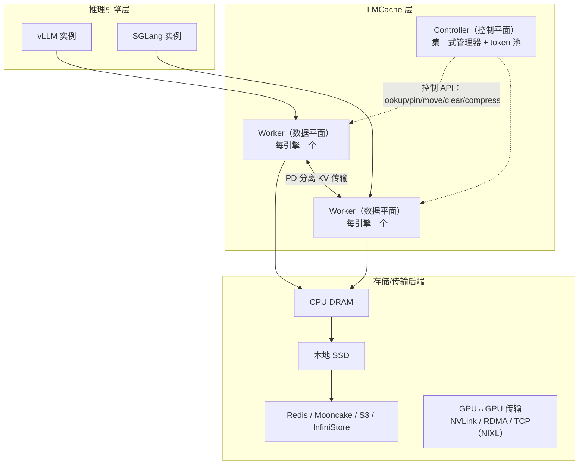

# LMCache：企业级 LLM 推理的高效 KV Cache 层

> 面试导向速查文档  
> 更新日期：2026-09-02
>
> 资料来源：LMCache 论文 *LMCache: An Efficient KV Cache Layer for Enterprise-Scale LLM Inference*（arXiv:2510.09665，TensorMesh & 芝加哥大学）、LMCache 官方 GitHub 仓库与官方博客。

---

## 1. 先用一句话说清楚

**LMCache 是一个开源的 KV Cache 管理层**：它部署在推理引擎（vLLM / SGLang）与异构存储/网络设备之间，把 KV Cache 从"单次请求的临时副产品"变成**可持久化存储、跨请求复用、跨引擎传输的一等数据**，从而消除重复 prefill 计算、支撑 PD 分离架构，最终降低 TTFT（首 token 延迟）、提升吞吐（论文报告在多轮问答、文档分析等工作负载下吞吐量最高提升 15 倍，延迟至少降低 2 倍）。

**核心要点速览**：

| 维度 | 结论 |
|---|---|
| 定位 | 推理引擎与存储后端之间的 **KV Cache 中间层**（引擎无关、厂商中立） |
| 两大核心场景 | ① 跨请求前缀缓存复用（卸载到 CPU/磁盘/远程存储）；② PD 分离（跨引擎 KV 传输） |
| 三大核心贡献 | ① 高度优化的 KV 传输机制；② 标准化 KV 连接器接口（与引擎解耦）；③ 完备的缓存控制 API |
| 存储层级 | GPU HBM → CPU DRAM → 本地 SSD → 远程存储（Redis/Mooncake/S3 等） |
| 集成生态 | vLLM、SGLang、vLLM Production Stack、NVIDIA Dynamo、llm-d、KServe；2025/10 加入 PyTorch Foundation |
| 学术血统 | 同团队成果：CacheGen（SIGCOMM 2024，KV 压缩传输）、CacheBlend（EuroSys 2025，非前缀 KV 复用） |

---

## 2. 背景与动机

### 2.1 KV Cache 回顾

KV Cache 把已处理 token 的注意力状态以 K/V 张量形式存于 GPU 显存，避免重复计算。它本质是 **LLM 原生的知识表示形式**，但在所有主流 Transformer 推理引擎中，KV Cache 仅在**单个请求的生命周期内**有效——请求结束即被丢弃。每个请求被独立处理，请求之间、引擎实例之间无法复用任何数据。

### 2.2 为什么推理成本和延迟成为瓶颈

输入/输出长度持续增长的四大趋势：

1. 多轮交互积累更长用户历史，作为上下文附加到后续输入；
2. 多模态输入（图像/视频）被转换为长 token 序列；
3. 新一代模型支持更长上下文窗口，提示工程嵌入更多 token；
4. 推理型模型生成超长输出，又作为下游请求的输入。

关键实证观察：

- 长上下文输入（超过 8–16K token）时，TTFT 主要由 **prefill 阶段**决定；
- 单流解码 ITL 很低，但多并发会话共享 GPU 时 ITL 急剧上升；
- 重算大 prompt、重新分配显存等场景显著拉高**尾部延迟**（P95/P99）。

### 2.3 KV Cache 支撑的两大优化场景

**场景一：跨请求上下文缓存（前缀复用）**。把某请求 prefill 产生的 KV Cache 持久化保存，后续复用相同前缀的请求（相同系统提示、RAG 检索到的相同文档片段、多轮对话历史）直接加载缓存，跳过重复 prefill，直接降低 TTFT 和每请求 GPU 占用时长。

**场景二：PD 分离（跨引擎 KV 传输）**。prefill 是计算密集型、吞吐导向；decode 是显存密集型、延迟敏感。混部会互相干扰、被迫超配 GPU。PD 分离把 prefill 集中到一组节点，生成的 KV Cache 通过网络（PCIe/NVLink/RDMA）传输到 decode 节点，降低高并发下的 decode 尾部延迟。

两大场景的共同前提：**KV Cache 必须能在 GPU 显存、CPU 内存、磁盘、网络之间高效移动**。

### 2.4 三大工程挑战

#### 挑战 1：分页内存下的 I/O 低效

现代引擎（vLLM/SGLang）采用 paged attention，KV 页面通常只有 16–64KB（例如 vLLM 中 Llama-3.1-8B 的页面约 62.5KB），且页面在显存中不连续，持久化/传输时产生大量小尺寸 I/O。实测数据（RCCL，8×400Gbps 网卡环境）：

| 消息大小 | 传输吞吐量 |
|---|---|
| 64KB | 4 GB/s |
| 256KB | 13 GB/s |
| 1MB | 30 GB/s |
| 10MB | 46 GB/s |
| 16MB | 49 GB/s |
| 100MB | 49 GB/s |

只有传输量达到约 16MB 才能饱和网络带宽；1–2MB 才能达到 PCIe 5.0 理论带宽的 75–80%。而传统的 `torch.save`/`torch.load` 序列化方式典型速度甚至不足 1 GB/s。

#### 挑战 2：适配快速迭代的推理引擎

2025 年平均每 4 天就有一款主流 LLM 发布（每周 15–20 个新开源权重模型）。引擎为支持新架构快速迭代，每次更新可能改变 KV Cache 的显存布局（如引入滑动窗口注意力、MLA），硬编码适配的维护成本极高。

#### 挑战 3：缺乏统一的管理 API

路由器需要知道 KV Cache 的位置才能做缓存感知路由；运维需要显式 pin 热点上下文；Agent 应用需要压缩并跨节点迁移缓存。没有统一的"定位/淘汰/固定/压缩"接口，上层组件无法做出合理决策。

### 2.5 现有方案为什么不够

| 方案类别 | 代表 | 不足 |
|---|---|---|
| 推理框架 | vLLM Production Stack、Dynamo、AIBrix、llm-d、KServe | 专注 K8s 部署与路由，KV 能力依赖外接缓存层（多家已集成 LMCache） |
| 引擎原生 KV 缓存 | vLLM/SGLang 内置 GPU→CPU 卸载 | 面向单节点设计，缺跨节点传输优化与分层存储 |
| KV 存储层 | Mooncake、Redis、InfiniStore、3FS | 只是存储，缺引擎到存储之间高效搬运小张量的"粘合层" |
| 专有实现 | Fireworks AI、Together AI | 闭源，自建基础设施不可用 |
| 研究原型 | CacheGen、CacheBlend 等 | 多基于 HF Transformers，达不到企业级、跟不上引擎迭代 |

---

## 3. 总体架构

### 3.1 定位：引擎与存储之间的中间层

LMCache 可作为**独立守护进程**部署，与引擎进程解耦——引擎崩溃不丢缓存（no fate-sharing）。

### 3.2 数据平面：LMCache Worker

每个推理引擎配一个 Worker，负责 KV Cache 在 GPU 显存与其他存储层级（或其他 Worker）之间的移动，支撑两类业务：KV 卸载（至 CPU/磁盘）与 PD 分离（GPU↔GPU）。为对抗小页面低效，Worker 采用内核优化 GPU 缓冲区、异步分块 I/O、分层流水线，即使面对 16–64KB 的小页面也能维持接近 GPU 本地的带宽。

Worker 内部组件及三条核心工作流：

- **存储流程**：请求经 KV Connector 准备元数据（token 化输入、页面 GPU 地址）→ Token Processor 确定后端尚未存储的新 token 数 → Storage Manager 经传输通道落盘。
- **检索流程**：KV Connector 准备元数据 → Token Processor 识别前缀命中 token 数 → Event Manager 检查请求 ID 是否已处理（防重复加载）→ GPU Connector 把 KV 载回显存，同时启动异步分层加载。
- **查找流程**：Cache Controller 维护全局 **token 池**（记录后端当前存储的所有 token），各 Worker 在存储/淘汰时更新，供路由器等高层组件查询。

### 3.3 控制平面：LMCache Controller

由**集中式管理器 + 各实例级工作线程**组成，向运维和高层调度器暴露可编程 API：pin 缓存片段、压缩/解压、跨设备迁移、淘汰低优先级条目；并维护虚拟化命名空间，实现异构设备间缓存的统一寻址。

设计分工一句话：**Worker 保证数据搬得快，Controller 保证资源用得巧**。

---

## 4. 性能优化设计（数据平面核心）

LMCache 要解决三个现实问题：① 页面粒度（20–63KB）传输效率低、吃不下带宽；② KV 传输与推理计算并发执行，若在同一 CUDA 流会互相阻塞，且启动 memcpy kernel 本身消耗 CPU；③ 海量请求产生的 KV 在各级存储重复存放，浪费空间与拷贝开销。对应三组优化：

### 4.1 批量操作：把"小页面"聚成"大块"

- **可配置块大小（chunk）**：不按页面粒度传输，而是经中间 GPU 缓冲区，把多个层的多个页面（默认 16 页）聚合成**默认 256 token 的大块**再批量读写。存储时先把页面拷进缓冲区、以块为粒度卸载到 CPU/磁盘；加载时先把块取回缓冲区、再拆成页面放入引擎的分页显存。内存拷贝由定制 CUDA kernel 加速。
- **批量存储/加载**：KV 常需并行写入多个目的地（热数据进 CPU 内存、冷数据进本地磁盘）。LMCache 把不同层级的存取请求批量聚合，避免顺序执行时"写 CPU 时磁盘带宽闲置"的浪费。
- **延迟解码 KV 存储**：decode 过程中新生成的页面不立即逐页卸载（会导致频繁小写入），而是聚合多个页面后按块批量落盘。

### 4.2 计算与 I/O 重叠

- **分层流水线（layerwise pipelining）**：为每层的推理计算与数据搬运分配独立 CUDA 流。加载第 1 层 KV 到 GPU 缓冲区并开始其计算时，异步加载第 2 层 KV；第 $i$ 层算 attention 时第 $i+1$ 层在传输。只需约"一层 KV"大小的固定 GPU 缓冲区即可实现传输与计算的完全重叠。
- **异步预取**：调度器收到请求与请求实际开算之间有空窗（如 100 个请求同时到达、引擎只能并行处理 50 个）。LMCache 利用空窗把排队请求的 KV 从慢层（远程磁盘）预取到快层（CPU 内存），计算开始时直接从快层加载。预取目标层级可按 SLO 与资源约束配置。
- **进程分离**：若数据搬运与引擎同进程，CPU 资源竞争带来 5–10% 延迟开销。LMCache 把搬运解耦为**独立进程**，还带来第二个好处：独立进程管理统一 CPU 内存池，多个引擎实例可共享该池存取 KV，消除实例间冗余拷贝。此方向已演进为 2026 年发布的多进程（MP）架构。

### 4.3 最小数据拷贝

- **零拷贝 + 引用计数**：一份 KV 需写多个目的地（CPU + 本地盘 + 远程盘）时，不为每个目的地创建新拷贝，而是对共享数据递增引用计数，各写入完成后递减，归零才释放（类似操作系统 PCB 计数）。
- **动态卸载（dynamic offloading）**：vLLM 在显存中维护空闲页面池，LMCache 不复制全部空闲页，而是用三个指针控制复制窗口：
  - **起始指针**：空闲页区域起点；
  - **当前指针**：已卸载到 CPU 的位置；
  - **结束指针**：计划卸载区域终点。

  四个状态循环：初始化（起始=当前）→ 进行中（当前向结束推进，已复制区间扩大）→ 请求到达（结束指针前移，为新请求预留显存）→ 稳定（当前=结束，复制完成）。核心权衡：**复制窗口越小，拷贝开销越低，但新请求分配页时阻塞概率越高**；窗口越大则请求可立即执行但复制比例高。

---

## 5. 标准化连接器接口（KV Connector）

为与快速迭代的引擎解耦，LMCache 定义标准化 KV 连接器接口。在 vLLM 中挂接两个位置：**调度器**（prefill token 数影响调度决策，缓存命中会改变需新算的 token 数）与**模型运行器**（计算前后执行 KV 加载/存储）。

| 函数 | 位置 | 作用 |
|---|---|---|
| `get_num_new_matched_tokens(query)` | 调度器 | 返回 LMCache 后端命中缓存的 token 数 |
| `update_state_after_alloc(query, blocks, num_external_blocks)` | 调度器 | 更新请求是否需从后端传输 KV |
| `build_connector_meta(scheduler_output)` | 调度器 | 构建传输元数据（含 KV 页面的 GPU 地址） |
| `start_load_kv(kv_pointers)` | 运行器 | 推理开始前启动从低层存储向 GPU 的加载 |
| `wait_load_kv(kv_pointers, layer_id)` | 运行器 | 同步等待该层 KV 加载完成 |
| `start_store_kv(kv_pointer)` | 运行器 | 计算完成后启动向低层存储的卸载 |
| `wait_store_kv(kv_pointer, layer_id)` | 运行器 | 同步等待当前层 KV 存储完成 |

**请求的端到端流程**：

1. 请求到达，调度器调 `get_num_new_matched_tokens` 查询缓存命中量；
2. `update_state_after_alloc` 按命中信息决定哪些页面需从外部加载；
3. 命中数大于 0 时调 `build_connector_meta` 准备元数据；
4. 分层流水线模式下：先 `start_load_kv` 加载第 1 层 → 每层计算前 `wait_load_kv` 同步该层并启动下一层加载 → 每层计算后 `wait_store_kv` 等前一层存完，再 `start_store_kv` 存当前层新生成的 KV；
5. 非流水线模式下：第 1 层计算前阻塞式 `start_load_kv` 整体加载，迭代结束后同步 `start_store_kv`。

---

## 6. 控制器 API（控制平面）

高层应用（路由器、调度器、运维平台）通过控制器 API 显式管理 KV Cache：

| 接口 | 描述 |
|---|---|
| `lookup(tokens) → {instance_id: hit_tokens}` | 返回包含指定 token 前缀匹配的实例及命中 token 数 |
| `query_ip(instance_ids) → IP` | 把实例 ID 映射为 IP 地址 |
| `move(source, destination, tokens)` | 把指定 token 的 KV 从源实例迁移到目标实例 |
| `clear(tokens, instance_id, storage_device)` | 删除指定实例、指定存储设备上目标 token 的 KV |
| `pin(tokens, instance, storage_device)` | 把指定 token 的 KV 固定在某实例的某存储层（如常驻 GPU） |
| `compress(tokens, instance, storage_device, compression_method)` | 用指定算法压缩 KV 并就地存储 |

**典型应用示例**：

- **缓存感知路由**：路由器调 `lookup(tokens)` 找出前缀命中最多的实例 → `query_ip` 拿到地址 → 把请求路由过去；
- **KV 迁移**：实例故障或负载均衡时，`move` 跨实例搬迁缓存；
- **缓存清理**：切换模型或回收内存时，`clear` 指定实例/设备上的缓存；
- **热点固定**：系统提示等高频上下文用 `pin` 常驻 GPU 显存（某金融公司生产环境即用此接口固定热门金融文档）。

---

## 7. 进阶能力与生态集成

### 7.1 非前缀 KV 复用（CacheBlend）

传统前缀缓存只能复用 prompt **开头**的连续段。CacheBlend（EuroSys 2025）把复用扩展到 prompt 中**任意位置**的缓存块（例如 RAG 场景中多个检索文档拼接在中部），只对少量 token 选择性重算以恢复注意力质量，兼顾命中率与生成质量。

### 7.2 KV 压缩与可插拔 SERDE

继承 CacheGen（SIGCOMM 2024）的 KV 压缩传输思想，LMCache 提供灵活的 SERDE（序列化/反序列化）插件接口，研究者可接入自定义的压缩、token 丢弃、量化等变换。生产经验表明，开放式聊天等无唯一正确答案的场景中，用户愿意接受有损压缩换取吞吐与成本收益。

### 7.3 生产级可观测性

提供 Kubernetes 常规指标（健康监控、性能诊断）之外，还有 KV 专有指标：**请求级与 token 级前缀缓存命中率**、缓存生命周期、请求级 KV 性能、按用户统计的用量等。

### 7.4 引擎独立部署与容错

LMCache 作为独立守护进程运行，与引擎无命运共享（no fate-sharing）：引擎崩溃缓存不丢。检索过程内置容错——即使部分 KV 读取失败，也返回已成功读取的部分，保证引擎不崩溃、生成结果正确。

### 7.5 近期架构演进

- **多进程（MP）架构**（2026/04 发布）：数据搬运独立成多进程体系，与引擎进程彻底隔离；
- **多节点 P2P CPU 内存共享**（2026/01 生产化）：跨节点的 CPU 内存池直接互访，进一步扩展有效缓存容量。

### 7.6 存储与传输后端

通过统一接口可插拔接入：**CPU RAM、本地 SSD、Redis/Valkey、Mooncake、InfiniStore、S3 兼容对象存储、NIXL、GDS**；传输介质覆盖 NVLink、RDMA、TCP。

### 7.7 生态集成

- **推理引擎**：vLLM V1、SGLang 官方集成示例；
- **推理栈**：vLLM Production Stack、NVIDIA Dynamo、llm-d、KServe 均已集成；
- **基金会**：2025/10 加入 PyTorch Foundation；
- **硬件**：覆盖 NVIDIA、AMD（MI300X）、Arm、Ascend 等多平台。

---

## 8. 评估结果

### 8.1 实验设置

- **模型**：Llama-3.1-8B/70B-Instruct、Qwen2.5-Coder-32B、Qwen3-Coder-480B-A35B-FP8、Qwen2.5-72B；
- **数据集**：模拟多轮问答、LongBench（TriviaQA）、vLLM 官方随机数据集、企业真实多轮对话轨迹；
- **硬件**：8×H100 单节点；多节点场景加远程 CPU 内存存储；PD 分离场景 prefill/decode 节点经 NVLink 连接；
- **指标**：TTFT（prefill 延迟）、ITL（token 间延迟）、组件级延迟分解；
- **基线**：原生 vLLM（仅 GPU 前缀缓存）、三家商业专用端点服务。

### 8.2 单节点 CPU 卸载（多轮文档问答）

工作负载：每请求约 10K token（12 页 PDF 文档 + 短问题），8B 模型 20K token 输入，输出最多 100 token；LMCache CPU 缓存上限 500GB。

**结果**：低 QPS（=1）下，LMCache 在 5 个模型上的吞吐比最强基线高 **2.3–14 倍**（相同 TTFT 约束下），ITL 同样更优。原因：基线仅能在 GPU 显存缓存有限 KV，命中率低；LMCache 用 CPU 卸载扩大缓存容量，命中率高，且加载机制高效。

### 8.3 集中式远程存储

GPU 实例经 15Gbps 连接远程存储服务器，跑 LongBench TriviaQA。**吞吐提升 1.3–3 倍**——远程后端容量远超本地 CPU 内存，命中率更高。注意点：远程加载延迟高于 CPU 加载，上下文短或模型小时（prefill 本身快）加载可能不如重算，见 8.6 敏感性分析。

### 8.4 PD 分离

随机负载（输入 8K / 输出 200 token），对比 vLLM 原生 PD 分离（NIXL）：**平均 TTFT 降低 1.53–1.84 倍，平均 ITL 降低 1.12–1.66 倍**，P95 TTFT 显著更优。

差距来源：vLLM 原生方案直接逐页调用 NIXL 拷贝分散的分页 KV，带宽利用率低；LMCache 把分块 prefill 产出的 KV 先聚合到 GPU 缓冲区再批量传输。延迟分解显示两者 prefill/decode 计算时间相同，差距全在**传输阶段**。

### 8.5 真实生产轨迹

用某企业数天的真实多轮对话轨迹（平均输入约 4K token）压缩到 1 小时回放，QPS 2–5 时性能提升约 **25%**，QPS 6 时达 **49%**，TTFT 与 ITL 同时降低。

### 8.6 组件级分析与敏感性

- **CPU 加载带宽**：LMCache **400 Gbps** vs vLLM 原生卸载 **88 Gbps**——差距来自传输粒度（块 vs 页）与每次 memcpy 的元数据/同步开销；
- **异步重叠收益**：开启请求异步后，prefill/decode 与 KV 加载重叠，端到端延迟降低 **1.46 倍**；
- **加载 vs 重算的临界点**（B200 实测）：带宽 32 Gbps 时，上下文超过约 **256K token** 加载才优于重算；带宽 64/128 Gbps 时各长度均优于重算。结论：**KV 加载策略应按带宽与上下文长度自适应**。

### 8.7 SGLang 集成

Qwen3-32B（TP=2，双 H100）上，LMCache CPU 卸载比无卸载的 SGLang 吞吐更高、TTFT/端到端延迟更低；与 SGLang 原生 CPU 卸载性能相当——但原生方案缺少跨本地磁盘/远程 CPU 的分层分布式存储能力。

### 8.8 结果汇总表

| 场景 | 关键数字 |
|---|---|
| 单节点 CPU 卸载 | 吞吐提升 2.3–14 倍（QPS=1，相同 TTFT） |
| 集中式远程存储 | 吞吐提升 1.3–3 倍 |
| PD 分离 | 平均 TTFT ↓1.53–1.84×，ITL ↓1.12–1.66× |
| 真实轨迹 | QPS 2–5 提升 25%，QPS 6 提升 49% |
| CPU 加载带宽 | 400 vs 88 Gbps（vLLM 原生） |
| 异步 I/O 重叠 | 端到端延迟 ↓1.46 倍 |
| 加载优于重算临界点 | 32 Gbps 带宽下约 256K token；≥64 Gbps 恒优 |

---

## 9. 生产部署经验（论文第 8 章精华）

### 9.1 规模化趋势：分层卸载成为标配

长上下文与多用户负载迅速耗尽 GPU 显存，企业普遍把 KV 卸载到 CPU 内存池乃至磁盘。关键洞察：**即使远程存储比 GPU 慢一个数量级，只要做好流水线重叠，从网络取回已算好的 KV 仍比在繁忙 GPU 上重算更快、更便宜**。生产中还常见"CPU 卸载 + PD 分离"组合：prefill 侧既把 KV 发给 decode 侧，又卸载到本地 CPU，一份计算两处受益。

### 9.2 意外的新场景

- **推荐系统**：LLM 作为嵌入模型 prefill 用户上下文（不生成 token），同一用户的不同请求高频复用这些长上下文——缓存 KV 直接省掉昂贵 prefill；
- **滑动窗口 vs 完整历史**：很多企业最初用滑动窗口省显存，但截断破坏前缀连续性、降低缓存命中率还损害质量；实践表明**保留完整历史 + 卸载到大容量层级**更优，且生产中的前缀命中率远超预期；
- **有损压缩被接受**：开放式聊天（无唯一正确答案）甚至金融场景中，用户愿意接受 KV 量化压缩换取系统吞吐提升。

### 9.3 工程落地教训

- **容器化偏好**：企业倾向直接用 Docker 镜像，不愿改源码；
- **容错与透明**：缓存层对终端用户透明，其故障绝不能导致服务中断（LMCache 的容错检索即为此设计）；
- **引擎与缓存解耦**：企业明确要求少动核心推理代码，KV 管理外置是大趋势；
- **Python 足够好**：早期有观点认为缓存管理必须用 Rust/C++，但 Python 降低了集成与社区贡献门槛，迭代更快；只有高性能数据加载模块用 CUDA 实现。
- **对研究者的局限**：LMCache 要求输入输出 token 数一致，注意力中间状态不可见，需要改动注意力内部状态的研究（如部分 token 丢弃类压缩）较难基于它实现。

---

## 10. 高频面试题与参考回答

### Q1：LMCache 解决什么问题？和 vLLM 原生前缀缓存有什么区别？

vLLM 原生前缀缓存只在 GPU 显存中保留有限 KV，容量小、命中率低，且面向单节点。LMCache 把 KV Cache 扩展为跨 **GPU→CPU→磁盘→远程存储** 的分层体系，支持跨请求、跨会话、跨引擎实例复用，并额外支撑 PD 分离的跨节点传输。实测 CPU 卸载场景吞吐提升 2.3–14 倍。

### Q2：LMCache 为什么比引擎原生卸载快这么多？

核心是传输粒度与重叠设计：① 把 16–64KB 的小页面经 GPU 缓冲区聚合成 256 token 的大块批量传输，CPU 加载带宽 400 Gbps vs 原生 88 Gbps；② 分层流水线让每层计算与下一层 KV 加载在不同 CUDA 流上重叠；③ 数据搬运独立成单独进程，避免与引擎争 CPU；④ 零拷贝引用计数避免冗余复制。

### Q3：KV Cache 加载一定比重算 prefill 划算吗？

不一定，存在临界点。B200 上实测：带宽 32 Gbps 时上下文要超过约 256K token 加载才优于重算；带宽 ≥64 Gbps 时各长度都划算。所以生产系统应按网络带宽和上下文长度自适应决定"加载还是重算"。

### Q4：LMCache 如何跟上 vLLM/SGLang 的快速迭代？

通过标准化 KV Connector 接口与引擎解耦：调度器侧 3 个接口（`get_num_new_matched_tokens` / `update_state_after_alloc` / `build_connector_meta`）负责命中查询与元数据，运行器侧 4 个接口（`start/wait_load_kv`、`start/wait_store_kv`）负责逐层异步传输。引擎内部演进只需更新连接器适配，不动 LMCache 核心。

### Q5：PD 分离中 LMCache 比 vLLM 原生方案快在哪？

vLLM 原生 PD 分离直接逐页调用 NIXL 拷贝分散的 KV 页面，小消息吃不下带宽；LMCache 先把 chunked prefill 产出的 KV 聚合到 GPU 缓冲区再批量传输。延迟分解显示两者计算时间相同，差距全在传输阶段，最终平均 TTFT 降低 1.53–1.84 倍。

### Q6：前缀缓存只能复用开头，RAG 场景文档拼在中间怎么办？

用 CacheBlend 做非前缀 KV 复用：缓存块可以命中 prompt 任意位置，系统只对少量受影响 token 做选择性重算来恢复注意力质量，在 RAG 多文档拼接场景下兼顾命中率与生成质量。

### Q7：LMCache 的控制平面能做什么？

六个核心 API：`lookup`（查哪些实例有指定前缀的 KV，支撑缓存感知路由）、`query_ip`（实例→地址）、`move`（跨实例迁移，用于故障恢复/负载均衡）、`clear`（清理）、`pin`（把热点上下文固定在指定存储层，如常驻 GPU）、`compress`（就地压缩）。

### Q8：LMCache 与 Mooncake、Redis 是什么关系？

互补而非竞争：Mooncake/Redis/InfiniStore/S3 是**存储后端**，LMCache 是引擎与这些后端之间的**高性能搬运与管理层**（"粘合层"），通过统一接口把它们纳入分层缓存体系，并补齐引擎适配、批量传输、流水线重叠、控制 API 这些存储系统本身不具备的能力。

---

## 11. 参考资料

- [LMCache 论文（arXiv:2510.09665）](https://arxiv.org/abs/2510.09665)：*LMCache: An Efficient KV Cache Layer for Enterprise-Scale LLM Inference*
- [LMCache GitHub 仓库](https://github.com/LMCache/LMCache)
- [LMCache 论文中文解读（官方博客）](https://blog.lmcache.ai/zh/2025/11/24/lmcache%E9%9D%A2%E5%90%91%E4%BC%81%E4%B8%9A%E7%BA%A7%E5%A4%A7%E8%AF%AD%E8%A8%80%E6%A8%A1%E5%9E%8B%E6%8E%A8%E7%90%86%E7%9A%84%E9%AB%98%E6%95%88kv-cache%E5%B1%82/)
- [vLLM 官方文档：LMCache 集成示例](https://docs.vllm.ai/en/stable/examples/disaggregated/lmcache/)
- [CacheGen（SIGCOMM 2024）](https://arxiv.org/abs/2310.07240)：KV Cache 压缩与流式传输
- [CacheBlend（EuroSys 2025）](https://arxiv.org/abs/2505.03999)：非前缀 KV 复用
- [Mooncake（FAST 2025）](https://arxiv.org/abs/2407.00079)：KVCache 中心的分离式推理架构

> 说明：LMCache 的接口与集成矩阵迭代很快，本文的机制原理与评估结论以论文版本为准；实际部署的配置项与支持矩阵请以官方最新文档为准。
