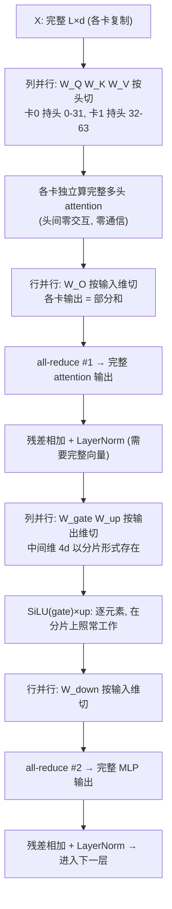

**TECHNICAL REFERENCE · 2026**

# 张量并行全景：从 Megatron 列/行并行到 Sequence Parallelism 再到异步通信重叠

*Column/Row Parallel → f/g 通信代数 → Sequence Parallelism → Vocab Parallel → 异步 TP*

**面向教学的完整推导 · 通信账本 · 结构约束分析 · 工程落地**

**适用读者**

希望深入理解大模型训练/推理层内并行策略的研究人员与分布式训练工程师

版本基线：2026 年 9 月

姊妹篇：[上下文并行全景：从 Ring-CP 到 Ulysses 再到融合演进](./ring-cp-to-ulysses-to-usp.md)（沿序列切分的并行）、[从 MHA 到 MQA、GQA 再到 MLA](./mha-to-mqa-gqa-to-mla.md)（头结构演进）——本文是并行家族的"层内"篇：CP 切序列、DP 切样本、PP 切层，TP 切**权重矩阵本身**。

---

## 执行摘要

> **一句话结论**　Tensor Parallelism（TP，张量并行）把**一层的权重矩阵沿维度切开**分给多卡——数学上只有两种切法：**列并行**（按输出维切，输出为拼接、免通信）与**行并行**（按输入维切，输出为部分和、欠一次归约）。Megatron 的设计精髓是"**列进 行出**"配对：每个子层（Attention / MLP）以列并行进入、行并行退出，让夹在中间的最宽张量（头拼接维、FFN 的 $4d$ 中间维）**在任何一张卡上都不被完整物化**——通信被精确压缩到每子层出口一次 $L \times d$ 的 all-reduce，一层前向 2 次、反向再 2 次（$f/g$ 算子的对偶）。这笔每层 4 次同步集合通信的账本决定了 TP 的全部宿命：**锁死 NVLink 机内、规模通常 $\leq 8$**。后续演进沿着"拆解这一次 all-reduce"展开：**SP** 把 all-reduce 拆成 reduce-scatter + all-gather、在缝隙里塞进切分后的 LayerNorm（省激活显存）；**Vocab 并行**把同样的数学用到 embedding/LM head 上，配 log-sum-exp 分解实现"永不物化全量 logits"的分布式 softmax；**异步 TP** 用分块流水与 NVSwitch 硬件归约把通信藏进计算。而 GQA/MLA/MoE 的结构演进又给 TP 带来新的整除约束与例外条款。

| 演进阶段 | 核心动作 | 解决的问题 | 代价 |
| --- | --- | --- | --- |
| Megatron TP (2019) | 列进 行出 + 每子层 1 次 all-reduce | 单层权重/激活/计算 ÷ N | 每层 4 次同步集合通信 |
| Sequence Parallelism (2022) | all-reduce 拆成 RS+AG，LN 区域切序列 | 激活显存再省一截 | 布局复杂度增加 |
| Vocab Parallel | embedding/LM head 按 vocab 切 + 分布式 softmax | 最大激活（logits）永不物化 | 损失计算改成三段归约 |
| 异步 TP (2024-) | 分块流水重叠 + NVLS/multimem 硬件归约 | 通信不再空转 GPU | 实现复杂、依赖新硬件 |

### 阅读导航

| 章节 | 主题 | 教学重点 |
| --- | --- | --- |
| 01 | 引言：层内并行的生态位 | TP 与 DP/PP/CP 的正交分工；为什么推理 decode 尤其需要 TP |
| 02 | 数学基石 | 列并行/行并行的完整推导；"中间维度隐身"原则 |
| 03 | 一层 Transformer 的拆解 | Attention 与 MLP 两个子层怎么切；RNG 同步等隐藏细节 |
| 04 | 通信账本 | $f/g$ 算子；反向为什么再补 2 次（梯度推导） |
| 05 | all-reduce 代价模型 | 环形算法通信量推导；TP $\leq 8$ 与 NVLink 锁定的定量依据 |
| 06 | SP | all-reduce = RS + AG 恒等式；激活显存收益；命名澄清 |
| 07 | Vocab 并行 | 分布式 softmax 的 log-sum-exp 分解完整推导；slime 两阶段采样 |
| 08 | GQA/MLA/MoE 时代的适配 | 头分组整除约束（与 Ulysses 约束同源）；MLA 的 KV cache 例外 |
| 09 | 异步 TP | 分块流水重叠与硬件归约 |
| 10 | 全景位置与总结 | 组合法则；decode 算术强度分析；速查表 |

---

## 1. 引言：层内并行的独特生态位

### 1.1 TP 解决的问题

四种并行各切一个维度，分工严格正交（详见姊妹篇 CP 文第 1 章的对照表）。TP 切的是**权重矩阵本身**，它是唯一同时做到三件事的并行：

1. **权重显存 ÷ N**：每个 $d \times 4d$ 的 FFN 矩阵被切成 N 份，单卡放不下的模型层内直接摊薄；
2. **单层激活显存 ÷ N**：中间激活（FFN 的 $4d$ 维、attention 的头拼接维）全程分片持有（第 2 章的"隐身原则"）；
3. **单次前向计算延迟 ÷ N**：一层的矩阵乘分给 N 卡同时算——这也是**推理 decode 延迟**的唯一武器（DP/PP/CP 都不缩短单 token 生成时间，第 10 章定量分析）。

对照其他并行的盲区：DP 完整复制模型（显存 $\times$ N 恶化）；PP 切层但每层激活仍要单卡放下整条序列；CP 切序列但每卡仍持有**全部权重**。TP 与它们全部正交，典型大模型配置是"机内 TP + 机间 CP/PP + 剩余 DP"。

### 1.2 TP 的代价预告

天下没有免费的切分。TP 的每一层都要付出**同步集合通信**（all-reduce），且这笔账与序列长度、batch 无关地**按层数线性堆叠**——70 层模型一个 microbatch 前反向要 280 次 all-reduce。这个结构性代价推导出 TP 的两条铁律（第 5 章定量证明）：

- **TP 锁死在单机 NVLink 域内**（每次 all-reduce 都是同步屏障，跨机延迟累积不可承受）；
- **TP 规模通常 $\leq 8$**（单机 GPU 数上限之外，通信占比随 N 增长侵蚀收益）。

> **程序员类比**　TP 像多线程共享内存并行里的"数据分块"：一个大矩阵乘拆给 N 个线程各算一块，最后 barrier 一次合并结果。barrier 的代价决定了"线程数"不能无限加——这个 barrier 就是 all-reduce。

---

## 2. 数学基石：矩阵乘法的两种切法

TP 的全部理论只有一页纸：$Y = XA$ 怎么切。但这一页纸的推论值得完整展开。

### 2.1 列并行：输出是拼接，免通信

设 $X \in \mathbb{R}^{L \times d}$（$L$ 个 token、hidden 维 $d$），$A \in \mathbb{R}^{d \times d'}$。把 $A$ **沿输出维（列）**切成 $N$ 块 $A = [A_1 \;|\; A_2 \;|\; \cdots \;|\; A_N]$，其中 $A_i \in \mathbb{R}^{d \times d'/N}$。每张卡持有完整的 $X$ 与自己那份 $A_i$：

$$
Y = XA = X[A_1 \;|\; \cdots \;|\; A_N] = [\,XA_1 \;|\; XA_2 \;|\; \cdots \;|\; XA_N\,] \quad (1)
$$

第 $i$ 卡算出 $Y_i = XA_i \in \mathbb{R}^{L \times d'/N}$——**拼接起来恰好是完整答案，零通信**。输出的 hidden 维天然分片，且每卡只算输出的 $1/N$ 列，计算量 $\div N$。

### 2.2 行并行：输出是部分和，欠一次归约

把 $A$ **沿输入维（行）**切成 $A = \begin{bmatrix} A_1 \\ \vdots \\ A_N \end{bmatrix}$，其中 $A_i \in \mathbb{R}^{d/N \times d'}$，$X$ 随之按列切为 $X = [X_1 \;|\; \cdots \;|\; X_N]$（$X_i \in \mathbb{R}^{L \times d/N}$，每卡一份）。由分块矩阵乘法：

$$
Y = XA = \sum_{i=1}^{N} X_i A_i \quad (2)
$$

第 $i$ 卡算出的 $X_i A_i \in \mathbb{R}^{L \times d'}$ 是完整 $Y$ 的一个**部分和**——各卡结果形状相同、语义相加。要得到 $Y$，必须跨卡求和：这就是 **all-reduce**。

> **一句话记忆**　列并行的组合操作是**拼接**（concat，免通信）；行并行的组合操作是**求和**（sum，欠一次归约）。切法在数学上就决定了通信的命运。

### 2.3 "列进 行出"配对与中间维度隐身原则

一层 Transformer 的每个子层都有两个相邻线性层（QKV 投影 → $W_O$；gate/up 投影 → down 投影）。四种配对方式的账本：

| 配对 | 中间激活的持有方式 | 通信 |
| --- | --- | --- |
| **列 → 行**（Megatron 选择） | 全程分片，任何卡都不持有完整中间量 | 每子层出口 1 次 $L \times d$ |
| 列 → 列 | 第二个矩阵入口需要各卡 all-gather 完整中间量 | 要搬 $L \times 4d$（FFN 中间维是 4 倍） |
| 行 → 行 | 入口先 scatter $X$，且每卡需要完整的对应列分片 | 更乱且不省 |
| 行 → 列 | 中间量需先归约再拼接，两头都要通信 | 两次通信 |

**中间维度隐身原则**：Transformer 里最宽的张量不是 $L \times d$ 的输入输出，而是夹在子层内部的中间量——FFN 的 $L \times \frac{8}{3}d$（SwiGLU 配置）、attention 输出投影入口的头拼接维。"列进 行出"让这些**最贵的张量自始至终以 $1/N$ 分片形式存在**，既省显存又免搬运。TP 不只是"切权重"，本质是一套**激活调度方案**——这个视角在第 7 章 vocab 并行（最宽的 logits 张量）与第 8 章（MLA 为何难切）会反复出现。

### 2.4 为什么是 all-reduce 而不是 reduce + broadcast

行并行出口的求和有两个天然消费者：**残差相加 + LayerNorm**（需要完整的 $L \times d$ 向量），以及**下一个子层的列并行入口**（列并行要求每卡持有完整输入，见式 (1) 的前提）。既然求和之后每张卡都需要完整结果，"先归约到一张卡再广播"就是绕路——all-reduce（环形实现上等价于每卡都拿到求和结果）是唯一合理形态。

---

## 3. 一层 Transformer 的完整 TP 拆解

### 3.1 端到端数据流（TP = 2 为例）



### 3.2 Attention 子层：为什么头切分天衣无缝

$W_Q, W_K, W_V$ 列并行**按头分组切**：卡 $i$ 持有第 $i$ 组头的 Q/K/V 投影列块。多头注意力的数学结构（详见 CP 文式 (16)）保证**头与头之间唯一的交互是最后的拼接**——每张卡对自己那组头独立走完 softmax attention（若开 FlashAttention 则每卡一次标准调用），输出自然是头拼接维的分片，正好作为行并行 $W_O$ 的输入分片。**整个 attention 计算零通信**，通信只发生在 $W_O$ 出口。

SiLU 与逐元素乘同理：两个操作数（gate 分支、up 分支）持有**相同的分片布局**，逐元素运算在分片上逐位等价。

### 3.3 显存账本：每张卡到底持有什么

| 张量 | 单卡持有 | 相对单卡全量 |
| --- | --- | --- |
| 所有权重（QKV、$W_O$、gate/up、down） | 各矩阵的 $1/N$ | $\div N$ |
| 子层输入 $X$ | 完整复制 | $1$（复制代价） |
| 中间激活（头的 K/V/Q、FFN 的 $4d$ 中间量） | 分片 | $\div N$ |
| 子层输出（all-reduce 之后） | 完整复制 | $1$（复制代价） |

注意**输入与输出的复制**是 TP 的隐性成本：$X$ 在每卡都有一份完整拷贝。这也是 SP（第 6 章）继续下刀的地方——把"输出完整复制"改成"沿序列各持 $1/N$"。

### 3.4 隐藏细节：Dropout 的 RNG 同步

all-reduce 之后每卡持有**逐位相同**的完整张量；后面紧跟的 dropout 在每张卡上独立生成掩码——若各卡种子不同，掩码不同，前向立刻分叉。Megatron 的解法是 `model_parallel_cuda_manual_seed`：为"TP 区域内必须一致"的计算维护一个**跨 TP rank 同步的 RNG 流**（`get_cuda_rng_tracker` 按区域 fork/恢复种子），而子层内部（分片上的 dropout）用各卡独立种子。这类"语义上要求确定性一致"的暗坑，是自研 TP 实现最常见的翻车点之一。

---

## 4. 通信账本：f/g 算子与前向 2 次、反向 2 次

### 4.1 两个通信算子的对偶

Megatron 论文把两个边界处的行为抽象成一对算子：

| 算子 | 位置 | 前向 | 反向 |
| --- | --- | --- | --- |
| $f$ | 列并行**入口**（QKV、gate/up 前） | identity（输入本就复制） | **all-reduce** |
| $g$ | 行并行**出口**（$W_O$、down 后） | **all-reduce** | identity |

一层前向：$g$ 触发 2 次（两个子层出口）。**反向再补 2 次，全部发生在 $f$**。

### 4.2 反向为什么在列并行入口欠账：完整梯度推导

列并行前向是 $Y_i = X A_i$（卡 $i$，见式 (1)）。反向时上游送来各卡自己的 $\frac{\partial \mathcal{L}}{\partial Y_i}$（分片形状 $L \times d'/N$），需求 $\frac{\partial \mathcal{L}}{\partial X}$。由链式法则对**所有**输出分片求和：

$$
\frac{\partial \mathcal{L}}{\partial X}
= \sum_{i=1}^{N} \frac{\partial \mathcal{L}}{\partial Y_i} \cdot A_i^\top \quad (3)
$$

每张卡本地能算出自己那一项 $\frac{\partial \mathcal{L}}{\partial Y_i} A_i^\top \in \mathbb{R}^{L \times d}$——**又是部分和结构**（与式 (2) 同构），必须 all-reduce。直觉：$X$ 被所有输出分片共享，它"欠"每个分片一份梯度。

而行并行出口的前向已经 all-reduce 过、每卡持有完整的 $Y$；反向时 $\frac{\partial \mathcal{L}}{\partial Y}$ 以完整形状随自动广播到达每卡，$\frac{\partial \mathcal{L}}{\partial X_i} = \frac{\partial \mathcal{L}}{\partial Y} A_i^\top$ 纯本地计算——identity。

**对偶的来源**：前向的"免通信方"（列并行入口 identity）恰好是反向的"欠账方"。$f/g$ 前后向行为互补，每子层前反向合计恰好 2 次 all-reduce，一层共 4 次——**通信次数由结构刚性决定，不容实现优化消掉**（只能藏进计算，第 9 章）。

### 4.3 总账本

$$
\text{all-reduces per layer per microbatch} = 4 \times (L \times d) \quad (4)
$$

70 层模型一个 microbatch 前反向 = 280 次同步集合通信；再乘以梯度累积的 microbatch 数。**这个数字是 TP 一切工程问题的源头**——第 5 章定量计算它的代价，第 6/9 章讲如何拆解与隐藏它。

---

## 5. all-reduce 代价模型：环形算法与 NVLink 锁定

### 5.1 环形 all-reduce 的通信量推导

$N$ 卡环形拓扑，归约一个 $V$ 字节的张量。环形 all-reduce 分两个阶段，每阶段 $N-1$ 步：

- **reduce-scatter**：每步各卡把自己的一个 chunk 发给下一卡并累加；$N-1$ 步后，每卡持有完整求和结果的**一个分片**。每卡发出 $\frac{N-1}{N} \cdot V$ 字节；
- **all-gather**：每卡把自己持有的分片沿环转发；$N-1$ 步后每卡持有完整结果。每卡再发 $\frac{N-1}{N} \cdot V$。

$$
\boxed{\;\text{per-rank volume} = \frac{2(N-1)}{N} \cdot V, \qquad
\text{latency} \approx 2(N-1)\alpha + \frac{2(N-1)}{N} \cdot \frac{V}{\beta}\;} \quad (5)
$$

其中 $\alpha$ 是单次发送启动延迟，$\beta$ 是链路带宽。两个重要性质：通信量随 $N$ 趋于常数 $2V$（带宽项不炸），但**延迟项随 $N$ 线性增长**（$2(N-1)\alpha$）——这正是"TP 加卡越来越不划算"的第一个来源。

### 5.2 代入 TP 的具体数字

每次 all-reduce 的张量是 $L \times d$。以 $L = 8\text{K}$、$d = 5120$、BF16 训练为例：单次 $V = 8192 \times 5120 \times 2 \approx 84$ MB。每层 4 次 → 每层每卡通信 $\approx 335$ MB。对照带宽：

| 介质 | 单向带宽 | 每层通信耗时（$N=8$，取式 5 带宽项 $\approx 2V/\beta$） |
| --- | --- | --- |
| NVLink（机内，聚合 ~450 GB/s） | 高 | $\approx 84 \times 2 / 450 \approx 0.37$ ms/次 |
| IB 跨机（~50 GB/s） | 低 | $\approx 3.4$ ms/次，**9 倍恶化** |

再叠加延迟项：280 次集合通信 $\times$ 每次 $2(N-1)\alpha$ 步。机内 $\alpha \approx 1\ \mu s$ 尚可忍受；跨机 $\alpha \approx 10\ \mu s$ 时仅延迟就吃掉数百毫秒。**结论定量成立：TP 的 all-reduce 是高频小同步集合通信，只有 NVLink 全互联能供养；跨机 TP 的通信开销直接吞噬并行收益**。

### 5.3 为什么 TP 规模通常 ≤ 8

三条独立的约束汇聚到同一个数：

1. **硬件拓扑**：NVLink 全互联域 = 单机 8 卡（跨机无 NVLink）；
2. **通信占比**：计算量随 $N$ 线性下降但通信量趋于常数 $2V$（式 5），通信/计算比随 $N$ 单调上升，$N = 8$ 附近在多数配置下逼近盈亏平衡；
3. **结构约束**：$N$ 必须整除头数等结构参数（第 8 章），典型 GQA 模型的硬上限恰好也是 8。

三条线交汇，"TP = 8"成为工程默认值。要突破 8，向上接力的是 CP（序列维）与 PP（层维）——这是姊妹篇 CP 文组合法则的另一半。

### 5.4 与 DP 通信的对比：为什么 DP 可以跨机

DP 每 step 只做**一次**梯度 all-reduce（张量 = 全部参数），TP 每层做 **4 次**激活 all-reduce（张量 = 单层激活）。前者低频大消息、可以用 bucket 合并成少数几次大传输、且能与反向计算重叠；后者高频小同步、无合并余地。**频率与同步性的差异，而不是单次通信量，决定了两者对介质的截然不同要求**——这呼应 CP 文 2.4 节的"通信代数"：判断一种并行能否跨机，看的是消息模式而非总量。


---

## 6. SP：把 all-reduce 拆成两半

> **一句话定位**　Sequence Parallelism（SP，Korthikanti et al. 2022，Megatron `--sequence-parallel`）不改通信总量，只改**通信的形状**：把行并行出口的 all-reduce 拆成 reduce-scatter + all-gather 两步，在两步之间插入 LayerNorm/dropout 的计算，并让这些逐 token 算子的激活沿序列切分——激活显存进一步 ÷ N，代价是布局管理更复杂。

### 6.1 数学恒等式：all-reduce = reduce-scatter + all-gather

环形 all-reduce 的两阶段结构（5.1 节）本身就是一个恒等式。对张量沿某个维度（SP 选**序列维**）切成 $N$ 份 $\{x_1, \ldots, x_N\}$：

$$
\text{all-reduce}(x) = \text{all-gather}\big(\text{reduce-scatter}(x)\big) \quad (6)
$$

reduce-scatter 先求和再散射：卡 $i$ 拿到 $\sum_j x_j$ 的第 $i$ 段；all-gather 再把各段拼回完整求和结果。**通信量与直接 all-reduce 完全相同**（式 5 的 $2(N-1)V/N$ 两阶段本来就是它的实现）——SP 没有省通信，省的是显存。

### 6.2 SP 的动作：往缝隙里塞切分的计算

标准 TP 里，all-reduce 之后每卡持有**完整**的 $L \times d$ 输出，LayerNorm/dropout 在完整张量上冗余计算。SP 的改法：

```
标准 TP:   行并行出口 ── all-reduce ──→ 残差+LN (完整, 各卡冗余算)
SP:        行并行出口 ── reduce-scatter ──→ 残差+LN (各卡只有 1/N 序列段)
                                     ── all-gather ──→ 进入下一个列并行入口 (需要完整输入)
```

$g$ 算子被拆成"RS（前向）+ AG（反向）"，$f$ 算子对应变成"AG（前向）+ RS（反向）"。LayerNorm 是逐 token 算子（CP 文 2.1 节的表），在序列分片上逐位等价——**省下了 LN/dropout 区域的激活显存（÷ N）**，包括反向传播要保存的对应中间量。

### 6.3 收益边界与命名澄清

- **收益**：Korthikanti 论文的账本里，Transformer 激活显存大头恰是"all-reduce 后的完整张量 + LN 中间量"，SP 把这块 ÷ N；配合选择性重计算，激活显存可压到接近理论下限，让长序列大 batch 训练可行（该论文的原始动机正是把 175B 训练的激活显存压下来）；
- **边界**：SP 只作用于 **TP 组内部**（与 TP 同进程组、同一 NVLink 域），切分维是序列——但它**不是**长序列扩展手段：attention 仍然是每卡全长的，KV 与 score 矩阵不因 SP 变小（那是 CP 的职责）；
- **命名澄清**（重申 CP 文 1.4 节）：Megatron SP（本文，显存优化）≠ DeepSpeed SP（= Ulysses，长序列方案）≠ CP。看到 "SP" 必须先问生态。

---

## 7. Vocab 并行：分布式 Embedding、LM Head 与 softmax

> **一句话定位**　把"列进 行出 + 分布式归约"的数学原封不动搬到 vocab 维：embedding 与 LM head 按 vocab 分片、logits 永不物化全量、softmax 用 log-sum-exp 分解跨卡算——这是 TP 数学在"最宽张量"上的收官应用。

### 7.1 为什么 vocab 需要单独处理

词表 $|V|$（现代模型 128K~256K）让两头的张量都变成怪物：

- **权重**：embedding 矩阵 $|V| \times d$（152K × 5120 ≈ 7.8 亿参数 ≈ 1.6 GB BF16），LM head 同尺寸（常共享权重）；
- **激活**：logits 是 $L \times |V|$——$L = 8\text{K}$ 时约 2.5 GB/microbatch，是**全模型最大的单块激活**（对比：普通子层激活是 $L \times d$，只有其 $1/30$）。

若 LM head 后直接 all-gather 全量 logits，通信与显存双爆。正确姿势：**logits 保持分片，softmax 的归约语义用统计量传递**。

### 7.2 Vocab 并行 Embedding：掩码查表 + 归约

每卡持有行区间 $[\text{vs}_i, \text{ve}_i)$ 的 embedding 行。查表时对输入 id 做掩码：落在本卡区间的 id 正常查表，区间外的输出零向量；然后 all-reduce 求和。正确性一目了然——每个 id 恰好属于一个分片，其余卡贡献零：

$$
\text{emb}(y) = \sum_{i=1}^{N} \underbrace{\mathbb{1}[\text{vs}_i \leq y \lt \text{ve}_i] \cdot E_i[y]}_{\text{nonzero on one rank only}} \quad (7)
$$

### 7.3 Vocab 并行 LM Head：列并行出口 + 分片 logits

$Y = X W_e^\top$，$W_e^\top$ 沿输出维（vocab）列并行——每卡算出自己 vocab 区间的 logits 分片（形状 $L \times |V|/N$）。这是列并行，**输出免通信**；关键决策是**不 all-gather**，让下游损失直接在分片上算。

### 7.4 分布式 softmax：log-sum-exp 分解完整推导

**目标**：在 logits 分片 $z^{(i)} \in \mathbb{R}^{L \times |V|/N}$（卡 $i$）上计算交叉熵 $\ell = -\log p_y$，$p_y = \frac{e^{z_y}}{\sum_{j \in V} e^{z_j}}$，永不物化全量 $z$。

**第一步：全局最大值**。数值稳定的 softmax 需要减去全局 max。局部 max 经 all-reduce（MAX）合成：

$$
m = \max_{j \in V} z_j = \max_{i} \; \max_{j \in \text{shard}_i} z_j \quad (8)
$$

**第二步：全局指数和**。分片求和后 all-reduce（SUM）：

$$
\ell_{\text{sum}} = \sum_{j \in V} e^{z_j - m} = \sum_{i=1}^{N} \underbrace{\sum_{j \in \text{shard}_i} e^{z_j - m}}_{\text{computable locally}} \quad (9)
$$

**第三步：目标 token 的 logit**。标签 $y$ 只属于一个分片；各卡用掩码索引取出（区间外置零）再 all-reduce（SUM）——与式 (7) 同构：

$$
z_y = \sum_{i=1}^{N} \mathbb{1}[y \in \text{shard}_i] \cdot z^{(i)}[y] \quad (10)
$$

**合并**：

$$
\boxed{\;\log p_y = z_y - m - \log \ell_{\text{sum}}\;} \quad (11)
$$

分子分母同乘 $e^m$ 即还原标准定义（与 CP 文 online softmax 的式 (7) 同一个把戏：max 平移不改变 softmax 值）。

**梯度为什么留在本地**。$\frac{\partial \ell}{\partial z_j} = p_y \cdot (\mathbb{1}[j = y] - p_j)$。分母里的 $p_j = \frac{e^{z_j - m}}{\ell_{\text{sum}}}$ 只依赖全局量 $(m, \ell_{\text{sum}})$——**每卡拿到这两个统计量后，自己分片内所有 $p_j$ 都能本地算出**，梯度更新无需任何额外通信。$(m, \ell_{\text{sum}})$ 是分布式 softmax 的**充分统计量**：凡是能表达成它们的函数，都不需要全量 logits。

### 7.5 slime 实战锚点：teacher server 的两个"分片直算"

slime 的 teacher logprob 服务把上述数学推到了两个更刁钻的场景（均无全量 vocab gather）：

**(1) 分片 logprob 直算**——[get_label_token_log_probs_from_vocab_parallel_logits](../../slime/slime/backends/megatron_utils/server/logprob_utils.py)（L157 起）：输入 TP 分片 logits 与 label token id，输出各 label 的 logprob。实现正是式 (8)~(11) 的逐条落地：local max → `all_reduce` MAX（L196-199）、分块局部 exp 和 → `all_reduce` SUM（L201-210）、掩码 gather label logit → `all_reduce` SUM（L213-220）。**TP 切 vocab 的归约在此处与 CP 切序列正交组合**——同一个函数里 TP 维度算 vocab 内的 log-softmax，CP 维度管序列分段（详见 CP 文第 8 章）。

**(2) 两阶段分布式采样**——[sample_from_vocab_parallel_logits_without_full_gather](../../slime/slime/backends/megatron_utils/server/logprob_utils.py)（L60-153）：在不物化全量 logits 的前提下做多项式采样。朴素做法需要全量概率分布；这里的分解是：

1. 各卡算出本分片的**概率质量** $q_i = \ell_i / \ell_{\text{sum}}$（$\ell_i$ 为局部指数和），all-gather 得到长度为 $N$ 的"分片质量分布"（L97-103）；
2. rank 0 在这个 $N$ 点分布上做 multinomial，决定**每个样本槽位归属哪个分片**（L105-111，广播保证各卡一致）；
3. 每卡仅对自己拥有的槽位，在**本地 vocab 分片内**再做一次 multinomial 选出具体 token（L121-144）；
4. `all_reduce` MAX 合并（未拥有的槽位填 $-1$，天然被 max 滤掉，L146-148）。

正确性：两级采样的合成分布 $\Pr[\text{token } j] = \Pr[\text{shard}(j)] \cdot \Pr[j \mid \text{shard}(j)] = q_{\text{shard}(j)} \cdot \frac{e^{z_j - m}}{\ell_{\text{shard}(j)}} = \frac{e^{z_j - m}}{\ell_{\text{sum}}}$——正是全量 softmax 分布。**通信从 $L \times |V|$ 降为 $L \times N$**。这是"充分统计量"思想的极致应用：采样也只需要 $(m, \ell_{\text{sum}}, \{q_i\})$。

---

## 8. GQA/MLA/MoE 时代的 TP 适配

TP 的切分假设是"沿头切、沿 hidden 维切"，模型结构的演替不断在这个假设上打补丁。

### 8.1 GQA：头分组整除约束

MHA 时代 TP 只需 $N \mid n_h$（头数整除）。GQA（详见 MLA 姊妹篇）引入 KV 头分组后，**每卡必须持有完整的"组"**——若干 query 头 + 它们共享的 KV 头：

$$
N \mid n_h, \qquad N \mid h_{kv} \quad (12)
$$

Llama-3-70B（64 query 头 / 8 KV 头）的 TP 硬上限因此是 **8**——与第 5.3 节的拓扑/通信约束汇聚到同一个数，纯属"结构巧合但工程和谐"。

**与 Ulysses 约束的同源性**：CP 文 4.5 节推导过 Ulysses 的 $cp \mid h_{kv}$。两个约束的根是同一条：**任何把数据按头分到一张卡上的方案，都要求这张卡拿到完整的注意力单元（query 头 + 其 KV）**。TP 因权重切分被迫按头分，Ulysses 因 all-to-all 布局重排主动按头分——殊途同归到同一个整除条件。这也是"头数"成为现代模型一个战略参数的原因：它同时封顶两种并行的规模。

### 8.2 MLA：共享潜向量打破头切分

MLA 的 KV 不是逐头的，而是**全头共享的低秩潜向量** $\mathbf{c}^{KV} \in \mathbb{R}^{d_c}$（512 维，详见 MLA 姊妹篇 4.2 节）。这破坏了"按头切 KV"的可能性：

- **能切的部分**：上投影 $W^{UK}, W^{UV}$（输出是逐头的 $n_h d_h$ 维）可以按头列并行，$W^{UQ}$、$W^{QR}$ 同理；attention 逐头算、$W^O$ 行并行——attention 段的 TP 骨架完好；
- **切不动的部分**：下投影 $W^{DKV}$ 的输出 $\mathbf{c}^{KV}$ 被所有头共享，**无法按头分片**；推理时每张卡要为序列上每个 token 缓存**完整的** $\mathbf{c}^{KV}$——**MLA 的 KV cache 不随 TP 缩小**（每卡都是全量 cache）。

这个"TP 失效区"之所以可以接受，是因为 MLA 的 cache 本来就只有 MHA 的 1/57（MLA 文 4.7 节），复制 N 份仍然远小于 GQA 的分片 cache。但它揭示了一个一般性教训：**低秩共享结构（为压缩而生）与分片结构（为并行而生）天然互斥**——压缩消灭了"每头独立的那份东西"，也就消灭了按头切的抓手。

### 8.3 MoE：专家权重交给 EP

MoE 层的 FFN 是几十~几百个**小**专家。对每个专家做 TP 切分意味着：矩阵乘变得极小（GPU 效率塌陷）、通信次数乘以专家数（每次 all-reduce 都是同步屏障）。正确的主轴是 **EP（Expert Parallelism）**：按专家整块分配到卡，token 路由后 all-to-all 发送到专家所在卡。实践中的典型分工：**attention 与稠密层用 TP，MoE 层用 EP**——slime 的训练栈即如此（MoE 相关的 expert 权重走 EP 分片，`--expert-model-parallel-size` 一族参数）。TP 的"列进行出"数学在 MoE 层被整体绕开，而不是被适配。

---

## 9. 异步 TP：把 all-reduce 藏进计算

> **一句话定位**　第 4 章证明通信次数是刚性的，但**同步等待**不是。现代演进沿两条线攻击它：软件上把一次 all-reduce 切成 chunk 流水（与计算重叠）；硬件上用 NVSwitch 的在途归约（NVLS/multimem）把延迟压下一个量级。

### 9.1 分块流水重叠（Overlap-TP / async TP）

行并行出口的 all-reduce 不必等全部 $L \times d$ 算完才开始：把输出沿序列切成若干 chunk，**算完 chunk $i$ 就发起它的归约、同时继续算 chunk $i+1$**——与 Ring Attention 的通信-计算重叠（CP 文 3.3 节）同一种哲学，只是粒度从"KV 块"换成了"激活块"。$f$ 算子的反向 all-reduce 同理分块。收益上限：通信时间被等长的计算时间完全覆盖（条件与 CP 文式 (10) 同构——激活块要足够大、算得够久）。

### 9.2 硬件归约：NVLS / multimem

NVSwitch SHARP 允许交换机**在途执行归约**：数据包经过交换机时逐跳累加，一跳完成"每卡发出 $V/N$、收到完整 $V$"的 one-shot 风格 all-reduce（multimem 指令）。相比环形算法的 $2(N-1)$ 步，延迟大幅下降且不再随 $N$ 线性堆积——这直接放宽了第 5.3 节"TP ≤ 8"的通信约束（拓扑约束仍在：NVSwitch 同样是机内设备）。PyTorch 的 async TP API（`torch.distributed.tensor_parallel` + symmetric memory）已把这套路径产品化。

### 9.3 演进的边界

异步 TP 让 TP 在 8 卡域内更接近线性扩展，也让更大 NVLink 域（如 NVLink-domain 超节点，数十卡单一开关域）上的 TP=16/32 重新进入讨论范围。但**它没有改变 TP 的定性宿命**——通信仍在、只是藏住了；跨出高速互联域的那一刻，接力棒依然要交给 CP/PP/DP。

---

## 10. 全景位置与总结

### 10.1 组合法则：TP 在并行家族中的位置

四并行的标准分工（与 CP 文第 9 章互补，从 TP 视角重述）：

$$
\underbrace{\text{TP}=8}_{\text{intra-node, weights/acts/latency} \div 8} \times \underbrace{\text{CP}=4}_{\text{cross-node, long seq}} \times \underbrace{\text{PP}=2}_{\text{cross-node, depth}} \times \underbrace{\text{DP}=n}_{\text{throughput}}
$$

选择 TP 的优先级判断：**显存放不下权重 → TP/EP 是唯二解；需要降单层延迟（尤其推理 decode）→ TP 唯一；其余场景优先 DP（通信最便宜）**。

### 10.2 推理 decode：TP 的算术强度红利

逐 token 解码是**权重带宽受限**过程（MLA 文 1.3 节的算术强度分析：batch=1 时强度约 1 FLOP/byte，远低于平衡点 ~300）。TP=$N$ 后：

- 每卡每步读取的权重量 $W \to W/N$（GQA 下 KV cache 也按头分片 ÷ N；MLA 例外，见 8.2）；
- 每卡计算量 $\to F/N$，算术强度不变，但**带宽需求 ÷ N**；
- 带宽受限区间内，decode 步时 $\approx \frac{W}{N \beta}$——**延迟直接 ÷ N**。

这是 vLLM/SGLang 等推理引擎默认开 TP 的根本原因：DP 提吞吐不降单请求延迟，PP 流水首 token 更慢，**只有 TP 同时切小了"每步必读的权重"**。（MLA 文 4.9 节提过的"训练物化/推理吸收"不对称之外，又一层训练-推理的 TP 不对称：训练怕 TP 的通信，推理爱 TP 的带宽。）

### 10.3 全变体速查表

| 维度 | Megatron TP | + SP | + Vocab 并行 | + 异步 TP |
| --- | --- | --- | --- | --- |
| 切分对象 | 权重矩阵（列/行） | 附加：LN 区激活沿序列 | embedding/LM head 沿 vocab | 不切，改通信 |
| 每子层通信 | 1 次 all-reduce $L \times d$ | RS + AG（总量不变） | 统计量归约（$L \times N$ 级） | 同 TP，但重叠隐藏 |
| 解决 | 权重/激活/延迟 ÷ N | 激活显存再 ÷ N | 最大激活永不物化 | 通信空转 |
| 约束 | $N \mid n_h$；NVLink | 与 TP 同组 | $N \mid \text{vocab}$（padding 可破） | 新硬件/新 API |

### 10.4 核心公式速览

| 编号 | 内容 | 用途 |
| --- | --- | --- |
| (1)(2) | 列并行=拼接免通信；行并行=部分和欠归约 | 一切 TP 推导的起点 |
| (3) | $\partial \mathcal{L}/\partial X = \sum_i \partial \mathcal{L}/\partial Y_i A_i^\top$ | 反向在列并行入口欠账的证明 |
| (5) | 每卡 $\frac{2(N-1)}{N}V$，延迟 $2(N-1)\alpha + \cdots$ | 环形 all-reduce 代价模型 |
| (6) | all-reduce = RS + AG | SP 的数学基础 |
| (8)~(11) | 分布式 softmax 的 log-sum-exp 分解 | $(m, \ell_{\text{sum}})$ 充分统计量 |
| (12) | $N \mid n_h$ 且 $N \mid h_{kv}$ | GQA 头分组约束（与 Ulysses 同源） |

### 10.5 一句话总结

> **TP 的全部理论浓缩为"两种切法 + 一个配对"：列并行输出拼接（免通信）、行并行输出部分和（欠一次归约），"列进 行出"让最宽的中间维度全程隐身，每子层出口恰好一次 all-reduce、一层前向 2 次反向 2 次——这笔刚性账本把 TP 锁进 NVLink 机内、钉在规模 8 上；后来的 SP 拆开这次通信塞进切分的 LN（省显存）、Vocab 并行把同一数学推到最宽的 logits 上（分布式 softmax 只需 $(m, \ell_{\text{sum}})$ 两个充分统计量）、异步 TP 用流水与交换机归约把通信藏进计算。结构演替则不断考验"按头切"的假设：GQA 立起头分组整除约束（与 Ulysses 殊途同归），MLA 的共享潜向量干脆消灭了按头切的抓手，MoE 把接力棒交给了 EP。**

**面试金句**：TP 不是"把权重切开"这么简单——它是把**激活调度**（中间维度隐身）、**通信代数**（列拼行和、$f/g$ 对偶）、**硬件拓扑**（高频同步集合通信 → NVLink 锁定）三件事一次做对的系统设计；判断任何 TP 变体，先看它把哪一次 all-reduce 拆到了哪里。

---

## 参考文献

- Shoeybi et al. (2019). *Megatron-LM: Training Multi-Billion Parameter Language Models Using Model Parallelism.*（列/行并行与 $f/g$ 算子）[arXiv:1909.08053](https://arxiv.org/abs/1909.08053)
- Korthikanti et al. (2022). *Reducing Activation Recomputation in Large Transformer Models.*（Sequence Parallelism 与激活显存账本）[arXiv:2205.05198](https://arxiv.org/abs/2205.05198)
- Narayanan et al. (2021). *Efficient Large-Scale Language Model Training on GPU Clusters Using Megatron-LM.*（TP×PP 组合的通信分析）[arXiv:2104.04473](https://arxiv.org/abs/2104.04473)
- Ainslie et al. (2023). *GQA: Training Generalized Multi-Query Transformer Models from Multi-Head Checkpoints.* [arXiv:2305.13245](https://arxiv.org/abs/2305.13245)
- DeepSeek-AI (2024). *DeepSeek-V2: A Strong, Economical, and Efficient Mixture-of-Experts Language Model.*（MLA 与 TP 的适配）[arXiv:2405.04434](https://arxiv.org/abs/2405.04434)
- Lepikhin et al. (2020). *GShard* / Fedus et al. (2022). *Switch Transformers.*（专家并行 EP）
- PyTorch 文档：Distributed Tensor Parallelism 与 symmetric memory / async TP
- 本仓库实现：[logprob_utils.py](../../slime/slime/backends/megatron_utils/server/logprob_utils.py)（分布式 softmax 与两阶段采样）、[cp_utils.py](../../slime/slime/backends/megatron_utils/cp_utils.py)（TP×CP 正交组合，见 CP 姊妹篇）
