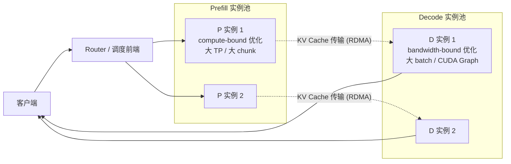
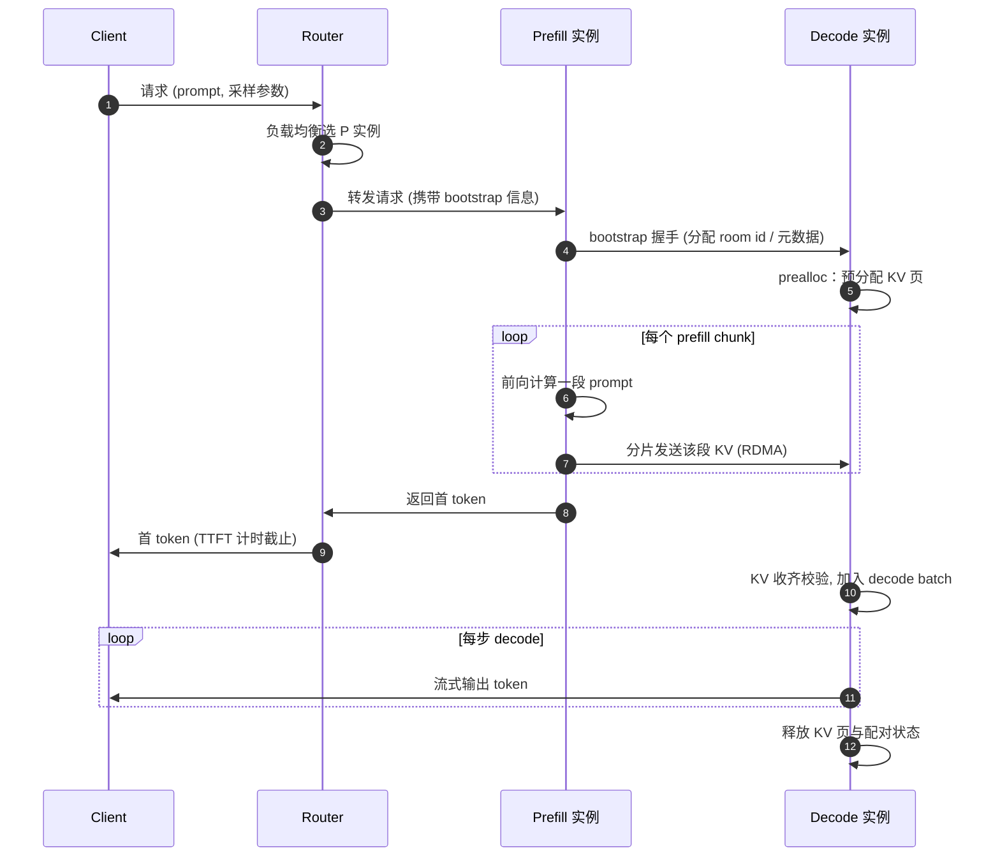
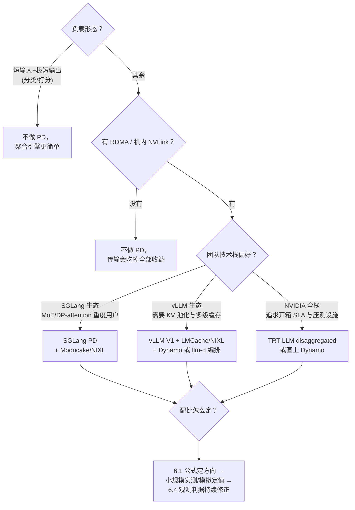

**TECHNICAL REFERENCE · 2026**

# PD 分离详解：架构设计、主流框架实现与 P:D 配比方法论

*Resource Profiling → Phase Splitting → KV Cache Transfer → SGLang / vLLM / TensorRT-LLM → P:D Sizing*

**面向教学的完整推导 · 架构拆解 · 实现对照 · 容量规划**

**适用读者**

希望深入理解大模型推理服务中 Prefill/Decode 分离（PD Disaggregation）的研究人员与工程师。阅读本文只需要 Transformer 推理与 KV Cache 的基础常识，其余前置概念（Roofline 模型、连续批处理、RDMA 传输、排队论入门）均在首次出现的章节内完整讲解。

版本基线：2026 年 9 月

姊妹篇：[Chunked Prefill 详解](./chunked-prefill.md)（PD 分离在时间维度上的正交解法）；相关阅读：[从 MHA 到 MQA、GQA 再到 MLA](./mha-to-mqa-gqa-to-mla.md)（KV Cache 体积的压缩路线，直接决定 PD 的传输成本）。

---

## 执行摘要

> **一句话结论**　PD 分离（Prefill/Decode Disaggregation）把 LLM 推理的两个阶段部署到两组不同的 GPU 上：prefill（一次前向算完整个 prompt，compute-bound，决定 TTFT）交给 P 实例集群，decode（逐 token 生成，bandwidth-bound，决定 TPOT）交给 D 实例集群，中间用 RDMA 把 KV Cache 从 P 侧搬到 D 侧。它解决的不是"算得慢"，而是**两种资源画像截然相反的负载被强制混在同一台引擎里，互相干扰且无法各自调优**；代价是引入一条 KV 传输链路和 P:D 容量配比这个新运维问题。学术界沿 Splitwise（首提分阶段专用硬件）→ DistServe（goodput 目标函数与并行度联合搜索）→ Mooncake（KVCache 中心化存储池）→ Dynamo（生产级动态伸缩）一路演进，工业界则以 SGLang、vLLM、TensorRT-LLM 三大框架给出了三种风格迥异的实现。

| 维度 | 传统聚合引擎（Aggregated） | PD 分离（Disaggregated） |
| --- | --- | --- |
| 资源画像 | prefill 与 decode 混批，互相打断 | 各据一批 GPU，互不干扰 |
| 并行策略 | P/D 共享同一 TP/DP 配置 | P、D 可独立选择 TP/DP/EP 与 kernel 策略 |
| SLO 优化 | TTFT 与 TPOT 此消彼长，被迫超配 | 分别逼近各自 SLO，goodput 更高 |
| KV Cache 生命周期 | 请求内本地产生、本地消费 | 跨网络搬运，引入传输与配对状态机 |
| 容量规划 | 只需选总 GPU 数 | 需额外决定 P:D 配比与每侧并行度 |
| 适用负载 | 短 prompt、短输出、低并发 | 长 prompt 或多轮、长输出、高并发、严 SLO |

### 阅读导航

| 章节 | 主题 | 教学问题 |
| --- | --- | --- |
| 01 | 为什么拆开：资源画像冲突 | prefill 和 decode 的算术强度差多少？混批时谁干扰谁？goodput 是什么？ |
| 02 | 系统架构与设计要素 | 一个请求在 PD 系统里走什么路径？bootstrap 配对怎么做？push 还是 pull？有哪些设计权衡？ |
| 03 | SGLang 的实现思路 | `disaggregation_mode` 如何工作？异构 TP 的 KV 布局怎么对齐？ |
| 04 | vLLM 的实现思路 | KVConnector 抽象了什么？pull 与 push 两种传输语义差在哪？ |
| 05 | TensorRT-LLM 的实现思路 | context/generation 服务器如何编排？传输与计算如何重叠？ |
| 06 | P:D 配比方法论 | 给定模型、硬件、负载形态，P 和 D 各要多少卡？怎么推导、怎么观测、怎么动态修正？ |
| 07 | 总结 | 三大框架对比、选型决策树、速查表 |

> **阅读路线**　第 1、2 章建立分析框架（资源画像、架构组件、设计权衡），第 3–5 章对照三大框架的落地形态，第 6 章是全文的定量收束。时间紧的读者可按 1 → 2 → 6 跳读，再回头补框架细节。

---

## 1. 为什么拆开：prefill 与 decode 的资源画像冲突

### 1.1 一次请求的两个阶段

LLM 推理的每个请求都经历两个性质完全不同的阶段：

- **Prefill（预填充）**：把长度为 $N$ 的 prompt 一次性并行喂进模型，完成所有位置的前向计算，产出第一个生成 token，并把所有层的 Key/Value 缓存下来（KV Cache）。注意力部分是 $O(N^2)$ 计算，线性层部分是 $O(N)$ token 级计算。
- **Decode（解码）**：从第二个 token 开始，每步只喂入上一步生成的 1 个 token，结合 KV Cache 做一次前向，采样出下一个 token。要生成 $L$ 个 token 就要串行执行 $L$ 步，**任何一步都无法提前开始**。

### 1.2 用 Roofline 模型量化两者的差异

Roofline 模型的核心是**算术强度**（Arithmetic Intensity）：每从 HBM 搬运 1 字节数据，能摊到多少 FLOP 的计算。设模型参数量为 $P$（以 BF16 存储，权重共 $2P$ 字节），一次前向的权重大致只需读一遍：

- Prefill 处理 $N$ 个 token：计算量约 $2PN$ FLOPs，读取权重 $2P$ 字节，算术强度

$$
I_{\text{prefill}} \approx \frac{2PN}{2P} = N \quad \text{FLOP/byte}
$$

- Decode 处理 batch 中 $B$ 条序列各 1 个 token：计算量约 $2PB$ FLOPs，同样读一遍权重，算术强度

$$
I_{\text{decode}} \approx B \quad \text{FLOP/byte}
$$

（两者都还要读 KV Cache，decode 的 KV 读取量随上下文长度增长，使其更偏向带宽受限；上述量级分析已足够定性。）

以 H100 为例：BF16 稠密算力约 $989$ TFLOPS，HBM 带宽约 $3.35$ TB/s，**平衡点算术强度**约为

$$
I^{*} = \frac{989 \times 10^{12}}{3.35 \times 10^{12}} \approx 295 \quad \text{FLOP/byte}
$$

于是：

- 一条 $N = 8000$ token 的 prompt 做 prefill：$I \approx 8000 \gg 295$，**compute-bound**，GPU 算力被打满，瓶颈在算；
- decode 单步即使 batch 到 $B = 128$：$I \approx 128 \lt 295$，仍**bandwidth-bound**，瓶颈在搬运权重和 KV，算力大量空闲。

Splitwise（ISCA 2024）用一张硬件代际表把这个矛盾钉死了：从 A100 到 H100，算力涨了 $3.43\times$，HBM 带宽只涨 $1.64\times$，显存容量原地踏步（80GB → 80GB）。**算力与带宽的剪刀差逐代拉大**，意味着"用同一种硬件同时伺候好两个阶段"越来越不可能——decode 根本不需要最新一代的算力，用低算力、高带宽、低功耗的旧卡反而更划算。

### 1.3 混批的三重代价

传统的聚合引擎（continuous batching）把 prefill 和 decode 混在同一迭代里调度，由此产生三个结构性问题：

**（1）Head-of-Line Blocking（队头阻塞）**。一个 8K token 的 prefill 插进正在运行的 decode batch，该迭代的耗时从 decode 典型的约 $20\sim50$ ms 被拉到几百毫秒量级——batch 里**所有**在线序列的 token 间隔（TPOT/TBT）同步出现一次突刺。定量地感受一下：70B 模型 TP=8 部署，纯 decode 一步约 $11$ ms（见 6.2 的 $t_{step}$ 推导）；一个 $N = 8000$ 的 prefill 在 $45\%$ MFU 下需要 $2 \times 70 \times 10^{9} \times 8000 / (8 \times 989 \times 10^{12} \times 0.45) \approx 315$ ms。混批意味着每来一个这样的 prompt，batch 里几百条正在流式输出的序列集体卡顿一次 $300$ ms 级的大拍——相当于把约 $27$ 步 decode 的进度全部推迟。prompt 越长、插入越频繁，突刺越密集；P99 TPOT 完全由最坏一次插入决定，而不是由 decode 本身的快慢决定。

**（2）调度策略互相妥协**。decode 想吃 CUDA Graph（要求 batch 形状稳定、token 数小而固定）和大 batch（摊薄权重读取）；prefill 想吃大 token 块（摊薄 GEMM 固定开销）和激进的序列并行。一个引擎只有一套配置，只能折中。

**（3）并行度无法分治**。prefill 的 TPOT 无关紧要、TTFT 至上，适合大 TP 压单请求延迟；decode 要的是高吞吐，适合更多副本或小 TP + DP。混批引擎里两个阶段被迫共用同一套 TP/DP 拓扑。

### 1.4 goodput：PD 分离的目标函数

DistServe（OSDI 2024）给这个问题定义了干净的优化目标。在线服务通常同时有两条 SLO：

- **TTFT**（Time To First Token）：首 token 延迟，由 prefill 阶段（含排队）决定；
- **TPOT**（Time Per Output Token）：逐 token 延迟，由 decode 阶段决定。

定义 **goodput** 为：在同时满足两条 SLO 的前提下，每 GPU 每秒能服务的最大请求数。聚合引擎在严 SLO 下的困境是：要压低 TPOT 就得限制 prefill 插入（TTFT 排队变长），要压低 TTFT 就得让 prefill 插队（TPOT 突刺），最后只能**超配 GPU** 两头兼顾。DistServe 的实测结论是：把两阶段拆开、各自选择资源与并行度后，相同 SLO 下可比当时最优系统多服务最多 $7.4\times$ 的请求，或者在相同请求率下收紧 SLO 最多 $12.6\times$（$90\%$ 以上请求达标）。

---

## 2. PD 分离的系统架构与设计要素

### 2.1 组件拆解

一个典型的 PD 分离系统包含四类组件：



- **Router / 调度前端**：接收请求，为每个请求选定一个 P 实例和一个 D 实例，并促成两者的配对；负责负载均衡、故障摘除，部分实现还承担 prefix-cache 感知路由。
- **Prefill 实例池**：只做 prompt 前向。调优方向是大 TP、大 chunked prefill 预算、激进的算力利用率。
- **Decode 实例池**：只做逐 token 生成。调优方向是大 batch、CUDA Graph、低延迟 MoE all-to-all、大 KV pool。
- **KV 传输层**：把 P 侧算好的 KV Cache 搬到 D 侧，通常基于 RDMA（IB / RoCE）或机内 NVLink，由专门的传输引擎（Mooncake Transfer Engine、NIXL 等）承担。

### 2.2 请求生命周期：bootstrap 配对与 KV 交接

PD 系统里一个请求的完整生命周期比聚合引擎多出"配对"和"传输"两个环节：



三个关键机制值得展开：

**Bootstrap 配对**。P 和 D 需要为同一个请求建立对应关系：哪个 P 实例的哪个请求，对应哪个 D 实例的哪段 KV 缓冲。主流做法是 P 实例暴露一个 **bootstrap 端口**，Router 选定 D 后，由 D（或 Router）向 P 发起握手，双方为请求分配一个全局唯一的配对 ID（SGLang 称 `bootstrap_room`，TRT-LLM 用雪花式 request ID）。配对 ID 同时充当 KV 传输的寻址 key 与故障检测的锚点。

**Prealloc（预分配）**。D 侧在 bootstrap 阶段就按请求的 max_tokens 或 context 上限**预分配 KV 页**，这样 P 侧的传输线程拿到的是确定的目的地址，KV 一到即可落页，不需要在传输路径上做显存分配这种慢操作。代价是 D 侧显存被提前占用，需要配合超时回收（SGLang 默认 bootstrap 超时 300 s）。

**分片流式传输**。KV Cache 不是等整个 prefill 算完才一次性发——P 实例每算完一个 prefill chunk（见姊妹篇 [Chunked Prefill](./chunked-prefill.md)）就把这段的 KV 发出去，**计算与传输重叠**。对 100K 级超长 prompt，这把"P 算完 → 开始传 → D 开始算"的串行链压成了流水线。

### 2.3 KV 传输：push 还是 pull

KV Cache 的搬运有且仅有两种语义，所有框架的实现都是这两种的变体：

| 语义 | 主动方 | 流程 | 优点 | 缺点 |
| --- | --- | --- | --- | --- |
| **Push（P 推）** | Prefill 侧 | P 算完即向 D 的目的地址写（RDMA Write） | 时延最低，P 侧算完即释放 | P 需提前知道 D 侧地址（依赖 prealloc 与配对）；D 侧被动，背压难做 |
| **Pull（D 拉）** | Decode 侧 | P 算完把 KV 留在本地并通知 D，D 就绪后主动读（RDMA Read） | D 按自身节奏拉取，天然背压；P 崩溃时 D 可重试 | 多一次"就绪通知"往返；P 侧 KV 驻留时间变长，占用显存 |

SGLang 是典型 push 路线（P 侧的 `disagg_kv_sender` 主动分片发送）；vLLM 的 NixlConnector 早期是 pull 路线（D 侧拉取），后续版本增加了 push-mode 设计；TRT-LLM 的 Cache Transceiver 则由 generation 侧发起接收、context 侧发起发送，双方经元数据握手对齐，语义上接近"预约式 push"。

**传输量估算**：每 token 的 KV 字节数为

$$
M_{\text{KV}} = 2 \cdot L \cdot H_{kv} \cdot d_{head} \cdot s
$$

其中 $L$ 为层数，$H_{kv}$ 为 KV 头数，$d_{head}$ 为头维，$s$ 为精度字节数（BF16 为 2）。以 Llama-3-70B（$L=80$、$H_{kv}=8$、$d_{head}=128$）计，每 token 约 $320$ KB；4K prompt 约 $1.25$ GB，在 400 Gbps IB（有效约 40 GB/s）上约 $30$ ms——相对秒级的 prefill 计算可以被完全遮盖。MLA 类模型（DeepSeek 系）每 token KV 小一个数量级，传输压力更低；MHA 老模型则相反。**GQA/MLA 压缩 KV 的表示，顺带把 PD 分离的入门门槛也降低了**——两条技术线在这里交汇（见姊妹篇 [从 MHA 到 MQA、GQA 再到 MLA](./mha-to-mqa-gqa-to-mla.md)）。

### 2.4 设计权衡清单

上一节的生命周期藏着一整组工程权衡，做架构决策时逐条过一遍：

1. **带宽门槛**：KV 传输时间必须远小于 prefill 计算时间，否则 PD 净收益为负。经验规则：需要 RDMA/IB 或机内 NVLink；纯 TCP 以太网只适合短 prompt 玩具集群。
2. **P 侧 KV 驻留**：push 模式下 P 算完即释放；pull 模式下 P 要替 D 保管 KV 直到被拉走，P 侧 KV pool 需要更大，还要处理"D 迟迟不来拉"的超时与泄露。
3. **故障与中断**：请求在传输中途被 abort、P/D 任一侧崩溃，配对状态要能双侧清理，否则 KV 页泄露。生产实现通常配 bootstrap 心跳（如连续 2 次心跳失败标记 P 离线）与双侧超时回收。
4. **prefix cache 交互**：多轮会话的 prefix cache 放在哪一侧？放 D 侧则下一轮仍需把增量 KV 从 P 传过去；放 P 侧则命中缓存的请求可以不传旧 KV。Router 做 cache-aware 路由（把同会话请求钉在同一 D 实例）收益很大。
5. **异构并行度的布局转换**：P 用 TP=4、D 用 TP=1 + DP=4 时，同一个 KV head 在两侧的卡间分布不同，传输前要在 P 侧 gather、D 侧 scatter。SGLang 用 GPU staging buffer 做批量聚拢再整段 RDMA，声称比逐 token 切片传输快 $2\sim5\times$（仅非 MLA 模型需要）；TRT-LLM 则内置 TP/PP 任意组合的 layout transformation。
6. **CUDA Graph 的非对称收益**：decode 的 batch 形状规整，CUDA Graph 收益大；prefill token 数飘忽，基本只能 eager。PD 分离后这个矛盾自然消解——D 侧可以放心铺满 graph bucket。
7. **角色弹性**：负载形态随时间漂移（白天 chat 短 I/O、夜间批量总结长 I/O），固定 P:D 配比必然局部失效。生产系统（Dynamo、TRT-LLM）都在做 P/D 角色的动态伸缩甚至互换。

### 2.5 演化谱系：四篇代表作一条线

PD 分离不是某一天被发明的，而是沿着"为什么拆 → 拆完怎么配 → 拆完放哪 → 生产怎么用"一路演化：

| 工作 | 发表 | 核心命题 | 关键结果 | 遗留问题 |
| --- | --- | --- | --- | --- |
| **Splitwise** | ISCA 2024 | 两阶段资源画像不同，应使用**相位专用硬件**（甚至不同代际 GPU），借高速背板网络传状态 | 同成本吞吐 $1.4\times$（或同预算 $2.35\times$），成本降 $20\%$ | 静态集群设计，未解 SLO 下的容量分配 |
| **DistServe** | OSDI 2024 | 以 **goodput** 为目标函数，P/D 各自的并行度与配比由模拟搜索决定；按集群带宽做 placement 压低传输开销 | 同 SLO 请求数最多 $7.4\times$，或 SLO 收紧 $12.6\times$ | 模拟器依赖准确的性能模型 |
| **Mooncake** | FAST 2025 | **KVCache 中心化**：P/D 集群之外再建一层分布式 KV 缓存池（榨干 CPU DRAM/SSD），传输即服务 | 仿真吞吐最高 $+525\%$；Kimi 生产集群请求数 $+115\%$（A800）/ $+107\%$（H800） | 架构复杂度显著上升 |
| **Dynamo** | 2025 起生产化 | 把 PD 做成**数据中心级动态系统**：Planner 按流量伸缩 P/D，KV-aware 路由，多模态把 Encoder 也拆出去（EPD） | Llama 70B 单机测试吞吐显著提升（官方数据） | 编排栈厚重，小集群收益有限 |

这条谱系的后三个节点，恰好对应本文第 3–5 章三大框架实现里反复出现的三个主题：**配比怎么定**（DistServe → 第 6 章）、**KV 放哪、怎么传**（Mooncake → 各框架的 transfer backend）、**系统怎么动起来**（Dynamo → 各框架的弹性与路由设施）。

---

## 3. SGLang 的实现思路

SGLang 是三大框架中 PD 支持最"原生"的一个：PD 不是外挂 connector，而是引擎内建的一种 **disaggregation mode**，调度器、Radix Cache、CUDA Graph、DP attention 都围绕两种角色分别实现。

### 3.1 拓扑与角色

两个开关把一台普通引擎变成 P 或 D：

```bash
# Prefill 实例
python -m sglang.launch_server --model-path $MODEL \
  --disaggregation-mode prefill \
  --disaggregation-bootstrap-port 8998 \
  --disaggregation-transfer-backend mooncake

# Decode 实例
python -m sglang.launch_server --model-path $MODEL \
  --disaggregation-mode decode \
  --disaggregation-transfer-backend mooncake

# Router（PD 模式，成对调度）
python -m sglang_router.launch_router --pd-disaggregation \
  --prefill http://p-host:30000 --decode http://d-host:30001
```

- 输入：`--disaggregation-mode` 取 `prefill` / `decode`（缺省为聚合模式）；`--disaggregation-bootstrap-port` 仅在 prefill 侧必填，即第 2 章说的配对握手端口；`--disaggregation-transfer-backend` 选 KV 传输引擎。
- 输出：一个只接受对应阶段流量的引擎实例；Router 以 `--pd-disaggregation` 启动后维护 P、D 两张 worker 表，按策略成对选择。

### 3.2 配对与调度

SGLang 的配对以 **bootstrap room** 为核心：Router 为请求选定 P、D 后，D 侧先 **prealloc** KV 页并把目的地址等元数据经 bootstrap 通道登记，P 侧算完即按 room 寻址 push。围绕这条链有一组超时/心跳环境变量，理解它们就理解了 SGLang PD 的故障模型：

| 环境变量 | 侧 | 语义 | 默认 |
| --- | --- | --- | --- |
| `SGLANG_DISAGGREGATION_BOOTSTRAP_TIMEOUT` | P | 等待 D 侧回传目的 KV 地址的超时 | 300 s |
| `SGLANG_DISAGGREGATION_WAITING_TIMEOUT` | D | 等待 KV 到达的超时 | 300 s |
| `SGLANG_DISAGGREGATION_HEARTBEAT_INTERVAL` / `_MAX_FAILURE` | D | 对 P bootstrap server 的心跳：间隔 5 s，连续 2 次失败标记 P 离线 | 5.0 s / 2 |
| `SGLANG_DISAGGREGATION_QUEUE_SIZE` | P | KV 传输并行队列数；1 = 严格 FCFS | 4 |
| `SGLANG_DISAGGREGATION_THREAD_POOL_SIZE` | P | 每 TP rank 的传输线程数 | 动态推算 |

这组默认值透露的设计取向是：**配对与传输都被视为"可能很慢但不应轻易判死"的操作**——300 s 的超时对在线服务来说极宽，配合 Router 侧的熔断策略共同避免"瞬时网络抖动 → 误杀实例 → 雪崩"的连锁反应。

### 3.3 KV 传输实现

SGLang 把传输引擎做成可插拔 backend：

- **Mooncake**：kvcache-ai 的 Transfer Engine，RDMA 为主，支持 `--disaggregation-ib-device` 指定网卡（共享列表或 per-GPU JSON 映射）；对 NVL72 等机内 NVLink 场景提供 `SGLANG_MOONCAKE_CUSTOM_MEM_POOL=NVLINK` / `INTRA_NODE_NVLINK` 的自定义显存池路径（辅助元数据仍走 TCP）。
- **NIXL**：NVIDIA Dynamo 团队的传输库，默认走 UCX，可用 `SGLANG_DISAGGREGATION_NIXL_BACKEND=LIBFABRIC` 切换插件。
- **Ascend**：昇腾 NPU 专用后端。

**异构 TP 的 staging buffer**是 SGLang 最有辨识度的一个设计：当 P 侧 TP=4、D 侧 DP-attention（有效 TP=1）时，同一 KV head 在两侧的卡间切分不同。朴素做法按 token 切片逐条传，小消息把 RDMA 打残；SGLang 的做法是 P 侧先把本请求的 KV 切片 **gather 进一块连续 staging buffer，整段一次 RDMA 写过去，D 侧再 scatter 进自己的 KV 页**——官方数据为高并发下 $2\sim5\times$ 的传输吞吐提升，且与同构 TP 基线差距在约 $5\%$ 以内。注意该优化仅面向 GQA/MHA 这类 KV 分头布局的模型，MLA 模型（KV 本已压缩成单一 latent）不需要。

### 3.4 与 chunked prefill 的关系

SGLang 的 P 实例内部仍然是 continuous batching + chunked prefill 调度器，`--chunked-prefill-size` 照常生效，且 **chunk 边界就是 KV 传输边界**：每算完一个 chunk 立刻把该段 KV 发出（`send_kv_chunk(..., last_chunk=False)`），最后一个 chunk 带 `last_chunk=True` 触发 D 侧收尾。也就是说，在 SGLang 里"chunked prefill 的块大小"同时是"P 侧调度粒度"和"KV 流式传输粒度"——两个旋钮是同一个参数，调参时要一起想（详见第 6.5 节与姊妹篇）。

### 3.5 运维要点

- **profiling 必须分开做**：torch profiler 的限制导致 P、D 实例要分别加 profiling 参数分别采集，不能指望一份 trace 看全链路。
- **权重更新**（RL/在线热更场景）：P、D 两组引擎都要推送新权重；旧权重产生的 KV 与新权重不兼容，更新前必须 flush cache——这意味着跨 step 的 prefix cache 复用在权重更新边界上失效。
- **多节点大模型**：P、D 各自成组起多节点 TP/DP（如 DeepSeek 2 节点 TP16×DP8 一组），Router 只对组首节点建配对，组内一致性由各引擎自己的分布式初始化保证。

---

## 4. vLLM 的实现思路

vLLM 走的是与 SGLang 几乎相反的哲学：**PD 不是引擎内建模式，而是"KV 传输 connector + 外部编排"的组合**。引擎本身不感知"我是 P 还是 D"，它只是在调度时多问一句"这个请求的 KV 是不是要从别处来 / 要送去别处"。

### 4.1 拓扑与角色：KVConnector 抽象

```python
kv_transfer_config = KVTransferConfig(
    kv_connector="NixlConnector",   # 或 LMCacheConnectorV1 / MooncakeConnector / ...
    kv_role="kv_producer",          # prefill 侧；decode 侧为 "kv_consumer"
)
```

- 输入：`KVTransferConfig` 指定 connector 实现与角色（`kv_producer` / `kv_consumer` / `kv_both`）。
- 输出：引擎在调度器与 worker 之间插入 connector 钩子，KV 的发出/收取成为调度生命周期的一部分。

角色完全由 connector 决定，引擎其余部分（调度、prefix caching、paged attention）保持不变。编排层在官方 example 里是一个简单的 FastAPI **proxy server**（`disagg_proxy_server.py`）：收请求 → 发给 prefill 实例 → 拿回带传输元数据的响应 → 转发给 decode 实例 → 流式回客户端。生产环境则通常把这一层换成 Dynamo 或 llm-d 的路由。

### 4.2 KV connector 生态

`vllm/distributed/kv_transfer/kv_connector/v1/` 下的实现大致分三类：

| connector | 传输机制 | 典型用途 |
| --- | --- | --- |
| `NixlConnector` | NIXL（UCX/LIBFABRIC），RDMA / NVLink | 通用 PD 分离主力 |
| `LMCacheConnectorV1` | LMCache 传输 + CPU/磁盘多级缓存 | PD 分离 + 跨实例 prefix cache 复用 |
| `MooncakeConnector` | Mooncake Transfer Engine | 与 Mooncake 存储池打通 |
| `P2pNcclConnector` 等 | NCCL 点对点 | 单机/无 RDMA 环境的低成本路径 |
| `OffloadingConnector` | CPU/磁盘 offloading | 缓存扩容，非实时传输 |

### 4.3 配对与调度：pull 语义与 scheduler 的异步化

vLLM V1 的经典形态是 **pull 语义**：

1. proxy 把请求发给 P 实例，P 算完后**不主动推 KV**，而是把"KV 在我这、元数据如下"写进响应返回；
2. proxy 把请求连同元数据发给 D 实例；
3. D 的 scheduler 把该请求放进 waiting 队列，worker 侧的 connector 后台线程按元数据向 P 发起 RDMA Read，**拉取** KV；
4. KV 收齐后请求转为可调度状态，进入正常 decode batch。

这个设计的调度含义是：**KV 传输时间对 decode 调度器是可见且可等待的**——请求只有在 KV 到位后才占 decode batch 槽位，避免了"D 侧占着坑等数据"的空转。代价是 P 侧要为"已算完但未被拉走"的 KV 提供驻留空间，vLLM 为此引入了 **KV lease**（租约）机制：P 侧给每块待拉取的 KV 一个租约，D 侧确认收到后续约/释放，超时未续约则 P 侧回收——这是第 2.4 节"P 侧 KV 驻留"权衡的一个标准答案。

值得注意的是 vLLM 社区同时存在 **push-mode** 的设计路线（NIXL push-mode KV transfer 设计文档已进入主线设计目录），说明 push/pull 之争在 vLLM 内部也未盖棺——pull 利于背压与容错，push 利于时延，两者会长期共存。

### 4.4 与 chunked prefill 的关系

vLLM V1 里 chunked prefill **恒开且不可关闭**：调度器以 `max_num_batched_tokens` 为每步 token 预算，decode 请求优先入批，剩余额度再切给 prefill（长 prompt 自动切块跨多步）。这与 PD 的组合含义是：

- P 实例内部天然切块调度，但 V1 的 KV 传输以**整个请求的 KV 就绪**为交接点（P 算完才通知 D），因此 vLLM 经典路径**没有** SGLang 那种"chunk 边界即传输边界"的流式重叠——超长 prompt 下 P→D 的串行等待更明显；
- D 实例的 `max_num_batched_tokens` 只影响残余的 extend 类请求，decode 本身每序列每步 1 token，chunk 预算在 D 侧基本无感。

### 4.5 运维要点

- **proxy 是单点也是自由度**：官方 example 的 proxy 只做转发，生产要自己加负载均衡、重试、P/D 容量感知；这也是 Dynamo/llm-d 存在的理由。
- **prefix caching 与 PD 正交互利**：P 侧命中 prefix cache 的请求只需传输增量 KV；LMCache 路线进一步把 KV 池化，实现"P 算过的 KV 未来任何实例都能复用"。
- **V0/V1 差异**：V0 的 PD 示例（逐层 synchronous 传输）已废弃，2026 年谈 vLLM PD 默认都是 V1 connector 体系。

---

## 5. TensorRT-LLM 的实现思路

TRT-LLM 的 PD（官方称 disaggregated serving）形态介于前两者之间：**引擎内建 context/generation 角色与传输收发器，但编排层是独立的 orchestrator 进程**，且整套设施明显为 SLA 压测与生产运维设计。

### 5.1 拓扑与角色

```bash
# context（prefill）服务器：config 里开 cache transceiver
echo -e "disable_overlap_scheduler: True\ncache_transceiver_config:\n  backend: NIXL" > context_config.yml
trtllm-serve $MODEL --port 8001 --config ./context_config.yml

# generation（decode）服务器
echo -e "cache_transceiver_config:\n  backend: NIXL" > gen_config.yml
trtllm-serve $MODEL --port 8003 --config ./gen_config.yml

# orchestrator：声明两类服务器池，对外提供 OpenAI 兼容端点
trtllm-serve disaggregated -c disagg_config.yaml
```

```yaml
# disagg_config.yaml
hostname: localhost
port: 8000
context_servers:
  num_instances: 2
  urls: ["localhost:8001", "localhost:8002"]
generation_servers:
  num_instances: 1
  urls: ["localhost:8003"]
```

- 输入：每个 worker 一份 `cache_transceiver_config`（`backend: NIXL` 必填，无默认值——不配则实例正常启动但拒绝 disagg 请求，是一个经典踩坑点）；orchestrator 一份服务器池清单。
- 输出：orchestrator 把请求标记为 **context-only** 发给 context server，拿到带 KV 元数据的响应后再标记为 **generation-only** 发给 generation server，两侧引擎各自跳过不属于自己的阶段。

### 5.2 KV Cache Exchange：为"搬得动"而生的三个设计

TRT-LLM 把 KV 传输收敛为一个与 KV manager、通信库解耦的 exchange 模块，三个设计直接对应第 2.4 节的权衡：

**Overlap Optimization（跨请求重叠）**。一个请求在收发 KV 时，其他请求的计算照常推进；多 GPU 实例间不同卡组的 KV 传输也可并行。这是"传输不挡计算"的调度级答案（对照 SGLang 的 chunk 级流式：一个是请求间重叠，一个是请求内重叠）。

**Cache Layout Transformation（布局变换）**。context 与 generation 允许使用**不同的 TP/PP**（官方明确支持并处理异构），传输前自动做 block 映射变换。限制是各层 KV 布局须同构（同 dtype、同头数）。

**Unique Global Request ID（雪花 ID）**。ctx→gen 的 KV 传输以全局唯一 request ID 为 key，ID 位布局为 `[0 | timestamp_ms(39) | node_id(8) | process_id(6) | counter(10)]`，本地自生成、无需跨进程协调；全局 ID 与本地 warmup ID 占用不相交区间，杜绝冲突导致 KV 串台。这是 bootstrap 配对的"去中心化"实现。

### 5.3 编排层：Coordinator + Worker Fleet

orchestrator 本身是单线程进程，高并发下会先于 GPU 成为瓶颈。TRT-LLM 的解法是把 orchestrator 拆成两层：

- **Coordinator**：唯一进程，持有全部路由状态（ctx/gen router、worker 就绪表、KV-aware 路由的事件入口），对内暴露 `/select`、`/finish` 等协调 API；
- **Fleet workers**：`num_workers` 个无状态 orchestrator worker 通过 `SO_REUSEPORT` 共享对外端口，内核按四元组哈希分发连接；worker 本地算路由 key（如 block hash），把放置决策委托给 coordinator。

有状态路由（`kv_cache_aware`、`conversation`）必须经 coordinator 保证全局一致；无状态路由（`round_robin`、`load_balancing`）worker 本地决策、零协调开销。这套设计把"路由可扩展性"和"路由一致性"拆开解决，是三大框架里编排层最完整的一个。

### 5.4 与 chunked prefill 的关系

TRT-LLM 的 chunked context（`enable_chunked_prefill` 等价能力）在 context 服务器内部照常生效；官方建议 context 侧 `disable_overlap_scheduler: True`（context 侧不需要 generation 那种调度重叠技巧）。KV 传输以请求为单位交接，配合 `kv_cache_bounce_size_mb` 可把散落 block 合并成连续缓冲一次 NIXL write（需 fabric/MNNVL 显存）。

### 5.5 运维要点

- **预热传输连接**：executor 间通信按需建链，首批请求的传输带宽显著偏低，benchmark 必须先 warmup，否则数据失真。
- **网卡争用**：TEP（TP+EP 混合）下多个 TP rank 并发传输会争抢 IB 网卡，`UCX_MAX_RNDV_RAILS=1` 可缓解。
- **NVLink 域**：跨 NVLink 域部署需调 `UCX_CUDA_IPC_ENABLE_MNNVL` 等变量；GB200 上 `UCX_RNDV_SCHEME` 建议显式设为 `get_zcopy`/`put_zcopy`。
- **传输重叠开关**：`TRTLLM_DISABLE_KV_CACHE_TRANSFER_OVERLAP=1` 可关掉 generation 侧传输-计算重叠，用于隔离定位问题。

---

## 6. P:D 配比方法论

配比是 PD 分离特有的运维问题：聚合引擎只需要决定"一共多少卡"，PD 还要回答"P 几台、D 几台"。本章给出一套可推导、可观测、可修正的方法论。

### 6.1 容量模型：把配比写成公式

设负载形态为：请求速率 $\lambda$（RPS）、平均输入长度 $S_{in}$、平均输出长度 $S_{out}$。定义两个由硬件与并行度决定的引擎级吞吐：

- $t_P$：单个 prefill 引擎的 prefill 吞吐（token/s）。compute-bound 下近似与 batch 无关，

$$
t_P \approx \frac{G \cdot C \cdot \eta_P}{2 P_{\text{active}}} \quad \text{token/s}
$$

其中 $G$ 为引擎 GPU 数，$C$ 为单卡峰值算力（FLOPS），$\eta_P$ 为 MFU（prefill 大 batch 下典型 $40\%\sim60\%$），$P_{\text{active}}$ 为每 token 激活参数量（MoE 取激活值）。

- $t_D$：单个 decode 引擎的 decode 吞吐（token/s）。bandwidth-bound 下由 batch 大小 $B$ 与平均上下文 $\bar{S}_{ctx} \approx S_{in} + S_{out}/2$ 决定，

$$
t_D(B) = \frac{B}{t_{step}(B)}, \qquad t_{step}(B) \approx \frac{2 P_{\text{shard}} + B \cdot m_{kv} \cdot \bar{S}_{ctx}}{BW \cdot \eta_D} \quad \text{s}
$$

其中 $P_{\text{shard}}$ 为单卡权重分片参数量，$m_{kv}$ 为每 token KV 字节数（见 2.3 节），$BW$ 为单卡 HBM 带宽，$\eta_D$ 为带宽利用率（典型 $70\%\sim85\%$）。$B$ 的上限被两件事卡死：**KV 显存预算**（$B \cdot m_{kv} \cdot \bar{S}_{ctx}$ 不能超过单卡 KV 池）与 **TPOT SLO**（$t_{step}(B) \le \text{SLO}_{TPOT}$）。

稳态下（Little 定律的吞吐形式），两侧所需引擎数之比即配比：

$$
r = \frac{N_P}{N_D} = \frac{\lambda \cdot S_{in} / (t_P \cdot u_P)}{\lambda \cdot S_{out} / (t_D \cdot u_D)} = \frac{S_{in}}{S_{out}} \cdot \frac{t_D}{t_P} \cdot \frac{u_D}{u_P}
$$

其中 $u_P, u_D \in (0,1)$ 是**利用率余量**：P 侧要保护 TTFT 的 P99，必须留余量吸收到达突发（典型 $u_P \approx 0.5\sim0.7$）；D 侧负载平滑、可以跑得更满（$u_D \approx 0.8\sim0.9$）。

这个公式立刻给出一个反直觉结论：**配比的第一个数量级由 $S_{in}/S_{out}$ 决定，而不是由"P 快 D 慢"的直觉决定**。$t_D$ 与 $t_P$ 在合理 batch 下其实是同一量级（都是每引擎万级 token/s），所以短输出业务（chat、分类）可能是 **P 侧占大头**，长推理/Agentic 业务才是 D 侧占大头。

### 6.2 数值算例：Llama-3-70B / 8×H100 引擎

取 $P = 70\text{B}$（BF16，权重 $140$ GB）、TP=8 单机引擎、$C = 989$ TFLOPS、$BW = 3.35$ TB/s、$\eta_P = 45\%$、$\eta_D = 80\%$、$m_{kv} = 320$ KB/token（GQA，$L=80, H_{kv}=8, d=128$）、单卡 KV 预算约 $62$ GB（$80 - 17.5$ 权重）、TPOT SLO $= 30$ ms。

引擎级参数：$t_P = 8 \times 989 \times 0.45 / 140 \approx 25.4\text{k}$ token/s；单卡权重分片 $17.5$ GB，每序列 KV $= m_{kv} \cdot \bar{S}_{ctx} / 8$（TP 分摊）。

**负载 A：chat（$S_{in}=2000$，$S_{out}=200$）**。$\bar{S}_{ctx} \approx 2100$，每序列每卡 KV $\approx 84$ MB。TPOT 约束允许 $B$ 推到 KV 上限 $B \approx 738$：$t_{step} = (17.5 + 62)/2.68 \approx 29.7$ ms 恰好贴住 SLO，$t_D \approx 24.8\text{k}$ token/s。代入（取 $u_P = 0.6$，$u_D = 0.85$）：

$$
r_A = \frac{2000}{200} \cdot \frac{24.8}{25.4} \cdot \frac{0.85}{0.6} \approx 13.9
$$

即 **P:D ≈ 14:1**——chat 这类短输出业务是彻底的 prefill 主导型，绝大多数算力应投给 P 侧。

**负载 B：Agentic 长推理（$S_{in}=8000$，$S_{out}=4000$）**。$\bar{S}_{ctx} \approx 10000$，每序列每卡 KV $\approx 400$ MB，KV 预算只容 $B \approx 155$：$t_{step} = (17.5 + 62)/2.68 \approx 29.7$ ms，$t_D \approx 5.2\text{k}$ token/s——**长上下文让 decode 的 KV 读取项淹没权重项，$t_D$ 掉了近 $5\times$**。代入：

$$
r_B = \frac{8000}{4000} \cdot \frac{5.2}{25.4} \cdot \frac{0.85}{0.6} \approx 0.58
$$

即 **P:D ≈ 1:1.7**。同一套硬件，负载形态从 chat 切到 agentic，配比从 $14:1$ 翻转到 $1:1.7$——这就是为什么"给我一个通用配比"没有答案，以及为什么生产系统要做角色弹性。

> **数字免责**：上述数值是教学算例，真实 $t_P / t_D$ 随 kernel、显存水位、流量波动而变化；方法论（公式 + 约束）是稳定的，数字必须用你自己的压测替换。

### 6.3 DistServe 法：把配比交给搜索

如果不想手推公式，DistServe 给出了系统化替代：**枚举 + 模拟 + 按 goodput 反推配比**。

1. 固定 SLO 对 $(\text{SLO}_{TTFT}, \text{SLO}_{TPOT})$；
2. 对 P 侧枚举并行度候选 $\pi_P \in \{TP1, TP2, TP4, \dots\}$，用模拟器测出每种配置下满足 $\text{SLO}_{TTFT}$ 的**单卡 goodput** $g_P(\pi_P)$，取最优 $\pi_P^*$；对 D 侧同理得 $g_D(\pi_D^*)$（满足 $\text{SLO}_{TPOT}$）；
3. 配比由两侧 goodput 之比反推：$r = g_D(\pi_D^*) / g_P(\pi_P^*)$——P 侧单卡越能打，需要的 P 卡越少；
4. 最后按集群网络拓扑做 placement：P、D 尽量同机/同 NVLink 域，把 KV 传输压到高带宽路径上。

与 6.1 的解析模型相比，模拟法把排队效应、SLO 分位数、kernel 实测性能都装进了 $g_P / g_D$ 两个数里，代价是依赖模拟器的保真度。工程上的稳妥做法是：**用 6.1 的公式定量级与方向，用小规模实测/模拟定精确配比**。

### 6.4 观测判据与动态修正

配比失调不会以"配比错了"的形式报警，而是以队列与时延的形态出现。上线后盯三组信号：

| 观测 | 诊断 | 修正方向 |
| --- | --- | --- |
| P 侧排队深度持续上涨、TTFT 恶化、D 侧 batch 长期偏小 | P 不足 | 加 P 实例，或把部分 D 实例转角色 |
| D 侧 $t_{step}$ 逼近 SLO、KV 池水位高企、P 侧大量空转 | D 不足 | 加 D 实例；或检查是否该降 TPOT SLO 换吞吐 |
| KV 传输速率远低于网卡理论值、P 侧 forward 时间正常但请求总耗时长 | 传输瓶颈 | 查 IB device 绑定/NUMA/网卡争用；换 transfer backend；此态下加任何一侧的卡都无效 |
| bootstrap / waiting 超时频发 | 配对链路过载或失衡 | 看超时发生在哪一侧，同上两条分别处理 |

负载形态随时间漂移（白天 chat、夜间长文总结）时，固定配比必然周期性失效——这正是 Dynamo Planner、TRT-LLM 动态角色互换存在的理由。低配版替代方案：按时段准备两套 P:D 配置做定时切换。

### 6.5 经验区间与特例

综合论文与生产实践，按负载形态给出起手区间（同构硬件、有 RDMA 为前提）：

| 负载形态 | $S_{in} : S_{out}$ | 起手配比 P:D | 备注 |
| --- | --- | --- | --- |
| 分类/打分、极短输出 | $\gg 10:1$ | P 绝对主导，D 兜底即可 | 此时也可认真考虑**不做** PD |
| chat、RAG 问答 | $3:1 \sim 10:1$ | $2:1 \sim 4:1$ | P 侧排队管理是关键 |
| 代码/Agent 多轮 | $1:1 \sim 3:1$，且随轮次增长 | $1:1 \sim 1:2$ | prefix cache 命中率大幅改变有效 $S_{in}$，需按命中后口径重算 |
| 长推理（CoT/Reasoning） | $1:2 \sim 1:10$ | $1:2 \sim 1:4$ | $t_D$ 被长上下文 KV 读取拖垮，D 侧容量为王 |

三个特例：

- **离线批推 / RL rollout**：没有交互式 SLO，唯一指标是 e2e 吞吐（或单 step 时长）。配比判定退化为实测扫描：固定总卡数，扫几个候选配比跑满负载，取 step 时间最短者。注意此类负载常把 batch 推到极限，$t_D$ 公式里的 SLO 约束消失、只剩 KV 显存约束。
- **多轮 + 高 prefix 命中**：有效 $S_{in}$ 应取"未命中部分"的长度；命中率 $h$ 下 $S_{in}^{eff} = S_{in}(1-h)$，P 侧需求按比例收缩。
- **EPD（多模态）**：视觉编码成为第三类角色，配比变成 E:P:D 三元组，方法同上逐项建模。

---

## 7. 总结

### 7.1 三大框架对比总表

| 维度 | SGLang | vLLM (V1) | TensorRT-LLM |
| --- | --- | --- | --- |
| PD 形态 | 引擎内建 `disaggregation_mode` | KVConnector 插件 + 外部 proxy | 内建角色 + 独立 orchestrator 进程 |
| 角色标记 | 启动参数 | `kv_role` | context-only / generation-only |
| 配对机制 | bootstrap room + 端口 | proxy 传递元数据 | 雪花 request ID |
| 传输语义 | push（分片流式） | pull 为主（push-mode 设计中） | 预约式 push |
| 传输引擎 | Mooncake / NIXL / Ascend | NIXL / LMCache / Mooncake / NCCL | NIXL（UCX / LIBFABRIC） |
| 异构 TP/PP | staging buffer（非 MLA） | 取决于 connector | 内建 layout transformation |
| 传输-计算重叠 | 请求内 chunk 级 | 请求间（scheduler 异步等待） | 请求间（exchange 模块） |
| 编排层 | sglang router | 示例 proxy（生产接 Dynamo/llm-d） | Coordinator + SO_REUSEPORT fleet |
| chunked prefill | 可配，chunk 边界即传输边界 | 恒开不可关 | context 侧可配 |

### 7.2 选型决策树



### 7.3 速查表

| 问题 | 一句话答案 |
| --- | --- |
| PD 分离解决什么 | prefill（compute-bound）与 decode（bandwidth-bound）混批互相干扰、无法各自调优 |
| PD 不解决什么 | 单阶段本身慢（那是 kernel/并行度问题）；网络差时净收益为负 |
| 什么时候必须做 | 长 prompt 或多轮、长输出、双 SLO 严格、高并发 |
| 什么时候别做 | 短 I/O、低并发、无 RDMA、团队不想维护两套实例池 |
| 配比第一近似 | $r \approx (S_{in}/S_{out}) \cdot (t_D / t_P) \cdot (u_D / u_P)$ |
| 配比怎么收敛 | 公式定方向 → 实测定值 → 队列/时延信号持续修正 |
| KV 传输量 | $m_{kv} = 2 L H_{kv} d_{head} s$ 每 token；GQA/MLA 显著降低 PD 门槛 |
| push vs pull | push 低时延、pull 好背压；SGLang 走前者、vLLM 走后者 |

### 7.4 面试金句

- "PD 分离的本质是把**一个两类资源画像混住的调度问题**拆成**两个单画像的调度问题 + 一条 KV 传输流水线**；所有框架差异都落在流水线的三个接缝上：怎么配对、怎么传、怎么重叠。"
- "配比的第一个数量级由输入输出长度比决定：短输出业务 P 侧为王，长推理业务 D 侧为王——所以'通用配比'不存在，存在的是配比推导方法。"
- "chunked prefill 治的是时间维度上的混批干扰（同引擎内让步），PD 分离治的是空间维度上的资源画像冲突（物理分家）；两者正交，PD 之后 chunked prefill 在 P 实例内部依然活着，只是 KPI 从保护 TPOT 变成了控制传输粒度与 P 内排队公平。"
- "评估 PD 收益先看两件事：KV 每 token 字节数（决定传输是否可被计算遮盖）和 $S_{in}/S_{out}$（决定两侧负载是否失衡到值得分家）。"

---

**参考与延伸阅读**

- Splitwise: Efficient Generative LLM Inference Using Phase Splitting, ISCA 2024, arXiv:2311.18677
- DistServe: Disaggregating Prefill and Decoding for Goodput-optimized Large Language Model Serving, OSDI 2024, arXiv:2401.09670
- Mooncake: A KVCache-centric Disaggregated Architecture for LLM Serving, FAST 2025, arXiv:2407.00079
- Sarathi-Serve: Taming Throughput-Latency Tradeoff in LLM Inference, OSDI 2024, arXiv:2403.02310
- SGLang PD Disaggregation 官方文档；vLLM Disaggregated Examples；TensorRT-LLM Disaggregated Serving 文档；NVIDIA Dynamo 设计文档
