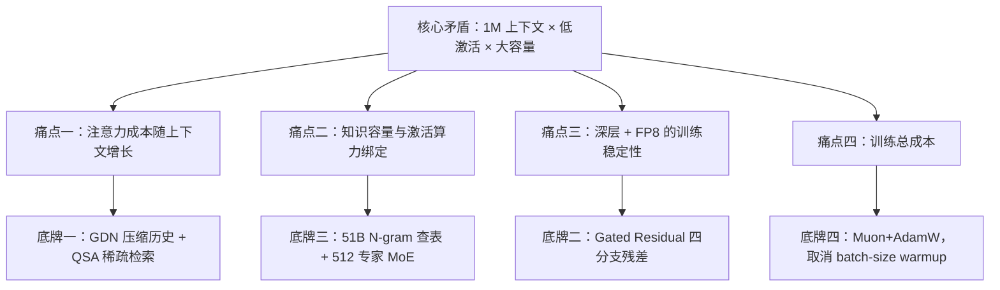
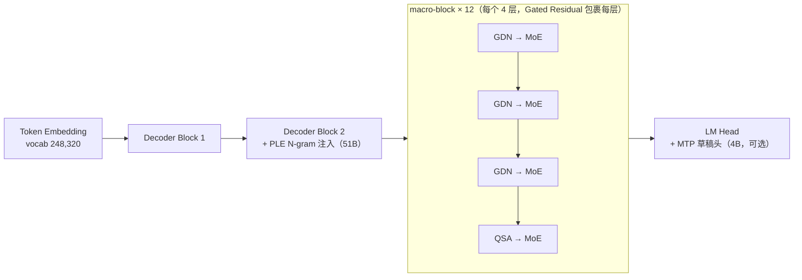
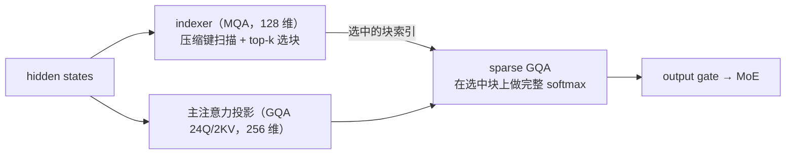

# Qwen3.8-Flash-Next 完全解析：Qwen4 架构预览版的四张底牌

> **一句话结论**：Qwen3.8-Flash-Next 是 2026 年 8 月 26 日发布的开放权重多模态 MoE 模型，也是 Qwen4 架构的官方早期预览版。它没有靠堆参数取胜，而是围绕「1M 上下文 × 低激活成本 × 大知识容量」这个不可能三角，同时打出四张底牌：**GDN+QSA 混合注意力**（解决长上下文成本）、**Gated Residual**（解决深层信息流与训练稳定性）、**51B N-gram Embedding**（把知识容量从激活算力中解耦）、**Muon+AdamW 训练配方**（把训练成本压到前代旗舰的约九分之一）。
>
> **阅读前提**：了解 Transformer 注意力、MoE 基本概念即可；线性注意力 / GDN 的完整数学推导见同目录 [linear-attention-to-gdn-to-kda.md](linear-attention-to-gdn-to-kda.md)，本文只在 §3 讲增量。
>
> **素材时点**：2026 年 8 月发布当周。所有官方自报数字均标注（vendor-reported）；超出官方资料的推断一律标注（解读）。

---

## 0. 速览

### 0.1 这个模型是什么

| 维度 | 内容 |
| --- | --- |
| 全名 | Qwen3.8-Flash-Next（HF 仓库 `Qwen/Qwen3.8-Flash-Next`，架构字符串 `qwen4_exp`） |
| 发布 | 2026-08-24 HF 权重提前上线，2026-08-26 ModelScope 正式发布 |
| 定位 | Qwen4 架构的早期预览（experimental preview），角色等同于 Qwen3-Next 之于 Qwen3.5 |
| 类型 | 开放权重、多模态（文本+图像+视频输入，文本输出）、稀疏 MoE |
| 许可证 | Qwen Community License 1.0（允许商用，超阈值 MaaS 业务需另签协议；非 Apache-2.0） |
| 上下文 | 原生 262,144 tokens，YaRN 外推至 1,000,000（factor=4.0） |
| 生产版本 | Qwen3.8-Flash（Qwen Cloud 托管 API，默认 1M 上下文 + 内置工具，标价 ¥1/¥3 每百万输入/输出 tokens，vendor-reported） |

一个常见混淆必须先拆开：**Flash-Next（开放权重、架构预览）≠ Flash（生产 API）**。想研究架构、自行部署，用前者；想直接调服务，用后者。下文除特别说明外，"本模型"均指 Flash-Next。

### 0.2 三个参数池：理解本模型的第一把钥匙

Flash-Next 最容易被误读的是参数量。它不是"一个 125B 模型"，而是**三个松散耦合的参数池**，只有一个池参与每 token 的矩阵乘：

| 参数池 | 参数量 | 角色 | 进入每 token FLOPs？ |
| --- | --- | --- | --- |
| 主干（GDN+QSA+MoE+LM head） | 125B | 主力计算 | 是，但每 token 只激活约 6B（≈4.8%） |
| N-gram Embedding 表 | 51B | 局部短语的"外置记忆"，第 2 层查表注入 | 否——确定性查表，无矩阵乘 |
| MTP 草稿头 | 4B | 1 层 + 独立 LM head，投机解码用 | 仅训练时 / 开启投机解码时 |
| 落盘总量 | ≈180B | 三者之和 | — |
| 每 token 激活 | 6B | 单次前向真正计算的规模 | 是 |

（数据来源：官方模型卡与 SGLang Day-0 博客；51B+4B 的拆分为官方模型卡口径，NVIDIA 把 N-gram 表计入后宣称 176B。）

这带来本模型的核心经济性：**以 6B dense 级别的单 token 算力，驱动 180B 级别的存储容量**。四张底牌全部服务于这个"算力-容量解耦"的设计目标。

### 0.3 四张底牌的逻辑链



### 0.4 阅读导航

- 只想拿结论：§0、§12。
- 想看最大创新点（稀疏注意力）：§4（全文最长、最核心的一节）。
- 想看"51B 参数但不耗算力"是怎么回事：§6。
- 想看训练侧（Muon、取消 warmup、1/9 成本）：§9。
- 想看跑分与可信度辨析：§10；想部署：§11。

---

## 1. 核心矛盾：长上下文时代的"不可能三角"

**结论先行**：Flash-Next 的全部架构选择，可以被理解为同时缓解三个两两冲突的成本——注意力成本随长度增长、知识容量与激活算力绑定、深层训练不稳定。传统 dense Transformer 在这三个轴上都被锁死，Flash-Next 的做法是把三条锁逐一换掉。

### 1.1 痛点一：注意力成本随上下文增长

标准 softmax 注意力中，预填充计算量随序列长度 $L$ 以 $O(L^2)$ 增长；解码每生成一个 token，都要重读全部 KV cache，访存量 $O(L)$。当 $L$ 推到 262K 乃至 1M，KV cache 的显存占用与访存带宽双双成为瓶颈：注意力从"算力问题"退化为"显存+带宽问题"（memory-bound 的完整论证见 [online-softmax-to-flashattention.md](online-softmax-to-flashattention.md)）。

### 1.2 痛点二：知识容量与激活算力绑定

dense 模型里，"记住更多知识"几乎只有一条路：加参数。而加参数直接抬高每 token 的 FLOPs——容量与算力是同一枚硬币。MoE 把两者部分解耦（总参数涨、激活不涨），但专家参数仍需驻留显存并参与路由计算，解耦并不彻底。

### 1.3 痛点三：深层 × 混合架构 × 低精度训练的稳定性

48 层、混合两种注意力机制、还要上 FP8 降本——这三个因素叠加，对残差流的信息传递与激活值分布提出了远超常规模型的要求。activation outlier 正是大规模 MoE FP8 训练难做的首要原因。

### 1.4 本文主线

| 痛点 | 传统方案 | Flash-Next 的答案 | 章节 |
| --- | --- | --- | --- |
| 注意力成本 | 全量注意力 / GQA 压缩 KV | GDN（36 层，固定状态）+ QSA（12 层，稀疏检索） | §3、§4 |
| 容量-算力绑定 | 加 dense 参数 / 加专家 | 512 专家 MoE + 51B N-gram 查表（零 FLOPs 扩容） | §6、§7 |
| 训练稳定性 | 单残差流 + 各种补丁 | Gated Residual 四分支门控残差 + 稳定性三件套 | §5、§7 |
| 训练成本 | AdamW + batch-size warmup | Muon+AdamW 分工 + 取消 warmup + scaling law 重拟合 | §9 |

---

## 2. 宏观骨架：12 个 macro-block 的混合架构

**结论先行**：48 层 = 12 个 macro-block，每个 macro-block 是「3×(GDN→MoE) + 1×(QSA→MoE)」。这个 3:1 的混合骨架继承自 Qwen3-Next，是"谱系"；槽位里填的东西——QSA 替换全量注意力、Gated Residual 包裹每层、PLE 在第 2 层注入——才是"创新"。

### 2.1 骨架图



### 2.2 关键超参数一览

| 配置 | 数值 | 备注 |
| --- | --- | --- |
| 总层数 | 48 | 36 GDN + 12 QSA，3:1 |
| hidden dim | 2,560 | 前身 Qwen3-Next 为 2,048 |
| MoE | 512 专家，top-10 路由 + 1 shared | expert intermediate dim 640，全局负载均衡 |
| 原生上下文 | 262,144 | YaRN factor 4.0 外推至 1M |
| 位置编码 | RoPE，$\theta=10^7$ | partial rotary factor 0.25（QSA 头内 64 维做旋转）；多模态用 interleaved MRoPE，section [11, 11, 10] |
| 词表 | 248,320（padded） | BPE 沿用 Qwen3 系，基座约 151K，padding 原因官方未说明 |
| 多模态 | 文本+图像+视频输入 | 视觉编码器细节官方披露有限 |

（来源：官方 HF 模型卡 config 与官方博客，经二手转录交叉核对。）

### 2.3 谱系判断：骨架是继承，槽位是创新

直接前身是 Qwen3-Next-80B-A3B（2025 年 9 月）：同样的 48 层、同样的 3:1 macro-block 骨架，但注意力槽位填的是**全量 Gated Attention**，hidden 2048，expert dim 512，没有 N-gram Embedding、没有 Gated Residual、训练用 AdamW，且是纯文本模型。

这一谱系判断的意义在于预测未来：Qwen3-Next（2025 末预览 GDN 混合架构）→ Qwen3.5 系列规模化采用，间隔以月计。Flash-Next 对 Qwen4 扮演完全相同角色——**架构金丝雀先飞，文档与完整产品系列随后**（解读：若节奏复刻，Qwen4 系列完整发布与 Flash-Next 之间也大约是月级间隔）。

### 2.4 与前身的完整对照

| 组件 | Qwen3-Next-80B-A3B（2025-09） | Flash-Next（2026-08） |
| --- | --- | --- |
| 主干总参数 / 激活 | 80B / 3B | 125B / 6B |
| hidden dim | 2,048 | 2,560 |
| expert intermediate dim | 512 | 640 |
| 层数与骨架 | 48 层，3:1 macro-block | 相同（继承） |
| 注意力槽位 | 全量 Gated Attention | QSA（块级稀疏，预算 512 块 / 2048 token） |
| GDN V heads | 32 | 48 |
| N-gram Embedding | 无 | 51B，第 2 层注入 |
| 残差结构 | 标准单残差流 | Gated Residual（4 分支，rank 320，FP8 态） |
| MTP 层注意力 | 全量注意力 | QSA |
| 优化器 | AdamW | Muon（2D 线性映射）+ AdamW（embedding / router / GR 低秩） |
| batch-size warmup | 常规做法 | 取消（省 18.8% 优化器步数） |
| 模态 | 纯文本 | 多模态（文本+图像+视频） |
| 词表（padded） | 约 151K | 248,320 |
| 架构字符串 | `qwen3_next` | `qwen4_exp` |
| 许可证 | Apache-2.0 | Qwen Community License 1.0 |

一句话总结这张表：**骨架继承，六个槽位重造**——注意力换 QSA、残差换 GR、容量加 PLE、优化器换 Muon、MTP 换 QSA、模态加视觉。

---

## 3. GDN 增量：36 层线性注意力负责"记住"

**结论先行**：GDN（Gated DeltaNet）在 Flash-Next 中承担"用固定大小状态压缩全部历史"的角色，使 36/48 层的 KV 开销与序列长度彻底无关。本代的变化很小但方向明确：value 头数从 32 加到 48（+50%），其余不变。

### 3.1 一分钟回顾 GDN

GDN 出自论文《Gated Delta Networks: Improving Mamba2 with Delta Rule》（arXiv:2502.05246），是线性注意力的一支：不维护随长度增长的 KV cache，而是维护一个固定大小的循环状态 $S_t \in \mathbb{R}^{d_k \times d_v}$，用带门控的 delta 规则更新：

$$S_t = S_{t-1}\,\mathrm{Diag}(\boldsymbol{\alpha}_t)\left(I - \beta_t k_t k_t^\top\right) + \beta_t\, v_t k_t^\top$$

其中 $\boldsymbol{\alpha}_t$ 是逐通道遗忘门，$\beta_t$ 是学习到的写入门，$k_t$ 归一化。直觉上：先按门控遗忘旧内容，再用 delta 规则"擦掉旧值、写入新值"。完整的从 Linear Attention → DeltaNet → GDN → KDA 推导链见 [linear-attention-to-gdn-to-kda.md](linear-attention-to-gdn-to-kda.md)，本文不重复。

设计分工的官方表述是：**"GDN 高效地'记'，QSA 精确地'取'"**。GDN 状态不随 $L$ 增长，所以长上下文的边际成本被压平；代价是压缩必有损，精确检索交给那 12 层 QSA。

### 3.2 本代的唯一变化：加宽 value 投影

| 配置 | Flash-Next | Qwen3-Next-80B-A3B |
| --- | --- | --- |
| GDN 层数 | 36 | 36 |
| V heads | **48** | 32 |
| QK heads | 16 | 16 |
| head dim | 128 | 128 |

V 头 +50% 大致跟随 hidden dim 2048→2560 的加宽，而 QK 头数与 head dim 不动。（解读：只加宽 value 投影、不加宽 query/key 投影，是用很小算力代价换状态表达能力的做法——状态 $S$ 的"值维度"变宽，能记住的历史细节更多，而决定"读写什么"的 QK 侧成本不变。）

### 3.3 对 KV cache 的结构性意义

模型级的 KV 节省来自**混合布局本身**，而不是单层技巧：48 层里只有 12 层 QSA 需要随长度增长的注意力 KV，36 层 GDN 的状态是固定大小。再叠加上下文：QSA 层内部还有自己的索引压缩（§4），两层节省是相乘关系。

---

## 4. QSA 详解：先粗检索，再精注意

**结论先行**：QSA（Qwen Sparse Attention）是本次最大的架构创新，它把 Qwen3-Next 注意力槽位里的全量 Gated Attention 换成"两阶段稀疏注意力"——轻量 indexer 以 micro-block 为粒度估计重要性并选出 top-512 块，主注意力只在选中的约 2048 个 token 上做完整 softmax。注意力成本从此随**固定预算**增长，而不再随上下文长度增长（唯一的例外是 indexer 扫描本身，见 §4.7）。

### 4.1 两阶段总览

每个 QSA 层有两条路径：



| 配置 | 数值 |
| --- | --- |
| 主注意力 | GQA：24 Q heads / 2 KV heads，head dim 256 |
| RoPE | partial rotary factor 0.25（仅 64 维旋转），多模态 MRoPE |
| indexer 结构 | MQA：4 个 query head + 1 个共享 key head，head dim 128 |
| 压缩比 | c4：每 4 个原始 index key 压成 1 个压缩 key |
| 每层预算 | top-512 blocks = 2,048 tokens，外加当前不完整块 ≤3 个 token |
| 层数 | 12（每个 macro-block 1 层） |

（来源：官方模型卡 config + SGLang Day-0 博客。）

### 4.2 indexer 的 c4 压缩管线

indexer 自己也是一个微型注意力，但它的 key 序列被压缩了 4 倍。对每 4 个连续的原始 index key：

1. **FP32 求平均**：4 个 128 维向量逐元素平均，得到 1 个压缩 key；
2. **归一化**；
3. **统一旋转**：用该块**第一个 token 的 MRoPE 位置**对压缩 key 做旋转。

于是长度为 $L$ 的序列在 indexer 眼里只有 $\lceil L/4 \rceil$ 个"micro-block"可打分。

（解读：把整块 4 个 key 锚定到同一个参考位置旋转，相当于把"这块内容在哪里"的相对位置差异从索引分里抹掉，使块与块的重要性分数更可比——块的真实位置信息并没有丢，因为最终注意力用的是原始 K/V 和它们自己的位置编码，见 §4.4。压缩 key 只是一个"检索地址"，不承担数值表达。）

### 4.3 打分、选块与 2051 上界

query $q^I_{t,h}$（4 个头）对压缩 key $\bar{k}^I_b$ 的打分采用无 softmax 的 ReLU 打分：

$$s_{t,b} = \frac{1}{\sqrt{128}} \sum_{h=1}^{4} \mathrm{ReLU}\left(\left\langle q^I_{t,h},\, \bar{k}^I_b \right\rangle\right)$$

然后保留分数最高的 512 个块，展开回 $512 \times 4 = 2048$ 个逻辑 token 位置，再附上当前尚未成块的 0–3 个 token。**最终稀疏注意力看到的 token 数上界为 $2048 + 3 = 2051$，与上下文长度无关。**

这个"上界与 $L$ 无关"是 QSA 的核心性质：无论上下文是 32K 还是 1M，每个 QSA 层的主注意力成本被钉死在常数。

（对照：ReLU 打分 + 多 query head 共享 key 的 indexer 形态，与 DeepSeek-V4 的 lightning indexer 同属一个设计家族——用无归一化打分的代价换取 kernel 友好性，见 [deepseek-v4.md](deepseek-v4.md) §4；注意力头侧从 MHA 到 GQA/MLA 的演进背景见 [mha-to-mqa-gqa-to-mla.md](mha-to-mqa-gqa-to-mla.md)。）

### 4.4 索引与数值分离：压缩 key 不参与最终计算

一个必须强调的设计：**压缩 key 只用于"选哪里"，不用于"算什么"**。top-k 选出块之后，最终的 softmax 与 value 加权全部在**原始的、未压缩的 K/V** 上进行。这带来两个后果：

- 检索质量只影响"看哪些块"，不污染注意力数值本身——c4 平均造成的位置模糊不会进入输出；
- KV cache 仍需保留原始 K/V——QSA 省的是**计算与访存**，不是这一层的 KV 容量；模型级 KV 节省来自 3:1 混合布局（§3.3）。

工程实现上（SGLang）：QSA 为每 4 个 token 追加 1 个 BF16 压缩索引 key；当前未完整块的原始 index key 放在每请求 4 槽环形缓冲里，不为全量上下文保留原始 index key——索引缓存开销因此降低约 80%；压缩缓存按页对齐寻址（full_slot / 4），可直接挂在 Radix Cache 的所有权体系下，无需独立生命周期。

### 4.5 为什么逐层独立压缩，而不跨层共享索引

一个自然的疑问：既然 indexer 选块很贵，为什么不像 IndexCache 那样跨层复用选择结果？官方给出的理由是**混合架构下跨层复用根本不成立**：GDN 层用循环状态工作，不产生可供下一注意力层使用的 token 级索引；GDN 与 QSA 交错排布，索引的生命周期被天然打断。逐层独立压缩是为"混合架构能真正工作"付的代价。

这个决策的工程后果直接催生了 §8 的 IndexShare MTP：层间不能共享，但至少**投机解码的 draft 步之间**可以共享。

### 4.6 与主流稀疏注意力的对照

| 维度 | QSA（本文） | DeepSeek DSA（V3.2/V4 系） | NSA | MoBA |
| --- | --- | --- | --- | --- |
| 选择粒度 | micro-block（4 token/块） | token 级（lightning indexer） | 块级（压缩+选择+滑动三分支） | 块级 |
| 每层预算 | 512 块 / 2048 token | top-k token（2048 量级） | 多分支合并 | top-k 块 |
| 索引与数值 | 分离（压缩 key 仅索引） | 分离 | 压缩分支直接参与注意力 | 不分离（块内全量） |
| 跨层共享 | 不做（混合架构限制） | 不做 | 不做 | 不做 |
| 配套架构 | GDN 混合（3:1） | MLA | 全注意力堆叠 | 全注意力堆叠 |

（解读：QSA 与 NSA 在"块级选择"上最像，但 NSA 的压缩分支直接产出参与 softmax 的压缩 K/V，而 QSA 的压缩 key 纯粹是检索地址；与 DSA 相比，QSA 用 4 倍块压缩把 indexer 扫描成本再降一档，代价是检索粒度变粗——两者都是"indexer 廉价化"路线上的不同折中。）

### 4.7 成本核算与加速比的口径辨析

**结构账**（解读，简化解码单 token 单层访存模型）：设上下文长度 $L$，BF16（2 字节）：

| 路径 | 访存量 | $L=1\text{M}$ 时 |
| --- | --- | --- |
| 全量 GQA（2 KV heads × 256 维，K+V） | $L \times 2 \times 256 \times 2 \times 2$ B $= 2048L$ B | ≈ 2.1 GB |
| QSA indexer 扫描 | $\frac{L}{4} \times 128 \times 2$ B $= 64L$ B | ≈ 67 MB |
| QSA 稀疏注意力（固定 2048 选中位） | $2048 \times 2 \times 256 \times 2 \times 2$ B | ≈ 4.2 MB（常数） |

即：主注意力部分变成常数，只剩下 indexer 的 $64L$ 线性扫描——字节数是全量 KV 的 1/32。理论上注意力层访存收益约一个数量级。

**实测账**（vendor-reported，口径各异，不可横比）：

| 数字 | 口径 |
| --- | --- |
| prefill 7.6× / decode 4.9× | 1M 上下文，QSA kernel vs 全量注意力 kernel 的微基准 |
| 8.6× prefill 吞吐 | 线上 serving 场景、90% prefix 命中、对比 Qwen3.7-Plus（1M 上下文） |
| 10.2× / 6.6× | SGLang cookbook / vLLM recipe，各自框架与基线不同 |

为什么实测（4.9×）远小于结构账（~30×）？SGLang 的一句话点破了瓶颈转移：**"超过几千 token 之后，决定这层成本的是 indexer，而不是它喂给的注意力"**——indexer 扫描仍是 $O(L)$，长上下文下它成为新瓶颈。这正是 §8 IndexShare MTP 要消除的浪费，也是评价 QSA 时必须记住的一点：**QSA 把注意力的成本曲线从 $O(L)$ 压成常数，但把一条细的 $O(L)$ 尾巴留给了 indexer**。

### 4.8 工程落地：prefill 与 decode 的 kernel 路径（SGLang）

QSA 的收益高度依赖 kernel 实现。SGLang Day-0 版本的工程要点（vendor-reported）：

- **prefill**：自定义 GPU kernel 计算索引分 → 快速 top-k 选块 → Triton 展开索引并执行 sparse GQA；
- **decode**：分页版打分器；把选中的原始 K/V 紧凑化（compact）后，Blackwell 上派发给 TRTLLM-Gen kernel，其他硬件走 packed FlashAttention；
- **重叠**：indexer 可放到第二条 CUDA stream 上，与主注意力的 Q/K/V 投影并行；metadata 路径兼容 CUDA graph；
- **挂载方式**：indexer 只挂在 QSA 层，复用其 MRoPE 实现；原始 K/V 留在常规分页池，压缩索引缓存按页对齐寻址以兼容 Radix Cache（§4.4）。

### 4.9 全模型状态账本：一条序列到底要记多少东西

把 36 层 GDN 与 12 层 QSA 的状态加总，可以得到每条序列完整的"记忆"占用（解读，BF16 估算）：

| 状态类型 | 计算 | 随 $L$ 增长？ |
| --- | --- | --- |
| GDN 循环状态（36 层） | 16 QK heads $\times\, 128 \times 128 \times 36$ 层 $\approx 9.4$M 元素 $\approx 19$ MB | 否，固定 |
| QSA 原始 K/V（12 层） | $L \times 2 \text{ heads} \times 256 \times 2(\text{K,V}) \times 2\text{B} \times 12$ 层 $= 24L$ KB | 线性 |
| QSA 压缩索引（12 层） | $\frac{L}{4} \times 128 \times 2\text{B} \times 12$ 层 $= 0.77L$ KB | 线性，但仅为 KV 的 1/32 |

代入具体长度（对照组：假想 48 层全量 GQA-2 模型，同 head 配置）：

| $L$ | 本模型每序列状态 | 48 层全量 GQA 对照 |
| --- | --- | --- |
| 262K（原生） | KV 6.4 GB + 索引 0.2 GB + GDN 0.02 GB $\approx$ **6.6 GB** | 25.8 GB |
| 1M（YaRN） | 24.6 + 0.8 + 0.02 $\approx$ **25.4 GB** | 98 GB |

（解读：容量层面的 4 倍节省完全来自 3:1 混合布局——只有 1/4 的层存 KV；QSA 的稀疏选择省的是**每 token 的访存与计算**（§4.7），不是 KV 容量本身。两层机制一个管"存多少"，一个管"读多少"，这正是 §0.3 逻辑链中"GDN 压缩历史 + QSA 稀疏检索"分工的定量表达。）

---

## 5. Gated Residual：把残差流从单车道扩成四车道

**结论先行**：Gated Residual（GR）是 Hyper-Connection（多分支残差加宽）与 GatedNorm（逐元素动态门控）两个既有思想的组合简化版：残差流从 1 条扩成 4 条并行分支，每层用数据依赖的门控决定"从每条分支读多少、往每条分支写多少"。官方报告了两个重要现象：一条分支自发演化为跨层长程通路；门控有效抑制 activation outlier，这正是 FP8 训练稳定性的关键。

### 5.1 谱系：两个论文的组合

- **Hyper-Connection**（Sun et al., arXiv:2409.19606）：把单残差流加宽为多条并行流，层与层之间通过可学习的混合矩阵读写，改善深层网络的信息传递与训练动态；
- **GatedNorm**（arXiv:2504.16086）：在残差读取处引入逐元素（per-token、per-channel）的动态门控。

Qwen 的组合做了减法：原始 Hyper-Connection 有额外的分支间混合操作，GR 认为**只要读写门足够有表达力，分支混合可以由门控隐式完成**，于是砍掉了显式混合，实现复杂度更低（官方博客表述，经二手转录）。

### 5.2 机制：Mix 读，Combine 写

由于 Attention 与 MoE 都在单一 hidden state 上工作，每个 block 两端各有一个变换（以下数学骨架为解读，依据 Hyper-Connection 框架与 SGLang kernel 描述重构，官方未公布完整公式）：

**读（Mix）**：用低秩投影（bottleneck rank 320）从 4 条分支生成逐元素读门，把 4 条流压回 1 个 hidden：

$$h_t = \sum_{i=1}^{4} g^{r}_{t,i} \odot R_{t,i}, \qquad g^r_t = \sigma\!\left(W_{\uparrow}\, \phi\!\left(W_{\downarrow}\, \mathrm{concat}_i(R_{t,i})\right)\right)$$

其中 $W_{\downarrow}$ 把输入压到 rank-320 瓶颈，$\odot$ 是逐元素乘，门 $g^r_{t,i} \in \mathbb{R}^{d}$ 是 per-token、per-channel 的。

**写（Combine）**：子层输出 $o_t$ 经 4 个 per-branch 标量注入系数写回各分支：

$$\widetilde{R}_{t,i} = R_{t,i} + \alpha_{t,i} \cdot o_t, \qquad i = 1, \dots, 4$$

| 配置 | 数值 |
| --- | --- |
| 分支数 | 4 |
| 瓶颈 rank | 320 |
| 读门 | 逐元素、数据依赖（per-token、per-channel） |
| 写门 | per-branch 标量 |
| 残差状态精度 | FP8（降低访存；对 memory-bound 的 decode 收益更大） |

### 5.3 官方报告的两个现象

1. **长程通路自发形成**（官方资料）：4 条分支中有一条自发演化为连接第一个注意力层与大部分中后层的长程通路——模型自己学会了用一条分支当"信息高速公路"，绕过中间层的反复改写；
2. **抑制 activation outlier**（官方资料）：门控"有效抑制激活异常值并提升训练稳定性"。这条声明的分量在于：activation outlier 是大规模 MoE 上 FP8 训练难做的主要原因，GR 若真能从架构层面压住 outlier，FP8 残差态 + FP8 训练的组合才有地基。

### 5.4 kernel 工程：按 M 分派的 Mix/Combine

GR 的 Mix/Combine 每层各调用两次，decode 时 $M$（一次调用的 token 数）极小、prefill 时可达数千，单一 kernel 无法两头都快。SGLang 与 NVIDIA 合作、经 FlashInfer 发布的实现按 $M$ 分派（SGLang Day-0 博客，vendor-reported）：

- **Mix**：$M \le 16$ 用 FlashInfer 的 split-K CuTe GEMM（切 K 维补 M 维并行度），SiLU/Sigmoid/gating/归约全部融进 GEMM epilogue；大 $M$ 用 cuBLAS。$M=4$ 时延迟 12.36 → 6.03 µs（2.05×），端到端投机解码吞吐 +7.6%；
- **Combine**：大 $M$ 单 kernel 每 token 行单 pass；$M \le 32$ 沿 hidden 维拆行补并行度，同时保持 FP32 累加顺序与参考实现 bit 级一致。$M=4$ 时 4.17 → 2.13 µs（1.96×），端到端 +5.49%；大 $M$ 融合 kernel 对 cuBLAS 基线最高 2.54×，有效带宽 6144 GB/s。

架构层面的启示：GR 这种"数学上简单、形状上极端"的算子，收益高度依赖 shape-aware kernel 分派——这也是新架构预览版需要 serving 栈 Day-0 共建的原因。

### 5.5 与 DeepSeek-V4 mHC 的对照

GR 与 DeepSeek-V4 的 mHC（流形约束超连接，见 [deepseek-v4.md](deepseek-v4.md) §3）同属"残差加宽"家族，都是 4 分支，但**稳定性来源截然相反**：

| 维度 | GR（本文） | mHC（DeepSeek-V4） |
| --- | --- | --- |
| 分支数 | 4 | 4（$n_{\text{hc}}=4$） |
| 分支间混合 | 无显式混合矩阵，由读写门隐式完成 | 显式车道间变换矩阵 $B_l$ |
| 稳定性机制 | 数据依赖门控抑制 activation outlier（经验性） | $B_l$ 约束在双随机矩阵流形（Birkhoff 多面体）：谱范数 $\le 1$、对乘法封闭（数学保证） |
| 实现代价 | 低秩门（rank 320）+ 融合 GEMM | 每次前向 20 次 Sinkhorn-Knopp 迭代投影（可微） |
| 公开开销 | FP8 残差态降访存；融合 kernel 后 Mix/Combine 微秒级 | wall-time 约为 1F1B 流水线阶段的 6.7%，另有激活显存与流水线通信增量 |

（解读：mHC 用经典数学结构从**构造上**根治深层堆叠不稳定，代价是每层的投影迭代与显存开销；GR 赌的是**门控的表达力足以隐式完成分支混合**，从而砍掉显式混合矩阵，换来更简单的实现与更小的运行时开销。两条路线都把"单残差流"视为瓶颈，分歧只在"约束放数学里还是放数据里"。哪个更优，要等两家各自的完整技术报告与外部复现来回答。）

---

## 6. N-gram Embedding（PLE）：51B 参数的"零算力"记忆

**结论先行**：N-gram Embedding 是一块 51B 参数的哈希寻址查找表，插在第二个 decoder block，用"当前 token + 前若干 token"的局部上下文查出 16 行向量注入残差分支。因为查表地址由 token id 确定性决定，它**不进每 token 的 FLOPs 预算、可以提前异步预取、可以整体放在主机内存**——这是一条比加 MoE 专家便宜得多的容量扩展轴。

### 6.1 是什么：哈希寻址的局部模式记忆

标准 token embedding 按单个 token 查表；N-gram Embedding 按局部上下文查表，为常见短语与局部模式提供"现成的"表示。本模型的配置（SGLang Day-0 博客 + 官方模型卡）：

| 配置 | 数值 |
| --- | --- |
| 注入位置 | 第 2 个 decoder block（layer id 2，0-based 第 1 层） |
| hash 头 | 8 个 2-gram 头（用 $x_{t-1}, x_t$）+ 8 个 3-gram 头（用 $x_{t-2}, x_{t-1}, x_t$） |
| 每 token 查行数 | 16 行，每行 160 维，拼接成 $E_t \in \mathbb{R}^{2560}$ |
| 表规模 | 每个 hash 头一张 20M 表项的表 |
| 总参数 | $16 \times 20\text{M} \times 160 \approx 51.2\text{B}$，BF16 约 95.4 GiB |
| 运行时状态 | 每请求：最近 2 个 token id（算 hash）+ short-conv 历史 $[10240, 9]$ |

### 6.2 注入流程：一次带门控的"记忆写入"

PLE 不是简单把查表结果加到 hidden 上，而是一套嵌入 Gated Residual 体系的注入流程（SGLang 博客给出的数据流）：

$$E_t \rightarrow K_t \in \mathbb{R}^{4 \times 2560}, \qquad E_t \rightarrow V_t \in \mathbb{R}^{2560}$$

$$R_t \rightarrow Q_t \in \mathbb{R}^{4 \times 2560}$$

$$g_t = \mathrm{Gate}\!\left(\mathrm{Norm}(Q_t),\, \mathrm{Norm}(K_t)\right) \in \mathbb{R}^{4 \times 1}, \qquad U_t = g_t \odot V_t$$

$$\Delta_t = U_t + \mathrm{SiLU}\!\left(\mathrm{DWConv}\!\left(\mathrm{RMSNorm}(U_t)\right)\right)$$

$$\widetilde{R}_t = R_t + \Delta_t, \qquad \widetilde{R}_t \xrightarrow{\mathrm{HC\ Mix}} h_t \in \mathbb{R}^{2560}$$

即：查表得到的 $E_t$ 被投影成与 4 条残差分支对齐的 key/value；由当前残差状态 $R_t$ 产生的 query 与之算门控，决定"这条记忆往每条分支写多少"；再经 short-depthwise-conv 注入局部时序混合，最后作为增量写回 4 条分支，随即进入该层的 HC Mix。注意两点：

- PLE 的写入**先于** HC Mix——它本质上是向残差流注入信息，而不是旁路输出；
- target 模型在 prefill / decode / 投机验证中都保留 PLE；只有一层的 MTP 草稿模型禁用它（草稿求快，记忆查表交给 target 把关）。

### 6.3 为什么这是"零 FLOPs 扩容"

逻辑链值得单独写清楚，因为它是本模型最反直觉的部分：

1. **查表地址确定**：第 $t$ 个 token 要查的 16 行，只取决于 $x_{t-2}, x_{t-1}, x_t$ 三个 token id——地址在计算开始前就已知；
2. **确定 ⇒ 可预取**：地址已知，就可以提前从主机内存把 16 行（$16 \times 160 \times 2$ B $= 5$ KB）异步搬进显存，与主干计算完全重叠；
3. **可预取 ⇒ 可 offload**：表不需要常驻 GPU，放 pinned host memory 即可；
4. **无矩阵乘**：每 token 只做 16 次 gather，FLOPs 预算为零。

对比 MoE 扩容：加专家要占显存、要路由计算、要 all-to-all 通信；加 N-gram 表只要内存与 PCIe/NVLink 带宽。官方把这条轴定位为"更适合内存受限加速器上的参数扩展与卸载"。

### 6.4 offload 实测

SGLang 在 H200、TP4、MTP-213（2 draft 步、top-k 1、每轮 3 草稿 token）下的实测（vendor-reported）：

| 指标 | offload 前 | offload 后 | 变化 |
| --- | --- | --- | --- |
| target 权重显存 / GPU | 83.91 GiB | 60.45 GiB | −23.46 GiB |
| 可分配 KV 容量 | 1.84M tokens | 3.28M tokens | +78.54% |
| 吞吐（1/2/4 并发） | — | — | 几何平均 −0.07%（无损） |
| 输出一致性 | — | — | 4 组固定 prompt × 128 token 输出 id 逐位一致 |

用 23 GiB 显存换 KV 容量近翻倍、吞吐无损——这是 PLE"存储换显存"经济性的直接证据。限制：该 offload CUDA 路径发布时仅支持 NVIDIA。

### 6.5 谱系与定位

N-gram 查表扩容不是凭空出现：Gemma 3n 的 Per-Layer Embedding（PLE）给出了"分层外置嵌入 + 主机卸载"的形态；DeepSeek 的 Engram 工作（arXiv:2507.13028，Conditional Memory via Scalable Lookup）证明了该思路可以规模化。Qwen 的贡献是**把它做到 51B 并放进成本档模型的中心位置**（解读：DeepSeek 验证了"能 work"，Qwen 回答了"能不能当主力扩容轴"）。

社区视角值得一提：由于 51B 大表稀疏访问且天然适合系统内存 offload，本地部署估算（4-bit 理想量化约 82 GB：58 GB 主干 + 24 GB 表，社区估算非官方）使这个 180B 存储的模型对单节点本地部署异常友好——"参数大头在内存里、计算大头在 6B 激活里"恰好是本地场景的理想形态。

### 6.6 两条容量扩展轴的对比：加专家 vs 加查表

把 PLE 与 MoE 放在一起看，才能理解"第三条扩容轴"的含义：

| 维度 | 加 MoE 专家 | 加 N-gram 表（PLE） |
| --- | --- | --- |
| 每 token FLOPs | 激活专家数不变则不变 | 严格为零（纯 gather） |
| 显存占用 | 必须常驻 GPU | 可整体 offload 到主机内存 |
| 访问模式 | 学习路由，有负载不均风险 | 哈希寻址，确定性且天然均匀 |
| 通信 | 专家并行 all-to-all | PCIe/NVLink 异步预取，可与计算重叠 |
| 表达内容 | 通用条件计算（"会做什么"） | 局部短语的静态模式记忆（"见过什么"） |
| 训练更新 | 梯度更新（本模型走 AdamW） | 梯度更新（本模型走 AdamW） |

（解读：MoE 提供的是"条件计算容量"——按内容选择计算路径；PLE 提供的是"静态记忆容量"——把高频局部模式的表示直接存起来。两者回答的问题不同，因此互补而非竞争；Flash-Next 把两条轴同时拉满，是"容量效率优先"设计哲学（§12.2）最直观的体现。）

---

## 7. MoE 与稳定性三件套：继承自 Qwen3-Next 的底座

**结论先行**：MoE 与稳定性技术本代没有结构性创新，但有两点值得记录：专家 FFN 加宽（512→640）与"全局负载均衡下堆总专家数"的官方方法论；三项 Qwen3-Next 首创的稳定性技术原样保留——在大改架构的同时保留它们，本身就是"它们确实有用"的证据。

### 7.1 MoE：512 专家与全局负载均衡

| 配置 | 数值 |
| --- | --- |
| 总专家 | 512 |
| 路由专家 / token | 10 |
| shared 专家 | 1 |
| expert intermediate dim | 640（Qwen3-Next 为 512） |
| 激活比例 | ≈2%（10/512） |
| 负载均衡 | 全局（非 per-batch） |

官方博客给出的方法论值得原文引用（经二手转录）："在全局负载均衡下，保持激活专家数不变、持续增加总专家参数，训练 loss 稳定下降。"（解读：这等于官方表态——在"加总专家数"与"加每 token 激活参数"两条扩容轴之间，Qwen 认为前者效率更高，与行业走向超细粒度 MoE 的趋势一致。）

### 7.2 稳定性三件套（沿用，非本次创新）

三项技术首次出现在 Qwen3-Next，本代原样保留：

1. **Zero-centered RMSNorm + 对 norm 权重施加 weight decay**：防止长预训练中 norm 尺度漂移；
2. **Attention output gating**（arXiv:2502.05711）：给注意力输出加门控非线性，带来稀疏性且 attention-sink-free；
3. **Normalized MoE router init**（arXiv:2501.11873）：稳定训练早期的专家分配。

多数生产级 MoE 配方不会三件齐用；架构大改后仍然保留，说明它们在真实训练中承担着不可省略的职责。

---

## 8. MTP 与 IndexShare：投机解码如何搭上 QSA 的车

**结论先行**：4B 的 MTP 草稿头（1 层 + 独立 LM head）本身沿自 Qwen3-Next，但两点是本代特有：草稿层内部用 QSA 而非全量注意力，保持投机路径廉价；SGLang 的 IndexShare MTP 让一轮投机迭代内的所有 draft 步复用同一份 QSA top-k 选择，消掉长上下文下 draft 路径的最大开销。

### 8.1 MTP 配置

| 配置 | 数值 |
| --- | --- |
| MTP 层数 | 1（+ 独立 LM head） |
| 参数 | 4B |
| 层内注意力 | QSA（Qwen3-Next 用全量注意力） |
| 训练方式 | multi-step，训练-推理一致 |
| vLLM 开启 | `--speculative-config '{"method":"qwen3_next_mtp","num_speculative_tokens":2}'` |
| SGLang 开启 | `--speculative-algo NEXTN --speculative-num-steps 3 --speculative-eagle-topk 1 --speculative-num-draft-tokens 4` |

MTP 不开启时完全不参与推理；训练时多 token 目标同时充当主干 hidden state 的正则项。投机解码的机制背景（draft-verify、bundle、接受长度）见 [speculative-decoding-to-dspark.md](speculative-decoding-to-dspark.md)。

### 8.2 IndexShare MTP：把 indexer 从 draft 步里踢出去

回忆 §4.7 的瓶颈转移：长上下文下 QSA 层的成本在 indexer 而不在注意力。投机解码把这个成本**乘以步数**：一轮 $N$ 步的 MTP 迭代要跑 $N$ 次 indexer（$N-1$ 次 draft decode + 1 次 draft-extend），却只把草稿推进至多 $N$ 个位置。

IndexShare 的做法：draft-extend 对 target 刚接受的 token 算出的 QSA top-k 选择，**冻结保留整轮 MTP 迭代**；后续每个 draft decode 步跳过 indexer，直接读这份冻结选择 + 本轮新草稿出的少量位置。选块结果在几步之内几乎不失效，而 indexer 扫描从 $N$ 次降为 1 次。

实测（SGLang，vendor-reported）：B200、TP4、NVFP4 checkpoint，batch size 1 解码 540 tok/s，接受长度 3.3（含 bonus token）。

### 8.3 一层因果链

GDN 混合布局 ⇒ 无法跨层共享索引（§4.5）⇒ indexer 逐层独立 ⇒ indexer 成为长上下文新瓶颈（§4.7）⇒ 投机解码放大 indexer 成本 ⇒ IndexShare 在迭代内复用。**架构决策的代价沿着工程链传导，最后由一个系统优化来兜底**——这是观察新架构落地时最值得学的思维方式。

---

## 9. 训练配方：Muon 分工、scaling law 重拟合与取消 warmup

**结论先行**：训练侧的三个变化与架构侧同等重要——Muon/AdamW 按参数类型分工、为新架构+新优化器重拟合 scaling law、直接取消 batch-size warmup。三者合起来构成官方宣称"训练成本约为 Qwen3.7-Plus 九分之一"的主要解释（vendor-reported）。

### 9.1 Muon + AdamW：按参数本性分工

Muon 的适用前提是参数"本质上充当二维线性映射"。Flash-Next 据此分工（官方博客，经二手转录）：

| 优化器 | 参数 |
| --- | --- |
| Muon | QSA 主权重、GDN 主权重、MoE 专家主权重 |
| AdamW | Embedding（含 51B N-gram 表）、MoE router、Gated Residual 低秩参数 |

Muon 速览（通用算法，非本模型特有）：对动量 $M_t$ 做 Newton-Schulz 迭代近似正交化，再按形状缩放更新：

$$M_t = \mu M_{t-1} + G_t, \qquad O_t = \mathrm{NewtonSchulz5}(M_t), \qquad W_t \leftarrow W_{t-1} - \eta_t\, O_t \sqrt{\max\!\left(1,\; \frac{d_{out}}{d_{in}}\right)}$$

正交化把更新矩阵的奇异值推向全 1，使每个奇异方向获得等幅度更新；独立 benchmark 报告 Muon 在适用参数上约 2× FLOPs 效率（非官方对本模型的实测）。

两个实现细节（官方资料，首次在这个规模的生产训练中落地）：

1. **融合矩阵先拆再正交化**：QKV、SwiGLU、GDN 投影在实现上是融合大矩阵；对融合矩阵整体做正交化在数学上是错的（会把多个独立子投影搅在一起），必须先按各自代表的独立线性变换拆开，分别正交化；
2. 官方报告了三项 Muon 改进：正交化精度提升、上述参数分工、融合矩阵拆分——单项都不惊人，合起来是 Muon 的首次大规模生产级部署。

### 9.2 scaling law 重拟合

scaling law 不通用：它依赖架构与优化器。架构（GDN+QSA+GR+PLE）与优化器（AdamW→Muon 分工）同时换掉，旧 law 的预测失效，Qwen 为新组合重新拟合。官方宣称的结果是**可以稳定使用更大的学习率与 batch size**，收敛效率与大规模并行吞吐同时受益。函数形式未公开——这是透明度缺口，但"大 LR / 大 batch 稳定训练"这一经验结论可从模型的存在性反证。

### 9.3 取消 batch-size warmup

训练配方中最反直觉的一条。官方博客原文（经二手转录）：

> "我们还发现，大模型训练中的常见做法 Batch Size Warmup 不再必要：从小 Batch 逐渐增大到目标 Batch 并不能改善最终结果，反而需要多 18.8% 的优化器步数。因此在最终训练 Recipe 中，我们直接从目标 Batch Size 开始训练。"

18.8% 的优化器步数削减，对这种规模的训练是实打实的成本节省。机制官方未解释；（解读：最可能的假说是 Muon 的正交化让早期训练对 batch size 的敏感性低于 AdamW——若成立，这是 Muon 一个尚未被充分认识的次级收益，有待其他团队复现验证。）

### 9.4 成本口径

"训练成本约为 Qwen3.7-Plus 的 1/9"是官方自报（vendor-reported），未给出完整口径（是否含数据构建、后训练、失败重跑等未知）。与架构侧的对应关系：QSA 降低长序列训练成本、Muon 提升每步效率、取消 warmup 直接砍步数、PLE 把容量增长移出 FLOPs 预算——四个因素大致同向，但各自贡献份额未公开。

### 9.5 预训练与后训练：已知与未知

**已知（官方模型卡）**：

- 后训练产物同时提供 thinking / instruct 两种模式，thinking 默认开启，可按请求关闭；
- 推理深度可用 `reasoning_effort` 调节（xhigh 默认 / medium / low）；
- `preserve_thinking` 开关可在多轮对话历史中保留思考内容——对智能体场景的跨轮一致性有用；
- 稳定性三件套沿用（§7.2），MoE 用全局负载均衡（§7.1）。

**未公开（透明度缺口）**：

- 预训练 token 数——前身 Qwen3-Next-80B-A3B 的模型卡明确写了 15T，本代未给数；
- 后训练 RL 算法——前身 Thinking 版使用 GSPO（官方称其解决了混合注意力 + 高稀疏 MoE 的 RL 稳定性挑战），本代未说明，（解读：GSPO 是 Qwen 内部标准配方，大概率沿用或改进，但在官方确认前只是推测）；
- 重拟合 scaling law 的函数形式（§9.2）。

这些缺口不改变架构分析的结论，但影响两件事：外部团队复现训练配方的难度，以及对"1/9 成本"声明的口径判断。

---

## 10. 评测速读：赢在哪、输在哪、该信什么

**结论先行**：官方口径下，Flash-Next 以 6B 激活在智能体编程与办公类基准上大幅超越自家成本档前代 Qwen3.7-Plus，并在 9 项可比基准的 8 项上超过 Claude Opus 4.6 Max（唯一公认失利是 HLE）。但**全部为厂商自报、尚无独立复现**，且多项高分来自官方内部基准——读数之前先对齐口径。

### 10.1 对比 Qwen3.7-Plus（直接成本档前代，vendor-reported）

| 基准 | Qwen3.7-Plus | Flash-Next | 变化 |
| --- | --- | --- | --- |
| DeepSWE 1.1 | 16.5 | 58.7 | +42.2（约 3.6 倍，最惊人） |
| JobBench | 27.6 | 55.7 | +28.1（约 2 倍） |
| CoWorkBench | 65.1 | 73.9 | +8.8 |
| SWE-bench Pro | 55.8 | 62.5 | +6.7 |
| LiveCodeBench v6 | 89.6 | 91.9 | +2.3 |
| GPQA Diamond | 90.3 | 91.7 | +1.4（接近饱和） |
| HLE | 34.7 | 35.9 | +1.2（接近饱和） |

两个最大的跳变（DeepSWE、JobBench）都落在**长周期智能体任务**上——与架构（GDN 长记忆 + QSA 精确检索 + 1M 上下文）的设计目标自洽，但这正是最需要独立复现的声明。GPQA / HLE / LCB 上 <3 分的差距可能在 run-to-run 方差之内。

### 10.2 对比 Claude Opus 4.6 Max（vendor-reported）

| 基准 | Flash-Next | Opus 4.6 Max | 结果 |
| --- | --- | --- | --- |
| SWE-bench Pro | 62.5 | 53.4 | 胜 |
| CoWorkBench | 73.9 | 68.2 | 胜 |
| JobBench | 55.7 | 36.6 | 胜 |
| AndroidWorld | 84.5 | 62.0 | 胜 |
| RealWorldQA | 88.5 | 73.9 | 胜 |
| LiveCodeBench v6 | 91.9 | 88.8 | 胜 |
| HLE | 35.9 | 40.0 | **负** |

官方主张"9 项可比基准中 8 项胜出"。注意 CoWorkBench / JobBench / DeepSWE 属阿里内部基准，第三方运行前应视为声明而非事实。

### 10.3 多模态（vendor-reported）

RealWorldQA 88.5、LVBench 长视频理解 76.6、Vision2Web 64.0、ERQA 具身评测 72.3、OSWorld 2.0 19.4 / 52.3（binary / partial 两种口径）。多模态细节（视觉编码器、融合方式）官方披露有限。

### 10.4 该信什么：三条读数纪律

1. **口径先行**：同一基准的 binary/partial、是否启用工具、是否启用 CI、Pass@k 都会改变分数（OSWorld、MathVision 均有双口径）；横比之前先对齐协议；
2. **厂商自报 ≠ 事实**：全部数字未经独立复现；内部基准权重应更低；
3. **关注复现优先级**：最值得第三方复现的是 SWE-bench Pro 62.5 vs 53.4——它最可能证伪或坐实"6B 激活打旗舰"的核心叙事。

---

## 11. 工程落地一瞥

**结论先行**：Day-0 生态（vLLM / SGLang / TensorRT-LLM / FlashInfer / Ollama MLX）异常完整，是"先预览架构、让社区提前适配"策略的直接产物；部署前最该记住三件事：PLE offload 目前 NVIDIA-only、YaRN 别盲目拉满 4.0、量化尚未全栈跟上。

### 11.1 两条使用路径

| 需求 | 路径 |
| --- | --- |
| 研究架构 / 自部署 / 私有数据 | Flash-Next 开放权重（HF / ModelScope） |
| 快速接入业务 / 内置工具 / 默认 1M | Qwen3.8-Flash 托管 API（¥1/¥3 每百万 tokens，vendor list price） |

### 11.2 本地与集群启动

Transformers 一行起服务（官方 README）：

```bash
transformers serve Qwen/Qwen3.8-Flash-Next --port 8000 --continuous-batching
```

vLLM 官方 recipe（4 路张量并行 + 原生上下文 + Qwen3 解析器）：

```bash
vllm serve Qwen/Qwen3.8-Flash-Next --port 8000 \
  --tensor-parallel-size 4 \
  --max-model-len 262144 \
  --reasoning-parser qwen3 \
  --enable-auto-tool-choice \
  --tool-call-parser qwen3_coder
```

SGLang 与 TokenSpeed 有对应 recipe；官方提醒不同引擎吞吐与显存效率差异大，生产前应对连续批处理、长上下文、工具调用分别压测。Apple Silicon 的最短路径是 Ollama 的 MLX 构建（256K 上下文，下载约 103 GB）；GGUF/llama.cpp 构建发布当周尚未出现。

### 11.3 量化

SGLang 团队 Day-0 发布 NVFP4 checkpoint（`RadixArk/Qwen3.8-Flash-Next-NVFP4`），B200 TP4 + MTP 解码 540 tok/s。NVFP4 的数值格式与量化原理背景见 [llm-quantization-algorithms-guide-2026.md](llm-quantization-algorithms-guide-2026.md)。注意 TP8 在该 checkpoint 上有已报告的兼容性问题（社区反馈），TP4 是发布当周的稳妥选择。

### 11.4 长上下文配置建议

YaRN factor 4.0 把 262,144 外推到 1M，但官方明确建议：够用就选更小 factor（如 524K 用 2.0）——静态 YaRN 会牺牲短提示质量。这与 QSA 的设计形成呼应：短上下文下稀疏索引的额外开销纯粹是浪费，长上下文才是它的主场。

### 11.5 采样与 thinking 模式

- thinking 模式默认开启，可按请求关闭（instruct 模式）；`reasoning_effort` 支持 xhigh（默认）/ medium / low 三档调节推理深度；
- 社区反馈默认 xhigh 档输出偏冗长，延迟敏感场景建议降档或关闭 thinking（社区反馈，非官方结论）；
- 智能体场景建议开启 `preserve_thinking`，在多轮历史中保留思考内容以维持跨轮一致性（官方模型卡建议）。

---

## 12. 评价与展望：架构金丝雀的价值与未解之题

**结论先行**：Flash-Next 的最大价值不在当下跑分，而在于它提前回答了"Qwen4 往哪走"：注意力走"线性压缩 + 稀疏检索"的混合路线，容量走"查表外置"的路线，稳定性走"门控残差"的路线，训练走"Muon 分工"的路线。这四条路线是否成立，将由社区在 Qwen4 正式发布前的窗口期里验证。

### 12.1 金丝雀策略的第二次执行

Qwen3-Next 预览 GDN 混合架构 → Qwen3.5 规模化采用，剧本已经跑通一次；Flash-Next 是同一剧本的第二次执行（预览 QSA + GR + PLE + Muon）。对基础设施与下游生态而言，预览期的意义是把运行时、量化、应用适配提前到旗舰发布之前完成。（解读：若节奏复刻，Qwen4 完整系列与本次预览的间隔以月计。）

### 12.2 设计哲学：容量效率优先

把四张底牌放在一起看，能看到一条统一主线——**拒绝"参数即算力"的旧等式**：MoE 解耦总参数与激活参数，PLE 把一部分参数彻底移出 FLOPs 与显存，GDN 把 3/4 层的历史成本从 $O(L)$ 压成 $O(1)$，QSA 把剩下的注意力成本压成常数预算，GR 与 Muon 分别从架构与优化器侧挤压训练成本。每一个机制单独看都有先例，**把它们缝合成一个自洽系统**才是本模型真正的工程贡献。

### 12.3 未解问题清单

- QSA 在 1M 上下文的检索质量（尤其多跳、精确引用）尚无独立验证；
- QSA 完整技术文档未发布（对照历史：GDN 在 Qwen3-Next 预览时同样文档单薄，直到 Qwen3.5 才补全）；
- 预训练 token 数未公开（前身 Qwen3-Next 为 15T）；
- 后训练 RL 算法未公开（前身用 GSPO，本代未说明）；
- 重拟合 scaling law 的函数形式未公开；
- "取消 batch-size warmup"的机制解释与外部复现；
- 官方 benchmark 全部待第三方复现；
- PLE offload 的非 NVIDIA 支持时间表未知。

### 12.4 发布节奏记录（2026 年 8 月）

| 日期 | 事件 |
| --- | --- |
| 08-03 | Qwen3.8-Max（2.4T 旗舰）发布 |
| 08-12/13 | Qwen3.8-2.4T-A95B 开放权重 |
| 08-15 | Qwen3.8-27B（Apache-2.0） |
| 08-24 | Flash-Next 权重提前上线 HF |
| 08-26 | ModelScope 正式发布 + Flash 托管 API 上线 |

一个月内线完成旗舰、开放权重旗舰、小模型、下一代架构预览四连发——"最好的 Qwen"成为移动靶，选型策略应从"买模型"转向"买决策机制"（解读）。

---

## 术语表

| 术语 | 含义 |
| --- | --- |
| GDN | Gated DeltaNet，门控 delta 规则线性注意力（arXiv:2502.05246），维护固定大小循环状态 |
| QSA | Qwen Sparse Attention，micro-block 粒度的两阶段稀疏注意力，预算 512 块 / 2048 token |
| indexer | QSA 中的轻量检索器（4 query heads + 1 shared key head，128 维），负责选块 |
| c4 | indexer 的 4 倍 key 压缩比 |
| Gated Residual / GR | 4 分支门控残差，Hyper-Connection + GatedNorm 的组合简化 |
| Mix / Combine | GR 的读（4 流压 1 流）/ 写（输出注入 4 流）算子 |
| PLE | Per-Layer Embedding，哈希寻址的 N-gram 外置嵌入记忆，本模型 51B |
| MTP | Multi-Token Prediction 草稿头（4B），投机解码用 |
| IndexShare MTP | 一轮投机迭代内复用 draft-extend 的 QSA top-k 选择的优化 |
| macro-block | 4 层一组的架构重复单元（3 GDN + 1 QSA），全模型 12 组 |
| MRoPE | 多模态 RoPE，按 time/height/width 分段（本模型 [11, 11, 10]，interleaved） |
| NVFP4 | NVIDIA 4-bit 浮点量化格式，Day-0 量化 checkpoint 采用 |
| YaRN | 位置编码外推方法，本模型 factor 4.0 → 1M 上下文 |
| Muon | 面向二维线性映射参数的优化器，Newton-Schulz 正交化动量更新 |

## 参考资料

- Qwen/Qwen3.8-Flash-Next Hugging Face 模型卡与官方仓库
- Qwen 官方发布博客《Qwen3.8-Flash：全新架构，更强更稳更划算》（2026-08-26）
- SGLang Team, "Qwen3.8-Flash-Next: Day-0 Support in SGLang"（2026-08-26，lmsys.org）
- arXiv:2502.05246（Gated Delta Networks）；arXiv:2409.19606（Hyper-Connections）；arXiv:2504.16086（GatedNorm）；arXiv:2507.13028（DeepSeek Engram / Conditional Memory）；arXiv:2502.05711（Gated Attention）；arXiv:2501.11873（Normalized MoE Router Init）

## 相关文档（本仓库）

- [linear-attention-to-gdn-to-kda.md](linear-attention-to-gdn-to-kda.md)：GDN 的完整数学推导与谱系（本文 §3 的前置）
- [mha-to-mqa-gqa-to-mla.md](mha-to-mqa-gqa-to-mla.md)：注意力头结构演进，QSA 主注意力 GQA 的背景
- [deepseek-v4.md](deepseek-v4.md)：DeepSeek DSA lightning indexer，QSA 的对照系（本文 §4.6）
- [speculative-decoding-to-dspark.md](speculative-decoding-to-dspark.md)：投机解码机制演进，MTP/IndexShare 的背景（本文 §8）
- [llm-quantization-algorithms-guide-2026.md](llm-quantization-algorithms-guide-2026.md)：NVFP4 等量化格式原理（本文 §11.3）
- [online-softmax-to-flashattention.md](online-softmax-to-flashattention.md)：注意力 IO 与 memory-bound 分析（本文 §1.1）
