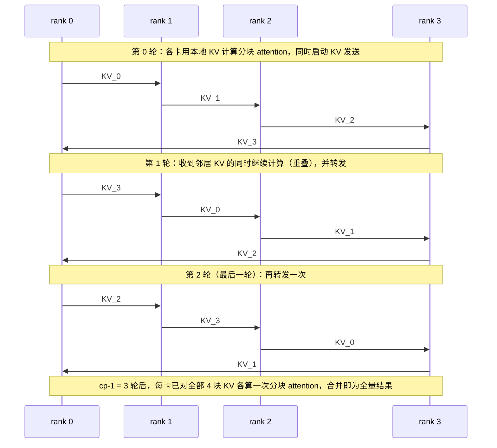
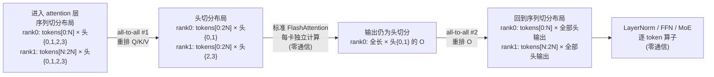
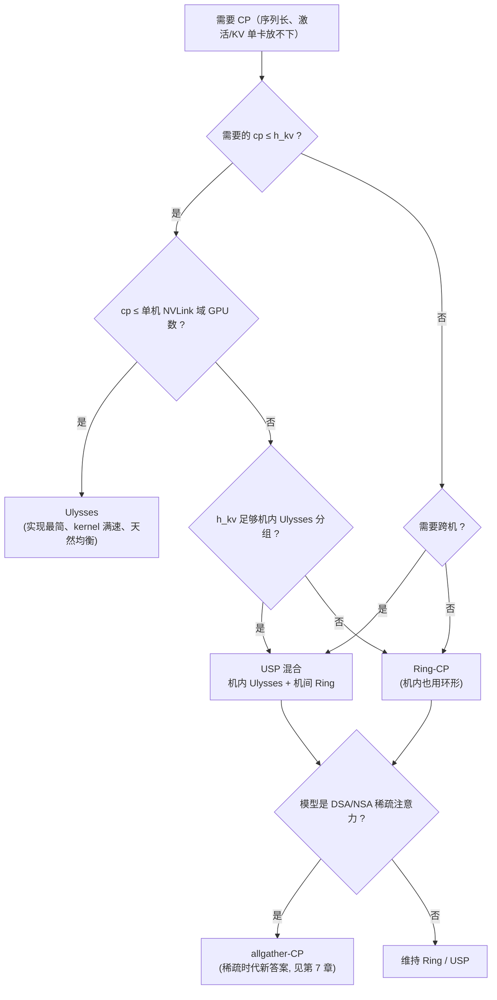
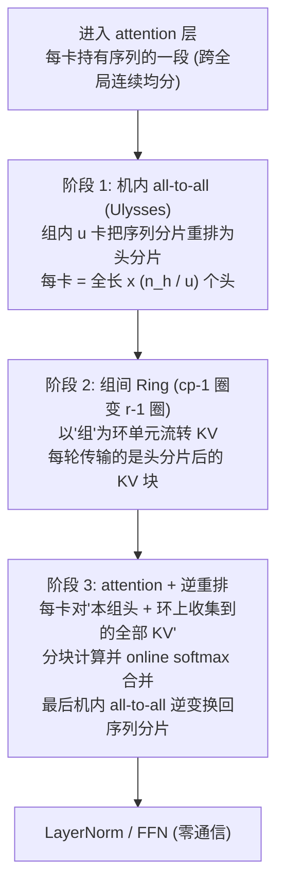
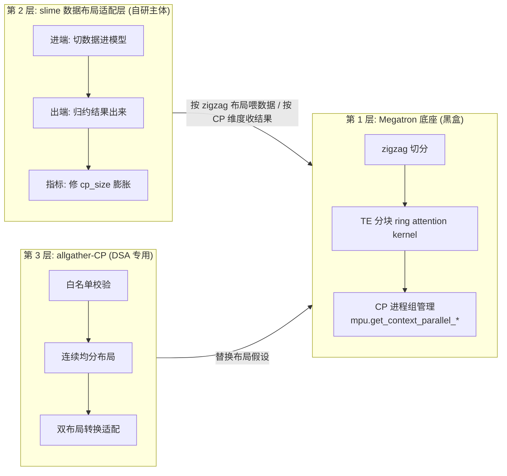
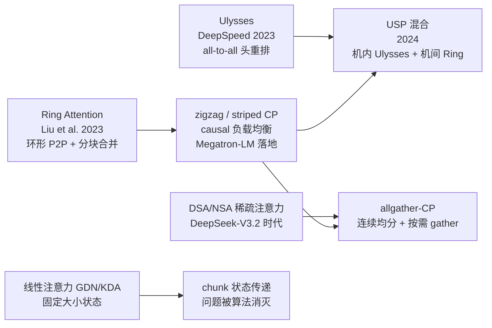

**TECHNICAL REFERENCE · 2026**

# 上下文并行全景：从 Ring-CP 到 Ulysses 再到融合演进

*Ring Attention → zigzag CP → DeepSpeed-Ulysses → USP → allgather-CP*

**面向教学的完整推导 · 通信分析 · 负载均衡证明 · 工程落地**

**适用读者**

希望深入理解长上下文训练/推理并行策略的研究人员与分布式训练工程师

版本基线：2026 年 9 月

姊妹篇：[从 MHA 到 MQA、GQA 再到 MLA](./mha-to-mqa-gqa-to-mla.md)（压缩 KV Cache 的表示）、[从 Full Attention 到 Linear Attention 到 GDN 再到 KDA](./linear-attention-to-gdn-to-kda.md)（消灭 KV Cache 的另一条路线）——那两篇讲的是"如何让 KV 变小"，本文讲的是"KV 不变时，如何让一条超长序列被多卡一起算"。

---

## 执行摘要

> **一句话结论**　Context Parallelism（CP，上下文并行）把**一条序列沿长度方向切开**分给多卡，与 DP（切样本）、TP（切权重）、PP（切层）正交，专治"单条样本太长、单卡装不下算不动"。两条原生路线对"attention 跨卡"给出相反答案：**Ring-CP 让数据流动**——序列布局不动，KV 沿环形 P2P 流转、逐块与计算重叠（Megatron 路线，配 zigzag 切分治 causal 负载不均）；**Ulysses 让布局流动**——数据不动，all-to-all 把"序列切分"重排成"头切分"、复用标准 FlashAttention（DeepSpeed 路线，代价是 cp 不得超过 KV 头数）。GQA 时代的头数约束把大规模场景推向 Ring，跨机 NVLink 失配又催生**USP 混合**（机内 Ulysses + 机间 Ring），稀疏注意力时代则诞生**allgather-CP**（DSA 模型放弃环形流转、回归连续均分）。

| 方案 | attention 跨卡方式 | 序列布局 | kernel 要求 | 规模上限 | 通信拓扑偏好 |
| --- | --- | --- | --- | --- | --- |
| Ring-CP (zigzag) | KV 环形 P2P，$cp-1$ 轮 | 首尾两段（不连续） | 定制分块 kernel | 无上限 | 跨机友好 |
| Ulysses | 每层 2 次 all-to-all | 连续一段 × 部分头 | 标准 FlashAttention | $cp \leq h_{kv}$ | NVLink 机内 |
| USP | 机内 all-to-all + 机间环 | 两级嵌套 | 两者结合 | 突破双方上限 | 层次化集群 |
| allgather-CP | attention 前 allgather KV | 连续一段 | 稀疏注意力 kernel | 无上限 | 稀疏模型专属 |

### 阅读导航

| 章节 | 主题 | 教学重点 |
| --- | --- | --- |
| 01 | 引言：第四种并行 | 为什么 DP/TP/PP 都救不了长序列？SP 命名陷阱 |
| 02 | 切序列的三大难题 | 通信代数：什么数据流动、什么粒度、流几次 |
| 03 | Ring-CP | online softmax 分块合并完整推导；zigzag 均衡性完整证明；通信可隐藏的定量条件 |
| 04 | Ulysses | 头数约束的数学本质；与 TP 通信的同构性 |
| 05 | 正面对决 | 从三个自变量推出选型决策树 |
| 06 | USP | 通信介质异构下的分层匹配 |
| 07 | allgather-CP | 稀疏注意力如何翻转通信权衡 |
| 08 | slime 的 CP 实现 | 三层拼装：Megatron 底座 + RL 数据布局适配 + DSA 专用形态 |
| 09 | CP 的全局位置 | 与 TP/PP/DP/EP 的正交组合；cp_size 归约陷阱 |
| 10 | 总结 | 演进谱系、速查表、面试金句 |

---

## 1. 引言：长序列时代呼唤第四种并行

### 1.1 长上下文的显存与计算爆炸

标准 softmax 注意力的开销随序列长度 $L$ 急剧膨胀：

- **计算**：score 矩阵 $QK^\top \in \mathbb{R}^{L \times L}$，单层单头 FLOPs 为 $\Theta(L^2 d_h)$，$L$ 翻 4 倍计算量翻 16 倍；
- **激活显存**：训练时不量化注意力矩阵（FlashAttention 常态），但每层要保存的 $Q/K/V/O$ 激活均为 $\Theta(L \cdot d)$，反向传播还需要更多中间量；
- **KV Cache**：推理与 RL rollout 侧 $\Theta(L)$ 线性增长（详见姊妹篇 MLA 文的测算：DeepSeek-V2 规模下 128K 上下文单序列约 9 GB，MHA 假想形态约 515 GB）。

128K 训练、1M 推理、Agent 长轨迹 RL——这些场景的共同点是：**batch 里一条样本本身太长**。哪怕 batch_size = 1，一条 512K 的样本在单卡上也放不下激活、算不完 attention。

### 1.2 传统三种并行的盲区

| 并行 | 切分维度 | 卡上持有 | 为什么救不了长序列 |
| --- | --- | --- | --- |
| DP | batch（样本） | 完整一条样本 + 完整模型 | 一条样本还是得完整放进一张卡，样本太长时无解 |
| TP | 权重（head/FFN 行列） | 全部 token + 部分权重 | 能摊薄激活，但每层 2 次 all-reduce，通信量 $\propto B \times L \times d$，长序列下通信爆炸；且被锁死在单机 NVLink 域内 |
| PP | 深度（层） | 全部 token + 部分层 | 每张卡仍要过完整长度的序列，激活显存问题原样存在 |

于是有了第四种并行。**Context Parallelism（CP，上下文并行/序列并行）**：把一条序列沿长度方向切成若干段，分到多张卡上——512K 序列、CP=4，每卡只持有 128K token 的激活与 KV。

> **程序员类比**　DP 是"多台服务器各处理各自的用户请求"；CP 是"一台服务器处理一个超大文件时，把文件分块流式分给多台机器各算一段，最后汇总"。前者扩展吞吐，后者扩展**单任务的规模上限**。

### 1.3 四大并行对照表

| 并行 | 切什么 | 卡上有什么 | 通信模式 | 通信拓扑 |
| --- | --- | --- | --- | --- |
| DP | 样本 | 完整一条样本 + 完整模型 | 梯度 all-reduce | 任意 |
| TP | 权重 | 全部 token + 部分 head/FFN | 每层 2 次 all-reduce | 单机 NVLink |
| PP | 层 | 全部 token + 部分层 | 点对点传激活 | 跨机可行 |
| **CP** | **序列长度** | **一段 token + 完整权重** | **环形 P2P 传 KV / all-to-all** | **跨机友好（Ring）/ 机内（Ulysses）** |

四者**正交**，可同时开启（如 TP4 × PP2 × CP2 × DP8）。CP 与 DP 有一个微妙的组合关系：同一条序列的各 CP 副本共享同一份数据，因此**有效数据并行规模 = 名义 DP 规模 × CP 规模里的"真样本数"不随 CP 增加**——这会在第 9 章展开成著名的 cp_size 归约陷阱。

### 1.4 命名陷阱预警

"Sequence Parallelism"这个词在两个生态里指代**完全不同的东西**，读文档时必须先问一句"attention 段是序列切的还是头切的"：

| 术语 | 生态 | 实际含义 |
| --- | --- | --- |
| Megatron `--sequence-parallel` (SP) | Megatron-LM | **TP 的伴生显存优化**：仅在 LayerNorm/dropout/loss 区域沿序列切激活，与 TP 同进程组，目的是省激活显存。**不是**长序列扩展手段 |
| DeepSpeed Sequence Parallelism | DeepSpeed | **就是 Ulysses**，即本文讨论的长序列切分方案 |
| Megatron `--context-parallel-size` (CP) | Megatron-LM | 本文主角：包括 attention 在内的整条序列切分 |

判断口诀：**SP 切的是"非 attention 段的激活"（显存优化），CP/Ulysses 切的是"包括 attention 在内的整条序列"（规模扩展）**。一份 Megatron 配置里同时出现 `--sequence-parallel` 和 `--context-parallel-size 4` 是常态，两者各管各的。

---

## 2. 切序列的三大核心难题

CP 的所有设计都围绕三个难题展开。先把难题立起来，后面每条路线就是"对这三题的不同答卷"。

### 2.1 难题一：attention 是唯一的跨 token 算子

把序列切开后逐层过 Transformer，先给每个算子分类：

| 算子 | token 间依赖 | 切序列后 |
| --- | --- | --- |
| RMSNorm | 逐 token 独立（沿 hidden 维归一） | **零通信** |
| FFN / SwiGLU | 逐 token 独立 | **零通信** |
| MoE 路由与专家计算 | 逐 token 路由（组内通信属于 EP 范畴） | **零 CP 通信** |
| Softmax Attention | 每个 query 看**所有**位置的 K/V | **唯一的跨卡数据依赖** |

$$
\text{Attention}(Q, K, V) = \mathrm{softmax}\!\left(\frac{QK^\top}{\sqrt{d_h}}\right)V \quad (1)
$$

query 在本卡，key/value 散落各卡——**CP 的全部通信设计，本质上都是在回答"式 (1) 怎么跨卡算"**。逐 token 算子的零通信性质是 CP 成立的前提：它保证了切序列的代价被压缩到 attention 一处。

### 2.2 难题二：causal mask 的天然负载不均

causal 语言模型里，位置 $i$ 的 query 只与 $j \leq i$ 的 key 交互，因此**位置越靠后的 token，attention 计算量越大**：

$$
C(i) \propto i \cdot d_h \cdot n_h \quad (2)
$$

如果把序列朴素地均分（rank 0 拿前 $1/cp$，rank $cp-1$ 拿最后 $1/cp$），各卡计算量差距悬殊，而分布式执行的耗时由**最慢的卡**决定（木桶效应）。第 3.4 节会给出定量证明：朴素均分下最慢卡与最快卡的计算量比接近 $2cp$。

### 2.3 难题三：位置编码与 mask 必须用全局坐标

切开的各段独立计算没问题，但 RoPE 等相对位置编码的旋转矩阵必须按**全局绝对位置**计算——rank 1 拿到序列的后半段，它段内第一个 token 的位置不是 0，而是全局的 $L/2$；否则 $R_t^\top R_j = R_{t-j}$ 的相对位置关系全错，模型输出直接乱掉。同理，causal mask 是全局意义上的"我之前的所有 token"。**布局越扭曲（比如 zigzag 的首尾两段），全局坐标的换算越复杂**——这直接影响了第 8 章将看到的工程代码量。

### 2.4 通信代数：一个统一分析框架

两条路线的所有优劣对比，都可以从一个问题推出来——**"什么数据跨卡边界流动、以什么粒度流、流几次"**：

| 答卷 | 流动的数据 | 粒度 | 次数 | 消息模式 |
| --- | --- | --- | --- | --- |
| Ring-CP | K、V（Q 不动） | 细粒度小块 | $cp-1$ 轮 | 异步流水 P2P，可与计算重叠 |
| Ulysses | Q、K、V、O 全部 | 大块（每卡 $1/cp$ 份额） | 每层 2 次 | 同步集合通信（all-to-all） |
| allgather-CP | K、V（或被选中的稀疏子集） | 大块 | attention 前一次 | 同步集合通信 |

由此派生出全部下游差异：

- **消息模式**决定通信介质适配性：异步细粒度 P2P 能容忍高延迟跨机网络；同步粗粒度集合通信要求低延迟高带宽的 NVLink；
- **流动的数据量**决定通信总量：三条路线渐近都是 $\Theta(L \cdot d)$ 量级（每卡），**差异不在总量而在形态**——这是很多人容易搞混的一点；
- **次数与重叠窗口**决定通信能否被计算藏住：流水分轮次就有每轮的重叠窗口，一次性大同步就只能靠带宽硬扛。

---

## 3. 路线一：Ring-CP——让数据流动

> **一句话定位**　序列布局保持"每卡一段（zigzag 后为两段）"，K/V 沿卡环逐块流转，每收到一块就与本地 Q 做一次分块 attention，通信与计算流水重叠。Ring Attention（Liu et al., 2023）提出原型，striped/zigzag 变体修复 causal 负载不均，Megatron-LM 的 Context Parallelism 完成工程落地（kernel 由 TransformerEngine 实现）。

### 3.1 核心思想

设 cp 张卡组成一个环，序列已按某种布局分好，每卡持有本地 Q 块与 KV 块。attention 需要"每个 Q 看到所有 KV"，但 softmax 的结构允许**分块累积**（3.2 节证明）：不必一次性拿到全部 KV，可以一块一块地看，每看一块就把结果"合并"进运行中的累积量。

于是流程变成：

1. 每卡先用**本地 KV 块**计算部分 attention；
2. 同时把自己的 KV 块发给环上的下一卡（P2P，异步）；
3. 收到邻居的 KV 块后，用本地 Q 对它再算一次分块 attention，并合并进累积量；同时把刚收到的块继续转发给下一卡；
4. 转 $cp-1$ 圈后，每卡都"见过"所有 KV 块，累积量合并出的结果等于全量 attention。

### 3.2 数学根基：online softmax 分块合并的完整推导

这是 Ring-CP（也是 FlashAttention）成立的核心定理：**分块计算的 softmax attention 可以精确合并，不损失任何数值精度**。

**设定**。固定一个 query 向量 $\mathbf{q}$（省略缩放因子 $\sqrt{d_h}$），其与全部 key 的分数为 $s_j = \mathbf{q}^\top \mathbf{k}_j$。目标输出：

$$
\mathbf{o} = \sum_{j=1}^{L} \frac{e^{s_j}}{\sum_{j'=1}^{L} e^{s_{j'}}} \, \mathbf{v}_j \quad (3)
$$

**分块表示**。把位置集合 $\{1, \ldots, L\}$ 任意划分为两块 $J_1 \cup J_2 = \{1, \ldots, L\}$。对每块定义三元组（$i \in \{1,2\}$）：

$$
m_i = \max_{j \in J_i} s_j, \qquad \ell_i = \sum_{j \in J_i} e^{s_j - m_i}, \qquad \mathbf{t}_i = \sum_{j \in J_i} e^{s_j - m_i} \, \mathbf{v}_j \quad (4)
$$

$m_i$ 是块内分数最大值（数值稳定项），$\ell_i$ 是指数和，$\mathbf{t}_i$ 是加权值和。注意三者都只依赖块内数据，**可以独立计算**。

**合并公式**。定义全局最大值 $m = \max(m_1, m_2)$，则：

$$
\ell = e^{m_1 - m} \, \ell_1 + e^{m_2 - m} \, \ell_2 \quad (5)
$$

$$
\mathbf{t} = e^{m_1 - m} \, \mathbf{t}_1 + e^{m_2 - m} \, \mathbf{t}_2 \quad (6)
$$

**证明式 (5)**。展开右端：

$$
e^{m_1 - m} \ell_1 + e^{m_2 - m} \ell_2
= e^{m_1 - m} \sum_{j \in J_1} e^{s_j - m_1} + e^{m_2 - m} \sum_{j \in J_2} e^{s_j - m_2}
= \sum_{j \in J_1} e^{s_j - m} + \sum_{j \in J_2} e^{s_j - m}
= \sum_{j=1}^{L} e^{s_j - m} \quad \blacksquare
$$

式 (6) 同理：$\mathbf{t} = \sum_{j=1}^{L} e^{s_j - m} \mathbf{v}_j$。

**还原输出**。最终输出：

$$
\mathbf{o} = \frac{\mathbf{t}}{\ell}
= \frac{\sum_{j=1}^{L} e^{s_j - m} \, \mathbf{v}_j}{\sum_{j=1}^{L} e^{s_j - m}}
= \frac{e^m \sum_j e^{s_j - m} \mathbf{v}_j}{e^m \sum_j e^{s_j - m}}
= \sum_{j=1}^{L} \frac{e^{s_j}}{\sum_{j'} e^{s_{j'}}} \mathbf{v}_j \quad (7)
$$

分子分母同乘 $e^m$，与式 (3) 完全一致。**证毕**。

**三个关键性质**：

1. **数值稳定**：所有指数的参数 $s_j - m \leq 0$，$e^{s_j - m} \leq 1$，永不溢出；$m$ 取的正是全局最大值；
2. **可结合、可归纳**：合并公式对分块方式不敏感，按任意顺序两两合并结果相同。对 cp 个 KV 块，Ring Attention 每收到一块做一次合并，$cp$ 次合并后得到全量结果——**数学上与"一次拿到全部 KV"逐位等价**；
3. **可微分**：$e^{m_i - m}$、$\max$、求和全部可微（$\max$ 的次梯度定义良好），因此**训练可用**，反向传播穿过合并操作回到各卡的局部分块计算。

> **程序员类比**　这就是一个"流式归约"：像 MapReduce 里的 combiner——每台机器先本地聚合（算 $m_i, \ell_i, \mathbf{t}_i$），再两两 merge（式 (5)(6)），最后全局 reduce（式 (7)）。softmax 的特殊结构保证了 merge 操作封闭在同一个小三元组上，不需要携带全部中间分数。

### 3.3 完整流程与通信分析

以 $cp = 4$ 为例，一次 attention 层的时序：



注意每轮的"发送"与"计算"同时进行——**通信被计算时间藏住**，这是 Ring-CP 通信效率的灵魂。

**单卡通信量推导**。设每卡负责 $b$ 条序列（通常为 1）、head 总维度 $d = n_h d_h$、P2P 环的有效带宽为 $B_{\text{p2p}}$。每轮每卡发送 K 与 V 各一块，块大小 $\frac{L}{cp} \cdot d \cdot b$ 个元素：

$$
V_{\text{round}} = 2 \cdot \frac{L}{cp} \cdot d \cdot b, \qquad
V_{\text{total}} = (cp - 1) \cdot V_{\text{round}} = \frac{2 L d b (cp-1)}{cp} \approx 2 L d b \quad (8)
$$

渐近地，每卡把"整条序列的 KV"发送了出去——**与 cp 无关**。这揭示了一个重要事实：增大 cp 不增加每卡通信负担（只增加轮数、摊薄每轮的块大小）。

**通信可被完全隐藏的定量条件**。单轮的计算量（causal 平均取一半，Q 块 × KV 块的 score 与加权各 2 次 FLOPs）：

$$
F_{\text{round}} \approx \frac{1}{2} \cdot 4 \cdot \frac{L}{cp} \cdot \frac{L}{cp} \cdot d
= \frac{2 L^2 d}{cp^2} \quad (9)
$$

单轮计算时间 $T_{\text{comp}} = F_{\text{round}} / \mathcal{F}$（$\mathcal{F}$ 为 GPU 有效 FLOPS），单轮通信时间 $T_{\text{comm}} = V_{\text{round}} / B_{\text{p2p}}$。通信完全隐藏的条件是 $T_{\text{comm}} \leq T_{\text{comp}}$：

$$
\frac{2 L d b}{cp \, B_{\text{p2p}}} \leq \frac{2 L^2 d}{cp^2 \, \mathcal{F}}
\;\;\Longrightarrow\;\;
\boxed{\;L \;\geq\; \frac{cp \cdot b \cdot \mathcal{F}}{B_{\text{p2p}}}\;} \quad (10)
$$

这个条件有一个漂亮的解读：$\mathcal{F}/B_{\text{p2p}}$ 正是这台机器的**算术强度平衡点**（ridge point，H100 约 $10^3$ 量级 FLOP/byte）。序列长度 $L$ 就是 CP 的"batch size"——**只有序列长度超过平衡点对应的规模，P2P 通信才能完全沉入计算**。这定量解释了两条经验规律：

- 短序列开 CP 纯亏（$L$ 低于阈值，通信露出来，吞吐反而降）；
- 跨机（$B_{\text{p2p}}$ 从 NVLink 的 ~450 GB/s 掉到 IB 的 ~50 GB/s）时阈值抬升一个数量级，但条件仍可满足——**Ring-CP 跨机可行，只是需要更长的序列**。

### 3.4 zigzag 切分：负载均衡的完整证明

**朴素均分的不均程度**。序列均分为 $cp$ 段，rank $r$ 拿到位置区间 $[r \cdot \tfrac{L}{cp},\ (r+1) \cdot \tfrac{L}{cp})$。由式 (2)，rank $r$ 的计算量（累加段内每个位置的计算量）：

$$
C_r^{\text{naive}} \propto \sum_{i = rL/cp}^{(r+1)L/cp - 1} i
= \frac{1}{2}\left[\left(\frac{(r+1)L}{cp}\right)^2 - \left(\frac{rL}{cp}\right)^2\right] - \frac{L}{cp}
= \frac{L^2}{2cp^2}(2r+1) - \frac{L}{cp} \quad (11)
$$

忽略低阶项后 $C_r \propto \frac{L^2}{2cp^2}(2r+1)$，于是：

$$
\frac{C_{cp-1}^{\text{naive}}}{C_0^{\text{naive}}} = \frac{2(cp-1)+1}{1} = 2cp - 1 \approx 2cp \quad (12)
$$

**最后一张卡的计算量是最前一张卡的约 $2cp$ 倍**（cp=8 时 15 倍），而整圈耗时由最慢卡决定——朴素均分下实际加速比被锁死在 $\frac{C_{\text{total}}}{C_{cp-1}} \approx \frac{cp}{2}$ 附近，一半算力在等。

**zigzag 的均衡性证明**。zigzag 把序列切成 $2cp$ 个等长 chunk（每 chunk 长 $c = L / (2cp)$，长度不足则 padding），rank $r$ 拿**正数第 $r$ 个 chunk 与倒数第 $r+1$ 个 chunk**（首尾配对）：

$$
S_r = \underbrace{[rc,\ (r+1)c)}_{\text{head chunk}} \;\cup\; \underbrace{[(2cp - r - 1)c,\ (2cp - r)c)}_{\text{tail chunk}} \quad (13)
$$

第 $s$ 个 chunk（位置 $[sc, (s+1)c)$）的计算量：

$$
W(s) \propto \sum_{i=sc}^{(s+1)c - 1} i
= c \cdot sc + \frac{c(c-1)}{2}
= c^2 s + \frac{c(c-1)}{2} \quad (14)
$$

rank $r$ 的总计算量（两段之和）：

$$
C_r^{\text{zigzag}} \propto W(r) + W(2cp - 1 - r)
= c^2\big[r + (2cp - 1 - r)\big] + 2 \cdot \frac{c(c-1)}{2}
= \boxed{c^2 (2cp - 1) + c(c-1)} \quad (15)
$$

**结果与 $r$ 无关**——每一张卡的计算量严格相等（padding 对齐后是精确相等，不忽略任何项）。直觉解释：位置 $i$ 的计算量 $\propto i$，而首尾配对 $s + (2cp-1-s) = 2cp-1$ 是常数，"一段便宜的 + 一段贵的"总和恒定。**证毕**。

以 $cp=2$、序列 8 段为例：

```
全局序列:  [0][1][2][3][4][5][6][7]   (chunk 编号)
rank 0:   [0] + [7]   头部段(KV 少) + 尾部段(KV 多)
rank 1:   [1] + [6]   两卡计算量严格相等
```

**代价**：每卡持有两段**不连续**的子序列，全局位置换算、mask 构造、以及训练数据管线的切分/归并（第 8 章的 cp_utils.py）都变复杂了——均衡不是白来的。

### 3.5 全局位置编码与 mask

zigzag 布局下，rank $r$ 的头段第一个 token 全局位置是 $rc$，尾段第一个 token 全局位置是 $(2cp - r - 1)c$。RoPE 旋转矩阵 $R_t$ 必须按这些**全局绝对位置**施加，才能保住 $R_t^\top R_j = R_{t-j}$ 的相对位置语义；causal mask 同样按全局位置判断"我之前的所有 token"。这条约束使得任何"按本地顺序处理"的想当然实现都会静默出错——不是崩溃，而是 token 顺序悄悄乱掉（第 8 章会看到 slime 源码里对此的专门警告）。

### 3.6 工程落地形态

Megatron-LM 的 CP 落地要点：

- **kernel**：TransformerEngine 提供分块 causal attention kernel（ring 专用变体），每接收一块 KV 执行一次"分数计算 + online softmax 合并"（式 (4)-(6)），kernel 内部同时负责发送下一块的 P2P 通信调度；
- **布局**：数据按 zigzag 切分进入模型（Megatron 侧 `get_batch_on_this_cp_rank`），每卡两段拼接为一个连续张量（THD 布局），段边界信息由框架维护；
- **进程组**：CP 独立进程组（`get_context_parallel_group()`），与 TP/PP/DP 组正交，由 `mpu`（Model Parallel Utilities）统一管理。

### 3.7 优势与劣势

**优势**：

1. **规模无上限**：cp 可以开到 8、16、32……不依赖任何模型结构参数；
2. **跨机友好**：细粒度流水 P2P 对高延迟网络容忍度高，通信-计算重叠的条件（式 (10)）在跨机场景仍可满足——这是 Ring 路线在大规模长序列训练中占统治地位的根本原因；
3. **GQA/MLA 无碍**：K/V 按序列切块流动，与头数多少无关。

**劣势**：

1. **kernel 定制**：必须用分块 kernel，标准 FlashAttention 不能直接用（它假设一次性拿到全部 KV）；
2. **布局扭曲**：zigzag 双段 + 全局位置换算，使数据管线的前后处理代码量大、易错（logprob 切分、loss mask 对齐、指标归约……第 8 章全是这类代码）;
3. **同步语义弱**：$cp-1$ 轮流水意味着 attention 层内没有全局同步点，调试与确定性执行较难；
4. **重叠依赖规模**：序列不够长时（式 (10) 不满足），通信露出来，吞吐受损。

---

## 4. 路线二：Ulysses——让布局流动

> **一句话定位**　序列布局不再固定，attention 前后各做一次 all-to-all，把"每卡一段序列 × 全部头"重排成"每卡全长序列 × 部分头"——attention 变成每卡独立的标准多头计算，直接复用 FlashAttention。DeepSpeed-Ulysses（Tarnawski et al., 2023）提出，DeepSpeed 内命名为 Sequence Parallelism。

### 4.1 核心洞察：头是另一条天然切分轴

多头注意力的各个头**完全独立**：

$$
\mathbf{o}_i = \mathrm{softmax}\!\left(\frac{Q_i K_i^\top}{\sqrt{d_h}}\right) V_i, \quad
\mathbf{u} = W^O [\mathbf{o}_1; \mathbf{o}_2; \ldots; \mathbf{o}_{n_h}] \quad (16)
$$

头与头之间唯一的交互是最后的拼接与输出投影。这意味着 attention 段除了"沿序列切"（Ring 的思路），还可以**沿头切**——而"每卡持有部分头 × 全部 token"正是 **TP 的 attention 布局**。Ulysses 的本质：**非 attention 段保持序列切分布局（逐 token 算子零通信），只在 attention 前后用 all-to-all 临时切换成 TP 式头并行布局，attention 本体零通信**。

### 4.2 完整流程

以 $cp = 2$、序列长 $2N$、4 个头为例，一层的前向：



三次视角切换的信息量：all-to-all #1 把 Q、K、V 三份张量从"序列维分片"重排为"头维分片"；attention 在头切分布局下每卡计算 $n_h/cp$ 个头对全长序列的标准自注意力；all-to-all #2 把输出 O 重排回序列分片。**每层恰好两次 all-to-all，attention 本体与所有逐 token 算子零通信**。

### 4.3 为什么能直接用标准 FlashAttention

头切分布局下，每卡面对的问题是"长度 $L$ 的序列、$n_h/cp$ 个头的完整自注意力"——这正是 FlashAttention 的原生输入形态，**没有任何跨卡语义**。对比 Ring-CP 必须改写 kernel 支持"逐块接收 + online softmax 合并"，Ulysses 的 attention 是纯本地计算：

- kernel 零改动、零性能损失，新架构（新 attention 变体）出现时无需等框架适配；
- 数值确定性强（无多轮流水），便于调试与复现。

### 4.4 通信分析与"TP 同构"观察

**单卡通信量**。all-to-all #1 传输 Q/K/V：每卡发出 $\frac{3Ld b (cp-1)}{cp}$ 元素（自己留一份，其余 $cp-1$ 份发出去）；all-to-all #2 传输 O：$\frac{Ld b (cp-1)}{cp}$。合计：

$$
V_{\text{ulysses}} = \frac{4 L d b (cp - 1)}{cp} \approx 4 L d b \quad (17)
$$

对比 Ring 的式 (8)：$2Ldb$。**渐近同阶，Ulysses 常数大 2 倍**（要搬 Q 和 O，Ring 只搬 K/V）。所以两条路线的差异从来不是通信总量，而是：

1. **消息模式**：Ulysses 的 all-to-all 是同步集合通信——$cp^2$ 条点对点流同时发生，完成时间受**最慢一条链路**（incast 拥塞、跨机慢链路）限制，且它是 attention 计算前的硬同步点，**没有重叠机会**；Ring 的 P2P 是异步流水，每轮都有重叠窗口；
2. **介质要求**：all-to-all 的效率前提是"任意两卡之间都有高带宽低延迟直连"——这正是单机 NVLink 全互联的拓扑；跨机时流量要挤有限的机间链路，性能急剧退化。**Ulysses 天然是机内技术**。

**TP 同构观察**。把式 (17) 与 Megatron TP 的通信量对照：TP=cp 时，attention 段前后的列/行并行线性层需要 all-reduce（或配 SP 的 reduce-scatter/all-gather 组合），单卡通信量同样是 $\Theta(Ldb)$ 量级。这不是巧合——**Ulysses 在 attention 段的通信模式与 TP 完全同构**（布局相同，只是"谁切"不同：TP 是权重切分迫使头切分，Ulysses 是通信主动把序列切分归约成头切分）。可以说 Ulysses 把"CP 问题"归约成了"TP 已解决的问题"，这解释了它为什么能用几百行通信代码获得与 TP 同级的成熟性。

### 4.5 硬约束：头数必须被 cp 整除

**数学本质**。all-to-all 重排后，每卡必须持有**至少一个完整的头**且各卡头数相等：

$$
cp \;\Big|\; n_h, \qquad cp \;\Big|\; h_{kv} \quad (18)
$$

对 KV 头的约束来自 K/V 也要参与 all-to-all 重排——按 KV 头分组。现代模型普遍采用 **GQA**（$h_{kv} \ll n_h$，详见姊妹篇 MLA 文），于是 cp 的上限被 $h_{kv}$ 封死：

| 模型 | query 头 $n_h$ | KV 头 $h_{kv}$ | Ulysses cp 上限 |
| --- | --- | --- | --- |
| Llama-3-70B | 64 | 8 | **8** |
| Qwen 系列（典型） | 40~64 | 8 | **8** |
| MHA 模型（假想） | 32 | 32 | 32 |

**矛盾所在**：KV 头少是为了省 KV Cache（推理友好），但长上下文训练恰恰最需要大 cp——两个目标在结构参数上直接顶牛。这是 Ulysses 在 GQA 时代的根本性劣势，也是大规模长序列训练回归 Ring 路线的技术原因。

### 4.6 负载均衡：天然解决

头切分布局下每卡计算 $n_h/cp$ 个头的**全长**自注意力。causal mask 下不同头的计算量完全相同（mask 依赖位置而非头），因此各卡计算量严格相等——**zigzag 存在的全部理由（第 3.4 节）在 Ulysses 里自动消失**。均衡、连续、无全局坐标换算（RoPE 对每个头本来就是全长的），布局复杂度是三条路线里最低的。

### 4.7 优势与劣势

**优势**：

1. **实现极简**：不动 attention kernel，只在前后插两次 all-to-all，数百行代码支持任意模型；
2. **kernel 满速**：标准 FlashAttention 直接跑，新 attention 变体零适配成本；
3. **天然均衡 + 布局连续**：无 zigzag 的双段扭曲，数据管线前后处理简单。

**劣势**：

1. **头数封顶**：$cp \leq h_{kv}$，GQA 模型通常只有 4~8 路，长上下文规模化的大 cp 不可达；
2. **机内限定**：同步 all-to-all 要求全互联高带宽，跨机性能塌陷；
3. **同步点**：每层两个硬同步屏障，无重叠窗口，集群稍大即被最慢链路拖累。

---

## 5. 正面对决：两条路线的系统对比与选型推导

### 5.1 五维对比

| 维度 | Ring-CP (zigzag) | Ulysses |
| --- | --- | --- |
| 通信模式 | 环形 P2P，$cp-1$ 轮流水 | 每层 2 次 all-to-all |
| 单卡通信量 | $\approx 2Ldb$（式 8） | $\approx 4Ldb$（式 17） |
| 重叠能力 | 每轮可重叠（条件：式 10） | 无（硬同步点） |
| attention kernel | 定制分块 kernel | 标准 FlashAttention |
| 负载均衡 | 依赖 zigzag（式 15 严格均衡） | 天然均衡（式 4.6） |
| 规模上限 | 无结构约束 | $cp \leq h_{kv}$ 且整除 |
| 介质适配 | 跨机可行（阈值抬升） | NVLink 机内 |
| 布局复杂度 | 双段不连续 + 全局坐标 | 连续 + 本地坐标 |
| 代表实现 | Megatron-LM CP / TransformerEngine | DeepSpeed-Ulysses |

**核心洞察重述**：两条路线的通信总量同阶（$2Ldb$ vs $4Ldb$），真正分野的是**消息模式对通信介质的适配性**与**结构参数（头数）对规模的约束**。所有选型结论都从这两条推出来。

### 5.2 选型决策推导

选型的三个自变量：**(a) 通信介质拓扑**（NVLink 域大小 vs 集群跨机规模）、**(b) 模型结构**（$h_{kv}$ 头数、稠密/稀疏注意力）、**(c) 需要的 cp 规模**（由序列长度与显存压力决定）。



逐分支的推导依据：

1. **cp ≤ $h_{kv}$ 且 cp ≤ 机内 GPU 数 → Ulysses**：两条约束都不触发，all-to-all 在 NVLink 上满速，实现与 kernel 成本最低，是最优解；
2. **cp > $h_{kv}$ → 排除纯 Ulysses**（式 18 无法满足），进入 Ring 系；
3. **需要跨机 → Ring 系**：式 (10) 的条件在跨机带宽下仍可满足（要求更长序列），而 all-to-all 的 incast 在跨机拓扑下不可控；
4. **大规模（跨机 + cp 大）→ USP**：机内先用 Ulysses 消化掉一部分并行度（要求机内组 ≤ $h_{kv}$），剩余并行度交给机间 Ring——见第 6 章；
5. **稀疏注意力模型 → allgather-CP**：第 7 章证明，稀疏性使 Ring 的重叠窗口消失，权衡翻转。

### 5.3 一个常见的误解澄清

"Ulysses 通信量是 Ring 的很多倍"——**不对**，两者渐近同阶（$4Ldb$ vs $2Ldb$）。真正的差距是：Ring 把同样多的字节切成 $cp-1$ 份细流、逐份藏进计算；Ulysses 集中成每层两次大爆发、用 NVLink 的暴力带宽硬扛。介质匹配了，两种策略都高效；介质错配了（Ulysses 上跨机、Ring 上超短序列），两种策略都灾难。


---

## 6. 融合演进一：USP——通信介质异构下的分层匹配

> **一句话定位**　USP（Unified Sequence Parallelism，Fang & Zhao, 2024）把 Ulysses 与 Ring Attention 嵌套组合：**机内一组卡跑 Ulysses，组间跑 Ring**，同时突破 Ulysses 的头数上限与 Ring 的机内效率上限。

### 6.1 动机：两条路线各自的天花板

第 5 章的决策树暴露了一个空档：**cp > $h_{kv}$ 且需要跨机**时，纯 Ring 是唯一选择，但纯 Ring 在机内其实是"浪费"的——机内 NVLink 明明能高效支撑 all-to-all，Ring 却只把它当普通链路用；反之纯 Ulysses 想跨机时，all-to-all 又会撞上机间带宽墙。真实的集群恰好是**两级异构介质**：机内 NVLink 全互联（~450 GB/s、~微秒延迟）+ 机间 IB/以太网（~25-50 GB/s、~十微秒延迟）。USP 的洞察：**把两种 CP 策略分别匹配到与自己消息模式吻合的介质层**。

### 6.2 两级嵌套的流程

设总 cp 规模为 $P = u \times r$：机内每组 $u$ 卡（Ulysses 组），组间 $r$ 个组连成环（Ring 层）。约束 $u \leq h_{kv}$（头数整除只需对机内组成立），$r$ 任意。例如 Llama-3-70B（$h_{kv}=8$）要开 cp=32：$u=8$（机内 8 卡 Ulysses）× $r=4$（机间 4 节点环）。

一层 attention 的完整流程（三阶段）：



细看通信代数：Ulysses 层消化了"头维可并行度"（$u$ 路），Ring 层承担"序列维剩余并行度"（$r$ 路）。Ring 的环形 P2P 走机间网络（容忍高延迟、可与计算重叠），all-to-all 走机内 NVLink（同步快、带宽暴力）——**每层通信策略与所在介质层的特性一一匹配**。

### 6.3 收益与代价

**收益**：cp 上限从 $\min(h_{kv}, \text{GPUs per node})$ 提升到 $u \times r$（结构上只需 $u \leq h_{kv}$，规模上 $r$ 无限）；对典型 GQA 模型，这把长上下文 cp 的可达范围从 8 路一举扩展到数十路。

**代价**：两级嵌套使布局与偏移计算比任何单一路线都复杂；all-to-all 与 Ring 的衔接处（头分片的 KV 块再沿环流转）需要仔细的形状约定。这类系统级复杂度是它主要在推理引擎与大规模训练框架内部落地、而较少作为用户直接配置项出现的原因。

---

## 7. 融合演进二：allgather-CP——稀疏注意力时代的新答案

> **一句话定位**　当模型采用 DSA/NSA 稀疏注意力（每 token 只 attend 少量被选中的 KV）时，KV 的全量环形流转失去意义——通信权衡整体翻转。新答案：序列回归**朴素连续均分**，attention 前一次性 **allgather** 需要的 KV，布局与实现双双回归简单。以 DeepSeek-V3.2 的 DSA 为代表；本仓库 slime 以 `--allgather-cp` 落地（DSA 模型白名单制，见第 8 章）。

### 7.1 前提变化：稀疏注意力改写了通信代数

Ring-CP 的全部设计围绕一个隐含前提：**每个 query 需要 $O(L)$ 的 KV**——所以值得花 $cp-1$ 轮把全量 KV 流转一遍，用计算把通信藏住。DSA/NSA 类稀疏注意力破坏了这个前提：indexer 先为每个 query 从历史中选出 top-$k$（$k \ll L$）个 key，attention 只在选中的子集上计算。

**通信量的翻转推导**。稀疏下每个 query 的 top-$k$ 个选中 KV 大致均匀散布在全部 $L$ 个位置上，落到某个特定 KV 块（长 $L/cp$）的期望个数是 $k/cp$。于是每卡每轮的 attention 计算量从式 (9) 的 $\frac{2L^2 d}{cp^2}$ 骤降为：

$$
F_{\text{round}}^{\text{sparse}} \approx 4 \cdot \frac{L}{cp} \cdot \frac{k}{cp} \cdot d
= \Theta\!\left(\frac{L^2 d}{cp^2} \cdot \frac{k}{L}\right) \quad (19)
$$

计算量被选中率 $k/L$ 缩小了。代回通信隐藏条件（式 10 的同类推导），阈值抬升为 $L \geq \Theta\big(\frac{cp \cdot b \cdot \mathcal{F}}{B_{\text{p2p}}} \cdot \frac{L}{k}\big)$——**k 越小（稀疏越狠），满足条件的序列越长，重叠窗口越难成立**。当 $k/L$ 足够小时，Ring 每轮的计算时间 $O(k \cdot L / cp)$ 已经短到盖不住哪怕一次 KV 块传输，流水重叠失效，Ring 的核心优势不复存在。

与此同时，稀疏性送来两份新礼物：

1. **通信对象缩水**：attention 真正需要的 KV 只有被 indexer 选中的部分（$O(k)$ 而非 $O(L)$），一次性 allgather 的代价从"全量 KV"降为"稀疏子集"，量级可控；
2. **布局连续的价值凸显**：zigzag 的首尾双段布局对稀疏 kernel 是灾难——top-k 索引要在全局坐标与本地双段偏移之间反复换算，gather 模式被切碎。连续均分（每卡拿 $[chunk\_start, chunk\_end)$ 一段）让索引换算变成一次线性平移。

### 7.2 流程与形态

allgather-CP 的一层 attention：

1. 序列按**连续均分**切给各卡（每卡一段 `[chunk_start, chunk_end)`，无 zigzag 配对）；
2. indexer 对本地 query 段打分、选出每个 query 的 top-k 全局索引；
3. 按索引 **allgather**（或 grouped gather）被选中的 KV 到本卡；
4. 稀疏 attention kernel 在本地计算；
5. 正常回写，逐 token 层零通信。

没有环形流转、没有多轮流水、没有 online softmax 合并——**注意力不再需要"分块累积"的数学结构，因为 KV 是按需一次性到齐的**。

### 7.3 权衡分析

| 维度 | allgather-CP vs Ring-CP |
| --- | --- |
| 布局 | 连续一段 vs 首尾两段——前者的数据管线/索引换算简单一个量级 |
| 通信 | 一次同步集合通信（稀疏子集，$O(k)$） vs $cp-1$ 轮 P2P（全量，$O(L)$）——稀疏度越高前者优势越大 |
| 重叠 | 无重叠，但稀疏子集的传输量小到不需要重叠 |
| 均衡 | 依赖 indexer 的 top-k 分布大致均匀（DSA 的训练目标会促使这一点）；连续均分下的轻微不均可接受 |
| 适用 | **仅稀疏注意力模型**；稠密模型上 allgather 全量 KV 的显存峰值与通信量都不可接受 |

**为什么稠密模型不能开**：allgather 全量 KV 意味着每卡瞬时持有整条序列的 KV（显存峰值回到单卡极限），且通信量 $O(Ldb)$ 无重叠遮蔽——两个缺陷在稠密场景都是致命的。这就是第 8 章会看到的：slime 对 `--allgather-cp` 做了 DSA 架构白名单硬校验，稠密模型误开会在参数解析阶段直接报错，因为**它不会崩溃，而是会静默打乱 token 顺序**（silently scramble token order）——布局假设（连续 vs zigzag）不匹配时错误是静默的。

### 7.4 延伸：线性注意力为什么天然绕开整个问题

GDN/KDA 类线性注意力（详见姊妹篇）用固定大小状态 $\mathbf{S}_t \in \mathbb{R}^{d \times d}$ 替代 KV Cache：每个 token 的计算只依赖上一状态与本 token——**序列维天然就是"链式"的**。其并行化方案是 chunk 式切分：把序列切成 chunk，chunk 内并行、chunk 间传递状态（一个 $\mathcal{O}(d^2)$ 的小矩阵），跨卡只需在 chunk 边界传状态而非任何 KV。$O(L^2)$ 的 attention 交换根本不存在，Ring/Ulysses 讨论的"attention 跨卡"难题对它自动消失——这为"长上下文并行"提供了第三种终极答案：**改算法，让问题不存在**。

---

## 8. slime 的 CP 实现：三层拼装的真实工程

> **一句话定位**　slime 的 CP = **Megatron 原生 CP 底座（黑盒）+ slime 自研的"RL 数据布局适配层"（cp_utils.py，代码主体）+ DSA 专用的 allgather-CP 第三形态**。attention 内部通信完全交给 Megatron/TE；slime 真正解决的是"RL 训练数据怎么按 CP 布局切进去、结果怎么按 CP 维度正确归约出来"——这也是几乎所有自研框架接 Megatron CP 时的主要工作量所在。

### 8.1 三层结构总览



**代码定位总览**：

| 职责 | 函数 | 位置 |
| --- | --- | --- |
| zigzag 偏移计算（含 -1 错位） | `get_logits_and_tokens_offset_with_cp` | [cp_utils.py](../../slime/slime/backends/megatron_utils/cp_utils.py) L9-44 |
| 序列按 zigzag 切分（含 padding） | `slice_with_cp` | 同上 L287-317 |
| logprob 按 zigzag 切分 | `slice_log_prob_with_cp` | 同上 L320-344 |
| 分段结果可微归约回全长 | `all_gather_with_cp` | 同上 L235-284 |
| CP 下样本均值 loss 的正确分母 | `get_sum_of_sample_mean` | 同上 L47-124 |
| 指标聚合的 cp_factor 修正 | `reduce_train_step_metrics` | 同上 L127-168 |
| MoE 路由 replay 元数据对齐 | `prepare_routed_experts_for_routing_replay` | 同上 L362-405 |
| allgather-CP 白名单校验 | `_validate_allgather_cp_supported` | [arguments.py](../../slime/slime/backends/megatron_utils/arguments.py) L28-40 |
| 双布局转换（allgather → zigzag） | `_allgather_cp_redistribute` | [loss.py](../../slime/slime/backends/megatron_utils/loss.py) L151 起 |
| teacher server 的 CP 合并 | `_merge_allgather_cp_tensors` | [logprob_utils.py](../../slime/slime/backends/megatron_utils/server/logprob_utils.py) L302-348 |

### 8.2 进端：RL 数据怎么按 zigzag 切进模型

RL 训练与普通预训练的数据差异在于：样本 = prompt + response，loss 只作用于 response 段。CP 切分必须把这件事考虑进去。

**`slice_with_cp`（token 序列切分）**：输入完整 token 序列与 padding 值，输出当前 cp_rank 应持有的两段拼接张量。关键细节是 **padding 对齐**（L308-311）：序列长度不是 $2 \times cp\_size$ 整数倍时先补到 $\lceil \frac{L}{2cp} \rceil \cdot 2cp$ 再切，保证各 rank 的 chunk 严格等长（不等长的 chunk 会让 ring 通信的形状约定崩溃）。

**`get_logits_and_tokens_offset_with_cp`（核心偏移计算）**：输入样本的 `total_length`（prompt+response）与 `response_length`，输出当前 rank 的 chunk 位置、logits 偏移、token 偏移三元组。两个容易踩的坑都在这里处理：

1. **zigzag 镜像段**：chunk_0 = 正数第 $r$ 段，chunk_1 = 倒数第 $r+1$ 段（式 13 的实现），两个 chunk 各自独立计算偏移；
2. **logits 的 -1 错位**：预测第 $i+1$ 个 token 用第 $i$ 个位置的 logit，所以 logits 的有效区间是 $[\text{prompt\_length} - 1,\ \text{total\_length} - 1)$，且 RL 只取 response 段——代码里反复出现的 `max(chunk_start, prompt_length - 1)` 与 `+1` 平移全来源于此。**prompt 恰好落在哪个 chunk、response 跨越 chunk 边界**等情况组合出四种分支（见 `all_gather_with_cp` L263-280 的四分支处理），这是 CP 适配代码"脏"的典型样本。

**`prepare_routed_experts_for_routing_replay`（R3 元数据对齐）**：Dressage 的 R3 路由 replay 要求训练时 MoE 路由与 rollout 时一致，因此 rollout 记录的 routed experts 元数据也必须按同样的 zigzag 布局切分（L388-392 走 `slice_with_cp` 路径；allgather-CP 则走连续 `chunk` 路径，L379-386）——**任何"随 token 对齐的元数据"都必须复制整套布局逻辑**，这是 zigzag 扭曲布局的持续税负。

### 8.3 出端：分段结果怎么正确归约出来

**`all_gather_with_cp`（可微归约）**：输入本 rank 计算的 response 段 logprob（长度 = 本 rank 持有的 response token 数），输出完整 response 长度的全量张量。手法：把本 rank 的有效段零填充到全长（其余 rank 的位置填 0），然后 `dist.nn.all_reduce` 跨 CP 组求和——因为**每个 rank 只有自己负责的段是非零的**，求和恰好完成拼接。用 `dist.nn` 而非 `dist` 是因为它是**可微分版本**，logprob 的梯度必须能穿过这次归约回传。

**`get_sum_of_sample_mean`（loss 分母的正确性）**：CP 下每个 rank 只有 response 的一段 token。"样本平均 loss" $\frac{1}{|R|}\sum_{i \in R} \ell_i$ 的分母必须是**完整 response 的 mask 总和**，但分子是本 rank 分段的和。实现里先把 loss_mask 按同样的 zigzag 偏移切分（L97-102），再让每个 rank 用**全长分母**去除**分段分子**——CP 组内各 rank 的结果求和后恰好等于完整样本均值。若各 rank 各自用"分段分母"，loss 会静默错一个与分段比例有关的因子。

**`reduce_train_step_metrics`（cp_size 膨胀修正）**：训练指标（token 数、loss 和等）要跨 DP×CP 组 all-reduce。陷阱：**每个 CP rank 都基于完整（未切片）的 mask 计算了 num_tokens**（如 PPO 的 token 计数），all-reduce 后 token 数被虚增 $cp\_size$ 倍。修正：per-token 模式下 `cp_factor = cp_size`（L164），显式把膨胀乘回去；per-rollout 模式的分母来自 rollout 侧的常量、从未被 all-reduce，故 `cp_factor = 1`（L166-167）。配套测试 [test_metric_report_dist.py](../../slime/tests/test_metric_report_dist.py) 用真实多进程专门验证这个 cancellation。

**Teacher logprob server 的两维归约**（[logprob_utils.py](../../slime/slime/backends/megatron_utils/server/logprob_utils.py)）：`_slice_response_rows_for_current_cp_rank` 处理进端（label token 按 CP 布局切片），`_merge_allgather_cp_tensors` 处理出端（各 rank 分段结果零填充 + `dist.nn.all_reduce` 拼回）。注意它同时处理 **TP 切 vocab × CP 切序列**的正交组合——TP rank 只对落在自己 vocab 分片内的 label token 求 logprob（`VocabUtility.vocab_range_from_per_partition_vocab_size`），CP rank 只对自己序列段求值，两个维度分别归约，互不干扰。

### 8.4 第三形态：allgather-CP 的落地细节

- **白名单硬校验**（[arguments.py](../../slime/slime/backends/megatron_utils/arguments.py) L14-17）：`_ALLGATHER_CP_DSA_ARCHITECTURES = {"DeepseekV32ForCausalLM", "GlmMoeDsaForCausalLM"}`，参数解析阶段（L194）即拦截非 DSA 模型 + `--allgather-cp` + `--context-parallel-size > 1` 的组合，报错信息直指要害：*非 DSA 模型仍使用 zigzag 布局，在 allgather CP 下会静默打乱 token 顺序*；
- **连续布局**：`_slice_response_rows_for_current_cp_rank` 的 allgather 分支里，本 rank 拥有全局位置 $[cp\_rank \cdot \text{len},\ (cp\_rank+1) \cdot \text{len})$，与全局 response 区间求交即可（L284-294），没有 zigzag 的双段分支——**布局简单性直接转化为代码简单性**；
- **双布局转换层**（[loss.py](../../slime/slime/backends/megatron_utils/loss.py) `_allgather_cp_redistribute`）：allgather-CP 产出的张量是连续布局，而下游既有代码按 zigzag 布局消费——于是需要一个"重建全长 + 重切回 zigzag"的适配层（可微 all-reduce 重建 + 按 `get_logits_and_tokens_offset_with_cp` 重切）。这类**布局方言之间的翻译层**是融合期系统的典型形态：新路线不推倒旧代码，而是在边界处转换。

### 8.5 工程启示

slime 的 CP 代码量分布本身就是一份教学材料：**真正难的不是并行通信（Megatron/TE 包了），而是"业务数据语义 × 扭曲布局"的进出两端对齐**。三个反复出现的陷阱值得记住：

1. **-1 错位**：logits 与 token 的位置差一，叠加 prompt/response 分界与 chunk 边界后组合爆炸；
2. **静默错误**：布局假设错配不崩溃、只让 loss 差一个倍数或 token 顺序悄悄乱掉——靠测试（多进程真实归约测试）而非肉眼兜底；
3. **膨胀/抵消**：凡是"按完整序列统计、再跨 CP 组归约"的量，都要显式乘回 cp_factor。有效 DP = 名义 DP×CP 里只有一个"真样本"副本，统计口径必须想清楚。

---

## 9. CP 在训练与推理系统中的全局位置

### 9.1 与其他并行的正交组合

四种并行各切一个维度，典型大规模长上下文配置形如：

$$
\underbrace{\text{TP}=8}_{\text{intra NVLink}} \times \underbrace{\text{CP}=4}_{\text{cross-node Ring}} \times \underbrace{\text{PP}=2}_{\text{cross-node}} \times \underbrace{\text{DP}=N}_{\text{remaining}}
$$

组合的通行法则：**TP 锁机内（all-reduce 吃 NVLink），CP/PP 可跨机（P2P 温和），DP 吃掉剩余算力**。CP 引入后的一条隐式规则：同一 micro-batch 的数据会被复制到该 CP 组的每张卡上，因此**数据加载器的去重、shuffle、分片都要以"DP 组"而不是"单卡"为单位**——slime 中大量 `get_data_parallel_rank(with_context_parallel=True)` 的调用（把 CP 维度折叠进 DP 维度来取"逻辑 rank"）就是在处理这件事。

### 9.2 有效数据并行规模

设物理卡上 DP 组名义大小为 $D$、CP 为 $C$，则：

$$
D_{\text{eff}} = D, \qquad \text{cards per logical batch} = D \times C \quad (20)
$$

换句话说，开 CP=4 后，同样卡数能装下的**不同样本数**降为 1/4（吞吐的 batch 维度被换成了序列维度的规模能力）。这是 CP 的机会成本：**它不提升短序列场景的吞吐，只解锁长序列的可行性**。训练框架的全局 batch 计算、梯度累积步数、数据集 epoch 划分都必须按有效 DP 而非物理卡数计算——第 8.3 节的 cp_size 膨胀修正是这个问题在指标侧的投影。

### 9.3 训练与推理的不对称

| 场景 | CP 的角色 | 说明 |
| --- | --- | --- |
| 长上下文预训练 | 核心并行手段 | 128K+ 语料，cp=4~8 常态 |
| RL 训练（Dressage 场景） | 长轨迹的显存解锁 | Agent 轨迹（多轮工具调用）动辄数万 token；multi-segment 训练把轨迹切段后，单段仍长时 CP 保证可训 |
| 推理 prefill | 长上下文加速 | prefill 是 compute-bound 的 $\Theta(L^2)$，CP 直接摊薄；SGLang 等引擎以 CP 支撑 1M 级上下文 |
| 推理 decode | 通常不用 | decode 是 memory-bound 逐 token 过程，瓶颈在 KV Cache 带宽而非计算规模，CP 帮不上（该用 MLA/量化/分页等 KV 侧手段） |

### 9.4 回到 Agent RL：为什么 Dressage 关心 CP

Agent RL 的轨迹长度是天然的长序列压力源：一轮 rollout 包含 system prompt、多轮工具调用、环境观察、模型思考，轻松超过 32K；RL 训练还要在轨迹上算 token-level 的 logprob 与 advantage。当单条轨迹长到单卡放不下激活时，CP 是唯一解——这正是 slime 在 loss/logprob/指标三条链路上都做了 CP 适配的动因。第 8 章的所有"脏代码"，本质上都是为了让"RL 的按样本、按 response 段、按 token mask 的细粒度训练语义"在"序列被切开分布到多卡"之后仍然逐位正确。

---

## 10. 总结

### 10.1 演进谱系



### 10.2 全变体速查表

| 维度 | Ring-CP | Ulysses | USP | allgather-CP | 线性注意力 |
| --- | --- | --- | --- | --- | --- |
| attention 跨卡 | KV 环形流转 | all-to-all 头重排 | 两者嵌套 | 按需 gather 稀疏 KV | 无需跨卡 |
| 序列布局 | zigzag 双段 | 连续 × 部分头 | 两级嵌套 | 连续一段 | chunk 切分 |
| 单卡通信量 | $\approx 2Ldb$ | $\approx 4Ldb$ | 混合 | $O(k)$ 稀疏子集 | $O(d^2)$ 状态 |
| 重叠能力 | 每轮可重叠 | 无 | 机间层可重叠 | 无需重叠 | — |
| 规模上限 | 无 | $cp \leq h_{kv}$ | $u \times r$，$u \leq h_{kv}$ | 无（限稀疏模型） | 无 |
| kernel | 定制分块 | 标准 FA | 混合 | 稀疏 kernel | 线性 kernel |
| 介质适配 | 跨机友好 | NVLink 机内 | 分层匹配 | 集合通信 | 任意 |
| 适用前提 | 长序列（式 10） | 头数够分 | 大规模异构集群 | DSA/NSA 模型 | 换算法 |

### 10.3 核心公式速览

| 编号 | 内容 | 用途 |
| --- | --- | --- |
| (5)(6)(7) | online softmax 分块合并 | Ring-CP 与 FlashAttention 的共同数学根基 |
| (10) | $L \geq cp \cdot b \cdot \mathcal{F} / B$ | 通信完全隐藏的定量条件（序列长度的"平衡点"） |
| (12) | 朴素均分不均比 $\approx 2cp$ | zigzag 存在的理由 |
| (15) | zigzag 各卡计算量严格相等 | zigzag 有效性证明 |
| (17) vs (8) | $4Ldb$ vs $2Ldb$ | 两路线通信量同阶、差在形态 |
| (18) | $cp \mid n_h$ 且 $cp \mid h_{kv}$ | Ulysses 头数约束的数学本质 |
| (20) | 有效 DP = 名义 DP | CP 的机会成本 |

### 10.4 一句话总结

> **Ring-CP 与 Ulysses 是同一道题的两种解法——前者"序列布局不动，让 KV 流动"，用 online softmax 的分块合并（式 5-7）把通信切成细流藏进计算，用 zigzag（式 15）对抗 causal 的天然不均；后者"让布局流动，头分片固定"，用 all-to-all 把 CP 问题归约成 TP 已解决的问题，代价是 cp 不得超过 KV 头数（式 18）。两者的通信量其实同阶（$2Ldb$ vs $4Ldb$），分野在消息模式对介质的适配：流水 P2P 可跨机，同步 all-to-all 锁机内。USP 按介质分层把它们嵌套，稀疏注意力时代 allgather-CP 又让布局回归朴素，而线性注意力干脆让问题不存在。落到工程（slime），真正的工作量从来不在并行通信本身，而在业务数据语义与扭曲布局的进出两端对齐——-1 错位、静默乱序、cp_size 膨胀，三个陷阱全在边界上。**

**面试金句**：CP 的通信量与规模几乎无关（每卡恒约一条序列的 KV），它买来的不是吞吐而是**单样本规模上限**；选型的第一问不是"哪个快"，而是"头数允不允许 Ulysses、介质撑不撑得起 all-to-all"；而所有 CP 系统的最后一块拼图，都是那个不体面但决定正确性的数据布局对齐层。

---

## 参考文献

- Liu et al. (2023). *Ring Attention with Blockwise Transformers for Near-Infinite Context.* [arXiv:2310.01889](https://arxiv.org/abs/2310.01889)
- Brandon et al. (2023). *Striped Attention: Faster Causal Attention for Sequence-Level Parallelism.*（zigzag/striped 负载均衡）[arXiv:2311.09431](https://arxiv.org/abs/2311.09431)
- Tarnawski et al. (2023). *DeepSpeed-Ulysses: System Optimizations for Enabling Training of Extreme Long Sequence Transformer Models.* [arXiv:2309.14509](https://arxiv.org/abs/2309.14509)
- Fang & Zhao (2024). *USP: A Unified Sequence Parallelism Approach for Long Context Generative AI.* [arXiv:2405.07719](https://arxiv.org/abs/2405.07719)
- Korthikanti et al. (2022). *Reducing Activation Recomputation in Large Transformer Models.*（Megatron SP 的出处）[arXiv:2205.05198](https://arxiv.org/abs/2205.05198)
- Megatron-LM / TransformerEngine 文档：Context Parallelism 与 allgather-CP 章节
- DeepSeek-AI (2025). *DeepSeek-V3.2-Exp: Boosting Long-Context Efficiency with DeepSeek Sparse Attention.*（DSA）
- Dao et al. (2022). *FlashAttention: Fast and Memory-Efficient Exact Attention with IO-Awareness.*（online softmax 分块计算）[arXiv:2205.14135](https://arxiv.org/abs/2205.14135)
- 本仓库实现：[cp_utils.py](../../slime/slime/backends/megatron_utils/cp_utils.py)、[loss.py](../../slime/slime/backends/megatron_utils/loss.py)、[arguments.py](../../slime/slime/backends/megatron_utils/arguments.py)、[logprob_utils.py](../../slime/slime/backends/megatron_utils/server/logprob_utils.py)
