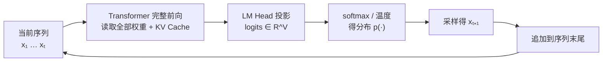
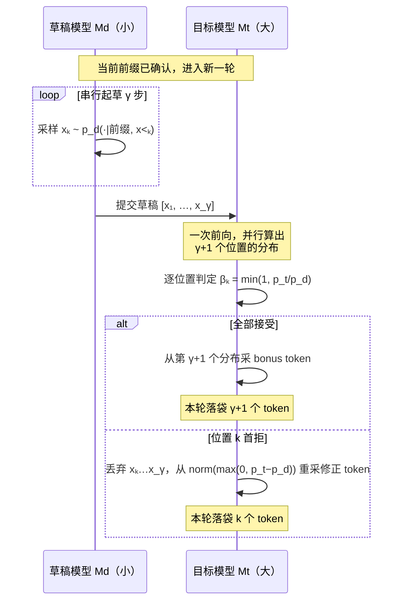
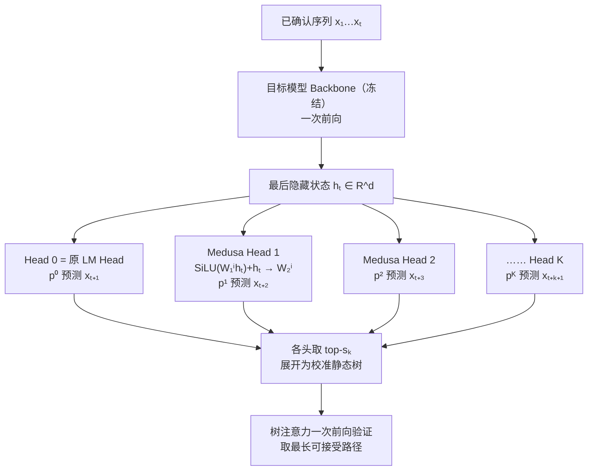
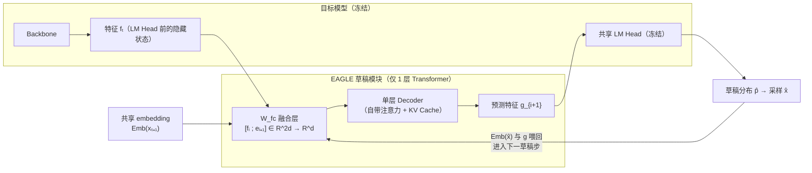
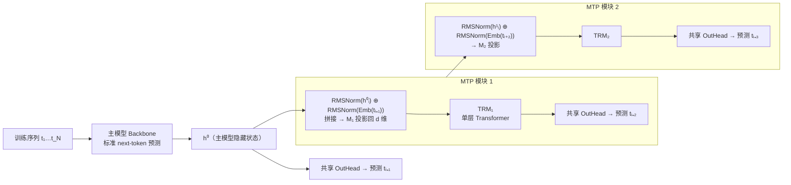
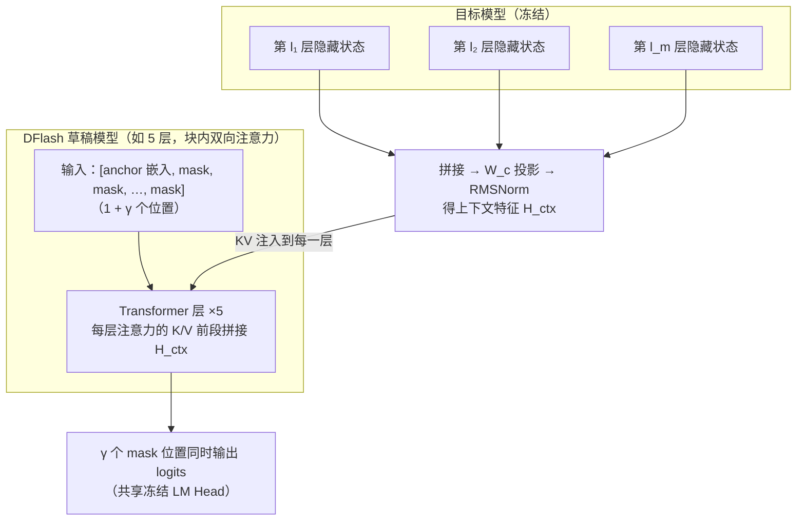
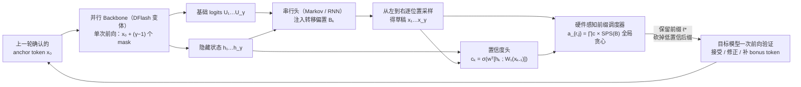
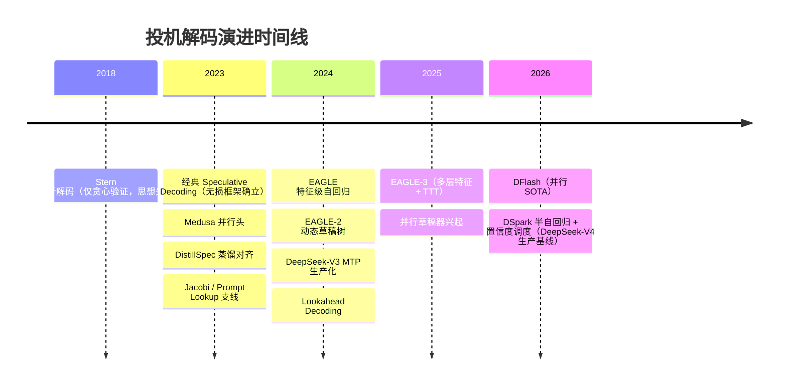
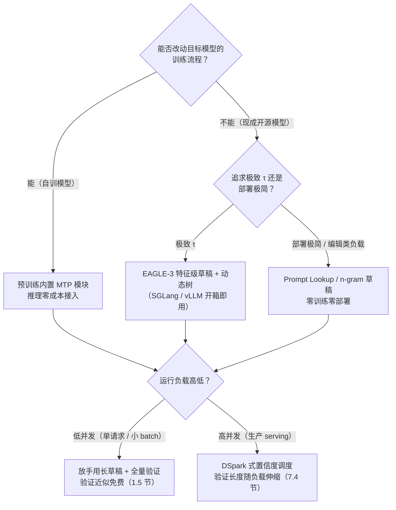

**TECHNICAL REFERENCE · 2026**

# 从 Speculative Decoding 到 Medusa 到 EAGLE 到 MTP 再到 DSpark：投机解码演进详解

*Autoregressive Decoding → Speculative Decoding → Medusa → EAGLE → MTP → Parallel Drafters → DSpark*

**面向教学的逐步推导 · 公式细节 · 网络结构 · 直觉建立 · 演进逻辑**

**适用读者**

希望深入理解大模型推理加速（投机解码 / 推测采样）演进脉络的研究人员与工程师。阅读本文只需要 Transformer 推理的基础常识，其余前置概念（Roofline 模型、拒绝采样、树注意力、连续批处理等）均在首次出现的章节内完整讲解。

版本基线：2026 年 8 月

---

## 执行摘要

> **一句话结论**　自回归解码逐 token 串行生成，推理速度被显存带宽锁死；投机解码（Speculative Decoding）用"小模型起草 + 大模型一次前向并行验证 + 拒绝采样"实现数学上严格无损的加速，但依赖一个外挂草稿模型；Medusa 给目标模型加装多个并行解码头，去掉了外挂模型，但头与头之间没有依赖；EAGLE 改为在目标模型的特征层上做自回归草稿，并引入动态草稿树，大幅提高接受长度，但草稿生成仍然是串行的；MTP（Multi-Token Prediction）把多 token 预测能力直接写进预训练目标，推理时零成本复用为内置草稿，但草稿长度固定、验证策略静态；并行草稿器（DFlash 等）把草稿延迟压缩到与块长无关的单次前向，却因块内 token 相互独立而遭遇 suffix decay（后缀接受率骤降）；DSpark 用"并行 backbone + 轻量串行头"的半自回归草稿器保住草稿质量，再用"置信度头 + 硬件感知调度器"按系统负载动态决定验证长度，将投机解码从一个算法技巧推进为生产级 serving 系统的吞吐-延迟联合优化方案。

| 方法 | 草稿来源 | 草稿依赖建模 | 验证拓扑 | 每轮期望产出 | 关键突破 | 关键缺陷 |
| --- | --- | --- | --- | --- | --- | --- |
| 自回归解码 | 目标模型自身 | 完整自回归 | — | 1 token/前向 | 精确、简单 | 逐 token 串行，memory-bound |
| Speculative Decoding | 独立小模型 | 完整自回归 | 单链（$\gamma$ 个） | $\tau \approx 2\sim3$ | 严格无损加速 | 外挂模型的对齐与维护成本 |
| Medusa | 目标模型的 $K$ 个并行头 | 无（头间独立） | 静态树 | $\tau \approx 2\sim3$ | 免外挂模型；树注意力 | 头间独立，深处接受率骤降 |
| EAGLE (1/2/3) | 目标模型特征 + 单层草稿 | 特征级自回归 | 静态树 → 动态树 | $\tau \approx 3\sim5$ | 特征不确定性洞察；LM head 复用 | 草稿串行，$T_{\text{draft}} \propto \gamma$ |
| MTP (DeepSeek) | 训练内生的 MTP 模块 | 完整自回归 | 单链 | MTP-1：$\tau \approx 1.85$ | 训练-推理目标统一，零外挂 | 长度固定、验证静态，高并发浪费 |
| 并行草稿器 (DFlash) | mask 块单次前向 | 无（块内独立） | 单链（长块） | 首 token 高、后缀骤衰 | $T_{\text{draft}}$ 与 $\gamma$ 无关 | suffix decay（多峰碰撞） |
| **DSpark** | 并行 backbone + 串行头 | 块内半自回归 | 置信度调度的动态前缀 | 离线最优（详见第 7 章） | 草稿质量 × 系统效率双优化 | 草稿侧固定成本不可回收 |

> **关于 $\tau$ 的说明**：$\tau$（每轮平均接受 token 数，含 bonus token）强烈依赖目标模型、任务域与温度，上表数字仅为各论文报告的典型量级，精确对比见第 7、8 章在同一测试床下的数据。

### 阅读导航

| 章节 | 主题 | 教学重点 |
| --- | --- | --- |
| 01 | 自回归解码 | 为什么逐 token 生成会撞"内存墙"？算术强度是什么？为什么"多验证几个 token 几乎免费"？ |
| 02 | 经典投机解码 | 拒绝采样如何保证严格无损？期望接受长度与加速比怎么算？外挂小模型贵在哪？ |
| 03 | Medusa | 并行解码头如何去掉外挂模型？树注意力如何在单次前向验证多条候选链？头间独立为何是硬伤？ |
| 04 | EAGLE | 为什么特征比 token 更好预测？动态草稿树如何构建？EAGLE-3 解除了什么约束？ |
| 05 | MTP | 多 token 预测如何成为预训练目标？MTP 模块的网络结构长什么样？为什么生产只部署 MTP-1？ |
| 06 | 并行草稿与 suffix decay | 单次前向出整块草稿为何诱人？多峰碰撞如何从数学上解释后缀衰减？高并发下验证为何变成负担？ |
| 07 | DSpark | 半自回归草稿器如何兼得并行速度与串行质量？置信度调度如何变成全局吞吐最大化问题？ |
| 08 | 总结 | 完整对比、两条演进主线、设计权衡与性能数据 |

---

## 1. 自回归解码：一切的起点

### 1.1 自回归解码在做什么

大语言模型本质上是一个条件概率模型。给定 prompt $x_1, x_2, \dots, x_n$，模型对续写序列的联合概率做**自回归分解**：

$$
p(x_{n+1}, \dots, x_{n+L} \mid x_{1:n}) = \prod_{t=1}^{L} p(x_{n+t} \mid x_{<n+t})
$$

这意味着生成是严格串行的：要得到第 $t$ 个新 token，必须先把前 $t-1$ 个新 token 喂进模型做一次完整前向，从输出 logits 上采样出 $x_{n+t}$，再开始下一步。生成 $L$ 个 token 就需要 $L$ 次串行前向，**任何一次前向都无法提前开始**——这是所有推理加速技术面对的根本约束。

逐 token 解码的单步流程：

**第一步**：将当前序列最后一个位置的隐藏状态 $\mathbf{h} \in \mathbb{R}^{d}$ 取出（$\mathbf{h}$ 的计算依赖全部历史 KV Cache）。

**第二步**：LM Head 投影到词表，$\mathbf{z} = \mathbf{W}_{\text{lm}} \mathbf{h} \in \mathbb{R}^{V}$，$V$ 为词表大小（现代模型 $V \approx 1.5 \times 10^5$）。

**第三步**：softmax 得分布并采样，$x_{n+t} \sim \text{softmax}(\mathbf{z} / T)$（$T$ 为温度）。

**第四步**：把 $x_{n+t}$ 的 embedding 追加到序列，进入下一步。

**用一张图看懂这个循环**：



对初学者需要强调的一点：**一次"前向"（forward pass）是把输入序列完整跑过所有 Transformer 层**。以 70B 模型为例，一次前向涉及约 80 层，每层包含 QKV 投影、注意力输出投影、FFN 的两个大矩阵等若干次大矩阵乘法，全部参数都参与运算——这是后文 $2N$ FLOPs 估算的来源。而每一步前向只为产出**一个**新 token：这就是"串行"的代价，也是全文要解决的原问题。

单 token 的墙上延迟近似为：

$$
T_{\text{token}} = \frac{\text{每步读取的字节数}}{\text{显存带宽}} = \frac{2N_{\text{param}} + \text{KV 读取}}{B_{\text{mem}}}
$$

其中 $N_{\text{param}}$ 是参数量，FP16 下每个参数 2 字节。注意这里**没有出现 FLOPs**——这正是 1.2 节要解释的反常现象。

### 1.2 前置知识：FLOPs、显存带宽、算术强度与 Roofline 模型

要理解 LLM 推理的瓶颈，需要建立一组硬件性能分析概念。

**FLOPs（浮点运算次数）**：衡量一次计算需要做多少数学运算。对参数量为 $N$ 的稠密 Transformer，处理 1 个 token 的前向约需 $2N$ FLOPs（每个参数参与一次乘法和一次加法）。70B 模型即 $1.4 \times 10^{11}$ FLOPs/token。

**显存带宽（memory bandwidth）**：GPU 从高带宽显存（HBM）读取数据的速度。A100 约 2.0 TB/s，H100 (SXM, HBM3) 约 3.35 TB/s。

**算术强度（arithmetic intensity）**：每读取一个字节所能进行的浮点运算次数：

$$
I = \frac{\text{FLOPs}}{\text{访存字节数}} \quad [\text{FLOP/byte}]
$$

**Roofline 模型**：一个 kernel 的实际算力利用率为

$$
\text{可达算力} = \min\left(\text{峰值算力},\; I \times B_{\text{mem}}\right)
$$

- 当 $I > I^*$（**ridge point**，转折点）时受算力限制（compute-bound）；
- 当 $I < I^*$ 时受带宽限制（memory-bound）。

H100 的 ridge point：$I^* = 989\ \text{TFLOPS} / 3.35\ \text{TB/s} \approx 295\ \text{FLOP/byte}$。

**用 Roofline 图直观理解**（横轴算术强度，纵轴可达算力，双对数坐标）：

```
可达算力
TFLOP/s │                    ┌────────────── 峰值算力 989 TFLOPS
        │                   ╱
        │                  ╱   ← 斜率 = 带宽 3.35 TB/s
        │                 ╱     （memory-bound 斜坡段）
        │                ╱
        │   decode(1)   ╱ ridge point
        │       ●      ╱   I* ≈ 295
        └──────────────────────────── 算术强度 I (FLOP/byte)
              I≈1             295
```

- **斜坡段**：$I$ 太小，算力被带宽锁死（上限 $= I \times B_{\text{mem}}$）——单请求 decode 就在左下角的"●"处；
- **平台段**：$I$ 越过 ridge point，算力打满——大 batch prefill 的位置。

**这张图怎么用**：任何 decode 优化只有两条路——把点**往右推**（提高每步的算术强度，比如一次前向多算几个 token），或者**减少串行步数**。投机解码两件事同时做：一次前向验证 $\gamma$ 个位置（点右移 $\gamma$ 倍），且每轮落袋多个 token（步数变少）。

**现在看 decode 单步的算术强度**（batch = 1）：

$$
I_{\text{decode}} = \frac{2N\ \text{FLOPs}}{2N\ \text{bytes}} \approx 1\ \text{FLOP/byte} \ll 295
$$

**差了将近 300 倍**。换言之，decode 阶段 GPU 的 Tensor Core 绝大部分时间在空转等数据，利用率约 $1/295 \approx 0.3\%$。

**具体例子**：70B 模型 FP16 权重占 140 GB。在 A100（2.0 TB/s）上，仅权重读取一遍就需要 $140\ \text{GB} / 2.0\ \text{TB/s} = 70$ ms，即理论上限约 14 token/s——这就是"内存墙"。此时实际算力消耗只有 $1.4\times10^{11}\ \text{FLOPs} \times 14 / \text{s} \approx 2\ \text{TFLOPS}$，约为 A100 峰值（312 TFLOPS）的 0.6%。

### 1.3 prefill 与 decode：两个阶段，两种瓶颈

LLM 推理分为两个阶段，瓶颈完全不同：

| 维度 | prefill（处理 prompt） | decode（逐 token 生成） |
| --- | --- | --- |
| 每步处理 token 数 | 全部 prompt 长度 $L_p$ | 1（每请求） |
| 权重读取次数 | 1 次，被 $L_p$ 个 token 摊销 | 每 token 1 次 |
| 算术强度 | $\approx L_p$ FLOP/byte（通常 $> I^*$） | $\approx 1$ FLOP/byte |
| 瓶颈 | **compute-bound** | **memory-bound** |
| 优化方向 | 大 batch、大矩阵乘 | 减少串行步数、减少访存 |

关键差别：prefill 时 prompt 的所有位置**一次性**参与矩阵运算，权重从 HBM 读入一次后被 $L_p$ 个 token 复用，算术强度随 $L_p$ 线性增长，轻松越过 ridge point；decode 每步只有 1 个新 token，权重读一遍只为它服务，算术强度被钉死在 1 附近。

> **教学要点**：decode 的瓶颈不是"算得慢"，而是"搬得慢"。每生成一个 token，都要把几百 GB 的权重和 KV Cache 从显存搬运一遍，而搬运期间计算单元基本闲置。这个洞察是投机解码的全部物理基础。

### 1.4 KV Cache：用显存换计算

decode 阶段，第 $t$ 步的注意力需要历史上所有位置的 key/value。若每步重算历史 KV，计算量将随 $t$ 平方增长。KV Cache 把每层的 $\mathbf{k}_j, \mathbf{v}_j$ 缓存下来，使每步只需计算当前 token 的 $\mathbf{q}, \mathbf{k}, \mathbf{v}$。

KV Cache 的显存占用（逐 token、逐层）：

$$
\text{KV bytes/token} = \underbrace{2}_{K,V} \times n_{\text{layer}} \times n_{\text{kv}} \times d_{\text{head}} \times \underbrace{2}_{\text{FP16 bytes}}
$$

**具体例子**：80 层、$n_{\text{kv}} \times d_{\text{head}} = 8192$ 的 MHA 模型，每 token 的 KV Cache 为 $2 \times 80 \times 8192 \times 2 \approx 2.6$ MB。128K 上下文即 $\approx 335$ GB——超过单卡显存。这催生了 GQA/MQA/MLA 等压缩 KV 的结构设计（MLA 详见本系列 MLA 姊妹篇文档）。

KV Cache 同时加重 decode 的访存负担：每步除了读 $2N$ 字节权重，还要读取全部历史 KV。长上下文下 KV 读取甚至超过权重读取，进一步压低算术强度。

### 1.5 关键洞察：decode 阶段"算力近乎免费"

现在抵达全文最重要的观察。考虑 batch = 1 的 decode 场景：

- 生成 1 个 token：读一遍权重（$2N$ 字节）+ 读一遍 KV Cache，做 $2N$ FLOPs；
- **一次前向同时处理 $\gamma$ 个候选位置**：访存量几乎不变（权重和 KV 都只读一遍，只是矩阵乘从 $1 \times d$ 变成 $\gamma \times d$），FLOPs 变为 $\gamma \times 2N$。

由于 decode 是 memory-bound，FLOPs 翻 $\gamma$ 倍但**墙上时间几乎不变**——只要 $\gamma \times 2N$ 不超过闲置算力。用 roofline 语言说：把 $\gamma$ 个位置打包进同一步，算术强度从 1 提升到 $\gamma$，在 $\gamma \ll I^* \approx 295$ 时仍处于 memory-bound 区间，延迟曲线是平的。

$$
T_{\text{forward}}(\gamma) \approx \frac{2N + \text{KV}}{B_{\text{mem}}} \approx T_{\text{forward}}(1), \quad \gamma \lesssim \mathcal{O}(10)
$$

> **核心问题**　既然一次前向验证 $\gamma$ 个 token 与验证 1 个 token 一样快，能否让某种廉价机制先"猜"出 $\gamma$ 个 token，再用目标模型的一次前向检查它们、把猜对的部分一次性落袋？——这就是投机解码。

**batch 对这个结论的影响**（为第 6 章埋下伏笔）：一次 decode 前向处理 $B$ 个请求时，访存量几乎不变（权重仍只读一遍），FLOPs 却变为 $B \times 2N$——算术强度近似等于 $B$。于是：

| batch $B$ | 算术强度 $I$ | 所处区间 | 多验证 1 个 token 的边际成本 |
| --- | --- | --- | --- |
| 1 | $\approx 1$ | 深度 memory-bound | $\approx 0$（白送） |
| 32 | $\approx 32$ | 仍 memory-bound | 很小 |
| 256 | $\approx 256$ | 接近 ridge point | 开始真实计费 |
| 512+ | $> 295$ | **compute-bound** | 挤占其他请求的算力 |

这就是为什么"投机解码在低并发下稳赚、在高并发下要算账"——第 6、7 章会反复回到这张表。

**但有一个重要前提**：上述结论只在低并发（小 batch）成立。若 serving 系统已经用大 batch 把算术强度顶到 ridge point 附近，验证 $\gamma$ 个 token 就不再免费，而是挤占本可服务其他请求的算力。这个"系统侧代价"将在第 6、7 章成为主角。

### 1.6 加速空间的量化预览

形式化地，设每个解码轮次（draft + verify 一轮）中：

- $T_{\text{draft}}$：草稿生成耗时；
- $T_{\text{verify}}$：目标模型验证耗时；
- $\tau$：本轮实际落袋的 token 数（含验证产生的修正/bonus token）。

则平均每个 token 的延迟为

$$
\boxed{L = \frac{T_{\text{draft}} + T_{\text{verify}}}{\tau}}
$$

相比自回归基线 $L_0 = T_{\text{verify}}^{(1)}$（每 token 一次前向），加速来自三个杠杆（这正是 DSpark 论文对全领域的归纳）：

1. **draft faster**：压低 $T_{\text{draft}}$（小模型、并行草稿）；
2. **draft better**：抬高 $\tau$（更准的草稿、更长的接受前缀）；
3. **verify smarter**：削减无效 $T_{\text{verify}}$（别验证注定要拒的 token）。

整部投机解码演进史，就是这三个杠杆被逐一轮流按压的历史：经典方法建立杠杆 1、2 的框架（第 2 章）；Medusa/EAGLE/MTP 持续压杠杆 1、2（第 3–5 章）；并行草稿器把杠杆 1 压到极限却牺牲了杠杆 2（第 6 章）；DSpark 第一次把杠杆 3 提到与杠杆 1、2 同等的高度（第 7 章）。

---

## 2. 经典 Speculative Decoding：草稿与验证

2023 年，Google（Leviathan et al.）与 DeepMind（Chen et al.）几乎同时发表了本质相同的框架：**用一个便宜的小模型串行起草 $\gamma$ 个 token，再让目标大模型用一次前向并行验证，配合拒绝采样保证输出分布与大模型严格一致**。这是投机解码的奠基之作，后续所有工作都在改造它的两个组件：草稿器从哪来（第 3–6 章），以及验证怎么做（第 3、7 章）。

### 2.1 动机：把"串行生成"变成"并行检查"

第 1 章的结论：decode 是 memory-bound，一次前向处理 $\gamma$ 个位置与处理 1 个位置耗时几乎相同。于是加速的思路不再是"让模型跑得更快"，而是**让每个串行步落袋更多 token**。

设想一个理想的"神谕"：如果每步都能免费知道未来的 $\gamma$ 个 token 是什么，大模型只需一次前向就能确认这 $\gamma$ 个 token 并同时得到第 $\gamma+1$ 个位置的分布——单步产出从 1 个 token 变成 $\gamma+1$ 个。现实中没有神谕，但有一个关键的经验事实：

> **经验事实**：生成文本中大量 token 是"容易"的——常见搭配、格式化结构、代码模板、重复片段——一个比目标模型小 1–2 个数量级的模型也能猜对它们。只有少数"决策点" token 真正需要大模型的能力。

投机解码就是用一个便宜机制去逼近神谕：**小模型负责猜（draft），大模型负责审（verify），审不过的地方由大模型亲自纠正**。猜错不会污染输出——因为验证与纠正机制在数学上严格等价于直接从大模型采样（2.4 节证明）。

### 2.2 前置知识：拒绝采样（Rejection Sampling）

拒绝采样是蒙特卡洛方法中的经典技术，也是投机解码无损性的数学根基。

**问题设定**：目标分布 $p(x)$ 难以直接采样，但可以对任意 $x$ 计算 $p(x)$ 的值；另有一个容易采样的提议分布 $q(x)$。

**经典版本**（需要包络常数）：若存在常数 $M$ 使 $p(x) \le M q(x)$ 对所有 $x$ 成立，则重复执行：从 $q$ 采样 $x$，以概率 $p(x) / (M q(x))$ 接受，否则拒绝重采。可以证明接受的样本严格服从 $p$。

**直觉**：$q$ 提出了一个候选，接受概率 $p/(Mq)$ 恰好"折价"掉 $q$ 与 $p$ 的差距——$q$ 比 $p$ 高出的部分被等比例拒绝，最终采样的相对频率精确还原 $p$ 的形状。

**投机解码用的变体**（无需包络常数，单次决策）：从 $q$ 采样一个 $x$，计算

$$
\beta(x) = \min\left(1, \frac{p(x)}{q(x)}\right)
$$

- 以概率 $\beta(x)$ **接受** $x$；
- 以概率 $1 - \beta(x)$ **拒绝**，并从修正分布 $p'(x) = \text{norm}\left(\max\left(0,\, p(x) - q(x)\right)\right)$ 重采一个，其中 $\text{norm}(f) = f / \sum_z f(z)$。

注意两个设计：$\min(1, \cdot)$ 截断使得当 $q$ 低估 $p$（即 $p(x) > q(x)$）时必然接受；而 $\max(0, p-q)$ 的重采分布恰好补上 $q$ 相对 $p$ "多采"与"少采"的差量。2.4 节将严格证明这个过程的输出分布就是 $p$。

**期望接受率**：对单个位置，$x \sim q$ 被接受的概率为

$$
\mathbb{E}_{x \sim q}[\beta(x)] = \sum_x q(x) \min\left(1, \frac{p(x)}{q(x)}\right) = \sum_x \min(q(x), p(x)) = 1 - \frac{1}{2}\|p - q\|_1 = 1 - D_{\text{TV}}(q, p)
$$

这里用到了总变差距离（total variation distance）的等价定义 $D_{\text{TV}}(q,p) = \frac{1}{2}\sum_x |q(x) - p(x)| = 1 - \sum_x \min(q(x), p(x))$。这个结论极为重要：**接受率 = 草稿分布与目标分布的 1 减去总变差距离**。草稿与目标越像，接受率越高——这是第 5、7 章训练目标的直接理论依据。

### 2.3 核心算法：draft → verify → 逐位置接受

**符号约定**：目标模型 $M_t$，其条件分布记 $p_t(\cdot \mid \text{prefix})$；草稿模型 $M_d$，分布记 $p_d(\cdot \mid \text{prefix})$；草稿长度（block size）$\gamma$。

一个完整的解码轮次（decoding cycle）：

**第一步：起草（draft）**。$M_d$ 从当前前缀出发**自回归**地串行采样 $\gamma$ 个 token：

$$
x_k \sim p_d(\cdot \mid x_0, x_1, \dots, x_{k-1}), \quad k = 1, \dots, \gamma
$$

其中 $x_0$ 表示上一轮由目标模型确认的最后一个 token（anchor / bonus token）。注意起草仍是串行的，所以 $M_d$ 必须足够小、足够快：$T_{\text{draft}} \approx \gamma \cdot T_d$，其中 $T_d \ll T_t$。

**第二步：并行验证（verify）**。把 $\gamma$ 个草稿 token 拼在前缀后，$M_t$ 做**一次**前向，同时得到 $\gamma+1$ 个位置的目标分布：

$$
p_t(\cdot \mid x_0),\; p_t(\cdot \mid x_0, x_1),\; \dots,\; p_t(\cdot \mid x_0, x_1, \dots, x_\gamma)
$$

这就是 1.5 节的"免费"并行：验证 $\gamma$ 个位置与验证 1 个位置的访存量相同。

**第三步：逐位置接受判定**。从左到右扫描 $k = 1, \dots, \gamma$：

$$
\beta_k = \min\left(1, \frac{p_t(x_k \mid x_0, x_{<k})}{p_d(x_k \mid x_0, x_{<k})}\right), \quad x_k \text{ 以概率 } \beta_k \text{ 被接受}
$$

- 若 $x_k$ 被接受，继续检查 $x_{k+1}$；
- 若 $x_k$ 被拒绝（首个拒绝位置），**丢弃 $x_k$ 及其后全部草稿**（$x_{k+1}, \dots, x_\gamma$ 无论多好都不再看），并从修正分布重采该位置：

$$
x_k^* \sim p'(\cdot) = \text{norm}\left(\max\left(0,\; p_t(\cdot \mid x_0, x_{<k}) - p_d(\cdot \mid x_0, x_{<k})\right)\right)
$$

本轮结束，落袋 $k$ 个 token（$k-1$ 个接受的草稿 + 1 个修正 token）。

- 若 $\gamma$ 个草稿**全部接受**，则**额外白拿一个 bonus token**：直接从第二步算出的最后一个分布采样 $x_{\gamma+1} \sim p_t(\cdot \mid x_0, x_{1:\gamma})$。本轮落袋 $\gamma+1$ 个 token。

**前缀性质**：验证是严格的前缀匹配——第一个拒绝位置之后的草稿全部作废。这个性质贯穿全文：它意味着草稿位置越深，"存活"到被验证通过的概率越低（连乘衰减），这是第 6 章 suffix decay 和第 7 章前缀存活概率的根源。

**每轮落袋 token 数** $\tau$ 的范围是 $[1, \gamma+1]$：最坏情况第一个草稿就被拒（但仍有 1 个修正 token，**不会比自回归慢太多**——只亏草稿耗时），最好情况全拿 $\gamma+1$ 个。

**一轮解码的完整时序**：



**一个微型数值例子**（词表只有 4 个 token：A/B/C/D）。假设某位置草稿分布与目标分布为：

| token | $p_d$ | $p_t$ | $\min(p_d, p_t)$ | $\max(0, p_t - p_d)$ |
| --- | --- | --- | --- | --- |
| A | 0.5 | 0.6 | 0.5 | 0.1 |
| B | 0.3 | 0.1 | 0.1 | 0 |
| C | 0.1 | 0.2 | 0.1 | 0.1 |
| D | 0.1 | 0.1 | 0.1 | 0 |

- 单位置接受率 $\alpha = \sum_x \min(p_d, p_t) = 0.5+0.1+0.1+0.1 = 0.8$（验证：$1 - \frac{1}{2}\|p_d - p_t\|_1 = 1 - \frac{1}{2}(0.1+0.2+0.1+0) = 0.8$ ✓）；
- 若草稿提出 **A**：$\beta = \min(1, 0.6/0.5) = 1$，**必接受**（草稿低估了它，目标更想要它）；
- 若草稿提出 **B**：$\beta = \min(1, 0.1/0.3) = 1/3$，三分之二概率被拒；拒绝后从修正分布重采：

$$
p' = \frac{(0.1,\ 0,\ 0.1,\ 0)}{0.2} = (0.5,\ 0,\ 0.5,\ 0)
$$

只在 A、C 之间采，绝不采 B 和 D——因为草稿对 B、D 已经"超采"了，修正分布把它们的概率清零。

亲手算一遍这个例子，下一节的形式化证明就从符号变成了直觉。

### 2.4 无损性证明：为什么输出与目标模型严格同分布

**定理**：对任意位置，上述"接受-拒绝-重采"机制产生的 token 的分布严格等于 $p_t(\cdot \mid \text{prefix})$。（由此归纳，整条生成轨迹的分布与纯目标模型自回归采样完全一致。）

**证明**（固定前缀，简记 $q = p_d$，$p = p_t$）。对任意 token $x$，它成为本轮输出的概率来自两个互斥路径：

**路径 A：草稿提出 $x$ 且被接受**

$$
P_A(x) = q(x) \cdot \beta(x) = q(x) \cdot \min\left(1, \frac{p(x)}{q(x)}\right) = \min(q(x), p(x))
$$

**路径 B：草稿提出的某个 $x'$ 被拒绝（概率 $1-\beta(x')$），随后从修正分布重采得到 $x$**

$$
P_B(x) = \underbrace{\sum_{x'} q(x')\left(1 - \beta(x')\right)}_{\text{发生拒绝的总概率}} \cdot \; p'(x)
$$

先算拒绝总概率：

$$
\sum_{x'} q(x') - \sum_{x'} \min(q(x'), p(x')) = 1 - \sum_{x'} \min(q(x'), p(x'))
$$

再展开修正分布：

$$
p'(x) = \frac{\max(0, p(x) - q(x))}{\sum_z \max(0, p(z) - q(z))}
$$

注意恒等式 $p(z) - \min(q(z), p(z)) = \max(0, p(z) - q(z))$，对 $z$ 求和得

$$
\sum_z \max(0, p(z) - q(z)) = 1 - \sum_z \min(q(z), p(z))
$$

恰好与拒绝总概率相同，二者相消：

$$
P_B(x) = \max(0, p(x) - q(x))
$$

**合并两条路径**：

$$
P(x) = P_A(x) + P_B(x) = \min(q(x), p(x)) + \max(0, p(x) - q(x)) = p(x)
$$

分两种情形验证最后一步：若 $p(x) \ge q(x)$，则 $\min = q(x)$、$\max(0, \cdot) = p(x) - q(x)$，合计 $p(x)$；若 $p(x) < q(x)$，则 $\min = p(x)$、$\max(0, \cdot) = 0$，合计 $p(x)$。$\blacksquare$

> **教学要点**：这个证明的美在于"$q$ 多提的部分被 $\min$ 拒掉，$q$ 少提的部分被重采分布精确补齐"，两块拼起来严丝合缝。**整个机制对草稿模型零假设**——$M_d$ 可以是任何模型、甚至乱猜，正确性都不受影响；草稿质量只影响速度，不影响分布。这就是"无损（lossless）"的含义，也是投机解码区别于蒸馏、量化等近似加速手段的本质特征。

### 2.5 期望接受长度与加速比：定量分析

**单位置接受率**。设每个草稿位置（近似独立地）以概率 $\alpha$ 被接受，由 2.2 节：

$$
\alpha = \mathbb{E}[\beta] = 1 - D_{\text{TV}}(p_d, p_t)
$$

**每轮期望落袋数**。接受过程是前缀匹配：前 $j$ 个草稿全被接受的概率为 $\alpha^j$。每轮落袋数 $\tau$ = 接受的草稿数 + 1（修正或 bonus token），故

$$
\mathbb{E}[\tau] = \sum_{j=0}^{\gamma} P(\text{接受数} \ge j) \cdot \mathbb{1} = \frac{1 - \alpha^{\gamma+1}}{1 - \alpha}
$$

（几何级数求和：$\sum_{j=0}^{\gamma} \alpha^j = \frac{1-\alpha^{\gamma+1}}{1-\alpha}$。）

**加速比**。设草稿模型单步耗时与目标模型单步耗时之比为 $c = T_d / T_t \ll 1$。一轮耗时 $\approx \gamma c\, T_t + T_t = (\gamma c + 1) T_t$，落袋 $\mathbb{E}[\tau]$ 个 token；基线每 token 耗时 $T_t$。于是

$$
\boxed{\text{Speedup} \approx \frac{1 - \alpha^{\gamma+1}}{(1 - \alpha)\,(\gamma c + 1)}}
$$

**数值例子**：取 $\alpha = 0.8$，$c = 0.05$（草稿模型约为目标模型 1/20 的延迟）：

| $\gamma$ | $\mathbb{E}[\tau]$ | 分母因子 $\gamma c + 1$ | Speedup |
| --- | --- | --- | --- |
| 1 | 1.80 | 1.05 | 1.71× |
| 2 | 2.44 | 1.10 | 2.22× |
| 4 | 3.36 | 1.20 | 2.80× |
| 6 | 3.93 | 1.30 | 3.02× |
| 10 | 4.46 | 1.50 | 2.97× |

**两个重要观察**：

1. **$\gamma$ 存在最优值**。$\mathbb{E}[\tau]$ 随 $\gamma$ 增长但边际递减（$\alpha^\gamma \to 0$），而验证成本 $\gamma c + 1$ 线性增长。上表中 $\gamma \approx 6$ 最优。实践中 $\gamma$ 常取 3–5。
2. **$\alpha$ 是生命线**。把 $\alpha$ 从 0.8 提到 0.9（$\gamma=4, c=0.05$）：$\mathbb{E}[\tau] = (1-0.9^5)/0.1 = 4.10$，Speedup $= 4.10/1.2 = 3.41\times$。接受率每涨一点，加速比显著改善——后续所有草稿器设计（第 3–7 章）本质上都是在不增加 $c$ 的前提下抬高 $\alpha$。

**特例：贪心解码下的验证**。温度为 0（每位置取 argmax）时规则大幅简化：草稿 $x_k$ 被接受**当且仅当 $x_k = \arg\max_v p_t(v \mid \text{prefix})$**——即"草稿猜中了目标模型的第一选择"。无需拒绝采样、无需修正分布，验证退化为纯 token 比对；被拒绝位置的修正 token 直接取目标的 argmax。这就是为什么早期工作（Stern et al. 2018）只支持贪心：**采样情形下"既加速又不改变分布"的验证规则，要等到 2023 年的两篇论文才补完**——也正是这条规则把投机解码从"近似技巧"升格为"严格无损"。

**$\alpha$ 的现实分布**：$\alpha$ 不是常数。代码、数学推导等结构化文本中 $\alpha$ 可达 0.85–0.95；开放聊天中可能只有 0.5–0.7。这种**跨域方差**将在第 6、7 章成为调度问题的动机。

### 2.6 草稿模型从哪来：独立小模型与蒸馏

经典框架要求一个与目标模型**同词表、分布对齐**的小模型。常见来源：

**方案一：同家族小模型**。直接用同系列的小尺寸版本（如 LLaMA-7B 给 LLaMA-65B 当草稿）。优点是零训练成本；缺点是家族未必有合适尺寸，且小模型的训练数据/分词若与大模型不同，$\alpha$ 会显著下降。

**方案二：蒸馏对齐（DistillSpec，Zhou et al. 2023）**。用目标模型的输出分布蒸馏草稿模型，直接优化"分布相似度"。DistillSpec 系统比较了蒸馏目标（前向 KL、反向 KL、JSD 等）对接受率的影响，证明对齐蒸馏可将 $\alpha$ 提升 10%–45%。这印证 2.2 节的公式：$\alpha = 1 - D_{\text{TV}}$，蒸馏就是在最小化分布距离。

**方案三：检索式草稿（无需神经模型）**。见 2.7 节支线。

### 2.7 支线速览：无外挂草稿模型的早期尝试

与"外挂小模型"平行，2023–2024 年出现了多条"不训练独立草稿模型"的路线，它们的思想后来被主线吸收：

**Prompt Lookup Decoding**：观察到生成内容常复制 prompt 中的片段（代码编辑、RAG 引用、文档续写）。直接从 prompt 里做字符串匹配，把命中的 n-gram 后缀当作草稿。零成本、零训练，在编辑类任务上效果显著；局限是只能"复制"，不能"创作"。

**Jacobi Decoding（Santilli et al. 2023）**：把非自回归生成看作不动点迭代——随机初始化 $\gamma$ 个未来位置，反复用目标模型并行修正，直到收敛。每次迭代是一次并行前向，偶尔会"跳"过多步。无需草稿模型，但不动点收敛次数不确定。

**Lookahead Decoding（Fu et al. 2024）**：Jacobi 的实用化改造。维护一个 n-gram 池，缓存历史上 Jacobi 迭代产生的轨迹片段；每轮用匹配的 n-gram 作为草稿分支并行验证。在 vLLM 中有实现。

**自投机 / 早退类（Draft & Verify，Zhang et al. 2023）**：让目标模型自己"浅层当草稿"——只用前若干层计算并提前从 LM Head 读出草稿 token，再用全部层验证。跳过层的划分是难点，浅层表示与深层分布对齐较差。

**SpecInfer（Miao et al. 2023/2024）**：首次把**树状验证**系统化——用一组小模型集体提出一棵候选 token 树，配合 tree attention 一次前向验证整棵树。树拓扑的思想随后被 Medusa/EAGLE 继承（第 3、4 章）。

> **教学要点**：这些支线的共同主题是"消灭外挂模型"——草稿信息可以来自 prompt（检索）、来自目标模型自身的不动点迭代（Jacobi）、来自浅层（早退）、或来自一群小模型的集成（树）。它们大多没成为主流，但"草稿不必是独立 AR 小模型"的观念为 Medusa/EAGLE 铺平了道路。

### 2.8 局限：外挂小模型的三重成本

经典框架在单请求场景下可实现 2–2.8× 加速，但"外挂独立小模型"这一形态有三个结构性缺陷：

1. **对齐成本**：$\alpha = 1 - D_{\text{TV}}$ 要求草稿与目标分布高度一致。目标模型每次升级/微调，草稿模型就要重新对齐蒸馏——生产上是持续的维护负担。
2. **基建成本**：两个模型意味着两套权重加载、两份 KV Cache 管理、两条调度路径。serving 系统的复杂度近乎翻倍。
3. **能力错配**：小模型与目标模型的能力差距是系统的——在目标模型"知道而小模型不知道"的知识型 token 上，草稿必错，$\alpha$ 存在由模型规模差决定的天花板。

> **核心问题**　能否让**目标模型自身**长出草稿能力——草稿与目标共享同一个 backbone，天然分布对齐、无需额外部署？这引出下一章的 Medusa。

---

## 3. Medusa：让目标模型自己长出草稿头

Medusa（Cai et al., 2024, ICML）回答了第 2 章结尾的问题：**草稿不必来自另一个模型——在目标模型的 backbone 上加几个额外的解码头，就能让它"自己给自己起草"**。其思想源头可追溯到 Stern et al. (2018) 的 Blockwise Parallel Decoding（在最后一层加 $k$ 个预测头、仅支持贪心验证），Medusa 把它补完为支持采样的完整框架。

### 3.1 动机：共享 backbone 的三重红利

回顾外挂小模型的三重成本（对齐、基建、能力错配）。若草稿头直接挂在目标模型的隐藏状态上：

1. **天然对齐**：草稿头读的是目标模型自己算出的隐藏状态 $\mathbf{h}_t$，它与目标分布共享全部上下文表征，$D_{\text{TV}}$ 天然小于独立小模型；
2. **零额外基建**：草稿头只是几个小矩阵，寄生在目标模型同一次前向里，没有第二份权重、第二个 KV Cache；
3. **草稿成本极低**：$T_{\text{draft}}$ 从"小模型的 $\gamma$ 次前向"变成"几个线性层"，$c \to 0$。

### 3.2 前置知识：树注意力（Tree Attention）与拓扑掩码

Medusa 的多个草稿头每轮会产出**多个候选序列**，目标模型需要在一次前向里同时验证它们。这要求把"链式验证"推广为"树式验证"。

**问题**：标准因果注意力中，位置 $i$  attends 到所有 $j \le i$。但树状候选里，两个不同分支上的 token 互为"平行宇宙"——分支 A 的 token 绝不应该看到分支 B 的 token。

**解决方案：拓扑掩码（topology mask）**。把树上所有节点按某种顺序（如 BFS）摊平成一个序列喂进模型，然后用一个自定义注意力掩码 $\mathbf{M}$ 替代标准下三角因果掩码：

$$
\mathbf{M}_{ij} = \begin{cases} 1 & \text{若节点 } j \text{ 是节点 } i \text{ 的祖先（或 } i = j \text{）} \\ 0 & \text{否则} \end{cases}
$$

即每个节点只 attends 到"从根到自己"的那条链。同时位置编码也按**树内深度**而非摊平序号设置，使每个节点的计算与"只跑它所在那条链"完全等价。

**具体例子**：3 个草稿头各取 top-2，组合成一棵树（根为已确认的 anchor 上下文）：

```
head-1 候选:   the        a
              /  \       /  \
head-2 候选: cat  dog  big  small
```

摊平成序列 $[\text{the}, \text{a}, \text{cat}, \text{dog}, \text{big}, \text{small}]$ 后，"cat" 的掩码只允许看 "the"，"big" 只允许看 "a"，"dog" 看不到 "big"——尽管它们在摊平序列里相邻。一次前向后，每个节点都得到"若走我这条链，下一个 token 的分布" $p_t$，于是**一次前向验证了 4 条候选链**（the-cat、the-dog、a-big、a-small）。

**把掩码矩阵完整写出来**（行 = query 节点，列 = key 节点，1 = 可见）：

| query \ key | the | a | cat | dog | big | small |
| --- | --- | --- | --- | --- | --- | --- |
| **the** | 1 | 0 | 0 | 0 | 0 | 0 |
| **a** | 0 | 1 | 0 | 0 | 0 | 0 |
| **cat** | 1 | 0 | 1 | 0 | 0 | 0 |
| **dog** | 1 | 0 | 0 | 1 | 0 | 0 |
| **big** | 0 | 1 | 0 | 0 | 1 | 0 |
| **small** | 0 | 1 | 0 | 0 | 0 | 1 |

对照标准因果掩码（下三角全 1）：树掩码把"同层兄弟"和"表亲分支"之间的可见性全部置 0，只保留各自的祖先链。位置编码同理：cat、dog、big、small 的深度都是 2，**共享同一个位置 id**——于是每个节点的计算与"单独跑它那条链"逐比特一致，一次树验证与逐链分别验证**严格等价**。

树状验证与链式验证共用同一套接受/拒绝规则（2.3 节），只是接受路径从"唯一前缀"变成"最优分支"：按某种顺序（如逐层 best-first）沿树找到最长的可接受路径。验证的 token 总数从 $\gamma$ 膨胀为树大小（几十），但由于 memory-bound 特性（1.5 节），只要树不太大，墙上时间仍几乎不变。

### 3.3 核心方法：Medusa 解码头 + 静态树验证

**网络结构**。设目标模型 backbone 输出的最后隐藏状态为 $\mathbf{h}_t \in \mathbb{R}^{d}$（对应已确认序列的最后一个位置）。原始 LM Head 视为第 0 头，$p_t^{(0)} = \text{softmax}(\mathbf{W}_{\text{lm}} \mathbf{h}_t)$，负责预测 $x_{t+1}$。Medusa 额外加装 $K$ 个解码头，第 $k$ 个头负责预测 $x_{t+k+1}$：

$$
\boxed{p_t^{(k)} = \text{softmax}\left(\mathbf{W}_2^{(k)} \cdot \left(\text{SiLU}(\mathbf{W}_1^{(k)} \mathbf{h}_t) + \mathbf{h}_t\right)\right)}, \quad k = 1, \dots, K
$$

结构拆解：

- $\mathbf{W}_1^{(k)} \in \mathbb{R}^{d \times d}$：一个带 SiLU 激活的前馈层，给头部一点非线性变换能力；
- **残差连接** $+\,\mathbf{h}_t$：让头部聚焦于学习"未来增量"而非重学上下文表征；
- $\mathbf{W}_2^{(k)} \in \mathbb{R}^{d \times V}$：词表投影，可与 LM Head 初始化共享。

**结构示意**：



注意图中所有 Medusa 头都挂在**同一个** $\mathbf{h}_t$ 上、彼此之间没有任何连线——"头间独立"在图上一目了然，这也是 3.5 节缺陷的结构性来源。

**关键结构特征：所有头读的是同一个 $\mathbf{h}_t$，头与头之间没有任何信息交换**。第 3 头预测 $x_{t+4}$ 时，看不到第 1、2 头对 $x_{t+2}, x_{t+3}$ 的预测结果——这就是"头间独立"，第 6 章会看到它的深远后果。

**候选展开与静态树**。每轮解码：

1. 一次 backbone 前向得到 $\mathbf{h}_t$；
2. $K+1$ 个头各自给出分布，取第 $k$ 头的 top-$s_k$ 候选；
3. 各头候选做**笛卡尔积**，展开成一棵固定形状的树（如 $s_1 \times s_2 \times \dots$ 条路径）；
4. 实践中并不使用全部组合，而是用语料统计出的**校准树**（Medusa 论文用语料上各头 top 候选的联合频率剪枝出一棵 64 节点左右的静态树，形状固定、跨请求复用）；
5. 树注意力一次前向验证，选出最长可接受路径。

**Typical Acceptance：用"近似"换"接受率"**。Medusa 默认不采用 2.3 节的拒绝采样，而是一种启发式规则：候选 token $x$ 被接受，当且仅当

$$
p_t(x \mid \text{prefix}) > \min\left(\epsilon,\; \delta \cdot \exp(-H(p_t))\right)
$$

其中 $\epsilon$ 是硬阈值，$H(p_t) = -\sum_v p_t(v) \log p_t(v)$ 是目标分布的熵，$\delta$ 是熵系数。含义：目标分布越不确定（熵大），阈值 $\delta e^{-H}$ 越宽松，越倾向接受"典型"候选；目标分布越尖锐，阈值越严。这放弃了严格无损性（接受的序列不再严格服从 $p_t$），换取显著更长的接受路径——Medusa 认为在聊天场景下这是合算的。**需要无损性时仍可切换回拒绝采样**，论文报告此时加速比下降但仍为正。

**数值例子**（$\epsilon = 0.09$，$\delta = 0.3$）。比较两个候选位置：

- **位置甲**（目标分布尖锐）：$p_t = (0.90, 0.07, 0.03)$，熵 $H \approx 0.39$。阈值 $= \min(0.09,\ 0.3 \times e^{-0.39}) = \min(0.09,\ 0.20) = 0.09$——模型很确定时，只有高概率候选才放行；
- **位置乙**（目标分布平坦）：$p_t = (0.30, 0.30, 0.20, 0.20)$，熵 $H \approx 1.37$。阈值 $= \min(0.09,\ 0.3 \times e^{-1.37}) = \min(0.09,\ 0.076) = 0.076$——模型本来就"怎么都行"，一个 $p_t = 0.08$ 的候选在甲处（$<0.09$）会被拒，在乙处（$>0.076$）被接受。

这把"典型"二字落到了公式上：**模型越没主见，草稿的提议越容易被采纳**；同时也看清了代价——接受一个目标分布只给 0.08 的 token，输出分布显然已偏离 $p_t$，这就是"近似"的具象含义。

### 3.4 训练：Medusa-1 与 Medusa-2

**Medusa-1（冻结 backbone）**：固定目标模型全部参数，只用交叉熵训练 $K$ 个新头：

$$
\mathcal{L}_{\text{Medusa-1}} = \sum_{k=1}^{K} -\log p_t^{(k)}(x_{t+k+1}^* \mid \mathbf{h}_t)
$$

优点：完全不碰原模型，无遗忘风险，训练数据可直接用原模型的训练语料或用目标模型自生成语料（蒸馏式对齐）；缺点：backbone 的表征从未为"预测远方 token"优化过，头部容量有限。

**Medusa-2（联合训练）**：backbone 与头部一起微调，损失为 $\mathcal{L}_{\text{next-token}} + \lambda \sum_k \mathcal{L}_{\text{head-}k}$。接受率更高，但改变了原模型权重，需要全量训练资源与防遗忘设计。

论文报告：Vicuna-7B 上 Medusa-2 可达约 2.8× 单请求加速（典型接受阈值下），33B 上约 2.3×。

### 3.5 局限：头间独立与"深度衰减"

Medusa 的缺陷根植于其结构：

**缺陷一：头间无依赖 → 多峰碰撞**。设上文 "Sure, " 之后有两种合理续写："of course" 与 "no problem"。由于第 2 头不知道第 1 头预测了什么，它在各自边缘分布下可能给出 "of problem"、"no course" 这类**跨模式拼接**的荒谬组合。目标模型验证时必然拒绝这些位置，且前缀性质使拒绝点之后全部作废。这在非自回归生成文献中称为 mode collision（Gu et al. 2018），第 6 章将形式化分析。

**缺陷二：越深越不准**。第 $k$ 头要从 $\mathbf{h}_t$ 一步"跳"到 $x_{t+k+1}$，跨度越大条件熵越高。论文与后续复现中，第 4–5 头的 top-1 准确率往往只有第 1 头的几分之一，导致有效接受长度被锁在 2–3 个 token。

**缺陷三：静态树不随上下文调整**。树形状一旦校准就固定，无法在高置信上下文（代码）中加深、低置信上下文（聊天）中减浅——这个观察将被 EAGLE-2 的动态树（4.4 节）和 DSpark 的置信度调度（第 7 章）分别继承。

> **核心问题**　Medusa 的头是"并行"的——每个头独立地从同一个隐藏状态外推。若改为**自回归**草稿：用一个极小的模块，每步把"上一步草稿出的 token"喂回来再预测下一步，是否就能建立 token 间依赖、消灭多峰碰撞？这正是 EAGLE 的出发点。

---

## 4. EAGLE 系列：在特征层做自回归

EAGLE（Li et al., 2024, ICML；Extrapolation Algorithm for Greater Language-model Efficiency）是当前生产系统（SGLang、vLLM）中部署最广的投机解码路线。它的答案比 Medusa 更进一步：**草稿不仅要自回归，而且应该在目标模型的"特征空间"里自回归**。

### 4.1 动机：两个层层递进的洞察

**洞察一：自回归草稿优于并行草稿**。Medusa 的头间独立导致多峰碰撞（3.5 节）。若草稿模块每步能把"上一步草稿出的 token"作为输入再预测下一步，就能像目标模型一样建立条件依赖。

**洞察二（EAGLE 的核心贡献）：特征比 token 更可预测**。这是对"草稿任务为什么难"的精细分解。目标模型生成 token 分两步：先算出隐藏特征 $\mathbf{f}_t$（确定性），再在 $\text{softmax}(\mathbf{W}_{\text{lm}} \mathbf{f}_t)$ 上**采样**（随机性）。Medusa 式方法直接预测 token，等于让草稿模型去拟合一个含采样噪声的目标；而**给定前缀后，目标模型的特征序列是完全确定的**——预测"下一个特征"是一个没有观测噪声的回归问题，条件熵远小于预测"下一个 token"。

> **教学要点**：EAGLE 论文称之为"feature uncertainty"论证——token 层面的不确定性 = 特征层面的不确定性 + 采样引入的额外随机性。草稿器去预测特征，就把后者的噪声从学习目标中剔除了。这就是为什么 EAGLE 用仅 1 层 Transformer 的草稿模块就能达到远超 Medusa 多头的接受率。

### 4.2 前置知识：目标模型的特征与 LM Head 复用

**记号**：目标模型第 $t$ 步的最后层隐藏状态（LM Head 之前）记为 $\mathbf{f}_t \in \mathbb{R}^{d}$，token $x_t$ 的 embedding 记为 $\mathbf{e}_t = \text{Emb}(x_t) \in \mathbb{R}^{d}$。目标模型满足

$$
\mathbf{f}_t = \text{Backbone}(x_{1:t}), \qquad p_t(\cdot) = \text{softmax}(\mathbf{W}_{\text{lm}} \mathbf{f}_t)
$$

**LM Head 复用**：由于草稿模块输出的是"特征"，可以直接借用目标模型的（冻结）LM Head 把它变成词表分布——草稿器不需要自己的词表投影，参数量再省一块，且输出空间与目标模型严格对齐。

**序列错位关系**：标准语言建模中 $\mathbf{f}_t$ 编码的是 $x_{1:t}$ 的信息，用于预测 $x_{t+1}$；而 $\mathbf{e}_{t+1}$ 携带来自 $x_{t+1}$ 的信息。要预测 $\mathbf{f}_{t+1}$（它用于生成 $x_{t+2}$），最完整的已知输入是 $(\mathbf{f}_t, \mathbf{e}_{t+1})$ 这一对——特征给出上下文，embedding 给出"已经确定下来的下一个 token"。

### 4.3 EAGLE：结构、训练与草稿树

**网络结构（单层 Transformer 草稿器）**：

$$
\tilde{\mathbf{f}}_i = \mathbf{W}_{\text{fc}} \left[ \mathbf{f}_i ;\; \mathbf{e}_{i+1} \right], \quad \mathbf{W}_{\text{fc}} \in \mathbb{R}^{d \times 2d}
$$

$$
\mathbf{g}_{i+1} = \text{DecoderLayer}\left(\tilde{\mathbf{f}}_{1:i}\right), \qquad \hat{p}_{i+2} = \text{softmax}\left(\mathbf{W}_{\text{lm}}\, \mathbf{g}_{i+1}\right)
$$

- $\mathbf{W}_{\text{fc}}$：把"特征 ⊕ embedding"拼接向量投影回 $d$ 维（特征与 embedding 各含一半信息，融合层负责对齐两个空间）；
- $\text{DecoderLayer}$：**仅一层**标准 Transformer 解码层（自带因果注意力与 KV Cache），参数量约为目标模型的 1–3%；
- $\mathbf{g}_{i+1}$：草稿器对目标特征 $\mathbf{f}_{i+1}$ 的预测；经共享 LM Head 得到 $x_{i+2}$ 的草稿分布。

**结构示意**：



与 Medusa 结构图（3.3 节）对照着看最有味道：Medusa 是"一个状态进、K 个并行头出"（扇出、无回路）；EAGLE 是"一步一喂回"（有回路、串行）——**并行换依赖、依赖换速度**，两章的结构差异就是这条权衡的图示。

**草稿过程的自回归循环**（生成 $\gamma$ 步草稿）：

1. 目标模型验证完上一轮，留下真实特征 $\mathbf{f}_t$ 与已确认的 $x_{t+1}$（含 embedding $\mathbf{e}_{t+1}$）；
2. 草稿器输入 $(\mathbf{f}_t, \mathbf{e}_{t+1})$，输出 $\mathbf{g}_{t+1}$ 与分布 $\hat{p}_{t+2}$，采样 $\hat{x}_{t+2}$；
3. 把 $(\mathbf{g}_{t+1}, \text{Emb}(\hat{x}_{t+2}))$ 喂回草稿器，预测下一步——**注意此处喂回的是草稿器自己预测的特征 $\mathbf{g}$，而非目标模型的真实特征 $\mathbf{f}$**；
4. 重复 $\gamma$ 步，每步同时取 top-$k$ 候选，组织成深度 $\gamma$ 的草稿树；
5. 目标模型用树注意力一次前向验证整棵树（3.2 节），取最长接受路径。

**训练目标（两项损失）**：

$$
\mathcal{L}_{\text{reg}} = \sum_i \text{SmoothL1}\left(\mathbf{g}_{i+1},\, \mathbf{f}_{i+1}\right), \qquad \mathcal{L}_{\text{cls}} = \sum_i -\log \hat{p}_{i+2}(x_{i+2}^*)
$$

$$
\mathcal{L}_{\text{EAGLE}} = \mathcal{L}_{\text{cls}} + \lambda_{\text{reg}} \mathcal{L}_{\text{reg}}
$$

- $\mathcal{L}_{\text{cls}}$：token 级交叉熵，直接优化"草稿分布逼近目标分布"（即压低 2.2 节的 $D_{\text{TV}}$）；
- $\mathcal{L}_{\text{reg}}$：特征回归，约束 $\mathbf{g} \to \mathbf{f}$，稳定训练（EAGLE-3 将废除此项，见 4.5）；
- 训练数据：用目标模型在语料上跑一次前向，缓存全部 $\{\mathbf{f}_i\}$ 作为监督标签，目标模型全程冻结。

### 4.4 EAGLE-2：动态草稿树

EAGLE 的树是**静态**的：每层固定 top-$k$、固定深度。EAGLE-2（Li et al., 2024, EMNLP）指出树的形状应该随上下文动态调整——草稿器自己的分布就携带了"哪里值得展开"的信息。

**两个阶段的树构建**：

**Expand（扩展）**：逐层展开时，不按"每层 top-$k$"的固定配额，而是按**全局置信度**选节点。节点 $v$ 的全局置信度定义为从树根到 $v$ 的路径上草稿概率的连乘：

$$
\text{conf}(v) = \prod_{u \in \text{path}(\text{root} \to v)} \hat{p}(u \mid \text{path})
$$

每轮从当前叶子集合中取全局置信度最高的 $k$ 个节点扩展下一层。直觉：连乘概率低的路径注定整链被拒（前缀性质，2.3 节），不值得浪费节点。

**Rerank（重排）**：扩展结束后，树中节点总数可能超过验证预算 $m$（一次前向愿意验证的 token 数）。按全局置信度对所有节点排序，保留 top-$m$ 个送入树注意力验证。

**一个具体的建树例子**（每层最多扩展 2 个节点，深度上限 3）：

1. **第 1 层**：草稿器给出 $\hat{p}(x_{t+2})$ 的 top-3：the (0.5)、a (0.3)、this (0.1)。按配额取 top-2 扩展：the (0.5)、a (0.3)；
2. **第 2 层**：在 the 下得到 cat (0.4) → 全局 $0.5 \times 0.4 = 0.20$，dog (0.3) → $0.15$；在 a 下得到 big (0.5) → $0.15$，small (0.3) → $0.09$。按全局置信度取 top-2：**the-cat (0.20)、the-dog (0.15)**——注意 a-big (0.15) 与 the-dog 同分但 a-small (0.09) 已被淘汰，a 分支整体开始萎缩；
3. **第 3 层**：从 the-cat 扩展 sat → $0.20 \times 0.6 = 0.12$、ran → $0.08$；从 the-dog 扩展 ran → $0.15 \times 0.5 = 0.075$；
4. **Rerank**：树现有 $2 + 2 + 3 = 7$ 个节点，若验证预算 $m = 8$ 则全部保留；若 $m = 5$，则按全局置信度截断为 {the(0.5), a(0.3), the-cat(0.20), the-dog(0.15), the-cat-sat(0.12)}。

对照静态树（每层固定 top-2、固定深度）：静态树会把预算花在 a-small（0.09）这类注定难活的分支上；动态树把预算集中到 the-cat-sat 这类高存活分支——**同样的 $m$，更高的期望接受长度**。全局置信度的连乘形式已经隐约出现了"前缀存活概率"的影子，第 7 章 DSpark 会把它升级为显式的、校准过的调度信号。

效果：同样的验证预算 $m$，动态树把节点集中到"最可能存活"的分支上。EAGLE-2 报告在多种任务上比 EAGLE 再提速 20%–40%（如 LLaMA2-Chat 13B 单请求约 3× 总加速），且**完全不改动模型、零训练成本**——它是纯推理时技术。

### 4.5 EAGLE-3：解除特征约束与 Training-Time Test

EAGLE-3（Li et al., 2025, NeurIPS）对初代设计做了两处"松绑"：

**松绑一：放弃特征回归，改用多层特征融合**。EAGLE 要求草稿器预测目标模型的**最后一层**特征 $\mathbf{f}$，并以 $\mathcal{L}_{\text{reg}}$ 强约束。EAGLE-3 论证这个约束限制了草稿器的表达能力：最后一层特征是为 LM Head 服务的，未必是草稿任务的最优监督。改为从目标模型抽取**低、中、高三层**特征拼接后投影：

$$
\mathbf{f}^{\text{fuse}}_i = \mathbf{W}_{\text{fuse}}\left[\mathbf{f}^{\text{low}}_i ;\; \mathbf{f}^{\text{mid}}_i ;\; \mathbf{f}^{\text{high}}_i\right]
$$

草稿器的学习目标只剩 token 级 $\mathcal{L}_{\text{cls}}$（去掉了 $\mathcal{L}_{\text{reg}}$）。消融显示：随训练数据量增大，EAGLE 的性能趋于饱和而 EAGLE-3 持续提升——**解除特征约束释放了数据可扩展性**。

**松绑二：Training-Time Test（TTT）**。EAGLE 训练时草稿器每一步都吃"真实"输入 $(\mathbf{f}_i, \mathbf{e}_{i+1})$（teacher forcing），但推理时要吃自己上一步的预测 $(\mathbf{g}, \text{Emb}(\hat{x}))$——训练-推理分布不匹配，误差沿草稿链累积。TTT 在训练中就模拟推理：让草稿器在训练数据上先自回归跑若干步（TTT horizon，如 7 步），对自己的输出计算损失，消除 exposure bias。

**TTT 的训练流程**（horizon = 3 示意）：

1. 目标模型在语料上前向一遍，缓存所有位置的低/中/高三层融合特征 $\{\mathbf{f}_i^{\text{fuse}}\}$；
2. 草稿模块从真实锚点 $(\mathbf{f}_i^{\text{fuse}}, \mathbf{e}_{i+1})$ 出发，预测 $\mathbf{g}_{i+1}$、经共享 LM Head 采样 $\hat{x}_{i+2}$——**第一步吃真实输入**；
3. 第二步**不再**喂真实 $(\mathbf{f}_{i+1}^{\text{fuse}}, \mathbf{e}_{i+2})$，而是喂草稿器自己的产出 $(\mathbf{g}_{i+1}, \text{Emb}(\hat{x}_{i+2}))$，继续预测；
4. 重复至 horizon 结束，对每一步输出计算 $\mathcal{L}_{\text{cls}}$ 并反传。

这与推理时的草稿循环逐帧一致，训练-推理鸿沟被消除；代价是训练成本约乘以 horizon 倍（DSpark 论文复现 EAGLE-3 时取 horizon = 7，与其块长对齐）。这个思想与序列生成领域的 Scheduled Sampling、RL 中的 on-policy 训练一脉相承：**让模型在自己的分布上学习，而不是只在教师分布上学习**。

### 4.6 工程落地：为什么是 EAGLE 进了生产系统

截至本文写作时，SGLang 与 vLLM 的内置投机解码默认算法均为 EAGLE 系（EAGLE/EAGLE-2/EAGLE-3），原因：

- **单体部署**：草稿器与目标模型同一进程、共享 embedding 与 LM Head，无第二模型服务；
- **接受率高**：典型 $\tau \approx 3\sim5$（树状验证，依任务域），单请求加速 2–3.5×；
- **无损可选**：树验证可配拒绝采样保持严格无损，也可切换为宽松策略换速度；
- **训练便宜**：单卡到数卡训练一两天，开源社区为几乎所有主流开源模型（LLaMA、Qwen、DeepSeek 等）提供了现成 EAGLE 头。

### 4.7 局限：草稿仍是串行的

EAGLE 系的一切收益都建立在"草稿器很小"上，但它没有改变一个事实：**生成 $\gamma$ 步草稿需要 $\gamma$ 次串行的草稿器前向**：

$$
T_{\text{draft}} = \gamma \cdot T_{\text{EAGLE-layer}}
$$

单层草稿器很快，但并非免费（约目标模型单步耗时的 2%–5%）。这带来两个后果：

1. **$\gamma$ 不敢大**：$\gamma$ 每加 1，草稿延迟线性上升，$\gamma$ 通常被压在 5–8；
2. **草稿器不敢深**：想要更准的草稿就得加深层数，但每加一层都直接乘进 $T_{\text{draft}}$。EAGLE-3 至今仍是 1 层（在 DSpark 论文的复现设置中）。

换言之，EAGLE 在"draft better"（$\tau$）上做到了当时的极致，却在"draft faster"（$T_{\text{draft}}$）上撞到了串行结构的天花板。

> **核心问题**　在转向"如何并行化草稿"（第 6 章）之前，先看一条平行的演进线：如果说 EAGLE 是"事后给训练好的模型加装草稿器"，DeepSeek 的 MTP 则问了一个更根本的问题——**能不能在预训练时就把多 token 预测能力直接训进模型**，让草稿器成为模型的内生器官？

---

## 5. MTP：把草稿能力训进模型本体（DeepSeek 路线）

MTP（Multi-Token Prediction）路线由 DeepSeek-V3（DeepSeek-AI, 2024.12）带入主流视野，并在此后成为 DeepSeek 全系模型（V3/R1/V4）的标准配置。其学术先声是 Gloeckle et al. (Meta, 2024) 的"多 token 预测改善代码生成"，但 DeepSeek 第一次把它做成了**预训练目标与推理加速的统一体**。

### 5.1 动机：从"事后加装"到"生而自带"

EAGLE 的范式是 post-hoc 的：先有一个训练好的目标模型，再训练一个小草稿器去模仿它。这有两个遗憾：

1. **目标模型的表征从未为多 token 预测优化过**——草稿器是在追赶一个不为它设计的目标；
2. **草稿器与目标模型是两套参数**——即便共享 embedding/LM Head，草稿层仍是外挂。

MTP 的立场：把"预测未来多个 token"直接写进**预训练损失**。这样做一石二鸟：

- **训练侧收益**：多 token 监督迫使模型学习更长程的规划表征，DeepSeek 报告其对代码/推理类 benchmark 有正向贡献；
- **推理侧收益**：训练好的 MTP 模块本身就是一台与主模型分布天然对齐的草稿器——**零额外对齐、零外挂部署**。

### 5.2 前置知识：DeepSeek-V3/V4 架构速览

MTP 寄生在 DeepSeek 的主干之上，先建立最低限度的架构背景（详细推导见本系列 MLA 姊妹篇）：

- **MoE（混合专家）**：每层 FFN 替换为 $N$ 个专家 + 路由，V3 为 671B 总参 / 37B 激活。MoE 使"激活参数"远小于总参数——推理访存大头是激活参数对应的权重读取，这为投机解码留出了"验证近似免费"的空间；
- **MLA（Multi-head Latent Attention）**：把 KV Cache 压缩为低秩潜向量，大幅降低长上下文 KV 读取；
- **共享参数约定**：embedding 层与 LM Head（输出投影）在 MTP 模块间共享，这一点与 EAGLE 精神一致。

### 5.3 MTP 模块：网络结构与训练目标

**整体布局**：主模型（backbone）负责标准的 next-token 预测；其外串联 $D$ 个 **MTP 模块**，第 $k$ 个模块负责预测"未来第 $k+1$ 个 token"。与 Medusa 的并行头不同，MTP 模块之间是**顺序依赖**的——这正是它避免多峰碰撞的关键。

**单模块前向（第 $k$ 个模块，位置 $i$）**，逐步拆解：

**第一步：双路归一化与拼接**。取上一个模块（或主模型）在位置 $i$ 的隐藏状态 $\mathbf{h}_i^{k-1} \in \mathbb{R}^{d}$，以及位置 $i+k$ 的**真实 token** $t_{i+k}$ 的 embedding，分别 RMSNorm 后拼接：

$$
\mathbf{h}_i'^{k} = \mathbf{M}_k \left[ \operatorname{RMSNorm}(\mathbf{h}_i^{k-1}) ;\; \operatorname{RMSNorm}(\operatorname{Emb}(t_{i+k})) \right] \in \mathbb{R}^{d}
$$

- $\mathbf{M}_k \in \mathbb{R}^{d \times 2d}$：投影矩阵，把 $2d$ 维拼接向量压回 $d$ 维（与 EAGLE 的 $\mathbf{W}_{\text{fc}}$ 同构——都是"特征 ⊕ embedding"融合）；
- $\operatorname{Emb}(\cdot)$：**与主模型共享**的 embedding 层。

**第二步：单 Transformer 块加工**。

$$
\mathbf{h}_{1:n-k}^{k} = \operatorname{TRM}_k\left(\mathbf{h}_{1:n-k}'^{k}\right)
$$

$\operatorname{TRM}_k$ 是一个完整的 Transformer 层（自带注意力），处理全序列得到模块输出。

**第三步：共享输出头预测**。

$$
P_{i+k+1}^{k} = \operatorname{softmax}\left(\operatorname{OutHead}(\mathbf{h}_i^{k})\right) \in \mathbb{R}^{V}
$$

$\operatorname{OutHead}$ 与主模型的 LM Head **共享**。

**顺序依赖链**：注意第 $k$ 个模块的输入包含 $\mathbf{h}^{k-1}$——第 2 个 MTP 模块能看到第 1 个模块的隐藏状态。于是在位置 $i$ 处，预测 $t_{i+3}$ 的条件是 $(\mathbf{h}_i^{1}, \operatorname{Emb}(t_{i+2}))$，而后者又依赖 $\mathbf{h}_i^{0}$（主模型）与 $\operatorname{Emb}(t_{i+1})$。**信息沿模块链逐级传递，token 间依赖被显式建模**——这正是 Medusa 缺失的东西。

**结构示意**（$D = 2$ 个 MTP 模块）：



图中有两类关键连线：①**模块 2 吃模块 1 的 $\mathbf{h}^1$**——顺序依赖；②**每个模块吃真实 token 的 embedding**——训练时的 teacher forcing（推理时换成"已确认 + 已草稿"的 token）。再对照 Medusa 结构图：Medusa 的头全部并联在同一个 $\mathbf{h}_t$ 上，MTP 的模块则是串联的，且每级都注入新的 token 信息。

**顺带澄清一个常见混淆：Meta 版 MTP ≠ DeepSeek 版 MTP**。Gloeckle et al. (2024) 的原始多 token 预测用 **$n$ 个独立输出头共享同一 backbone**（结构上更像 Medusa，头间无依赖、无 token 注入）；DeepSeek 的改造是**顺序串联模块、逐级注入真实 token embedding**。DeepSeek 在 V3 报告中明确进行了这一结构选择——与第 3 章"头间独立 → 多峰碰撞"的分析互为印证。

**训练目标**：每个模块一个交叉熵，$D$ 个模块取平均再加权进总损失：

$$
\mathcal{L}_{\text{MTP}}^{k} = \operatorname{CE}\left(P_{2+k:N+1}^{k},\; t_{2+k:N+1}\right) = -\frac{1}{N-k-1} \sum_{i} \log P_{i}^{k}[t_{i}]
$$

$$
\mathcal{L}_{\text{MTP}} = \frac{\lambda}{D} \sum_{k=1}^{D} \mathcal{L}_{\text{MTP}}^{k}, \qquad \mathcal{L}_{\text{total}} = \mathcal{L}_{\text{next-token}} + \mathcal{L}_{\text{MTP}}
$$

$\lambda$ 为 MTP 损失权重。V3 最终在主干之外只保留 **$D=1$** 个 MTP 模块（更多模块的边际收益递减而训练成本递增）。

**与 Medusa 的结构对照**：同样是"预测未来第 $k$ 个 token"，Medusa 的第 $k$ 头输入是**同一个** $\mathbf{h}_t$（无 token 信息注入、无头间通信）；MTP 的第 $k$ 模块输入是**前一模块的隐藏状态 + 真实第 $k$ 个 token 的 embedding**——训练时每个模块都知道"中间那些位置的答案"，条件依赖完整。

### 5.4 推理时复用：为什么生产只留 MTP-1

训练完成后，MTP 模块有两种用法：直接丢弃（只要训练收益），或**转为自投机草稿器**（DeepSeek 的选择）。复用方式：

1. 主模型完成一步 decode，产出 token $t_{i+1}$ 与隐藏状态 $\mathbf{h}_i^{0}$；
2. MTP 模块输入 $(\mathbf{h}_i^{0}, \operatorname{Emb}(t_{i+1}))$，一次轻量前向产出 $t_{i+2}$ 的草稿分布并采样；
3. 下一步主模型前向同时验证两个位置（自回归步 + 草稿步），按 2.3 节规则接受或修正。

DeepSeek 报告第二 token 的接受率约 **85%–90%**（对应 $\tau \approx 1.85\sim1.9$，单请求加速约 1.8×）。由于草稿模块只有一层 Transformer，$T_{\text{draft}}$ 极小。

**为什么是 MTP-1 而不是 MTP-3/5**：一个自然的想法是串联更多 MTP 模块一次草拟多步。但 DSpark 论文（2026）披露了 DeepSeek 的生产决策：**静态的多 token 草稿在高并发下严格拉低系统吞吐**——每个请求多验证几个 token，就是在 batch 容量上做乘法（详见第 6 章），于是生产环境长期只部署单 token 的 MTP-1。这个"算法上可行、系统上不可行"的张力，正是 DSpark 要解决的核心矛盾，第 7 章展开。

### 5.5 MTP 与 EAGLE 的本质异同

两者常被拿来比较，逐维度拆解：

| 维度 | EAGLE | MTP |
| --- | --- | --- |
| 训练时机 | post-hoc（目标模型冻结） | 预训练内生 |
| 草稿输入 | $(\mathbf{f}_i, \mathbf{e}_{i+1})$：特征 + embedding | $(\mathbf{h}_i^{k-1}, \operatorname{Emb}(t_{i+k}))$：同构 |
| 预测目标 | 先回归特征 $\mathbf{g}$，再经共享 LM Head | 经共享 OutHead 直接出分布 |
| 模块间依赖 | 单模块内自回归循环 | 模块链顺序依赖 |
| 对主模型的影响 | 无 | 改善主模型表征（论文主张） |
| 典型草稿长度 | 5–8（树状展开） | 1（生产部署） |
| 训练成本 | 数卡一天级 | 随预训练摊销，但改动预训练流程 |

**本质相通处**：两者都是"特征 + embedding 融合 → 单层 Transformer → 共享输出头"的自回归草稿。可以认为 MTP 是 EAGLE 思想在预训练时刻的镜像。

**本质差异**：EAGLE 把草稿做成**外挂能力**（任何已训好的模型都能后装），MTP 把草稿做成**内生能力**（必须从预训练开始规划，一旦训成则推理零成本接入）。

### 5.6 局限：静态、固定、系统盲区

1. **草稿长度固定**：MTP 模块数在训练时定死，推理时无法按需伸缩；
2. **验证策略静态**：每个请求每轮都验证固定数量的草稿 token，无视任务域（代码高接受率 vs 聊天低接受率）与系统负载；
3. **系统盲区**：MTP 的设计视角是"单请求延迟"，没有回答"高并发 serving 下验证成本如何核算"——而生产系统恰恰活在高并发里。

> **核心问题**　另一条战线上，研究者在问：EAGLE/MTP 的草稿再准也是**逐 token 串行**生成的，$T_{\text{draft}} \propto \gamma$。能不能像 Medusa 那样**一次前向出一整块草稿**，但又不像 Medusa 那样牺牲 token 间依赖？——这是并行草稿器的复兴，也是 suffix decay 登场的序曲。

---

## 6. 并行草稿的诱惑与 suffix decay

第 3–5 章的草稿器（无论并行头还是自回归模块）都把草稿长度压在个位数。本章讨论 2025–2026 年兴起的一类**并行草稿器（parallel drafter）**：用一次前向生成任意长度的草稿块——它们把"draft faster"压到了极限，却也把 Medusa 时代的多峰碰撞问题以最尖锐的形式重新暴露出来，这就是 suffix decay。同时本章引入第二条战线：**验证侧的系统成本**，为 DSpark 的第二个创新铺垫。

### 6.1 动机：让 $T_{\text{draft}}$ 与 $\gamma$ 解耦

自回归草稿（EAGLE/MTP）的草稿耗时 $T_{\text{draft}} \propto \gamma$。并行草稿器的目标：

$$
T_{\text{draft}} = T_{\text{forward}}^{\text{draft}} \quad (\text{常数，与 } \gamma \text{ 无关})
$$

若能做到，$\gamma$ 就可以从 5–8 放大到 16 甚至更大，$\mathbb{E}[\tau]$ 的天花板被大幅抬高（2.5 节的公式里 $\gamma$ 直接决定落袋上限 $\gamma+1$）。

**代表方法：DFlash（Chen et al., 2026）**。DSpark 论文以它为并行草稿的 SOTA 基线，其结构值得完整拆解：

**结构一：KV 注入（KV Injection）**。草稿模型要共享目标模型的上下文信息，做法是把目标模型若干层 $\{l_1, \dots, l_m\}$ 的隐藏状态拼接投影成上下文特征：

$$
\mathbf{H}_{\text{ctx}} = \operatorname{RMSNorm}\left(\mathbf{W}_c \left[\mathbf{H}^{(l_1)} ;\; \cdots ;\; \mathbf{H}^{(l_m)}\right]\right), \quad \mathbf{W}_c \in \mathbb{R}^{d \times md}
$$

然后在草稿模型**每一层**的注意力中，把这些上下文特征拼接到 key/value 的序列维上：

$$
\mathbf{K}_i = \left[\mathbf{W}_i^{K} \mathbf{H}_{\text{ctx}} ;\; \mathbf{W}_i^{K} \mathbf{H}_d\right], \qquad \mathbf{V}_i = \left[\mathbf{W}_i^{V} \mathbf{H}_{\text{ctx}} ;\; \mathbf{W}_i^{V} \mathbf{H}_d\right]
$$

即草稿 token 在注意力时既能看块内同伴，也能看目标模型注入的上下文。

**结构二：mask 块并行生成**。草稿输入为 1 个 **anchor token**（上一轮目标模型确认的最后 token）的 embedding 加 $\gamma$ 个可学习的 **mask token** embedding；块内所有位置**双向**互相 attend（非因果），一次前向同时输出全部 mask 位置的 logits。共享目标模型的（冻结）embedding 与 LM Head。

由于草稿只有 1 次前向，DFlash 可以用比自回归草稿更深的网络（如 5 层）而延迟不变——**容量换深度的自由度**，这是它首位置接受率反超 EAGLE 的原因（6.3 节）。

**结构示意**：



**为什么块内用双向注意力**：草稿块不是逐位置生成的——所有 mask 位置"同时求解"、彼此可见（类似 BERT 的掩码重构或离散扩散生成）。这正是它能单次前向出整块的原因；但"彼此可见的是 mask 而非已采样的具体 token"，所以依赖信息仍是缺失的，6.2 节正式分析这个缺口。

### 6.2 前置知识：非自回归生成与多峰碰撞

并行草稿的困难不是新问题，它在机器翻译时代就被深入研究过——非自回归翻译（NAT，Gu et al., 2018）的核心教训：

**条件独立假设的崩坏**。自回归分解 $p(x_1, x_2) = p(x_1)\, p(x_2 | x_1)$ 保证序列连贯；而并行生成意味着每个位置从**边缘分布**独立采样：

$$
\hat{p}_{\text{parallel}}(x_1, \dots, x_\gamma) = \prod_{k=1}^{\gamma} \hat{p}_k(x_k \mid x_0)
$$

当真实分布是多峰的（"of course" 与 "no problem" 都合理），边缘分布各自混合了两个模式：位置 1 同时给 "of"/"no" 高概率，位置 2 同时给 "course"/"problem" 高概率。独立采样可能拼出 "of problem"、"no course"——**跨模式拼接的序列在目标模型眼中概率极低，验证必拒**。这就是多峰碰撞（mode collision）。

**对投机解码的杀伤力**：前缀验证规则下（2.3 节），位置 $k$ 被拒意味着 $k$ 之后全部作废。所以并行草稿的"半成品"不只是质量难看——它直接等比缩减期望接受长度。

### 6.3 suffix decay：定量刻画

定义两个指标，用于精确描述"草稿质量随位置衰减"的现象：

**条件接受率**（per-position conditional acceptance）：

$$
a_k = P\left(\text{位置 } k \text{ 被接受} \;\middle|\; \text{位置 } 1, \dots, k-1 \text{ 全部被接受}\right)
$$

它剥离了"前面已被拒"的连坐效应，隔离出草稿器在第 $k$ 个位置的**裸预测质量**。

**前缀存活概率**（prefix survival probability）：位置 $k$ 的草稿真正"活"到落袋的概率，是条件接受率的连乘：

$$
\boxed{a_{\le k} = \prod_{i=1}^{k} a_i}
$$

即使每个 $a_i$ 都高达 0.9，$a_{\le 7} \approx 0.48$——**连乘衰减是指数级的**，这就是 suffix decay 的数学形态。

**连乘衰减的具体感受**（理想化情形：每个位置的条件接受率恒为 $a$）：

| 位置 $k$ | $a=0.95$ | $a=0.90$ | $a=0.80$ | $a=0.70$ |
| --- | --- | --- | --- | --- |
| 1 | 0.950 | 0.900 | 0.800 | 0.700 |
| 3 | 0.857 | 0.729 | 0.512 | 0.343 |
| 5 | 0.774 | 0.590 | 0.328 | 0.168 |
| 7 | 0.698 | 0.478 | 0.210 | 0.082 |
| 10 | 0.599 | 0.349 | 0.107 | 0.028 |

读法：$a = 0.80$ 的草稿器（已属不错），第 7 个草稿 token 只有约 21% 的概率活到落袋——**为它分配的验证算力有 79% 的概率是纯浪费**。这张表同时解释两件事：传统方法为什么不敢把 $\gamma$ 开大（后缀存活率指数衰减），以及 DSpark 为什么要按存活概率裁剪验证长度（第 7 章）。再叠加 6.3 节实测的"$a_k$ 随 $k$ 本身还在下降"，真实衰减比这张匀速表更快。

**实测现象**（DSpark 论文 Figure 2，Qwen3-4B 目标模型的逐位置条件接受率）：

| 草稿器类型 | 代表 | 位置 1 → 位置 7 的 $a_k$ 走势 | 形态 |
| --- | --- | --- | --- |
| 自回归（浅层） | EAGLE-3 | Chat 域 $0.53 \to 0.74$ | **上升**（越深越好猜） |
| 并行（深层） | DFlash | Chat 域 $0.72 \to 0.63$；Code 域 $0.87 \to 0.78$ | **衰减**（suffix decay） |

这组对比揭示了一个反直觉的结论：

**首位置的容量优势**。位置 1 只依赖目标上下文，两类草稿器在此公平对决。并行草稿器因为"草稿延迟与深度解耦"，可以堆 5 层而 EAGLE-3 只有 1 层，于是位置 1 大幅领先（Math 域 $0.88$ vs $0.81$；Chat 域 $0.72$ vs $0.53$）。**而位置 1 是杠杆最大的位置**——前缀规则下它是整条链的闸门。

**后缀的依赖劣势**。位置 2 以后，自回归草稿器拿到了前面已采样 token 的信息，条件熵随链条深入而降低（"路径锁定后，后面更好猜"），$a_k$ 不降反升；并行草稿器每个位置都在对边缘分布独自下注，多峰碰撞使 $a_k$ 一路下行。

> **教学要点**：suffix decay 不是"模型不够强"的问题，而是**结构问题**——只要块内 token 互相看不见，边缘采样就必然在多峰上下文里拼出不连贯的后缀。加大并行草稿器的深度只能抬高首位置，治不了后缀。

### 6.4 系统侧的第二问题：验证不再是免费的

1.5 节"验证几乎免费"的结论有一个隐藏前提：**batch 足够小，decode 处于 memory-bound 区间**。生产 serving 系统的现实完全不同。

**前置知识：连续批处理（continuous batching）**。现代推理引擎（vLLM/SGLang/TensorRT-LLM）以 iteration 为粒度动态组批：任何请求完成即移除、新请求即刻插入，batch 中的请求各自处于不同解码位置。在高峰流量下，batch size $B$ 可以稳定在数百。

**batch 增大改变瓶颈**：一次 decode 前向处理 $B$ 个请求，FLOPs 变为 $B \times 2N$，而权重只读一遍——算术强度 $I \approx B$ FLOP/byte。当 $B$ 接近 ridge point（H100 上 $\approx 295$）时，decode 从 memory-bound 滑向 **compute-bound**。此时每多验证一个 token，FLOPs 真实增加，**不再免费**。

**验证的机会成本**：在 compute-bound 区间，batch 容量就是系统吞吐本身。一个注定被拒的草稿 token 占用的那个 batch 槽位，本可以服务另一个活跃请求。形式化地，设引擎在 batch size $B$ 下每步吞吐为 $\operatorname{SPS}(B)$（steps per second，随 $B$ 单调不增），把验证预算花在存活概率 $a_{\le k}$ 极低的 token 上，期望收益 $a_{\le k}$ 个 token，成本却是整个 batch 的 $1/B$ 槽位时间。

**一个玩具数值模型**。设引擎每步耗时 $T(B) = \max(10\,\text{ms},\; 0.1B\,\text{ms})$——$B \le 100$ 时是平台期（memory-bound，加 token 不加时），$B > 100$ 后线性增长（compute-bound）。

| 场景 | 每请求验证 token | 单步 batch $B$ | 单步耗时 | 单用户速度 | 结论 |
| --- | --- | --- | --- | --- | --- |
| 低并发 $R=10$，不投机 | 0 | 10 | 10 ms | 100 tok/s | 基线 |
| 低并发 $R=10$，4 草稿全接受 | 4 | 50 | **10 ms**（仍在平台期） | **500 tok/s** | 白赚 5× |
| 高并发 $R=100$，不投机 | 0 | 100 | 10 ms | 100 tok/s | 基线 |
| 高并发 $R=100$，4 草稿全接受 | 4 | 500 | **50 ms**（进入线性区） | 100 tok/s | 零收益 |
| 高并发 $R=100$，4 草稿、后缀有拒 | 4 | 500 | 50 ms | **< 100 tok/s** | **倒亏** |

读法：同一个"每请求验证 4 个草稿"的静态策略，**低负载时是 5 倍免费午餐，高负载时是吞吐灾难**。平台期之外每多一个验证 token，所有请求的单步耗时都变长；若后缀还被拒，连"用算力换速度"的交换都失败了。唯一正确的策略是让验证长度随负载伸缩——第 7 章的调度器就是把这张表变成算法。

这解释了第 5 章留下的悬念——DeepSeek 生产环境为什么只部署 MTP-1：**静态的多 token 草稿（MTP-3/5）给每个请求固定多挂几个验证 token，高并发下这些槽位的总机会成本超过了接受长度带来的收益，系统吞吐不升反降**。算法上的免费午餐，在系统层面是有标价的。

### 6.5 小结：双重矛盾与破局点

至此，2026 年初投机解码领域面对两对互相纠缠的矛盾：

| 矛盾 | 一方 | 另一方 | 代表 |
| --- | --- | --- | --- |
| 草稿侧 | 并行草稿 $T_{\text{draft}}$ 极小、首位置强 | 块内独立 → suffix decay | DFlash vs EAGLE-3 |
| 验证侧 | 长草稿抬高 $\tau$ 上限 | 高并发下验证挤占 batch 容量 | MTP-5 vs MTP-1 |

直觉上，理想的草稿器应该**兼有并行的速度与自回归的质量**；理想的验证策略应该**按"每个 token 的存活期望 × 当前负载下的槽位价格"动态决定验证多长**。

> **核心问题**　草稿侧：能否在单次并行前向之后，只加一个**极轻的串行模块**把 token 间依赖"补"进去？验证侧：能否让模型自己报告每个草稿位置的存活概率，再由一个**感知硬件负载的调度器**全局最优地分配验证预算？——这正是 DSpark 的两个组件。

---

## 7. DSpark：半自回归草稿 × 置信度调度验证

DSpark（Cheng, Yu, Shao et al., 北大 × DeepSeek, 2026.7）是本文演进链的终点，也是第一个把投机解码的两个子问题——**草稿质量**与**验证的系统成本**——放在同一个框架里联合求解的工作。它在 DeepSeek-V4 生产系统中取代了 MTP-1 基线。

### 7.1 动机：一个框架，两味药

回顾每 token 延迟分解 $L = (T_{\text{draft}} + T_{\text{verify}})/\tau$ 与第 6 章的双重矛盾：

| 病症 | 病根 | DSpark 的药 |
| --- | --- | --- |
| 并行草稿 suffix decay | 块内 token 无依赖（多峰碰撞） | **半自回归生成**：重并行 backbone + 轻串行头 |
| 固定验证浪费 batch 容量 | 验证长度与存活概率、系统负载脱钩 | **置信度调度验证**：置信度头 + 硬件感知调度器 |

设计原则是一句话：**贵的部分保持并行（backbone 单次前向），依赖建模只交给极轻的串行模块；验证预算只投给期望回报为正的位置**。

**一张图看懂 DSpark 的完整解码轮次**（对应论文 Figure 1）：



回读第 1 章的三杠杆框架，三个组件与三个杠杆一一对应：并行 Backbone 压 $T_{\text{draft}}$，串行头抬 $\tau$，置信度头 + 调度器削 $T_{\text{verify}}$。

### 7.2 前置知识：Pareto 前沿、校准与 ECE

**吞吐-延迟 Pareto 前沿**：serving 系统有两个互相竞争的目标——聚合吞吐（tokens/s，决定能服务多少并发用户）与单用户生成速度（tok/s/user，决定交互体验）。固定硬件下，提升一个通常牺牲另一个，所有可达的（吞吐, 速度）组合构成一条前沿曲线。**投机解码本质上是用额外的验证算力换单用户速度**，是沿前沿的移动；而"把前沿整体外推"才是更强的改进——第 7.7 节会看到 DSpark 声称做到的正是后者。

**概率校准（calibration）与 ECE**：一个二分类置信度输出是"校准的"，若它报告 0.8 置信度的样本中真的约 80% 为正例。期望校准误差（Expected Calibration Error）把置信度分桶后度量偏差：

$$
\operatorname{ECE} = \sum_{b} \frac{|B_b|}{N} \left| \operatorname{acc}(B_b) - \operatorname{conf}(B_b) \right|
$$

神经网络置信度普遍**过度自信**（Guo et al., 2017），温度缩放（temperature scaling）是最简单的后验修正：对 logits 除以标量温度 $T > 0$ 再 softmax/sigmoid，$T$ 在留出集上拟合。它是保序变换——不改变相对排名，只修正绝对数值。

**为什么调度器必须要求校准**：7.4 节的调度器要把逐位置置信度**连乘**成前缀存活概率再参与全局优化，用的是绝对数值而非排名；未校准的 0.9 若实际是 0.75，连乘 5 次后误差被指数放大，调度决策随之失真。这是 DSpark 引入序贯温度缩放（STS）的直接原因。

### 7.3 组件一：半自回归生成（Semi-Autoregressive Generation）

草稿生成拆成两级：**并行级负责算力密集的表征计算，串行级只注入依赖**。

**并行级（backbone）**。直接采用 DFlash 骨架（6.1 节：KV 注入 + mask 块并行 + 共享冻结 embedding/LM Head），做一处微调：原 DFlash 输入为"anchor + $\gamma$ 个 mask"、只预测 mask 位置；DSpark 把 **anchor 本身也作为第一个预测位置**——输入 $\gamma$ 个 token（anchor + $\gamma-1$ 个 mask）即得 $\gamma$ 个位置的输出。一次前向产出：

$$
\mathbf{h}_1, \dots, \mathbf{h}_\gamma \in \mathbb{R}^{d} \quad (\text{隐藏状态}), \qquad U_1, \dots, U_\gamma \in \mathbb{R}^{V} \quad (\text{基础 logits})
$$

**串行级（sequential head）**。并行级的 $U_k$ 是相互独立算出的（块内双向注意力看到的是 mask 而非已采样的 token）。串行级为每个位置补一个**依赖前缀的转移偏置** $B_k(x_0, x_{<k}, \cdot) \in \mathbb{R}^{V}$，与基础 logits 相加后归一化，形成块内的因果分解：

$$
\boxed{P(X \mid x_0) = \prod_{k=1}^{\gamma} p_k(x_k \mid x_0, x_{<k}), \qquad p_k(v \mid x_0, x_{<k}) = \frac{\exp\left(U_k(v) + B_k(x_0, x_{<k}, v)\right)}{\sum_{u \in \mathcal{V}} \exp\left(U_k(u) + B_k(x_0, x_{<k}, u)\right)}}
$$

其中 $x_0$ 为 anchor token。推理时串行级从左到右逐位置采样：$x_k \sim p_k(\cdot \mid x_0, x_{<k})$，每步把已采样的 token 信息注入下一步的 $B$。由于该循环存在，串行级必须极轻（$T_{\text{sequential}} \ll T_{\text{parallel}}$），使草稿总延迟仍由并行级主导。DSpark 给出两种实例化：

**实例化 A：Markov head（生产部署采用）**。只依赖紧邻的前一个 token，$B_k$ 退化为二元转移 $B(x_{k-1}, x_k)$。完整的转移矩阵是 $V \times V$（$V \approx 10^5$，直接存储需 $10^{10}$ 参数），用**低秩分解**压缩：

$$
B = \mathbf{W}_1 \mathbf{W}_2, \quad \mathbf{W}_1 \in \mathbb{R}^{V \times r},\; \mathbf{W}_2 \in \mathbb{R}^{r \times V},\; r = 256
$$

给定前一个 token $x_{k-1}$，位置 $k$ 的转移偏置为一次查表 + 一次投影：

$$
B(x_{k-1}, \cdot) = \mathbf{W}_1[x_{k-1}]\, \mathbf{W}_2 \in \mathbb{R}^{V}
$$

$\mathbf{W}_1$ 实为 embedding 查找表（每 token 一个 $r$ 维向量），$\mathbf{W}_2$ 是 logit 投影。参数量从 $V^2$ 降到 $2Vr$（约 $8\times10^7$），每步计算是两次小矩阵乘。

**直觉例子**：第 6 章的 "of course / no problem" 困境——并行 backbone 在位置 1、2 的边缘分布都给两个模式高概率。Markov head 在位置 1 采样出 "of" 之后，$B(\text{of}, \cdot)$ 会显著抬高 "course"、压低 "problem"，位置 2 的条件分布坍缩到正确模式上，跨模式拼接被消除。

**数值化感受低秩转移矩阵的作用**。设位置 1 采样得 "of"；位置 2 的基础 logits（backbone 独立输出，多峰碰撞的典型形态：problem 反而略高）与转移偏置为：

$$
U_2: \quad \text{course} \mapsto 1.2,\quad \text{problem} \mapsto 1.4
$$

$$
B(\text{of}, \cdot) = \mathbf{W}_1[\text{of}]\, \mathbf{W}_2: \quad \text{course} \mapsto +2.5,\quad \text{problem} \mapsto -1.8
$$

叠加后：

$$
U_2 + B: \quad \text{course} \mapsto 3.7,\quad \text{problem} \mapsto -0.4
$$

softmax 后 course 以压倒性概率胜出。**一次查表（$V$ 中选出一行 256 维向量）加一次 $256 \times V$ 投影，就把边缘分布的多峰碰撞改写为条件分布的正确选择**——这就是论文 4.3.2 节标题 "A Little Autoregression Goes a Long Way"（一点点自回归走很远）的微观机制。

**实例化 B：RNN head**。Markov head 无记忆（只能看一步），RNN head 维护循环状态 $\mathbf{s}_k \in \mathbb{R}^{r}$ 累积块内全部前缀。每步把上一状态、前 token 的 embedding、backbone 当前位置的隐藏状态拼接：

$$
\mathbf{z}_k = \left[\mathbf{s}_{k-1} ;\; \mathbf{W}_1[x_{k-1}] ;\; \mathbf{h}_k\right] \in \mathbb{R}^{2r + d}
$$

然后做一次 **GRU 式门控更新**：

$$
\mathbf{s}_k = \sigma(\mathbf{W}_g \mathbf{z}_k) \odot \mathbf{s}_{k-1} + \left(1 - \sigma(\mathbf{W}_g \mathbf{z}_k)\right) \odot \tanh(\mathbf{W}_c \mathbf{z}_k)
$$

$$
B_k(x_{<k}, \cdot) = \mathbf{W}_2^{\top} \tanh(\mathbf{W}_o \mathbf{z}_k)
$$

其中 $\mathbf{W}_g, \mathbf{W}_c, \mathbf{W}_o \in \mathbb{R}^{r \times (2r+d)}$ 由单个线性投影切分而来，$\mathbf{s}_0 = \mathbf{0}$。门控机制允许状态选择性地遗忘/写入，表达能力覆盖任意长度的块内依赖。实验（7.7 节）显示 RNN head 相对 Markov head 收益有限而成本更高，故生产默认 Markov head。

### 7.4 组件二：置信度调度验证（Confidence-Scheduled Verification）

半自回归结构让 DSpark 敢把 $\gamma$ 做大（离线用 7，生产用 5；测试过 16）。但第 6.4 节的结论：块越长，后缀 token 的存活概率越低，无脑全验证就是浪费。DSpark 的方案分两步：**先让模型自报存活概率，再让调度器按硬件负载决定验证多长**。

**置信度头**。每个草稿位置输出标量 $c_k \in (0,1)$，建模**条件接受概率**——给定前缀全部被接受时位置 $k$ 存活的概率：

$$
c_k = \sigma\left(\mathbf{w}^{\top} \left[\mathbf{h}_k ;\; \mathbf{W}_1[x_{k-1}]\right]\right)
$$

输入是 backbone 隐藏状态 $\mathbf{h}_k$ 与前 token 的 Markov embedding（$\mathbf{W}_1$ 与串行头共享查找表），结构仅一个线性层 + sigmoid，成本可忽略。

**监督信号**：不需要人工标注——用 2.2 节的理论结果，单位置接受概率的解析值就是 1 减总变差距离：

$$
c_k^{*} = 1 - \frac{1}{2}\left\| p_k^{d} - p_k^{t} \right\|_1
$$

训练时对每个位置同时前向目标模型与草稿分布，直接计算 $c_k^{*}$ 作为软标签。

**序贯温度缩放（Sequential Temperature Scaling, STS）**。调度器需要的是前缀存活概率 $a_{\le k} = \prod_{i \le k} c_i$ 的**绝对值**，而神经置信度天然过自信（原始 ECE 3%–8%）。STS 在留出集上**从左到右逐位置**校准：校到第 $k$ 位时，固定前 $k-1$ 位已校准的值，对 $c_k$ 做一维网格搜索找最优温度，使**累积乘积** $\prod_{i \le k} c_i$ 的 ECE 最小。序贯设计是因为连乘误差逐级传导——必须保证前级已校准再校准后级。校准后平均 ECE 降到约 1%，且保序性不受影响（原始置信度的 ROC-AUC 0.81–0.90 保持不变）。

**STS 的微型例子**。设留出集上位置 1–3 的**经验**条件接受率为 $(0.80, 0.65, 0.50)$，未校准置信度为 $(0.90, 0.85, 0.80)$（典型过自信）：

- **$k=1$**：网格搜索温度 $T_1$，使 $c_1^{(T_1)} = \sigma(\text{logit}(c_1) / T_1)$ 的均值逼近 0.80，得 $T_1 \approx 2.2$；
- **$k=2$**：固定 $c_1^{(T_1)}$，搜索 $T_2$ 使**乘积** $c_1^{(T_1)} \cdot c_2^{(T_2)}$ 逼近经验联合存活率 $0.80 \times 0.65 = 0.52$；
- **$k=3$**：同理逼近 $0.80 \times 0.65 \times 0.50 = 0.26$。

逐位置推进后，调度器拿到的连乘值与真实存活率对齐，而各位置置信度的相对排名不变——判别力与校准度兼得。若跳过 STS 直接连乘原始置信度（$0.90 \times 0.85 \times 0.80 = 0.61$ vs 真实 $0.26$），调度器会系统性高估后缀价值、把验证长度放得太长——**过自信经连乘放大后，调度结论从"剪枝"反转成"扩验"**。

**硬件感知前缀调度器（Hardware-Aware Prefix Scheduler）**。这是 DSpark 的系统核心，把"每个请求验证多长"表述为**全局吞吐最大化**：

*输入*：活跃请求 $r = 1..R$；各请求逐位置置信度 $c_{r,1}, \dots, c_{r,\gamma}$；离线实测的引擎步速曲线 $\operatorname{SPS}(B)$（batch 为 $B$ 时每秒执行的步数，单调不增）。

*决策*：各请求的验证长度 $\ell_r \in \{0, \dots, \gamma\}$。

*目标*：系统吞吐 $\Theta = \tau^{*} \cdot \operatorname{SPS}(B)$，其中 $B = R + \sum_r \ell_r$ 为含验证 token 的总 batch，$\tau^{*} = R + \sum_r \sum_{j \le \ell_r} a_{r,j}$ 为每步期望落袋 token 数（$a_{r,j} = \prod_{i \le j} c_{r,i}$ 为前缀存活概率）。

*关键观察（贪心合法性）*：因为 $c \in (0,1)$，$a_{r,j}$ 对 $j$ 单调不增——把请求 $r$ 的验证长度从 $j-1$ 延长到 $j$ 的边际期望收益恰为 $a_{r,j}$。于是把所有候选"延长一格"操作按 $a_{r,j}$ 全局降序排列，依次贪心采纳，天然满足块内前缀依赖（采纳 $j$ 必先采纳 $j-1$，因为 $a_{r,j-1} \ge a_{r,j}$）。

*算法流程*（论文 Algorithm 1）：

1. 每请求计算 $a_{r,j} = \prod_{i \le j} c_{r,i}$；
2. 构造全局候选池 $\mathcal{E} = \{(r, j) \mid a_{r,j} > 0\}$，按 $a_{r,j}$ 降序排序；
3. 初始化 $\ell_r = 0$、$B = R$、$\tau^{*} = R$、$\Theta_{\text{best}} = R \cdot \operatorname{SPS}(R)$；
4. 沿排序后的池逐个采纳候选 $(r, j)$：$\ell_r \leftarrow j$、$B \leftarrow B+1$、$\tau^{*} \leftarrow \tau^{*} + a_{r,j}$，查表更新 $\Theta = \tau^{*} \cdot \operatorname{SPS}(B)$；
5. 若 $\Theta > \Theta_{\text{best}}$：记录 $\Theta_{\text{best}}$ 与当前 $\{\ell_r\}$，继续；否则**立即终止**，返回最优配置。

**调度器手算例子**。设 $R = 2$ 个活跃请求，$\gamma = 3$，离线实测的引擎步速曲线：

| $B$ | 2 | 3 | 4 | 5 | 6 | 7 | 8 |
| --- | --- | --- | --- | --- | --- | --- | --- |
| $\operatorname{SPS}(B)$ | 100 | 98 | 90 | 80 | 68 | 55 | 40 |

两个请求的逐位置前缀存活概率 $a_{r,j} = \prod_{i \le j} c_{r,i}$（置信度头已校准）：

| 请求 | $j=1$ | $j=2$ | $j=3$ |
| --- | --- | --- | --- |
| 请求 1（代码，高置信） | 0.95 | 0.86 | 0.73 |
| 请求 2（聊天，低置信） | 0.70 | 0.42 | 0.21 |

**贪心走一遍**（候选池按 $a$ 全局降序：(1,1)=0.95, (1,2)=0.86, (1,3)=0.73, (2,1)=0.70, (2,2)=0.42, (2,3)=0.21）：

| 步 | 采纳候选 | $B$ | $\tau^{*}$ | $\Theta = \tau^{*} \times \operatorname{SPS}(B)$ | 判定 |
| --- | --- | --- | --- | --- | --- |
| 初始 | — | 2 | 2.00 | $2.00 \times 100 = 200$ | $\Theta_{\text{best}} = 200$ |
| 1 | (1,1) | 3 | 2.95 | $2.95 \times 98 = 289$ | ↑ 更新最优 |
| 2 | (1,2) | 4 | 3.81 | $3.81 \times 90 = 343$ | ↑ 更新最优 |
| 3 | (1,3) | 5 | 4.54 | $4.54 \times 80 = 363$ | ↑ 更新最优 |
| 4 | (2,1) | 6 | 5.24 | $5.24 \times 68 = 356$ | ↓ **早停** |

返回 $\ell_1^{*} = 3$，$\ell_2^{*} = 0$：**代码请求验证全部 3 个草稿，聊天请求一个草稿都不验**（它的存活概率太低，验证的期望回报抵不上把 batch 撑大的代价；请求 2 本轮退化为普通自回归步）。

这个例子把三层直觉一次说清：①高置信请求自动拿到更多验证预算；②$\operatorname{SPS}$ 衰减越快（负载越高），早停来得越早，全体请求的验证长度被同步收紧；③早停机制保证截断决策只依赖"已处理的前缀"，不偷看未来 token（无损性约束，下一段展开）。

*无损性的因果约束（non-anticipating）*：严格无损要求"接纳决策不能偷看未来 token"。注意 $c_{r,k+1}$ 的计算依赖已采样的 $x_{r,k}$——若调度器回顾式地全局搜索，等于在决定第 $k$ 步时泄漏了 $x_{r,k}$，引入选择偏差（论文附录 A 给出具体反例）。算法用**步进早停**（throughput 一下降就 break）保证截断决策只依赖已处理的前缀，从而保持严格无损；其全局最优性成立当且仅当 $\Theta$ 曲线单峰（即硬件容量曲线平滑衰减——真实硬件是锯齿状的，工程适配见 7.6 节）。

**负载自适应行为的直觉**：低负载时 $\operatorname{SPS}$ 对 $B$ 不敏感，调度器倾向长验证（多收 token）；高负载时 $\operatorname{SPS}(B)$ 陡降，每多一个验证 token 的边际吞吐成本剧增，调度器自动砍短低置信后缀。**同一个模型、零人工规则，行为随负载连续切换**——静态阈值策略（EAGLE-2 式）做不到这一点，因为它不感知负载。

### 7.5 训练：三损失联合

目标模型全程冻结；草稿模型共享其（冻结）embedding 与 LM Head，只训练 backbone、串行头、置信度头。训练样本：从目标模型生成的序列中随机采样多个 anchor 位置，构造 $\gamma$ token 块。

三项损失均以位置权重 $w_k = \exp(-(k-1)/\gamma)$ 加权——越靠前的位置对期望接受长度贡献越大（前缀性质的直接体现）：

**交叉熵损失**（学"猜得对"）：

$$
\mathcal{L}_{\text{ce}} = -\sum_{k=1}^{\gamma} w_k \log p_k^{d}(x_k^{*})
$$

**分布匹配损失**（学"猜得像"，直接最大化理论接受率，2.2 节）：

$$
\mathcal{L}_{\text{tv}} = \sum_{k=1}^{\gamma} w_k \left\| p_k^{d} - p_k^{t} \right\|_1
$$

**置信度损失**（学"知道自己几斤几两"，对软标签 $c_k^*$ 做二元交叉熵）：

$$
\mathcal{L}_{\text{conf}} = -\sum_{k=1}^{\gamma} w_k \left[ c_k^{*} \log c_k + (1 - c_k^{*}) \log (1 - c_k) \right]
$$

**总目标**（默认权重 $\alpha_{\text{ce}}=0.1,\; \alpha_{\text{tv}}=0.9,\; \alpha_{\text{conf}}=1.0$）：

$$
\mathcal{L} = \alpha_{\text{ce}} \mathcal{L}_{\text{ce}} + \alpha_{\text{tv}} \mathcal{L}_{\text{tv}} + \alpha_{\text{conf}} \mathcal{L}_{\text{conf}}
$$

> **教学要点**：注意权重的取向——$\mathcal{L}_{\text{tv}}$（0.9）远大于 $\mathcal{L}_{\text{ce}}$（0.1）。投机解码的草稿器不需要像传统训练那样命中正确答案，它需要的是**分布与目标模型贴近**（$D_{\text{TV}}$ 小），因为接受率只取决于分布距离。这与 2.5 节"$\alpha$ 是生命线"的定量结论互为表里。

### 7.6 生产部署：从算法到系统

DSpark 与 DeepSeek-V4-Flash/Pro（preview）共部署，生产配置：**并行 backbone 为 3 个 MoE 层（mHC 结构 + 128 滑动窗口注意力），最大块长 $\gamma=5$，Markov head**。落地过程中的两个训练工程优化与一个调度工程冲突值得记录：

**训练工程一：隐藏状态通信**。训练需要目标模型的输出分布作监督，但全词表 logits（$V \approx 10^5$）在并行 worker 间传输是带宽灾难。改法：只跨 worker 传 LM Head **之前**的隐藏状态（每 token $\mathcal{O}(d)$，$d \ll V$），LM Head 投影在草稿侧本地、仅对采样位置执行。

**训练工程二：anchor 定界序列打包**。为让草稿训练成本与目标上下文长度解耦，从序列中采样固定数量的 anchor 块打包成稠密 batch，用 token 级注意力索引（而非 2D mask）维持精确的因果掩码，避免 padding 开销。

**调度工程冲突**：Algorithm 1 假设 $\operatorname{SPS}(B)$ 平滑单峰，真实硬件是离散锯齿状；且"每步动态变化验证 token 数"与 CUDA Graph 重放、零开销调度（ZOS）等静态 shape 优化直接冲突。论文第 5.2 节给出了对应的工程适配。其方向的原理性展开：对实测曲线做平滑化/单调化以恢复调度器要求的单峰性；把动态验证长度对齐到有限个静态形状桶以兼容 CUDA Graph；调度计算（排序 + 贪心）与 GPU 前向异步重叠以隐藏开销。共同主题是：**把"每步都变"的动态决策，塞进"形状必须静态"的高性能执行框架，且不牺牲无损性与大部分最优性**。

### 7.7 实验结果

**离线草稿质量**（固定块长、关闭调度器，同一训练框架与数据下公平对比；指标为每轮接受长度 $\tau$，含 bonus token）：

| 目标模型 | 草稿器 | Math 均值 | Code 均值 | Chat 均值 |
| --- | --- | --- | --- | --- |
| Qwen3-4B | EAGLE-3 / DFlash / **DSpark** | 4.56 / 4.80 / **5.57** | 3.87 / 4.44 / **4.96** | 2.40 / 2.95 / **3.49** |
| Qwen3-8B | EAGLE-3 / DFlash / **DSpark** | 4.66 / 4.77 / **5.65** | 4.15 / 4.46 / **5.28** | 2.58 / 2.97 / **3.50** |
| Qwen3-14B | EAGLE-3 / DFlash / **DSpark** | 4.52 / 4.74 / **5.63** | 3.99 / 4.45 / **5.24** | 2.52 / 2.92 / **3.47** |

（每域均值取该域三个 benchmark 的算术平均。）宏观平均上，DSpark 对 EAGLE-3 提升 26.7%–30.9%，对 DFlash 提升 16.3%–18.4%，并在 Gemma4-12B 上同样成立（跨模型族泛化）。

**逐位置分析**（6.3 节的延续）：DSpark 首位置继承并行 backbone 的高容量（Math 域 $a_1 = 0.93$），且串行头遏制了后缀衰减——整条曲线**高开平走**，兼具 DFlash 的首位置优势与 EAGLE 的后缀连贯性。

**消融**：2 层 DSpark 全面超过 5 层 DFlash（串行依赖建模的参数效率优于无脑加深并行层）；串行头的延迟代价在 batch 128 下仅 0.2%–1.3%，而 $\tau$ 提升最高 30%。

**置信度头诊断**（离线阈值扫描，Qwen3-4B）：随剪枝阈值提高，Chat 域接受率从 45.7% 升至 95.7%（剪枝最狠、收益最大），Math 从 76.9% 升至 92.5%，Code 从 67.6% 升至 92.0%——印证"聊天类后缀验证浪费最严重"。

**线上生产**（DeepSeek-V4 serving，对比 MTP-1 基线）：

| 引擎 | SLA 锚点 | DSpark vs MTP-1 |
| --- | --- | --- |
| V4-Flash | 80 tok/s/user | 聚合吞吐 **+51%** |
| V4-Flash | 120 tok/s/user | 基线只能维持极小并发，DSpark 名义吞吐 +661%（应解读为"可行域扩展"） |
| V4-Flash | 等吞吐对比 | 单用户速度 **+60%–85%** |
| V4-Pro | 35 tok/s/user | 聚合吞吐 **+52%** |
| V4-Pro | 50 tok/s/user | 基线进入低并发区，DSpark 名义吞吐 +406% |
| V4-Pro | 等吞吐对比 | 单用户速度 **+57%–78%** |

机制层面的观测（Figure 8）：中等并发（<200 请求）时，调度器把每请求验证预算从 MTP-1 的静态 2 token 放宽到 4–6 token——**用空闲算力换速度**；并发爬升、容量饱和时，预算平滑收紧——**保住关键 batch 容量**。吞吐-交互性 Pareto 前沿整体外移：DSpark 上线两周后取代了 V4 preview 发布时的 MTP-1 基线。

### 7.8 局限与开放问题

1. **草稿侧固定成本不可回收**：并行 backbone 生成完整 $\gamma$ 块的成本是预付的，对内在接受率极低的复杂请求，这部分算力无法收回。论文指出未来方向是**难度感知的草稿早退**（difficulty-aware early exiting），让难请求跳过大块生成；
2. **调度器依赖实测 SPS 曲线**：换硬件/换引擎需要重新画像；
3. **STS 校准的域迁移**：校准集与线上流量分布漂移时，存活概率估计会偏（论文未量化）；
4. **与树状验证的整合**：DSpark 全线使用链式草稿，置信度调度能否推广到树拓扑（EAGLE-2 式）是开放问题。

---

## 8. 演进对比与总结



### 8.1 投机解码方法完整对比

| 方法 | 草稿来源 | 依赖建模 | $T_{\text{draft}}$ | 验证拓扑 | 无损性 | 典型 $\tau$ | 生产采用 |
| --- | --- | --- | --- | --- | --- | --- | --- |
| 经典 SD (2023) | 独立小模型 | 完整 AR（小模型内） | $\gamma \cdot T_d$ | 单链 | ✅ 严格 | 2–3 | 早期部署 |
| Medusa (2024) | 目标模型 $K$ 个并行头 | 无（头间独立） | $\approx 0$（随主前向） | 静态树 | ⚠️ 默认近似（可切换严格） | 2–3 | 开源社区 |
| EAGLE-1/2/3 (2024–25) | 特征级 AR 单层草稿 | 特征级完整 AR | $\gamma \cdot T_{\text{layer}}$ | 静态树 → 动态树 | ✅ 可严格 | 3–5 | **SGLang / vLLM 默认** |
| MTP-1 (2024→) | 预训练内生 MTP 模块 | 模块链顺序依赖 | $\approx 0$（单层） | 单链（1 token） | ✅ 严格 | $\approx 1.85$ | **DeepSeek V3/V4 生产** |
| DFlash (2026) | mask 块并行草稿 | 无（块内独立） | $O(1)$ 单次前向 | 单链（长块） | ✅ 严格 | 首高尾衰 | DSpark 的 backbone |
| **DSpark (2026)** | 并行 backbone + 串行头 | 块内半自回归 | $O(1)$ + 极轻串行环 | **置信度调度的动态前缀** | ✅ 严格（non-anticipating） | 同测床最优 | **DeepSeek-V4 生产** |

### 8.2 演进逻辑

```
自回归解码 (memory-bound, 1 token/前向)
  │ ❌ 串行步数 = 生成长度 → 撞内存墙
  │
  │  小模型起草 + 大模型并行验证 + 拒绝采样（严格无损）
  ▼
Speculative Decoding (2023)
  │ ✅ 无损加速 2-2.8×；α = 1 - D_TV 奠定"分布对齐"纲领
  │ ❌ 外挂小模型：对齐成本 + 基建成本 + 能力错配
  │
  │  支线一（草稿内生）：K 个并行头挂在目标模型上
  ▼
Medusa (2024)
  │ ✅ 免外挂模型；树注意力验证多候选
  │ ❌ 头间独立 → 多峰碰撞；越深越不准
  │
  │  支线二（特征级自回归）：特征比 token 好预测 + 动态树
  ▼
EAGLE-1/2/3 (2024-25)
  │ ✅ τ 3-5；进 SGLang/vLLM 生产
  │ ❌ 草稿串行：T_draft ∝ γ，γ 与深度被锁死
  │
  │  支线三（训练内生）：多 token 预测写进预训练目标
  ▼
MTP (DeepSeek-V3, 2024)
  │ ✅ 训练-推理统一；零外挂；接受率 85-90%
  │ ❌ 长度固定、验证静态 → 生产只能部署 MTP-1
  │
  │  并行化冲刺：mask 块单次前向出任意长草稿
  ▼
并行草稿器 (DFlash, 2026)
  │ ✅ T_draft 与 γ 解耦；深网络 → 首位置接受率最高
  │ ❌ 块内独立 → suffix decay（连乘衰减，指数级）
  │ ❌ 高并发下验证浪费 batch 容量（系统盲区）
  │
  │  双线合流：半自回归草稿 + 置信度调度验证
  ▼
DSpark (北大×DeepSeek, 2026)
  │ ✅ 并行速度 + 串行质量（Markov/RNN head 补依赖）
  │ ✅ 验证预算随负载伸缩（Hardware-Aware Prefix Scheduler）
  │ ✅ 等吞吐下单用户提速 60-85%，Pareto 前沿外移
  │ ✅ 取代 MTP-1 成为 DeepSeek-V4 生产基线
```

### 8.3 两条演进主线

纵观 2023–2026，投机解码的演进沿两条互相缠绕的主线展开：

**主线一：草稿保真度**（抬高 $\tau$，压低 $T_{\text{draft}}$）。草稿来源经历了"外挂小模型 → 目标模型自身（Medusa 头/EAGLE 特征/MTP 模块）→ 并行块生成（DFlash）→ 半自回归（DSpark）"的迁移；依赖建模经历了"完整 AR → 无依赖 → 特征级 AR → 块内半 AR"的螺旋。**核心规律：草稿与目标模型耦合越深（共享表征、共享 LM Head、内生训练），对齐成本越低；而依赖建模每削弱一分，suffix decay 就抬头一分——DSpark 的半自回归是这个张力下的当前最优解**。

**主线二：验证智能度**（削减无效 $T_{\text{verify}}$）。验证拓扑经历了"单链 → 静态树 → 动态树（EAGLE-2）→ 动态前缀 + 负载感知（DSpark）"的演化；决策依据从"固定规则"进化到"模型自报的校准概率"，决策粒度从"单请求"上升到"全 batch 全局优化"。**核心规律：验证预算的最优值是数据分布（接受率的域间方差）与系统负载（SPS 曲线）的函数，任何静态策略都必然在某一端浪费**。

### 8.4 核心设计权衡

| 设计维度 | 选项谱系 | 权衡要点 |
| --- | --- | --- |
| 草稿来源 | 外挂 ↔ 内生 | 外挂即插即用但需对齐；内生零部署成本但绑定训练流程 |
| 依赖建模 | 并行 ↔ 半自回归 ↔ 全自回归 | 并行动作快但 suffix decay；全 AR 质量高但 $T_{\text{draft}} \propto \gamma$；半 AR 折中 |
| 验证拓扑 | 单链 ↔ 静态树 ↔ 动态树/前缀 | 树抬高 $\tau$ 但膨胀验证 token 数；动态化零训练成本 |
| 接受规则 | 严格拒绝采样 ↔ 启发式阈值 | 无损保证 vs 更高接受长度；生产系统倾向严格 |
| 验证长度 | 静态 ↔ 置信度阈值 ↔ 负载感知调度 | 静态简单可 CUDA Graph 化；动态最优但有工程摩擦 |
| 训练目标 | CE ↔ CE + TV 距离 + 置信度 | 接受率由 $D_{\text{TV}}$ 决定，DSpark 给 TV 损失 0.9 权重 |

### 8.5 性能数据汇总

**同一测试床下的草稿质量**（DSpark 论文，$\tau$ 含 bonus token，块长 7，目标 Qwen3-4B，跨 9 benchmark 宏平均）：

| 草稿器 | 类型 | 宏平均 $\tau$ | 相对 DSpark |
| --- | --- | --- | --- |
| EAGLE-3 | 自回归（1 层） | $\approx 3.72$ | $-23\%$ |
| DFlash | 并行（5 层） | $\approx 4.06$ | $-16\%$ |
| **DSpark** | 半自回归（5 层 + Markov head） | $\approx 4.78$ | — |

**生产系统效果**（DeepSeek-V4 serving，对比 MTP-1）：

| 指标 | V4-Flash | V4-Pro |
| --- | --- | --- |
| 等吞吐单用户提速 | **+60%–85%** | **+57%–78%** |
| 中等 SLA 下聚合吞吐 | +51%（80 TPS 锚点） | +52%（35 TPS 锚点） |
| 验证预算自适应范围 | 静态 2 → 动态 4–6 token（中负载） | 同左 |

**历史坐标的加速比**（各论文自报，测试条件不同，仅作量级参考）：经典 SD 2–2.8×（单请求）；Medusa-2 约 2.8×（7B 单请求）；EAGLE-2 约 3×（13B 单请求）；EAGLE-3 约 3–6.5×（依域）；MTP-1 约 1.8×（DeepSeek-V3 生产）；DSpark 在等吞吐下再压出 60%–85% 的单用户提速。

### 8.6 实践选型速查

把全文学完，落到"我的场景该用哪个"的决策图上：



三条经验法则收尾：

1. **无损是底线**：生产系统只接受严格无损（拒绝采样 / non-anticipating 调度），近似加速（typical acceptance）留给对分布不敏感的场景；
2. **$\alpha$ 先于 $\gamma$**：接受率决定一切，先把草稿质量做上去，再谈加长草稿块；
3. **单机看延迟，集群看吞吐**：低并发优化单用户速度，高并发必须盯 $\operatorname{SPS}$ 曲线——同一个策略在两个区间可能一个是蜜糖、一个是砒霜（6.4 节玩具模型）。

---

## 参考文献

**奠基与经典**

- Stern et al. (2018). *Blockwise Parallel Decoding for Deep Autoregressive Models.* (并行预测头 + 贪心验证的思想源头, NeurIPS 2018)
- Leviathan et al. (2023). *Fast Inference from Transformers via Speculative Decoding.* (投机解码, Google, ICML 2023) [arXiv:2211.17192](https://arxiv.org/abs/2211.17192)
- Chen et al. (2023). *Accelerating Large Language Model Decoding with Speculative Sampling.* (推测采样, DeepMind) [arXiv:2302.01318](https://arxiv.org/abs/2302.01318)
- Zhou et al. (2023). *DistillSpec: Improving Speculative Decoding via Knowledge Distillation.* (草稿蒸馏对齐, ICLR 2024) [arXiv:2310.08461](https://arxiv.org/abs/2310.08461)

**无外挂 / 检索与迭代式支线**

- Santilli et al. (2023). *Accelerating Transformer Inference via Jacobi Decoding.* [arXiv:2305.10427](https://arxiv.org/abs/2305.10427)
- Fu et al. (2024). *Break the Sequential Dependency of LLM Inference Using Lookahead Decoding.* (ICML 2024) [arXiv:2402.02057](https://arxiv.org/abs/2402.02057)
- Zhang et al. (2023). *Draft & Verify: Lossless Large Language Model Acceleration via Self-Speculative Decoding.* (ACL 2024) [arXiv:2309.08168](https://arxiv.org/abs/2309.08168)
- Miao et al. (2023). *SpecInfer: Accelerating Generative LLM Serving with Tree-based Speculative Inference and Verification.* (ASPLOS 2024) [arXiv:2305.09781](https://arxiv.org/abs/2305.09781)

**Medusa 与 EAGLE 主线**

- Cai et al. (2024). *Medusa: Simple LLM Inference Acceleration Framework with Multiple Decoding Heads.* (ICML 2024) [arXiv:2401.10774](https://arxiv.org/abs/2401.10774)
- Li et al. (2024). *EAGLE: Speculative Sampling Requires Rethinking Feature Uncertainty.* (ICML 2024) [arXiv:2401.15077](https://arxiv.org/abs/2401.15077)
- Li et al. (2024). *EAGLE-2: Faster Inference of Language Models with Dynamic Draft Trees.* (EMNLP 2024) [arXiv:2406.16858](https://arxiv.org/abs/2406.16858)
- Li et al. (2025). *EAGLE-3: Scaling up Inference Acceleration of Large Language Models via Training-Time Test.* (NeurIPS 2025) [arXiv:2503.01840](https://arxiv.org/abs/2503.01840)

**MTP 与并行草稿**

- Gloeckle et al. (2024). *Better & Faster Large Language Models via Multi-token Prediction.* (Meta, ICML 2024) [arXiv:2404.19737](https://arxiv.org/abs/2404.19737)
- DeepSeek-AI (2024). *DeepSeek-V3 Technical Report.* (MTP 生产化) [arXiv:2412.19437](https://arxiv.org/abs/2412.19437)
- DeepSeek-AI (2026). *DeepSeek-V4 Technical Report.*
- Chen et al. (2026). *DFlash: Parallel Drafting with Target-Context KV Injection.* (DSpark 的并行 backbone)
- Gu et al. (2018). *Non-Autoregressive Neural Machine Translation.* (多峰碰撞分析源头, ICLR 2018) [arXiv:1711.02281](https://arxiv.org/abs/1711.02281)

**DSpark 与系统**

- Cheng, Yu, Shao et al. (2026). *DSpark: Confidence-Scheduled Speculative Decoding with Semi-Autoregressive Generation.* (北大 × DeepSeek) [arXiv:2607.05147](https://arxiv.org/abs/2607.05147)
- Guo et al. (2017). *On Calibration of Modern Neural Networks.* (ICML 2017) [arXiv:1706.04599](https://arxiv.org/abs/1706.04599)
- Kwon et al. (2023). *Efficient Memory Management for Large Language Model Serving with PagedAttention.* (vLLM/连续批处理, SOSP 2023) [arXiv:2309.06180](https://arxiv.org/abs/2309.06180)

---

> **姊妹篇**：本文与《从 Full Attention 到 Linear Attention 到 GDN 再到 KDA》（[linear-attention-to-gdn-to-kda.md](./linear-attention-to-gdn-to-kda.md)）共享同一套"演进式教学"框架——一条主线串起五代方法，每章承接上一章的缺陷。两篇合读可分别建立"模型架构侧"与"推理系统侧"的效率优化全景。
