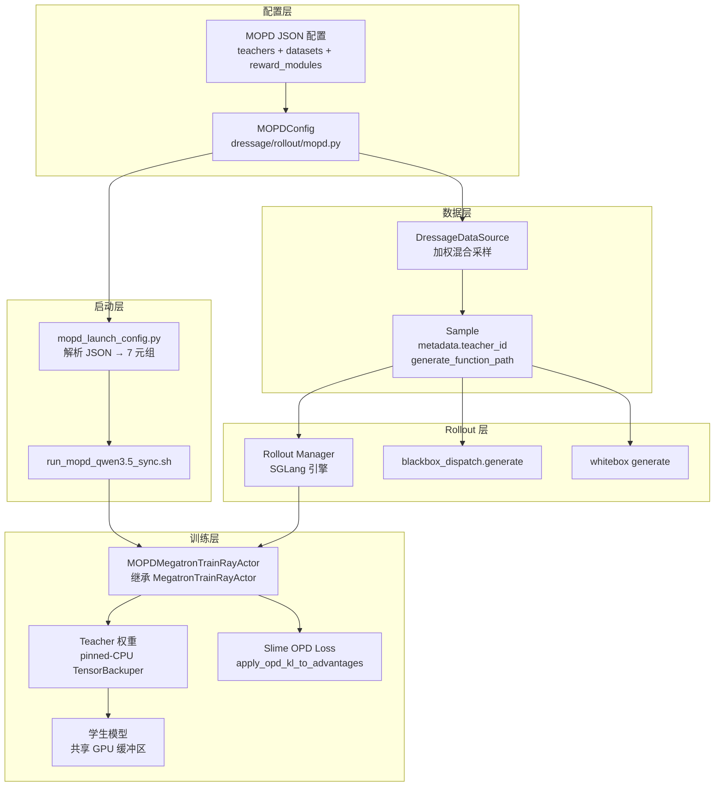
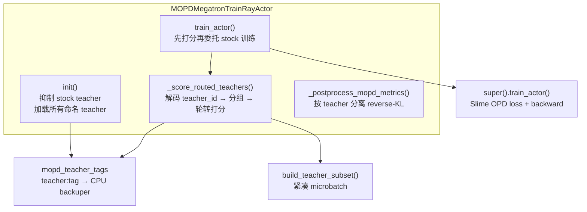
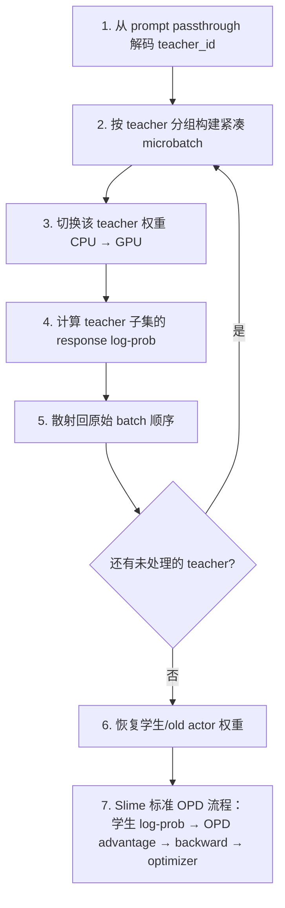

# Dressage MOPD 实现与架构

> Metadata-routed Multi-teacher On-Policy Distillation
>
> 在同一个学生 actor 的 GPU 上，用多个冻结的 Megatron teacher 蒸馏训练一个学生模型。

---

## 1. 概述

MOPD（Metadata-routed Multi-teacher OPD）是 Dressage 对 Slime 单 teacher 在线策略蒸馏（OPD）的多教师扩展。它的核心特征：

- **不启动独立的 teacher 服务**。Teacher 权重在学生 actor 初始化阶段一次性加载到 Slime 既有的 pinned-CPU `TensorBackuper`，GPU 显存被共享复用，只有 CPU 内存随 teacher 数量线性增长。
- **按 metadata 路由**。每条训练样本携带 `teacher_id`，训练时按 teacher 分组，依次把对应 teacher 权重恢复到共享 GPU 模型缓冲区，只对该 teacher 路由到的样本子集计算 response-token 对数概率。
- **零 Slime 源码修改**。通过 Slime 原生的 `actor_cls` factory hook 注入自定义 actor，不 monkey-patch 任何 Slime 模块。
- **学生与所有 teacher 必须架构、tokenizer、词表、token ID 完全一致**。

---

## 2. 原理：从 OPD 到 MOPD

### 2.1 OPD — 在线策略蒸馏

OPD（On-Policy Distillation）的核心思想：student 模型在自己的 rollout 轨迹上训练，同时用 teacher 模型对这些轨迹提供 token 级的密集监督。它不是替代 RL，而是作为 **KL 惩罚项叠加在任意 advantage estimator 之上**（GRPO、PPO、REINFORCE++ 等）。

**训练流程：**

1. Student 从自身策略 π_S 采样轨迹 ŷ ∼ π_S(·|x)
2. Teacher（冻结）在 student 的轨迹上计算每个 response token 的 log-prob：log π_T(y_t | x, ŷ_{<t})
3. Student 同样计算 log π_S(y_t | x, ŷ_{<t})
4. 计算 token 级 reverse KL，作为惩罚项加到 advantage 上

**数学公式：**

对 student 采样的轨迹 ŷ 中的每个 token 位置 t：

$$
\hat{A}_t = A_t - \lambda_{\text{opd}} \cdot \left( \log \pi_S(y_t \mid x, \hat{y}_{\lt t}) - \log \pi_T(y_t \mid x, \hat{y}_{\lt t}) \right)
$$

其中：

- $A_t$ 是基础 advantage estimator（如 GRPO）的原始优势值
- $\lambda_{\text{opd}}$ 是 `--opd-kl-coef`，控制蒸馏信号相对于 RL 奖励的权重
- 括号内是 token 级 reverse KL（student 相对 teacher 的对数概率差）

**为什么有效：**

- **On-policy**：数据来自 student 自身采样，训练分布与推理分布一致，避免 off-policy KD/SFT 的 exposure bias。
- **Dense feedback**：teacher 在每个 token 位置提供监督，而非序列级的稀疏奖励。即使 student 的最终答案错误，teacher 仍能在中间步骤提供梯度信号。
- **正交于 RL**：KL 惩罚与 advantage estimator 解耦，可与任意 RL 算法组合。

Slime 的实现见 `apply_opd_kl_to_advantages`（`slime/slime/backends/megatron_utils/loss.py`），支持两种 teacher 接入模式：

| 模式 | teacher 位置 | log-prob 计算时机 | 架构要求 |
|------|-------------|------------------|--------|
| `megatron` | 加载到训练进程 GPU | 训练前向传播时 | teacher 与 student 同架构 |
| `sglang` | 外部 SGLang 推理服务 | rollout 阶段通过 HTTP 获取 | 可异构 |

Dressage MOPD 基于 `megatron` 模式扩展。

### 2.2 MOPD — 多教师 metadata 路由扩展

MOPD 将单 teacher OPD 扩展为多 teacher：不同的训练样本可以路由到不同的冻结 teacher，在同一个学生 actor 上同时蒸馏多个 teacher 的知识。

**核心扩展：**

1. **Metadata 路由**：每条训练样本 i 携带 `teacher_id` τ(i)，指定该样本的权威 teacher。
2. **加权混合采样**：多个数据集按 `weight` 做加权轮转采样，每个数据集绑定一个 teacher。
3. **轮转打分**：每个训练 batch 中，按 teacher 分组，依次切换对应 teacher 权重到 GPU，仅对该 teacher 路由的样本子集计算 log-prob，再散射回原始 batch 顺序。

**数学公式：**

对路由到 teacher τ(i) 的样本 i 的 token 位置 t：

$$
\hat{A}_{i,t} = A_{i,t} - \lambda_{\text{opd}} \cdot \left( \log \pi_S(y_{i,t} \mid x_i, \hat{y}_{i,<t}) - \log \pi_{T_{\tau(i)}}(y_{i,t} \mid x_i, \hat{y}_{i,<t}) \right)
$$

与单 teacher OPD 的唯一区别：teacher 的 log-prob由样本路由到的 $\pi_{T_{\tau(i)}}$ 计算，而非全局唯一的 $\pi_T$。后续的 advantage 计算、policy loss、backward、optimizer step 完全不变——Slime 只看到 `rollout_data["teacher_log_probs"]` 这个列表，不关心它来自哪个 teacher。

**为什么需要多 teacher：**

- **多任务/多领域**：不同领域（如 ALFWorld + HotpotQA）各有专门的 teacher，单 teacher 难以同时覆盖。
- **知识聚合**：一个 student 从多个 specialized teacher 聚合知识，比从单一 generalist teacher 蒸馏更高效。
- **混合 rollout 模式**：不同数据集可配 `blackbox` 或 `whitebox` agent 模式，对应不同的 teacher checkpoint。

**关键约束：**

- 所有 teacher 和 student 必须同架构、同 tokenizer、同词表——因为它们共享同一组 GPU 模型缓冲区，通过权重切换复用。
- 若需异构 teacher（不同架构/大小），应使用 Slime 的 OPD sglang 模式，而非 MOPD。

---

## 3. 架构总览



---

## 4. 核心组件

### 3.1 配置层：`dressage/rollout/mopd.py`

MOPD 的全部配置由三个 frozen dataclass 表达：

```python
@dataclass(frozen=True)
class MOPDTeacher:
    teacher_id: str          # 唯一标识
    load: str                # Megatron checkpoint 根路径
    ckpt_step: int | None    # 可选 checkpoint 迭代号

@dataclass(frozen=True)
class MOPDDataset:
    name: str                              # 唯一名称（默认取 path 的 stem）
    path: str                              # 数据集文件路径
    teacher_id: str                        # 权威 teacher
    weight: float                          # 加权轮转采样权重
    metadata: dict[str, Any]               # 元数据（含注入的 teacher_id）
    agent_mode: str                        # "blackbox" | "whitebox"
    generate_function_path: str | None     # rollout 分发函数路径

@dataclass(frozen=True)
class MOPDConfig:
    teachers: dict[str, MOPDTeacher]
    datasets: tuple[MOPDDataset, ...] = ()
    reward_modules: tuple[str, ...] = ()
    runtime_env_keys: tuple[str, ...] = ()
    base_model: str | None = None
```

**关键设计决策：**

- **没有 domain router 或默认 teacher**。数据源直接写 `metadata["teacher_id"]`，路由是显式且强制的。
- **agent_mode 决定 rollout 分发**：`blackbox` 默认走 `dressage.rollout.generate.blackbox_dispatch.generate`；`whitebox` 必须显式指定 `generate_function_path`。
- **路径解析**：`load_mopd_config` 带有 `lru_cache`，且会把相对路径相对于 JSON 配置文件所在目录解析为绝对路径。
- **路由校验**：`route_mopd_teacher` 校验 `metadata["teacher_id"]` 必须存在于 `config.teachers`；`collect_mopd_teacher_ids` 额外校验同一父轨迹（`parent_traj_id`）的兄弟段必须路由到同一 teacher，否则训练前失败。

### 3.2 数据源层：`dressage/rollout/data_source.py`

`DressageDataSource` 在检测到 MOPD 配置时，从单数据集模式切换到**加权混合采样模式**：

```python
if self._use_text_first and mopd_config_path:
    mopd_config = load_mopd_config(mopd_config_path)
    if mopd_config.datasets:
        self._mixture_samples = []
        for dataset in mopd_config.datasets:
            dataset_samples = self._load_text_first(
                dataset.path, prompt_key, label_key, metadata_key,
                metadata_overrides=dataset.metadata,
                generate_function_path=dataset.generate_function_path,
            )
            self._mixture_samples.append(dataset_samples)
            self._mixture_weights.append(dataset.weight)
```

- 每个数据集独立加载，`weight` 控制平滑加权轮转（smoothed weighted-round-robin）。
- `dataset.metadata` 中的 `teacher_id` 被注入到每条样本的 `metadata` 中。
- `generate_function_path` 写入 `Sample.generate_function_path`，供 rollout 阶段按数据集分发。

### 3.3 Actor 层：`dressage/training/mopd_megatron_actor.py`

这是 MOPD 的核心。`MOPDMegatronTrainRayActor` 继承 Slime 的 `MegatronTrainRayActor`，只添加多教师策略：



#### `init()` — 多 teacher 加载

```python
def init(self, args, role, with_ref=False, with_opd_teacher=False):
    # 抑制 stock 单 teacher
    start_rollout_id = super().init(args, role, with_ref=with_ref, with_opd_teacher=False)
    if args.debug_rollout_only or role != "actor" or not with_opd_teacher:
        return start_rollout_id

    # 挂载 metrics 后处理钩子
    self._base_rollout_data_postprocess = self.rollout_data_postprocess
    self.rollout_data_postprocess = self._postprocess_mopd_metrics

    # 读取配置路径（参数或环境变量）
    config_path = getattr(args, "mopd_teacher_config", None) or \
        os.environ.get("DRESSAGE_MOPD_TEACHER_CONFIG")

    # 逐个加载 teacher 到 pinned-CPU TensorBackuper
    for teacher_id, teacher in load_mopd_config(config_path).teachers.items():
        tag = f"teacher:{teacher_id}"
        self._load_mopd_teacher(tag, teacher)
        self.mopd_teacher_tags[teacher_id] = tag

    self._switch_model("actor")  # 恢复学生权重
```

- 用 `with_opd_teacher=False` 调用父类，抑制 Slime 的单一 teacher 加载。
- `_load_mopd_teacher` 临时设置 `args.ckpt_step` 为 teacher 的 checkpoint step，调用父类 `load_other_checkpoint(tag, teacher.load)`，加载完后恢复原值——这样无需修改 Slime 即可支持命名 teacher tag。
- Teacher 权重存于 Slime 既有的 pinned-CPU `TensorBackuper`，GPU 显存不随 teacher 数量增长。

#### `_score_routed_teachers()` — 轮转打分

这是 MOPD 的核心算法，每个训练步执行：

```python
def _score_routed_teachers(self, rollout_data):
    # 1. 从 Slime 训练侧 prompt passthrough 字段解码 teacher_id
    teacher_ids = rollout_data.pop("prompt")

    routed_values = [None] * len(teacher_ids)
    for teacher_id in dict.fromkeys(teacher_ids):  # 保持出现顺序去重
        # 2. 构建该 teacher 的紧凑子集
        subset, selected_indices = build_teacher_subset(
            rollout_data, teacher_ids, teacher_id
        )
        # 3. 切换到该 teacher 权重
        self._switch_model(self.mopd_teacher_tags[teacher_id])
        # 4. 计算该 teacher 子集的 response log-prob
        output = self.compute_log_prob(
            get_data_iterator(subset),
            [len(subset["micro_batch_indices"])],
            store_prefix="teacher_",
        )
        values = output.get("teacher_log_probs")
        # 5. 散射回原始 batch 顺序
        for original_index, value in zip(selected_indices, values, strict=True):
            routed_values[original_index] = value

    # 6. 恢复学生/old actor 权重
    self._switch_model("old_actor" if self.args.keep_old_actor else "actor")

    # 7. 写回供 Slime OPD loss 使用
    rollout_data["teacher_log_probs"] = routed_values
```

#### `build_teacher_subset()` — 紧凑 microbatch 构建

动态 microbatch 可能包含路由到不同 teacher 的样本。该函数过滤并重映射索引：

```python
def build_teacher_subset(rollout_data, teacher_ids, teacher_id):
    selected_indices = [
        pos for pos, rid in enumerate(teacher_ids) if rid == teacher_id
    ]
    old_to_new = {old: new for new, old in enumerate(selected_indices)}

    # 重映射 microbatch 索引到紧凑的 teacher-local 数组
    compact_microbatches = []
    for microbatch in rollout_data["micro_batch_indices"]:
        compact = [old_to_new[idx] for idx in microbatch if idx in old_to_new]
        if compact:
            compact_microbatches.append(compact)

    # 提取该 teacher 子集的 tokens / masks / lengths 等字段
    subset = {"micro_batch_indices": compact_microbatches}
    for key in _SCORER_FIELDS:  # tokens, loss_masks, total_lengths, ...
        subset[key] = [rollout_data[key][idx] for idx in selected_indices]

    return subset, selected_indices
```

这保证了 Slime 的 `forward_only` 顺序恢复机制在子集上仍然有效。

### 3.4 训练驱动：`dressage/training/mopd_train.py`

该文件镜像 Slime 上游 `train.py`，**唯一语义差异**是向 `create_training_models` 传入自定义 `actor_cls`：

```python
def train(args):
    configure_logger()
    pgs = create_placement_groups(args)
    init_tracking(args)
    rollout_manager, num_rollout_per_epoch = create_rollout_manager(args, pgs["rollout"])
    actor_model, critic_model = create_training_models(
        args, pgs, rollout_manager,
        actor_cls=MOPDMegatronTrainRayActor,  # ← 唯一差异
    )
    # ... 以下与上游 train.py 完全一致
```

之所以需要单独的 driver 而非用上游 CLI，是因为上游在模型工厂暴露了 `actor_cls` 参数，但尚未在 stock CLI 上开放。兼容性测试（`tests/test_slime_compat.py`）会检测这个工厂契约的漂移。

### 3.5 启动配置：`dressage/training/mopd_launch_config.py`

Shell 启动脚本通过 `python3 -m dressage.training.mopd_launch_config` 解析 JSON，输出 7 元组供脚本消费：

```bash
mapfile -t MOPD_LAUNCH_CONFIG < <(
  python3 -m dressage.training.mopd_launch_config "${DRESSAGE_MOPD_TEACHER_CONFIG}"
)
```

| 索引 | 含义 | 用途 |
|------|------|------|
| `[0]` | 首数据集路径 | 传给 `--prompt-data` |
| `[1]` | agent_mode 列表（逗号分隔） | 日志/校验 |
| `[2]` | runtime_env_keys | 注入 Ray 环境变量 |
| `[3]` | reward_modules | 注册任务奖励模块 |
| `[4]` | base_model | `--load`（可选） |
| `[5]` | 首 teacher checkpoint 路径 | `--opd-teacher-load`（满足 Slime 校验） |
| `[6]` | 首 teacher ckpt_step | `--opd-teacher-ckpt-step` |

启动器传给 Slime 的关键参数：

```bash
--use-opd
--opd-type megatron
--opd-kl-coef "${OPD_KL_COEF:-0.1}"
--opd-teacher-load "${MOPD_LAUNCH_CONFIG[5]}"
```

第一个 teacher 路径仅用于满足 Slime 的参数校验并告诉 actor factory 需要 OPD teacher。`MOPDMegatronTrainRayActor.init` 会抑制这个 stock 单 teacher 加载，转而加载所有配置中的命名 teacher。

---

## 5. 每步执行流程

对每个 DP-本地训练 batch：



**详细说明：**

1. **解码路由**：Slime DP 分区训练侧的 `prompt` passthrough 字段携带 `teacher_id`。`_score_routed_teachers` 取出后立即从 `rollout_data` 移除，避免触发 Slime 的数值归约日志。
2. **分组**：对每个 distinct teacher（按出现顺序去重），调用 `build_teacher_subset` 构建紧凑的 teacher-local 子集。
3. **权重切换**：`_switch_model(tag)` 把对应 teacher 从 pinned CPU 恢复到共享 GPU 模型缓冲区。
4. **计算 log-prob**：仅对该 teacher 子集调用 Slime 的 `compute_log_prob`，取 `teacher_log_probs`。非最后 pipeline stage 不持有 response log-prob（返回 None，跳过）。
5. **散射**：按 `selected_indices` 写回 `routed_values` 的原始位置。
6. **恢复**：全部 teacher 处理完后，恢复学生（或 old actor，若 `keep_old_actor`）权重。
7. **标准 Slime**：学生 log-prob、OPD 优势（[apply_opd_kl_to_advantages](slime/slime/backends/megatron_utils/loss.py)）、反向传播、优化器步骤全部由上游 Slime 完成，无 MOPD 介入。

---

## 6. 与 Slime 的集成边界

MOPD 刻意不 patch Slime 模块，而是利用 Slime 的原生扩展点：

| 扩展点 | MOPD 的使用方式 |
|--------|----------------|
| `Sample.generate_function_path` | 每数据集的 rollout 分发（blackbox/whitebox） |
| 训练侧 `prompt` passthrough 字段 | 传递 `teacher_id`（打分前移除，避免触发 Slime 数值归约） |
| `create_training_models(..., actor_cls=...)` | 注入 `MOPDMegatronTrainRayActor` |
| `TensorBackuper` | 复用 Slime 的 pinned-CPU 权重备份/恢复机制 |
| `load_other_checkpoint(tag, load)` | 加载命名 teacher（临时设 `ckpt_step`） |
| `compute_log_prob` | 复用 Slime 的 response log-prob 计算 |
| DP 分区 / TP / CP 并行 | 完全复用 Slime 的分布式机制 |
| `rollout_data_postprocess` 钩子 | 挂载 MOPD 指标后处理，链式调用原始钩子 |

**没有 MOPD 代码在 `dressage/rollout/generate` 下，也没有 Slime 源码 patch。**

---

## 7. 指标上报

`_postprocess_mopd_metrics` 挂载到 Slime 的 `rollout_data_postprocess` 钩子，在 TP rank 0 且 pipeline 最后阶段上，按 teacher 分别上报：

| 指标路径 | 含义 |
|----------|------|
| `rollout/mopd/raw_reward_trainable_trajectory_mean/<teacher_id>` | 该 teacher 路由样本的可训练轨迹平均奖励 |
| `rollout/mopd/opd_reverse_kl_train_aggregation_mean/<teacher_id>` | 该 teacher 路由样本的采样 token reverse-KL 训练聚合均值 |

聚合函数 `_train_aggregation_mean_contribution` 复用 Slime 的 `get_sum_of_sample_mean`，并对 CP（context parallel）rank 做分数所有权折算：

```python
local_count = (
    sum(
        rollout_data["loss_masks"][index].sum().item()
        / rollout_mask_sums[index].item()
        for index in selected_indices
    )
    / mpu.get_context_parallel_world_size()
)
```

这使扁平化的兄弟段加总等于有效 loss 计数。Slime 会把 `rollout/*` 映射到 W&B 的 `rollout/step`。

Teacher ID 会经过 `_metric_component` 清洗（非字母数字字符替换为 `_`），确保 W&B 指标路径安全，并校验不同 teacher 的清洗后名称不能冲突。

---

## 8. 配置参考

示例配置：`examples/data/mopd/mopd_alfworld_hotpotqa.example.json`

```json
{
  "teachers": {
    "alfworld_teacher": {
      "load": "/checkpoints/alfworld_qwen3.5_4b",
      "ckpt_step": 1000
    },
    "hotpotqa_teacher": {
      "load": "/checkpoints/hotpotqa_qwen3.5_4b"
    }
  },
  "datasets": [
    {
      "name": "alfworld",
      "path": "data/alfworld/train.jsonl",
      "teacher_id": "alfworld_teacher",
      "weight": 1.0,
      "agent_mode": "whitebox",
      "generate_function_path": "dressage.recipes.alfworld.agent_whitebox.generate"
    },
    {
      "name": "hotpotqa",
      "path": "data/hotpotqa/train.jsonl",
      "teacher_id": "hotpotqa_teacher",
      "weight": 1.0,
      "agent_mode": "blackbox"
    }
  ],
  "reward_modules": [
    "dressage.recipes.alfworld.reward",
    "dressage.recipes.hotpotqa.reward"
  ],
  "runtime_env_keys": [
    "ALFWORLD_DATA",
    "HOTPOTQA_DATA"
  ]
}
```

**字段说明：**

| 字段 | 必填 | 说明 |
|------|------|------|
| `teachers.<id>.load` | 是 | 冻结的 Megatron checkpoint 根路径 |
| `teachers.<id>.ckpt_step` | 否 | checkpoint 迭代号（不填则取 latest） |
| `datasets[].teacher_id` | 是 | 该数据集的权威 teacher（必须存在于 teachers） |
| `datasets[].weight` | 否 | 加权轮转采样权重，默认 1.0，必须为正 |
| `datasets[].agent_mode` | 是 | `blackbox` 或 `whitebox` |
| `datasets[].generate_function_path` | whitebox 必填 | blackbox 默认 `dressage.rollout.generate.blackbox_dispatch.generate` |
| `datasets[].metadata` | 否 | 附加元数据（`teacher_id` 会被自动注入） |
| `reward_modules` | 否 | 任务奖励注册模块列表 |
| `runtime_env_keys` | 否 | 任务特定的环境变量名，复制到 Ray runtime env |
| `base_model` | 否 | 学生模型初始权重（不填则用 `--ref-load`） |

---

## 9. 启动方式

```bash
export DRESSAGE_MOPD_TEACHER_CONFIG=/path/to/mopd.json

TP_SIZE=4 \
CP_SIZE=1 \
ROLLOUT_BATCH_SIZE=16 \
N_SAMPLES_PER_PROMPT=8 \
GLOBAL_BATCH_SIZE=128 \
bash examples/scripts/run_mopd_qwen3.5_sync.sh
```

启用 W&B：

```bash
USE_WANDB=1 \
WANDB_PROJECT=slime-dev \
WANDB_GROUP=mopd-alfworld-hotpotqa \
bash examples/scripts/run_mopd_qwen3.5_sync.sh
```

**启动流程：**

1. Shell 脚本调用 `python3 -m dressage.training.mopd_launch_config` 解析 JSON，得到 7 元组。
2. 据此拼装 Slime 参数：`--prompt-data`、`--opd-teacher-load`、reward modules 等。
3. 转发 `DRESSAGE_MOPD_TEACHER_CONFIG` 环境变量给 Ray actor。
4. 执行 `python3 -m dressage.training.mopd_train`，由 `MOPDMegatronTrainRayActor` 接管训练。

`SEED` 和 `ROLLOUT_SEED` 由启动器显式转发。Checkpoint 路径在启动配置阶段即被校验（`mopd_launch_config.resolve_launch_values` 的 `validate_paths=True`）。

---

## 10. 设计约束与注意事项

- **同架构约束**：所有 teacher 和学生必须架构、tokenizer、词表、token ID 完全一致。若需异构 teacher，应使用 Slime 的 OPD sglang 模式（`--opd-type sglang`），而非 MOPD。
- **CPU 内存**：teacher 权重存于 pinned-CPU，内存随 teacher 数量线性增长。
- **轮转开销**：每个 distinct teacher 需要一次权重切换 + 一次前向。teacher 数量越多，每步训练开销越大。
- **不支持 routing replay**：`_score_routed_teachers` 显式拒绝 `use_routing_replay`（与多 teacher 路由冲突）。
- **兄弟段一致性**：同一父轨迹的多片段必须路由到同一 teacher，否则 `collect_mopd_teacher_ids` 在训练前失败。

---

## 11. 文件索引

| 文件 | 职责 |
|------|------|
| [dressage/rollout/mopd.py](../dressage/rollout/mopd.py) | 配置数据类、JSON 加载、路径解析、路由校验 |
| [dressage/training/mopd_megatron_actor.py](../dressage/training/mopd_megatron_actor.py) | 核心 actor：多 teacher 加载、轮转打分、指标上报 |
| [dressage/training/mopd_train.py](../dressage/training/mopd_train.py) | 训练驱动（镜像上游 train.py，注入 actor_cls） |
| [dressage/training/mopd_launch_config.py](../dressage/training/mopd_launch_config.py) | JSON 解析、路径校验、输出 7 元组 |
| [dressage/rollout/data_source.py](../dressage/rollout/data_source.py) | 加权混合采样、teacher_id 注入 metadata |
| [examples/scripts/run_mopd_qwen3.5_sync.sh](../examples/scripts/run_mopd_qwen3.5_sync.sh) | 一键启动脚本 |
| [examples/data/mopd/](../examples/data/mopd/) | 示例配置 |
| [tests/test_mopd.py](../tests/test_mopd.py) | 配置解析与路由校验测试 |
| [tests/test_mopd_metrics.py](../tests/test_mopd_metrics.py) | 指标聚合测试 |
